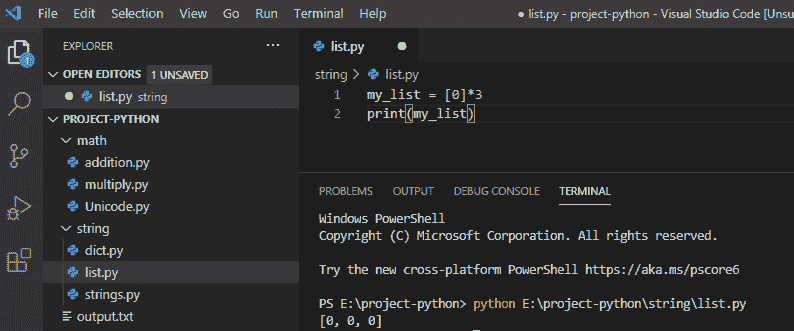
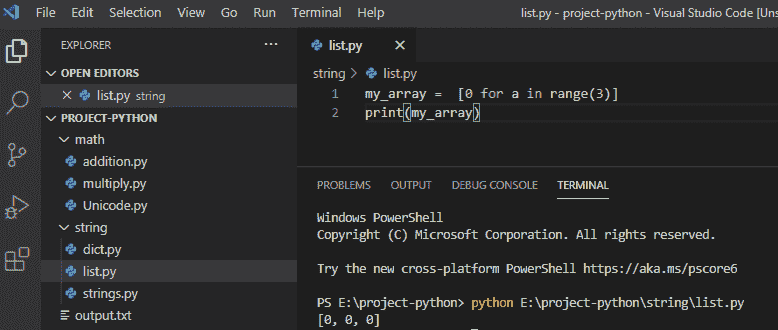
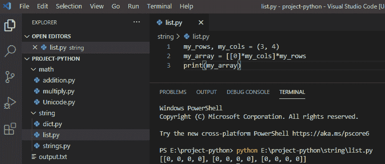
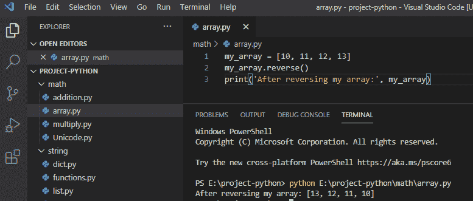
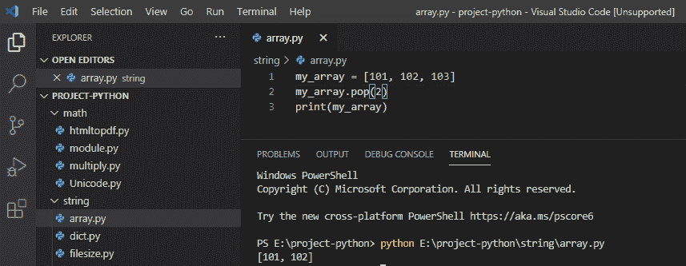
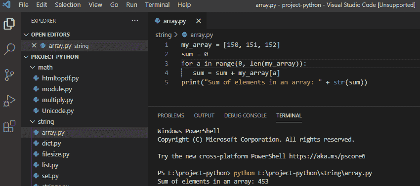
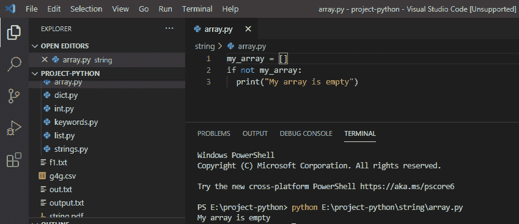

# 在 Python 中创建一个空数组

> 原文：<https://pythonguides.com/create-an-empty-array-in-python/>

[](https://sharepointsky.teachable.com/p/python-and-machine-learning-training-course)

在这个 [Python 教程](https://pythonguides.com/python-download-and-installation/)中，我们将讨论 Python 中的内置支持如何为[数组工作。同样，我们可以通过使用](https://pythonguides.com/python-array/) [Python list](https://pythonguides.com/python-list-methods/) 和一些例子来创建一个数组。

*   如何创建空数组
*   如何在 Python 中创建空的 2D 数组
*   如何在 python 中反转数组
*   从数组 python 中移除元素
*   如何在 python 中对数组求和
*   检查数组是否为空 python

目录

[](#)

*   [创建空数组 Python](#Create_empty_array_Python "Create empty array Python")
*   [在 Python 中创建空的 2D 数组](#Create_empty_2D_arrays_in_Python "Create empty 2D arrays in Python")
*   [如何在 python 中反转数组](#How_to_reverse_an_array_in_python "How to reverse an array in python")
*   [从数组 python 中移除元素](#Remove_element_from_array_python "Remove element from array python")
*   [如何在 python 中对数组求和](#How_to_sum_an_array_in_python "How to sum an array in python")
*   [检查数组是否为空 python](#Check_if_an_array_is_empty_python "Check if an array is empty python")

## 创建空数组 Python

在 python 中，我们没有对数组的内置支持，但是可以使用 [python 列表](https://pythonguides.com/create-list-in-python/)。创建一个列表[0]并乘以数字，然后我们将得到一个空数组。

**举例:**

```py
my_list = [0]*3
print(my_list)
```

写完上面的代码(创建空数组 Python)，你将打印出 `" my_list "` 然后输出将显示为 **" [ 0，0，0 ] "** 。在这里，我们创建了一个列表[0]并将其乘以“x ”,其中“x”可以是任何数字，以获得长度，每个元素都将是“0”。

你可以参考下面的截图在 Python 中创建空数组



Create empty array Python

这就是我们如何在 python 中创建空数组。

我们还可以通过列表理解在 python 中创建一个空数组，其中我们将使用带有 range()的 for 循环。

**举例:**

```py
my_array = [0 for a in range(3)]
print(my_array)
```

写完上面的代码(创建空数组 Python)，你将打印出 `" my_array "` 然后输出将显示为 **" [ 0，0，0 ] "** 。这里，for 循环遍历一个序列，range()生成一个带有数字的序列，并创建一个空数组。

你可以参考下面的截图在 Python 中创建空数组



Create an empty array in Python

这就是我们如何在 python 中创建空数组的方法

## 在 Python 中创建空的 2D 数组

在 python 中，我们可以通过使用列表在 python 中创建 2D 数组。 **2D 数组**是数组中的数组。在 2D 数组中，元素的位置由 2 表示，由行和列表示。

**举例:**

```py
my_rows, my_cols = (3, 4)
my_array = [[0]*my_cols]*my_rows
print(my_array)
```

写完上面的代码(用 Python 创建一个空的 2D 数组)，你将打印出 `" my_array "` 然后输出将显示为 **" [ [0，0，0，0]，[0，0，0]，[0，0，0] ] "** 。这里，行是 3，列是 4，列表是[0]，它与行和列相乘。

你可以参考下面的截图在 Python 中创建空的 2D 数组



Create empty 2D arrays in Python

这就是我们如何在 python 中创建空的 2D 数组。

## 如何在 python 中反转数组

在 python 中，为了反转 python 中的数组，我们有一个名为 `reverse()` 的内置方法，它将反转项目。

**举例:**

```py
my_array = [10, 11, 12, 13]
my_array.reverse()
print('After reversing my array:', my_array)
```

写完上面的代码(如何在 python 中反转一个数组)，你将打印出 `" my_array "` ，然后输出将显示为 **" [ 13，12，11，10 ] "** 。在这里，reverse()方法将反转项目的顺序。

你可以参考下面的截图如何在 python 中反转一个数组



How to reverse an array in python

这是**如何在 python 中反转一个数组**

## 从数组 python 中移除元素

在 python 中，要从数组中移除元素，我们可以使用 `pop()` 方法从列表 python 中移除特定的元素。

**举例:**

```py
my_array = [101, 102, 103]
my_array.pop(2)
print(my_array)
```

写完上面的代码后(从数组 python 中移除一个元素)，你将打印出 `" my_array "` ，然后输出将显示为 **" [ 101，102 ] "** 。这里，pop()方法将从数组中移除指定的元素。

你可以参考下面的截图如何从数组 python 中移除元素



Remove element from array python

这就是我们如何从数组 python 中移除柠檬的方法

## 如何在 python 中对数组求和

在 python 中，为了对数组中的元素求和，我们将使用**来循环**通过一个数组，它将在每次迭代中添加元素的值。

**举例:**

```py
my_array = [150, 151, 152]
sum = 0;
for a in range(0, len(my_array)):
sum = sum + my_array[a];
print("Sum of element in an array: " + str(sum));
```

写完上面的代码(如何在 python 中对数组求和)，你将打印出 `" sum "` ，然后输出将显示为**"数组中元素的总和:453 "** 。这里，我们将使用 for 循环，它将在每次迭代中添加所有元素。

你可以参考下面的截图如何在 python 中对数组求和



How to sum an array in python

这是**如何在 python 中对数组求和**

## 检查数组是否为空 python

在 python 中，为了检查数组是否为空，我们将使用 **if 条件**来检查数组是否为空。

**举例:**

```py
my_array = []
if not my_array:
print("My array is empty")
```

写完上面的代码(检查一个数组是否是空的 python)，你将打印这些代码，然后输出将显示为**“我的数组是空的”**。这里，我们将使用 if 条件来检查我的数组是否为空。

你可以参考下面的截图检查一个数组是否为空 python。



Check if an array is empty python

这就是我们如何**检查一个数组是否为空 python**

您可能会喜欢以下 Python 教程:

*   [python 中的无效语法](https://pythonguides.com/invalid-syntax-in-python/)
*   [语法错误标识符 python3 中的无效字符](https://pythonguides.com/syntaxerror-invalid-character-in-identifier-python3/)
*   [Python 加法示例](https://pythonguides.com/python-addition/)
*   [Python 中的乘法与例题](https://pythonguides.com/multiply-in-python/)
*   [如何在 Python 中处理 indexerror:字符串索引超出范围](https://pythonguides.com/indexerror-string-index-out-of-range-python/)
*   [解析 Python 时出现意外的 EOF](https://pythonguides.com/unexpected-eof-python/)

在本教程中，我们学习了如何在 python 中使用数组。

*   如何创建空数组
*   如何在 Python 中创建空的 2D 数组
*   如何在 python 中反转数组
*   从数组 python 中移除元素
*   如何在 python 中对数组求和
*   检查数组是否为空 python

[Bijay Kumar](https://pythonguides.com/author/fewlines4biju/)

Python 是美国最流行的语言之一。我从事 Python 工作已经有很长时间了，我在与 Tkinter、Pandas、NumPy、Turtle、Django、Matplotlib、Tensorflow、Scipy、Scikit-Learn 等各种库合作方面拥有专业知识。我有与美国、加拿大、英国、澳大利亚、新西兰等国家的各种客户合作的经验。查看我的个人资料。

[enjoysharepoint.com/](https://enjoysharepoint.com/)[](https://www.facebook.com/fewlines4biju "Facebook")[](https://www.linkedin.com/in/fewlines4biju/ "Linkedin")[](https://twitter.com/fewlines4biju "Twitter")