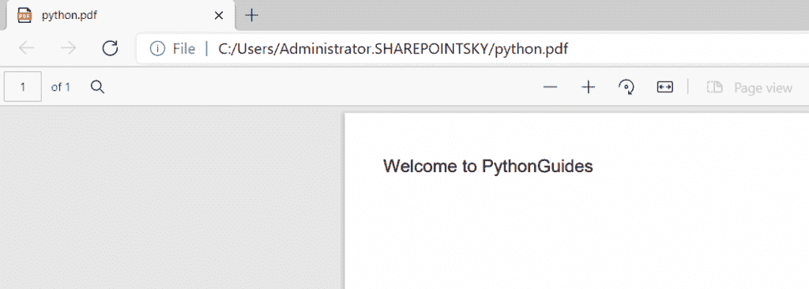
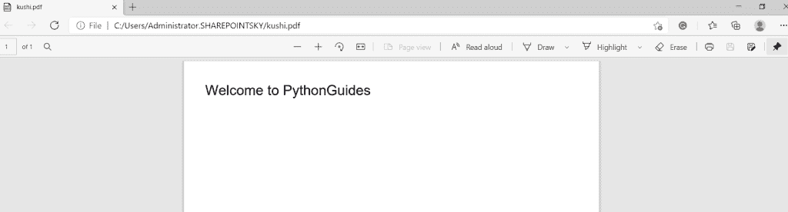
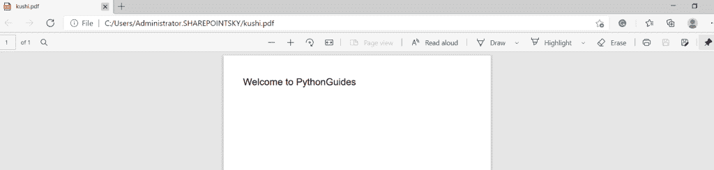
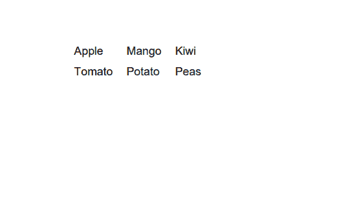
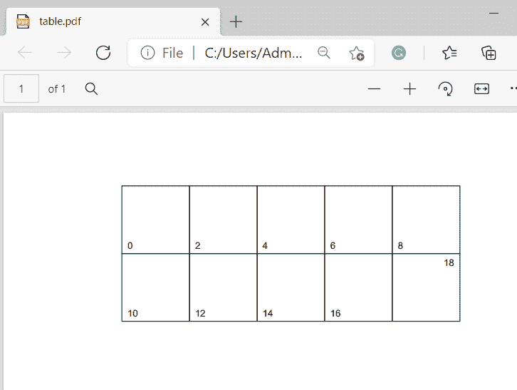
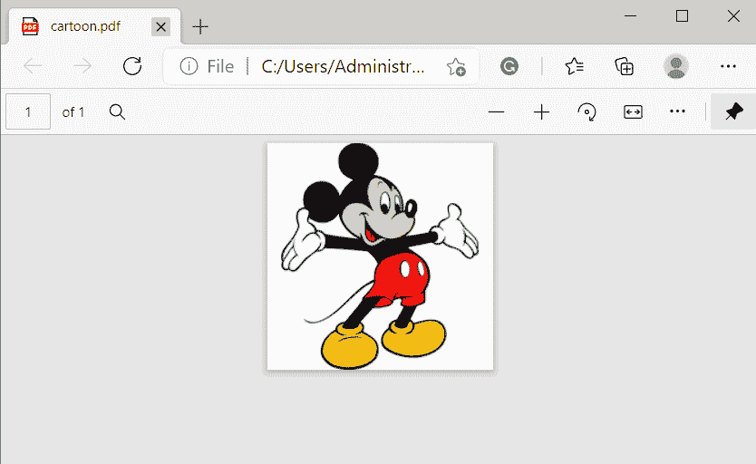
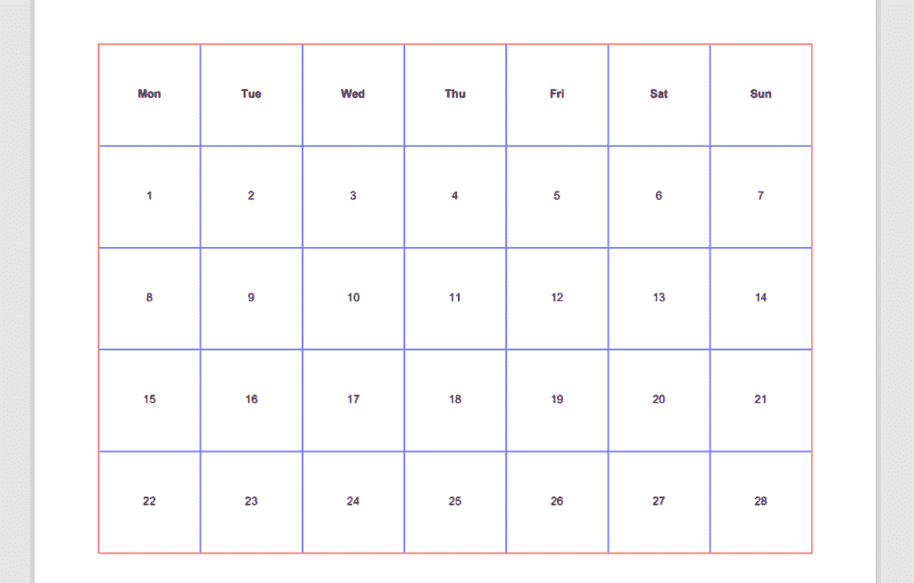
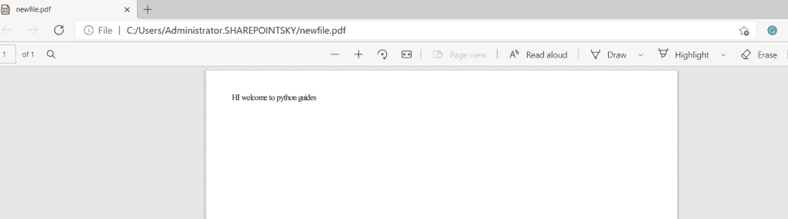
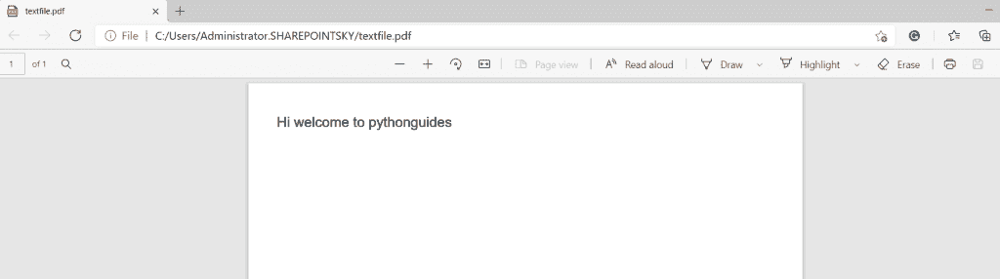
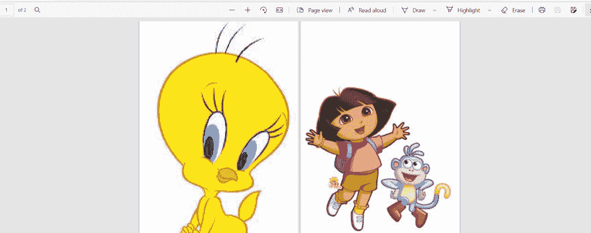

# 用 Python 创建和修改 PDF 文件

> 原文：<https://pythonguides.com/create-and-modify-pdf-file-in-python/>

[](https://sharepointsky.teachable.com/p/python-and-machine-learning-training-course)

在本 [Python 教程](https://pythonguides.com/python-programming-for-the-absolute-beginner/)中，我们将学习如何**在 Python** 中创建和修改 pdf 文件，我们还将涉及以下主题:

*   如何用 python 创建 pdf 文件
*   使用 A4 尺寸创建 pdf
*   采用 A5 尺寸创建 pdf
*   使用 python 创建 pdf 格式的表格
*   使用 python 在 pdf 中创建带有网格的表格
*   Python 从图像创建 pdf
*   如何在 python 中旋转 pdf
*   如何创建一年中天数的 pdf python
*   Python 从 HTML 创建 pdf
*   Python 从文本文件创建 pdf
*   Python 从图像创建 pdf，每个页面都有单独的图像大小

`PDF`–**便携文档格式**

为了**在 Python** 中创建 pdf，我们可以采用不同大小的页面，例如:

*   A4 号
*   A3 号
*   A5 号
*   信
*   合法的

目录

[](#)

*   [如何用 python 创建 pdf 文件](#How_to_create_a_pdf_file_in_python "How to create a pdf file in python")
*   [在 Python 中以 A4 尺寸创建 pdf](#Create_pdf_by_taking_size_A4_in_Python "Create pdf by taking size A4 in Python")
*   [在 Python 中采用 A5 大小创建 pdf](#Create_pdf_by_taking_size_A5_in_Python "Create pdf by taking size A5 in Python")
*   [使用 Python 创建 pdf 格式的表格](#Create_a_table_in_pdf_using_Python "Create a table in pdf using Python")
*   [使用 python 创建 pdf 格式的表格](#Create_a_table_with_the_grid_in_pdf_using_python "Create a table with the grid in pdf using python")
*   [Python 从图像创建 pdf](#Python_create_pdf_from_images "Python create pdf from images")
*   [如何在 Python 中旋转 pdf](#How_to_rotate_a_pdf_in_Python "How to rotate a pdf in Python")
*   [如何创建一年中天数的 pdf python](#How_to_create_a_pdf_of_days_in_a_year_python "How to create a pdf of days in a year python")
*   [Python 从 HTML 创建 pdf](#Python_create_pdf_from_HTML "Python create pdf from HTML")
*   [Python 从文本文件创建 pdf](#Python_create_a_pdf_from_a_text_file "Python create a pdf from a text file")
*   [Python 从图像创建 pdf，每个页面都有单独的图像大小](#Python_create_pdf_from_images_with_each_page_having_individual_image_sizes "Python create pdf from images with each page having individual image sizes")

## 如何用 python 创建 pdf 文件

现在，我们可以看到**如何用 python 创建一个 pdf 文件**。

*   在这个例子中，我从 FPDF 导入了一个名为 **FPDF 的模块。**fpdf 是一个用于在 python 中生成 pdf 文档的库。
*   为了添加页面，我使用了 `pdf.add_page()` 并设置了使用的字体**。在这里，我使用了 `Arial-type` 字体，并指定字号= 14。**
*   `pdf.cell` 用于打印带有可选边框和背景的单元格。
*   将**宽度= 200** 、**高度= 10** 、 **txt = "欢迎使用 PythonGuides "、**和长度= 1 并取**左**对齐为 `align="L"` 。
*   为了生成 pdf 文件，我使用了 `pdf.output("python.pdf")` 。python.pdf 的**是带有扩展名的 pdf 的名称。**

示例:

```py
from fpdf import FPDF
pdf = FPDF()
pdf.add_page()
pdf.set_font("Arial", size=14)
pdf.cell(200, 10, txt="Welcome to PythonGuides", ln=1, align="L")
pdf.output("python.pdf")
```

我们可以看到生成的 pdf 文件作为输出。您可以参考下面的输出截图。



How to create a pdf file in python

这就是如何在 Python 中**创建 pdf 文件。**

你可能会喜欢 [Python 串联列表](https://pythonguides.com/python-concatenate-list/)和 [Python 字符串格式化示例](https://pythonguides.com/python-string-formatting/)。

## 在 Python 中以 A4 尺寸创建 pdf

现在，我们可以看到**如何在 python 中以 A4 大小**创建 pdf。

*   在这个例子中，我从 fPDF 中导入了一个名为 **FPDF 的模块，并声明了一个变量为 pdf，并指定了 orientation =‘p’，其中 p 为纵向，单位为尺寸，格式为‘A4’。**
*   字体取“Arial”，size=20，单元格取 200，10，**“欢迎使用 python guides”**是要写入 pdf 文件的文本，长度赋值为 length=1，对齐方式设置为左对齐。
*   为了生成 pdf 文件，我使用了 `pdf.output("kushi.pdf")` 。 `kushi` 是带有扩展名的文件名。

示例:

```py
from fpdf import FPDF
pdf = FPDF(orientation='P', unit='mm', format='A4')
pdf.add_page()
pdf.set_font("Arial", size=20)
pdf.cell(200, 10, txt="Welcome to PythonGuides", ln=1, align="L")
pdf.output("kushi.pdf")
```

在这里，我们可以看到以 A4 格式生成的 pdf 作为输出。您可以参考下面的输出截图。



Create pdf by taking size A4

这就是如何在 Python 中**以 A4 大小创建 pdf。**

阅读: [PdfFileWriter Python 示例](https://pythonguides.com/pdffilewriter-python-examples/)

## 在 Python 中采用 A5 大小创建 pdf

现在，我们可以看到**如何通过在 python 中取大小 A5** 来创建 pdf。

*   在这个例子中，我从 fPDF 中导入了一个名为 **FPDF 的模块，并声明了一个变量为 pdf，并指定了 orientation =‘p’，其中 p 为纵向，单位为 `mm` ，格式为‘A5’。**
*   字体取“Arial”，size=20，单元格取 200，10，**“欢迎使用 python guides”**是要写入 pdf 文件的文本。长度=1，对齐方式设置为左对齐。
*   为了生成 pdf 文件，我使用了 `pdf.output("kushi.pdf")` 。kushi 是文件名加上**和**扩展名。

示例:

```py
from fpdf import FPDF
pdf = FPDF(orientation='P', unit='mm', format='A5')
pdf.add_page()
pdf.set_font("Arial", size=15)
pdf.cell(200, 10, txt="Welcome to PythonGuides", ln=1, align="L")
pdf.output("kushi.pdf")
```

在这里，我们可以看到以 A5 格式生成的 pdf 作为输出。您可以参考下面的输出截图。



这就是如何在 Python 中**以 A5 大小创建 pdf。**

你可能喜欢[如何在 Python 中读取视频帧](https://pythonguides.com/read-video-frames-in-python/)？

## 使用 Python 创建 pdf 格式的表格

在这里，我们可以看到**如何使用 python 在 pdf** 中创建表格。

*   在这个例子中，我从 reportlab.lib 导入了名为 **colors 的模块，从 reportlab.lib.pagesizes** 导入了模块 **A4。还从 reportlab.platypus.** 导入了 **SimpleDocTemplate、Table、TableStyle 等模块**
*   `pdf.cell` 用于打印带有可选边框和背景的单元格。
*   名为 document 的变量被声明并赋值为 SimpleDocTemplate**(" table.pdf "，pagesize=A4)** ，table . pdf 是 pdf 文件的名称，页面大小为 A4。
*   一个空变量被声明为条目，另一个变量被声明为包含一些条目的数据。
*   为了创建一个表格，我使用了 `t=Table(data)` 并将条目插入到表格 `items.append(t)` 中。
*   `document.build(items)` 用于自动生成 pdf。

示例:

```py
from reportlab.lib import colors
from reportlab.lib.pagesizes import A4
from reportlab.platypus import SimpleDocTemplate, Table, TableStyle
document = SimpleDocTemplate("table.pdf", pagesize=A4)
items = []
data= [['Apple', 'Mango', 'Kiwi'],
['Tomato', 'Potato', 'Peas']]
t=Table(data)
items.append(t)
document.build(items)
```

下面的屏幕截图显示了生成的 pdf，输出为不带网格的表格。



Create a table in pdf using python

这就是如何使用 python 在 pdf 中**创建表格。**

阅读，[从 PDF Python 中提取文本](https://pythonguides.com/extract-text-from-pdf-python/)

## 使用 python 创建 pdf 格式的表格

在这里，我们可以看到**如何使用 python 在 pdf** 中创建带有网格的表格。

*   在这个例子中，我从 reportlab.lib 中导入了一个名为 **colors 的模块，从 reportlab.lib.pagesizes.** 中导入了 letter，inch
*   ****颜色模块**有一些我们可以使用的预定义的基本颜色。**
*   **模块 **SimpleDocTemplate，Table，TableStyle** 是从 reportlab.platypus 导入的。**
*   **一个空变量被声明为条目，另一个变量被声明为包含一些条目的数据。**
*   **为了创建一个表格，我使用了 `t=Table(data)` 并将条目插入到表格 `items.append(t)` 中。**
*   **Reportlab 中的索引从第一行第一列的`(0, 0)`开始。**
*   **所以`(1, 1)`只将样式应用于第一行下面和第一列右边的所有内容。**
*   **为了得到 2 行 5 列，我使用了 **t=Table(data，5*[1*inch]，2*[1*inch])** 。**
*   **表格的样式由对齐方式给出，如右对齐和上对齐，也使用了变号。**
*   **INNERGRID 用于拆分表格。**
*   **`items.append(t)` 用于将数据追加到表格中。**
*   **`document.build(items)` 用于自动生成 pdf。**

 **示例:

```py
from reportlab.lib import colors
from reportlab.lib.pagesizes import letter, inch
from reportlab.platypus import SimpleDocTemplate, Table, TableStyle
document = SimpleDocTemplate("table.pdf", pagesize=letter)
items = []
data= [['0', '2', '4', '6', '8'],
['10', '12', '14', '16', '18']]
t=Table(data,5*[1*inch], 2*[1*inch])
t.setStyle(TableStyle([('ALIGN',(1,1),(-2,-2),'RIGHT'),
('VALIGN',(-1,-1),(-1,-1),'RIGHT'),
('ALIGN',(-1,-1),(-1,-1),'RIGHT'),
('VALIGN',(-1,-1),(-1,-1),'TOP'),
('INNERGRID', (0,0), (-1,-1), 1, colors.black),
('BOX', (0,0), (-1,-1), 0.25, colors.black),]))
items.append(t)
document.build(items)
```

下面的屏幕截图显示了输出:



Create a table with the grid in pdf using python

这就是如何使用 python 在 pdf 中用网格创建一个表格。

## Python 从图像创建 pdf

在这里，我们可以看到**如何用 python 从图像**创建 pdf。

*   在这个例子中，我从 `PIL` 和 `OS` 导入了一个名为 `img2pdf` 的模块和模块映像。
*   该变量被声明为 imagepath，并被赋予图像的路径。
*   这里`cartoon.pdf`是要创建的 pdf 的名称。
*   使用 f.write 在 pdf **中写入图像文件，然后使用 file.close()关闭文件。**

示例:

```py
import img2pdf 
from PIL import Image 
import os 
imagepath = r"C:\Users\Administrator.SHAREPOINTSKY\Downloads\mickey.png"
pdfname = "cartoon.pdf"
image = Image.open(imagepath) 
pdf_bytes = img2pdf.convert(image.filename) 
file = open(pdfname, "wb") 
file.write(pdf_bytes) 
image.close() 
file.close() 
```

我们可以看到图像文件是 pdf 格式的输出。您可以参考下面的输出截图:



Python create pdf from images

这就是如何用 Python 从图像中**创建 pdf。**

## 如何在 Python 中旋转 pdf

现在，我们可以看到**如何在 python 中旋转 pdf** 。

*   在这个例子中，我导入了一个名为 `pikepdf` 的模块，为了选择 pdf，我使用了 **pdf = pikepdf。Pdf.open('卡通. Pdf ')。**
*   `cartoon.pdf`是用于循环旋转 pdf 的文件名，我已经使用了**页面。旋转= 180 度**。
*   为了用另一个名字保存新的旋转 pdf 文件，我使用了**pdf . save(' rotated . pdf ')**【rotated.pdf】的**是新文件的名字。**

示例:

```py
import pikepdf
pdf = pikepdf.Pdf.open('cartoon.pdf')
for page in pdf.pages:
   page.Rotate = 180
pdf.save('rotated.pdf')
```

下面的屏幕截图显示了输出:


How to rotate the pdf in python

这就是如何在 Python 中**旋转 pdf。**

## 如何创建一年中天数的 pdf python

现在，我们可以看到如何用 python 创建一年中天数的 pdf。

*   在这个例子中，我从**report lab . lib 中导入了一个名为 `inch` 的模块，从 **reportlab.lib 中导入了颜色**，**并从 reportlab.lib.pagesizes. 中导入了 `A4`
*   模块 **SimpleDocTemplate，Table，TableStyle 从 reportlab.platypus** 导入。
*   从 reportlab.graphics.shapes. 导入**模块**图纸****
*   为了获得 pdf 格式的日历，我导入了一个名为**日历**的模块。
*   一个空变量被声明为条目，另一个变量被声明为包含一些条目的数据。
*   为了指定一周中的每一天，我使用了**cal =[' Mon '，' Tue '，' Wed '，' Thu '，' Fri '，' Sat '，' Sun']]** 。
*   **。extend** 用于将元素添加到表中。
*   为了划分表格的行和列，我使用了 **table = Table(cal，7*[inch]，len(cal) * [inch])。**
*   我使用了 **Helvetica 字体**并根据要求对齐，内部网格用蓝色着色，盒子用红色着色。
*   `document.build(items)` 用于自动生成 pdf。

示例:

```py
from reportlab.lib.units import inch
from reportlab.lib import colors
from reportlab.lib.pagesizes import A4
from reportlab.platypus import SimpleDocTemplate, Table, TableStyle
from reportlab.graphics.shapes import Drawing
import calendar
doc = SimpleDocTemplate('cal.pdf', pagesize=A4)
items = []
cal = [['Mon', 'Tue', 'Wed', 'Thu', 'Fri', 'Sat', 'Sun']]
cal.extend(calendar.monthcalendar(2021,2))
table = Table(cal, 7*[inch], len(cal) * [inch])
table.setStyle(TableStyle([
        ('FONT', (0, 0), (-1, -1), 'Helvetica'),
        ('FONT', (0, 0), (-1, 0), 'Helvetica-Bold'),
        ('FONTSIZE', (0, 0), (-1, -1), 8),
        ('INNERGRID', (0, 0), (-1, -1), 0.5, colors.blue),
        ('BOX', (0, 0), (-1, -1), 0.5, colors.red),
        ('ALIGN', (0, 0), (-1, -1), 'CENTER'),
        ('VALIGN', (0, 0), (-1, -1), 'MIDDLE'),
    ]))
items.append(table)
doc.build([table])
```

下面的截图显示了 pdf 格式的日历作为输出。



How to create a pdf of days in a year python

这就是如何在 Python 中**创建一年中天数的 pdf。**

## Python 从 HTML 创建 pdf

*   首先，我们必须通过使用 **pip 安装 pdfkit** 来安装 `pdfkit` 。
*   我们必须使用链接下载 WKHTMLTOPDF:[WKHTMLTOPDF](https://github.com/wkhtmltopdf/wkhtmltopdf/releases/download/0.12.4/wkhtmltox-0.12.4_msvc2015-win64.exe)
*   下载后，我们必须复制 wkhtmltopdf 文件的路径，并将其粘贴到环境变量中。

在这里，我们可以看到**如何用 python 从 HTML** 创建 pdf。

*   在这个例子中，我导入了一个名为 `pdfkit` 的模块。
*   文件的路径和 `.exe.` 一起分配，定义变量 config，分配 `pdfkit.configuration()` ，以配置选项为初始参数
*   为了将 html 文件转换成 pdf，我使用了**pdf kit . from _ file(' kavita . html '，' newfile.pdf '，configuration=config。**
*   `kavita.html`是 Html 文件的名称，newfile 是生成的 pdf 文件。

示例:

```py
import pdfkit
path_wkhtmltopdf = r'C:/Users/Administrator.SHAREPOINTSKY/Desktop/Work/wkhtmltopdf/bin/wkhtmltopdf.exe'
config = pdfkit.configuration(wkhtmltopdf=path_wkhtmltopdf)
pdfkit.from_file('kavita.html', 'newfile.pdf', configuration=config)
```

我们可以看到生成的新 pdf 作为输出。您可以参考下面的输出截图。



Python create pdf from HTML

这就是我们如何用 Python 从 HTML 中**创建 pdf。**

## Python 从文本文件创建 pdf

在这里，我们可以看到如何用 python 从文本文件创建 pdf。

*   在这个例子中，我从 fpdf 导入了一个名为 **FPDP 的模块。**这是一个用来生成 pdf 文档的库。
*   为了添加页面，我使用了 `pdf.add_page()` 来设置字体**“Arial”**并指定 size = 15。
*   为了打开文件，我已经指定了文件的路径和用于读取文件的 `"r"` 。
*   使用 for 循环，单元格的大小给定为 **pdf.cell(200，10，txt = x，ln = 5，align = 'L')** ，对齐为**左**。
*   为了获得生成的 pdf，我使用了 **pdf.output("textfile.pdf ")。**

示例:

```py
from fpdf import FPDF 
pdf = FPDF()    
pdf.add_page() 
pdf.set_font("Arial", size = 15) 
f = open(r"C:\Users\Administrator.SHAREPOINTSKY\Desktop\Work\my_file.txt", "r") 
for x in f: 
    pdf.cell(200, 10, txt = x, ln = 5, align = 'L') 
pdf.output("textfile.pdf") 
```

下面的屏幕截图显示了生成的 pdf 作为输出:



python create a pdf text file

这就是我们如何用 Python 从文本文件中**创建 pdf。**

## Python 从图像创建 pdf，每个页面都有单独的图像大小

在这里，我们可以看到**如何用 python 从图像创建 pdf，每个页面都有单独的图像大小**。

*   在这里，我从 `PIL` 导入了一个名为 Image 的模块，还导入了 `img2pdf` ，为了打开文件，我使用了 with open(**' cartonsize . pdf '**，' wb ')作为 f，' `wb` '模式用于以二进制模式写入文件。
*   页面的大小被指定为 **image.width，50** 和 **image.height，50** 。FitMode 用于填充精确的缩小放大。
*   将图像写入 pdf 文件 `f.write` 用于将图像转换为 pdf 文件，并分配文件路径。
*   我们可以在 pdf 的一角看到页数。

示例:

```py
from PIL import Image
import img2pdf
with open( 'cartoonsize.pdf', 'wb' ) as f:
    image = Image.open( r'C:\Users\Administrator.SHAREPOINTSKY\doll.jpg' )
    my_layout_fun = img2pdf.get_layout_fun(
        pagesize = ( img2pdf.px_to_pt( image.width, 50 ), img2pdf.px_to_pt( image.height, 50) ),
        fit = img2pdf.FitMode.into 
    )
    f.write( img2pdf.convert( [r'C:\Users\Administrator.SHAREPOINTSKY\doll.jpg', r'C:\Users\Administrator.SHAREPOINTSKY\Desktop\Work\cat.jpg'], layout_fun = my_layout_fun ))
```

在这里，我们可以看到两页 pdf，其中包含指定了大小的图像作为输出。您可以参考下面的输出截图:



Python create pdf from images with each page having individual image sizes

您可能会喜欢以下 Python 教程:

*   [使用 Python Pygame(井字游戏)创建一个游戏](https://pythonguides.com/create-a-game-using-python-pygame/)
*   [Python 熊猫 CSV 教程](https://pythonguides.com/python-pandas-csv/)
*   [如何用 Python 把 DateTime 转换成 UNIX 时间戳](https://pythonguides.com/convert-datetime-to-unix-timestamp-in-python/)
*   [Python 捕捉多个异常](https://pythonguides.com/python-catch-multiple-exceptions/)
*   [Python Pygame 教程](https://pythonguides.com/python-pygame-tutorial/)
*   [Python 字符串函数](https://pythonguides.com/string-methods-in-python/)
*   [Python 命名约定](https://pythonguides.com/python-naming-conventions/)
*   [Python 集合的交集](https://pythonguides.com/python-intersection-of-sets/)

在本教程中，我们学习了 python 中的**创建和修改 pdf 文件**,也涵盖了以下主题:

*   如何用 python 创建 pdf 文件
*   使用 A4 尺寸创建 pdf
*   采用 A5 尺寸创建 pdf
*   使用 python 创建 pdf 格式的表格
*   使用 python 在 pdf 中创建带有网格的表格
*   Python 从图像创建 pdf
*   如何在 python 中旋转 pdf
*   如何创建一年中天数的 pdf python
*   Python 从 HTML 创建 pdf
*   Python 从文本文件创建 pdf
*   Python 从图像创建 pdf，每个页面都有单独的图像大小

[Bijay Kumar](https://pythonguides.com/author/fewlines4biju/)

Python 是美国最流行的语言之一。我从事 Python 工作已经有很长时间了，我在与 Tkinter、Pandas、NumPy、Turtle、Django、Matplotlib、Tensorflow、Scipy、Scikit-Learn 等各种库合作方面拥有专业知识。我有与美国、加拿大、英国、澳大利亚、新西兰等国家的各种客户合作的经验。查看我的个人资料。

[enjoysharepoint.com/](https://enjoysharepoint.com/)[](https://www.facebook.com/fewlines4biju "Facebook")[](https://www.linkedin.com/in/fewlines4biju/ "Linkedin")[](https://twitter.com/fewlines4biju "Twitter")**