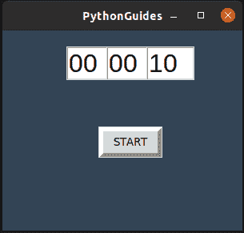

# 如何使用 Python Tkinter 创建倒计时定时器(一步一步)

> 原文：<https://pythonguides.com/create-countdown-timer-using-python-tkinter/>

[](https://sharepointsky.teachable.com/p/python-and-machine-learning-training-course)

在本 [Python Tkinter 教程](https://pythonguides.com/python-gui-programming/)中，我们将一步一步的讨论如何**使用 Python Tkinter** 创建倒计时定时器。这里，我们将使用 Python Tkinter 创建一个简单的基于 GUI 的倒计时器。

## 使用 Python Tkinter 创建倒计时定时器

现在，让我们看看如何使用 Python Tkinter 创建一个倒计时器。

**需求分析**

创建一个倒计时定时器，接受用户使用 Python Tkinter 设置的小时、分钟和秒。不强制要求提供所有信息，但应该有零个。当用户点击开始按钮时，计数器应该开始递减计数。

**源代码解释**

下面是使用 Tkinter 在 Python 中创建倒计时定时器的代码解释。请留下您的评论，以防您有任何不明白的地方，或者它对您不起作用。我们在 ubuntu 操作系统上编写了这个代码，但是这个代码可以在 Windows 和 Macintosh 上运行。

```py
import time
from tkinter import *
from tkinter import messagebox
```

*   使用的模块:我们在这段代码中使用了三个导入的模块
    *   **时间**:时间模块用于执行睡眠操作
    *   `tkinter` 模块用于创建所有图形用户界面
    *   `messagebox` :用于显示提示信息。

```py
ws = Tk()
ws.geometry("300x250+1500+700")
ws.title("PythonGuides")
ws.config(bg='#345')
```

*   创建或初始化窗口。**T2`ws = Tk()`**
*   **几何体**用于设置应用程序的高度、宽度&位置
    *   300 是宽度
    *   250 是身高
    *   1500 是屏幕上的 `x` 位置
    *   700 是屏幕上的 `y` 位置
*   `title` 用于提供出现在窗口顶部的应用程序的名称。
*   `ws.config` 用于设置应用的背景颜色

```py
 hour=StringVar()
minute=StringVar()
second=StringVar()

hour.set("00")
minute.set("00")
second.set("10")
```

*   `StringVar()` 用于创建**文本变量**，在这种情况下，当程序中的文本需要多次改变时，使用文本变量。
*   hour.set("00 ")这里我们为 textvariable 提供了默认值。因此，当程序将被执行时，它将显示 00 代替标签

```py
hour_tf= Entry(
	ws, 
	width=3, 
	font=f,
	textvariable=hour
	)

hour_tf.place(x=80,y=20)

mins_tf= Entry(
	ws, 
	width=3, 
	font=f,
	textvariable=minute)

mins_tf.place(x=130,y=20)

sec_tf = Entry(
	ws, 
	width=3, 
	font=f,
	textvariable=second)

sec_tf .place(x=180,y=20)
```

*   为小时、分钟和秒创建了三个输入框。每个输入框的宽度为 3，字体大小为 24，包含不同的文本变量。
*   位置几何管理器用于定位部件。

```py
start_btn = Button(
	ws, 
	text='START', 
	bd='5',
	command= startCountdown
	)

start_btn.place(x = 120,y = 120)
```

*   创建了一个名为“开始”的按钮。此按钮包含将触发倒计时活动的命令。
*   包装几何管理器用于将其定位在屏幕上。

```py
def startCountdown():
	try:
		userinput = int(hour.get())*3600 + int(minute.get())*60 + int(second.get())
	except:
		messagebox.showwarning('', 'Invalid Input!')
	while userinput >-1:
		mins,secs = divmod(userinput,60) 

		hours=0
		if mins >60:

			hours, mins = divmod(mins, 60)

		hour.set("{0:2d}".format(hours))
		minute.set("{0:2d}".format(mins))
		second.set("{0:2d}".format(secs))

		ws.update()
		time.sleep(1)

		if (userinput == 0):
			messagebox.showinfo("", "Time's Up")

		userinput -= 1
```

阅读 [Python Tkinter 笔记本小工具](https://pythonguides.com/python-tkinter-notebook/)

*   startCountdown() 函数是这个程序中最重要的一段代码，因为它保存了按照要求执行代码的命令。
*   userinput 变量保存用户在界面中提供的信息。**。get()** 方法提取输入框中提供的信息
*   1 小时有 3600 秒，1 分钟有 60 秒。因此，如果用户输入 2 小时，这意味着它变成 7200 秒，分钟也是类似的情况。
*   因此，我们将小时和分钟转换为秒，并将它们相加，得到总秒数。
*   此外，我们将 userinput 保存在一个 `try-catch` 块中，这样，如果用户提供了除数字之外的其他输入，就会出现错误提示。
*   当循环开始时&将继续循环，直到总秒数小于 0 或-1。
*   使用了内部循环 `divmod()` 函数。divmode 类似于“ `//` ”运算符。它仅在执行除法后返回整数值。
*   之前我们一起积累了小时、分钟和秒，现在我们把它们分开。
*   倒计时信息显示后
*   计数是以递减的顺序进行的，每秒钟总秒数减 1，直到总秒数小于 0。
*   当循环条件变为假时，程序将被执行，并提示“时间已到”。

**完整源代码:**

这是使用 Python Tkinter 创建倒计时定时器的完整源代码，你也可以看到输出。

```py
import time
from tkinter import *
from tkinter import messagebox

f = ("Arial",24)

ws = Tk()
ws.geometry("300x250+1500+700")
ws.title("PythonGuides")
ws.config(bg='#345')

hour=StringVar()
minute=StringVar()
second=StringVar()

hour.set("00")
minute.set("00")
second.set("10")

hour_tf= Entry(
	ws, 
	width=3, 
	font=f,
	textvariable=hour
	)

hour_tf.place(x=80,y=20)

mins_tf= Entry(
	ws, 
	width=3, 
	font=f,
	textvariable=minute)

mins_tf.place(x=130,y=20)

sec_tf = Entry(
	ws, 
	width=3, 
	font=f,
	textvariable=second)

sec_tf.place(x=180,y=20)

def startCountdown():
	try:
		userinput = int(hour.get())*3600 + int(minute.get())*60 + int(second.get())
	except:
		messagebox.showwarning('', 'Invalid Input!')
	while userinput >-1:
		mins,secs = divmod(userinput,60) 

		hours=0
		if mins >60:

			hours, mins = divmod(mins, 60)

		hour.set("{0:2d}".format(hours))
		minute.set("{0:2d}".format(mins))
		second.set("{0:2d}".format(secs))

		ws.update()
		time.sleep(1)

		if (userinput == 0):
			messagebox.showinfo("", "Time's Up")

		userinput -= 1

start_btn = Button(
	ws, 
	text='START', 
	bd='5',
	command= startCountdown
	)

start_btn.place(x = 120,y = 120)

ws.mainloop() 
```

**输出:**

下面是上面代码的输出。用户可以编辑屏幕上显示的数字。开始按钮将启动倒计时，一旦倒计时回到零，它将显示时间的消息提示。



python tkinter countdown timer

您可能会喜欢以下 Python Tkinter 教程:

*   [用 Python Tkinter 上传文件](https://pythonguides.com/upload-a-file-in-python-tkinter/)
*   [Python Tkinter 拖拽](https://pythonguides.com/python-tkinter-drag-and-drop/)
*   [Python Tkinter Map()函数](https://pythonguides.com/python-tkinter-map-function/)
*   [如何使用 Python Tkinter 创建日期时间选择器](https://pythonguides.com/create-date-time-picker-using-python-tkinter/)
*   [如何进入 Python Tkinter 程序的下一页](https://pythonguides.com/go-to-next-page-in-python-tkinter/)
*   [Python Tkinter 滚动条–如何使用](https://pythonguides.com/python-tkinter-scrollbar/)
*   [Python Tkinter 测验](https://pythonguides.com/python-tkinter-quiz/)

在本教程中，我们学习了如何使用 Python Tkinter 创建倒计时定时器。

[Bijay Kumar](https://pythonguides.com/author/fewlines4biju/)

Python 是美国最流行的语言之一。我从事 Python 工作已经有很长时间了，我在与 Tkinter、Pandas、NumPy、Turtle、Django、Matplotlib、Tensorflow、Scipy、Scikit-Learn 等各种库合作方面拥有专业知识。我有与美国、加拿大、英国、澳大利亚、新西兰等国家的各种客户合作的经验。查看我的个人资料。

[enjoysharepoint.com/](https://enjoysharepoint.com/)[](https://www.facebook.com/fewlines4biju "Facebook")[](https://www.linkedin.com/in/fewlines4biju/ "Linkedin")[](https://twitter.com/fewlines4biju "Twitter")