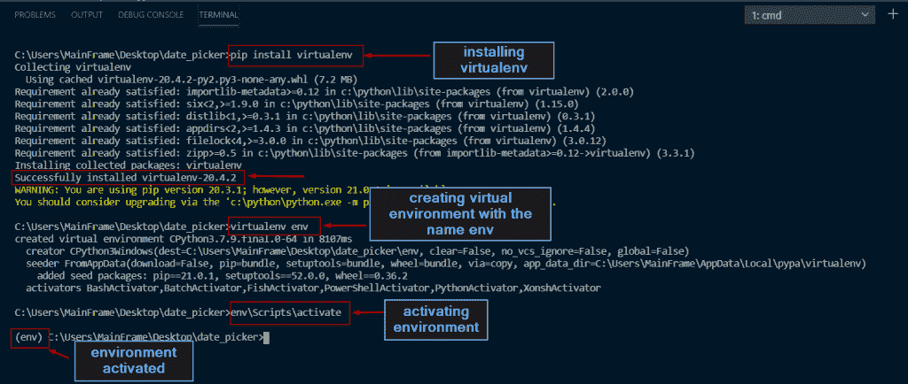
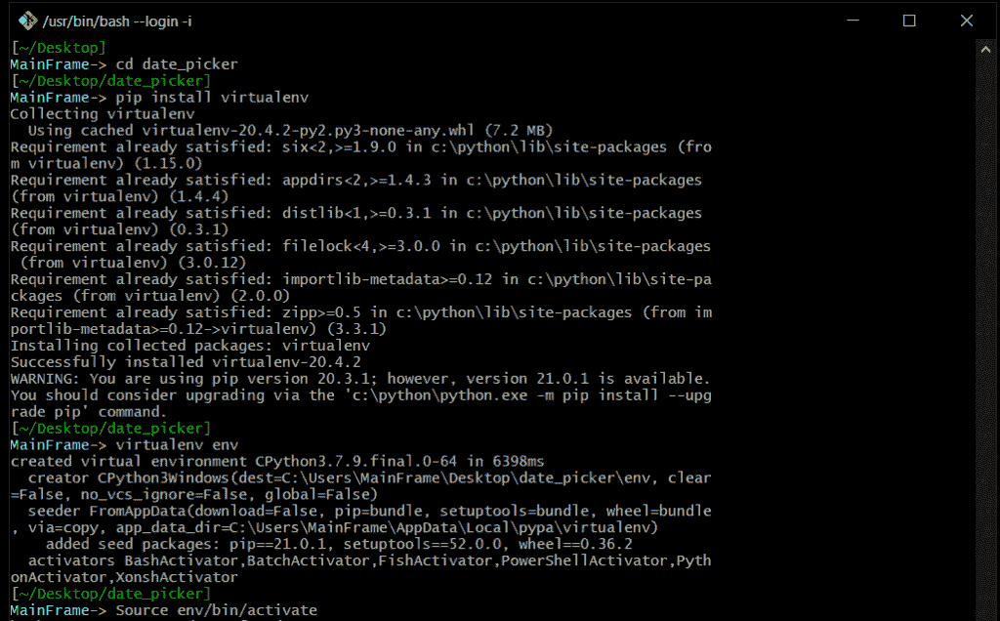
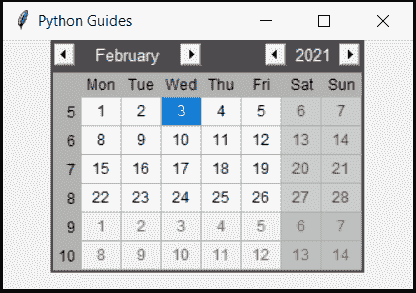
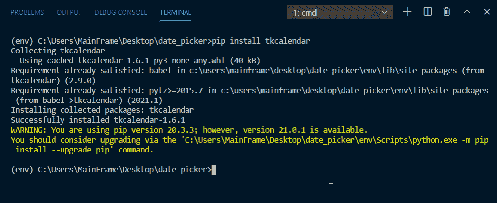
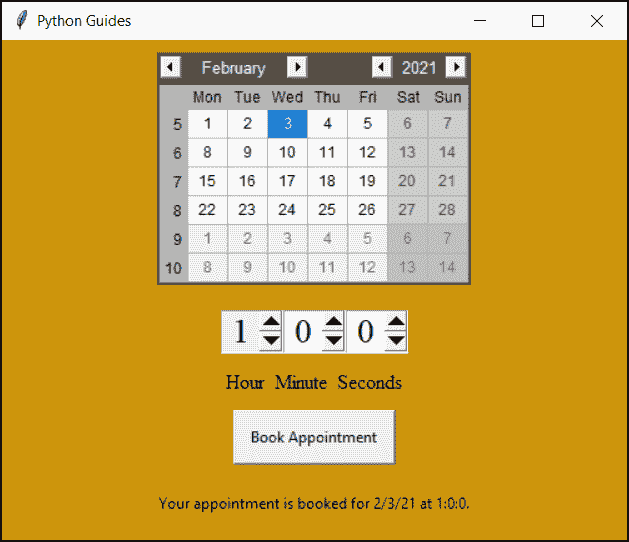

# 如何使用 Python Tkinter 创建日期时间选择器

> 原文：<https://pythonguides.com/create-date-time-picker-using-python-tkinter/>

[](https://sharepointsky.teachable.com/p/python-and-machine-learning-training-course)

在这个 [Python 教程](https://pythonguides.com/python-programming-for-the-absolute-beginner/)中，我们将学习**如何使用 Python Tkinter** 创建数据时间选择器。您一定在每次单击表单中的日期选项时都观察到了日历视图的外观。我们将创建一个类似的界面。

你是 Python tkinter 的新手吗，看看 [Python GUI 编程](https://pythonguides.com/python-gui-programming/)。

目录

[](#)

*   [在 Python Tkinter 中创建环境](#Create_Environment_in_Python_Tkinter "Create Environment in Python Tkinter")
    *   [可能的错误信息](#Possible_error_messages "Possible error messages")
    *   [Windows 上的虚拟环境](#Virtual_environment_on_Windows "Virtual environment on Windows ")
    *   [Mac 或 Linux 上的虚拟环境](#virtual_environment_on_Mac_or_Linux "virtual environment on Mac or Linux")
*   [安装 Python Tkcalendar 库](#Install_Python_Tkcalendar_Library "Install Python Tkcalendar Library")
*   [使用 Python Tkinter 创建日期时间选择器](#Creating_Date_Time_Picker_Using_Python_Tkinter "Creating Date Time Picker Using Python Tkinter ")

## 在 Python Tkinter 中创建环境

在安装任何库之前创建一个环境总是一个好的做法。创建一个环境，然后安装库，这样您就可以共享项目，而无需用户担心依赖性。

*   我们将使用 `virtualenv` 包来创建一个虚拟环境。
*   我们将在全球范围内安装 virtualenv。要全局安装 virtualenv，请键入以下命令:

```py
pip install virtualenv
```

### 可能的错误信息

1.  **要求已经满足**如果您看到此消息，说明您的系统上已经安装了 virtualenv。
2.  **找不到命令“pip”**这意味着您的 Linux 或 Mac 机器上没有安装 pip。[点击这里](https://pip.pypa.io/en/stable/reference/pip_install/)了解安装过程。
3.  **‘pip’不被识别为内部或外部命令**这意味着您的 Windows 机器上没有安装 pip。[点击这里](https://pip.pypa.io/en/stable/reference/pip_install/)了解如何安装 pip。如果您确定安装了 pip，那么它可能没有设置为 PATH。[点击这里](https://appuals.com/fix-pip-is-not-recognized-as-an-internal-or-external-command/)了解如何将 pip 添加到路径中。

### Windows 上的虚拟环境

*   在创建虚拟环境之前，创建一个项目文件夹，并移动到该文件夹。
*   在我们的例子中，我们已经创建了一个名为 **date_picker，**的项目文件夹，现在使用 cmd 命令，我们已经使用命令``cd date_picker``移动到这个文件夹

```py
virtualenv env
```

*   该命令将创建一个名为 `env` 的虚拟环境文件夹
*   env 是一个标准的名字，但是你可以保留任何你喜欢的名字。
*   一旦创建了环境，我们需要激活环境
*   要激活环境，请遵循以下代码。

```py
env\Scripts\activate
```



python tkinter date time picker

### Mac 或 Linux 上的虚拟环境

*   在创建虚拟环境之前，创建一个项目文件夹，并移动到该文件夹。
*   在我们的例子中，我们已经创建了一个名为 **date_picker，**的项目文件夹，现在使用终端，我们已经使用命令``cd date_picker``移动到这个文件夹

```py
virtualenv env
```

*   该命令将创建一个名为 `env` 的虚拟环境文件夹
*   env 是一个标准的名字，但是你可以保留任何你喜欢的名字。
*   一旦创建了环境，我们需要激活环境
*   要激活环境，请遵循以下代码。

```py
Source env/bin/activate
```



Python Tkinter Date Time Picker

阅读: [Python Tkinter 选项菜单](https://pythonguides.com/python-tkinter-optionmenu/)

## 安装 Python Tkcalendar 库

现在，让我们看看如何安装 Python Tkcalendar 库。

现在，一旦我们创建并激活了我们的虚拟环境，我们需要安装 `Python tkcalender` 来开始这个项目。



Python Tkinter Date Time Picker

`tkcalendar` 是一个 python 模块，为 Tkinter 提供 calendar 和 DateEntry 小部件。DateEntry 小部件类似于 Combobox，但是下拉列表不是列表，而是用于选择日期的日历。

下面是在您的环境中安装 `tkcalendar` 的代码。

```py
pip install tkcalendar
```



Install Python Tkcalendar library.

## 使用 Python Tkinter 创建日期时间选择器

在这个应用程序中，用户将得到一个日历来选择一个日期和数字时钟，其中用户可以设置任何时间。

**代码:**

```py
from tkinter import *
from tkcalendar import *

ws = Tk()
ws.title("Python Guides")
ws.geometry("500x400")
ws.config(bg="#cd950c")

hour_string=StringVar()
min_string=StringVar()
last_value_sec = ""
last_value = ""        
f = ('Times', 20)

def display_msg():
    date = cal.get_date()
    m = min_sb.get()
    h = sec_hour.get()
    s = sec.get()
    t = f"Your appointment is booked for {date} at {m}:{h}:{s}."
    msg_display.config(text=t)

if last_value == "59" and min_string.get() == "0":
    hour_string.set(int(hour_string.get())+1 if hour_string.get() !="23" else 0)   
    last_value = min_string.get()

if last_value_sec == "59" and sec_hour.get() == "0":
    min_string.set(int(min_string.get())+1 if min_string.get() !="59" else 0)
if last_value == "59":
    hour_string.set(int(hour_string.get())+1 if hour_string.get() !="23" else 0)            
    last_value_sec = sec_hour.get()

fone = Frame(ws)
ftwo = Frame(ws)

fone.pack(pady=10)
ftwo.pack(pady=10)

cal = Calendar(
    fone, 
    selectmode="day", 
    year=2021, 
    month=2,
    day=3
    )
cal.pack()

min_sb = Spinbox(
    ftwo,
    from_=0,
    to=23,
    wrap=True,
    textvariable=hour_string,
    width=2,
    state="readonly",
    font=f,
    justify=CENTER
    )
sec_hour = Spinbox(
    ftwo,
    from_=0,
    to=59,
    wrap=True,
    textvariable=min_string,
    font=f,
    width=2,
    justify=CENTER
    )

sec = Spinbox(
    ftwo,
    from_=0,
    to=59,
    wrap=True,
    textvariable=sec_hour,
    width=2,
    font=f,
    justify=CENTER
    )

min_sb.pack(side=LEFT, fill=X, expand=True)
sec_hour.pack(side=LEFT, fill=X, expand=True)
sec.pack(side=LEFT, fill=X, expand=True)

msg = Label(
    ws, 
    text="Hour  Minute  Seconds",
    font=("Times", 12),
    bg="#cd950c"
    )
msg.pack(side=TOP)

actionBtn =Button(
    ws,
    text="Book Appointment",
    padx=10,
    pady=10,
    command=display_msg
)
actionBtn.pack(pady=10)

msg_display = Label(
    ws,
    text="",
    bg="#cd950c"
)
msg_display.pack(pady=10)

ws.mainloop()
```

**输出:**

在这个输出中，用户可以通过选择日期和时间来预约。用户可以选择未来或过去的任何日期。

**改进范围**

1.  添加对过去日期选择的限制。
2.  将应用程序与数据库连接，并仅在日期和时间未被占用时提供预约确认。



Creating Date Time Picker Using Python Tkinter

您可能会喜欢以下 Python 教程:

*   [Python Pygame 教程](https://pythonguides.com/python-pygame-tutorial/)
*   [使用 Python 的机器学习](https://pythonguides.com/machine-learning-using-python/)
*   [如何使用 Python Tkinter 获取用户输入并存储在变量中](https://pythonguides.com/how-to-take-user-input-and-store-in-variable-using-python-tkinter/)
*   [Python Tkinter 退出程序](https://pythonguides.com/python-tkinter-exit-program/)
*   [如何在 Turtle Python 中附加图像](https://pythonguides.com/attach-image-to-turtle-python/)
*   [Python Tkinter TreeView 示例](https://pythonguides.com/python-tkinter-treeview/)
*   [Python Turtle 命令(15 个有用的命令)](https://pythonguides.com/python-turtle-commands/)
*   [用 Python Tkinter 上传文件](https://pythonguides.com/upload-a-file-in-python-tkinter/)

在本教程中，我们学习了如何使用 Python tkinter 创建日期时间选择器。

[Bijay Kumar](https://pythonguides.com/author/fewlines4biju/)

Python 是美国最流行的语言之一。我从事 Python 工作已经有很长时间了，我在与 Tkinter、Pandas、NumPy、Turtle、Django、Matplotlib、Tensorflow、Scipy、Scikit-Learn 等各种库合作方面拥有专业知识。我有与美国、加拿大、英国、澳大利亚、新西兰等国家的各种客户合作的经验。查看我的个人资料。

[enjoysharepoint.com/](https://enjoysharepoint.com/)[](https://www.facebook.com/fewlines4biju "Facebook")[](https://www.linkedin.com/in/fewlines4biju/ "Linkedin")[](https://twitter.com/fewlines4biju "Twitter")