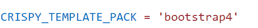

# 如何用 Django 脆皮造型创造造型

> 原文：<https://pythonguides.com/create-form-with-django-crispy-forms/>

[](https://sharepointsky.teachable.com/p/python-and-machine-learning-training-course)

在这个 Python Django 教程中，我将一步一步地解释如何用 Django crisp Forms 创建表单。

最近，我一直在使用 bootstrap 开发一个联系人表单，我发现它需要几十行代码，需要花费很多精力，所以我做了一些研究，发现 Django 提供了清晰的表单。

在这里我们将看到:

*   姜戈脆皮是什么
*   如何使用姜戈脆皮蛋糕
*   如何在 Django 中使用 Crispy 表单构建联系人表单
*   如何在 Django 中使用各种控件，如 textbox、textarea 和 email
*   如何用电子邮件创建 Django 表单
*   如何从 Django 管理界面查看提交的数据

有不同的方法，我们可以在 Django 中创建表单，比如使用表单、HTML 等。但是它们缺乏风格化的外观，所以我们将在这里使用 Django crispy forms 来呈现 Django 表单。

在本文的最后，你也可以下载代码:**用 Django crisp Forms**创建 Django form。

这是我们将在这里建造的。


Create Form with Django Crispy Forms

目录

[](#)

*   [如何用 Django 脆皮制作造型](#How_to_create_Form_with_Django_Crispy_Forms "How to create Form with Django Crispy Forms")
    *   [姜戈脆皮蛋糕](#Django_Crispy_Forms "Django Crispy Forms")
    *   [如何设置 Django 脆皮表单](#How_to_setup_Django_Crispy_Forms "How to setup Django Crispy Forms")
    *   [如何用 Django 脆皮制作造型](#How_to_create_form_with_Django_Crispy_Forms "How to create form with Django Crispy Forms")
        *   [建立 Django 项目](#Set_up_Django_Project "Set up Django Project")
    *   [从 Django 中的模型创建表单](#Create_form_from_model_in_Django "Create form from model in Django")
    *   [创建模板](#Create_Templates "Create Templates")
    *   [定义 Django 视图](#Define_Django_View "Define Django View")
        *   [使用 Django Crispy 表单和电子邮件创建表单](#Create_form_with_Django_Crispy_Forms_and_Email "Create form with Django Crispy Forms and Email")
    *   [执行 Django 应用程序](#Execute_Django_Application "Execute Django Application")
    *   [从 Django 管理界面查看提交的数据](#View_submitted_data_from_the_Django_admin_interface "View submitted data from the Django admin interface")
*   [下载用 Django crispy forms 创建表单的完整代码](#Download_the_create_form_with_Django_crispy_forms_complete_code "Download the create form with Django crispy forms complete code")
*   [结论](#Conclusion "Conclusion")

## 如何用 Django 脆皮制作造型

现在，让我们一步一步地看，如何用 Django 脆皮形式创建 Django 形式。

### 姜戈脆皮蛋糕

在 Django 中，`Django-crisp-form`是一个 Python 包，内置了对引导 CSS 和引导 CDB 框架的支持。

它允许我们用更少的代码行和更少的工作将 Bootstrap 集成到我们的项目中。

### 如何设置 Django 脆皮表单

django-crisp-forms 应该首先安装在您激活的虚拟环境中。在这个包的帮助下，我们可以不使用任何额外的自定义表单 CSS 来呈现 Django 表单。

```py
pip install django-crispy-forms
```

安装完成后，将 Django`crisp _ forms`添加到 `settings.py` 文件中的 `INSTALLED_APPS` 中。


settings.py

现在，在 `INSTALLED_APP` 列表下面添加`crisp _ TEMPLATE _ PACK`，为各种 CSS 和 bootstrap 框架提供内置支持。

并将其值设置为我们正在使用的引导。这里我将其值设置为 `bootstrap4` 。



Crispy Template Pack

阅读:[Python Django 中网站的简单联系表](https://pythonguides.com/simple-contact-form-for-website-in-python-django/)

### 如何用 Django 脆皮制作造型

#### 建立 Django 项目

首先，使用下面给出的命令在 Django 中创建一个名为**的项目。**

```py
django-admin startproject WebsiteBuilder
```

通过在终端键入下面的命令，在 Django 项目中创建一个名为 `Contact` 的 Django 应用程序。

```py
python manage.py startapp Contact
```

将**联系人**应用添加到位于 `settings.py` 文件中的已安装应用列表中。


settings.py

Django 在项目目录中自动包含一个名为 `urls.py` 的文件。在它里面，映射了最近创建的应用程序**联系人**，如下所示。

```py
from django.contrib import admin
from django.urls import path,include

urlpatterns = [
    path('admin/', admin.site.urls),
    path('',include('Contact.urls')),
]
```

阅读:[如何在 Python Django 中创建 web 表单](https://pythonguides.com/create-web-form-in-python-django/)

### 从 Django 中的模型创建表单

打开位于 app 目录中的 `models.py` 文件来创建模型，并在其中添加以下代码。

```py
from django.db import models

# Create your models here.

class Contact(models.Model):
    name = models.CharField(max_length=50)
    email = models.EmailField()
    message = models.TextField(max_length=1000)

    def __str__(self):
        return self.email
```

在这里，我们创建一个模型类 `Contact` ，它具有以下字段。

1.  **名称**是 Django CharFields，用于接收用户输入的名称。并且该字符字段有 50 个字符的限制。
2.  **电子邮件**是 Django EmailField，允许用户保存电子邮件地址。
3.  **消息**字段是 Django 文本字段。并且有 1000 个字符的限制。

并使用 `def __str__(self)` 来更改 Django 模型中对象的显示名称。当我们返回 `self.email` 时，它会将项目名称显示为电子邮件。

要在管理站点注册**联系人**模型，打开 `admin.py` 文件并添加下面给出的代码。

```py
from django.contrib import admin
from .models import Contact

# Register your models here.

admin.site.register(Contact)
```

创建 Django 表单，联系人应用程序将使用它来收集用户输入。将以下代码添加到您在 app 目录中创建的 `forms.py` 文件中。

```py
from django import forms
from .models import Contact

class ContactForm(forms.ModelForm):
    class Meta:
        model = Contact
        fields = '__all__'
```

这里，我们定义了一个名为`ContactForm` 的表单类，它包含了来自 `Contact` 模型的所有字段。

阅读:[如何使用 Django 和 SQLite 创建联系人表单](https://pythonguides.com/contact-form-with-django-and-sqlite/)

### 创建模板

在 Django 中，应用程序的**前端**是在模板中定义的，为此，在主项目目录中创建一个名为**模板**的子目录来存储所有的项目模板。

打开 `settings.py` 文件，更新 `DIRS` 指向 Templates 文件夹的位置。


settings.py

为了定义联系人表单的前端，在**模板**文件夹中创建一个名为`contact.html`的 HTML 文件，并包含下面给出的代码。

```py
<!DOCTYPE html>
<html lang="en">

<head>
    <meta charset="UTF-8">
    <meta http-equiv="X-UA-Compatible" content="IE=edge">
    <meta name="viewport" content="width=device-width, initial-scale=1.0">
    <!-- Bootstrap CSS -->
    <link rel="stylesheet" href="https://stackpath.bootstrapcdn.com/bootstrap/4.3.1/css/bootstrap.min.css"
        integrity="sha384-ggOyR0iXCbMQv3Xipma34MD+dH/1fQ784/j6cY/iJTQUOhcWr7x9JvoRxT2MZw1T" crossorigin="anonymous">
    <title>Contact Us</title>
</head>

<body>
    <form method="post">
        
        
        <div class="container">
            <div class="row justify-content-center">
                <div class="col-8">
                    <h1 class="mt-4" align="center">Contact Us</h1>
                    <hr class="mt-4 mb-5">
                    <h4 class="mt-4" align="center">Let's get conversation started. Tell us a bit about yourself, and our team will get in touch as soon as we can.</h4>
                    <hr class="mt-4 mb-5">
                    <div class="row">
                        <div class="col-6">
                            {{ form.name|as_crispy_field }}
                        </div>
                        <div class="col-6">
                            {{ form.email|as_crispy_field }}
                        </div>
                    </div>
                    <div>
                        {{ form.message|as_crispy_field }}
                    </div>
                    <button type="submit" class="btn btn-success">Submit</button>
                </div>
            </div>
        </div>    
    </form>
    <!-- jQuery first, then Popper.js, then Bootstrap JS -->
    <script src="https://code.jquery.com/jquery-3.3.1.slim.min.js"
        integrity="sha384-q8i/X+965DzO0rT7abK41JStQIAqVgRVzpbzo5smXKp4YfRvH+8abtTE1Pi6jizo"
        crossorigin="anonymous"></script>
    <script src="https://cdnjs.cloudflare.com/ajax/libs/popper.js/1.14.7/umd/popper.min.js"
        integrity="sha384-UO2eT0CpHqdSJQ6hJty5KVphtPhzWj9WO1clHTMGa3JDZwrnQq4sF86dIHNDz0W1"
        crossorigin="anonymous"></script>
    <script src="https://stackpath.bootstrapcdn.com/bootstrap/4.3.1/js/bootstrap.min.js"
        integrity="sha384-JjSmVgyd0p3pXB1rRibZUAYoIIy6OrQ6VrjIEaFf/nJGzIxFDsf4x0xIM+B07jRM"
        crossorigin="anonymous"></script>
</body>

</html>
```

首先，通过在任何其他样式表之前添加样式表到页面标题的链接来加载您的 CSS。

现在用 POST 方法使用**表单**标签描述您的联系表单，并加载 `crsf_token` 标签来保护我们的表单免受网络攻击。

然后，要用引导行和引导列样式化 Django 表单，加载`crisp _ form _ tag`并单独调用每个表单字段，使用**{ { form . name _ of _ field | as _ crisp _ field } }**标签。

我们的几个组件的功能依赖于 JavaScript，要启用下面的脚本，请将它们添加到结束的 `body` 标签之前。

我们希望在成功提交后将联系表单呈现到另一个页面，因此我们再次收到成功消息和联系表单链接。

为此，我们将另一个名为`success.html`的 HTML 文件添加到**模板**文件夹。

```py
<!DOCTYPE html>
<html lang="en">

<head>
    <meta charset="UTF-8">
    <meta http-equiv="X-UA-Compatible" content="IE=edge">
    <meta name="viewport" content="width=device-width, initial-scale=1.0">
    <title>Success</title>
</head>

<body>
    <h2 style="text-align: center; color: red;" "></h2style>We sent your message</h2>
    <p> You can send another in the <a href=" ">Contact Page</a></p>
</body>

</html>
```

首先，我们使用 `h2` 标签定义标题，为了使文本居中并将其颜色设置为红色，我们在标签内传递了**文本对齐**和**颜色**属性。然后，在 `p` 标签中，使用 `a href` 标签链接联系人页面。

阅读:[创建一个 Django 联系表单，并附上电子邮件](https://pythonguides.com/build-a-django-contact-form-with-email/)

### 定义 Django 视图

为了创建使用 crispy 表单创建联系人表单的主要逻辑，我们打开 `views.py` 文件并添加下面给出的代码。

```py
from django.shortcuts import render
from .forms import ContactForm

# Create your views here.

def contact(request):
    if request.method == 'POST':
        form = ContactForm(request.POST)
        if form.is_valid():
            form.save()
            return render(request, 'success.html')
    form = ContactForm()
    context = {'form': form}
    return render(request, 'contact.html', context)
```

首先从 `forms.py` 中导入 `ContactForm` ，然后调用 `if` 语句，检查请求方式是否为 `POST` 。

如果是，我们通过 **ContactForm(请求。POST)** 将数据绑定到表单类，这样我们就可以进行验证。现在，调用 `is_valid()` 来验证用户输入的内容，如果验证成功，使用 `save()` 保存数据，并将用户呈现给`success.html`。

如果没有，则使用 `render()` 函数向用户显示一个空白的联系人表单。

我们必须用 URL 映射视图以便调用它，因此我们必须在 app 目录中创建一个名为 `urls.py` 的文件。包括下面的代码。

```py
from django.urls import path
from Contact import views

urlpatterns = [
    path("contact", views.contact, name="contact"),   
]
```

阅读: [Python Django 与 Flask–主要区别](https://pythonguides.com/python-django-vs-flask/)

#### 使用 Django Crispy 表单和电子邮件创建表单

此外，此联系表单连接到电子邮件后端，它会自动运行，并在每次代表网站员工提交表单时通过电子邮件通知用户。

要添加 Django 发送电子邮件所需的设置，请打开 `settings.py` 文件并添加以下代码。

```py
# Email Settings

EMAIL_BACKEND = 'django.core.mail.backends.smtp.EmailBackend'
EMAIL_HOST = 'smtp.gmail.com'
EMAIL_USE_TLS = True
EMAIL_PORT = 587
EMAIL_HOST_USER = #sender email-id
EMAIL_HOST_PASSWORD = #password associated with sender email-id
```

打开 `views.py` 文件，并添加以下代码来发送关于提交的电子邮件。

```py
from django.shortcuts import render
from .forms import ContactForm
**from django.core.mail import send_mail
from django.conf import settings**

# Create your views here.

def contact(request):
    if request.method == 'POST':
        form = ContactForm(request.POST)
        if form.is_valid():
            form.save()
            **subject = "Welcome to PythonGuides Website Builder"
            message = "Our team will contact you within 24hrs."
            email_from = settings.EMAIL_HOST_USER
            email = form.cleaned_data['email']
            recipient_list =email
            send_mail(subject, message, email_from, [recipient_list])** return render(request, 'success.html')
    form = ContactForm()
    context = {'form': form}
    return render(request, 'contact.html', context)
```

导入**设置**变量，该变量包含在 `settings.py` 文件中找到的所有全局设置，以及 Django `send_mail` 函数。

然后，提供我们在撰写电子邮件时需要的参数，并将所有参数传递给 Django 中负责发送电子邮件的函数 `send_mail()` 。

阅读: [Python Django 获取管理员密码](https://pythonguides.com/python-django-get-admin-password/)

### 执行 Django 应用程序

为了开始使用模型，我们必须首先为给定的模型创建一个迁移。使用终端执行以下命令。

```py
python manage.py makemigartions
```

我们必须迁移数据库以反映它。下面是 migrate 命令。

```py
python manage.py migrate
```

我们在终端中输入下面的命令，为这个特定的 Django 项目启动一个开发服务器。

```py
python manage.py runserver
```

通过如下所示展开 URL，我们可以访问联系表单。

```py
127.1.1.0/contact
```

它成功地打开了 Django 联系表单，这是我们使用 crispy 表单创建的，如下所示。


Create Form with Django Crispy Forms

现在，填写联系表单并点击提交按钮，如下所示。


Contact Us form using the Django crispy form

单击提交后，我们将被带到成功页面。如果我们点击联系页面链接，我们将再次被带到一个未填写的联系表格。


Success Page

此外，在点击提交按钮后，一封电子邮件将从网站所有者的电子邮件发送到用户填写的电子邮件中。


Website Owner Email


User Email

阅读: [Python Django vs 金字塔](https://pythonguides.com/python-django-vs-pyramid/)

### 从 Django 管理界面查看提交的数据

Django 为用户提供了一个管理界面，用户可以通过这个界面查看从表单保存到数据库的信息。

为此，我们必须使用下面给出的命令创建一个超级用户。

```py
python manage.py createsuperuser
```

在联系人应用程序下，选择联系人。并且我们将得到记录在数据库中的表单数据。


Admin Site

这就是我们如何使用 crispy 表单呈现 Django 联系人表单。

阅读:[如何使用 bootstrap 在 Django 中构建联系人表单](https://pythonguides.com/contact-form-in-django-using-bootstrap/)

## 下载用 Django crisp forms 创建**表单的完整代码**

这是代码。

[`Create form with Django Crispy Forms`](https://pythonguides.com/wp-content/uploads/2022/11/WebsiteBuilder.zip)

## 结论

这样，我们成功地用 Django crisp Forms 创建了一个工作表单**，它利用了一个数据库和 crisp 表单。我们还学习了如何从网站所有者向填写了表单的用户自动发送电子邮件。**

此外，我们还讨论了以下主题。

*   姜戈脆皮是什么
*   如何使用姜戈脆皮蛋糕
*   如何用 Django 脆皮造型创造造型
*   如何在 Django 中使用各种控件，如 textbox、textarea 和 email
*   如何使用 Django Crispy 表单和电子邮件创建表单
*   如何从 Django 管理界面查看提交的数据

您可能也喜欢阅读下面的 Python Django 教程。

*   [Python 改 Django 版本](https://pythonguides.com/python-change-django-version/)
*   [Python Django vs ReactJS](https://pythonguides.com/django-vs-reactjs/)
*   [Python Django app 上传文件](https://pythonguides.com/django-app-upload-files/)

[Bijay Kumar](https://pythonguides.com/author/fewlines4biju/)

Python 是美国最流行的语言之一。我从事 Python 工作已经有很长时间了，我在与 Tkinter、Pandas、NumPy、Turtle、Django、Matplotlib、Tensorflow、Scipy、Scikit-Learn 等各种库合作方面拥有专业知识。我有与美国、加拿大、英国、澳大利亚、新西兰等国家的各种客户合作的经验。查看我的个人资料。

[enjoysharepoint.com/](https://enjoysharepoint.com/)[](https://www.facebook.com/fewlines4biju "Facebook")[](https://www.linkedin.com/in/fewlines4biju/ "Linkedin")[](https://twitter.com/fewlines4biju "Twitter")