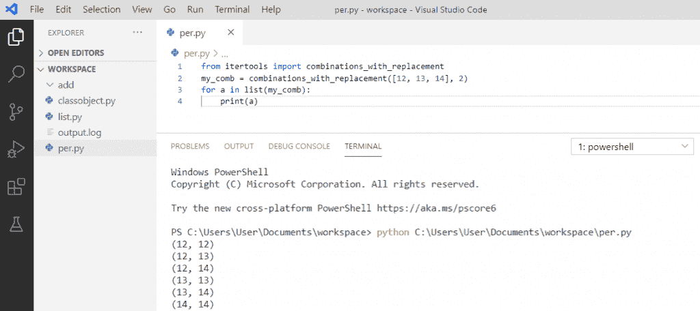

# 如何在 Python 中创建列表

> 原文：<https://pythonguides.com/create-list-in-python/>

[](https://sharepointsky.teachable.com/p/python-and-machine-learning-training-course)

在本 [Python 教程](https://pythonguides.com/python-programming-for-the-absolute-beginner/)中，我们将讨论**什么是 Python 列表**以及**在 Python** 中创建列表的不同方式。此外，我们还将讨论:

*   用 python 创建一个大小为
*   创建大小为 n 的列表
*   如何在 [Python](https://pythonguides.com/python-programming-for-the-absolute-beginner/) 中从字符串创建列表
*   Python 将列表转换成空格分隔字符串
*   用 Python 创建一个列表列表，
*   Python 从字典中创建一个列表
*   如何创建一个浮动列表
*   使用范围在 python 中创建列表
*   使用 for 循环创建列表
*   Python 创建前 n 个整数的列表
*   创建对象列表
*   将数组转换为列表 python
*   列表 python 的平均值
*   Python 列表的排序列表
*   从列表 python 中随机选择一个项目
*   Python 将函数应用于列表
*   列表的 Python 置换
*   给定长度的列表项的 Python 排列
*   列表的 Python 组合
*   Python 与替换的组合
*   如何用 python 复读
*   Python 将一个列表分割成块
*   零列表 python
*   Python 创建一个空列表

目录

[](#)

*   [什么是 python 列表](#What_is_a_python_list "What is a python list")
*   [用 python 创建一个大小为](#Create_a_list_in_python_with_size "Create a list in python with size")的列表
*   [Python 创建大小为 n 的列表](#Python_create_list_of_size_n "Python create list of size n")
*   [Python 从一个字符串创建一个列表](#Python_create_a_list_from_a_string "Python create a list from a string")
*   [Python 将列表转换成空格分隔的字符串](#Python_convert_a_list_to_space-separated_string "Python convert a list to space-separated string")
*   [Python 创建了一个列表列表](#Python_creates_a_list_of_lists "Python creates a list of lists")
*   [Python 从字典中创建一个列表](#Python_creates_a_list_from_dictionaries "Python creates a list from dictionaries")
*   [Python 创建浮动列表](#Python_create_list_of_floats "Python create list of floats")
*   [使用范围](#Create_a_list_in_python_using_a_range "Create a list in python using a range")在 python 中创建一个列表
*   [使用 for 循环在 python 中创建一个列表](#Create_a_list_in_python_using_for_loop "Create a list in python using for loop")
*   [Python 创建前 n 个整数的列表](#Python_create_list_of_first_n_integers "Python create list of first n integers")
*   [Python 创建了一个对象列表](#Python_creates_a_list_of_objects "Python creates a list of objects")
*   [将数组转换为列表 python](#Convert_array_to_list_python "Convert array to list python")
*   [列表 python 的平均值](#Average_of_a_list_python "Average of a list python")
*   [Python 排序列表列表](#Python_sort_list_of_lists "Python sort list of lists")
*   [从列表中随机选择一个物品 python](#Randomly_select_an_item_from_list_python "Randomly select an item from list python")
*   [Python 对列表应用函数](#Python_apply_function_to_a_list "Python apply function to a list")
*   [Python 列表的排列](#Python_permutations_of_a_list "Python permutations of a list")
*   [给定长度列表项的 Python 排列](#Python_permutations_of_list_items_of_a_given_length "Python permutations of list items of a given length")
*   [Python 列表的组合](#Python_combinations_of_a_list "Python combinations of a list")
*   [Python 组合与替换](#Python_combinations_with_replacement "Python combinations with replacement")
*   [如何在 python 中重复](#How_to_repeat_in_python "How to repeat in python")
*   [Python 将一个列表分割成块](#Python_split_a_list_into_chunks "Python split a list into chunks")
*   [0 python 列表](#List_of_zeros_python "List of zeros python")
*   [Python 创建一个空列表](#Python_create_an_empty_list "Python create an empty list")

## 什么是 python 列表

*   在 python 中，元素组被称为列表。
*   Python 列表与数组非常相似，但主要区别在于，数组只能存储一种类型的元素，而列表可以存储不同类型的元素。
*   列表是可变。
*   列表是动态的，这意味着大小是不固定的。列表用方括号[ ]表示，用逗号分隔。

**举例:**

```py
x = ['Lists',6.3,2.2,12,32]
print(x)
```

写完上面的代码(python list)，你将打印出 `"x"` ，然后输出将显示为 **"['List '，6.3，2.2，12，32]"** 。您可以参考下面的截图来创建不同数据类型的**列表**。


python list

这是如何在 Python 中创建一个列表。

你可能喜欢用例子用 [Python 程序来反转一个字符串。](https://pythonguides.com/python-program-to-reverse-a-string/)

## 用 python 创建一个大小为的列表

在这里，我们将看到如何**创建一个固定大小的 python 列表**。我已经用一些大小初始化了元素数组。

**举例:**

```py
size = [0]*5
print(size)
```

写完上面的代码(用 python 列出大小)，你将打印出 `"size"` ，然后输出将显示为 **"[0，0，0，0，0]"** 。这里，我用[0]初始化它，我的固定大小值是 5。你可以参考下面的截图来创建一个固定大小的**列表**。


Create a list in python with size

## Python 创建大小为 n 的列表

要创建大小为 n 的列表，请使用大小声明变量。

**举例:**

```py
n = 8
store = [2]*n
print(store)
```

写完上面的代码(大小为 n 的列表)，你将打印出**【store】**，然后输出将显示为**【2，2，2，2，2，2，2】**。你可以参考下面的截图来创建一个大小为 n 的**列表**


Python create list of size n

## Python 从一个字符串创建一个列表

为了从一个字符串中创建一个列表，我们有 split()方法，它将创建一个用方括号中的逗号分隔的列表。

**举例:**

```py
value = "Welcome to Python"
print(value.split())
```

写完上面的代码(从一个字符串创建一个列表)，你将打印出 `"value.split()"` ，然后输出将显示为一个 **"['Welcome '，' to '，' Python']"** ，这是一个列表。你可以参考下面的截图，从一个字符串创建一个**列表**。


Python create a list from a string

## Python 将列表转换成空格分隔的字符串

在 Python 中，通过使用 join()方法，我们可以将列表转换为空格分隔的字符串。

**举例:**

```py
color = ['Black','Red','Blue']
val = ' '.join(color)
print(val)
```

写完上面的代码(将一个列表转换成一个空格分隔的字符串)后，一旦你打印出 `"value"` ，那么输出将显示为**黑红蓝**。你可以参考下面的截图，将列表转换成空格分隔的字符串。


convert a list to space-separated string in python

*   [Python 将元组转换为列表](https://pythonguides.com/python-convert-tuple-to-list/)

## Python 创建了一个列表列表

为了用 python 创建一个列表，我们需要使用**。append** 方法创建一个列表列表。

**举例:**

```py
l1=[101,102,103] 
l2=[104,105] 
listoflists= []
listoflists.append(l1) 
listoflists.append(l2) 
print("List of Lists:",listoflists)
```

写完上面的代码(创建一个列表列表)，你将打印出**"列表列表:"，listoflists"** 然后输出将显示为一个 `"` 列表列表:" **[[101，102，103]，[104，105]]** "。你可以参考下面的截图来创建一个**列表**列表。


Python creates a list of lists

## Python 从字典中创建一个列表

Dictionary 是 Python 中键值对的集合。字典是可变的。用逗号分隔的花括号 **"{}** "表示。而冒号 **":"** 将每个键与其值分开。

**举例:**

```py
snames = {'Ram': 11, 'Rohan': 12, 'Shyam':13, 'Jai': 14}
mylist = [(k,v) for k,v in snames.items()]
print(f"mylist : {mylist}")
```

在编写完上面的代码(从字典中创建一个列表)之后，您将打印( **f"mylist: {mylist}")** 然后输出将显示为 **[('Ram '，11)，(' Rohan '，12)，(' Shyam '，13)，(' Jai '，14)]** 。你可以参考下面的截图，从字典中创建一个**列表**。


creates a list from dictionaries in python

## Python 创建浮动列表

为了在 python 中创建一个浮点数列表，我们需要一个 For 循环来遍历整个列表。此外，使用 append 创建新列表。

**举例:**

```py
my_val = ["1.1", "3.5", "7.6"]
list_of_floats = []
for item in my_val:
list_of_floats.append(float(item))
print(list_of_floats)
```

写完上面的代码(创建一个浮点列表)，你将打印出 `(list_of_floats)` ，然后输出将显示为一个作为浮点值的**【1.1，3.5，7.6】**。你可以参考下面的截图来创建一个**列表**的花车。


Python create list of floats

阅读:[在 Python 中从一个字符串中移除一个特定的字符](https://pythonguides.com/remove-specific-character-from-string-in-python/)

## 使用范围在 python 中创建一个列表

我们可以使用 range()在 python 中创建一个列表，并使用“ `*` ”操作符创建连续值。为了连续地制作一个列表，我们可以给出一个范围值，它有起始值和终止值。

**举例:**

```py
value = [*range(110,116)]
print(value)
```

写完上面的代码后(使用一个范围创建一个列表)，你将打印出**【值】**，然后输出将显示为“**【110，111，112，113，114，115】**，作为一个具有连续值的列表。你可以参考下面的截图，在 python 中使用范围创建一个**列表**。


## 使用 for 循环在 python 中创建一个列表

为了使用 For 循环在 python 中创建列表，我们需要使用 for 循环遍历列表中的条目。

**举例:**

```py
marks = ['34', '55', '67', '88', '89']
list_of_int = []
for item in marks:
list_of_int.append(int(item))
print(list_of_int)
```

在编写完上面的代码(使用 for 循环创建一个列表)后，您将打印" `list_of_int` "然后输出将显示为" **[34，55，67，88，89]** "作为一个列表。使用 for 循环在 python 中创建一个**列表**，可以参考下面的截图。


Create a list in python using for loop

## Python 创建前 n 个整数的列表

为了在 python 中创建前 n 个整数的列表，我们将首先声明 n，它将把前 n 个整数作为一个列表。通过使用 range 我们可以得到第一个 n 整数。

**举例:**

```py
n = 5
p = list(range(5))
print(p)
```

写完上面的代码后(创建一个前 n 个整数的列表)，你将打印“ `p` ”，然后输出将显示为“ **[0，1，2，3，4]** ”作为一个列表。你可以参考下面的截图，用 python 创建一个前 n 个整数的**列表**。


## Python 创建了一个对象列表

在 python 中，创建了一个类，其中用户定义了一个对象，该对象可以是具有不同数据类型的列表的成员。为了在 python 中创建对象列表，我们可以使用 append for class instances to list。

**举例:**

```py
class employee:
def __init__(self, empname, empid):
self.empname = empname
self.empid = empid
list = []
list.appened( employee('Rohan', 15) )
list.appened( employee('Ram', 30) )
list.appened( employee('Sohan', 34) )
for val in list:
print(val.empname, val.empid) 
```

写完上面的代码(创建一个对象列表)，你将打印的对象( **val.empname，val.empid** )”然后输出将作为列表显示为“ `Rohan 15 Ram 30 Sohan 34` ”。你可以参考下面的截图，用 python 创建一个对象的**列表**。


## 将数组转换为列表 python

在 python 中，要将数组转换成列表，我们可以使用函数“to list()”将数组转换成列表。

**举例:**

```py
from array import*
def my_array(num_array):
my_list = num_array.tolist()
print(my_list)
num_array = array('i', [12,14,16,18,20])
my_array(num_array)
```

在编写了上面的代码(将数组转换为列表 python)之后，您将打印这些代码，然后输出将显示为" **[12，14，16，18，20]** "作为一个列表。在这里，函数 `tolist()` 将数组转换为具有相同元素的列表。你可以参考下面的截图，把一个数组转换成 list python。


## 列表 python 的平均值

在 python 中，为了计算列表的平均值，我们可以使用内置函数 sum()和 len()。平均值是列表中所有元素的总和除以元素总数。

**举例:**

```py
my_list = [2, 4, 6, 8]
t = sum(my_list)
l = len(my_list)
average = t/l
print(average)
```

写完上面的代码(一个列表 python 的平均值)，你将打印出 `" average "` ，然后输出将显示为 `" 5.0 "` 。这里，函数 sum()将所有的元素相加，len()函数将计算元素的个数。你可以参考下面的列表 python 的平均截图。


## Python 排序列表列表

在 python 中，为了对列表进行排序，我们可以使用每个内部列表的索引，并通过指定的索引作为关键字对内部列表进行排序。

**举例:**

```py
my_list = [[21, 'Y'], [18, 'X']]
list_to_sort = sorted(my_list, key=lambda a: a[1])
print(list_to_sort)
```

写完上面的代码(python 排序列表)后，你将打印出 `" list_to_lists "` ，然后输出将显示为 **" [[18，' X']，[21，' Y']] "** 。这里，sorted 用于对元素进行排序， **lambda a: a[1]** 用于按每个元素对 iterable 进行排序。你可以参考下面的 python 排序列表截图。


## 从列表中随机选择一个物品 python

在 python 中，为了从列表中获得随机选择的项目，我们将导入 random 模块，然后我们必须使用 `choice()` 函数从列表中随机选择项目。

**举例:**

```py
import random
name = ["tom", "alice", "sid", "zoe"]
print(random.choice(name))
```

写完上面的代码后(从 list python 中随机选择一个项目)，你将打印出 `" random.choice() "` 然后输出将显示为 `" alice "` 作为从列表中随机选择的项目。这里，函数 choice()将随机返回列表中的项目。你可以参考下面的截图从 python 列表中随机选择一个项目。


## Python 对列表应用函数

*   **将函数应用于一个列表，**我们将使用一个 `map()` 。
*   用一个列表调用 **map(func，*iterables)** 作为 iterables，对列表中的每个元素应用一个函数，它返回一个 map 对象。
*   使用 `list()` 将地图对象转换为列表。

**举例:**

```py
my_list = ["x", "y", "z"]
map_obj = map(str.upper, my_list)
n_list = list(map_obj)
print(n_list)
```

写完上面的代码(python apply function to a list)，你将打印出 `" n_list "` ，然后输出将显示为 **" ['X '，' Y '，' Z'] "** 。这里，它需要对列表中的每个元素应用特定的函数，所以我们使用大写字符。可以参考下面的截图 python 对列表应用函数。


Python apply function to a list

## Python 列表的排列

在 python 中，我们可以直接使用名为 **itertools 包**的方法来找到一个列表的排列。首先，我们需要**导入 `itertools` 包**来实现 python 中的置换。列表的排列是列表中元素的所有可能的顺序。

**举例:**

```py
from itertools import permutations
my_permut = permutations([12, 13, 14])
for a in list(my_permut):
print(a)
```

写完上面的代码(python 一个列表的排列)，一旦你将打印 `" a "` 那么输出将出现为 **" (12，13，14) (12，14，13) (13，12，14) (13，14，12)，(14，12)，14，13) (14，12)(14，13)(14，13，12) "** 。这里，该方法将一个列表作为输入，并返回一个包含所有排列的元组的对象列表。你可以参考下面的截图 python 排列的一个列表。


Python permutations of a list

## 给定长度列表项的 Python 排列

为了得到给定长度的列表项的排列，我们需要指定长度以得到列表的所有排列。

**举例:**

```py
from itertools import permutations
my_permut = permutations([12, 13, 14], 2)
for a in list(my_permut):
print(a)
```

写完上面的代码(python 排列给定长度的列表项)，一旦你打印出 `" a "` ，那么输出将显示为 **" (12，13) (12，14) (13，12) (13，14) (14，12) (14，12)(14，12)(14，13) "** 。这里，我们将长度指定为**【2】**。如果你想得到长度为 L 的排列，我们可以这样做。你可以参考下面的截图 python 排列的一个列表。


Python permutations of list items of a given length

## Python 列表的组合

在 python 中，要找到列表的**组合，我们可以使用名为 **itertools 包**的方法。首先，我们需要**导入`ITER tools`包来实现 python 中的组合。列表组合是所有可能的项目分组。

**举例:**

```py
from itertools import combinations 
my_comb = combinations([12, 13, 14], 2)
for a in list(my_comb):
print(a)
```

写完上面的代码(python 组合的一个列表)，一旦你打印出 `" a "` ，那么输出将显示为 **" (12，13) (12，14) (13，14) "** 。这里，这个方法将一个列表和“r”作为输入，它将返回具有所有可能组合的元组的对象列表。你可以参考下面截图的 python 组合列表。


Python combinations of a list

## Python 组合与替换

为了得到相同元素与相同元素的组合，我们将使用替换组合。首先我们需要**导入 combinations _ with _ replacement**，然后元素将被索引值引用。

**举例:**

```py
from itertools import combinations_with_replacement
my_comb = combination_with_replacement([12, 13, 14], 2)
for a in list(my_comb):
print(a)
```

写完上面的代码(带替换的 python 组合)，一旦打印出 `" a "` ，那么输出将显示为**(12，12) (12，13) (12，14) (13，13) (13，14) (14，14)(T3)。这里，我们有长度组合**【2】**与替换。同样，我们有重复迭代器的所有可能的子集排列。可以参考下面截图 python 组合搭配替换。**



Python combinations with replacement

## 如何在 python 中重复

`itertools.repeat()` 属于无限迭代器，我们将**导入 itertools** 。有时我们需要在程序中重复，因此，我们可以使用 **repeat(val，num)** ，其中**“val”**是要打印的值，**“num”**是数据将被重复的次数。

**举例:**

```py
import itertools 
print ("Print repeatedly the numbers: ")
print(list(itertools.repeat(123, 5)))
```

写完上面的代码(python 中如何重复)，一旦你将打印“(list(itertools.repeat(123，5))”那么输出会出现“[123，123，123，123，123]”。在这里，我们可以看到值“123”被重复打印了“5”次。关于如何用 python 重复，可以参考下面的截图。


How to repeat in python

## Python 将一个列表分割成块

为了将一个列表分割成更小的块，我们可以使用**列表理解**在需要的时候将一个列表分割成多个列表。

**举例:**

```py
f_list = [10,12,14,16,18,20,22,24,26,28,30,32]
n = 4
result = [f_list[i:i + n] for i in range(0, len(f_list), n)]
print(result)
```

写完上面的代码(python 将一个列表分割成块)，一旦打印出 `" result "` ，那么输出将显示为 **" [[10，12，14，16]，[18，20，22，24]，[26，28，30，32]] "** 。在这里，我们可以看到列表被均匀地分成了几个**【4】**的块，它给出了多个列表。你可以参考下面的截图，python 把一个列表分割成块。


Python split a list into chunks

## 0 python 列表

为了获得零列表，我们必须创建一个名为 `"n"` 的变量，然后 **" [0] * n "** 将在 python 中创建一个零列表。

**举例:**

```py
n = 5
list_of_zeros = [0] * n
print(list_of_zeros)
```

写完上面的代码(零的列表 python)，一旦你将打印**“零的列表”**那么输出将显示为“[0，0，0，0，0]”。在这里，我们可以看到列表已经被创建，我的 **n 值是 5** ，所以列表包含 **5 个零**。你可以参考下面的截图，以获得 python 的列表。


List of zeros python

## Python 创建一个空列表

可以通过在方括号中不给出元素来创建空列表。我们也可以使用内置函数 `list()` 创建一个空列表，不需要任何参数。

**举例:**

```py
list = []
print("The value in list:", list)
```

在编写了上面的代码(python 创建一个空列表)之后，一旦打印出 `" list "` ，那么输出将显示为"[]"。在这里，我们可以看到空列表已经被创建。你可以参考下面 python 创建空列表的截图。


Python create an empty list

您可能会喜欢以下 Python 教程:

*   [使用 Visual Studio 代码](https://pythonguides.com/python-hello-world-program/)用 python 创建一个 hello world 程序
*   [Python 字符串函数](https://pythonguides.com/string-methods-in-python/)
*   [如何在 python 中把整数转换成字符串](https://pythonguides.com/convert-an-integer-to-string-in-python/)
*   [在 python 中连接字符串](https://pythonguides.com/concatenate-strings-in-python/)
*   [如何在 python 中使用正则表达式拆分字符串](https://pythonguides.com/python-split-string-regex/)
*   [Python 命名约定](https://pythonguides.com/python-naming-conventions/)
*   [创建一个字符串，并将其赋给 python 中的一个变量](https://pythonguides.com/create-a-string-in-python/)
*   [如何在 python 中创建变量](https://pythonguides.com/create-python-variable/)

通过这个教程，我们学习了`Python`中什么是 list？如何**用 Python** 创建列表？如何创建有大小的列表？创建一个大小为 n 的列表，如何**从一个字符串创建一个列表**，Python 将一个列表转换成空格分隔的字符串，如何**创建一个列表列表**？**将数组转换为列表 python** ，列表的平均值 python，列表的 python 排序，从列表中随机选择一项 python，对列表应用函数 python，列表的 Python 排列，给定长度的列表项的 Python 排列，列表的 Python 组合，带替换的 Python 组合，如何在 Python 中重复以及 Python 将列表拆分成块。

如何用 [python](https://en.wikipedia.org/wiki/Python_(programming_language)) 从字典中创建一个列表？Python，创建浮点数列表，使用 python 中的范围创建 python 中的列表，使用 for 循环创建 python 中的列表，创建前 n 个整数列表，创建对象列表。

[Bijay Kumar](https://pythonguides.com/author/fewlines4biju/)

Python 是美国最流行的语言之一。我从事 Python 工作已经有很长时间了，我在与 Tkinter、Pandas、NumPy、Turtle、Django、Matplotlib、Tensorflow、Scipy、Scikit-Learn 等各种库合作方面拥有专业知识。我有与美国、加拿大、英国、澳大利亚、新西兰等国家的各种客户合作的经验。查看我的个人资料。

[enjoysharepoint.com/](https://enjoysharepoint.com/)[](https://www.facebook.com/fewlines4biju "Facebook")[](https://www.linkedin.com/in/fewlines4biju/ "Linkedin")[](https://twitter.com/fewlines4biju "Twitter")