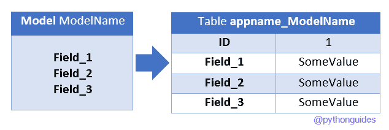

# 如何在 Django 中创建模型

> 原文：<https://pythonguides.com/create-model-in-django/>

[](https://sharepointsky.teachable.com/p/python-and-machine-learning-training-course)

在本 [Django 教程](https://pythonguides.com/what-is-python-django/)中，我们将讨论**如何在 Django** 中创建模型，**如何在 Django** 中创建模型字段，我们还将涉及以下主题。

*   Django 的模特
*   在 Django 中创建模型
*   在 Django 中创建模型表单
*   在 Django 中使用模型
*   在视图中使用模型 Django
*   在 Django 中创建模型类
*   在 Django 中创建模型字段
*   在 Django 模型中创建对象

因此，在为我们的应用程序创建模型之前，让我们先了解一下 Django 中的**模型是什么。**

目录

[](#)

*   [Django 的模型](#Model_in_Django "Model in Django")
*   [如何在 Django 中创建模型](#How_to_Create_a_model_in_Django "How to Create a model in Django")
    *   [在 Django 中创建模型类](#Create_model_class_in_Django "Create model class in Django  ")
*   [在 Django 中创建模型字段](#Create_model_field_in_Django "Create model field in Django")
*   [使用 Django 中的模型](#Using_models_in_Django "Using models in Django ")
*   [在 Django 模型中创建对象](#Create_object_in_model_Django "Create object in model Django ")
*   [在视图 Django 中使用模型](#Use_model_in_view_Django "Use model in view Django ")
*   [在 Django 中创建模型表单](#Create_model_form_in_Django "Create model form in Django")

## Django 的模型

Django 是一个基于 python 的 web 开发框架，基于 `MVT` 架构。而 `MVT` 中的“ `M` 代表车型。

Django 中的模型是一个 python 对象，它用于访问和管理应用程序的数据。Django 中的每个模型都映射到一个数据库表。

一般来说，我们编写多个 SQL 查询来[创建一个 SQL 数据库](https://sqlserverguides.com/create-a-database-in-sql-server-2019/)，然后创建表和它们的字段。但是 Django 通过使用 Model 组织表格简化了这项任务。

所以在选择好数据库之后，我们只需要创建模型，Django 就会自动与数据库进行通信来实现任务。

下图展示了 Django 模型如何映射到数据库表。



Mapping Django model to a database table

因此，在 Django 中，我们使用该模型来构造表、定义表字段、它们的默认值等等。

阅读: [Python Django vs Flask](https://pythonguides.com/python-django-vs-flask/)

## 如何在 Django 中创建模型

了解了模型之后，就该讨论**如何在 Django** 中创建模型了。但是在前进之前，应该准备好一个项目和一个应用程序。关于这一点，你也可以参考下面这篇文章——[如何设置 Django 项目](https://pythonguides.com/setup-django-project/)。

### 在 Django 创建模型类

为了**在 Django** 中创建一个模型，我们必须使用 `model.py` 文件，这个文件可以在你的应用程序目录中找到。

现在，Django 中的每个模型都是一个 python 类，它将是 `django.db.models.Model` 类的子类。一个类的每个属性代表一个字段。

因此，这里有一个通用语法，我们可以在 `models.py` 文件中使用它来创建一个用户模型。

```py
from django.db import models

class ModelName(models.Model):
        field_name = models.Field(**options)
```

在语法中，首先，我们导入了**模型**类。在这之后，要创建一个用户模型，我们必须定义一个“**模型”的子类。型号**”。

在语法中，我们必须定义模型的名称来代替 `ModelName` 。接下来，为了创建字段，我们必须使用 models 类，如语法所示。

让我们通过一个例子来理解这一点，为此，考虑下面给出的代码。

```py
from django.db import models

class Employees(models.Model):
    first_name = models.CharField(max_length=30)
    last_name = models.CharField(max_length=30)
    Dept_name = models.CharField(max_length=20)
    joining_date = models.DateField()
    salary = models.IntegerField()
```

在上面的例子中，我们已经创建了一个名为“ `Employees` 的用户模型，并将用于存储雇员数据。在模型中，我们定义了 5 个字段作为类属性，每个属性将映射到一个数据库列。

现在，这个**雇员**模型将自动创建一个与此等价的表。

```py
CREATE TABLE "myApp_employees" (
   "id" integer NOT NULL PRIMARY KEY AUTOINCREMENT, 
   "first_name" varchar(30) NOT NULL, 
   "last_name" varchar(30) NOT NULL, 
   "Dept_name" varchar(20) NOT NULL, 
   "joining_date" date NOT NULL, 
   "salary" integer NOT NULL
);
COMMIT;
```

在这个例子中，我们在**“myApp**”应用程序中创建了一个模型。因此，Django 将通过使用模型元数据自动生成一个名为“ `myApp_employees` 的表。

此外，id 字段也将添加到表中。此 id 是一个非空、自动递增的主键字段。

至此，我们已经了解了如何在 Django 中创建模型类，以及创建模型时会发生什么。接下来，让我们了解如何在 Django 中使用模型。

阅读:[如何安装 Django](https://pythonguides.com/how-to-install-django/)

## 在 Django 创建模型字段

理解了如何创建模型之后，接下来要理解的是模型字段。

模型字段用于表示表列，Django 中有许多不同类型的字段。

这些不同类型的字段用于决定一个列应该保存哪种类型的数据，例如整数、字符串、日期等。设置字段就像决定表中某一列的数据类型。

模型中的每个字段都是一个字段类的实例，Django 使用这些字段类型来决定列类型、验证需求以及其他许多事情。

现在，Django 在模型中提供了许多类型的字段。以下是一些最重要的字段类型的列表。

1.  **自动字段-** 这是一个整数字段字段，会自动增加其值。
2.  `BigAutoField-` 它是一个 64 位整数字段，与 AutoField 非常相似。但唯一不同的是，在这里，我们将得到从 1 到`9223372036854775807`的确定值。
3.  `integer field`–用于保存范围从-2147483648 到 2147483647 的整数值。
4.  `bigtintergerfield-`它也是一个 64 位的整数域。但可以保存-9223372036854775808 到 9223372036854775807 之间的整数值。
5.  **二进制字段-** 该字段用于存储二进制数据。
6.  `boolean field`–该字段可以存储布尔数据(真/假)。如果没有给它分配默认值，那么它的值将是 NONE。
7.  `CharField-` 用于将小尺寸字符串值存储到大尺寸字符串中。
8.  `DateField-` 该字段用于存储日期数据类型的数据。
9.  `DateTimeField-` 该字段用于一起存储日期和时间细节。
10.  `DecimalField-` 该字段用于存储固定精度的十进制数。
11.  `email field`–它是一个 CharField，但它也检查该值是否是有效的电子邮件地址。
12.  `float field`–该字段用于存储浮点数。
13.  **持续时间字段**–该字段可以存储时间段。
14.  **文件字段-** 用于文件上传字段。
15.  该字段继承了文件字段的所有属性和方法，它还验证上传的对象是否是有效的图像。
16.  `GenericIPAddressField`–它可以以字符串格式存储 IPv4 或 IPv6 地址。
17.  `NullBooleanField-` 这个字段就像 BooleanField 一样，但是它也允许 NULL 作为选项之一。
18.  `PositiveIntegerField-` 与 IntegerField 一样，该字段可以是正数，也可以是零(0)。
19.  **斯拉格菲尔德-**“**斯拉格**这个术语来自报业。Slugs 是仅包含字母、数字、下划线或连字符的短标签。它通常用于 URL。
20.  `TextField-` 该字段用于存储大型文本数据。

现在，在 Django 有更多的可用字段。每个字段用于存储特定类型的数据。

阅读:[Django 中的应用程序和项目之间的差异](https://pythonguides.com/django-app-vs-project/)

## 使用 Django 中的模型

成功创建模型类后，让我们来了解如何在 Django 中使用模型。

首先，我们需要告诉 Django 服务器我们想要使用一个模型。为此，首先，我们需要使用我们项目的 `settings.py` 文件。所以，打开 `settings.py` 文件，在 `INSTALLED_APPS` 部分给出你的应用程序的名字。

这是一个我们应该如何在设置文件中添加应用程序的例子。


Defining the app in the `settings.py` file

在示例中，我们在项目的 `settings.py` 文件中定义了一个名为 `myApp` 的 app。

接下来，我们需要运行迁移，这样就可以创建表了。Django 使用迁移来传播对模型的更改(添加一个字段，删除一个模型，等等)。)添加到数据库模式中。

首先，运行 `makemigrations` 命令，命令如下。

```py
python manage.py makemigrations
```

该命令有助于根据我们的模型中检测到的变更创建迁移。在这之后，我们需要运行一个 migrate 命令，该命令如下所示。

```py
python manage.py migrate
```

这个 `migrate` 命令负责将模型中的更改应用到数据库中。这是与迁移相关的屏幕截图。


Output of migrations

这样，我们的模型就可以在我们的项目中使用了。

阅读 [Python Django 获取](https://pythonguides.com/python-django-get/)

## 在模型中创建对象姜戈

到目前为止，我们已经成功地在 Django 中创建了一个模型，并在 settings.py 文件中添加了应用程序。因此，现在我们可以将该模型用于我们的项目。

现在，Django 使用模型类将数据库表和对象表示为表中的记录。因此，在本节中，我们将学习如何创建用户模型的对象，并使用它们来保存表中的数据。

在这个演示中，我们将使用 python shell，为了打开这个 shell，我们在项目目录中运行了以下命令。

```py
python manage.py shell
```

现在，一个交互式控制台将被激活，我们将执行控制台中的所有步骤。

在这之后，我们的第一步是从我们的应用程序中导入所需的模型，我们可以使用下面的语法来完成这项任务。

```py
from app_name.models import model_name
```

下面是一个例子，说明如何从我们的 myApp 应用程序中导入" `Employees` "模型。

```py
from myApp.models import Employees
```

现在要创建一个对象，我们必须将字段的值作为参数传递给模型类。下面给出了雇员模型的一个简单例子。

```py
emp = Employees(first_name='Steve', last_name='Rogers', Dept_name='Technical', joining_date='2020-08-15', salary=25000)
```

在这个例子中，我们创建了一个名为" `emp` 的对象，它用于存储 Employees 表中的 5 个字段。接下来，为了在表中存储这个记录，我们必须使用 `save()` 方法。在 Django 中， `save()` 方法用于实现 SQL 插入。下面是我们应该如何使用 save()方法。

```py
emp.save()
```

下面是整个方法的截图。


Example

阅读: [Python Django 获取管理员密码](https://pythonguides.com/python-django-get-admin-password/)

## 在视图中使用模型姜戈

在这一节中，我们将学习如何在 Django 应用程序的视图中访问和使用模型。

现在，正如上一节所讨论的，第一步是将所需的模型导入到视图中。为此，只需使用 import 语句。通过导入模型，我们可以很容易地在视图中访问模型。

```py
from app.models import ModelName
```

现在，视图建模的可用性完全取决于需求。如果我们想在表中插入记录，我们必须创建一个对象，并使用 save()方法插入它。

另一个需求可能是访问模型数据，然后使用它进行一些操作。对于这个实现，请考虑下面的代码。

```py
ModelName.objects.all()
```

这段代码将获取模型中的所有记录，并可以轻松地遍历这些记录。我们举个例子。

```py
from django.http import HttpResponse
from myApp.models import Employees

def index(request):
    emp_list = Employees.objects.all().count()
    return HttpResponse(emp_list)
```

在本例中，我们简单地创建了一个索引视图，它将返回 Employees 模型中可用记录的总数。

阅读[如何从 Django](https://pythonguides.com/get-data-from-get-request-in-django/) 中的 get 请求获取数据

## 在 Django 中创建模型表单

如果我们将 Django 用于一些数据驱动的应用程序，我们必须创建一些表单来接受一些数据。

现在，Django 为使用模型创建表单提供了有效的价值。此外，我们不需要使用 HTML 来实现。

因此，在这一节中，我们将讨论如何在 Django 中使用模型来创建表单。

在 Django 中，我们使用 `ModelForm` 类直接将模型转换成 Django 表单。让我们通过执行一个小例子来理解实现。为此，首先，我们将创建一个简单的模型。

```py
from django.db import models

class Students(models.Model):
    first_name = models.CharField(max_length=30)
    last_name = models.CharField(max_length=30)
    age = models.IntegerField()
```

在上面的例子中，我们创建了一个包含 3 个字段的简单学生模型。这三个字段分别是名、姓和年龄。现在，我们将使用这个学生的模型来生成一个表单。

接下来，在应用程序目录下创建一个 `forms.py` 文件，并向其中添加以下代码。

```py
from django import forms  
from myApp.models import Students 

class StuForm(forms.ModelForm):  
    class Meta:  
        model = Students  
        fields = "__all__" 
```

通过使用上面的代码，我们创建了一个名为“`stufform`”的 ModelForm 类的子类。这个子类将使用所有的**学生**模型字段，并为其创建一个表单。

接下来，我们需要创建一个视图，从 `forms.py` 文件中加载这个`stufform`类。为此，我们将在应用程序的 `views.py` 文件中添加以下代码。

```py
from django.shortcuts import render
from myApp.forms import StuForm

def index(request):
    stu = StuForm()  
    return render(request,"index.html",{'form':stu}) 
```

在上面的代码中，我们创建了一个名为 index 的基于函数的视图。在索引视图中，我们创建了一个 StuForm 类的对象，然后，我们将它发送到`index.html`页面。

接下来，我们将向 index.html 文件添加以下代码。

```py
<!DOCTYPE html>
<html lang="en">
<head>
    <meta charset="UTF-8">
    <meta http-equiv="X-UA-Compatible" content="IE=edge">
    <meta name="viewport" content="width=device-width, initial-scale=1.0">
    <title>Django Form</title>
</head>
<body>
    <form method="post">
        
        {{form.as_p}}
        <button type="submit">Save</button>
    </form>
</body>
</html>
```

在这个 HTML 页面中，我们定义了一个表单标记，首先在表单标记中，我们添加了一个 CSRF 令牌。之后，我们使用 form 对象来呈现表单。

现在，如果我们运行开发服务器并打开索引视图的 URL。我们将得到下面的结果。


Django Form

您可能也喜欢阅读我们的最新文章。

*   [Python Django 过滤器](https://pythonguides.com/python-django-filter/)
*   [Matplotlib 绘制一条线](https://pythonguides.com/matplotlib-plot-a-line/)
*   [Python 绘制多条线](https://pythonguides.com/python-plot-multiple-lines/)
*   [如何从 Python Django 中删除模式](https://pythonguides.com/how-to-delete-schema-from-python-django/)
*   [如何获取 Django 的当前时间](https://pythonguides.com/how-to-get-current-time-in-django/)
*   [Django 联系表，带有基于类的视图](https://pythonguides.com/django-contact-form-with-class-based-views/)
*   [用电子邮件建立 Django 联系表单](https://pythonguides.com/build-a-django-contact-form-with-email/)
*   [Django 从 POST 请求中获取所有数据](https://pythonguides.com/django-get-all-data-from-post-request/)

因此，在本教程中，我们已经讨论了如何在 Django 中创建模型**，**如何在 Django** 中创建模型字段，我们还讨论了以下主题。**

*   Django 的模特
*   在 Django 中创建模型
*   在 Django 中创建模型表单
*   在 Django 中使用模型
*   在视图中使用模型 Django
*   在 Django 中创建模型类
*   在 Django 中创建模型字段
*   在 Django 模型中创建对象

[Bijay Kumar](https://pythonguides.com/author/fewlines4biju/)

Python 是美国最流行的语言之一。我从事 Python 工作已经有很长时间了，我在与 Tkinter、Pandas、NumPy、Turtle、Django、Matplotlib、Tensorflow、Scipy、Scikit-Learn 等各种库合作方面拥有专业知识。我有与美国、加拿大、英国、澳大利亚、新西兰等国家的各种客户合作的经验。查看我的个人资料。

[enjoysharepoint.com/](https://enjoysharepoint.com/)[](https://www.facebook.com/fewlines4biju "Facebook")[](https://www.linkedin.com/in/fewlines4biju/ "Linkedin")[](https://twitter.com/fewlines4biju "Twitter")