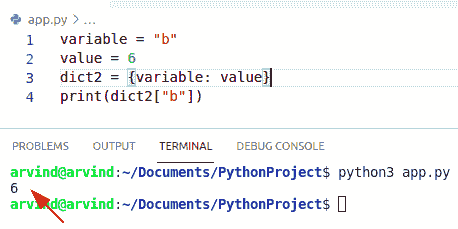
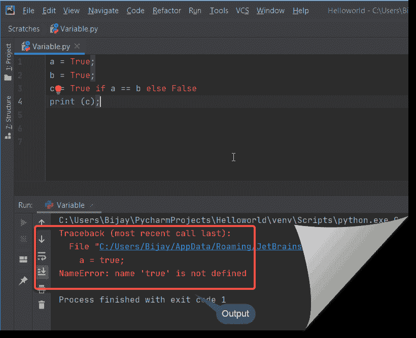

# 创建 Python 变量–完整教程

> 原文：<https://pythonguides.com/create-python-variable/>

[](https://sharepointsky.teachable.com/p/python-and-machine-learning-training-course)

在本 [Python 教程](https://pythonguides.com/python-hello-world-program/)中，我们将讨论**创建 Python 变量**并涵盖以下示例:

*   用 python 创建一个变量
*   用 python 创建一个全局变量
*   Python 声明变量
*   Python 变量类型
*   Python 变量范围
*   用 python 创建一个全局变量
*   Python 私有变量
*   Python 保护的变量
*   Python 中的静态变量
*   在 python 中创建一个字符串变量
*   用 python 创建一个虚拟变量
*   在 python 中创建一个空变量
*   在 python 循环中创建变量
*   在 python 中创建环境变量
*   Python 动态创建一个变量名
*   Python 创建了一个绑定到集合变量
*   python 从字符串创建变量名
*   Python 创建一个变量并赋值
*   Python 在循环中创建了一个变量
*   Python 创建了一个没有值变量
*   Python 为列表中的每个项目创建变量
*   Python 创建变量(如果不存在)
*   Python 创建了一个随机变量
*   Python 创建了一个布尔变量
*   Python 使字符串变量原始

目录

[](#)

*   [Python 变量](#Python_variable "Python variable")
*   [Python 声明变量](#Python_declare_variable "Python declare variable")
*   [给变量赋值和重新赋值](#Assign_and_reassign_value_to_a_variable "Assign and reassign value to a variable")
*   [Python 变量类型](#Python_variable_type "Python variable type")
*   [Python 变量作用域](#Python_variable_scope "Python variable scope")
*   [用 python 创建一个全局变量](#Create_a_global_variabe_in_python "Create a global variabe in python")
*   [Python 私有变量](#Python_private_variable "Python private variable")
*   [Python 保护的变量](#Python_protected_variable "Python protected variable")
*   [Python 中的静态变量](#Static_variable_in_Python "Static variable in Python")
*   [在 Python 中创建一个字符串变量](#Create_a_string_variable_in_Python "Create a string variable in Python")
*   [在 python 中创建一个虚拟变量](#Create_a_dummy_variable_in_python "Create a dummy variable in python")
*   [在 python 中创建一个空变量](#Create_a_empty_variable_in_python "Create a empty variable in python")
*   [在 python 循环中创建变量](#Create_variable_in_python_loop "Create variable in python loop")
*   [在 python 中创建环境变量](#Create_environment_variable_in_python "Create environment variable in python")
*   [Python 动态创建变量名](#Python_create_a_variable_name_dynamically "Python create a variable name dynamically")
*   [Python 创建一个绑定到集合的变量](#Python_create_a_variable_bound_to_a_set "Python create a variable bound to a set")
*   [Python 从字符串中创建变量名](#Python_create_a_variable_name_from_a_string "Python create a variable name from a string")
*   [Python 创建一个变量并赋值](#Python_create_a_variable_and_assign_a_value "Python create a variable and assign a value")
*   [Python 在循环中创建变量](#Python_create_a_variable_in_a_loop "Python create a variable in a loop")
*   [Python 创建了一个没有值的变量](#Python_create_a_variable_without_value "Python create a variable without value")
*   [Python 为列表中的每一项创建变量](#Python_create_variable_for_each_item_in_list "Python create variable for each item in list")
*   [Python 创建变量如果不存在](#Python_create_variable_if_not_exist "Python create variable if not exist")
*   [Python 创建一个随机变量](#Python_create_a_random_variable "Python create a random variable")
*   [Python 创建一个布尔变量](#Python_create_a_boolean_variable "Python create a boolean variable")
*   [Python 制作一个字符串变量 raw](#Python_make_a_string_variable_raw "Python make a string variable raw")

## Python 变量

变量只不过是一个存储信息或值的容器。换句话说， **python 变量**就像一个存储值或一些信息的内存位置。现在，这个值已经存储了，你以后可能会也可能不会更改。

## Python 声明变量

*   要声明一个 Python 变量，我们只需要给它赋值。你不需要给出任何额外的命令，不像其他编程语言，比如 C，Java，你需要给出额外的命令来声明和赋值。
*   如果你想指定一个变量的数据类型，这可以通过转换来完成。
*   要创建一个变量，你只需要给它赋值，然后开始使用它。

**举例:**

我们举个例子来检查一下**如何在 python** 中创建变量。

```py
x = 100
y = "John"
print(x)
print(y)
```

*   在上面的例子中，我们有两个变量 X 和 Y，我们给它们赋值。
*   我们给 100，给 100，所以这实际上是你如何在 python 中创建一个变量。

下面是以下代码的截图


Create a variable in python

这是另一个例子。

在 Python 中，声明变量时不需要提及类型。这就是 python 被称为动态类型化的的原因。

当我们给这个变量赋值的时候，python 会根据这个赋值决定变量的类型，并相应地分配内存。

示例:

```py
A = 19
B = "Python"
```

这里，A 和 B 是两个变量，分别包含值 19 和 Python。

Python 可以理解为 A 是整数变量把值看成“19”，B 是字符串变量把值看成“python”。

阅读: [Python 检查变量是否为整数](https://pythonguides.com/python-check-if-the-variable-is-an-integer/)

## 给变量赋值和重新赋值

当你想给一个变量赋值时，你需要使用 **"= "操作符**。“=”运算符的左边是变量名，右边是分配给它的值。

示例:

```py
a = 1
b = 11
c = 11.1
d = "Python"

print(a)
print(b)
print(c)
print(d)
```

让我们运行上面的代码，看看输出。输出应该是

```py
1
11
11.1
Python
```


Assign value to a variable

我们得到了预期的产量。见上文。

**如何重新分配变量**

你可以**在 python 中重新分配**一个变量，意思是假设你已经分配了一个= 3 的变量，你也可以给同一个变量分配一个不同的值，比如 a =“Hello”。

示例:

```py
a=3
print(a)
a="Hello"
print(a)
```


reassign value to a variable

**Python 变量多重赋值**

在 Python 中，我们可以在一行中给多个变量赋值**。为此，我们有两种方法。**

**方法-1:**

用多个“=”运算符将所有变量放在一行中，最后我们可以保留值。

示例:

```py
a = b = c = d = 23

print(a)
print(b)
print(c)
print(d)
```

我们可以在这里查看输出


执行代码后，我们得到了上面的预期输出。

**方法二:**

把所有的变量用逗号分隔，然后加上“=”运算符，然后在“=”运算符的右边用逗号分隔所有的值。

示例:

```py
a,b,c,d = 3
print(a)
print(b)
print(c)
print(d)
```

哎呀，我得到了一个错误，因为你不能以这种方式分配它。记住这个。您将得到一个错误“ **TypeError:无法解包不可迭代的 int 对象**”。见下文

```py
Traceback (most recent call last):
  File "C:/Users/Bijay/AppData/Roaming/JetBrains/PyCharmCE2020.1/scratches/Variable.py", line 1, in <module>
    a,b,c,d = 3
TypeError: cannot unpack non-iterable int object 
```


所以**正确做法**如下。您需要为每个值指定一个单独的值。

```py
a,b,c,d = 3,4,5,6
print(a)
print(b)
print(c)
print(d)
```


您还可以为每个值分配不同类型的值。

示例:

```py
a,b,c,d = 3,4.2,5,"PythonGuides"
print(a)
print(b)
print(c)
print(d)
```


multiple variables in python

阅读:[如何在 python 中把整数转换成字符串](https://pythonguides.com/convert-an-integer-to-string-in-python/)

## Python 变量类型

正如我们已经讨论过的，变量将由系统根据它们的类型决定分配内存的位置。所以让我们讨论几个基本类型的变量。

**1 号**

这种类型的变量包含数值。

python 中有四种类型的数值可用

`int`

示例:

```py
a = 11
print(a)
```

**龙**

```py
a = 4568934L
print(a)
Note: Python 3.8 version doesn't support a trailing L. It will show you invalid syntax.
```

**浮动**

```py
a = 11.5
print(a)
```

**复杂**

```py
a = 55.j
print(a)
```

**双弦**

这类变量包含字符串值。该字符串可以与单引号或双引号一起使用。

示例:

```py
s = "PythonGuides"

print(s)
```

```py
s = 'PythonGuides'

print(s)
```


Python variable types

**3-列表**

一个**列表**包含由逗号分隔的项目，并保持在**方括号([])内。**

示例:

```py
a = [11,12.3,'PythonGuides']

print(a)
```


Python variable type

**四元组**

一个**元组**与列表相同，但是它被放在括号 `( () )` 中。项目由逗号分隔。

示例:

```py
a = (11,12.3,'PythonGuides')

print(a)
```


Python variable types

**4-字典**

在 Python 中，可以用****({ })**编写**字典**。它们有**键和值对**。**

 **示例:

```py
mydict = {
  "good": "Exposure",
  "Average": "Knowledge",
  "Score": 200
}
print(mydict)
```


Dictionary in python

这些是 **Python 变量类型**。

阅读: [Python 串联词典](https://pythonguides.com/python-concatenate-dictionary/)

## Python 变量作用域

让我们讨论一下 **python 变量作用域**。

**1-局部范围**

在函数中创建的变量在该函数中有作用域。您可以在函数中使用**中变量。让我们看一个例子**

示例:

```py
def myLocal():
    a = 50
    print(a)
myLocal()
```


Local scope

**2-全局范围**

在函数外部或者程序主体中创建的变量**被称为**全局作用域**。**

示例:

```py
a = 50
def myLocal():

    print(a)
myLocal()
print(a)
```


Global scope

**3-封闭范围**

在下面的代码中，“b”在 myLocal()函数中具有局部范围，而“a”在 myLocal()函数中具有非局部范围。这就是所谓的**封闭范围**。

```py
def myTest():
            a = 50
            def myLocal():
                      b = 3
                      print(a)
                      print(b)
            myLocal()
            print(a)
myTest()
```


Enclosing Scope

这些是 **Python 变量作用域**。

阅读: [Python 检查变量是否为数字](https://pythonguides.com/python-check-if-a-variable-is-a-number/)

## 用 python 创建一个全局变量

*   在这一节中，我们将学习如何用 python 创建一个全局变量。
*   全局变量是可以被任何地方访问的变量。
*   在全局变量的函数或作用域之外声明的变量称为全局变量。
*   全局变量也可以用在函数或类的外部或内部。
*   为了在 Python 中**创建一个全局变量，你需要在函数之外或者在全局范围内声明这个变量。**

**举例:**

让我们举一个例子来检查如何在 python 中**创建一个全局变量。**

```py
n = 20

def funct1():
    print(n)
def funct2():
    print(n)
    funct1()
#main
funct2()
```

*   在上面给出的例子中，首先我将创建一个变量 n。
*   现在我将声明一个名为 funct1()的函数，并打印值 n。
*   之后，我将定义另一个名为 funct2()的函数打印值，并调用该函数。
*   大体上，我将调用另一个函数 funct2()。

下面是以下代码的截图


Create a global variable in python

在 Python 中还有另一种创建全局变量的方法。

使用**全局关键字**可以使变量成为全局变量，即使该变量存在于函数内部。让我们看一个例子。

示例:

```py
def myLocal():
global a
    a = 50
myLocal()
print(a)
```


实施例 2:

如果你想改变函数中**全局变量的值**

```py
a = 150
def myLocal():
  global a
  a = 50
myLocal()
print(a)
```


Global Keyword in Python

这就是我们如何通过使用 global 关键字**创建一个 Python 全局变量**。

阅读:[如何在 Python 中添加两个变量](https://pythonguides.com/add-two-variables-in-python/)

## Python 私有变量

通过声明你的变量为私有，你的意思是，没有人能够从类外访问它。

在 Python 中，在开头添加两个下划线(__)会使变量成为私有变量。这种技术被称为**名称 mangling** 。

让我们看一个例子，看看 python 私有变量到底是如何表现的。

示例:

```py
class Test:
    __age = 30
    def __Test2(self):
        print("Present in class Test")
    def Test3(self):
        print ("Age is ",Test.__age)
t = Test()
t.Test3()
t.__Test2()
t.__age
```

在这里查看输出

```py
Age is  30
Traceback (most recent call last):
  File "C:/Users/Bijay/AppData/Roaming/JetBrains/PyCharmCE2020.1/scratches/Variable.py", line 9, in <module>
    t.__Test2()
AttributeError: 'Test' object has no attribute '__Test2'
```


在`Test3()`方法中，`__age`变量可以像上面那样访问(`age is printed`)。这就是如何在 Python 中**创建私有变量。**

## Python 保护的变量

通过声明你的变量是受保护的，你的意思是，它和私有变量是一样的，只是多了一个优点，它们可以在被称为派生/子类的子类中被访问

在 Python 中，在开头添加单个**下划线(_)** 会使变量受到保护。

示例:

```py
class PythonGuides:
    # protected variable
    _name = "Raj"

    def Test(self):
        # accessing protected variable
        print("Name: ", self._name)
        # creating objects of the class
p = PythonGuides()

# functions of the class
p.Test()
```

查看输出

```py
Name:  Raj
```


Python protected variable

在继承的情况下，在父类中创建的受保护变量可以在派生类中访问。这就是如何在 Python 中**创建一个受保护的变量。**

## Python 中的静态变量

所有在类内部和方法外部声明的变量都称为静态变量。静态变量也称为类变量。

python 中没有特定的关键字来声明静态变量。

示例:

```py
class Test:
    var = 2           # static variable

print (Test.var)     # prints 2   (static variable)

# Access with an object
obj = Test()
print (obj.var)    # still 2

# difference within an object
obj.var = 3      #(Normal variable)
print (obj.var)    # 3   (Normal variable)
print (Test.var)     # 2   (static variable)

# Change with Class
Test.var = 5       #(static variable)
print (obj.var)    # 3  (Normal variable)
print (Test.var )
```

请参见下面的输出


python static variable

这就是如何在 Python 中**创建一个静态变量。**

阅读: [Python 将变量写入文件+示例](https://pythonguides.com/python-write-variable-to-file/)

## 在 Python 中创建一个字符串变量

*   在这一节中，我们将学习如何在 python 中**创建一个字符串变量。**
*   在 Python 中，字符串是 Unicode 字符的可迭代序列。Unicode 宣布包括所有语言中的所有字符，并引入编码。
*   它是单引号和双引号中的字符序列。
*   要在 Python 中声明一个字符串变量，我们必须在单引号或双引号中添加一个可迭代的字符序列。

**举例:**

让我们举一个例子来检查如何在 python 中创建一个字符串变量

```py
string1= "It's my pen"
string2= 'hello john'
print(string1)
print(string2)
```

*   在上面的例子中，我已经包含了两个字符串。第一个字符串用双引号括起来。您可以在第一个字符串中添加单引号字符。
*   第二个字符串用单引号括起来，不能在第一个字符串中添加任何单引号字符。

下面是以下代码的截图


Create a string variable in python

这就是如何创建一个 **Python 字符串变量。**

阅读: [Python 从字符串中移除子串+示例](https://pythonguides.com/python-remove-substring-from-a-string/)

## 在 python 中创建一个虚拟变量

*   在这一节中，我们将学习如何在 python 中创建一个虚拟变量。
*   虚拟变量在您执行任何机器学习任务时都很有用，因为所有的机器学习库都从现有数据中获取数字数据。
*   在此基础上建立机器学习模型。但是在现实世界的数据集中，有可能既有数值数据又有分类数据。
*   虚拟变量是一个二进制值，它给出了一个信号，表明一个单独的分类变量是否具有特定的值。
*   在这个方法中，我们将使用函数 get_dummies()声明国家名称的三个变量。

**语法:**

```py
pandas.get_dummies
                  (
                   data,
                   prefix=None,
                   prefix_sep=' ',
                   dummy_na=False,
                   dtype=None
                  )
```

*   它由几个参数组成
    *   **数据:**获取虚拟指标的数据。
    *   **Prefix:** 追加 DataFrame 列名的字符串。当像 df 一样在数据帧上调用 get_dummies 时，传递一个长度等于列数的列表。
    *   **Dummy_na:** 添加一列以获得信号 NaNs，如果假 NaNs 被忽略。
    *   **返回:** DataFrame(虚拟数据)。

**举例:**

让我们举一个例子来检查如何在 Python 中创建一个虚拟变量。

```py
import pandas as pd
import numpy as np

dataf = pd.DataFrame({'Countries': ['Japan', 'Germany', 'U.S.A', 'AFRICA'],
                   })

print(dataf)
y = pd.get_dummies(dataf)
print(y)
```

*   在上面的代码中，我们将首先导入所有需要的模块，使用 dictionary 方法声明一个数据集。
*   使用数据变量显示数据集。
*   使用 get_dummies 函数创建变量

下面是以下代码的截图


Create a dummy variable in python

阅读: [Python 比较字符串](https://pythonguides.com/python-compare-strings/)

## 在 python 中创建一个空变量

*   在这一节中，我们将学习如何在 python 中**创建一个空变量。**
*   Python 是一种编程语言，所以不需要创建这种类型的变量，当第一次给它赋值时，它会自动声明。
*   要在 python 中创建空变量，只需赋值 none。

**举例:**

让我们举一个例子来检查如何在 python 中创建一个空变量

```py
variable = None
print(variable)
```

下面是以下代码的截图


Create an empty variable in python

## 在 python 循环中创建变量

*   在这一节中，我们将学习如何在 python 循环中**创建一个变量。**
*   在 for 循环中使用字符串格式创建变量名。
*   使用 for 循环方法和 range(start，stop)在从开始到停止的范围内顺序迭代。
*   在 for 循环中，使用字符串格式语法 d[] = value 将许多不同的键映射到同一个值。

**举例:**

让我们举一个例子来检查如何在 python 循环中创建变量

```py
d = {}
for x in range(1, 6):
   b= d["string{0}".format(x)] = "John"
   print(b)
```

下面是以下代码的截图


Create variable in python loop

阅读: [Python For 循环示例](https://pythonguides.com/python-for-loop/)

## 在 python 中创建环境变量

*   在这一节中，我们将学习如何在 python 中**创建环境变量。**
*   环境变量通过操作系统包实现，通常是操作系统。环境。
*   从应用程序内部检索变量的最简单方法是使用标准字典。
*   它是当前用户环境的一组键值对。
*   它们用于以一致的方式配置和管理 Python 库。

示例:

让我们举一个例子来检查如何在 python 中创建环境变量

```py
import os
user = os.environ['USER']
print(user)
```

下面是以下代码的截图


Create environment variable in python

## Python 动态创建变量名

*   在本节中，我们将学习如何动态创建变量名。
*   要动态声明变量名，我们可以使用 for 循环方法和 globals()方法。
*   它基本上是一个变量，其名称是另一个变量的估计值。
*   Python 是一种动态编程语言，可以在 Python 中创建动态变量。
*   全局方法以字典的形式提供输出。
*   字典既有键又有值对，所以使用字典创建动态变量名很容易。

**举例:**

```py
variable = "b"
value = 6
dict2 = {variable: value}
print(dict2["b"])
```

下面是以下代码的截图



Python creates a variable name dynamically

阅读: [Python 命名约定](https://pythonguides.com/python-naming-conventions/)

## Python 创建一个绑定到集合的变量

*   在本节中，我们将学习如何创建绑定到集合的变量。
*   Abound variable 是以前是自由的，但已经绑定到一个特定值或一组值的变量。
*   要创建一个绑定到集合的变量，我们可以使用 for 循环方法和 globals()方法。
*   它将实例作为对象传递，第一个参数用于访问变量和函数。

**举例:**

让我们举一个例子来检查如何创建一个绑定到集合的变量

```py
var="apple"
apple1=()
apple2=()
apple3=()
for i in range(4):
    globals()[ var+str(i)]='a'

print(apple1)
print(apple2)
print(apple3)
```

下面是以下代码的截图


Python creates a variable bound to a set

## Python 从字符串中创建变量名

*   在本节中，我们将学习如何从字符串创建变量名。
*   要从字符串创建变量名，我们可以很容易地使用函数 exec()。
*   exec()函数用于动态执行程序。

**举例:**

让我们举一个例子来检查如何通过 exec()方法从字符串创建变量名。

```py
variable = 'John'
John=[]
exec("%s = %d" % (variable,10))
print(John)
```

*   首先在上面的例子中，我们有一个变量，我们在其中存储了一个字符串值 john。
*   在 `exec()` 函数中，我们有 **%s** 和 **%d** 分别作为字符串值和十进制值的占位符。这意味着我们在赋值操作符的帮助下将一个整数值赋给一个字符串。

下面是以下代码的截图


Python creates a variable name from a string

*   另一种方法是使用 `globals()` 方法。
*   全局方法以字典的形式提供输出。

**举例:**

让我们举一个例子来检查如何使用 globals()方法从字符串创建变量名。

```py
str = "John"
John=[]
globals()[str] = 500
print(John)
```

*   首先在上面的例子中，我们将 str 中的一个输入作为 john。
*   然后我们必须通过 globals()方法更新字符串的元素。

下面是以下代码的截图


Python creates a variable name from a string by the globals method

阅读:[如何在 python 中使用正则表达式拆分字符串](https://pythonguides.com/python-split-string-regex/)

## Python 创建一个变量并赋值

*   在本节中，我们将学习**如何创建一个变量并赋值**。
*   要创建一个变量，你只需要给它赋值，然后开始使用它。
*   等号运算符用于给变量赋值。
*   在 python 编程语言中，没有声明变量的命令。
*   还可以用 type()函数获取变量的数据类型。

**举例:**

让我们举一个例子来检查如何创建一个变量并赋值

```py
x = 10
y = "Micheal"
print(x)
print(y)
```

*   在上面的例子中，我们有两个变量 X 和 Y，我们给它们赋值。
*   我们给 X 取了 10，给 Y 取了 Micheal，这就是你在 python 中创建变量的方法。

下面是以下代码的截图


Python create a variable and assign a value

## Python 在循环中创建变量

*   在本节中，我们将学习如何在循环中创建变量。
*   为了在循环中创建一个变量，我们使用了一个循环方法。
*   Python for 循环方法以关键字“for”开始，后跟一个变量名，该变量名将保存下面的对象的值，该对象将被单步执行。
*   首先，我们将创建一个变量并把输入值和字符放在一个列表或元组中，然后在我们将使用 for 循环的方法后打印这个变量。

**举例:**

让我们举一个例子来检查如何在循环中创建一个变量

```py
languages = ["Python3", "Java", "Ruby", "pascal"] 
for language in languages:
    print(language)
```

下面是以下代码的截图


Python create a variable in a loop

阅读: [Python While 循环示例](https://pythonguides.com/python-while-loop/)

## Python 创建了一个没有值的变量

*   在本节中，我们将学习并讨论如何创建一个没有值的变量。
*   Python 是一种动态语言，所以不需要创建这种类型的变量，当第一次赋值给它时，它会自动声明。
*   要创建一个没有值的变量，我们只需将变量赋值为 None。

**举例:**

让我们举一个例子来检查如何创建一个没有值的变量。

```py
variable = None
print(variable)
```

下面是以下代码的截图


Python create a variable without a value

## Python 为列表中的每一项创建变量

*   要为列表中的每一项创建一个变量，我们可以很容易地使用 for 循环方法。
*   我们可以通过索引提取每个列表元素，然后将其分配给变量。
*   通过使用列表理解，我们可以为特定的索引运行一个循环，并将它们分配给所需的变量。

**举例:**

让我们举一个例子来检查如何为列表中的每一项创建一个变量。

```py
a,b,c = [1,2,3]
x,y,z = [str(e) for e in [a,b,c]]
print(x,y,z)
```

下面是以下代码的截图


Python create variable for each item in a list

阅读: [Python 串联列表示例](https://pythonguides.com/python-concatenate-list/)

## Python 创建变量如果不存在

*   在这一节中，我们将学习如何创建一个 Python 中没有的变量。
*   在 Python 中，变量可以局部定义，也可以全局定义。局部变量定义在函数内部，全局变量定义在函数外部。
*   为了创建一个局部变量，我们将使用 local()函数。

**举例:**

让我们举一个例子来检查如果变量不存在如何创建变量。

```py
def func():

            a_ = 0

            local_variable = "a_" in locals()

            print(local_variable)
func()
```

下面是以下代码的截图


Python creates variables if not exist

## Python 创建一个随机变量

*   在这一节中，我们将学习如何在 Python 中**创建一个随机变量。**
*   随机整数值可以由 randint()函数产生。此函数接受两个参数，即生成的整数值范围的开始和最后一个。
*   在这个方法中，我们可以很容易地使用函数 randint()。
*   randint()是 Python 中 random 模块的一个函数。
*   首先，我们将声明一个变量，传递 randint()函数中的值并打印该值。

**举例:**

让我们举一个例子来检查如何创建一个随机变量

```py
# generate random integer values
from random import randint
import random

value = randint(1,4)
print(value)
```

下面是以下代码的截图


Python creates a random variable

## Python 创建一个布尔变量

*   在本节中，我们将学习**如何创建一个布尔变量**。
*   在 python 中，布尔变量被定义为真或假。
*   在这种情况下，变量只能有两个可能的值:true 和 false。
*   为了创建一个布尔变量，我们使用关键字 bool。
*   此 bool()函数用于返回一个值或将一个值转换为布尔值。

**举例:**

让我们举一个例子来检查如何创建一个布尔变量

```py
def check(num):
    return(bool(num%2==0))
num = 10;
if(check(num)):
    print("True")
else:
    print("False")
```

*   在上面的例子中，我们首先创建一个函数检查并传递参数 num。
*   下一步是我们必须创建一个布尔函数，并采用偶数条件来检查 num 变量是偶数还是奇数。
*   如果数字是偶数，它将打印结果为真，否则为假。

下面是以下代码的截图


Python create a boolean variable

这是另一个场景:

这里，布尔变量由**真**或**假**关键字定义。

这里需要注意的一点是 `True` 和 **False 应该以第一个字母大写**。如果你写真和假，它会显示一个错误。让我们检查一下这个场景。

例子

```py
a = true;
b = True;
c = True if a == b else False
print (c);
```

糟糕，我在第一行**“name error:name ' true '未定义”**中发现了错误。

上面的错误是因为我们犯了提及真实的错误。应该是真的(首字母大写)

正确的语法是

```py
a = True;
b = True;
c = True if a == b else False
print (c);
```

输出如下所示



Python boolean variable

这是如何在 Python 中创建一个布尔变量。

阅读: [Python 布尔值](https://pythonguides.com/python-booleans/)

## Python 制作一个字符串变量 raw

*   在这一节中，我们将学习**如何将一个字符串变量变成 raw** 。
*   原始字符串不将反斜杠(" \ ")视为转义序列的一部分。
*   当我们有一个包含反斜杠的字符串并且不希望它被当作转义字符时，这是主要的方法。
*   如果我们不尝试打印一个包含“\n”的字符串，它将添加一个新的换行符。但是如果我们将它标记为一个字符串，它将简单地将“\n”作为一个字符打印出来。

**举例:**

让我们举一个例子来检查如何使一个字符串变量原始

```py
a = "Hello\Pythonguides\nHi"
print(a)
```

下面是以下代码的截图


Python makes a string variable raw

在本 Python 教程中，我们将讨论创建 Python 变量，并涵盖以下示例:

*   用 python 创建一个变量
*   Python 声明变量
*   Python 变量类型
*   Python 变量范围
*   用 python 创建一个全局变量
*   Python 私有变量
*   Python 保护的变量
*   Python 中的静态变量
*   在 python 中创建一个字符串变量
*   用 python 创建一个虚拟变量
*   在 python 中创建一个空变量
*   在 python 循环中创建变量
*   在 python 中创建环境变量
*   Python 动态创建一个变量名
*   Python 创建了一个绑定到集合变量
*   python 从字符串创建变量名
*   Python 创建一个变量并赋值
*   Python 在循环中创建了一个变量
*   Python 创建了一个没有值变量
*   Python 为列表中的每个项目创建变量
*   Python 创建变量(如果不存在)
*   Python 创建了一个随机变量
*   Python 创建了一个布尔变量
*   Python 使字符串变量原始

[Bijay Kumar](https://pythonguides.com/author/fewlines4biju/)

Python 是美国最流行的语言之一。我从事 Python 工作已经有很长时间了，我在与 Tkinter、Pandas、NumPy、Turtle、Django、Matplotlib、Tensorflow、Scipy、Scikit-Learn 等各种库合作方面拥有专业知识。我有与美国、加拿大、英国、澳大利亚、新西兰等国家的各种客户合作的经验。查看我的个人资料。

[enjoysharepoint.com/](https://enjoysharepoint.com/)[](https://www.facebook.com/fewlines4biju "Facebook")[](https://www.linkedin.com/in/fewlines4biju/ "Linkedin")[](https://twitter.com/fewlines4biju "Twitter")**