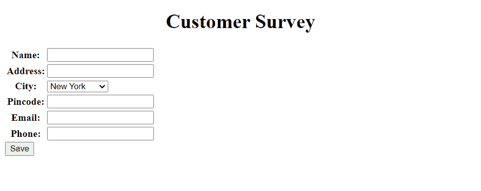

# 如何在 Python Django 中创建 web 表单

> 原文：<https://pythonguides.com/create-web-form-in-python-django/>

[](https://sharepointsky.teachable.com/p/python-and-machine-learning-training-course)

在这个 [Python Django 教程](https://pythonguides.com/what-is-python-django/)中，我将解释如何使用 Django 表单。

作为一名 Python Django 开发人员，在从事 Django 项目时，我收到了从用户那里收集信息的要求。所以，我做了研究，发现我们可以在 Python Django 中创建 web 表单。

在这里我们将看到:

*   什么是 web 表单
*   Django 的表格类型
*   Django 表单如何工作
*   Django 中的各种表单字段
*   如何使用 form 类在 Python Django 中创建 web 表单
*   如何使用 ModelForm 类在 Python Django 中创建 web 表单
*   如何在 Django 中使用各种控件，如文本框、下拉框、电子邮件、日期选择器和单选按钮
*   如何上传 Django 格式的文件

在本文的最后，您还可以使用 Form 类和 ModelForm 类下载 Django 表单的代码。

目录

[](#)

*   [使用 Django 表单](#Working_with_Django_forms "Working with Django forms")
    *   [网页表单](#Web_Form "Web Form")
    *   [Django 的表格类型](#Types_of_form_in_Django "Types of form in Django")
    *   [Django 表单如何工作](#How_Django_forms_work "How Django forms work")
    *   [Django 表单中的各个字段](#Various_fields_in_the_Django_form "Various fields in the Django form")
    *   [如何使用表单类在 Python Django 中创建 web 表单](#How_to_create_web_form_in_Python_Django_using_the_Form_class "How to create web form in Python Django using the Form class")
        *   [建立 Django 项目](#Set_up_Django_Project "Set up Django Project")
        *   [使用表单类](#Create_Django_Form_using_Form_Class "Create Django Form using Form Class")创建 Django 表单
        *   [在 Django 中以表格的形式呈现表单](#Render_the_form_as_a_table_in_Django "Render the form as a table in Django")
        *   [定义视图](#Define_View "Define View")
        *   [执行 Django 应用程序](#Execute_Django_Application "Execute Django Application")
    *   [如何使用 ModelForm 类在 Python Django 中创建 web 表单](#How_to_create_web_form_in_Python_Django_using_the_ModelForm_class "How to create web form in Python Django using the ModelForm class")
        *   [设置 Django 项目](#Setup_Django_Project "Setup Django Project")
        *   [创建 Django 模型](#Create_Django_Model "Create Django Model")
        *   [使用 ModelForms 类在 Python Django 中创建 Web 表单](#Create_Web_Form_in_Python_Django_using_ModelForms_Class "Create Web Form in Python Django using ModelForms Class")
        *   [Django 文件上传设置](#Setup_for_Django_file_upload "Setup for Django file upload")
        *   [在 Django 中以表格的形式呈现表单](#Render_the_form_as_a_table_in_Django-2 "Render the form as a table in Django")
        *   [定义视图](#Define_View-2 "Define View")
        *   [执行 Django 应用程序](#Execute_Django_Application-2 "Execute Django Application")
        *   [从 Django 管理界面查看提交的数据](#View_submitted_data_from_the_Django_admin_interface "View submitted data from the Django admin interface")
*   [下载 Django 网络表单完整代码](#Download_Django_web_form_complete_code "Download Django web form complete code")
*   [结论](#Conclusion "Conclusion")

## 使用 Django 表单

现在，让我们首先了解 Django 表单，并逐步学习使用 Form 类和 ModelForm 类创建 Django 表单。

### 网页表单

web 表单是一个网页，其中有许多供用户输入数据或信息的字段。

不同的字段，包括文本框、复选框、单选按钮、数字框、图像框、日期选取器等，在表单中用于收集各种类型的数据。

此外，每个字段都有一个字段标签，这样任何查看表单的人都可以理解每个字段包含的内容。

通过 POST 请求提交数据的能力使表单成为与服务器共享数据的另一种非常安全的方式。

阅读: [Python Django vs 金字塔](https://pythonguides.com/python-django-vs-pyramid/)

### Django 的表格类型

下一步是在了解 web 表单之后，理解 Django 提供的各种表单类型。因此，在 Django 中有两种形式，如下所示。

*   **简单 Django 形式:**简单形式是独立于模型的形式。创建表单**表单。使用表单**类。它基本上创建 HTML 表单，并描述它是如何工作和出现的。
*   **Django 带模型的表单:**带模型的表单类似于简单表单，但是它需要模型。创建模型表单**表单。使用了 ModelForm** 类。

阅读: [Python Django 设置时区](https://pythonguides.com/python-django-set-timezone/)

### Django 表单如何工作

一般用简单的 HTML 来呈现这些表单，可以用 JavaScript 和 CSS 来样式化。

幸运的是，Django 框架提供了表单，这简化了过程，让开发人员在构建表单时可以从零开始。


Django Form Working

根据上图，Django 的表单以如下方式工作:

*   当用户第一次请求表单时，会显示默认表单。
*   然后验证数据的有效性。
*   如果是，它将执行必要的操作，包括保存数据和提供结果。
*   如果没有，表单将再次显示用户输入的数据和错误通知。
*   最后，在表单成功提交后，它会转到另一个页面。

阅读: [Python Django vs ReactJS](https://pythonguides.com/django-vs-reactjs/)

### Django 表单中的各个字段

如上所述，web 表单是一个有许多字段的网页，所以我们可以说字段是表单最重要的部分。

所以，来看看 Django 中使用的所有表单字段类型的列表。

```py
from django import forms
dir(forms)
```


Forms class fields

以下是 Django 表单中最常用的字段。

| **字段名** | **类** | **HTML 输入** |
| **查菲尔德** | CharField 类(* *夸脱) | TextInput 组件 |
| **电子邮件字段** | 电子邮件合并类(* * quartz) | 电子邮件输入 |
| **密码字段** | 类别密码字段(**kwargs) | 密码输入 |
| **整数文件** | IntegerField 类(**kwargs) | 数字输入 |
| **十进制字段** | 十进制字段级(* *夸脱) | 数字输入 |
| **日期字段** | 类日期字段(**kwargs) | 日期输入 |
| **日期时间字段** | 类数据时间字段(**kwargs) | 日期时间输入 |
| **布尔字段** | BooleanField 类(**kwargs) | 复选框输入 |
| **选择字段** | 类别选择字段(* *夸脱) | 挑选 |
| **文件字段** | 类文件字段(**kwargs) | ClearableFileInput |
| **图像域** | 类别 ImageField(**kwargs) | ClearableFileInput |

阅读:[如何在 Django 中创建模型](https://pythonguides.com/create-model-in-django/)

### 如何使用表单类在 Python Django 中创建 web 表单

#### 建立 Django 项目

首先，我们需要使用下面给出的命令在 Django 中建立一个项目。这里 `SurveyProject` 是项目的名称。

```py
django-admin startproject SurveyProject
```

现在，在 Django 项目中，使用如下命令创建一个名为 `SurveyApp` 的 Django 应用程序。

```py
python manage.py startapp SurveyApp
```

打开项目目录下的 `settings.py` 文件，将 `SurveyApp` 添加到 `INSTALLED_APP` 列表中。


settings.py

Django 中的请求首先到达位于项目目录中的 `urls.py` ，然后到达 app 目录中 urls.py 中的匹配 URL。在其中添加下面的代码。

```py
from django.contrib import admin
from django.urls import path,include

urlpatterns = [
    path('admin/', admin.site.urls),
    path('',include('SurveyApp.urls')),
]
```

阅读: [Python Django MySQL CRUD](https://pythonguides.com/python-django-mysql-crud/)

#### 使用表单类创建 Django 表单

创建 Django 表单， `SurveyApp` 应用程序将使用该表单来收集用户输入。将以下代码添加到您在 app 目录中创建的 `forms.py` 文件中。

```py
from django import forms

# Create your forms here.

CITY_CHOICES =(
    ("1", "New York"),
    ("2", "Washington"),
    ("3", "Los Angeles"),
    ("4", "Houston"),
    ("5", "Las Vegas"),
)

class CustomerForm(forms.Form):
    name = forms.CharField(max_length=50)
    address = forms.CharField(max_length=150)
    city = forms.ChoiceField(choices=CITY_CHOICES)
    pincode = forms.IntegerField()
    email = forms.EmailField()
    phone = forms.IntegerField()
```

这里，我们使用**表单创建一个表单。名为 `CustomerForm` 的表单**类。下面是该表单包含的字段。

1.  **姓名**和**地址**为 Django CharFields。姓名和地址的长度分别限制在 50 个字符和 150 个字符以内。
2.  作为 Django IntegerFields 的**密码**和**电话**。
3.  **电子邮件**是 Django EmailField，允许用户保存电子邮件地址。
4.  **城市**是 Django ChoiceField 字段，并且有一个 choices 选项可以用作字段的选项，并且由项目的 iterables 组成。
5.  我们为此定义了一个名为 `CITY_CHOICES` 的元组。

阅读: [Django 联系表，包含基于类的视图](https://pythonguides.com/django-contact-form-with-class-based-views/)

#### 在 Django 中以表格的形式呈现表单

在主项目目录中创建一个名为 `Templates` 的子目录来存储 Django 应用程序的前端。

打开 `settings.py` 文件，更新 `DIRS` 指向 Templates 文件夹的位置。


settings.py

为了定义调查网页的前端，在**模板**文件夹中创建一个名为`forms.html`的 HTML 文件。并添加下面的代码。

```py
<!DOCTYPE html>
<html lang="en">

<head>
    <meta charset="UTF-8">
    <meta http-equiv="X-UA-Compatible" content="IE=edge">
    <meta name="viewport" content="width={device-width}, initial-scale=1.0">
    <title>Document</title>
</head>

<body>
    <form method="POST" class="post-form">
        
        <h1 align="center">Coustomre Survey</h1>
        <table>
        {{ form.as_table}}
        </table>
        <button type="submit" class="save btn btn-default">Submit</button>
    </form>
</body>

</html>
```

*   首先使用 HTML 标签 `h1` 将标题添加到表单中。然后用方法 `POST` 调用**表单**标签，这样表单在提交后就被发布了。
*   为了防止表单受到网络攻击并允许您安全地发送信息，请在**表单**元素中添加 **** 。
*   接下来，调用表单，并通过使用 **{{form.as_tabel}}** 标签将其显示为表格。当我们在表格中呈现表单时，在**表格**标签中传递这个标签。
*   最后，添加一个**提交**按钮来提交表单。

阅读:[创建一个 Django 联系表单，并附上电子邮件](https://pythonguides.com/build-a-django-contact-form-with-email/)

#### 定义视图

要定义表单的主要逻辑，打开 `views.py` 文件并添加下面给出的代码。

```py
from django.shortcuts import render
from .forms import CustomerForm

# Create your views here.

def customer(request):
    if request.method == 'POST':
        form = CustomerForm(request.POST)
        if form.is_valid():
            Name = form.cleaned_data['name']
            Address = form.cleaned_data['address']
            City = form.cleaned_data['city']
            Pincode = form.cleaned_data['pincode']
            Email = form.cleaned_data['email']
            Phone = form.cleaned_data['phone']
            print('Name:', Name)
            print('Full Address:', Address, City, Pincode)	
            print('Email:', Email)
            print('Phone:', Phone)
    form = CustomerForm()
    return render(request, "forms.html", {'form':form})
```

*   首先，从 `forms.py` 中导入**客户表单**，并创建一个名为**客户**的视图。
*   然后调用 `if` 语句，检查请求方法是否为 `POST` 。
    *   如果是，我们通过 **CoustomerForm(请求。POST)** 将数据绑定到表单类，这样我们就可以进行验证。
    *   现在，调用 `is_valid` 方法来验证用户输入的内容，如果验证成功，调用表单**cleaned _ data[‘表单域’]**来验证数据。
    *   并使用 `print()` 函数在终端上显示用户结果。
*   如果请求方法是 `GET` ，则使用 `render()` 函数向用户呈现一个空白的调查表。

现在，我们必须用 URL 映射视图以便调用它，因此我们必须在 app 目录中创建一个名为 `urls.py` 的文件。包括下面的代码。

```py
from django.urls import path
from SurveyApp import views

urlpatterns = [
    path("", views.customer, name="customer"),   
]
```

#### 执行 Django 应用程序

要启动开发服务器，请在终端中键入下面给出的命令并运行服务器。

```py
python manage.py runserver
```

它成功地打开了如下所示的客户调查表。



Customer Survey Form using Forms Class

现在，请填写此联系表格，并点击提交按钮，如下所示。


Survey Form using Forms Class

点击提交后，会在终端上打印出**姓名**、**全称**、**电子邮件**和**电话**。


Terminal Output

这就是使用 form 类创建 Django 表单的方法。

阅读: [Python Django group by](https://pythonguides.com/python-django-group-by/)

### 如何使用 ModelForm 类在 Python Django 中创建 web 表单

#### 设置 Django 项目

Django web 应用程序总是有一个包含多个应用程序的项目。因此，我们需要首先使用下面给出的命令创建一个项目。

```py
django-admin startproject CareerClub
```

现在，是时候在 Django 项目中创建一个应用程序了。因此，在终端中键入下面给出的命令。

```py
python manage.py startapp Apply
```

为了考虑我们项目中的应用程序，我们需要将我们的项目名称包含在位于项目目录内的 `settings.py` 文件中的 `INSTALLED_APPS` 列表中。


settings.py

Django 自动在项目目录中创建一个 `urls.py` 文件。为了路由我们的应用程序，我们需要在其中包含**应用**应用程序，如下所示。

```py
from django.contrib import admin
from django.urls import path,include

urlpatterns = [
    path('admin/', admin.site.urls),
    path('',include('Apply.urls')),
]
```

#### 创建 Django 模型

当我们创建 Django 项目时，我们收到了一个空的 SQLite 数据库。为了在其中创建一个新表，我们必须创建一个新模型。

要在 Django 中创建模型，打开 app 目录中的 `models.py` 文件，并添加下面给出的代码。

```py
from django.db import models

# Create your models here.

class Resume(models.Model):
    full_name = models.CharField(max_length=150)
    gender = models.CharField(max_length=10)
    date_of_birth = models.DateField()
    email = models.EmailField()
    current_address = models.CharField(max_length=300)
    city = models.CharField(max_length=20)
    state = models.CharField(max_length=20)
    resume = models.FileField(upload_to='resumes/')

    def __str__(self):
        return self.full_name
```

这里，我们创建了一个模型类 `Resume` ，它有以下字段。

1.  全名是 Django CharFields。这个字符字段有 150 个字符的限制。
2.  性别是姜戈·查菲尔德。并且该字符字段有 10 个字符的限制。
3.  **出生日期**是姜戈日期字段。它用于收集用户的出生日期。
4.  **电子邮件**是 Django EmailField，允许用户保存电子邮件地址。
5.  `cuurent_address` 是 Django CharField。这个字符字段有 300 个字符的限制。
6.  **城市**和**州**是 Django CharFields。这些字段的**最大长度**限制为 20。
7.  **简历**是用于上传文件的 Django 文件字段。此外，它还有一个 `upload_to` 选项，用于定义文件在媒体中的保存位置。

并使用 `def __str__(self)` 来更改 Django 模型中对象的显示名称。当我们返回 `self.full_name` 时，它会将项目名称显示为全名。

将模型注册到管理站点，以便用户可以在管理应用程序中查看它。打开 `admin.py` 文件，添加下面给出的代码。

```py
from django.contrib import admin
from .models import Resume

# Register your models here.

admin.site.register(Resume)
```

阅读:[模型 Django 上的联合操作](https://pythonguides.com/union-operation-on-models-django/)

#### 使用 ModelForms 类在 Python Django 中创建 Web 表单

如果我们用 Django 表单和 Django 模型构建一个数据库驱动的应用程序。在这种情况下，模型字段和表单字段的质量和数量对于模型和表单都是相同的。

我们可以直接使用 ModelForm，而不是编写重复的代码来首先生成一个表单，然后将其映射到视图中的模型。

要创建一个表单，将下面的代码添加到我们在 app 目录中创建的 `forms.py` 文件中。

```py
from django import forms
from .models import Resume

select_gender = (
    ("male", "Male"),
    ("female", "Female"),
    ("other", "Other"),
)

class DateInput(forms.DateInput):
    input_type = 'date'

select_city = (
    ("new york", "New York"),
    ("los angeles", "Los Angeles"),
    ("houston", "Houston"),
    ("chicago", "Chicago"),
    ("phoenix", "Phoenix"),
    ("austin", "Austin"),
    ("boston", "Boston"),
    ("las vegas", "Las Vegas"),
    ("columbia", "Columbia"),
    ("waco", "Waco"),
)

select_state = (
    ("new york", "New York"),
    ("california", "California"),
    ("iiiinois", "IIIinois"),
    ("texas", "Texas"),
    ("arizona", "Arizona"),
    ("massachusetts", "Massachusetts"),
    ("nevada", "Nevada"),
    ("south carolina", "South Carolina"),   
)

class ResumeForm(forms.ModelForm):
    class Meta:
        model = Resume
        fields = '__all__'
        widgets = {
            "gender": forms.RadioSelect(choices=select_gender),
            "date_of_birth": DateInput,
            "city": forms.Select(choices=select_city),
            "state": forms.Select(choices=select_state),
        }
```

*   这里，我们使用**表单创建一个表单。名为**的模型**类简历**。它有来自**简历**模型的所有字段。
*   此外，我们定义了 `widgets` 属性，将**性别**设置为单选按钮，**出生日期**设置为日期选择器，**城市**，以及**州名**设置为下拉按钮。
*   将**城市**和**州**设置为**选择**，传递一个**选择**选项，是作为一个字段选项的序列。我们为城市字段定义元组 `select_city` ，为州字段定义元组 `select_state` 。
*   性别设置为**单选**，传递一个**选择**选项，该选项是用作字段选项的序列。我们为性别字段定义了元组 `select_gender` 。

#### Django 文件上传设置

因为我们已经使用了模型中的**文件字段**来上传文件。我们必须设置一些设置来保存上传的文件。

为此，打开 `settings.py` 文件，并在文件末尾添加下面给出的行。

```py
import os
MEDIA_URL = '/media/'
MEDIA_ROOT = os.path.join(BASE_DIR, 'media')
```

*   **媒体 URL:** 用户可以使用此 URL 从浏览器上传文件。
*   **媒体根:**指定文件存储的主要位置。它指示 Django 将所有上传的文件保存在一个名为**媒体**的文件夹中。

**注意:**要保存提交的文件，我们必须在主项目目录中手动创建名为 media 的文件夹。

读: [Django for 循环](https://pythonguides.com/django-for-loop/)

#### 在 Django 中以表格的形式呈现表单

在 Django 中，应用程序的**前端**是在模板中定义的，为此，在主项目目录中创建一个名为**模板**的子目录来存储所有的项目模板。

打开 `settings.py` 文件，更新 `DIRS` 指向 Templates 文件夹的位置。


Setting Template Folder Location

```py
<!DOCTYPE html>
<html lang="en">

<head>
    <meta charset="UTF-8">
    <meta http-equiv="X-UA-Compatible" content="IE=edge">
    <meta name="viewport" content="width=device-width, initial-scale=1.0">
    <title>Job Application</title>
    <style>
        table {
            border: 8px outset;
            border-radius: 10px;
            border-spacing: 10px;
            padding: 20px;
            margin-left: auto;
            margin-right: auto;
        }
    </style>
</head>

<body>
    <h1 align="center">Job Application</h1>
    <hr>
    <h3 align="center">Please complete the form below to apply for a position with us.</h3>
    <hr>
    <br>
    <form method="post" enctype="multipart/form-data">
        
        <table>
            {{form.as_table}}
        </table>
        <br><br>
        <div style="text-align:center">
            <input type="submit" />
        </div>
    </form>
</body>

</html>
```

*   首先，我们在**头**标签中设置**表**的**样式**。
*   然后使用 HTML 标签 `h1` 和 `h4` 将表单的标题添加到 body 标签中。
*   一旦表单被提交，通过调用表单标签的 `POST` 方法，表单就会被提交。
*   在**表单**标签中添加`enctype = " multipart/form-data "`，否则表单将无法工作。
*   在表单元素中添加 `csrf_token` 来保护表单免受网络攻击，并使您能够安全地传输数据。
*   接下来，使用 `form.as_table` 标签将表单呈现为表格。
*   最后，添加一个**提交**按钮来提交表单。

#### 定义视图

要定义工作申请表的主要逻辑，打开 `views.py` 文件并添加下面给出的代码。

```py
from django.shortcuts import render,HttpResponse
from .forms import ResumeForm

# Create your views here.

def jobapply(request):
    if request.method == 'POST':
        form = ResumeForm(request.POST,request.FILES)
        if form.is_valid():
            form.save()
            return HttpResponse('Your Job Application is successfully submitted')
    else:
        form = ResumeForm()
        context = {
            'form':form,
        }
    return render(request, 'apply_form.html', context) 
```

*   首先，从 `forms.py` 中导入 `ResumeForm` 并创建一个名为 `jobapply` 的视图。
*   然后，调用 `if` 语句，检查请求方法是否为 `POST` 。
    *   如果是，只需添加一个**请求。文件**连同**请求。将**发布到表单方法中。
    *   调用 `is_valid` 方法验证用户输入的内容，如果验证成功调用 `save()` 保存用户输入的数据并返回 `HttpResponse` 。
*   如果请求方法是 `GET` ，则使用 `render()` 函数向用户呈现一个空白的工作申请表。

现在，我们必须用 URL 映射视图以便调用它，因此我们必须在 app 目录中创建一个名为 `urls.py` 的文件。包括下面的代码。

```py
from django.urls import path
from . import views

urlpatterns = [
path('apply', views.jobapply, name='apply'),
]
```

另外，检查:[获取 Django 中的 URL 参数](https://pythonguides.com/get-url-parameters-in-django/)

#### 执行 Django 应用程序

要创建包含模型表格模式代码的迁移文件，请在终端中键入以下命令。

```py
python manage.py makemigrations
```

要根据迁移文件的模式构建表，请执行以下命令。

```py
python manage.py migrate
```

要启动开发服务器，请在终端中键入下面给出的命令。

```py
python manage.py runserver
```

通过展开如下所示的 URL，我们可以访问工作申请表。

```py
127.1.1.0/apply
```

它成功地打开了我们使用 ModelForm 创建的 Django 联系人表单，如下所示。


Job Application form using ModelForm class

现在，填写表格并点击提交按钮，如下所示。


Job Application Form

成功提交表单后，我们将得到如下所示的 HttpResponse。


Success Message

阅读:[比较 Python Django 中的两个整数](https://pythonguides.com/compare-two-integers-in-python-django/)

#### 从 Django 管理界面查看提交的数据

它还会将数据保存在数据库中。因此，创建一个超级用户，打开管理应用程序并查看它。


Admin Site

这就是如何使用 ModelForm 类在 Django 中创建表单。

## 下载 Django 网络表单完整代码

[Django Form using Form Class](https://pythonguides.com/wp-content/uploads/2022/11/SurveyProject.zip)[Django Form using ModelForm Class](https://pythonguides.com/wp-content/uploads/2022/11/CareerClub.zip)

## 结论

至此，我们已经使用 form 类和 ModelForm 类成功创建了一个 Django web 表单。此外，我们还学会了在表单中添加各种控件，如文本框、电子邮件、下拉菜单、日期选择器和单选按钮。

我们还学会了上传 Django 表单中的文件，并在管理界面上查看提交的表单数据。

此外，我们还讨论了以下主题。

*   什么是 web 表单
*   Django 的表格类型
*   Django 表单如何工作
*   Django 中的各种表单字段
*   如何使用 form 类在 Python Django 中创建 web 表单
*   如何使用 ModelForm 类在 Python Django 中创建 web 表单
*   如何在 Django 中使用各种控件，如文本框、下拉框、电子邮件、日期选择器和单选按钮
*   如何上传 Django 格式的文件

您可能也喜欢阅读下面的 Python Django 教程。

*   [在 Django 中运行 Python 脚本](https://pythonguides.com/run-python-script-in-django/)
*   [在 Python Django 中登录系统](https://pythonguides.com/login-system-in-python-django/)

[Tanya Puri](https://pythonguides.com/author/tanya/)

拥有丰富 Django 和 Matplotlib 经验的 Python 开发人员，目前在 TSInfo Technologies 工作。我正在成为专业程序员、博客写手和 YouTuber 的路上。