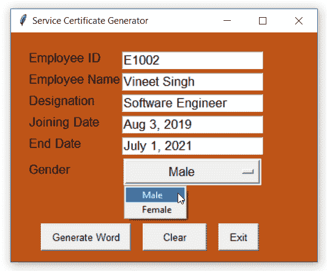
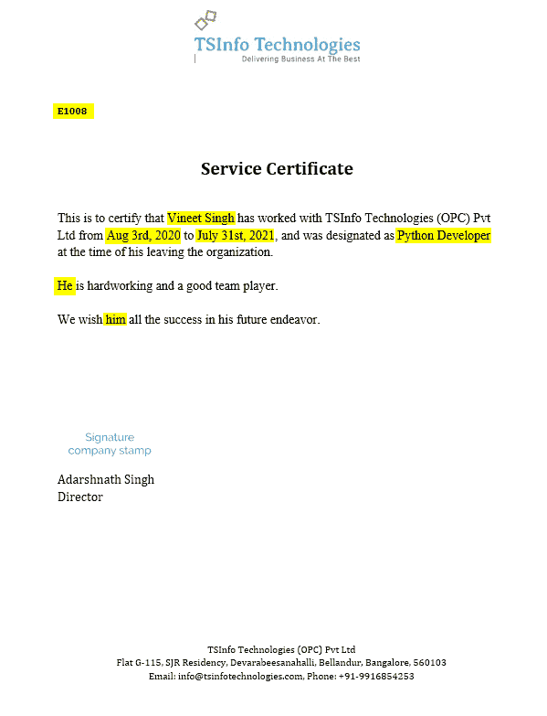
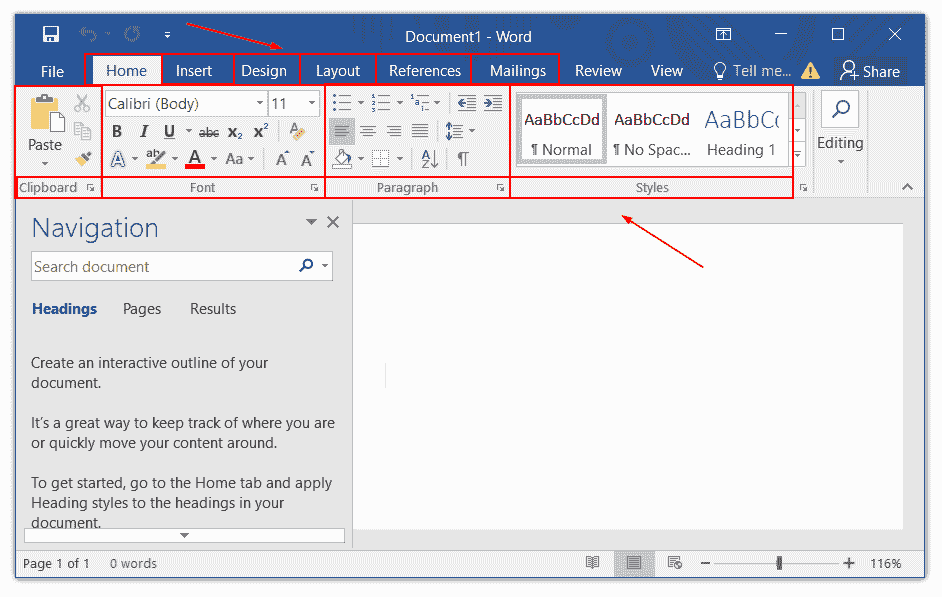
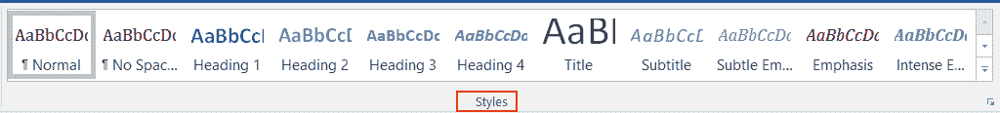
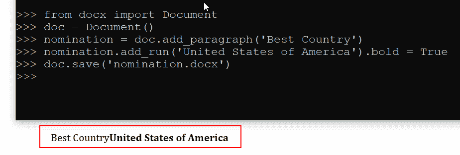
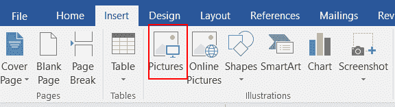
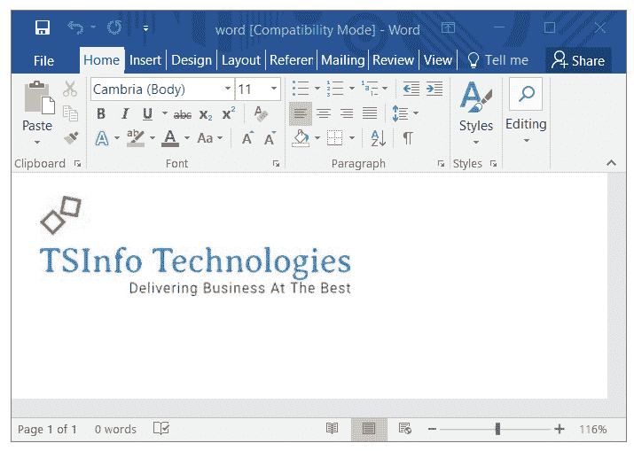

# 用 Python Tkinter 创建 Word 文档[完整源代码+视频]

> 原文：<https://pythonguides.com/create-word-document-in-python-tkinter/>

[](https://sharepointsky.teachable.com/p/python-and-machine-learning-training-course)

在这个 Python Tkinter 教程中，我们将学习如何**在 python tkinter** 中创建一个 word 文档。我们将使用 Python Tkinter 创建一个应用程序，它将生成一个带有动态值的 word 文档。

*   在 Python Tkinter 中创建 word 文档–概述
*   Python 中的 Tkinter 模块
*   Python 中的 Python-docx 模块
*   python tkinter 应用程序概述
*   python tkinter 应用程序的源代码
*   python tkinter 应用程序的输出

目录

[](#)

*   [用 Python Tkinter 创建 word 文档](#Create_word_document_in_Python_Tkinter "Create word document in Python Tkinter")
*   [Python 中的 Tkinter 模块](#Tkinter_Module_in_Python "Tkinter Module in Python")
*   [Python 中的 Python-docx 模块](#Python-docx_module_in_Python "Python-docx module in Python")
    *   [docx.styles()](#docxstyles "docx.styles()")
    *   [docx.add_heading()](#docxadd_heading "docx.add_heading()")
    *   [docx.add_paragraph()](#docxadd_paragraph "docx.add_paragraph()")
    *   [docx.add_picture()](#docxadd_picture "docx.add_picture()")
*   [tkinter 应用程序的源代码](#Source_code_of_tkinter_application "Source code of tkinter application")
    *   [Python Tkinter 代码(GUI 开发)](#Python_Tkinter_Code_GUI_Development "Python Tkinter Code (GUI Development)")
    *   [使用 Python(命令行)创建 Word 文件的源代码](#Source_code_for_Creating_Word_File_using_Python_command-line "Source code for Creating Word File using Python (command-line)")
    *   [使用 python tkinter 创建 word 文档的完整源代码](#Complete_Source_code_of_creating_word_document_using_python_tkinter "Complete Source code of creating word document using python tkinter")
*   [Python Tkinter 应用程序的输出](#Output_of_Python_Tkinter_Application "Output of Python Tkinter Application")

## 用 Python Tkinter 创建 word 文档

最近，我们得到一个要求，要使用 [Python Tkinter](https://pythonguides.com/python-gui-programming/) 为即将离开组织的员工生成一个经验证明。

因此，我们使用 Python Tkinter 创建了一个完整的应用程序，它将接受如下输入:

| 用户输入 | Tkinter Widget |
| --- | --- |
| 员工 ID | [入口小工具](https://pythonguides.com/python-tkinter-entry/) |
| 员工姓名 | [参赛作品 Widg](https://pythonguides.com/python-tkinter-entry/) [e](https://pythonguides.com/python-tkinter-entry/) [t](https://pythonguides.com/python-tkinter-entry/) |
| 指定 | [入口小工具](https://pythonguides.com/python-tkinter-entry/) |
| 加入日期 | [入口小工具](https://pythonguides.com/python-tkinter-entry/) |
| 结束日期 | [入口小工具](https://pythonguides.com/python-tkinter-entry/) |
| 性别 | [OptionMenu Widget](https://pythonguides.com/python-tkinter-optionmenu/) |

然后，当用户填写表单并单击 Generate Word 按钮时，它将使用用户提供的动态值创建一个体验证书(Word 文档)。

word 文档还会有公司 logo、签名等。

该表单如下所示:



Application to convert word document in Python Tkinter

输出如下所示:



Create Word Document in Python Tkinter

另请参阅，[如何使用 Pyinstaller 将 Python 文件转换为 exe 文件](https://pythonguides.com/convert-python-file-to-exe-using-pyinstaller/)

## Python 中的 Tkinter 模块

使用 python 中的 Tkinter 模块，我们可以创建任何应用程序的图形用户界面(GUI)。它是一个流行且易于使用的 python 模块，可以帮助您将基于命令行的应用程序转换为基于 GUI 的交互式程序。

我们的网站上有一个专门的教程，通过例子学习[Python Tkinter](https://pythonguides.com/category/python-tutorials/python-tkinter/)。

在本节中，我们将讨论我们在创建 Tkinter 应用程序以生成经验证书 word 文件时使用的所有 python Tkinter 小部件。

| 用户输入 | Tkinter Widget |
| --- | --- |
| 员工 ID | [入口小工具](https://pythonguides.com/python-tkinter-entry/) |
| 员工姓名 | [参赛作品 Widg](https://pythonguides.com/python-tkinter-entry/) [e](https://pythonguides.com/python-tkinter-entry/) [t](https://pythonguides.com/python-tkinter-entry/) |
| 指定 | [入口小工具](https://pythonguides.com/python-tkinter-entry/) |
| 加入日期 | [入口小工具](https://pythonguides.com/python-tkinter-entry/) |
| 结束日期 | [入口小工具](https://pythonguides.com/python-tkinter-entry/) |
| 性别 | [OptionMenu Widget](https://pythonguides.com/python-tkinter-optionmenu/) |

*   性别是 tkinter OptionMenu 小部件，用户可以使用下拉菜单选择性别。这个信息用于声明主语代词。
*   使用性别信息，我们在消息的正文中指定了他、她、他、他的、她。
*   Python Tkinter Entry 小部件用于从用户处获取基于字符串的输入。
*   除了 gender 之外的所有其他 tkinter 小部件都是 python tkinter entry 小部件。我们有一个关于 [Python Tkinter Entry widget](https://pythonguides.com/python-tkinter-entry/) 和[Python Tkinter option menu widget](https://pythonguides.com/python-tkinter-optionmenu/)的专门博客。

## Python 中的 Python-docx 模块

[Python-docx](https://python-docx.readthedocs.io/en/latest/#user-guide) 模块允许我们使用 python Tkinter 创建 word 文档。这是一个强大的 python 模块，允许创建新的 word 文档或更新现有文档。

Python-docx 可以通过以下命令使用 pip 和 conda 包管理器进行安装。

```py
**# using pip** 
pip install python-docx

**# using anaconda**
conda install -c conda-forge python-docx
```

Word 文档有很多功能可以帮助用户编写和格式化数据。使用 python-docx 模块，我们可以处理所有这些特性。下面是带有标记功能的 word 文档的图片。



Word document

*   每个特性在 python-docx 中都有专门的方法。python-docx 广泛使用的几个方法有 add_paragraph()、add_picture()、add_heading()、add_page_break()、add_table()等。
*   使用 python 创建 word 文档的第一步是创建 word 对象。以上所有方法都是文档对象的一部分。

```py
from docx import Document

doc = Document()
```

接下来，我们将讨论 python-docx 模块的常用方法，使用这些方法，您可以用 python 创建一个示例 word 文档。

### docx.styles()

如果您想节省手动格式化 word 文档每一行的时间，那么您可以在 python-docx 模块中使用此功能应用一组预格式化的样式。

下图显示了 word 文档中的样式选项:



Styles in word document

*   除此之外，您可以通过添加项目符号、将字体粗细更改为粗体、斜体、下划线等来修改样式。

**举例:**

这个例子演示了如何在 python docx 模块中创建样式，也展示了如何在 python docx 模块中的段落上使用样式。

```py
**# style created**
new_style = doc.styles['Heading 1']

**# style applied**
doc.add_paragraph(style=new_style)
```

### docx.add_heading()

标题指定主题或内容的简短描述。一个好的标题总是简短明了的。在本节中，我们将学习如何使用 python 添加标题。

*   每个子标题都比父标题小，这样它们就形成了 1-9 级的层次结构，其中 1 是最高级别，9 是最低级别。
*   默认情况下，python-docx picks 1 将默认文本作为标题，将级别更改为 0 会将类别从“标题”更改为“标题”。

```py
doc.add_heading('United States of America', level=1)
```

*   更改高程值以修改 python docx 中的标题大小。

### docx.add_paragraph()

段落是广泛使用的方法，因为每次您想要使用 python 模块 python-docx 在 word 文档中添加文本时，都需要这种方法。

*   每个段落使用 python 模块 python-docx 在 word 文档中添加一个单独的游程。
*   如果你想在一行中添加多个游程，那么在 add_paragraph()上使用 `add_run()` 方法。
*   方法 `add_run()` 在你想同时应用两个东西的时候非常有用。例如，您想添加一个段落，用粗体字显示您的国家名称。

**举例:**

这个例子演示了在 python 的 python-docx 模块中使用 add_paragraph()方法和 add_run()方法。

在这段代码中，我们添加了一个段落:“最佳国家”，并使用 run 对象添加了国家名称:美利坚合众国，然后对国家名称应用了粗体格式。这样，我们应用了 3 个活动，而不是一个，这是使用 add_run()方法的好处。

```py
**# one-liner**
doc.add_paragraph('Best Country').add_run('United States of America').bold = True

**# same thing in 2 lines to make it look good**
nomination = doc.add_paragraph('Best Country')
nomination.add_run('United States of America').bold =True 
```



Add paragraph in word document using Python docx

### docx.add_picture()

使用 python-docx 中的 add_picture()方法，可以在 word 文档中添加图像。下图显示了可用于在 word 文档中上传图像的栏。



Add Picture in Word Document using Python

*   `Python docx add_picture()` 方法提供了在 word 文件中添加图片的选项。您可以通过定义图像的高度和宽度来控制图像的大小。
*   高度和宽度值可以是英寸或厘米。为了使用它们，你必须从 `docx.shared` 导入英寸或厘米。

**语法:**

高度和宽度是可选的，但它可以是英寸或厘米(厘米)。我们建议将图像保存在主项目所在的同一个文件夹中，但是如果不可能的话，请提供完整的路径来代替<image_path>。</image_path>

```py
from docx.shared import Inches

doc = Document()

doc.add_picture(<image_path>, width=Inches(val), height=Inches(val))
```

**举例:**

下面的例子演示了在 python docx 模块中使用 `docx.add_image()` 。在本例中，我们向 word 文档添加了一个图像文件。

```py
**# import modules**
from docx import Document
from docx.shared import Inches

**# create an instance** 
doc = Document()

**# add image**
doc.add_picture('logo.png', height=Inches(0.81), width=Inches(2.52))

**# save file**
doc.save('word.docx')
```



Add image in word using python docx

至此，我们总结了 python docx 模块的几个重要且广泛使用的方法。python-docx 的[官网上还有很多功能可以探索。](https://python-docx.readthedocs.io/en/latest/#user-guide)

如果您需要任何方法或函数的解释，请写信给我们，我们将分享相同的最佳教程。

阅读[如何用 Python 制作计算器](https://pythonguides.com/make-a-calculator-in-python/)

## tkinter 应用程序的源代码

在本节中，我们提供了创建应用程序的源代码，该应用程序用于为即将离开组织的员工生成经验证书。

*   在这个 python 应用程序中，使用 Python 库 Tkinter 创建了图形用户界面(GUI)。
*   通过交互界面，用户可以填写员工信息，如员工 id、姓名、加入日期等。
*   python 程序将使用这些信息生成 word 格式的经验证书。

```py
PermissionError: [Errno 13] Permission denied: 'word.docx'
```

**请注意:**再次点击*生成 word* 按钮前必须关闭 Word 文件。如果你看到上面的权限错误，这意味着文件已经打开。请关闭该文件，然后重试修复此错误。

我们已经为以下项目提供了源代码:

### Python Tkinter 代码(GUI 开发)

下面是用 python 为体验信生成应用程序创建图形用户界面(GUI)的源代码。

```py
**# modules**
from tkinter import *

**# clear function**
def clear_inputs():
    eid.delete(0, 'end')
    ename.delete(0, 'end')
    desig.delete(0, 'end')
    jd.delete(0, 'end')
    ed.delete(0, 'end')

ws = Tk()
ws.title('Service Certificate Generator')
ws.geometry('400x300')
ws.config(bg='#456')

f = ('sans-serif', 13)
btn_font = ('sans-serif', 10)
bgcolor = '#BF5517'

genvar = StringVar()
genopt = ['Male', 'Female']
genvar.set('Male')

**# frames**
frame = Frame(ws, padx=20, pady=20, bg=bgcolor)
frame.pack(expand=True, fill=BOTH)

**# label widgets**
Label(
    frame, 
    text="Employee ID",
    font=f,
    bg=bgcolor
).grid(row=0, column=0, sticky='w')

Label(
    frame,
    text="Employee Name",
    font=f,
    bg=bgcolor
).grid(row=1, column=0, sticky='w')

Label(
    frame,
    text="Designation",
    font=f,
    bg=bgcolor
).grid(row=2, column=0, sticky='w')

Label(
    frame,
    text="Joining Date",
    font=f,
    bg=bgcolor
).grid(row=3, column=0, sticky='w')

Label(
    frame,
    text="End Date",
    font=f,
    bg=bgcolor
).grid(row=4, column=0, sticky='w')

Label(
    frame,
    text='Gender',
    font=f,
    bg=bgcolor
).grid(row=5, column=0, sticky='w')

**# entry widgets**
eid = Entry(frame, width=20, font=f)
eid.grid(row=0, column=1)

ename = Entry(frame, width=20, font=f)
ename.grid(row=1, column=1)

desig = Entry(frame, width=20, font=f)
desig.grid(row=2, column=1)

jd = Entry(frame, width=20, font=f)
jd.grid(row=3, column=1)

ed = Entry(frame, width=20, font=f)
ed.grid(row=4, column=1)

gender = OptionMenu(
    frame, 
    genvar,
    *genopt
)
gender.grid(row=5, column=1, pady=(5,0))
gender.config(width=15, font=f)
btn_frame = Frame(frame, bg=bgcolor)
btn_frame.grid(columnspan=2, pady=(50, 0))

**# default inputs for testing**
eid.insert(0,'E1008')
ename.insert(0, 'Vineet Singh')
desig.insert(0, 'Python Developer')
jd.insert(0, 'Aug 3rd, 2020')
ed.insert(0, 'July 31st, 2021')

**# action buttons**
submit_btn = Button(
    btn_frame,
    text='Generate Word',
    command=None, #generate,
    font=btn_font,
    padx=10, 
    pady=5
)
submit_btn.pack(side=LEFT, expand=True, padx=(15, 0))

clear_btn = Button(
    btn_frame,
    text='Clear',
    command=clear_inputs,
    font=btn_font,
    padx=10, 
    pady=5,
    width=7
)
clear_btn.pack(side=LEFT, expand=True, padx=15)

exit_btn = Button(
    btn_frame,
    text='Exit',
    command=lambda:ws.destroy(),
    font=btn_font,
    padx=10, 
    pady=5
)
exit_btn.pack(side=LEFT, expand=True)

**# mainloop**
ws.mainloop() 
```

### 使用 Python(命令行)创建 Word 文件的源代码

这里是使用 python 创建 word 文件的全功能 python 源代码。这段代码使用 python-docx 模块，它没有 GUI，这意味着您必须将信息放在代码本身中。

```py
**# modules**
from docx import Document
from docx.opc.coreprops import CoreProperties
from docx.enum.style import WD_STYLE_TYPE
from docx.enum.text import WD_ALIGN_PARAGRAPH
from docx.shared import Inches, Pt

**# user inputs** 
logo = 'files/tsinfo_logo.jpg'
output = 'Experience_letter1.docx'
sign = 'files/signature.png'
ceo_sig_text = '''Adarshnath Singh \nDirector'''
heading = 'Service Certificate'
emp_id = 'E1001' #eid.get() 
emp_name = 'Vineet Singh' # ename.get() 
designation = 'Software Engineer' #desig.get()
joining_date = 'August 20, 2019' #jd.get()
end_date = 'July 31, 2021' #ed.get()

comp_detail = '''TSInfo Technologies (OPC) Pvt Ltd
Flat G-115, SJR Residency, Devarabeesanahalli, Bellandur, Bangalore, 560103
Email: info@tsinfotechnologies.com, Phone: +91-9916854253
'''

gen = 'He' # who.get()

**# subject pronoun** 
gen2 = 'his' # her
gen3 = 'him' # her

if gen.lower() == 'he':
    gen2 = 'his'
    gen3 = 'him' 
elif gen.lower() == 'she':
    gen2 = 'her' 
    gen3 = 'her'
else:
    print('Error: accept He/She only')

**# certificate template**
body_text = f'''This is to certify that {emp_name} has worked with TSInfo Technologies (OPC) Pvt Ltd from {joining_date} to {end_date}, and was designated as {designation} at the time of {gen2} leaving the organization.

{gen.capitalize()} is hardworking and a good team player.

We wish {gen3} all the success in his future endeavor.

    '''

**# create instance**
doc =  Document()

**# declare margin**
sections = doc.sections
for section in sections:
    section.top_margin = Inches(0.04)
    section.bottom_margin = Inches(0.19)
    section.left_margin = Inches(0.93)
    section.right_margin = Inches(0.89)

section = doc.sections[0]

**# logo image placement**
logo = doc.add_picture(logo, width=Inches(2.52), height=Inches(0.81))
logo_placement = doc.paragraphs[-1] 
logo_placement.alignment = WD_ALIGN_PARAGRAPH.CENTER

**# line space**
for _ in range(1):
    linespace_style = doc.styles['Body Text']
    linespace = doc.add_paragraph(style=linespace_style).add_run(' ')
    linespace_style.font.size = Pt(10)

**# employee Id**
empid_style = doc.styles['Normal']
empid = doc.add_paragraph(style=empid_style).add_run(f'{emp_id}')
empid.font.bold = True

**# line space**
for _ in range(1):
    linespace_style = doc.styles['Body Text']
    linespace = doc.add_paragraph(style=linespace_style).add_run()
    linespace.font.size = 10

**# Header** 
heading_style = doc.styles['Body Text']
head=doc.add_paragraph(style=heading_style).add_run(f'{heading}')
doc.paragraphs[-1].alignment = WD_ALIGN_PARAGRAPH.CENTER
head.font.size = Pt(20)
head.font.bold = True 

**# body text** 
body_style = doc.styles['Body Text']
body = doc.add_paragraph(style=body_style).add_run(f'{body_text}')
body.font.size = Pt(14)
body.font.name = 'Times New Roman'

**#line space**
for _ in range(2):
    linespace_style = doc.styles['Body Text']
    linespace = doc.add_paragraph(style=linespace_style).add_run()
    linespace.font.size = 10

**# signature image & text**
ceo_sign = doc.styles['Body Text']
doc.add_picture(sign, width=Inches(1.57), height=Inches(0.43))
doc.add_paragraph(style=ceo_sign).add_run(f'{ceo_sig_text}')
ceo_sign.font.size = Pt(14)

**# line space**
for _ in range(4):
    linespace_style = doc.styles['Body Text']
    linespace = doc.add_paragraph(style=linespace_style)

**# footer text : company description**
company_text = doc.styles['Normal']
company_text.paragraph_format.space_before = Pt(12)
doc.add_paragraph(style=company_text).add_run(f'{comp_detail}')
center_align = doc.paragraphs[-1] 
center_align.alignment = WD_ALIGN_PARAGRAPH.CENTER

**# saving file to word document**
doc.save(output) 
```

阅读 [Python Tkinter ToDo 列表](https://pythonguides.com/python-tkinter-todo-list/)

### **使用 python 生成 word 文档的完整源代码 tkinter**

下面是一个完整应用程序的源代码，它将生成一封员工的体验信。它通过使用 python 中的 tkinter 模块创建的图形用户界面接受信息。

然后，它用提供的信息创建一个 word 文档。它使用 python-docx 模块与 word 文档进行交互。

使用以下步骤在您的设备上设置项目:

*   创建一个文件夹来保存此项目。
*   创建并激活虚拟环境。
*   在虚拟环境中安装 python-docx 模块。
*   创建 main.py 并将下面的代码粘贴到该文件中。
*   创建名为**文件**和**输出**的文件夹。在文件夹中添加图片。
*   运行程序，经验信将在输出文件夹内生成。

```py
**# modules**
from docx import Document
from docx.opc.coreprops import CoreProperties
from docx.enum.style import WD_STYLE_TYPE
from docx.enum.text import WD_ALIGN_PARAGRAPH
from docx.shared import Inches, Pt
from tkinter import *
from tkinter import messagebox

ws = Tk()
ws.title('Service Certificate Generator')
ws.geometry('400x300')
ws.config(bg='#456')

f = ('sans-serif', 13)
btn_font = ('sans-serif', 10)
bgcolor = '#BF5517'

genvar = StringVar()
genopt = ['Male', 'Female']
genvar.set('Male')

def clear_inputs():
    eid.delete(0, 'end')
    ename.delete(0, 'end')
    desig.delete(0, 'end')
    jd.delete(0, 'end')
    ed.delete(0, 'end')

def generate():

 **# data variables**
    logo = 'files/tsinfo_logo.jpg'
    output = 'output/Experience_letter.docx'
    sign = 'files/signature.png'
    ceo_sig_text = '''Adarshnath Singh \nDirector'''
    heading = 'Service Certificate'
    emp_id = eid.get() 
    emp_name = ename.get() 
    designation = desig.get()
    joining_date = jd.get()
    end_date = ed.get()

    comp_detail = '''
    TSInfo Technologies (OPC) Pvt Ltd
    Flat G-115, SJR Residency, Devarabeesanahalli, Bellandur, Bangalore, 560103
    Email: info@tsinfotechnologies.com, Phone: +91-9916854253
    '''
 **# gender specification** 

    gen1 = 'He' # she
    gen2 = 'his' # her
    gen3 = 'him' # her

    if genvar.get() == 'Male':
        gen1 = 'He'
        gen2 = 'his'
        gen3 = 'him' 
    elif genvar.get() == 'Female':
        gen1 = 'She'
        gen2 = 'her' 
        gen3 = 'her'
    else:
        messagebox.showerror('Error', 'Incorrect gender Selection!')

 **# experience certificate template**
    body_text = f'''
This is to certify that {emp_name} has worked with TSInfo Technologies (OPC) Pvt Ltd from {joining_date} to {end_date}, and was designated as {designation} at the time of {gen2} leaving the organization.

{gen1} is hardworking and a good team player.

We wish {gen3} all the success in {gen2} future endeavor.

    '''

   ** # create object(s)**
    doc =  Document()
    sections = doc.sections

  ** # declare margin**
    for section in sections:
        section.top_margin = Inches(0.04)
        section.bottom_margin = Inches(0.19)
        section.left_margin = Inches(0.93)
        section.right_margin = Inches(0.89)

    section = doc.sections[0]

 **# logo image placement**
    logo = doc.add_picture(logo, width=Inches(2.52), height=Inches(0.81))
    logo_placement = doc.paragraphs[-1] 
    logo_placement.alignment = WD_ALIGN_PARAGRAPH.CENTER

    **# line space**
    for _ in range(1):
        linespace_style = doc.styles['Body Text']
        linespace = doc.add_paragraph(style=linespace_style).add_run(' ')
        linespace_style.font.size = Pt(10)

 **# employee Id**
    empid_style = doc.styles['Normal']
    empid = doc.add_paragraph(style=empid_style).add_run(f'{emp_id}')
    empid.font.bold = True

 **   # line space**
    for _ in range(1):
        linespace_style = doc.styles['Body Text']
        linespace = doc.add_paragraph(style=linespace_style).add_run()
        linespace.font.size = 10

 **# Header** 
    heading_style = doc.styles['Body Text']
    head = doc.add_paragraph(style=heading_style).add_run(f'{heading}')
    doc.paragraphs[-1].alignment = WD_ALIGN_PARAGRAPH.CENTER
    head.font.size = Pt(20)
    head.font.bold = True 

 **# body text** 
    body_style = doc.styles['Body Text']
    body = doc.add_paragraph(style=body_style).add_run(f'{body_text}')
    body.font.size = Pt(14)
    body.font.name = 'Times New Roman'

   ** #line space**
    for _ in range(2):
        linespace_style = doc.styles['Body Text']
        linespace = doc.add_paragraph(style=linespace_style).add_run()
        linespace.font.size = 10

 **# signature image & text**
    ceo_sign = doc.styles['Body Text']
    doc.add_picture(sign, width=Inches(1.57), height=Inches(0.43))
    doc.add_paragraph(style=ceo_sign).add_run(f'{ceo_sig_text}')
    ceo_sign.font.size = Pt(14)

 **# line space**
    for _ in range(4):
        linespace_style = doc.styles['Body Text']
        linespace = doc.add_paragraph(style=linespace_style)
        # linespace.font.size = Pt(10)

   ** # footer text : company description**
    company_text = doc.styles['Normal']
    company_text.paragraph_format.space_before = Pt(12)
    doc.add_paragraph(style=company_text).add_run(f'{comp_detail}')
    center_align = doc.paragraphs[-1] 
    center_align.alignment = WD_ALIGN_PARAGRAPH.CENTER

    doc.save(output)

**# frames**
frame = Frame(ws, padx=20, pady=20, bg=bgcolor)
frame.pack(expand=True, fill=BOTH)

 **# label widgets**
Label(
    frame, 
    text="Employee ID",
    font=f,
    bg=bgcolor
).grid(row=0, column=0, sticky='w')

Label(
    frame,
    text="Employee Name",
    font=f,
    bg=bgcolor
).grid(row=1, column=0, sticky='w')

Label(
    frame,
    text="Designation",
    font=f,
    bg=bgcolor
).grid(row=2, column=0, sticky='w')

Label(
    frame,
    text="Joining Date",
    font=f,
    bg=bgcolor
).grid(row=3, column=0, sticky='w')

Label(
    frame,
    text="End Date",
    font=f,
    bg=bgcolor
).grid(row=4, column=0, sticky='w')

Label(
    frame,
    text='Gender',
    font=f,
    bg=bgcolor
).grid(row=5, column=0, sticky='w')

**# entry widgets**
eid = Entry(frame, width=20, font=f)
eid.grid(row=0, column=1)

ename = Entry(frame, width=20, font=f)
ename.grid(row=1, column=1)

desig = Entry(frame, width=20, font=f)
desig.grid(row=2, column=1)

jd = Entry(frame, width=20, font=f)
jd.grid(row=3, column=1)

ed = Entry(frame, width=20, font=f)
ed.grid(row=4, column=1)

gender = OptionMenu(
    frame, 
    genvar,
    *genopt
)
gender.grid(row=5, column=1, pady=(5,0))
gender.config(width=15, font=f)

btn_frame = Frame(frame, bg=bgcolor)
btn_frame.grid(columnspan=2, pady=(50, 0))

**# default inputs for testing**
eid.insert(0,'E1008')
ename.insert(0, 'Vineet Singh')
desig.insert(0, 'Python Developer')
jd.insert(0, 'Aug 3rd, 2020')
ed.insert(0, 'July 31st, 2021')

submit_btn = Button(
    btn_frame,
    text='Generate Word',
    command=generate,
    font=btn_font,
    padx=10, 
    pady=5
)
submit_btn.pack(side=LEFT, expand=True, padx=(15, 0))

clear_btn = Button(
    btn_frame,
    text='Clear',
    command=clear_inputs,
    font=btn_font,
    padx=10, 
    pady=5,
    width=7
)
clear_btn.pack(side=LEFT, expand=True, padx=15)

exit_btn = Button(
    btn_frame,
    text='Exit',
    command=lambda:ws.destroy(),
    font=btn_font,
    padx=10, 
    pady=5
)
exit_btn.pack(side=LEFT, expand=True)

**# mainloop**
ws.mainloop() 
```

阅读 [Python Tkinter Canvas](https://pythonguides.com/python-tkinter-canvas/)

## Python Tkinter 应用程序的输出

在这个输出中，有一个接受关于雇员的各种信息的表单。填写信息后，单击“生成单词”按钮，将会生成一个单词文件。

该 word 文件将有一个经验证书模板，其中的员工信息(Id、姓名、加入日期等)将动态分配到相应的位置。

*   清除按钮将清除入口，退出按钮将终止程序。
*   这个应用程序表单是使用 python tkinter 创建的，它使用 python-docx 模块与 word 文件进行交互。


Python Tkinter Service Certificate Generator

*   下图是生成的服务证书。这是一个 word 文件，动态值以黄色突出显示。所有这些黄色值都是由用户在上图中提供的。
*   突出显示的黄色仅用于演示目的，在执行程序时不会出现。


Python Tkinter Generated Service Certificate

这就是如何**通过使用 Python Tkinter 在 Python** 中创建一个 word 文档。

相关 Python Tkinter 教程:

*   [Python Tkinter Stopwatch](https://pythonguides.com/python-tkinter-stopwatch/)
*   [使用 Python Tkinter 的身体质量指数计算器](https://pythonguides.com/bmi-calculator-using-python-tkinter/)
*   [使用 Python Tkinter 的费用跟踪应用程序](https://pythonguides.com/expense-tracking-application-using-python-tkinter/)
*   [如何使用 Python Tkinter 创建倒计时定时器](https://pythonguides.com/create-countdown-timer-using-python-tkinter/)
*   [用 Python Tkinter 上传文件](https://pythonguides.com/upload-a-file-in-python-tkinter/)
*   [Python Tkinter 拖拽](https://pythonguides.com/python-tkinter-drag-and-drop/)

[Bijay Kumar](https://pythonguides.com/author/fewlines4biju/)

Python 是美国最流行的语言之一。我从事 Python 工作已经有很长时间了，我在与 Tkinter、Pandas、NumPy、Turtle、Django、Matplotlib、Tensorflow、Scipy、Scikit-Learn 等各种库合作方面拥有专业知识。我有与美国、加拿大、英国、澳大利亚、新西兰等国家的各种客户合作的经验。查看我的个人资料。

[enjoysharepoint.com/](https://enjoysharepoint.com/)[](https://www.facebook.com/fewlines4biju "Facebook")[](https://www.linkedin.com/in/fewlines4biju/ "Linkedin")[](https://twitter.com/fewlines4biju "Twitter")