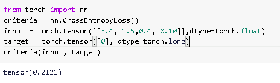
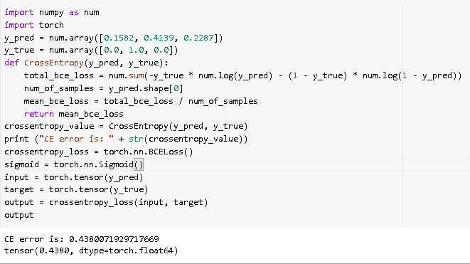
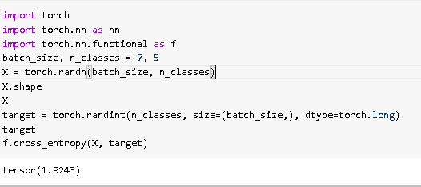
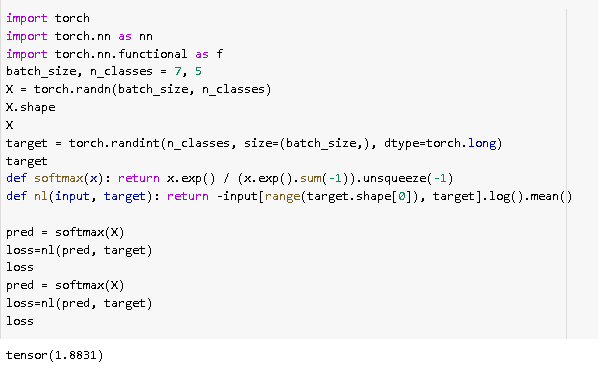
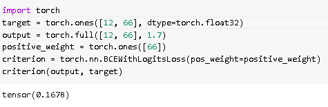
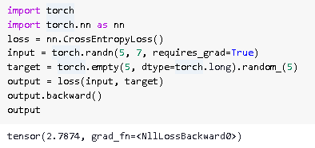
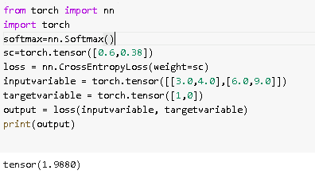
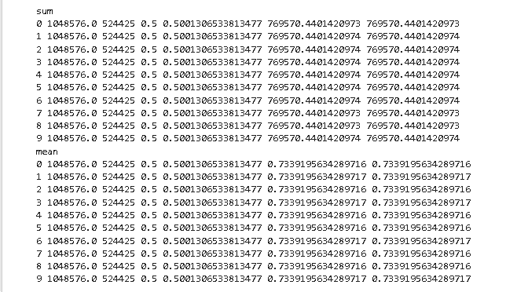

# 交叉熵损失 PyTorch

> 原文：<https://pythonguides.com/cross-entropy-loss-pytorch/>

[](https://sharepointsky.teachable.com/p/python-and-machine-learning-training-course)

在本 [Python 教程](https://pythonguides.com/learn-python/)中，我们将学习 Python 中的**交叉熵损失 PyTorch** ，我们还将涵盖与交叉熵损失 PyTorch 相关的不同示例。此外，我们将涵盖这些主题。

*   交叉熵损失 PyTorch
*   交叉熵损失 PyTorch 示例
*   交叉熵损失 PyTorch 实现
*   交叉熵损失 PyTorch softmax
*   交叉熵损失 PyTorch 泛函
*   交叉熵损失 PyTorch 逻辑
*   交叉熵损失 PyTorch 向后
*   交叉熵损失 PyTorch 权重
*   交叉熵损失 PyTorch 减少

目录

[](#)

*   [交叉熵损失 PyTorch](#Cross_entropy_loss_PyTorch "Cross entropy loss PyTorch")
*   [交叉熵损失 PyTorch 示例](#Cross_entropy_loss_PyTorch_example "Cross entropy loss PyTorch example")
*   [交叉熵损失 PyTorch 实现](#Cross_entropy_loss_PyTorch_implementation "Cross entropy loss PyTorch implementation")
*   [交叉熵损失 PyTorch softmax](#Cross_entropy_loss_PyTorch_softmax "Cross entropy loss PyTorch softmax")
*   [交叉熵损失 PyTorch 泛函](#Cross_entropy_loss_PyTorch_functional "Cross entropy loss PyTorch functional")
*   [交叉熵损失 py torch logists](#Cross_entropy_loss_PyTorch_logits "Cross entropy loss PyTorch logits")
*   [交叉熵损失 PyTorch 后退](#Cross_entropy_loss_PyTorch_backward "Cross entropy loss PyTorch backward")
*   [交叉熵损失 PyTorch 权重](#Cross_entropy_loss_PyTorch_weight "Cross entropy loss PyTorch weight")
*   [交叉熵损失 PyTorch 减少](#Cross_entropy_loss_PyTorch_reduction "Cross entropy loss PyTorch reduction")

## 交叉熵损失 PyTorch

在本节中，我们将学习 python 中的**交叉熵损失 [PyTorch](https://pythonguides.com/what-is-pytorch/)** 。

*   交叉熵损失主要用于机器学习中的分类问题。
*   标准是计算输入变量和目标变量之间的交叉熵。

**代码:**

在下面的代码中，我们将导入一些库来计算变量之间的交叉熵。

*   **输入= torch.tensor([[3.4，1.5，0.4，0.10]]，dtype=torch.float)** 作为输入变量。
*   **target = torch.tensor([0]，dtype=torch.long)** 作为目标变量。

```py
from torch import nn
criteria = nn.CrossEntropyLoss()
input = torch.tensor([[3.4, 1.5,0.4, 0.10]],dtype=torch.float)
target = torch.tensor([0], dtype=torch.long)
criteria(input, target)
```

**输出:**

运行上面的代码后，我们得到下面的输出，其中我们可以看到交叉熵损失值被打印在屏幕上。



Cross entropy loss PyTorch

另外，检查:[使用 Python 的机器学习](https://pythonguides.com/machine-learning-using-python/)

## 交叉熵损失 PyTorch 示例

在本节中，我们将借助一个例子来了解**交叉熵损失 PyTorch** 。

交叉熵被定义为用于计算给定变量集的概率分布之间的差异的过程。

**代码:**

在下面的代码中，我们将导入一些库，从中我们可以计算两个变量之间的交叉熵。

*   **total _ BCE _ loss = num . sum(-y _ true * num . log(y _ pred)–(1–y _ true)* num . log(1–y _ pred))**是计算交叉熵损失。
*   `mean _ BCE _ loss = total _ BCE _ loss/num _ of _ samples`用于计算交叉熵损失的平均值。
*   **print(" CE error is:"+str(cross entropy _ value))**用于打印交叉熵值。
*   `sigmoid = torch . nn . sigmoid()`用于保证输入在 0 和 1 之间。
*   **output = cross entropy _ loss(input，target)** 用于计算交叉熵损失的输出。

```py
import numpy as num
import torch
y_pred = num.array([0.1582, 0.4139, 0.2287])
y_true = num.array([0.0, 1.0, 0.0]) 
def CrossEntropy(y_pred, y_true):
    total_bce_loss = num.sum(-y_true * num.log(y_pred) - (1 - y_true) * num.log(1 - y_pred))

    num_of_samples = y_pred.shape[0]
    mean_bce_loss = total_bce_loss / num_of_samples
    return mean_bce_loss
crossentropy_value = CrossEntropy(y_pred, y_true)
print ("CE error is: " + str(crossentropy_value))
crossentropy_loss = torch.nn.BCELoss()
sigmoid = torch.nn.Sigmoid() 
input = torch.tensor(y_pred)
target = torch.tensor(y_true)
output = crossentropy_loss(input, target)
output
```

**输出:**

在下面的输出中，我们可以看到交叉熵损失示例值被打印在屏幕上。



Cross entropy loss PyTorch example

阅读:[蟒蛇皮里的熊猫](https://pythonguides.com/pandas-in-python/)

## 交叉熵损失 PyTorch 实现

在本节中，我们将学习 python 中的**交叉熵损失 PyTorch 实现**。

*   我们知道交叉熵损失 PyTorch 用于计算输入和输出变量之间的差异。
*   这里我们可以通过实现来计算输入和输出变量之间的差异。

**代码:**

在下面的代码中，我们将从计算交叉熵损失中导入一些库。

*   **X = torch.randn(batch_size，n_classes)** 用于获取随机值。
*   **target = torch . randint(n _ classes，size=(batch_size，)，dtype=torch.long)** 作为目标变量。
*   **f.cross_entropy(X，target)** 用于计算交叉熵。

```py
import torch
import torch.nn as nn
import torch.nn.functional as f
batch_size, n_classes = 7, 5
X = torch.randn(batch_size, n_classes)
X.shape
X
target = torch.randint(n_classes, size=(batch_size,), dtype=torch.long)
target
f.cross_entropy(X, target)
```

**输出:**

运行上面的代码后，我们得到下面的输出，其中我们可以看到实现后的交叉熵值打印在屏幕上。



Cross entropy loss PyTorch implementation.

阅读:[Python 中的 NumPy 是什么](https://pythonguides.com/numpy/)

## 交叉熵损失 PyTorch softmax

在本节中，我们将了解 python 中 Pytorch softmax 的**交叉熵损失。**

*   交叉熵损失 PyTorch softmax 定义为在 0 和 1 之间改变 K 个实数值的任务。
*   交叉熵的目的是测量与真实值的距离，也用于获取输出概率。

**代码:**

在下面的代码中，我们将导入一些库，从中我们可以测量交叉熵损失 softmax。

*   **X = torch.randn(batch_size，n_classes)** 用于获取值。
*   **def soft max(x):return x . exp()/(x . exp()。sum(-1))。unsqueeze(-1)** 用于定义 softmax 值。
*   **loss=nl(pred，target)** 用于计算损失。

```py
import torch
import torch.nn as nn
import torch.nn.functional as f
batch_size, n_classes = 7, 5
X = torch.randn(batch_size, n_classes)
X.shape
X
target = torch.randint(n_classes, size=(batch_size,), dtype=torch.long)
target
def softmax(x): return x.exp() / (x.exp().sum(-1)).unsqueeze(-1)
def nl(input, target): return -input[range(target.shape[0]), target].log().mean()

pred = softmax(X)
loss=nl(pred, target)
loss
pred = softmax(X)
loss=nl(pred, target)
loss
```

**输出:**

运行上面的代码后，我们得到下面的输出，其中我们可以看到交叉熵损失 softmax 的值打印在屏幕上。



Cross entropy loss PyTorch softmax

阅读: [Adam optimizer PyTorch 示例](https://pythonguides.com/adam-optimizer-pytorch/)

## 交叉熵损失 PyTorch 泛函

在本节中，我们将学习 Python 中的**交叉熵损失 PyTorch 泛函**。

交叉熵损失 PyTorch 有很多功能。我们可以逐一解释每一个功能。

*   交叉熵
*   二元交叉熵
*   二元交叉熵与对数
*   ctc_loss
*   余弦嵌入损失
*   nll _ 损失
*   高斯非线性损耗
*   l1 _ 损失
*   多重利润损失
*   软利润损失
*   三倍利润损失
*   三倍利润，带距离损失
*   mse_loss

1.  **Cross_entropy:** 用于计算输入和目标变量之间的差异。
2.  **二元交叉熵:**该函数用于计算目标概率和输入概率之间的二元交叉熵。
3.  **Binary _ cross _ entropy _ with _ logits:**该函数用于计算目标和输入逻辑之间的二元交叉熵。
4.  **ctc_loss:** 这被用作连接主义者的时间分类丢失。
5.  **cosine_embedded_loss:** 这用于计算给定输入张量的损失，也用于测量两个输入是否相似。
6.  **nll_loss:** 这个损失是负对数似然损失。
7.  **高斯 _ nll _ 损失:**这个损失是高斯负对数似然损失。
8.  **l1_loss:** 使用该函数，该函数取元素间元素值差的平均值。
9.  **multi_margin_loss:** 用于改善输入输出变量之间的多类多分类铰链损失。
10.  **soft_margin_loss:** 用于改善输入张量和目标张量之间的两类分类 logistic 损失。
11.  **triple_margin_loss:** 用于计算样本之间的相对相似度。
12.  **triple _ margin _ with _ distance _ loss:**这用于计算给定输入张量的三重损失，以及计算锚点和正例之间关系的实值函数。
13.  **mse_loss:** 这用于测量元素间的均方误差。

阅读: [PyTorch nn 线性+例题](https://pythonguides.com/pytorch-nn-linear/)

## 交叉熵损失 py torch logists

在本节中，我们将学习 Python 中的**交叉熵损失 PyTorch logits** 。

*   logit 函数用于确定标准的逻辑分布。它用于机器学习模型。
*   在交叉熵损失中，PyTorch logits 用于计算分数，这被称为 logit 函数。

**代码:**

在下面的代码中，我们将导入一些库，从中我们可以计算交叉熵损失 PyTorch logit。

*   **target = torch.ones([12，66]，dtype=torch.float32)** 用作目标变量。
*   **输出= torch.full([12，66]，1.7)** 作为预测值。
*   **positive _ weight = torch . ones([66])**用作权重等于 1 的正权重。
*   `criteria = torch . nn . bcewithlogitsloss(pos _ weight = positive _ weight)`用于计算交叉熵 logit 损失函数。

```py
import torch
target = torch.ones([12, 66], dtype=torch.float32)  
output = torch.full([12, 66], 1.7)  
positive_weight = torch.ones([66]) 
criterion = torch.nn.BCEWithLogitsLoss(pos_weight=positive_weight)
criterion(output, target) 
```

**输出:**

运行上面的代码后，我们得到下面的输出，其中我们可以看到交叉熵 logit 得分被打印在屏幕上。



Cross-Entropy loss PyTorch Logit

## 交叉熵损失 PyTorch 后退

在本节中，我们将学习 Python 中的**交叉熵损失 PyTorch backward** 。

*   交叉熵损失 Pytorch 向后用于计算当前张量的梯度。
*   交叉熵损失主要用于或有助于分类问题，并且还计算输入和目标之间的交叉熵损失。

**代码:**

在下面的代码中，我们将导入 torch 库，从中我们可以计算 PyTorch 向后函数。

*   **input = torch.randn(5，7，requires_grad=True)** 作为输入变量。
*   **target = torch.empty(5，dtype=torch.long)。random_(5)** 作为目标变量。
*   `output.backward()` 用于获取向后输出。

```py
import torch
import torch.nn as nn
loss = nn.CrossEntropyLoss()
input = torch.randn(5, 7, requires_grad=True)
target = torch.empty(5, dtype=torch.long).random_(5)
output = loss(input, target)
output.backward()
output
```

**输出:**

运行上面的代码后，我们得到下面的输出，其中我们可以看到交叉熵损失 PyTorch 向后得分打印在屏幕上。



Cross entropy loss PyTorch backward

## 交叉熵损失 PyTorch 权重

在本节中，我们将学习 python 中的**交叉熵损失 PyTorch 权重**。

*   正如我们所知，交叉熵被定义为计算输入变量和目标变量之间差异的过程。
*   在交叉熵损失中，如果我们给定权重，它将权重分配给每个类，并且权重应该在 1d 张量中。

**代码:**

在下面的代码中，我们将导入一些库，从中我们可以计算交叉熵损失 PyTorch 权重。

*   softmax=nn。Softmax() 用于改变 K 的实际值。
*   **损失= nn。CrossEntropyLoss(wei** ght=sc)用于计算交叉熵损失权重。
*   **input variable = torch . tensor([[3.0，4.0]，[6.0，9.0]])** 作为输入变量。
*   **target variable = torch . tensor([1，0])** 用作目标变量。
*   **打印(输出)**用于打印输出。

```py
from torch import nn
import torch
softmax=nn.Softmax()
sc=torch.tensor([0.6,0.38])
loss = nn.CrossEntropyLoss(weight=sc)
inputvariable = torch.tensor([[3.0,4.0],[6.0,9.0]])
targetvariable = torch.tensor([1,0])
output = loss(inputvariable, targetvariable)
print(output)
```

**输出:**

运行上面的代码后，我们得到下面的输出，其中我们可以看到交叉熵损失权重被打印在屏幕上。



## 交叉熵损失 PyTorch 减少

在本节中，我们将学习 python 中的**交叉熵损失 PyTorch 权重**。

*   交叉熵损失 PyTorch 被定义为以较少的数量创造某物的过程。
*   交叉熵也被定义为计算输入和输出变量之间的交叉熵的区域。

**代码:**

在下面的代码中，我们将导入一些库，从中我们可以计算交叉熵损失的减少。

*   **outputs = num . rand . rand(16，1，256，256)** 用于生成输出的随机变量。
*   **targets = num . random . randint(2，size=(16，256，256))** 用于生成目标的随机变量。
*   `seed = 0` 用于将随机种子设置为零。
*   `torch.manual_seed(seed)` 用于设置生成随机数的种子。
*   `loss _ fn = torch . nn . crossentropyloss(reduction = reduction)`用于计算交叉熵损失减少量。
*   **print(i，outputs.sum()、targets.sum()、outputs.mean()、targets.mean()、loss.sum()、loss.mean())** 用于在屏幕上打印输出。

```py
import numpy as num
import torch

outputs = num.random.rand(16, 1, 256, 256)
outputs = num.hstack((outputs, 1.0 - outputs))
targets = num.random.randint(2, size=(16, 256, 256))

seed = 0
torch.backends.cudnn.deterministic = True
torch.backends.cudnn.benchmark = False

for reduction in [ 'sum', 'mean']:
    print(reduction)

    for i in range(10):
        torch.manual_seed(seed)
        num.random.seed(seed)

        outputs_torch, targets_torch = torch.from_numpy(outputs), torch.from_numpy(targets)
        outputs_torch, targets_torch = outputs_torch.cuda(0), targets_torch.cuda(0)

        loss_fn = torch.nn.CrossEntropyLoss(reduction=reduction)
        loss_fn = loss_fn.cuda(0)

        loss = loss_fn(outputs_torch, targets_torch)
        loss = loss.detach().cpu().numpy()
        print(i, outputs.sum(), targets.sum(), outputs.mean(), targets.mean(), loss.sum(), loss.mean())
```

**输出:**

运行上面的代码后，我们得到下面的输出，其中我们可以看到交叉熵损失减少打印在屏幕上。



Cross entropy loss PyTorch reduction

因此，在本教程中，我们讨论了**交叉熵损失 PyTorch** ，并且我们还涵盖了与其实现相关的不同示例。这是我们已经讨论过的例子列表。

*   交叉熵损失 PyTorch
*   交叉熵损失 PyTorch 示例
*   交叉熵损失 PyTorch 实现
*   交叉熵损失 PyTorch softmax
*   交叉熵损失 PyTorch 泛函
*   交叉熵损失 PyTorch 逻辑
*   交叉熵损失 PyTorch 向后
*   交叉熵损失 PyTorch 权重
*   交叉熵损失 PyTorch 减少

[Bijay Kumar](https://pythonguides.com/author/fewlines4biju/)

Python 是美国最流行的语言之一。我从事 Python 工作已经有很长时间了，我在与 Tkinter、Pandas、NumPy、Turtle、Django、Matplotlib、Tensorflow、Scipy、Scikit-Learn 等各种库合作方面拥有专业知识。我有与美国、加拿大、英国、澳大利亚、新西兰等国家的各种客户合作的经验。查看我的个人资料。

[enjoysharepoint.com/](https://enjoysharepoint.com/)[](https://www.facebook.com/fewlines4biju "Facebook")[](https://www.linkedin.com/in/fewlines4biju/ "Linkedin")[](https://twitter.com/fewlines4biju "Twitter")