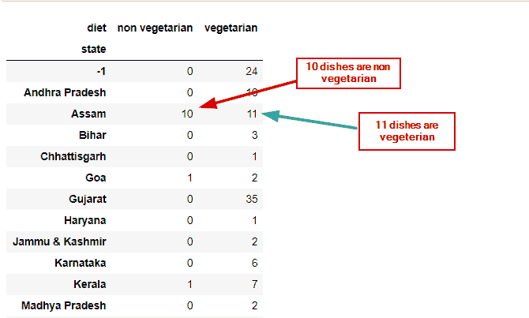

# Python Pandas 中的交叉表

> 原文：<https://pythonguides.com/crosstab-in-python-pandas/>

[](https://sharepointsky.teachable.com/p/python-and-machine-learning-training-course)

在本教程中，我们将学习 Python 熊猫中的**交叉表。此外，我们已经讨论了这些主题。**

*   Python Pandas 中的交叉表
*   Python 熊猫示例中的交叉表
*   熊猫数据框
*   交叉表熊猫总和
*   交叉表熊猫正常化
*   交叉表熊猫标准化百分比
*   交叉表熊猫图
*   交叉表熊猫值
*   交叉表熊猫计数
*   交叉表熊猫 aggfunc
*   没有 aggfunc，就不能使用 Pandas 交叉表值
*   熊猫交叉表排序值
*   熊猫交叉表缺失值
*   熊猫交叉表空值
*   熊猫交叉表计算唯一值
*   熊猫交叉表填充值
*   熊猫交叉表默认值

目录

[](#)

*   [Python 熊猫中的交叉表](#Crosstab_in_Python_Pandas "Crosstab in Python Pandas")
*   [交叉表熊猫示例](#Crosstab_pandas_example "Crosstab pandas example")
*   [交叉表熊猫数据帧](#Crosstab_pandas_dataframe "Crosstab pandas dataframe")
*   [交叉表熊猫总和](#Crosstab_pandas_sum "Crosstab pandas sum")
*   [交叉表熊猫正常化](#Crosstab_pandas_normalize "Crosstab pandas normalize")
*   [交叉表熊猫归一化百分比](#Crosstab_pandas_normalize_percentage "Crosstab pandas normalize percentage")
*   [交叉表熊猫图](#Crosstab_pandas_plot "Crosstab pandas plot")
*   [交叉表熊猫值](#Crosstab_pandas_values "Crosstab pandas values")
*   [交叉表熊猫数量](#Crosstab_pandas_count "Crosstab pandas count")
*   [交叉表熊猫 aggfunc](#Crosstab_pandas_aggfunc "Crosstab pandas aggfunc")
*   [Pandas 交叉表值不能在没有 aggfunc 的情况下使用](#Pandas_crosstab_values_cannot_be_used_without_an_aggfunc "Pandas crosstab values cannot be used without an aggfunc")
*   [熊猫交叉表排序值](#Pandas_crosstab_sort_values "Pandas crosstab sort values")
*   [熊猫交叉表缺失值](#Pandas_crosstab_missing_values "Pandas crosstab missing values")
*   [熊猫交叉表空值](#Pandas_crosstab_null_values "Pandas crosstab null values")
*   [熊猫交叉表计数唯一值](#Pandas_crosstab_count_unique_values "Pandas crosstab count unique values")
*   [熊猫交叉表填充值](#Pandas_crosstab_fill_values "Pandas crosstab fill values")
*   [熊猫交叉表默认值](#Pandas_crosstab_default_value "Pandas crosstab default value")

## Python 熊猫中的交叉表

*   计算两个(或更多)因素的简单交叉列表。默认情况下，会计算因子的频率表，除非传递了值数组和聚合函数。
*   在 Python 中，交叉表是两个不同分类变量的列表。

**语法:**

```py
pandas.crosstab(parameters)
```

**参数:**

| **索引** | 在行中作为分组依据的类似数组、系列或数组/系列值的列表。 |
| **列** | 列中作为分组依据的类似数组、系列或数组/系列值的列表。 |
| **值** | 类似数组的可选值数组，用于根据因子进行聚合。需要指定``aggfunc``。 |
| **行名** | sequence(如果传递，默认为 None)必须与传递的许多行数组相匹配。 |
| **列名** | sequence(如果传递，默认为 None)必须与传递的许多列数组相匹配。 |
| `aggfunc` | 如果指定了可选功能，则还需要指定“`values`”。 |
| **页边距** | bool，默认 False 添加行/列边距(小计)。 |
| `margin_name` | str，当 margins 为 True 时，将包含总计的行/列的默认“All”名称。 |
| `dropna` | bool，default True 不包括条目都是 NaN 的列。 |
| **正常化** | bool、{'all '、' index '、' columns'}或{0，1}，默认 False 通过将所有值除以值的总和来进行规范化。 |

你可能会喜欢 Python 熊猫里的 [Groupby。](https://pythonguides.com/groupby-in-python-pandas/)

## 交叉表熊猫示例

*   在本节中，我们将使用“Indian_food”数据集演示交叉表的工作方式。我们已经从 [kaggle](https://www.kaggle.com/nehaprabhavalkar/indian-food-101) 获得了这个数据集。
*   在这个数据集中，印度美食包含了各种印度次大陆的地方和传统美食。
*   在下图中，我们以阿萨姆邦为例。在阿萨姆邦，有 10 道非素菜和 11 道素菜。所以这个频率矩阵可以使用 pandas 中的 crosstab 函数来创建。



Crosstab pandas example

**在 jupyter 笔记本上实现。**