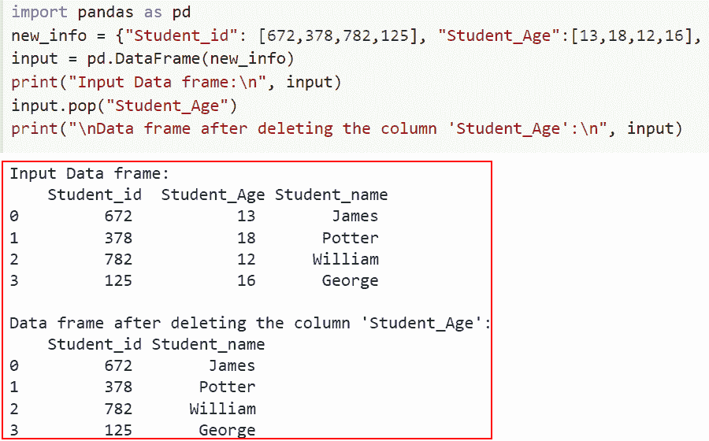
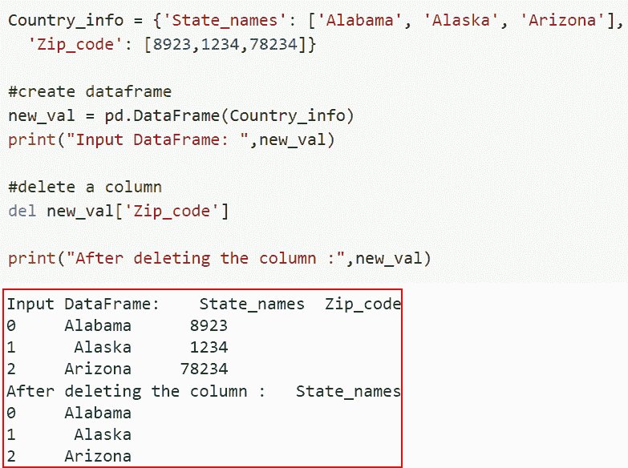
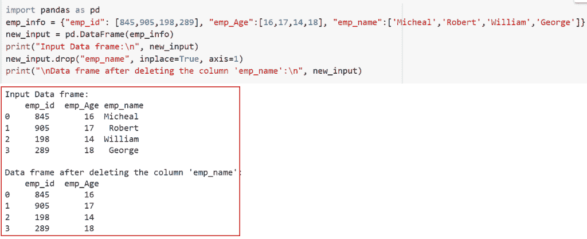
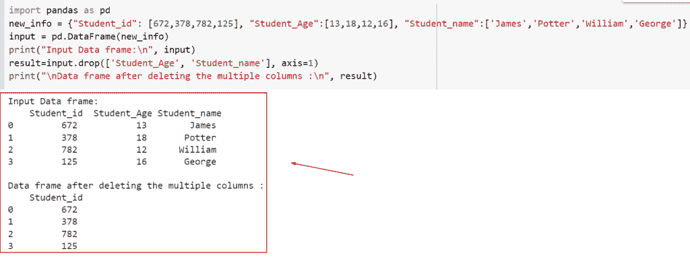

# 如何删除熊猫中的一个栏目

> 原文：<https://pythonguides.com/delete-a-column-in-pandas/>

[](https://sharepointsky.teachable.com/p/python-and-machine-learning-training-course)

在本 [Python 教程](https://pythonguides.com/python-programming-for-the-absolute-beginner/)中，我们将学习在 [Python 熊猫](https://pythonguides.com/pandas-in-python/)中删除一列的各种方法。我们将使用一些内置函数来理解在 Python Pandas 中删除列的各种方法

作为一名开发人员，在制作 Python 项目时，我被要求删除 pandas 中的一个列

在这里我们将看到:

*   如何使用 dataframe.pop()删除 pandas 中的列
*   如何使用 del 关键字删除 pandas 中的列
*   如何使用 drop()在 Python pandas 中删除列
*   如何使用 drop()删除 Python pandas 中的多个列

目录

[](#)

*   [删除 Python 熊猫里的一个栏目](#Delete_a_column_in_Python_pandas "Delete a column in Python pandas")
    *   [如何使用 dataframe.pop()删除 pandas 中的列](#How_to_delete_a_column_in_pandas_using_a_dataframepop "How to delete a column in pandas using a dataframe.pop()")
    *   [如何使用 del 关键字删除 pandas 中的列](#How_to_delete_a_column_in_pandas_using_a_del_keyword "How to delete a column in pandas using a del keyword")
    *   [如何使用 drop()](#How_to_delete_a_column_in_Python_pandas_using_drop "How to delete a column in Python pandas using drop() ") 在 Python pandas 中删除列
    *   [如何使用 drop()](#How_to_delete_multiple_columns_in_Python_pandas_using_drop "How to delete multiple columns in Python pandas using drop()") 在 Python pandas 中删除多个列

## 删除 Python 熊猫里的一个栏目

在 Python 中，当在 Python Pandas 中删除列时，主要有六种常用且重要的理解方法。

### 如何使用 dataframe.pop()删除 pandas 中的列

*   在本节中，我们将讨论如何使用 `dataframe.pop()` 在 Python pandas 中删除列。
*   通过简单地将列名作为参数传递，我们可以使用 `pandas.dataframe.pop()` 方法从数据框中移除或删除列。
*   此函数返回指定的项目，并将指定的项目放到数据帧中。这项技术使我们能够从数据帧中删除任何部分。

**语法:**

下面是 Python 中 pandas dataframe.pop()的语法

```py
DataFrame.pop(item)
```

**注意:**该参数只有一个参数，表示将要弹出的下一列的标签。

**举例:**

让我们举一个例子，看看如何使用 `dataframe.pop()` 在 Python pandas 中删除一列。

**源代码:**

```py
import pandas as pd 
new_info = {"Student_id": [672,378,782,125], "Student_Age":[13,18,12,16], "Student_name":['James','Potter','William','George']}
input = pd.DataFrame(new_info)
print("Input Data frame:\n", input)
input.pop("Student_Age")
print("\nData frame after deleting the column 'Student_Age':\n", input)
```

在下面的代码中，我们首先声明了一个字典，然后使用 pd.dataframe()函数将它们转换成 dataframe。接下来，我们使用 input.pop()函数从 dataframe 中删除了“student_age”列。

下面是下面给出的代码的截图。



How to delete a column in pandas using a dataframe.pop()

这是如何使用 dataframe.pop()删除 pandas 中的列。

阅读:[检查 Python Pandas 中的数据帧是否为空](https://pythonguides.com/check-if-dataframe-is-empty-in-python-pandas/)

### 如何使用 del 关键字删除 pandas 中的列

*   现在让我们讨论如何使用 del 关键字删除 Python Pandas 中的列。
*   Python 中的 del 关键字也可用于直接从数据框中移除列。在 Python 中，del 关键字通常用于移除或清空对象。
*   在这个例子中，我们将生成一个 DataFrame，然后使用 del 关键字删除一个特定的列。使用列标签，选择要删除的列。

**语法:**

让我们看看语法，理解 Python 中 del 关键字的工作原理

```py
del dataframe['item']
```

> **注意:**该参数只取一个参数，表示下一列将要删除的标签。

**举例:**

这里我们将举一个例子，并检查如何使用 del 关键字在 Python Pandas 中删除列。

**源代码:**

```py
import pandas as pd

Country_info = {'State_names': ['Alabama', 'Alaska', 'Arizona'],
	'Zip_code': [8923,1234,78234]}

#create dataframe
new_val = pd.DataFrame(Country_info)
print("Input DataFrame: ",new_val)

#delete a column
del new_val['Zip_code']

print("After deleting the column :",new_val)
```

在上面的代码中，我们首先导入了 Pandas 库，然后声明了一个字典‘Country _ info’。接下来，我们使用 pd.dataframe()函数将字典转换成数据帧。

之后，我们使用 del 关键字从 dataframe 中删除特定的列。

你可以参考下面的截图



How to delete a column in pandas using a del keyword

在这个例子中，我们已经理解了如何使用 del 关键字删除 pandas 中的列。

阅读:[向数据帧添加行 Python 熊猫](https://pythonguides.com/add-row-to-dataframe-python-pandas/)

### 如何使用 drop() 在 Python pandas 中删除列

*   在这一节中，我们将讨论如何使用 drop()在 Python pandas 中删除列。
*   在 `pandas.dataframe.drop()` 函数的帮助下，我们可以从数据框中移除值。这些值要么是面向行的，要么是面向列的。
*   要删除此示例的 dataframe 中的特定列，请使用 drop()函数。要选择要删除的列，我们使用列标签。

**语法:**

下面是 Python 中 pandas.dataframe.drop()的语法

```py
dataframe.drop('item', inplace=True, axis=1)
```

*   它由几个参数组成
    *   **项:**表示将要删除的下一列的标签。
    *   **inplace:** 默认返回 DataFrame 的副本，False。当使用 True 时，它就地删除当前 DataFrame 的列，并返回 None。
    *   **Axis:** 默认情况下，它取 1，这意味着我们必须为列方式的元素删除它。如果它是 0，那么它将按行删除它。

**举例:**

```py
import pandas as pd 
emp_info = {"emp_id": [845,905,198,289], "emp_Age":[16,17,14,18], "emp_name":['Micheal','Robert','William','George']}
new_input = pd.DataFrame(emp_info)
print("Input Data frame:\n", new_input)
new_input.drop("emp_name", inplace=True, axis=1)
print("\nData frame after deleting the column 'emp_name':\n", new_input)
```

在下面给出的代码中，我们首先导入了 Pandas 库，然后通过使用 `pd.dataframe()` 函数创建了一个 dataframe，在这个函数中，我们将输入字典指定为一个参数。

之后，我们使用了 *`dataframe.drop()`* 函数，在这个函数中，我们提到了想要从 dataframe 中删除的列名。

下面是以下给定代码的实现。



How to delete a column in Python pandas using a drop

阅读: [Python 熊猫掉行示例](https://pythonguides.com/python-pandas-drop-rows-example/)

### 如何使用 drop() 在 Python pandas 中删除多个列

*   现在让我们了解如何使用 drop()删除 Python pandas 中的多个列。
*   在 `pandas.dataframe.drop()` 函数的帮助下，我们可以从数据框中移除值。这些值要么是面向行的，要么是面向列的。
*   要删除 dataframe 中的许多列，请使用 drop()函数。为了选择要删除的列，我们使用了一组列标签。

**举例:**

让我们举一个例子，看看如何使用 drop()删除 Python pandas 中的多个列。

**源代码:**

```py
import pandas as pd 
new_info = {"Student_id": [672,378,782,125], "Student_Age":[13,18,12,16], "Student_name":['James','Potter','William','George']}
input = pd.DataFrame(new_info)
print("Input Data frame:\n", input)
result=input.drop(['Student_Age', 'Student_name'], axis=1)
print("\nData frame after deleting the multiple columns :\n", result)
```

在上面的代码中，我们必须从 dataframe 中删除多个列，为此我们使用了 dataframe.drop()函数。在这个函数中，我们分配了多个列['Student_Age '，' Student_name']，同时我们分配了 axis=1，这意味着它将按列删除元素。

下面是下面给出的代码的截图。



How to delete multiple columns in Python pandas using a drop()

正如您在截图中看到的，我们已经讨论了如何使用 drop()在 Python pandas 中删除多个列。

你可能也喜欢阅读下面的 Python 熊猫教程。

*   [Python 中熊猫缺失数据](https://pythonguides.com/missing-data-in-pandas/)
*   [Python 熊猫数据帧 Iterrows](https://pythonguides.com/pandas-dataframe-iterrows/)
*   [Python 熊猫中的交叉表](https://pythonguides.com/crosstab-in-python-pandas/)
*   熊猫用 0 换下南

在本文中，我们讨论了在 Python pandas 中删除列的各种方法。此外，我们还讨论了以下主题。

*   如何使用 dataframe.pop()删除 pandas 中的列
*   如何使用 del 关键字删除 pandas 中的列
*   如何使用 drop()在 Python pandas 中删除列
*   如何使用 drop()删除 Python pandas 中的多个列

[Arvind](https://pythonguides.com/author/arvind/)

Arvind 目前是 TSInfo Technologies 的高级 Python 开发人员。他精通 Python 库，如 NumPy 和 Tensorflow。