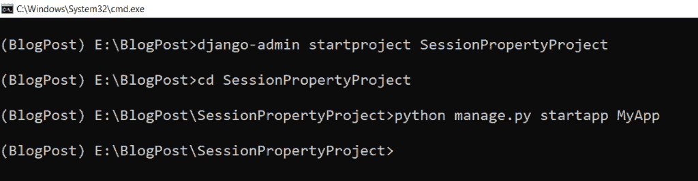

# 如何在 Django 中删除会话属性

> 原文：<https://pythonguides.com/delete-session-property-in-django/>

[](https://sharepointsky.teachable.com/p/python-and-machine-learning-training-course)

在这个 [Python Django 教程](https://pythonguides.com/what-is-python-django/)中，我会用简单的步骤解释**如何删除 Django** 中的 session 属性。

最近，我一直在使用 Django web 框架创建一个公司管理系统。我有一个在员工登录和注销时创建会话的要求，它需要自动删除 Django 中的会话属性。

因此，我已经做了研究，并为公司管理系统创建了一个登录和注销页面，该页面将具有会话删除属性的功能。

在这里，我们将看到:

*   什么是会话
*   如何在 Django 中创建会话
*   如何在 Django 中删除会话属性
*   如何在 Django 中创建登录和注销系统
*   如何使用 Django 管理界面注册员工

在本文的最后，您还可以下载在 Python Django 中删除会话的代码。

目录

[](#)

*   [如何逐步删除 Django 中的会话属性](#How_to_delete_session_property_in_Django_step_by_step "How to delete session property in Django step by step")
    *   [姜戈会议](#Django_Session "Django Session")
    *   [启用会话](#Enabling_Session "Enabling Session")
    *   [删除 Django 中的会话属性](#Delete_session_property_in_Django "Delete session property in Django")
        *   [在 Python Django 中设置项目](#Set_up_Project_in_Python_Django "Set up Project in Python Django")
        *   [在 Django 中创建模型](#Create_Model_in_Django "Create Model in Django")
        *   [在管理界面注册模型](#Register_Model_in_Admin_Interface "Register Model in Admin Interface")
        *   [使用模型表单在 Python Django 中创建 Web 表单](#Create_Web_Form_in_Python_Django_using_ModelForms "Create Web Form in Python Django using ModelForms")
        *   [Django 中的登录和注销系统模板](#Login_and_Logout_system_template_in_Django "Login and Logout system template in Django")
        *   [会话属性删除视图](#Session_Property_Deletion_View "Session Property Deletion View")
        *   [执行 Django 模型](#Execute_Django_Model "Execute Django Model")
        *   [通过管理员](#Register_the_employee_through_Admin "Register the employee through Admin")登记员工
        *   [执行应用程序删除 Django 中的会话属性](#Execute_the_application_to_delete_session_property_in_Django "Execute the application to delete session property in Django")
*   [下载 Django 完整代码中的删除会话属性](#Download_the_delete_session_property_in_Django_complete_code "Download the delete session property in Django complete code")
*   [结论](#Conclusion "Conclusion")

## 如何逐步删除 Django 中的会话属性

### 姜戈会议

当我们与 web 应用程序交互时，会话是一种在服务器端存储数据的技术。基本上，会话是浏览器和服务器之间的双向、半永久的交互。

在 Django 中，会话数据保存在数据库中，它可以是基于缓存或基于文件的会话。

### 启用会话

在 Django，当我们创建网站的蓝图时，会话被自动启用。

Django 会话配置是在位于 `settings.py` 文件中的 `INSTALLED_APPS` 和**中间件**部分中设置的，如下所示。

```py
INSTALLED_APPS = [
    'django.contrib.admin',
    'django.contrib.auth',
    'django.contrib.contenttypes',
    **'django.contrib.sessions',**
    'django.contrib.messages',
    'django.contrib.staticfiles',
]
```

在 Django 中， `settings.py` 文件中的 `INSTALLED_APPS` 包含了 `django.contrib.sessions` 应用，用于在数据库中存储会话。

```py
MIDDLEWARE = [
    'django.middleware.security.SecurityMiddleware',
    **'django.contrib.sessions.middleware.SessionMiddleware',**
    'django.middleware.common.CommonMiddleware',
    'django.middleware.csrf.CsrfViewMiddleware',
    'django.contrib.auth.middleware.AuthenticationMiddleware',
    'django.contrib.messages.middleware.MessageMiddleware',
    'django.middleware.clickjacking.XFrameOptionsMiddleware',
]
```

在 Django 中，用于生成唯一的会话 id 的中间件**。SessionMiddleware** 负责。

> **注意:** 当我们迁移应用程序时，数据库中会自动创建 `django_session` 表。

阅读: [Python 改 Django 版本](https://pythonguides.com/python-change-django-version/)

### 删除 Django 中的会话属性

现在，我们将看到一个使用登录和注销系统在 Django 中删除会话属性的例子。

#### 在 Python Django 中设置项目

要启动 Django 项目，请打开终端并输入以下命令。这里， `SessionPropertyProject` 是 Django 项目的名称。

```py
django-admin startproject SessionPropertyProject
```

它将创建一个名为 `SessionPropertyProject` 的文件夹，并在终端中输入下面的命令。

```py
cd SessionPropertyProject
```

通过在终端中键入下面的命令，在这个项目文件夹中创建一个名为 `MyApp` 的 Django 应用程序。

```py
python manage.py startapp MyApp
```



Set Up Project in Django

将应用名称添加到位于 `settings.py` 文件中的 `INSTALLED_APP` 列表中，以激活该应用。


settings.py

Django 在项目目录中包含了一个 `urls.py` 文件，默认情况下，它将新构建的应用程序映射到其中。为此，在其中添加以下代码。

```py
from django.contrib import admin
from django.urls import path,include

urlpatterns = [
    path('admin/', admin.site.urls),
    path('',include('MyApp.urls')),
]
```

阅读: [Python Django 格式日期](https://pythonguides.com/python-django-format-date/)

#### 在 Django 中创建模型

要在 Django 中创建模型，打开 app 目录中的 `models.py` 文件，并添加下面给出的代码。

```py
from django.db import models

# Create your models here.

class EmployeeLogin(models.Model):
    username=models.CharField(max_length=10)
    password=models.CharField(max_length=8)
    def __str__(self):
        return self.username
```

*   这里，我们创建了一个模型类 `EmployeeLogin` ，它有以下字段。
*   **用户名**和**密码**是 Django 字符域。这些字符字段分别有 10 个和 8 个字符的限制。
*   要更改 Django 模型中对象的显示名称，使用 `def __str__(self)` 。当我们返回 `self.username` 时，它会将项目名称显示为用户名。

#### 在管理界面注册模型

要在管理应用程序中查看模型，请在管理站点上注册它。打开 `admin.py` 文件，将以下代码添加到该文件中。

```py
from django.contrib import admin
from .models import EmployeeLogin

# Register your models here.
class EmployeeLoginAdmin(admin.ModelAdmin):
    list_display = ('username', 'password')

# Model registered with custom admin
admin.site.register(EmployeeLogin,EmployeeLoginAdmin)
```

*   这里，我们创建名为 `EmployeeLoginAdmin` 的管理类，它使用 `list_display` 元组显示用户名和密码字段。
*   然后，我们使用 `admin.site.register` 函数向 `EmployeeLogin` 注册 `EmployeeLoginAdmin` 类。

阅读: [Python Django vs ReactJS](https://pythonguides.com/django-vs-reactjs/)

#### 使用模型表单在 Python Django 中创建 Web 表单

要创建一个表单，将下面的代码添加到我们在 app 目录中创建的 `forms.py` 文件中。

```py
from django import forms
from .models import EmployeeLogin

class EmployeeLoginForm(forms.ModelForm):
    password = forms.CharField(widget=forms.PasswordInput)

    class Meta:
        fields='__all__'
        model = EmployeeLogin
```

*   这里，我们使用**表单创建一个表单。名为 `EmployeeLoginForm` 的模型表单**类。它拥有 `EmployeeLogin` 模型的所有字段。
*   此外，我们定义了**小部件**属性 PasswordInput，该属性将密码字段设置为密码输入。

阅读: [Python Django 表单验证](https://pythonguides.com/django-form-validation/)

#### Django 中的登录和注销系统模板

在主项目目录中创建一个名为 `Templates` 的子目录来存储所有的项目模板，因为 Django 应用程序的前端是在 Templates 中指定的。

打开 `settings.py` 文件，更新 `DIRS` 指向 Templates 文件夹的位置。


Set path of Django Template

创建一个`login.html`文件，在模板文件夹中添加用于记录员工的 HTML 代码。

```py
<!DOCTYPE html>
<html lang="en">

<head>
    <meta charset="UTF-8">
    <meta http-equiv="X-UA-Compatible" content="IE=edge">
    <meta name="viewport" content="width=device-width, initial-scale=1.0">
    <title>Login</title>
    <style>
        table {
            border: 8px outset;
            border-radius: 10px;
            border-spacing: 10px;
            padding: 20px;
            margin-left: auto;
            margin-right: auto;
        }
    </style>
</head>

<body>
    <h1 align="center">Employee Login</h1>
    <hr>
    <h3 align="center">Please complete the form below to login.</h3>
    <hr>
    <br>
    
    
    <div class="alert alert-primary" role="alert">

        <p class="" >{{ message }}</p>
    </div>
    
    
    <form method="post">
        
        <table>
            {{form.as_table}}
        </table>
        <br><br>
        <div style="text-align:center">
            <button type="submit">Login</button>
        </div>
    </form>
</body>

</html> 
```

*   首先，我们在**头**标签中设置**表**的**样式**。
*   然后使用 HTML 标签 `h1` 和 `h3` 将表单的标题添加到 body 标签中。
*   要断开线条并画一条水平线，分别使用 `br` 和 `hr` 标签。
*   为了打印错误和成功消息，我们在 if 和 for 语句中使用了 **{{message}}** 标记。
*   然后，一旦通过 `POST` 方法提交后，**表单**标签将用于发布**用户名**和**密码**。
*   接下来，表单元素中的 `csrf_token` 用于保护表单免受网络攻击，并使我们能够安全地传输数据。
*   然后，我们使用 `form.as_table` 标签将表单呈现为 `table` 标签中的一个表格。
*   最后，添加一个**提交**按钮来登录员工。

创建一个`home.html`文件，在模板文件夹中添加 HTML 代码，用于向员工显示仪表板和注销按钮。

```py
<!doctype html>
<html lang="en">

<head>
    <!-- Required meta tags -->
    <meta charset="utf-8">
    <meta name="viewport" content="width=device-width, initial-scale=1, shrink-to-fit=no">

    <!-- Bootstrap CSS -->
    <link rel="stylesheet" href="https://cdn.jsdelivr.net/npm/bootstrap@4.0.0/dist/css/bootstrap.min.css"
        integrity="sha384-Gn5384xqQ1aoWXA+058RXPxPg6fy4IWvTNh0E263XmFcJlSAwiGgFAW/dAiS6JXm" crossorigin="anonymous">

    <title>PythonGuides</title>
</head>

<body>
    <nav class="navbar navbar-expand-lg navbar-light bg-light">
        <a class="navbar-brand" href="#">PythonGuides</a>
        <button class="navbar-toggler" type="button" data-toggle="collapse" data-target="#navbarSupportedContent"
            aria-controls="navbarSupportedContent" aria-expanded="false" aria-label="Toggle navigation">
            <span class="navbar-toggler-icon"></span>
        </button>

        <div class="collapse navbar-collapse" id="navbarSupportedContent">
            <ul class="navbar-nav mr-auto">
                <li class="nav-item dropdown">
                    <a class="nav-link dropdown-toggle" href="#" id="navbarDropdown" role="button"
                        data-toggle="dropdown" aria-haspopup="true" aria-expanded="false">
                        Blogs
                    </a>
                    <div class="dropdown-menu" aria-labelledby="navbarDropdown">
                        <a class="dropdown-item" href="https://pythonguides.com/django/">Django</a>
                        <a class="dropdown-item" href="https://pythonguides.com/matplotlib/">Matplotlib</a>
                        <a class="dropdown-item" href="https://pythonguides.com/turtle/">Turtle</a>
                        <a class="dropdown-item" href="https://pythonguides.com/tkinter/">Tkinter</a>
                    </div>
                </li>
            </ul>
            <a class="btn btn-primary" href="/logout/" role="button">Log Out</a>

        </div>
    </nav>
    
    
    <div class="alert alert-primary" role="alert">

        <p class="" >{{ message }}</p>
    </div>
    
    
    <div class="container my-3">
        <h1 style="text-align:center;">Welcome to Python Guides</h1>
    </div>

    <div class="card">
        <div class="card-body">
            <h3 style="text-align:center;">Thanks for landing on this page to know more about PythonGuides.com.</h3>
            <br>
            <h6>I welcome you to the website and hopefully, you got to learn something in Python. I started this website
                to share my finding and learnings in Python with you.</h6>
            <h6>To keep things simple, I am trying to write a lot of articles on Python. Feel free to give your valuable
                comments and also share the articles if you are liking and hoping it will be helpful to someone.</h6>
            <br>
            <h2 style="text-align:center;">Also, Subscribe to Our YouTube Channel for FREE Python Video Tutorials.</h2>
        </div>
    </div>

    <!-- Optional JavaScript -->
    <!-- jQuery first, then Popper.js, then Bootstrap JS -->
    <script src="https://code.jquery.com/jquery-3.2.1.slim.min.js"
        integrity="sha384-KJ3o2DKtIkvYIK3UENzmM7KCkRr/rE9/Qpg6aAZGJwFDMVNA/GpGFF93hXpG5KkN"
        crossorigin="anonymous"></script>
    <script src="https://cdn.jsdelivr.net/npm/popper.js@1.12.9/dist/umd/popper.min.js"
        integrity="sha384-ApNbgh9B+Y1QKtv3Rn7W3mgPxhU9K/ScQsAP7hUibX39j7fakFPskvXusvfa0b4Q"
        crossorigin="anonymous"></script>
    <script src="https://cdn.jsdelivr.net/npm/bootstrap@4.0.0/dist/js/bootstrap.min.js"
        integrity="sha384-JZR6Spejh4U02d8jOt6vLEHfe/JQGiRRSQQxSfFWpi1MquVdAyjUar5+76PVCmYl"
        crossorigin="anonymous"></script>
</body>

</html>
```

*   要加载我们的 CSS，将 Bootstrap 和 jQuery CDN 放在任何其他样式表之前的 `head` 标签中。
*   在**主体**标签中，包含带有类别**导航条**和**导航条-扩展-lg** 的导航标签。
*   添加一个带有类 `collapse navbar-collapse` 的 `div` 标签，并添加另一个带有类`drop-menu`的 `div` ，以添加一个用于添加博客类别的下拉菜单栏。
*   然后，我们添加一个带有类**卡**的 `div` 标签来添加我们想要在网站页面上显示的内容。
*   为了打印错误和成功消息，我们在 if 和 for 语句中使用了 **{{message}}** 标记。
*   最后，添加一个带有**注销**链接的按钮，将**注销**给员工。

阅读:[从 Python Django 中删除模式](https://pythonguides.com/how-to-delete-schema-from-python-django/)

#### 会话属性删除视图

要定义删除会话属性的主要逻辑，打开 `views.py` 文件并添加下面给出的代码。

```py
from django.shortcuts import render,redirect
from .forms import EmployeeLoginForm
from .models import EmployeeLogin
from django.contrib import messages

# Create your views here.

# Create Session

def employee_login(request):
    message=''
    if request.method=='POST':
        username=request.POST['username']
        password=request.POST['password']
        data=EmployeeLogin.objects.filter(username=username,password=password).count()
        if data > 0:
            request.session['user']=username
            messages.info(request,'Session Created')
            return redirect('/dashboard')
        else:
            messages.info(request,'Invalid Credentials')
            print('Not created')
    form=EmployeeLoginForm()
    return render(request,'login.html',{'form':form,'message':message})

# Dashboard

def home(request):
    return render(request,'home.html')

# Delete Session Property

def employee_logout(request):
    del request.session['user']
    messages.info(request,'Session Deleted')
    return redirect('employee_login')
```

*   从 `forms.py` 中导入 `EmployeeLoginForm` ，从 `models.py` 中导入 `EmployeeLogin` ，创建一个名为 `employee_login` 的视图。
*   然后，调用 `if` 语句，检查是否
    *   如果是，使用**请求。POST** 获取**用户名**和**密码**。
*   之后，我们使用带有模型对象的**过滤器**方法，将雇员输入的用户名和密码与注册的用户名和密码进行匹配。

**创建 Django 会话**

*   在视图中使用 `request.session` 来设置或创建 Django 会话变量。基本上，它的作用就像一个字典，即它可以将会话名定义为键，将它们的值定义为值。
*   这里，我们使用请求对象作为一个 **request.session['user']** 会话变量，并将其值设置为一个**用户名**。
*   然后，我们使用 `message.info` 打印会话创建成功的消息。
*   如果请求方法是 `GET` ，则使用 `render()` 函数向用户呈现一个空白的登录页面。

**渲染到仪表板**

*   然后，我们创建一个名为 `home` 的基于函数的视图，以呈现给【home.html】模板**。**

**删除 Django 会话属性**

*   创建一个名为 `employee_logout` 的视图来删除会话属性。要删除会话，使用带有 `request.session` 对象的 `del` 。
*   然后，我们使用 `message.info` 打印会话删除成功的消息。
*   最后，我们使用重定向函数将用户重定向到 `employee_login` 视图。

现在，我们必须用 URL 映射视图以便调用它，因此我们必须在 app 目录中创建一个名为 `urls.py` 的文件。包括下面的代码。

```py
from django.urls import path
from . import views

urlpatterns = [
path('', views.employee_login, name='employee_login'),
path('dashboard/', views.home, name='home'),
path('logout/', views.employee_logout, name='employee_logout'),
]
```

#### 执行 Django 模型

为了处理管理界面，我们首先必须使用下面的命令创建超级用户。

```py
python manage.py createsuperuser
```

要创建包含模型表格模式代码的迁移文件，请在终端中键入以下命令。

```py
python manage.py makemigrations
```

要根据迁移文件的模式构建表，请执行以下命令。

```py
python manage.py migrate
```

#### 通过管理员登记员工

现在，要成功登录到员工，我们必须先注册，为此，我们将使用管理界面。请遵循以下步骤:

首先，通过在终端中键入下面给出的命令来启动开发服务器。

```py
python manage.py runserver
```

通过如下所示展开 URL，我们可以访问管理面板。

```py
127.1.1.0/admin
```

它成功地打开了 Django admin，现在点击员工登录前面的 Add 选项，通过设置用户名和密码创建新员工。接下来，单击保存。


Register employees using the admin interface

另外，查看:[如何将 Google reCAPTCHA 添加到 Django 表单](https://pythonguides.com/add-google-recaptcha-to-django-form/)

#### 执行应用程序删除 Django 中的会话属性

它成功地打开了登录页面，如下所示。填写员工的注册用户名和密码，然后点击登录。


Login username and password

它将被成功地重定向到仪表板，并在顶部显示 Django 会话创建成功的消息。


Company Management Dashboard

现在，为了删除 Django session 属性，我们必须点击左上方的 Log Out 按钮。


Log Out Button

它将成功地重定向到登录页面，并向我们显示 Django 会话属性被删除的消息。


Delete Session Property in Django

这就是我们删除 Django 会话属性的方法。

## 下载 Django 完整代码中的删除会话属性

这是代码。

[Delete Session Property in Django](https://pythonguides.com/wp-content/uploads/2023/01/SessionPropertyProject.zip)

## 结论

至此，我们已经成功地理解了如何在 Django 中删除会话属性。我们还学习了会话以及如何在 Django 中创建会话。

此外，我们还讨论了以下主题。

*   什么是会话
*   如何在 Django 中创建会话
*   如何在 Django 中删除会话属性
*   如何在 Django 中创建登录和注销系统
*   如何使用 Django 管理界面注册员工

您可能也喜欢阅读下面的 Python Django 教程。

*   [Python Django 长度过滤器](https://pythonguides.com/python-django-length-filter/)
*   [如何从 Django 的 get 请求中获取数据](https://pythonguides.com/get-data-from-get-request-in-django/)
*   [Python 过滤器不在 Django 中](https://pythonguides.com/filter-not-in-django/)
*   模型 Django 上的联合操作

[Tanya Puri](https://pythonguides.com/author/tanya/)

拥有丰富 Django 和 Matplotlib 经验的 Python 开发人员，目前在 TSInfo Technologies 工作。我正在成为专业程序员、博客写手和 YouTuber 的路上。