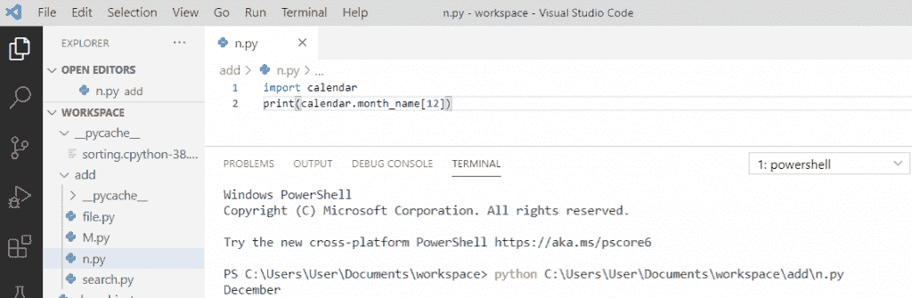

# 如何用 Python 显示日历

> 原文：<https://pythonguides.com/display-calendar-in-python/>

[](https://sharepointsky.teachable.com/p/python-and-machine-learning-training-course)

在本 [Python 教程](https://pythonguides.com/python-gui-programming/)中，我们将讨论**如何在 Python** 中显示日历。除此之外，我们还将检查:

*   如何用 python 打印全年日历
*   如何在 Python 中获取当前年份
*   python 示例中的日历
*   Python calendar.weekday()方法
*   Python 获取给定日期的星期几
*   从 python 中的一个数字中找出月份的名称
*   Python 获取一个月中周的列表作为日期

目录

[](#)

*   [用 Python 显示日历](#Display_calendar_in_Python "Display calendar in Python")
*   [用 python 打印全年日历](#Print_whole_year_calendar_in_python "Print whole year calendar in python")
*   [Python 获取当前年份](#Python_get_the_current_year "Python get the current year")
*   [python 中的日历示例](#Calendar_in_python_example "Calendar in python example")
*   [Python calendar.weekday()方法](#Python_calendarweekday_method "Python calendar.weekday() method")
*   [Python 获取给定日期的星期几](#Python_get_the_day_of_the_week_for_a_given_date "Python get the day of the week for a given date")
*   [从 python 中的一个数字中找出月份的名称](#Find_the_name_of_the_month_from_a_number_in_python "Find the name of the month from a number in python ")
*   [Python 获取一个月中周的列表作为日期](#Python_get_a_list_of_weeks_in_the_month_as_date "Python get a list of weeks in the month as date")
*   [Python 遍历一个月中的每一天](#Python_iterate_through_days_of_a_month "Python iterate through days of a month")

## 用 Python 显示日历

现在，让我们看看**如何用 python** 显示日历。

*   我们需要**导入**日历模块来显示 python 中的**日历。**
*   模块内部的内置函数 `month()` 取年和月。
*   然后它会显示一年中该月的日历。

**举例:**

```py
import calendar
year = 2018
month = 12
print(calendar.month(year, month))
```

可以看到输出，一旦你打印 **"calendar.month(year，month)"** 就会出现输出。这里，当我们运行代码时，将显示给定的年和月日历。

可以参考下面的截图程序**用 Python** 显示一个日历。


Program to display a calendar in Python

你可能会喜欢 [Python Tkinter 秒表](https://pythonguides.com/python-tkinter-stopwatch/)

## 用 python 打印全年日历

让我们看看如何用 python 打印**全年日历。**

*   首先，我们需要**导入**T2 日历模块
*   然后初始化年份
*   模块内部的内置函数 `calendar()` 取年份
*   要打印特定年份的日历，请使用 `calendar.calendar(year)`

**举例:**

```py
import calendar
year = 2019
print(calendar.calendar(year))
```

可以看到输出，一旦你打印`" calendar . calendar(year)"`就会出现输出。在这里，我们导入了日历模块，打印后输出中显示了 2019 年的全年日历。

可以参考下面截图**用 python** 打印全年日历。


Print whole year calendar in python

**输出:**

这是上面提到的代码的输出，您可以看到显示的是 2019 年的日历。


Print whole year calendar in python

## Python 获取当前年份

现在，让我们看看下面这个关于 **python 获取当前年份**的例子。

为了在 python 中获得当前年份，我们将首先**导入日期时间**。然后我们将使用 **datetime.datetime.now()。年份**获取当前年份。

**举例:**

```py
import datetime
current_y = datetime.datetime.now().year
print(current_y)
```

可以看到输出，一旦你打印出 `"current_y"` ，那么输出将显示为当前年份的 `"2020"` 。这里，我们导入了 `datetime` 模块，打印后，它将在输出中返回当前年份。

可以参考下面 **python 获取当年**的截图。


Python get the current year

## python 中的日历示例

*   首先，我们将**导入日历**模块
*   这里，**s =日历。TextCalendar(日历。星期五)**创建一个文本日历。
*   **c_str = s.formatmonth(2022，1)** 正在创建 2022 年的日历，1 月-1 月。
*   `c_str` 将打印输出。

**举例:**

```py
import calendar
s = calendar.TextCalendar(calendar.FRIDAY)
c_str = s.formatmonth(2022,1)
print(c_str)
```

可以看到输出，一旦你打印 `"c_str"` 输出就会出现。这里我们导入了**日历**模块，打印后会返回 2022 年 1 月的日历。

你可以参考下面 python 例子中日历的截图


Calendar in python example

## Python calendar.weekday()方法

`weekday()` 方法用于返回星期几。因此， **0 是星期一**，而 **6 是星期日**，这是一周的最后一天。

**举例:**

```py
import calendar
print(calendar.weekday(2020, 12, 20)
```

可以看到输出，一旦你打印出 `"calendar.weekday()"` ，那么输出将显示为 `"6"` ，也就是**周日**。这里，我们已经导入了**日历模块**，在打印之后，它将返回值“6”，即星期天。

可以查看下面 python calendar.weekday()方法的截图。


Python calendar.weekday() method

## Python 获取给定日期的星期几

我们将首先导入**日历**模块，然后使用 `weekday()` 函数获取给定日期的星期几。

**举例:**

```py
import calendar
d = calendar.weekday(2020, 12, 22)
print(calendar.day_name[d])
```

可以看到输出，一旦你打印了 **"calendar.day_name[d]"** ，那么输出将显示为**"星期二"**。这里，我们导入了**日历模块**，打印后，它将返回星期几。

你可以参考下面的截图来获取给定日期的星期几。


Python get the day of the week for a given date

读取: [Python NumPy 读取 CSV](https://pythonguides.com/python-numpy-read-csv/)

## 从 python 中的一个数字中找出月份的名称

为了从一个数字中获取月份名称，我们将使用 **"calendar.month_name[]"** 它将返回完整的月份名称。

**举例:**

```py
import calendar
print(calendar.month_name[12])
```

可以看到输出，一旦你打印出**" calendar . month _ name[12]"**，那么输出将显示为**"十二月"**。这里，我们导入了**日历模块**，打印后，它将从一个数字返回月份的名称

你可以参考下面的截图，用 python 从一个数字中找出月份的名称。



Find the name of the month from a number in python

## Python 获取一个月中周的列表作为日期

函数 `monthdayscalendar()` 打印特定月份的周列表，它采用两个参数**年**和**月**并返回该日期的周列表。

**举例:**

```py
import calendar
c = calendar.Calendar()
for week in c.monthdayscalendar(2020, 12):
    print(week)
```

输出可以看到，一旦你将打印**“周”**然后输出将出现。这里，我们已经导入了**日历模块**，for 循环用于迭代，它将返回特定月份的周列表

你可以看到下面的 python 获取一个月中的周列表的截图。


Python get a list of weeks in the month as date

## Python 遍历一个月中的每一天

为了**遍历一个月的日子**，我们将使用函数**“itermonthdays()”**，它将遍历给定月份和年份的日子。

**举例:**

```py
import calendar
c = calendar.Calendar()
for day in c.itermonthdays(2021, 1):
    print(day)
```

输出可以看到，一旦你将打印**“日”**。在这里，我们导入了**日历模块**，使用 for 循环进行迭代，它将返回所述月份的日期，即**一月**。

在下面的截图中，我们可以看到代码和输出。


Python iterate through days of a month

**输出:**


Python iterate through days of a month

您可能会喜欢以下 Python 教程:

*   [如何用 Python 制作计算器](https://pythonguides.com/make-a-calculator-in-python/)
*   [Python 布尔函数](https://pythonguides.com/python-booleans/)
*   [Python 中的正则表达式](https://pythonguides.com/regular-expressions-in-python/)
*   [Python 打印 2 位小数](https://pythonguides.com/python-print-2-decimal-places/)
*   [Python 计数器——详细教程](https://pythonguides.com/python-counter/)
*   [Python 格式数字加逗号](https://pythonguides.com/python-format-number-with-commas/)
*   [Python 生成随机数和字符串](https://pythonguides.com/python-generate-random-number/)
*   [Python 将列表写入文件，并附有示例](https://pythonguides.com/python-write-list-to-file/)
*   [Python 中的链表](https://pythonguides.com/linked-lists-in-python/)
*   [如何用 Python 制作矩阵](https://pythonguides.com/make-a-matrix-in-python/)

在本 Python 教程中，我们学习了:

*   如何用 Python 显示日历
*   如何用 python 打印全年日历
*   如何在 Python 中获取当前年份
*   python 示例中的日历
*   Python calendar.weekday()方法
*   Python 获取给定日期的星期几
*   从 python 中的一个数字中找出月份的名称
*   Python 获取一个月中周的列表作为日期
*   Python 遍历一个月中的每一天

[Bijay Kumar](https://pythonguides.com/author/fewlines4biju/)

Python 是美国最流行的语言之一。我从事 Python 工作已经有很长时间了，我在与 Tkinter、Pandas、NumPy、Turtle、Django、Matplotlib、Tensorflow、Scipy、Scikit-Learn 等各种库合作方面拥有专业知识。我有与美国、加拿大、英国、澳大利亚、新西兰等国家的各种客户合作的经验。查看我的个人资料。

[enjoysharepoint.com/](https://enjoysharepoint.com/)[](https://www.facebook.com/fewlines4biju "Facebook")[](https://www.linkedin.com/in/fewlines4biju/ "Linkedin")[](https://twitter.com/fewlines4biju "Twitter")