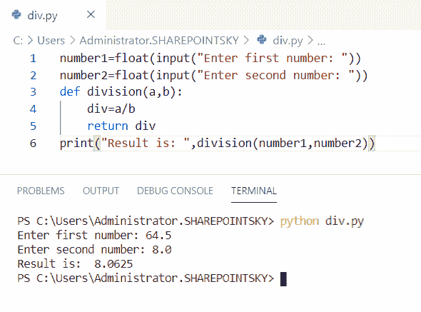

# Python 中如何将两个数相除

> 原文：<https://pythonguides.com/divide-two-numbers-in-python/>

[](https://sharepointsky.teachable.com/p/python-and-machine-learning-training-course)

在这个 [python 教程中，](https://pythonguides.com/python-hello-world-program/)你将学习**如何在 python 中除以两个数**，我们还将检查 **:**

*   Python 程序将两个数相除
*   Python 程序对用户输入的数字进行除法运算
*   使用函数分割数字的 Python 程序
*   Python 程序使用递归分割数字
*   使用类划分数字的 Python 程序
*   Python 程序除复数
*   使用函数将两个浮点数相除程序
*   在 python 中如何用一个数除一个变量

目录

[](#)

*   [Python 程序将两个数相除](#Python_program_to_divide_two_numbers "Python program to divide two numbers")
*   [Python 程序对用户输入的数字进行除法](#Python_program_to_divide_numbers_user_input "Python program to divide numbers user input")
*   [Python 程序使用函数对数字进行除法运算](#Python_program_to_divide_numbers_using_functions "Python program to divide numbers using functions")
*   [Python 程序使用递归分割数字](#Python_program_to_divide_numbers_using_recursion "Python program to divide numbers using recursion")
*   [Python 程序使用类](#Python_program_to_divide_numbers_using_class "Python program to divide numbers using class")来划分数字
*   [Python 程序对复数进行除法运算](#Python_program_to_divide_complex_numbers "Python program to divide complex numbers")
*   [使用函数](#Program_to_divide_two_float_number_using_a_function "Program to divide two float number using a function")将两个浮点数相除的程序
*   [Python 中如何用一个数除一个变量](#How_to_divide_a_variable_by_a_number_in_Python "How to divide a variable by a number in Python")

## Python 程序将两个数相除

这里可以看到**如何用 python 写程序将两个数**相除。

*   在这个例子中，我取了两个数字作为**数字 1 = 64** ，**数字 2 = 8** 。
*   使用运算符“/”来划分数字**。**
*   我已经用 `print(result)` 得到了输出。

示例:

```py
number1 = 64
number2 = 8
result = number1/number2
print(result)
```

下面的截图显示了输出。


Python program to divide two numbers

这个代码，我们可以用 Python 中的**如何除两个数。**

## Python 程序对用户输入的数字进行除法

现在，我们可以看到**如何用 python 编写程序来划分用户输入**的数字。

*   在这个例子中，我使用了`input()`方法。接受用户的输入。
*   **结果=数字 1/数字 2** 用于将两个数相除。
*   我已经用 `print(result)` 得到了输出。

示例:

```py
number1=int(input("Enter the first number: "))
number2=int(input("Enter the second number: "))
result=number1/number2;
print(result)
```

您可以参考下面的输出截图。


Python program to divide numbers user input

这是用 Python 中的用户输入对数字进行**除法的代码。**

## Python 程序使用函数对数字进行除法运算

在这里，我们可以看到**如何用 python 中的函数**编写程序来除数。

*   在这个例子中，我将一个名为 div 的函数定义为 **def div(a，b)** 。
*   该函数返回为 `return a/b.`
*   要被除的值作为函数中的参数传递。

示例:

```py
def div(a,b):
    return a/b
print(div(27,9)) 
```

我们可以将 27 和 9 的除法运算结果定为 3。您可以参考下面的输出截图。


Python program to divide numbers using functions

这就是如何使用 Python 中的函数**除数。**

## Python 程序使用递归分割数字

现在，我们可以看到**如何使用 python 中的递归**编写程序来除数。

*   在这个例子中，我使用了 `input()` 方法。接受用户的输入。
*   我定义了一个函数为 **def Div(number1，number2)** 。
*   使用 if 条件，如果条件为真，则返回为 `return 0` 。如果条件不为真，则返回 **return 1 + Div(数字 1-数字 2，数字 2)** 。
*   为了得到输出，我使用了 **print("result "，Div(number1，number2))** 。

示例:

```py
print("Enter the two Number:")
number1=int(input())
number2=int(input())
def Div(number1,number2):
    if number1<number2:
        return 0
    return 1 + Div(number1-number2, number2)
print("result ",Div(number1,number2))
```

我们可以看到两个数相除的结果。您可以参考下面的输出截图。


Python program to divide numbers using recursion

这是**如何在 Python** 中使用递归除数。

## Python 程序使用类来划分数字

*   在这个例子中，我使用了 `input()` 方法。接受用户的输入。
*   我已经创建了一个**类**,使用一个构造函数来初始化这个类的值
*   我已经创建了一个方法来划分这些数字。
*   对象是为类创建的，用于传递参数。
*   `self` 是用于将属性和方法传递给类的关键字。
*   为了得到输出，我使用了 **print("Result:"，obj.num())** 。

示例:

```py
a=int(input("Enter first number: "))
b=int(input("Enter second number: "))
class div():
    def __init__(self,a,b):
        self.a=a
        self.b=b
    def num(self):
        return self.a/self.b
obj=div(a,b)
print("Result: ",obj.num())
```

下面的截图显示了 24 和 6 的除法是 4 作为输出。


Python program to divide numbers using class

这是使用类划分数字的 **Python 程序。**

## Python 程序对复数进行除法运算

在这里，我们可以看到**如何用 Python 写程序来除复数**。

*   在这个例子中，我取了两个复数为 **a =复数(16，36)** 和 **b =复数(4，6)** 。
*   我已经定义了一个函数为 **def 子复数(a，b)** 。
*   定义的函数返回为 `return a / b` 。
*   为了得到输出，我使用了 **print( "Result is:"，subComplex(a，b))** 。

示例:

```py
a = complex(16, 36) 
b = complex(4, 6) 
def subComplex( a, b): 
	return a / b 
print( "Result is : ", subComplex(a, b)) 
```

我们可以把复数的除法看作输出。您可以参考下面的输出截图。


Python program to divide complex numbers

这是**Python 中的复数如何除法**。

## 使用函数将两个浮点数相除的程序

在这里，我们可以看到**如何使用 python 中的函数**编写一个程序来除两个浮点数。

*   在这个例子中，我使用了 `input()` 方法。接受用户的输入。
*   我已经定义了一个函数为 **def division(a，b)** 。
*   函数返回为 `div=a/b` 。
*   我已经用 **print("Result is:"，division(number1，number2))** 得到输出。

示例:

```py
number1=float(input("Enter first number: "))
number2=float(input("Enter second number: "))
def division(a,b): 
    div=a/b
    return div
print("Result is: ",division(number1,number2))
```

我们可以将两个数相除作为输出。您可以参考下面的输出截图。



Program to divide two float number using a function

这是**如何使用 Python** 中的函数将两个浮点数相除。

## Python 中如何用一个数除一个变量

在这里，我们可以看到**如何用 python 将一个变量除以一个数**。

*   在这个例子中，我取了一个变量为 `variable1 = 100` 。
*   为了将变量除以数字，我使用了**变量=变量 1 / 10** 。这里 10 是我用来除一个变量的数。
*   我已经用 `print(variable)` 得到了输出。

示例:

```py
variable1 = 100
variable = variable1 / 10
print(variable)
```

您可以参考下面的输出截图。


how to divide a variable by a number in python

上面的代码，我们可以用 Python 中的一个变量除以一个数。

您可能会喜欢以下 Python 教程:

*   [如何在 Python Tkinter 中设置背景为图像](https://pythonguides.com/set-background-to-be-an-image-in-python-tkinter/)
*   [如何在 Python 中添加两个变量](https://pythonguides.com/add-two-variables-in-python/)
*   [如何用 Python 将两个数相加](https://pythonguides.com/add-two-numbers-in-python/)
*   [Python 程序反转字符串的例子](https://pythonguides.com/python-program-to-reverse-a-string/)
*   [Python 程序求 n 个数之和并举例](https://pythonguides.com/python-program-to-find-sum-of-n-numbers/)

在本 Python 教程中，我们已经学习了用于将两个数相除的 **Python 程序。此外，我们还讨论了以下主题:**

*   Python 程序将两个数相除
*   Python 程序对用户输入的数字进行除法运算
*   使用函数分割数字的 Python 程序
*   Python 程序使用递归分割数字
*   使用类划分数字的 Python 程序
*   Python 程序除复数
*   使用函数将两个浮点数相除程序
*   在 python 中如何用一个数除一个变量

[Bijay Kumar](https://pythonguides.com/author/fewlines4biju/)

Python 是美国最流行的语言之一。我从事 Python 工作已经有很长时间了，我在与 Tkinter、Pandas、NumPy、Turtle、Django、Matplotlib、Tensorflow、Scipy、Scikit-Learn 等各种库合作方面拥有专业知识。我有与美国、加拿大、英国、澳大利亚、新西兰等国家的各种客户合作的经验。查看我的个人资料。

[enjoysharepoint.com/](https://enjoysharepoint.com/)[](https://www.facebook.com/fewlines4biju "Facebook")[](https://www.linkedin.com/in/fewlines4biju/ "Linkedin")[](https://twitter.com/fewlines4biju "Twitter")