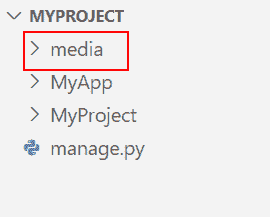
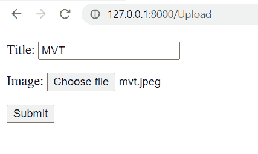

# Python Django 应用程序上传文件

> 原文：<https://pythonguides.com/django-app-upload-files/>

[](https://sharepointsky.teachable.com/p/python-and-machine-learning-training-course)

在本 [Python Django 教程](https://pythonguides.com/how-to-install-django/)中，我们将学习 **Python Django app 上传文件**。我们还会看到与此相关的例子。这些是我们将在本教程中讨论的以下主题。

*   Python Django 应用程序上传文件
*   Python Django 模型字段
*   Python Django 文件上传
*   Python Django 图像上传
*   Python Django 在前端查看上传的文件

目录

[](#)

*   [Python Django app 上传文件](#Python_Django_app_upload_files "Python Django app upload files")
*   [Python Django 模型字段](#Python_Django_model_fields "Python Django model fields")
    *   [图像字段:](#ImageField "ImageField:")
    *   [文件字段](#FileField "FileField")
*   [Python Django 文件上传](#Python_Django_File_Upload "Python Django File Upload")
*   [Python Django 图片上传](#Python_Django_Image_Upload "Python Django Image Upload")
*   [Python Django 查看前端上传的文件](#Python_Django_view_uploaded_files_at_front-end "Python Django  view uploaded files at front-end")

## Python Django app 上传文件

上传意味着将文件从本地计算机发送到远程系统，远程系统存储被传输材料的副本。可以上传图像、视频、电影、音乐、声音、免费软件、共享软件和文本文件。

## Python Django 模型字段

要在 Django 中上传文件，Django 有不同的模型字段。并且，这些字段用于处理不同的文件类型。

**Django 有` `两个模型字段:**

*   图像字段
*   文件字段

让我们逐一讨论每个领域，以获得一个概述:

### 图像字段:

`ImageField` 是一个模型字段，专门接受上传的图像格式。一些命令图像文件格式如下:

*   GIF(。gif)
*   PNG (.png)
*   TIFF (.tif、. TIFF)格式
*   位图(. bmp)
*   JPEG(。jpg，。jpeg)
*   EPS (.eps)文件
*   原始图像文件(orf，.sr，。未加工的。cr，。nef 等)

ImageField 需要 `Pillow` 库。要安装相同的运行，请按照下列步骤操作。

```py
pip install Pillow
```

**图像字段的语法:**

```py
field_name = models.ImageField(upload_to=None, height_field=None, width_field=None, max_length=100, **args)
```

### 文件字段

**文件字段**是用于上传文件的模型字段。一些常见的文件格式有:

*   MP4
*   挽救（saving 的简写）
*   便携文档格式
*   MP3 文件
*   Docx

**文件字段的语法:**

```py
field_name = models.FileField(upload_to=None, max_length=254, **args)
```

另外，检查:Python Django 中的[登录系统](https://pythonguides.com/login-system-in-python-django/)

## Python Django 文件上传

**创建项目和 App:** 首先我们要创建一个项目和 App。因此，使用下面定义的代码来创建它。

```py
**# Project**
django-admin startproject project_name

**# App**
python manage.py startapp app_name
```

在这里，我创建了一个名为 `PythonGuides` 的项目和一个名为 `home` 的应用程序。

**安装 App:** 后，成功创建项目和 App。你必须安装一个应用程序。为此，您必须将我们的应用程序添加到**设置. py** 文件中。

```py
INSTALLED_APPS = [
    'django.contrib.admin',
    'django.contrib.auth',
    'django.contrib.contenttypes',
    'django.contrib.sessions',
    'django.contrib.messages',
    'django.contrib.staticfiles',
    'home',
]
```

**保存上传的文件，修改设置** :现在在 `settings.py` 文件的末尾添加以下几行。

```py
import os
MEDIA_URL = '/media/'
MEDIA_ROOT = os.path.join(BASE_DIR, 'media')
```

*   **媒体 URL:** 此处指定 URL 端点。这是用户可以从浏览器上传文件的 URL。
*   **媒体根**:定义文件保存的根路径。
*   第二行命令 Django 将所有上传的文件保存在**基目录**中，也就是项目目录中一个名为**‘媒体’的文件夹中。**
*   我们必须手动**创建**文件夹，以便所有上传的文件都保存在媒体文件夹中。

**媒体文件夹:** 在项目文件夹中新建一个名为**【媒体】**的文件夹。


Python Django file upload

**项目网址:** 你要添加一个链接到你新创建的应用。将下面的代码片段添加到 PythonGuides 的 `urls.py` 文件中。

```py
from django.contrib import admin
from django.urls import path, include

urlpatterns = [
    path('admin/', admin.site.urls),
    path('',include('home.urls'))
]
```

**App 网址:** 你要添加功能视图的路径。将下面的代码片段添加到主页的 `urls.py` 文件中。

```py
from django.urls import path,include
from . import views
urlpatterns = [
path('UploadFile', views.UploadFile, name='UploadFile'),
]
```

**创建模型:** 在 `models.py` 中，创建一个新的 Django 模型**“博客”**然后添加下面的代码。

```py
from django.db import models

class Blog(models.Model):
    author = models.CharField(max_length=100)
    title = models.CharField(max_length=200)
    file = models.FileField(upload_to='documents/')
```

*   我们创建模型 `CharField` ，它存储上传文件的作者的名字。
*   然后，我们再创建一个 `CharField` ，它存储用户上传的文件的**标题**。
*   然后，我们使用用于用户将要上传的文件的**文件字段**。
*   `upload_to` 选项定义了文件在介质中的保存位置。

**创建表单:** 我们现在将**【博客】**模型导入到 `forms.py` 中，并创建**【博客表单】**模型表单。

```py
from django import forms  
from .models import Blog

class BlogForm(forms.ModelForm):
    class Meta:
        model = Blog
        fields = ['author', 'title', 'file']
```

**创建视图** :实现 `views.py` 文件中的表单。在这里，我们需要上传文件。因此，只需添加**请求。文件**和**请求。岗位**。

**语法如下:**

```py
form = BlogForm(request.POST,request.FILES) 
```

将以下代码片段添加到 `views.py` 文件中。

```py
from django.shortcuts import render, HttpResponse
from .forms import BlogForm

def UploadFile(request):
    if request.method == 'POST':
        form = BlogForm(request.POST,request.FILES)
        if form.is_valid():
            form.save()
            return HttpResponse('The file is saved')
    else:
        form = BlogForm()
        context = {
            'form':form,
        }
    return render(request, 'Upload.html', context) 
```

*   这里，我们创建了 `UploadFile` 函数。
*   然后，我们检查请求方法是否是 `POST` 。
*   在这之后，我们简单地添加一个**请求。文件**连同**请求。将**发布到表单方法中。
*   这里我们在视图函数中使用了 `is_valid()` 方法，因为它返回值 True 和 False。
*   然后，我们返回到 `HttpResponse` 并渲染到 **HTML 模板**。

**创建 HTML 模板:** 现在，创建一个显示表单的**模板。在`upload.html`文件中添加以下代码。**

```py
<!DOCTYPE html>
<html lang="en">

<head>
    <meta charset="UTF-8">
    <meta http-equiv="X-UA-Compatible" content="IE=edge">
    <meta name="viewport" content="width=device-width, initial-scale=1.0">
    <title>Upload Files</title>
</head>

<body>
    <form method='post' enctype="multipart/form-data">
        
        {{form.as_p}}
        <input type="submit" value="Submit">
    </form>
</body>

</html>
```

*   现在，在模板文件中创建 **<表单>** 属性。
*   接下来，添加`enctype = " multipart/form-data "`否则，表单将无法工作。
*   我们还在表单中使用了 `csrf_token` 标签来避免恶意攻击。
*   然后，我们使用 `form.as_p` 标签将 Django 表单呈现为一个段落。

**Django 数据库迁移:** 它是将对模型所做的更改转移到数据库模式的过程。

**在终端运行以下命令:**

```py
**# Make Migartions**

python manage.py makemigrations

**# Migrate**

python manage.py migrate
```

*   **makemigrations:** 用于创建一个迁移文件，其中包含模型的表格模式的代码。
*   **migrate:** 用于根据迁移文件的模式构建表格。

**运行服务器:** 启动服务器，通过定义 URL 为 http://127 . 0 . 0 . 1:8000/UploadFile 来访问表单。

**运行服务器的命令:**

```py
python manage.py runserver
```


Django app upload files


Upload files using Python Django app

在这里， `Marry Smith` 上传 `Docx` 格式的**Django 简介**文件。


File upload using Python Django

当我们点击**提交**按钮时，我们移动到 HTTP 响应**“文件已保存”**。

**查看媒体中的文件:** 可以看到，该文件成功保存在**媒体目录**下的**文件` `目录**中。


View file upload using Python Django

您也可以上传基于 pdf 的文件。让我们来看看。


PDF File Upload App


Django upload file app


Run file upload app

甚至可以上传 `mp4` 格式的文件。


MP4 file upload app using Django


Django app upload mp4 files

阅读:[输出 Python 到 HTML Django](https://pythonguides.com/outputting-python-to-html-django/)

## Python Django 图片上传

在这一节中，我们将学习如何在 Django 中上传图片。

**创建项目和 App:** 首先，也是最重要的，我们必须开发一个项目和一个 App。因此，要创建它，请使用下面定义的代码。

```py
**# Project**
django-admin startproject PythonGuides

**# App**
python manage.py startapp UploadApp
```

在这里，我创建了一个名为 `PythonGuides` 的项目和一个名为 `UploadApp` 的应用。

**安装 App:** 之后，项目和 App 创建成功。现在，您必须安装一个应用程序。您必须将我们的应用程序包含在 `settings.py` 文件中才能执行此操作。

```py
INSTALLED_APPS = [
    'django.contrib.admin',
    'django.contrib.auth',
    'django.contrib.contenttypes',
    'django.contrib.sessions',
    'django.contrib.messages',
    'django.contrib.staticfiles',
    'UploadApp',
]
```

**保存上传的文件，修改设置** :现在在 `settings.py` 文件的末尾添加以下几行。

```py
import os
MEDIA_URL = '/media/'
MEDIA_ROOT = os.path.join(BASE_DIR, 'media')
```

*   首先，导入 `os` 。
*   然后，为了提供媒体文件，我们使用 `MEDIA_URL` 。
*   在这之后，为了指定保存文件的根路径，我们使用 `MEDIA_ROOT` 。

**媒体文件夹:** 在项目文件夹中，新建一个名为**【媒体】**的文件夹。


Python Django image upload

**项目网址:** 你必须包括一个链接到你新开发的应用程序。将以下代码片段添加到 **PythonGuides 的 urls.py** 文件中。

```py
from django.contrib import admin
from django.urls import path, include

urlpatterns = [
    path('admin/', admin.site.urls),
    path('',include('UploadApp.urls'))
]
```

**App 网址:** 必须包含功能视图的路径。将以下代码片段添加到 **UploadApp 的 urls.py** 文件中。

```py
from django.urls import path,include
from . import views
urlpatterns = [
path('UploadImage', views.UploadImage, name='UploadImage'),
]
```

**创建模型:** 在 `models.py` 中，创建一个新的 Django 模型**“课程”**然后添加下面的代码。

```py
from django.db import models

class Course(models.Model):
    author = models.CharField(max_length=100)
    title = models.CharField(max_length=200)
    image = models.ImageField(upload_to='images/')
```

*   这里，我们定义了模型 `CharField` ，它存储了上传图片的**作者**的名字以及图片的**标题**。
*   为了上传图像，我们使用 `ImageField` 。
*   `upload_to` 选项定义图像将保存在媒体目录下的 images 目录下。

**创建表单:** 我们现在将**【课程】**模型导入到 `forms.py` 中，并创建**【课程表单】**模型表单。

```py
from django import forms  
from .models import Course

class CourseForm(forms.ModelForm):
    class Meta:
        model = Course
        fields = ['author', 'title', 'image']
```

**创建视图** :实现 `views.py` 文件中的表单。这里，我们需要上传图像，所以，只需添加**请求。文件**和**请求。岗位**。

```py
from django.shortcuts import render, HttpResponse
from .forms import CourseForm

def UploadImage(request):
    if request.method == 'POST':
        form = CourseForm(request.POST,request.FILES)
        if form.is_valid():
            form.save()
            return HttpResponse('The image saved successfully')
    else:
        form = CourseForm()
        context = {
            'form':form,
        }
    return render(request, 'upload.html', context)
```

*   这里，我们创建了 `UploadImage` 函数，该函数检查请求方法是否为 `POST` 。
*   在这之后，我们简单地添加一个**请求。文件**连同**请求。将**发布到表单方法中。
*   然后，我们在视图函数中使用 `is_valid()` 方法，因为它返回值 True 和 False。
*   最后，我们返回到 `HttpResponse` 并渲染到 **HTML 模板**。

**创建 HTML 模板:** 现在，创建一个显示表单的**模板。在`upload.html`文件中添加以下代码。**

```py
<!DOCTYPE html>
<html lang="en">

<head>
    <meta charset="UTF-8">
    <meta http-equiv="X-UA-Compatible" content="IE=edge">
    <meta name="viewport" content="width=device-width, initial-scale=1.0">
    <title>Upload Files</title>
</head>

<body>
    <form method='post' enctype="multipart/form-data">
        
        {{form.as_p}}
        <input type="submit" value="Submit">
    </form>
</body>

</html>
```

*   现在，在模板文件中创建 **<表单>** 属性。
*   接下来，添加`enctype = " multipart/form-data "`否则，表单将无法工作。
*   我们还在表单中使用了 `csrf_token` 标签来避免恶意攻击。
*   然后，我们使用 `form.as_p` 标签将 Django 表单呈现为一个段落。

**Django 数据库迁移:** 在终端运行以下命令:

```py
**# Make Migartions**

python manage.py makemigrations

**# Migrate**

python manage.py migrate
```

*   **makemigrations:** 生成具有模型模式的迁移文件。
*   **迁移:**根据迁移文件的模式建立表格。

**运行服务器:** 启动服务器，通过定义 URL 为 http://127 . 0 . 0 . 1:8000/UploadImage 来访问表单。

**运行服务器的命令:**

```py
python manage.py runserver
```


Preview Form in Browser

**例#** 1

在这个例子中，我们上传了一个 png 格式的图片。


App to upload image using Python Django

当我们点击**提交**按钮时，HTTP 响应显示。


Django upload image app

在**媒体**目录下的**图像**目录中查看上传的文件。


Django app upload png images

**例 2**

在这个例子中，我们上传了一个 jpeg 格式的图像。


Upload image using Python Django

在**媒体**目录下的**图像**目录中查看上传的 jpeg 文件。


View image uploaded using Python Django

**例 3**

在这个例子中，我们上传了一张 gif 格式的图片。


Upload image using Python Django app


Django app upload gif

阅读: [Python Django vs ReactJS](https://pythonguides.com/django-vs-reactjs/)

## Python Django 查看前端上传的文件

在本节中，我们将学习如何在浏览器上查看上传的图像。

**创建项目和 App:** 在终端中键入以下命令。

```py
**# Project**
django-admin startproject MyProject

**# App**
python manage.py startapp MyApp
```

**安装 App:** 现在，你必须安装一个应用。并添加到 `settings.py` 文件中。

```py
INSTALLED_APPS = [
    'django.contrib.admin',
    'django.contrib.auth',
    'django.contrib.contenttypes',
    'django.contrib.sessions',
    'django.contrib.messages',
    'django.contrib.staticfiles',
    'MyApp,
]
```

**保存上传的文件，修改设置** :现在在 `settings.py` 文件的末尾添加以下几行。

```py
import os
MEDIA_URL = '/media/'
MEDIA_ROOT = os.path.join(BASE_DIR, 'media')
```

**媒体文件夹:** 在项目文件夹中，新建一个名为**【媒体】**的文件夹。



Python Django Image upload view on browser

**项目 URL:**在 **MyProject 的 urls.py** 文件中添加以下代码。

```py
from django.contrib import admin
from django.urls import path, include
from django.conf import settings  
from django.conf.urls.static import static  

urlpatterns = [
    path('admin/', admin.site.urls),
    path('',include('MyApp.urls'))
]

if settings.DEBUG:  
        urlpatterns += static(settings.MEDIA_URL,document_root=settings.MEDIA_ROOT)
```

*   在这里，我们通过添加**静态(设置)来提供用户在开发期间从 `MEDIA_ROOT` 上传的文件。MEDIA_URL，document _ root =设置。【MEDIA _ ROOT)。**
*   这里， `MEDIA_URL` 保存为**‘MEDIA’**， `document_root` 为上传文件在 MEDIA 文件夹中的**位置**。
*   但是，只有当 `DEBUG` 设置为 `True` 并且设置中指定的 `URL` 为本地时，它才起作用。

**App 网址:** 在 **MyApp 的 urls.py** 文件中添加以下代码。

```py
from django.urls import path
from . import views
urlpatterns = [
path('Upload', views.Upload, name='Upload'),
]
```

**创建模型:** 在 `models.py` 文件中添加以下代码。

```py
from django.db import models

class UploadImage(models.Model):
    title = models.CharField(max_length=200)
    image = models.ImageField(upload_to='images/')
```

**创建表单:** 在 `forms.py` 文件中添加以下代码。

```py
from django import forms  
from .models import UploadImage

class UploadImageForm(forms.ModelForm):
    class Meta:
        model = UploadImage
        fields = ['title', 'image']
```

**创建视图:** 在 `views.py` 文件中添加以下代码。

```py
from django.shortcuts import render
from .forms import UploadImageForm

def Upload(request):
    if request.method == 'POST':
        form = UploadImageForm(request.POST,request.FILES)
        if form.is_valid():
            form.save()
            img_object = form.instance
            return render(request, 'ImageUpload.html', {'form': form, 'img_obj': img_object})
    else:
        form = UploadImageForm()
        context = {
            'form':form,
        }
    return render(request, 'ImageUpload.html', context) 
```

*   我们还创建图像对象，并将它们呈现到 HTML 模板中。

**创建模板** :在【upload.html】文件中添加以下代码。

```py
<!DOCTYPE html>
<html lang="en">

<head>
    <meta charset="UTF-8">
    <meta http-equiv="X-UA-Compatible" content="IE=edge">
    <meta name="viewport" content="width=device-width, initial-scale=1.0">
    <title>Upload Files</title>
</head>

<body>
    <form method='post' enctype="multipart/form-data">
        
        {{form.as_p}}
        <input type="submit" value="Submit">
    </form>
      
        <h3>Succesfully uploaded :</h3>  
          
      
</body>

</html>
```

*   在 HTML 模板中，我们使用 **if 标签**来检查一个图像对象是否在浏览器中显示。

**迁移数据库:** 在终端中运行以下命令。

```py
**# Make Migartions**

python manage.py makemigrations

**# Migrate**

python manage.py migrate
```

**运行服务器:** 在终端中运行以下命令。

```py
python manage.py runserver
```


Form View



view uploaded files at frontend using Python Django

当我们点击**提交**按钮时。输出如下所示。


Django view uploaded files at frontend example

从这里，我们得出结论，我们可以从浏览器前端查看上传的文件。

另外，看看更多的 Python Django 教程。

*   [在 Django 中运行 Python 脚本](https://pythonguides.com/run-python-script-in-django/)
*   [Python Django 随机数](https://pythonguides.com/django-random-number/)
*   [Python Django 连接字符串](https://pythonguides.com/django-concatenate-string/)
*   [Python Django 设置时区](https://pythonguides.com/python-django-set-timezone/)
*   [Python 改 Django 版本](https://pythonguides.com/python-change-django-version/)
*   [Django 模板中的 If 语句](https://pythonguides.com/if-statement-in-django-template/)
*   [Python Django 表单验证](https://pythonguides.com/django-form-validation/)
*   [Python Django MySQL CRUD](https://pythonguides.com/python-django-mysql-crud/)
*   [Django 联系表，带有基于类的视图](https://pythonguides.com/django-contact-form-with-class-based-views/)

在这个 Python Django 教程中，我们讨论了 Python Django 应用程序上传文件。此外，讨论以下主题列表。

*   Python Django 应用程序上传文件
*   Python Django 模型字段
*   Python Django 文件上传
*   Python Django 图像上传
*   Python Django 在前端查看上传的文件

[Bijay Kumar](https://pythonguides.com/author/fewlines4biju/)

Python 是美国最流行的语言之一。我从事 Python 工作已经有很长时间了，我在与 Tkinter、Pandas、NumPy、Turtle、Django、Matplotlib、Tensorflow、Scipy、Scikit-Learn 等各种库合作方面拥有专业知识。我有与美国、加拿大、英国、澳大利亚、新西兰等国家的各种客户合作的经验。查看我的个人资料。

[enjoysharepoint.com/](https://enjoysharepoint.com/)[](https://www.facebook.com/fewlines4biju "Facebook")[](https://www.linkedin.com/in/fewlines4biju/ "Linkedin")[](https://twitter.com/fewlines4biju "Twitter")****