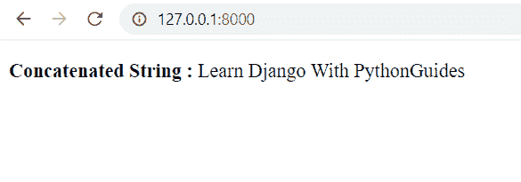
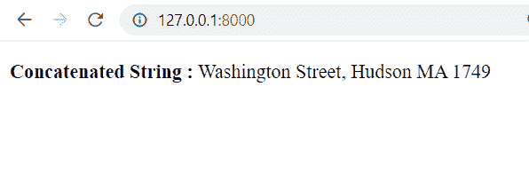

# Python Django 连接字符串

> 原文：<https://pythonguides.com/django-concatenate-string/>

[](https://sharepointsky.teachable.com/p/python-and-machine-learning-training-course)

在这个 [Python Django 教程](https://pythonguides.com/how-to-install-django/)中，我们将学习 **Python Django 连接字符串**的实现。这些是我们将在本教程中讨论的主题。

*   Python Django 连接多行字符串
*   Django 连接字符串基本命令
*   Django 连接字符串模板
*   Django 连接视图中的字符串
*   Django 连接字符串和 int 基本命令
*   Django 连接字符串和整型模板
*   Django 连接 string 和 int
*   Django 连接字符串模型
*   Django 模板过滤器连接字符串和整数

目录

[](#)

*   [Python Django 连接多行字符串](#Python_Django_concatenate_multiline_string "Python Django concatenate multiline string")
*   [Django 连接字符串基本命令](#Django_concatenate_string_basic_commands "Django concatenate string basic commands")
*   [Django 连接字符串模板](#Django_concatenate_string_template "Django concatenate string template")
*   [Django 连接视图中的字符串](#Django_concatenate_string_in_views "Django concatenate string in views")
*   [Django 连接字符串和 int 基本命令](#Django_concatenate_string_and_int_basic_commands "Django concatenate string and int basic commands")
*   [Django 连接字符串和 int 模板](#Django_concatenate_string_and_int_template "Django concatenate string and int template")
*   Django 连接 string 和 int
*   [Django 连接字符串模型](#Django_concatenate_string_model "Django concatenate string model")
*   [Django 模板过滤器连接 string 和 int](#Django_template_filter_concatenate_string_and_int "Django template filter concatenate string and int")

## Python Django 连接多行字符串

字符串连接是将两个字符串连接在一起的过程。

*   有多种方法来连接字符串。
    *   通过使用+运算符
    *   通过使用 join()函数
    *   通过使用 **%** 运算符
    *   通过使用**格式()**功能

*   连接 string 和 int 的多种方法。
    *   通过使用 `str()` 函数
    *   通过使用 **%** 运算符
    *   通过使用**格式()**函数
    *   通过使用 **f 字符串**

## Django 连接字符串基本命令

在本节中，我们将学习连接字符串的基本命令。

**创建项目:** 首先，我们需要创建一个 Django 项目。为此，请在终端中键入以下命令。

```py
django-admin startproject PythonGuides
```

*   在这里，我们创建了一个名为 `PythonGuides` 的 Django 项目。

**创建 APP:** 然后，我们来学习创建 Django App。在终端中键入以下命令。

```py
python manage.py startapp home
```

*   这里，我们创建了一个名为 `home` 的 Django 应用程序。

**安装 APP:** 在 `settings.py` 文件中，我们必须包含上面创建的 APP。

```py
INSTALLED_APPS = [
    'django.contrib.admin',
    'django.contrib.auth',
    'django.contrib.contenttypes',
    'django.contrib.sessions',
    'django.contrib.messages',
    'django.contrib.staticfiles',
    'home',
]
```

**创建模板:** 然后在项目根目录下创建**模板**文件夹。我们将在文件夹中创建 HTML 文件。


TEMPLATES

**添加模板:** 我们还需要在 `settings.py` 文件中添加“**模板` `目录**”。


DIRS

**项目 URL:**在 PythonGuides `urls.py` 文件中添加以下代码。

```py
from django.contrib import admin
from django.urls import path, include

urlpatterns = [
    path('admin/', admin.site.urls),
    path('', include('home.urls'))
]
```

**APP 网址:** 在首页 `urls.py` 文件中添加以下代码。

```py
from django.urls import path
from . import views
urlpatterns = [
path('', views.ConcatForm, name='ConcatForm'),
]
```

**创建表单:** 现在，我们创建一个表单。以及下面的代码片段到**首页** app 的 `forms.py` 文件中。

```py
from django import forms

class StringConcat(forms.Form):
    String_1 = forms.CharField(label='String 1')
    String_2 = forms.CharField(label='String 2')
```

*   这里，我们用两个 `Charfiel` d 创建了一个 `StringConcat` 类

阅读: [Python 过滤器不在 Django 中](https://pythonguides.com/filter-not-in-django/)

## Django 连接字符串模板

在这一节中，我们将学习如何创建将在视图中呈现的 HTML 文件。

**form.html:** 将下面的代码添加到【form.html】文件中。

```py
<!DOCTYPE html>  
<html lang="en">  
<head>  
    <meta charset="UTF-8">  
    <title>Index</title>  
</head>  
<body>  
<form method="POST" class="post-form" enctype="multipart/form-data">  
          
        {{ form.as_p }}  
        <button type="submit" class="save btn btn-default">Submit</button>  
</form>  
</body>  
</html> 
```

*   我们使用**表单**标签创建表单。
*   在这里，我们使用 `csrf_token` 标记是为了避免恶意攻击。
*   然后，我们使用 `form.as_p` 标签将 Django 表单呈现为一个段落。

**index.html:** 将以下代码添加到【index.html】文件中。

```py
<!DOCTYPE html>
<html lang="en">
<head>
    <meta charset="UTF-8">
    <meta http-equiv="X-UA-Compatible" content="IE=edge">
    <meta name="viewport" content="width=device-width, initial-scale=1.0">
    <title>Document</title>
</head>
<body>
    <p>
       <b>Concatenated String : </b> {{FString}}
    </p>
</body>
</html>
```

另外，检查:[将 Python 输出到 html Django](https://pythonguides.com/outputting-python-to-html-django/)

## Django 连接视图中的字符串

在这一节中，我们将学习创建视图来连接字符串。

**例#1** 通过使用+运算符。

**创建视图:** 在 `views.py` 文件中添加以下代码。

```py
from django.shortcuts import redirect, render
from home.forms import StringConcat

def ConcatForm(request):  
    if request.method == "POST":  
        form = StringConcat(request.POST)  
        if form.is_valid():  
            String1 = form.cleaned_data['String_1']
            String2 = form.cleaned_data['String_2']
            FString = String1 + " " + String2
            return render(request, 'index.html', {'FString':FString})
    else:  
        form = StringConcat()  
    return render(request,'form.html',{'form':form}) 
```

*   这里，变量 `String1` 和 `String2` 使用 `+` 运算符组合，并存储在另一个变量 `FString` 中。

**运行服务器:** 启动服务器，通过定义 URL 为 http://127.0.0.1:8000 来访问表单


Add String


Concatenated String using + operator

**例#2** 通过使用 `join()` 函数。

**创建视图:** 在 `views.py` 文件中添加以下代码。

```py
from django.shortcuts import redirect, render
from home.forms import StringConcat

def ConcatForm(request):  
    if request.method == "POST":  
        form = StringConcat(request.POST)  
        if form.is_valid():  
            String1 = form.cleaned_data['String_1']
            String2 = form.cleaned_data['String_2']
            FString = " ".join([String1, String2])
            return render(request, 'index.html', {'FString':FString})
    else:  
        form = StringConcat()  
    return render(request,'form.html',{'form':form}) 
```

*   这里，使用 `join()` 方法将变量 `String1` 和 `String2` 组合起来，并将组合后的字符串存储在另一个变量 `FString` 中，该变量由空格分隔。
*   `join()` 方法只接受**列表**作为它的参数。

**运行服务器:** 启动服务器，通过定义 URL 为 http://127.0.0.1:8000 来访问表单


Enter String



Concatenated String using join() method

**例#3** 使用 **%** 运算符

**创建视图:** 在 `views.py` 文件中添加以下代码。

```py
from django.shortcuts import redirect, render
from home.forms import StringConcat

def ConcatForm(request):  
    if request.method == "POST":  
        form = StringConcat(request.POST)  
        if form.is_valid():  
            String1 = form.cleaned_data['String_1']
            String2 = form.cleaned_data['String_2']
            FString = ("%s %s" %(String1, String2))
            return render(request, 'index.html', {'FString':FString})
    else:  
        form = StringConcat()  
    return render(request,'form.html',{'form':form}) 
```

*   这里，变量 `String1` 和 `String2` 使用 **%** 运算符组合，并将组合后的字符串存储在另一个变量 `FString` 中。
*   **%** 操作符可用于字符串格式化和字符串连接。


concatenate string in Django


Concatenated String using % operator

**例#** 4 通过使用**格式()**函数

**创建视图:** 在 `views.py` 文件中添加以下代码。

```py
from django.shortcuts import redirect, render
from home.forms import StringConcat

def ConcatForm(request):  
    if request.method == "POST":  
        form = StringConcat(request.POST)  
        if form.is_valid():  
            String1 = form.cleaned_data['String_1']
            String2 = form.cleaned_data['String_2']
            FString = "{} {}".format(String1, String2)
            return render(request, 'index.html', {'FString':FString})
    else:  
        form = StringConcat()  
    return render(request,'form.html',{'form':form}) 
```

*   这里，变量 `String1` 和 `String2` 使用 `format()` 函数组合，并将组合后的字符串存储在另一个变量 `FString` 中。
*   `format()` 函数使用位置格式连接字符串中的元素。
*   使用**花括号{}** 设置字符串的位置。


Python Django concatenate string in views


Concatenated String using format() function

阅读: [Python Django vs ReactJS](https://pythonguides.com/django-vs-reactjs/)

## Django 连接字符串和 int 基本命令

在本节中，我们将学习创建一个项目的基本命令和一个在 string 和 int 上执行串联的应用程序。

**创建项目:** 首先，我们创建一个名为**‘my PROJECT’**的 Django 项目。

```py
djnago-admin startproject MyProject
```

**创建 APP:** 然后，我们创建一个 Django App，命名为**‘MyApp’**。

```py
python manage.py startapp MyApp
```

**安装 APP:** 现在，将上面创建的 APP 包含在 `settings.py` 文件中。

```py
INSTALLED_APPS = [
    'django.contrib.admin',
    'django.contrib.auth',
    'django.contrib.contenttypes',
    'django.contrib.sessions',
    'django.contrib.messages',
    'django.contrib.staticfiles',
    'MyApp',
]
```

**创建模板:** 在项目根目录下创建一个 TEMPLATES 文件夹来添加 HTML 文件。

**添加模板:** 将上面创建的文件夹添加到 `settings.py` 文件中。

```py
'DIRS':['Templates']
```

**项目 URL:**在 MyProject `urls.py` 文件中添加以下代码。

```py
from django.contrib import admin
from django.urls import path,include

urlpatterns = [
    path('admin/', admin.site.urls),
    path('', include('MyApp.urls'))
]
```

**APP 网址:** 在 MyApp `urls.py` 文件中添加以下代码。

```py
from django.urls import path
from . import views
urlpatterns = [
path('', views.ConcatString, name='ConcatString'),
]
```

**创建表单:** 现在，创建一个表单来接受用户的输入。

```py
from django import forms

class StringConcatForm(forms.Form):
    Char_String = forms.CharField(label='Character String')
    Int_String = forms.IntegerField(label='Integer String')
```

*   在这里，我们创建了一个 `StringConcatForm` 类，带有一个 `Charfield` 和一个 `IntegerField` 。

读取 [Python Django 四舍五入到两位小数](https://pythonguides.com/django-round-to-two-decimal-places/)

## Django 连接字符串和 int 模板

在这一节中，我们将学习创建 HTML 文件，这些文件在视图中呈现以连接 string 和 int。

**app.html:** 在【app.html】文件中添加以下代码。

```py
<!DOCTYPE html>  
<html lang="en">  
<head>  
    <meta charset="UTF-8">  
    <title>App</title>  
</head>  
<body>  
<form method="POST" class="post-form" enctype="multipart/form-data">  
          
        {{ form.as_p }}  
        <button type="submit" class="save btn btn-default">Submit</button>  
</form>  
</body>  
</html> 
```

*   **表单标签**用于生成表单。
*   为了避免恶意攻击，我们在表单中使用了 **csrf_token 标签**。
*   然后， **form.as_p 标签**用于将 Django 表单呈现为一个段落。

**home.html:** 将下面的代码添加到【home.html】的文件中。

```py
<!DOCTYPE html>
<html lang="en">
<head>
    <meta charset="UTF-8">
    <meta http-equiv="X-UA-Compatible" content="IE=edge">
    <meta name="viewport" content="width=device-width, initial-scale=1.0">
    <title>String</title>
</head>
<body>
    <p>
       <b>Concatenated String : </b> {{FullString}}
    </p>
</body>
</html>
```

*   这个 HTML 文件用于呈现串联的字符串。

阅读: [Python Django 设置时区](https://pythonguides.com/python-django-set-timezone/)

## Django 连接 string 和 int

在这一节中，我们将学习创建视图来连接 string 和 int。

**例#1** 通过使用 `str()` 函数。

**创建视图:** 在 `views.py` 文件中添加以下代码。

```py
from django.shortcuts import redirect, render
from MyApp.forms import StringConcatForm

def ConcatString(request):  
    if request.method == "POST":  
        form = StringConcatForm(request.POST)  
        if form.is_valid():  
            CharString = form.cleaned_data['Char_String']
            IntString = form.cleaned_data['Int_String']
            FullString = CharString + str(IntString)
            return render(request, 'home.html', {'FullString':FullString})
    else:  
        form = StringConcatForm()  
    return render(request,'app.html',{'form':form}) 
```

*   这里，使用 `str()` 函数将一个字符串和 int 类型变量连接起来。


Django concatenate string and int


Concatenate string and int using str() function

**例#** 2 通过使用 **%** 运算符。

**创建视图:** 在 `views.py` 文件中添加以下代码。

```py
from django.shortcuts import redirect, render
from MyApp.forms import StringConcatForm

def ConcatString(request):  
    if request.method == "POST":  
        form = StringConcatForm(request.POST)  
        if form.is_valid():  
            CharString = form.cleaned_data['Char_String']
            IntString = form.cleaned_data['Int_String']
            FullString = ("%s %s" %(CharString, IntString))
            return render(request, 'home.html', {'FullString':FullString})
    else:  
        form = StringConcatForm()  
    return render(request,'app.html',{'form':form}) 
```

*   这里，一个字符串和 int 类型变量使用%运算符连接在一起。


Django concatenate string and int



Django concatenate string and int using the % operator

**例#** 3 使用**格式()**函数。

**创建视图:** 在 `views.py` 文件中添加以下代码。

```py
from django.shortcuts import redirect, render
from MyApp.forms import StringConcatForm

def ConcatString(request):  
    if request.method == "POST":  
        form = StringConcatForm(request.POST)  
        if form.is_valid():  
            CharString = form.cleaned_data['Char_String']
            IntString = form.cleaned_data['Int_String']
            FullString = "{} {}".format(CharString, IntString)
            return render(request, 'home.html', {'FullString':FullString})
    else:  
        form = StringConcatForm()  
    return render(request,'app.html',{'form':form}) 
```

*   这里，使用 `format()` 函数将一个字符串和 int 类型变量连接起来。
*   `format()` 的另一个优点是，它消除了在连接输入之前将整数转换成字符串的需要。


Django concatenate string and int


Django concatenate string and int using the format() function

**例#** 4 通过使用 `f` 琴弦。

**创建视图:** 在 `views.py` 文件中添加以下代码。

```py
from django.shortcuts import redirect, render
from MyApp.forms import StringConcatForm

def ConcatString(request):  
    if request.method == "POST":  
        form = StringConcatForm(request.POST)  
        if form.is_valid():  
            CharString = form.cleaned_data['Char_String']
            IntString = form.cleaned_data['Int_String']
            FullString = f"{CharString} {IntString}"
            return render(request, 'home.html', {'FullString':FullString})
    else:  
        form = StringConcatForm()  
    return render(request,'app.html',{'form':form}) 
```

*   这里，使用 `f` 字符串连接一个字符串和 int 类型变量。


Concatenate string and int using Django


Concatenate string and int using f string

阅读:[Django 模板中的 If 语句](https://pythonguides.com/if-statement-in-django-template/)

## Django 连接字符串模型

在这一节中，我们将学习使用 Django 模型连接字符串。

**创建项目:** 首先，我们创建一个名为**【员工】**的 Django 项目。

```py
djnago-admin startproject Employee
```

**创建 APP:** 然后，我们创建一个 Django App，命名为**【记录】**。

```py
python manage.py startapp Records
```

**安装 APP:** 现在，将上面创建的 APP 包含在 `settings.py` 文件中。

```py
INSTALLED_APPS = [
    'django.contrib.admin',
    'django.contrib.auth',
    'django.contrib.contenttypes',
    'django.contrib.sessions',
    'django.contrib.messages',
    'django.contrib.staticfiles',
    'Records',
]
```

**创建模板:** 在项目根目录下创建一个 TEMPLATES 文件夹来添加 HTML 文件。


Django concatenate string model

**添加模板:** 将上面创建的文件夹添加到 `settings.py` 文件中。

```py
'DIRS':['Templates']
```

**项目 URL:**在 MyProject `urls.py` 文件中添加以下代码。

```py
from django.contrib import admin
from django.urls import path,include

urlpatterns = [
    path('admin/', admin.site.urls),
    path('', include('Records.urls'))
]
```

**APP 网址:** 在 MyApp `urls.py` 文件中添加以下代码。

```py
from django.urls import path
from . import views
urlpatterns = [
path('', views.EmpRecord, name='EmpRecord'),
]
```

**创建模型:** 在 `models.py` 文件中添加以下代码。

```py
from django.db import models

class EmpRecords(models.Model):
    first_name=models.CharField(max_length=200)
    last_name=models.CharField(max_length=200)
    email=models.EmailField()
    class Meta:
        db_table = "EmpRecords"
```

*   在这里，我们创建了不同的属性，如**名**、**姓**和**电子邮件**，它们具有特定的数据类型，表示数据库中的列。
*   为了更改表的默认名称，我们在类**元**中传递了新表 `db_table` 。

**创建表单:** 在 `forms.py` 文件中添加以下代码。

```py
from django import forms  
from .models import EmpRecords

class EmpRecordsForm(forms.ModelForm):  
    class Meta:  
        model = EmpRecords 
        fields = "__all__" 
```

**创建视图:** 在 `views.py` 文件中添加以下代码。

```py
from django.shortcuts import render
from Records.forms import EmpRecordsForm
from .models import EmpRecords

def EmpRecord(request):  
    if request.method == "POST":  
        form = EmpRecordsForm(request.POST)  
        if form.is_valid():  
            First_Name = form.cleaned_data['first_name']
            Last_Name = form.cleaned_data['last_name']
            Email = form.cleaned_data['email']
            data = EmpRecords(first_name=First_Name, last_name=Last_Name, email=Email )
            data.save()
            FullName = First_Name + " " + Last_Name
            return render(request, 'index.html', {'FullName':FullName})
    else:  
        form = EmpRecordsForm()  
    return render(request,'records.html',{'form':form}) 
```

*   这里，变量**名**和**姓**使用+运算符组合，并存储在另一个变量**全名**中。
*   我们还将记录保存在管理数据库中。

**运行服务器:** 启动服务器，通过定义 URL 为 http://127.0.0.1:8000 来访问表单。


Concatenate string model using Django


Concatenate string using model


Admin Panel Record

Read: [Django 从 POST 请求中获取所有数据](https://pythonguides.com/django-get-all-data-from-post-request/)

## Django 模板过滤器连接 string 和 int

在这一节中，我们将学习使用内置的模板过滤器连接 string 和 int。

`"add"` 过滤器用于将参数添加到值中。如果失败，它会将这些值相加。

**语法:**

```py
{{ first|add:second }}
```

让我们看一个使用添加模板过滤器连接 string 和 int 的例子。

执行前面几节中概述的步骤。

*   Django 连接字符串和 int 基本命令

之后，继续下面的步骤。

**创建表单:** 将以下代码添加到 `forms.py` 文件中。

```py
from django import forms

class StringConcatForm(forms.Form):
    Char_String = forms.CharField(label='Character String')
    Int_String = forms.CharField(label='Integer String')
```

**创建视图:** 将以下代码添加到 views.py 文件中。

```py
from django.shortcuts import render
from MyApp.forms import StringConcatForm

def ConcatString(request):  
    if request.method == "POST":  
        form = StringConcatForm(request.POST)  
        if form.is_valid():  
            CharString = form.cleaned_data['Char_String']
            IntString = form.cleaned_data['Int_String']
            context = {
                'CharString':CharString,
                'IntString' :IntString
            }
            return render(request, 'index.html',context)
    else:  
        form = StringConcatForm()  
    return render(request,'app.html',{'form':form}) 
```

**app.html:** 将以下代码添加到 app.html 文件中。

```py
<!DOCTYPE html>  
<html lang="en">  
<head>  
    <meta charset="UTF-8">  
    <title>App</title>  
</head>  
<body>  
<form method="POST" class="post-form" enctype="multipart/form-data">  
          
        {{ form.as_p }}  
        <button type="submit" class="save btn btn-default">Submit</button>  
</form>  
</body>  
</html>
```

**index.html:** 将以下代码添加到【index.html】文件中。

```py
<!DOCTYPE html>
<html lang="en">
<head>
    <meta charset="UTF-8">
    <meta http-equiv="X-UA-Compatible" content="IE=edge">
    <meta name="viewport" content="width=device-width, initial-scale=1.0">
    <title>String</title>
</head>
<body>
    <p>
       <b>Concatenated String : </b> {{CharString|add:" "|add:IntString}}
    </p>
</body>
</html>
```

*   这里，我们使用**添加**过滤器连接**字符串**和**字符串**变量。

**运行服务器:** 启动服务器，通过定义 URL 为 http://127.0.0.1:8000 来访问表单。


Django template filter concatenate string and int


Python Django concatenate add filter string and int

你可能也喜欢阅读下面的 Django 教程。

*   [获取 Django 中的 URL 参数](https://pythonguides.com/get-url-parameters-in-django/)
*   [如何获取 Django 的当前时间](https://pythonguides.com/how-to-get-current-time-in-django/)
*   [如何在 Django 中创建模型](https://pythonguides.com/create-model-in-django/)
*   [Python Django 获取管理员密码](https://pythonguides.com/python-django-get-admin-password/)

在本 Python Django 教程中，我们已经讨论了 **Python Django 连接多行字符串**，并且我们还讨论了本教程中的以下主题。

*   Python Django 连接多行字符串
*   Django 连接字符串基本命令
*   Django 连接字符串模板
*   Django 连接视图中的字符串
*   Django 连接字符串和 int 基本命令
*   Django 连接字符串和整型模板
*   Django 连接 string 和 int
*   Django 连接字符串模型
*   Django 模板过滤器连接字符串和整数

[Bijay Kumar](https://pythonguides.com/author/fewlines4biju/)

Python 是美国最流行的语言之一。我从事 Python 工作已经有很长时间了，我在与 Tkinter、Pandas、NumPy、Turtle、Django、Matplotlib、Tensorflow、Scipy、Scikit-Learn 等各种库合作方面拥有专业知识。我有与美国、加拿大、英国、澳大利亚、新西兰等国家的各种客户合作的经验。查看我的个人资料。

[enjoysharepoint.com/](https://enjoysharepoint.com/)[](https://www.facebook.com/fewlines4biju "Facebook")[](https://www.linkedin.com/in/fewlines4biju/ "Linkedin")[](https://twitter.com/fewlines4biju "Twitter")