# 使用 PostgreSQL 的 Django CRUD 示例

> 原文：<https://pythonguides.com/django-crud-example-with-postgresql/>

[](https://sharepointsky.teachable.com/p/python-and-machine-learning-training-course)

在本 [Python Django 教程](https://pythonguides.com/how-to-install-django/)中，我们将学习 **Django CRUD 示例与** `PostgreSQL` 。这些是我们将在本教程中讨论的主题。

*   Django PostgreSQL CRUD
*   用 PostgreSQL 设置 Django CRUD 项目
*   Django CRUD 用 PostgreSQL 创建 url 模式
*   Djnago CRUD 用 PostgreSQL 创建视图
*   Django CRUD 用 PostgreSQL 创建模型
*   使用 PostgreSQL 的 Django CRUD 注册模型
*   用 PostgreSQL 实现 Django CRUD 插入视图函数
*   Django CRUD 使用 PostgreSQL 插入 HTML 页面
*   Django CRUD 使用 PostgreSQL 显示视图函数
*   Django CRUD 用 PostgreSQL 显示 HTML 页面
*   用 PostgreSQL 实现 Django CRUD 编辑视图功能
*   用 PostgreSQL 编辑 HTML 页面
*   用 PostgreSQL 实现 Djnago CRUD remove 视图函数
*   Django CRUD 用 PostgreSQL 删除 HTML 页面
*   使用 PostgreSQL 的 Django CRUD 基本命令
*   使用 PostgreSQL 的 Django CRUD 示例

目录

[](#)

*   [Django PostgreSQL CRUD](#Django_PostgreSQL_CRUD "Django PostgreSQL CRUD")
*   [用 PostgreSQL 设置 Django CRUD 项目](#Django_CRUD_project_setup_with_PostgreSQL "Django CRUD project setup with PostgreSQL")
*   [Django CRUD 用 PostgreSQL 创建 url 模式](#Django_CRUD_create_url_pattern_with_PostgreSQL "Django CRUD create url pattern with PostgreSQL")
*   [Djnago CRUD 用 PostgreSQL 创建视图](#Djnago_CRUD_create_views_with_PostgreSQL "Djnago CRUD create views with PostgreSQL")
*   [Django CRUD 用 PostgreSQL 创建模型](#Django_CRUD_create_model_with_PostgreSQL "Django CRUD create model with PostgreSQL")
*   [使用 PostgreSQL 的 Django CRUD 注册模型](#Django_CRUD_register_model_with_PostgreSQL "Django CRUD register model with PostgreSQL")
*   [Django CRUD 用 PostgreSQL 插入视图函数](#Django_CRUD_insert_view_function_with_PostgreSQL "Django CRUD insert view function with PostgreSQL")
*   [Django CRUD 用 PostgreSQL 插入 HTML 页面](#Django_CRUD_insert_HTML_page_with_PostgreSQL "Django CRUD insert HTML page with PostgreSQL")
*   [Django CRUD 用 PostgreSQL 显示视图函数](#Django_CRUD_show_view_function_with_PostgreSQL "Django CRUD show view function with PostgreSQL")
*   [Django CRUD 用 PostgreSQL 显示 HTML 页面](#Django_CRUD_show_HTML_page_with_PostgreSQL "Django CRUD show HTML page with PostgreSQL")
*   [Django CRUD 用 PostgreSQL 编辑视图函数](#Django_CRUD_edit_view_function_with_PostgreSQL "Django CRUD edit view function with PostgreSQL")
*   [Django CRUD 用 PostgreSQL 编辑 HTML 页面](#Django_CRUD_edit_HTML_page_with_PostgreSQL "Django CRUD edit HTML page with PostgreSQL")
*   [Djnago CRUD remove view 函数与 PostgreSQL](#Djnago_CRUD_remove_view_function_with_PostgreSQL "Djnago CRUD remove view function with PostgreSQL")
*   [Django CRUD 用 PostgreSQL 删除 HTML 页面](#Django_CRUD_remove_HTML_page_with_PostgreSQL "Django CRUD remove HTML page with PostgreSQL")
*   使用 PostgreSQL 的 Django CRUD 基本命令
*   [使用 PostgreSQL 的 Django CRUD 示例](#Django_CRUD_example_with_PostgreSQL "Django CRUD example with PostgreSQL")

## Django PostgreSQL CRUD

在本节中，我们将学习使用 PostgreSQL 数据库的 CRUD 操作。

Django 是一个 MVT 的 web 框架架构。通过使用 Django 框架，我们可以执行 `CRUD` 操作。而这里 `CRUD` 代表**创建**，**检索**，**更新**，**删除**。

我们将了解 Django 的 CRUD 操作如下。

*   **创建:**用户可以使用创建功能向数据库添加新记录。
*   **读取:**读取命令类似于搜索命令。它允许用户搜索和读取表中特定记录的值。
*   **更新:**更新功能用于对数据库中的现有记录进行更改。用户可能需要编辑多个字段中的信息来完全更改记录。
*   **删除:**用户可以使用删除功能从数据库中删除不再需要的记录。

要使用 PostgreSQL 执行 CRUD 操作，我们必须安装 `pgAdmin` 管理工具。

[PostgreSQL](https://www.enterprisedb.com/downloads/postgres-postgresql-downloads)

## 用 PostgreSQL 设置 Django CRUD 项目

在这一节中，我们将学习建立一个 Django 项目来用 PostgreSQL 执行 CRUD 操作。

**创建项目:** 首先，我们需要创建一个 Django 项目。为此，请在终端中键入以下命令。

```py
django-admin startproject Employee
```

*   在这里，我们创建一个名为 `Employee` 的 Django 项目。

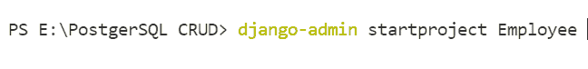

CREATE PROJECT IN DJANGO

**创建 APP:** 接下来，我们将构建一个 `CRUDAPP` app 作为项目的一部分。稍后我们还将执行 CRUD 任务。此外，要制作应用程序，请在终端中运行以下命令。

```py
python manage.py startapp CRUDAPP
```

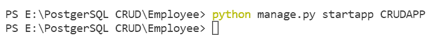

CREATE APP IN DJANGO

**创建模板:** 然后在项目根目录下创建**模板**文件夹。我们将在文件夹中创建 HTML 文件。

创建以下 HTML 文件是为了执行 CRUD 操作。

*   **show.html:** 显示提取的数据。
*   **insert.html:** 添加新员工。
*   **edit.html:** 更新现有员工。
*   **delete.html:** 删除员工实体。

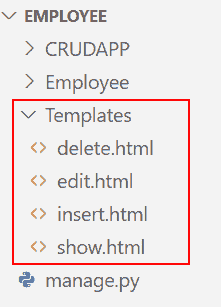

TEMPLATES FOR DJANGO PROJECT

**安装 APP:** 在 `settings.py` 文件中，我们必须包含 `CRUDAPP` app。

```py
INSTALLED_APPS = [
    'django.contrib.admin',
    'django.contrib.auth',
    'django.contrib.contenttypes',
    'django.contrib.sessions',
    'django.contrib.messages',
    'django.contrib.staticfiles',
    'CRUDAPP'
]
```

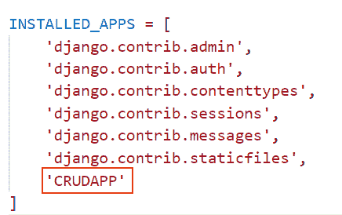

INSTALL APP IN DJANGO SETTINGS

**添加模板:** 我们还需要在 `settings.py` 文件中添加**模板**目录。

```py
'DIRS': ['Templates']
```

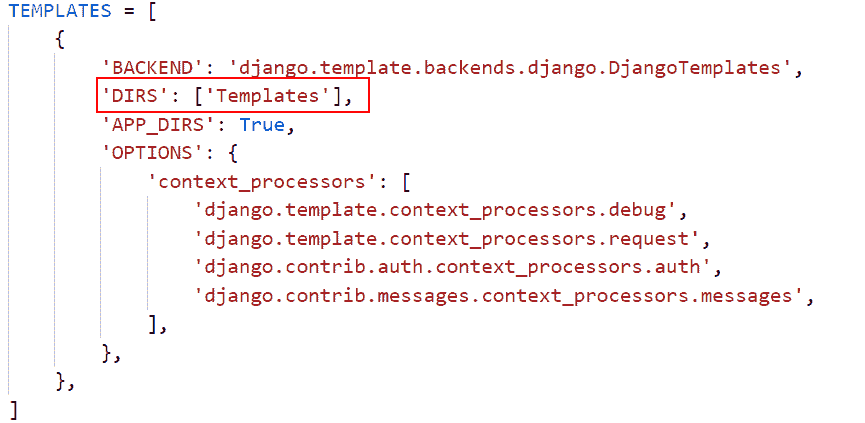

TEMPLATES IN DJANGO SETTINGS

**数据库设置:** 创建一个名为 `Employee` 的 PostgreSQL 数据库，并在 Django 项目的 `settings.py` 文件中设置。

```py
DATABASES = {  
    'default': {  
        'ENGINE': 'django.db.backends.postgresql',  
        'NAME': 'Employee',  
        'USER':'postgres',  
        'PASSWORD':'Python@123',  
        'HOST':'localhost',  
        'PORT':'5432'  
    }  
} 
```

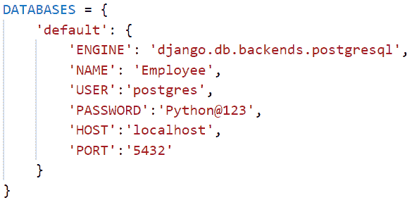

DATABASE SETUP IN DJANGO

阅读:[模型 Django 上的联合操作](https://pythonguides.com/union-operation-on-models-django/)

## Django CRUD 用 PostgreSQL 创建 url 模式

在本节中，我们将学习使用 PostgreSQL 创建 URL 模式来执行 CRUD 操作。

**项目 URL:** 在**项目的 urls.py** 文件中添加以下代码。

```py
from django.contrib import admin
from django.urls import path, include

urlpatterns = [
    path('admin/', admin.site.urls),
    path('', include('CRUDAPP.urls')),
]
```

*   我们将 `CRUDAPP.urls` 的路径添加到**员工 urls.py` `文件**中。

**APP 网址:** 首先我们要在 APP 目录下创建一个名为 `urls.py` 的文件。现在，我们定义在应用程序的 `views.py` 文件下创建的不同视图的路径。

```py
from django.urls import path
from . import views

urlpatterns = [
    path('', views.insert_emp, name='insert-emp'),
    path('show/', views.show_emp, name='show-emp'),
    path('edit/<int:pk>', views.edit_emp, name='edit-emp'),
    path('remove/<int:pk>', views.remove_emp, name='remove-emp'),
]
```

*   在这里，我们创建了以下视图:
    *   **insert_emp:** 插入员工详细信息。
    *   **show_emp:** 显示员工的详细信息。
    *   **edit_emp:** 更新员工的现有详细信息。
    *   **remove_emp:** 删除现有员工。

阅读:[如何在 Python Django 中创建 web 表单](https://pythonguides.com/create-web-form-in-python-django/)

## Djnago CRUD 用 PostgreSQL 创建视图

在这一节中，我们将看看我们必须在 `views.py` 文件中创建的**视图函数**。

```py
from django.shortcuts import render, redirect
from .forms import EmployeeForm
from .models import Employee

**# Create your views here.

# Create Employee...**

def insert_emp(request):
    ....
    ....

**# Retrieve Employees...**

def show_emp(request):
    ....
    ....

**# Update Employees...**

def edit_emp(request):
    ....
    ....

**# Delete Employees...**

def remove_emp(request):
    ....
    .... 
```

*   在这里，我们创建视图，我们将使用这些视图用 PostgreSQL 进行 CRUD 操作。

阅读:[将 Google reCAPTCHA 添加到 Django 表单中](https://pythonguides.com/add-google-recaptcha-to-django-form/)

## Django CRUD 用 PostgreSQL 创建模型

在本节中，我们将开发一个执行 CRUD 操作的模型。

**创建模型:** 在 `models.py` 文件中添加以下代码。

```py
from django.db import models

class Employee(models.Model):
    EmpId = models.CharField(max_length=3)
    EmpName = models.CharField(max_length=200)
    EmpGender = models.CharField(max_length=10)
    EmpEmail = models.EmailField()
    EmpDesignation = models.CharField(max_length=150)
    class Meta:
        db_table="Employee"
```

*   我们创建具有五个字段的**雇员**模型。
*   各个字段分别是 `EmpId` 、 `EmpName` 、 `EmpGender` 、 `EmpEmail` 和 `EmpDesignation` 。

Read: [ModuleNotFoundError:没有名为 Django 的模块](https://pythonguides.com/modulenotfounderror-no-module-named-django/)

## 使用 PostgreSQL 的 Django CRUD 注册模型

在本节中，我们将注册上面创建的模型。

**注册型号:** 在 `admin.py` 文件中添加以下代码。

```py
from django.contrib import admin
from .models impor Employee

admin.site.register(Employee)
```

*   为了在管理站点上注册**雇员**模型，我们使用带有模型名称的 `admin.site.register()` 函数。

## Django CRUD 用 PostgreSQL 插入视图函数

在本节中，我们将学习创建一个视图函数来插入员工详细信息。

**insert_emp VIEW:** 在 `views.py` 文件中添加以下代码。

```py
from django.shortcuts import render, redirect
from CRUDAPP.models import Employee

**# Create Employee**

def insert_emp(request):
    if request.method == "POST":
        EmpId = request.POST['EmpId']
        EmpName = request.POST['EmpName']
        EmpGender = request.POST['EmpGender']
        EmpEmail = request.POST['EmpEmail']
        EmpDesignation = request.POST['EmpDesignation']
        data = Employee(EmpId=EmpId, EmpName=EmpName, EmpGender=EmpGender, EmpEmail=EmpEmail, EmpDesignation= EmpDesignation)
        data.save()

        return redirect('show/')
    else:
        return render(request, 'insert.html') 
```

*   使用请求参数，我们定义了 `insert_emp` 视图，它允许用户输入新的雇员信息。
*   如果您成功输入员工详细信息，您将被重定向到**显示** HTML 页面；否则，您将被重定向到**插入** HTML 页面。

阅读:[在 Python Django 中登录系统](https://pythonguides.com/login-system-in-python-django/)

## Django CRUD 用 PostgreSQL 插入 HTML 页面

在本节中，我们将学习创建一个 HTML 模板来添加新员工的详细信息。

**插入 HTML:** 在【insert.html】文件中添加以下代码。

```py
<!DOCTYPE html>
<html lang="en">

<head>
    <meta charset="UTF-8">
    <meta http-equiv="X-UA-Compatible" content="IE=edge">
    <meta name="viewport" content="width=device-width, initial-scale=1.0">
    <title>Enter Employee</title>
</head>
<style>
    table {
        border: 8px outset;
        border-radius: 10px;
        border-spacing: 10px;
        padding: 20px;
        margin-left: auto;
        margin-right: auto;
    }

    th,
    td {
        padding: 5px;
    }
</style>

<body>
    <h2 style="text-align:center"> Enter Details of Employee </h2>
    <form method="POST">
        
        <table style="width:50%" align="center">
            <tr>
                <td>Employee Id</td>
                <td><input type="text" placeholder="Enter Employee Id" name="EmpId" </td>
            </tr>
            <tr>
                <td>Employee Name</td>
                <td><input type="text" placeholder="Enter Employee Name" name="EmpName" </td>
            </tr>
            <tr>
                <td>Gender</td>
                <td><input type="radio" name="EmpGender" value="Male"> Male
                    <input type="radio" name="EmpGender" value="Female"> Female
                    <input type="radio" name="EmpGender" value="Other"> Other
                </td>
            </tr>
            <tr>
                <td>Email</td>
                <td><input type="email" placeholder="Enter Employee Email" name="EmpEmail" </td>
            </tr>
            <tr>
                <td>Designation</td>
                <td><select name="EmpDesignation">
                        <option selected disabled=true>Select Designation</option>
                        <option> Project Manager </option>
                        <option> Programmer </option>
                        <option> Desktop Support Technician </option>
                        <option> Web Developer </option>
                        <option> Financial Advisor </option>
                        </option>
                    </select></td>
            </tr>
            <tr>
                <td colspan="2" align="center"><input type="submit" class="btn btn-success"> </td>
            </tr>
        </table>

        <br><br>
        <div class="alert alert-danger" role="alert">
            Do you want see Information of Employees?
        </div>

        <p>
            <a href="">Go To Employee Information--></a>
        </p>
    </form>
</body>

</html>
```

*   表单元素用于为用户输入构建一个 HTML 表单。
*   表单标签中还添加了 `method=POST` 属性。
*   然后，为了保护我们的表单免受网络攻击，我们使用了 **** 。

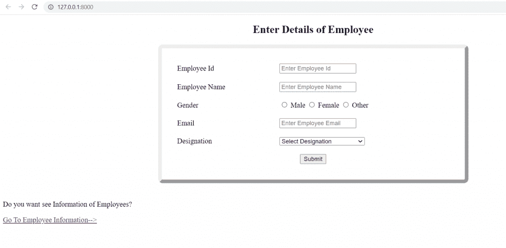

INSERT HTML TEMPLATE EXAMPLE IN DJANGO

阅读: [Python Django 获取枚举选择](https://pythonguides.com/python-django-get-enum-choices/)

## Django CRUD 用 PostgreSQL 显示视图函数

在本节中，我们将学习创建一个视图函数，显示用户添加的所有雇员的信息。

**show_emp 视图:** 在 `views.py` 文件中添加以下代码。

```py
from django.shortcuts import render, redirect
from CRUDAPP.models import Employee

**# Retrive Employee**

def show_emp(request):
    employees = Employee.objects.all()
    return render(request,'show.html',{'employees':employees} )
```

*   `show_emp` 视图显示了用户创建的雇员的所有信息。
*   用户通过此功能被重定向到`show.html`页面。

阅读: [Python Django 四舍五入到两位小数](https://pythonguides.com/django-round-to-two-decimal-places/)

## Django CRUD 用 PostgreSQL 显示 HTML 页面

在本节中，我们将学习创建一个 HTML 模板，显示用户添加的员工列表。

**显示 HTML:** 在 show.html 文件中添加以下代码。

```py
<!DOCTYPE html>
<html lang="en">

<head>
    <meta charset="UTF-8">
    <meta http-equiv="X-UA-Compatible" content="IE=edge">
    <meta name="viewport" content="width=device-width, initial-scale=1.0">
    <title>Search Employee</title>
</head>
<style>
    table {
        border: 8px outset;
        border-radius: 10px;
        border-spacing: 10px;
        padding: 20px;
        margin-left: auto;
        margin-right: auto;
    }

    th,
    td {
        padding: 5px;
        border: 1px solid;
    }
</style>

<body>
    <h2 style="text-align:center"> Employee Information </h2>
    <table align="center" style="margin: 0px auto;">
        <thead>
            <tr>
                <th>Employee ID</th>
                <th>Name</th>
                <th>Gender</th>
                <th>Email</th>
                <th>Designation</th>
                <th>Edit</th>
                <th>Delete</th>
            </tr>
        </thead>
        <tbody>
            
            <tr>
                <td>{{employee.EmpId}}</td>
                <td>{{employee.EmpName}}</td>
                <td>{{employee.EmpGender}}</td>
                <td>{{employee.EmpEmail}}</td>
                <td>{{employee.EmpDesignation}}</td>
                <td>
                    <a href="/edit/{{employee.pk}}">Update</a>
                </td>
                <td>
                    <a href="/remove/{{employee.pk}}">Delete</a>
                </td>
            </tr>
            
        </tbody>
    </table>

    <br><br>
    <div class="alert alert-danger" role="alert">
        Do you want to enter more Employees?
    </div>

    <p>
        <a href=""><-- Go To Home Page</a>
    </p>
</body>

</html>
```

*   我们将制作一个 HTML 模板，显示用户输入的所有雇员的列表。
*   以下是表格的标题:
    *   **员工 Id** :显示员工 Id。
    *   **员工姓名:**显示员工的姓名。
    *   **员工性别:**显示员工性别。
    *   **员工邮件:**显示员工的邮件。
    *   **Emp 名称:**显示员工的职业。
*   下列操作按钮也是可见的:
    *   **更新:**对用户已经添加的特定条目进行更改。
    *   **删除:**删除某个员工新增的条目。

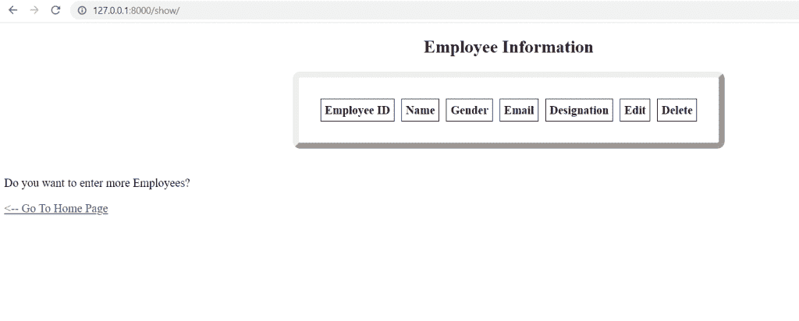

SHOW HTML TEMPLATE OF DJANGO PROJECT

阅读: [Python Django vs ReactJS](https://pythonguides.com/django-vs-reactjs/)

## Django CRUD 用 PostgreSQL 编辑视图函数

在本节中，我们将学习创建一个视图函数来更新现有员工的信息。

**edit_emp VIEW:** 在 `views.py` 文件中添加以下代码。

```py
from django.shortcuts import render, redirect
from CRUDAPP.models import Employee

**# Update Employee**

def edit_emp(request,pk):
    employees = Employee.objects.get(id=pk)
    if request.method == 'POST':
        return redirect('/show')

    context = {
        'employees': employees,
    }

    return render(request,'edit.html',context) 
```

*   **编辑 _ 雇员**视图类似于**插入 _ 雇员**视图。
*   我们根据员工的**主键**进行更新。

阅读:[用姜戈脆皮蛋糕制作蛋糕](https://pythonguides.com/create-form-with-django-crispy-forms/)

## Django CRUD 用 PostgreSQL 编辑 HTML 页面

在这一节中，我们将学习开发一个 HTML 模板来更新用户添加的特定员工详细信息。

**编辑 HTML:** 在【edit.html】文件中添加以下代码。

```py
<!DOCTYPE html>
<html lang="en">

<head>
    <meta charset="UTF-8">
    <meta http-equiv="X-UA-Compatible" content="IE=edge">
    <meta name="viewport" content="width=device-width, initial-scale=1.0">
    <title>Update Employee</title>
</head>
<style>
    table {
        border: 8px outset;
        border-radius: 10px;
        border-spacing: 10px;
        padding: 20px;
        margin-left: auto;
        margin-right: auto;
    }

    th,
    td {
        padding: 5px;
    }
</style>

<body>
    <h2 style="text-align:center"> Update Details of Employee </h2>
    <form method="POST">
        
        <table style="width:50%" align="center">
            <tr>
                <td>Employee Id</td>
                <td><input type="text" value="{{ employees.EmpId }}" name="EmpId</td>
            </tr> 
            <tr>
                <td>Employee Name</td>
                <td><input type=" text" value="{{ employees.EmpName }}" name="EmpName" </td>
            </tr>
            <tr>
                <td>Gender</td>
                <td><input type="text" value="{{ employees.EmpGender }}" name="EmpGender" </td>
            </tr>
            <tr>
                <td>Email</td>
                <td><input type="email" value="{{ employees.EmpEmail }}" name="EmpEmail" </td>
            </tr>
            <tr>
                <td>Designation</td>
                <td><input type="text" value="{{ employees.EmpDesignation}}" name="EmpDesignation" </td>
            </tr>
            <tr>
                <td colspan="2" align="center"><input type="submit" class="btn btn-success"> </td>
            </tr>
        </table>

    </form>
</body>

</html>
```

*   这里有一个表单，我们将使用它来编辑特定用户的信息。

阅读: [Python Django 设置时区](https://pythonguides.com/python-django-set-timezone/)

## Djnago CRUD remove view 函数与 PostgreSQL

在这一节中，我们将学习创建一个删除指定条目的视图函数。

**remove_emp VIEW:** 在 `views.py` 文件中添加以下代码。

```py
from django.shortcuts import render, redirect
from CRUDAPP.models import Employee

**# Delete Employee**

def remove_emp(request, pk):
    employees = Employee.objects.get(id=pk)

    if request.method == 'POST':
        employees.delete()
        return redirect('/show')

    context = {
        'employees': employees,
    }

    return render(request, 'delete.html', context)
```

*   当有人点击删除时，remove_emp 视图从数据库中删除实例。

## Django CRUD 用 PostgreSQL 删除 HTML 页面

在这一节中，我们将学习开发一个 HTML 模板来删除一个雇员的条目。

**删除 HTML:** 在【delete.html】文件中添加以下代码。

```py
<!DOCTYPE html>
<html lang="en">

<head>
    <meta charset="UTF-8">
    <meta http-equiv="X-UA-Compatible" content="IE=edge">
    <meta name="viewport" content="width=device-width, initial-scale=1.0">
    <title>Delete Employee</title>
</head>

<body>
    <form action="" method="POST">
        

        <br><br>
        <div class="alert alert-danger" role="alert">
            Are you sure you want to delete "{{ employees.EmpName}}"?
        </div>

        <p>
            <a href=""><-- Return</a>
        </p>

        <p>
            <input class="btn btn-danger" type="submit" value="Confirm">
        </p>
    </form>
</body>

</html>
```

*   我们将制作一个 HTML 模板，删除用户想要删除的精确条目。
*   在删除过程之前，**再次确认**。
*   当我们点击**返回按钮**时，也可以回到上一页，也就是搜索模板。

阅读: [Python Django 格式日期](https://pythonguides.com/python-django-format-date/)

## 使用 PostgreSQL 的 Django CRUD 基本命令

在本节中，我们将看到一些使用 PostgreSQL 执行 CRUD 操作的基本命令。

**Makemigrations:** 如果模型已经被修改，该命令为我们的新模型准备一个 Makemigrations 文件，或者为任何更改创建一个新的迁移文件。此命令不会创建或影响数据库修改。

```py
python manage.py makemigartions
```

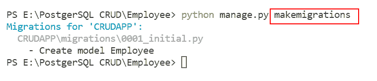

RUNNING MAKEMIGRATIONS IN DJANGO

**迁移:** 迁移命令执行数据库最近迁移文件中给出的指令。

```py
python manage.py migrate
```

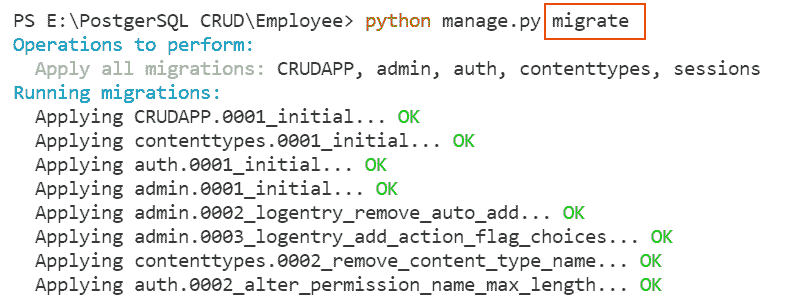

MIGRATE COMMAND IN DJANGO

**运行服务器:** 运行开发服务器运行以下命令。

```py
python manage.py runserver
```

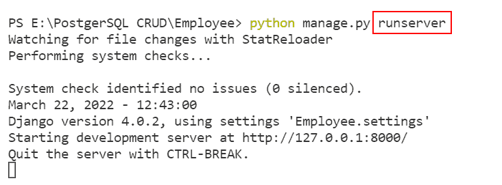

RUNSERVER COMMAND IN DJANGO

阅读:[如何使用 Django 和 SQLite 创建联系人表单](https://pythonguides.com/contact-form-with-django-and-sqlite/)

## 使用 PostgreSQL 的 Django CRUD 示例

在本节中，我们将看到一个使用 PostgreSQL 进行 CRUD 操作的示例。

首先，我们必须输入员工的详细信息。

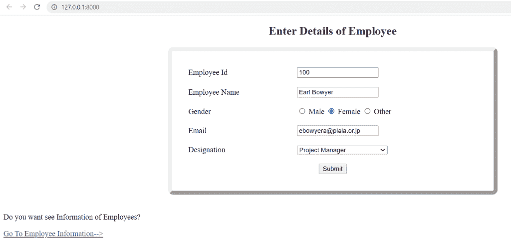

Enter Detail

如果我们点击**转到员工信息**，我们会重定向到员工信息。

当我们点击**提交按钮**时，我们重定向到员工信息。

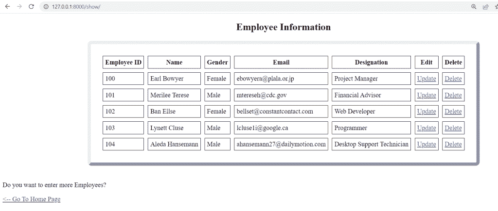

Show Information

如果我们点击**转到主页**，我们会重定向到输入员工详细信息的页面。

当我们点击**更新**看看，会发生什么。


Edit Template

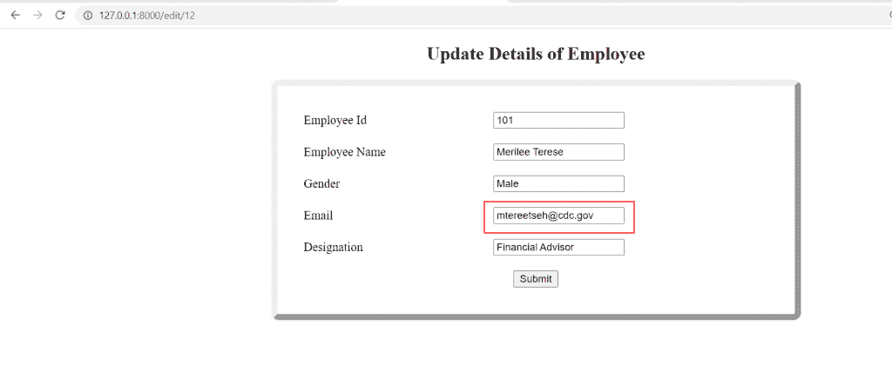

Update Email

在这里，我们将电子邮件从**mtereseh@cdc.gov**更新为【metereetseh@cdc.gov 

当我们点击**提交按钮**时，我们将重定向到员工信息页面。

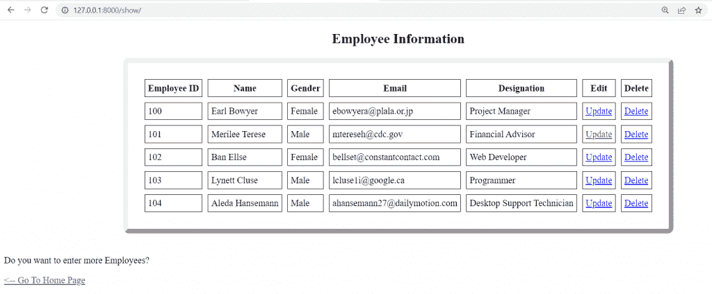

Show Employee Information in Django CRUD example with PostgreSQL

从这里，我们清楚地看到**电子邮件 id** 被更新。

当我们点击**删除**时，看看会发生什么。

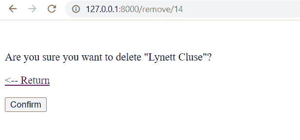

DELETE TEMPLATE

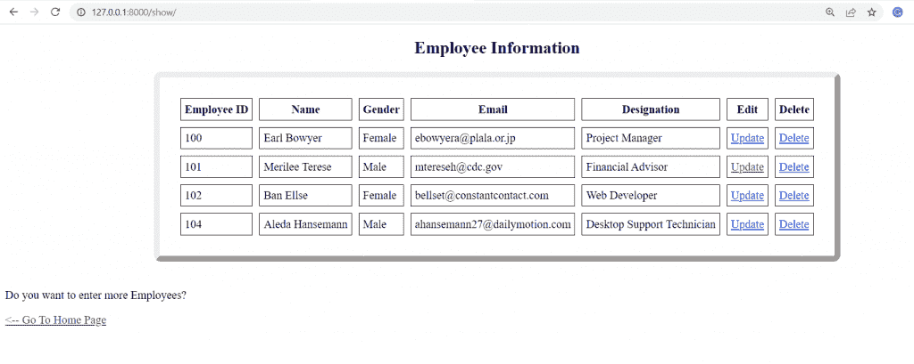

Django CRUD example with PostgreSQL

从这里我们可以清楚地看到员工 `Lyneett Cluse` 被成功删除。

你可能也喜欢阅读下面的 Django 教程。

*   [Django 模板中的 If 语句](https://pythonguides.com/if-statement-in-django-template/)
*   [Python 改 Django 版本](https://pythonguides.com/python-change-django-version/)
*   [获取 Django 中的 URL 参数](https://pythonguides.com/get-url-parameters-in-django/)
*   [Python Django 长度过滤器](https://pythonguides.com/python-django-length-filter/)

在本 Python Django 教程中，我们已经讨论了带有 `PostgreSQL` 的 **Django CRUD 示例，并且我们还讨论了本教程中的以下主题。**

*   Django PostgreSQL CRUD
*   用 PostgreSQL 设置 Django CRUD 项目
*   Django CRUD 用 PostgreSQL 创建 url 模式
*   Djnago CRUD 用 PostgreSQL 创建视图
*   Django CRUD 用 PostgreSQL 创建模型
*   使用 PostgreSQL 的 Django CRUD 注册模型
*   用 PostgreSQL 实现 Django CRUD 插入视图函数
*   Django CRUD 使用 PostgreSQL 插入 HTML 页面
*   Django CRUD 使用 PostgreSQL 显示视图函数
*   Django CRUD 用 PostgreSQL 显示 HTML 页面
*   用 PostgreSQL 实现 Django CRUD 编辑视图功能
*   用 PostgreSQL 编辑 HTML 页面
*   用 PostgreSQL 实现 Djnago CRUD remove 视图函数
*   Django CRUD 用 PostgreSQL 删除 HTML 页面
*   使用 PostgreSQL 的 Django CRUD 基本命令
*   使用 PostgreSQL 的 Django CRUD 示例

[Bijay Kumar](https://pythonguides.com/author/fewlines4biju/)

Python 是美国最流行的语言之一。我从事 Python 工作已经有很长时间了，我在与 Tkinter、Pandas、NumPy、Turtle、Django、Matplotlib、Tensorflow、Scipy、Scikit-Learn 等各种库合作方面拥有专业知识。我有与美国、加拿大、英国、澳大利亚、新西兰等国家的各种客户合作的经验。查看我的个人资料。

[enjoysharepoint.com/](https://enjoysharepoint.com/)[](https://www.facebook.com/fewlines4biju "Facebook")[](https://www.linkedin.com/in/fewlines4biju/ "Linkedin")[](https://twitter.com/fewlines4biju "Twitter")