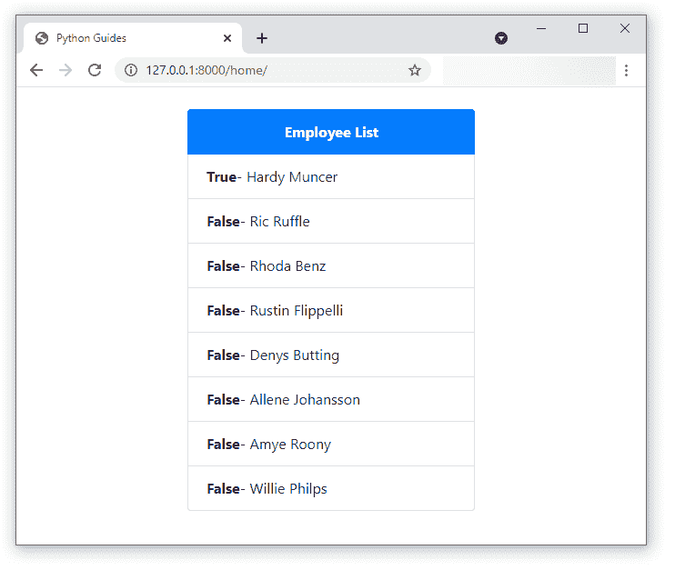

# Django for 循环

> 原文：<https://pythonguides.com/django-for-loop/>

[](https://sharepointsky.teachable.com/p/python-and-machine-learning-training-course)

在这个 [Django 教程](https://pythonguides.com/what-is-python-django/)中，我们将学习循环的 **Django。这里我们将学习如何在 Django 中使用 for 循环。我们还将讨论与 Django 中的**循环的**相关的不同示例。这些是我们将在本教程中讨论的以下主题。**

*   Django for 循环
*   html 中的 Django for 循环
*   Django for 循环计数器
*   Django for 循环范围
*   html 表中的 Django for 循环
*   模板中循环的 Django
*   Django for 循环最后一项
*   Django for 循环第一项
*   Django 代表循环中断
*   Django for 循环不起作用
*   Django for 循环模型对象

目录

[](#)

*   [Django for loop](#Django_for_loop "Django for loop ")
    *   [Django for 模板中的循环](#Django_for_loop_in_template "Django for loop in template ")
*   [Django 用于循环计数器](#Django_for_loop_counter "Django for loop counter ")
*   [Django for 循环最后一项](#Django_for_loop_last_item "Django for loop last item")
*   [Django for 循环第一项](#Django_for_loop_first_item "Django for loop first item ")
*   [Django 为循环范围](#Django_for_loop_range "Django for loop range ")
    *   [替代方法](#Alternative_Method "Alternative Method")
*   [Django for loop break](#Django_for_loop_break "Django for loop break ")
*   [Django for html 表中的循环](#Django_for_loop_in_html_table "Django for loop in html table ")
*   [Django for 循环不起作用](#Django_for_loop_not_working "Django for loop not working ")
*   [Django for html 中的循环](#Django_for_loop_in_html "Django for loop in html")

## Django 为循环

在了解如何在 Django 中创建和使用 for 循环之前，我们应该知道什么是 `for` 循环。

循环是用于多次执行一条或多条语句的控制语句。现在，在 python 中，有不同类型的循环，其中一个是**循环，另一个是**循环。

在 python 中， `for` 循环是用来迭代某个序列的，基本上是用来一个接一个的取每一项。在 python 中，我们可以使用 `for` 循环来迭代字符串、字典、列表、元组或集合。下面是 python 中使用 for 循环的一般语法。

```py
for iterating_var in sequence:
   statements(s)
```

关于 python 中 For 循环的更多细节，可以阅读下面的[教程](https://pythonguides.com/python-for-loop/)。

现在，我们可以像在 python 中一样在 `views.py` 文件中使用 for 循环。但是在 Django 中，有一种更有效的方法使用 for 循环来迭代一些值。那就是在 Django 模板中使用**作为**模板标签。

### Django 为模板中的循环

为了在 Django 中创建并使用**作为**循环，我们通常使用“**作为**模板标签。这个标签有助于遍历给定数组中的项目，并且该项目在上下文变量中是可用的。

在模板中使用“**作为**标签的语法如下所示。

```py



```

现在，让我们举一个例子来理解这个**在模板中对于**标签的用法。在本演示中，我们将显示使用 for 循环的员工列表。

因此，首先，我们将使用 `views.py` 文件从**雇员**模型中获取所有对象。然后，我们将把它们作为一个上下文变量发送到 home.html 的**页面。下面是我们添加到 views.py** 文件中的代码。

```py
 from django.shortcuts import render
from myApp.models import Employee

def home(request):
   employee_list = Employee.objects.all()
   return render(request, 'home.html', {'employee_list': employee_list}) 
```

接下来，我们将使用 `urls.py` 文件将一个 URL 映射到**主页**视图，为此，我们在文件中添加了以下代码。

```py
from django.urls import path
from . import views

urlpatterns = [
   path('home/', views.home, name='home')
]
```

所以，下一步是在你的模板目录中创建一个`home.html`页面。在 home.html 页面的**中，我们将使用**标签的**来迭代上下文变量。从上下文变量中，我们将尝试获取列表中的雇员姓名。**

这是我们的`home.html`页面的代码。

```py
<!DOCTYPE html>
<html lang="en">

<head>
    <meta charset="UTF-8">
    <meta http-equiv="X-UA-Compatible" content="IE=edge">
    <meta name="viewport" content="width=device-width, initial-scale=1.0">
    <link rel="stylesheet" href="https://maxcdn.bootstrapcdn.com/bootstrap/4.5.2/css/bootstrap.min.css">
    <script src="https://ajax.googleapis.com/ajax/libs/jquery/3.5.1/jquery.min.js"></script>
    <script src="https://cdnjs.cloudflare.com/ajax/libs/popper.js/1.16.0/umd/popper.min.js"></script>
    <script src="https://maxcdn.bootstrapcdn.com/bootstrap/4.5.2/js/bootstrap.min.js"></script>
    <title>Python Guides</title>
</head>

<body>
    <br>
    <div class="container w-50">
        <ul class="list-group">
            <li class="list-group-item active text-center font-weight-bold">Employee List</li>
        
            <li class="list-group-item text-center">{{ employee.name }}</li>
        
        </ul>
    </div>
</body>
</html>
```

现在，是时候看看上面的示例实现的输出了。为此，我们需要运行开发服务器并打开主页。


Home Page

阅读: [Python Django vs Flask](https://pythonguides.com/python-django-vs-flask/)

## Django 为循环计数器

现在，Django 还提供了多个内置变量，我们可以在使用 for 循环标签时使用这些变量。它们中的大多数都是在使用 for 循环时用来获取计数器的。

所以，通过使用这些变量，我们可以得到不同类型的计数器。下面列出了与计数器相关的所有变量。

*   **forloop.counter:** 通过使用这个，循环的迭代从索引 1 开始。
*   **forloop.counter0:** 通过使用这个，循环的迭代从索引 0 开始。
*   **forloop.revcounter:** 通过使用这个，迭代从循环结束开始，直到索引 1。
*   **forloop.revcounter0:** 通过使用这个，迭代从循环结束开始，直到索引 0。

现在，为了进行演示，让我们在前面的雇员列表示例中使用其中一个变量。正如您在前面示例的输出中看到的，我们的雇员列表中没有索引。

因此，我们将使用变量" `forloop.counter` 向我们的雇员列表添加一个索引。而这一次，我们只需要修改我们的 home.html 页面**。**

下面是我们添加到 home.html 页面的完整代码。

```py
<!DOCTYPE html>
<html lang="en">

<head>
    <meta charset="UTF-8">
    <meta http-equiv="X-UA-Compatible" content="IE=edge">
    <meta name="viewport" content="width=device-width, initial-scale=1.0">
    <link rel="stylesheet" href="https://maxcdn.bootstrapcdn.com/bootstrap/4.5.2/css/bootstrap.min.css">
    <script src="https://ajax.googleapis.com/ajax/libs/jquery/3.5.1/jquery.min.js"></script>
    <script src="https://cdnjs.cloudflare.com/ajax/libs/popper.js/1.16.0/umd/popper.min.js"></script>
    <script src="https://maxcdn.bootstrapcdn.com/bootstrap/4.5.2/js/bootstrap.min.js"></script>
    <title>Python Guides</title>
</head>

<body>
    <br>
    <div class="container w-50">
        <ul class="list-group">
            <li class="list-group-item active text-center font-weight-bold">Employee List</li>
            
            <li class="list-group-item">{{ `forloop.counter` }}. {{ employee.name }}</li>
            
        </ul>
    </div>
</body>
</html>
```

在`home.html`页面上，我们在 for 循环中使用了 for 循环变量。它将为列表中的每个雇员姓名添加一个索引值。最终结果如下图所示。


Final Result

阅读:[如何安装 Django](https://pythonguides.com/how-to-install-django/)

## Django for 循环最后一项

Django 还提供了一个内置变量，带有用于循环标记的**，使用它我们可以确定数组中的最后一项。**

变量的名字是“ `forloop.last` ”。对于数组的最后一项，该变量返回 `True` ，对于所有其他项，该变量返回 `False` 。

因此，我们可以很容易地使用这个变量从数组中获取最后一个值。但是首先，让我们看看这个变量如何返回数组中每一项的**真` / `假**值。

同样，在本演示中，我们将使用第一部分中的相同雇员列表示例。我们将在`home.html`页面的 for 循环中使用该变量。

所以，我们只对页面的主体做了一些修改。而`home.html`页面主体的代码如下。

```py
<body>
    <br>
    <div class="container w-50">
        <ul class="list-group">
            <li class="list-group-item active text-center font-weight-bold">Employee List</li>
            
            <li class="list-group-item"><b>{{ `forloop.last` }}</b>- {{ employee.name }}</li>
            
        </ul>
    </div>
</body>
```

现在，让我们通过启动开发服务器并转到主页来检查结果。


`home.html` page

现在，从上面的输出中，我们可以看到变量只为最后一项返回了 `True` 。而对于所有其他项目，它已经返回了 `False` 。

现在，为了只从数组中获取最后一项，我们需要在模板中使用 `IF` 语句。

下面是我们将要使用的修改后的代码。

```py
<body>
    <br>
    <div class="container w-50">
        <ul class="list-group">
            <li class="list-group-item active text-center font-weight-bold">Last Name From Employee List</li>
            
            
            <li class="list-group-item text-center">{{ employee.name }}</li>
            
            
        </ul>
    </div>
</body>
```

在上面的代码中，我们用变量的**指定了一个 `IF` 块。因此，循环将只从对象数组中获取最后一个名字。因为该变量只会为最后一项返回 `True` 。最终，我们将获得以下输出。**


Final Result

阅读:[如何设置 Django 项目](https://pythonguides.com/setup-django-project/)

## Django 为循环首项

类似于选择最后一项，我们也有一个变量从给定的数组中获取第一项。变量的名字是 `forloop.first` ，它只能在循环的**中使用。**

并且仅对数组中的第一项返回**真**。对于数组中的所有其他项目，它返回**假**。

让我们首先看看这个变量在遍历数组中的每一项时如何返回**真` / `假**值。为此，我们将继续使用第一部分中的同一个雇员列表示例。

这里是我们使用这个变量的 home.html 文件的代码。

```py
<body>
    <br>
    <div class="container w-50">
        <ul class="list-group">
            <li class="list-group-item active text-center font-weight-bold">Employee List</li>
            
            <li class="list-group-item"><b>{{ `forloop.first` }}</b>- {{ employee.name }}</li>
            
        </ul>
    </div>
</body>
```

下图显示了这个`home.html`页面的输出。



`home.html` page

现在，从上面的输出中，我们可以看到变量只为第一项返回了 `True` 。而对于所有其他项目，它已经返回了 `False` 。

现在，为了只从数组中获取第一项，我们需要在模板中使用 `IF` 语句。下面是我们将要使用的修改后的代码。

```py
<body>
    <br>
    <div class="container w-50">
        <ul class="list-group">
            <li class="list-group-item active text-center font-weight-bold">First Name From Employee List</li>
            
            
            <li class="list-group-item text-center">{{ employee.name }}</li>
            
            
        </ul>
    </div>
</body>
```

在上面的代码中，我们为第一个变量指定了一个带有**的 `IF` 块。因此，循环将只从对象数组中获取第一个名字。因为变量只会为第一项返回**真**。最终，我们将获得以下输出。**


Final Result

阅读: [Python Django 获取管理员密码](https://pythonguides.com/python-django-get-admin-password/)

## Django 为循环范围

在处理应用程序的逻辑时，我们可能需要运行循环 `N` 次。要用 python 实现这个任务，我们只需在 for 循环中使用 `range()` 函数。

`range()` 函数用于返回一系列数字，从 `0` 开始，递增 `1` (默认)，然后停止在指定值。

但是在 Django 中，我们没有可以在模板中使用的范围标签或函数来实现这个任务。但是不要担心，仍然有一种方法可以让我们运行循环 `N` 次。我们将在本节中讨论这种方法。

### 替代方法

在这个方法中，首先，我们将创建一个视图，在这个视图中我们将使用 `range()` 函数来获取一个数字列表。然后，我们将把列表和模板一起传递给渲染函数。

让我们借助一个例子来理解这个方法，为此，我们将显示从 1 到 10 的数字的平方。因此，首先，我们在我们的 `views.py` 文件中创建一个视图，其代码如下所示。

```py
from django.shortcuts import render

def home(request):
   return render(request, 'home.html', {'range': range(1,11)})
```

在上面的代码中，我们简单地使用了 `range()` 函数来获取从 1 到 10 的数字列表。我们只是在渲染函数中传递带有模板的列表。

接下来，我们将在`home.html`页面的主体中添加以下代码。

```py
<body>
    <br>
    <div class="container w-50">
        <ul class="list-group">
            <li class="list-group-item active text-center font-weight-bold">Square of values</li>
            
            <li class="list-group-item text-center">Square of {{x}} is </li>
            
        </ul>
    </div>
</body>
```

现在，在这个页面上，我们使用 for 循环从列表中一次获取一个值。然后，我们用单个值来计算它的平方。为了得到平方，我们使用了一个 `widthradio` 过滤器，在过滤器中， `(x 1 x)` 简单地表示 `(x * x)` 。

下面是上面例子的最终结果。


Final Result

阅读:[Django 中的应用程序和项目之间的差异](https://pythonguides.com/django-app-vs-project/)

## Django 为循环中断

在 python 中， `break` 语句用于消除当前循环的执行，并开始执行下一条语句。python 中的 `break` 语句可以在循环中的和**的**中使用。****

不幸的是，Django 模板不支持使用 break 语句。为了实现 `break` 语句的功能，我们可以在 for 循环中使用`IF`–`ELSE`语句来限制结果。

让我们借助一个例子来理解这一点，为此，我们将使用**雇员**模型及其数据。我们将尝试只列出模型中的 5 个雇员姓名。因此，我们在 `views.py` 文件中使用相同的代码，如开始部分所示。

接下来，我们在我们的`home.html`页面中添加 for 循环，在循环中，我们将使用一个 `IF` 块。下面给出了 home.html 页面的**代码。**

```py
<body>
    <br>
    <div class="container w-50">
        <ul class="list-group">
            <li class="list-group-item active text-center font-weight-bold">Employee List</li>
            
            
            <li class="list-group-item">{{ forloop.counter }}. {{ employee.name }}</li>
            
            
        </ul>
    </div>
</body>
```

在上面的代码中，首先，我们使用 for 循环迭代雇员列表。在此之后，我们使用 `IF` 语句来检查雇员姓名的索引是否小于或等于 5。在 ens 中，我们将得到以下结果作为输出。


Final Result

阅读:[如何在 Django 中创建模型](https://pythonguides.com/create-model-in-django/)

## Django for html 表中的循环

到目前为止，我们只在模板中使用了 for 循环来获取列表中的结果，并且只使用了对象集中的一个值。

现在，在本节中，我们将了解如何使用 for 循环来迭代对象数组中的多个值。我们还将了解如何使用 for 循环来排列 HTML 表中的值。

让我们借助一个例子来理解这个实现，为此，我们将再次使用**雇员**模型。我们将使用 `for` 循环来遍历对象数组，并在表中显示雇员的详细信息。

首先，我们将创建一个视图来从 Employee 模型中获取所有对象，然后，我们将使用模板在 render 函数中传递它。下面给出了 `views.py` 的代码。

```py
from django.shortcuts import render
from myApp.models import Employee

def home(request):
   employee_list = Employee.objects.all()
   return render(request, 'home.html', {'employee_list': employee_list})
```

接下来，我们将创建`home.html`文件，并使用 for 循环。下面是 HTML 文件的代码。

```py
<body>
    <br>
    <div class="container-fluid">
        <table class="table">
            <thead class="thead-dark">
                <tr>
                    <th scope="col">#</th>
                    <th scope="col">Employee Name</th>
                    <th scope="col">Job Title</th>
                    <th scope="col">Joining Date</th>
                </tr>
            </thead>
            <tbody>
                
                <tr>
                    <th scope="row">{{ forloop.counter }}</th>
                    <td>{{ employee.name }}</td>
                    <td>{{ employee.job_title }}</td>
                    <td>{{ employee.joining_date }}</td>
                </tr>
                
            </tbody>
        </table>
    </div>
</body>
```

在上面的代码中，我们在 **<主体>** 标签中使用了 for 循环，之后，我们在 **< td >** 标签中指定了值。下面是上面例子的结果。


`Home page`

阅读:[如何获取 Django 的当前时间](https://pythonguides.com/how-to-get-current-time-in-django/)

## 姜戈为回路不工作

for 循环是一个条件语句，用于顺序迭代一些 pf 值。下面是 python 中使用 for 循环的一般语法。

```py
for iterating_var in sequence:
   statements(s)
```

现在，我们可以像在 python 中使用 for 循环一样，在**视图**中使用 for 循环。但是，如果我们想在模板中使用 for 循环呢？

现在，如果我们在模板中使用相同的语法，for 循环将不起作用。Django 模板不像 python 那样工作。

要在我们的模板页面中使用 for 循环，我们必须使用" `for` "模板标签，使用它的语法如下。

```py



```

现在，我们已经展示了许多与使用“**作为**模板标签相关的例子。

在 python 中，我们可以使用 `for` 循环来迭代字符串、字典、列表、元组或集合。但是在 Django 的情况下，大多数时候我们必须迭代表数据。

在 Django 中，表中数据以 python 对象的形式存储。因此，要访问它们，我们必须遍历对象数组，并理解如何从对象中获取值。

在本文中，我们还解释了与此相关的多个示例。

阅读: [Python Django 过滤器](https://pythonguides.com/python-django-filter/)

## Django for html 中的循环

Django 使用模板动态生成 HTML，我们可以使用这些模板显示静态和动态的 HTML 内容。

Django 使用其模板系统，该系统使用 **Django 模板语言**。于是，Django 使用 **Django 模板语言**或 `DTL` 模板将 Python 和 Django 创建的动态数据显示成 HTML。

现在，为了在这些 Django 模板中使用 for 循环，我们需要使用 `for` 模板标签。我们已经在本文的第一部分解释了它的可用性。

你可能也喜欢读下面的文章。

*   [获取 Django 中的 URL 参数](https://pythonguides.com/get-url-parameters-in-django/)
*   [Python Django vs 金字塔](https://pythonguides.com/python-django-vs-pyramid/)

在这个 Django 教程中，我们学习了循环的 **Django。这里我们已经讨论了如何在 Django 中使用循环**的**。我们还讨论了与 Django 中的**循环的**相关的不同示例。这些是我们在本教程中讨论过的以下主题。**

*   Django for 循环
*   html 中的 Django for 循环
*   Django for 循环计数器
*   Django for 循环范围
*   html 表中的 Django for 循环
*   模板中循环的 Django
*   Django for 循环最后一项
*   Django for 循环第一项
*   Django 代表循环中断
*   Django for 循环不起作用
*   Django for 循环模型对象

[Bijay Kumar](https://pythonguides.com/author/fewlines4biju/)

Python 是美国最流行的语言之一。我从事 Python 工作已经有很长时间了，我在与 Tkinter、Pandas、NumPy、Turtle、Django、Matplotlib、Tensorflow、Scipy、Scikit-Learn 等各种库合作方面拥有专业知识。我有与美国、加拿大、英国、澳大利亚、新西兰等国家的各种客户合作的经验。查看我的个人资料。

[enjoysharepoint.com/](https://enjoysharepoint.com/)[](https://www.facebook.com/fewlines4biju "Facebook")[](https://www.linkedin.com/in/fewlines4biju/ "Linkedin")[](https://twitter.com/fewlines4biju "Twitter")