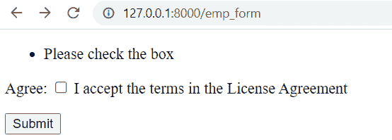

# Python Django 表单验证

> 原文：<https://pythonguides.com/django-form-validation/>

[](https://sharepointsky.teachable.com/p/python-and-machine-learning-training-course)

在这个 [Python Django 教程](https://pythonguides.com/how-to-install-django/)中，我们将学习 **Python Django 表单验证**。我们还将在 Django 中看到与表单验证相关的不同示例。我们将在本教程中讨论以下主题:

*   Python Django 表单验证
*   Django 表单验证示例
*   Django 表单验证已清理 _ 数据
*   Django 表单验证 max_length
*   Django 表单验证错误消息
*   Django 表单验证复选框
*   需要 Django 表单验证
*   Django 表单验证清理
*   Django 表单验证密码
*   Djnago 格式验证空白
*   Djnago 格式验证整数
*   Django 表单验证多个字段
*   Django 表单验证唯一
*   Django 管理表单验证错误
*   Django 表单验证自定义
*   Django 表单验证排除字段
*   Django 表单验证正则表达式
*   Django 表单验证字母数字
*   没有模型的 Django 表单验证

目录

[](#)

*   [Python Django 表单验证](#Python_Django_form_validation "Python Django form validation")
*   [Djnago 表单验证示例](#Djnago_form_validation_example "Djnago form validation example")
*   [Django 表单验证已清理 _ 数据](#Django_form_validation_cleaned_data "Django form validation cleaned_data")
*   [Django 表单验证 max_length](#Django_form_validation_max_length "Django form validation max_length")
*   [Django 表单验证错误消息](#Django_form_validation_error_message "Django form validation error message")
*   [Django 表单验证复选框](#Django_form_validation_checkbox "Django form validation checkbox")
*   [需要 Django 表单验证](#Django_form_validation_required "Django form validation required")
*   [Django 表单验证清理](#Django_form_validation_clean "Django form validation clean")
*   [Django 表单验证比较](#Django_form_validation_compare "Django form validation compare")
*   [Django 表单验证密码](#Django_form_validation_password "Django form validation password")
*   [Django 表单验证空白](#Django_form_validation_whitespace "Django form validation whitespace")
*   [Django 表单验证整数](#Django_form_validation_integer "Django form validation integer")
*   [Django 表单验证多字段](#Django_form_validation_multiple_fields "Django form validation multiple fields")
*   [Django 表单验证唯一](#Django_form_validation_unique "Django form validation unique")
*   [Django 管理表单验证错误](#Django_admin_form_validation_error "Django admin form validation error")
*   [Django 表单验证自定义](#Django_form_validation_custom "Django form validation custom")
*   [Django 表单验证排除字段](#Django_form_validation_exclude_fields "Django form validation exclude fields")
*   [Django 表单验证正则表达式](#Django_form_validation_regex "Django form validation regex")
*   [Django 表单验证字母数字](#Django_form_validation_alphanumeric "Django form validation alphanumeric")
*   [没有模型的 Django 表单验证](#Django_form_validation_without_model "Django form validation without model")

## Python Django 表单验证

在这一节中，我们将看看 **Django 的表单验证**，这意味着表单数据的验证。这种验证过程非常重要，因为它提高了安全性，并保护我们的表单免受不道德数据的侵害。

Django 包含了用于验证表单输入的内置机制。并且使用这些技术，这种验证可以自动完成。而且，只有 `CSRF` 代币可以提交 Django 表格。

为了验证表单，我们需要创建一个表单，然后根据用户的需求从用户那里收集各种输入，然后相应地应用表单验证。

另外，检查: [Python Django vs ReactJS](https://pythonguides.com/django-vs-reactjs/)

## Djnago 表单验证示例

在本节中，我们将看到一个与表单验证相关的示例。为了执行表单验证，我们将使用 `is_valid()` 方法。

当我们需要验证完整的表单数据时，使用 `is_vaild()` 函数。它是在 Django 的表单类中定义的。在该验证中，将检查 Python 数据类型。该函数将返回布尔结果，即如果数据有效，则返回 True，否则返回 False。

**让我们看一个使用 is_valid()方法进行表单验证的例子:**

**创建项目和 App:** 首先我们要创建一个项目和 App。因此，使用下面定义的代码来创建它。

```py
**# Project**
django-admin startproject project_name

**# App**
python manage.py startapp app_name
```

在这里，我创建了一个名为 `PythonGuides` 的项目和一个名为 `myApp` 的应用程序。

**安装 App:** 后，成功创建项目和 App。你必须安装一个应用程序。为此，您必须将我们的应用程序添加到**设置. py** 文件中。


Install App

**项目的 URL:** 在 urls.py 文件中，你要添加一个链接到你新创建的 app。将以下代码片段添加到 PythonGuides 的 urls.py 文件中。

```py
from django.contrib import admin
from django.urls import path, include

urlpatterns = [
    path('admin/', admin.site.urls),
    path('',include('myApp.urls'))
]
```

**App 的网址:** 在 urls.py 文件中，你要添加函数视图的路径。将以下代码片段添加到 `myApp` 的 urls.py 文件中。

```py
from django.urls import path,include
from . import views
urlpatterns = [
path('emp_form', views.emp_form, name='emp_form'),
]
```

**模型:** 现在，我们创建模型。将以下代码片段添加到 myApp 的 `models.py` 文件中。

```py
from django.db import models

class EmpDetails(models.Model):
    Name = models.CharField(max_length=150)
    Email = models.EmailField()
    Contact = models.CharField(max_length=15)
    class Meta:
        db_table = "Employee Details"
```

*   在这里，我们创建不同的属性，如**姓名**、**电子邮件**和**联系人**，它们具有特定的数据类型，代表数据库中的列。
*   为了更改表的默认名称，我们在类**元**中传递了新表 `db_table` 。

**表单:** 现在，我们创建一个表单。和下面的代码片段添加到 myApp 的 forms.py 文件中。

```py
from django import forms  
from .models import EmpDetails

class EmpDetailsForm(forms.ModelForm):  
    class Meta:  
        model = EmpDetails 
        fields = "__all__" 
```

**视图:** 在 views.py 文件中，实现表单，验证表单请求是否为 POST。并添加下面的代码片段。

```py
from django.shortcuts import redirect, render
from myApp.forms import EmpDetailsForm

def emp_form(request):  
    if request.method == "POST":  
        form = EmpDetailsForm(request.POST)  
        if form.is_valid():  
            try:  
                return redirect('/')  
            except:  
                pass  
    else:  
        form = EmpDetailsForm()  
    return render(request,'form.html',{'form':form}) 
```

*   这里我们在视图函数中使用了 `is_valid()` 方法，因为它返回值 True 和 False。

**模板:** 现在，创建一个显示表单和错误的 forms.html 模板。

```py
<!DOCTYPE html>  
<html lang="en">  
<head>  
    <meta charset="UTF-8">  
    <title>Index</title>  
</head>  
<body>  
<form method="POST" class="post-form" enctype="multipart/form-data">  
          
        {{ form.as_p }}  
        <button type="submit" class="save btn btn-default">Submit</button>  
</form>  
</body>  
</html> 
```

**运行服务器:** 启动服务器，访问表单。表单验证每个字段，如果任何验证失败，就会显示一个错误。


Form validation using python Django


Form validation using Django


Form validation example using Django

阅读: [Python Django 随机数](https://pythonguides.com/django-random-number/)

## Django 表单验证已清理 _ 数据

在本节中，我们将看到一个与表单验证相关的示例。并且，为了执行表单验证，我们将使用 `cleaned_data` 属性。

`cleaned_data` 用于验证某些字段。基本上，任何输入到表单中的信息都将作为字符串发送到服务器。创建表单时使用哪种类型的表单域没有区别。浏览器最终会将所有内容转换成字符串。

因此，我们可以说 Django 在清理数据时会自动将数据更改为适当的类型。在 Django 中，经过清理和验证的数据被称为清理数据。并且，清理数据字典提供了对清理数据的访问。

**语法如下:**

```py
self.cleaned_data['field_name']
```

**让我们看一个使用 cleaned_data()进行表单验证的例子。**

遵循上一节中的以下步骤。

*   创建项目和应用程序
*   安装应用程序
*   项目的 URL
*   应用程序的 URL

在此之后，请遵循以下步骤:

**表单:** 现在，我们创建一个表单。并将下面的代码片段添加到 myApp 的 forms.py 文件中。

```py
from django import forms  

class EmpDetailsForm(forms.Form):
    Name=forms.CharField(max_length=100)
    Email=forms.EmailField(label='Email')
    Contact=forms.CharField()
```

*   这里，我们创建一个名为 `EmpDetailsForm` 的表单类。
*   接下来，我们将**姓名**、**电子邮件**和**联系人**定义为表单的一个字段。

**视图:** 执行 views.py 文件中的表单，检查表单请求是否为 POST。将代码片段添加到 views.py 文件中。

```py
from django.shortcuts import redirect, render
from .forms import EmpDetailsForm

def emp_form(request):
    if request.method == "POST":  
        form = EmpDetailsForm(request.POST)
        if form.is_valid():
            Name = form.cleaned_data['Name']
            Email = form.cleaned_data['Email']
            Contact = form.cleaned_data['Contact']
            print('Name:', Name)
            print('Email:', Email)
            print('Conatct:', Contact)

    else:
        form =EmpDetailsForm()
    return render(request,'form.html',{'form':form}) 
```

*   这里我们在视图函数中使用了 `is_valid()` 方法，因为它返回值 True 和 False。
*   我们还将 **cleaned_data 属性**用于名称、电子邮件和联系人字段。
*   然后，我们在终端中打印出 `cleaned_data` 的字典值。

**模板:** 现在，创建一个显示表单和错误的 forms.html 模板。

```py
<!DOCTYPE html>
<html lang="en">

<head>
    <meta charset="UTF-8">
    <meta http-equiv="X-UA-Compatible" content="IE=edge">
    <meta name="viewport" content="width=device-width, initial-scale=1.0">
    <title>Document</title>
</head>

<body>
    <form method="POST">
        
        {{form.as_p}}

        <input type="submit" value="Submit">
    </form>

</body>

</html>
```

*   在这里，我们使用 `csrf_token` 标记是为了避免恶意攻击。
*   然后，我们使用 `form.as_p` 标签将 Django 表单呈现为一个段落。

**运行服务器:** 启动服务器，通过定义 URL 为 http://127.0.0.1:8000/emp_form 来访问表单。


django-form-validation-cleaned_data


Terminal Output

阅读: [Python Django 设置时区](https://pythonguides.com/python-django-set-timezone/)

## Django 表单验证 max_length

在这一节中，我们将看一个表单验证的例子。并且，为了执行表单验证，我们将使用 `max_length` 属性。

`max_length` 是最常用的验证属性之一。它检查字段中输入的数据是否超过设置的最大长度。你可以简单地通过向**数据类型**提供**最大长度**来使用这个属性。

**我们来看例子:**

遵循 **Django 表单验证示例**一节中的以下步骤。

*   创建项目和应用程序
*   安装应用程序
*   项目的 URL
*   应用程序的 URL
*   视图
*   模板

**注意:**在这个例子中我们没有使用**模型类**，因为我们直接使用**表单类**。

**例#1**

**表单:** 现在，我们创建一个带有 max_length 验证属性的表单。将以下代码片段添加到 myApp 的 `forms.py` 文件中。

```py
from django import forms  

class EmpDetailsForm(forms.Form):
    Name=forms.CharField(max_length=8)
```

*   这里，我们创建了一个名为 `EmpDetailsForm` 的表单类，并且我们还向它添加了一个名为**“Name”**的字段。
*   接下来，我们向 `CharField` 提供 `max_length` 属性，并将其值设置为 8。

**运行服务器:** 启动服务器，通过定义 URL 为 http://127.0.0.1:8000/emp_form 来访问表单。


form validation max_length using Django

在这里，您可以看到我正在尝试输入名称罗伯特·约翰逊，它的字符长度超过 8。


Django form validation max_length

请注意，您不能添加超过 8 个字符。这就是它在这里忽略多余字符的原因。此外，它还将空格算作一个字符。

**例 2**

**表单:** 现在我们将使用 max_length 验证器制作一个表单。并且，将以下代码片段添加到 myApp 的 `forms.py` 文件中。

```py
from django import forms
from matplotlib import widgets  

class EmpDetailsForm(forms.Form):
    Name=forms.CharField()
    Comment =forms.CharField(max_length=125, widget=forms.Textarea) 
```

*   这里，我们创建一个 `EmpDetailsForm` form 类，带有**名称**和**注释**字段。
*   我们还将 `max_length` 验证器应用于**评论字段**，并且仅将字符长度指定为 `125` 。

现在，运行服务器并查看响应。


form validation max_length using Python Django

从这里你可以看到我们只能添加 120 个字符的评论。

阅读: [Python Django 格式日期](https://pythonguides.com/python-django-format-date/)

## Django 表单验证错误消息

在这一节中，我们将通过使用 `error_message` 属性来看一个表单验证示例。

`error_message` 属性允许您向字段添加自定义错误消息。此功能允许您覆盖预定义的错误消息并定义自己的错误消息。并且，错误消息以字典数据类型的形式发送。

**现在，让我们来看看` `与` `这个属性**相关的例子。

遵循 **Django 表单验证示例**一节中的以下步骤。

*   创建项目和应用程序
*   安装应用程序
*   项目的 URL
*   应用程序的 URL
*   模板

**例#1**

**表单:** 现在，我们创建一个带有**错误消息**验证属性的表单。并将以下代码添加到 myApp 的 `forms.py` 文件中。

```py
from django import forms
from matplotlib import widgets 

class EmpDetailsForm(forms.Form):
    Name=forms.CharField(error_messages = {'required':'Enter your Full Name'})
    Username=forms.CharField(min_length=5)
    Password=forms.CharField(widget=forms.PasswordInput, error_messages = {'required':'Not use name as password'}) 
```

*   在这里，我们创建一个表单类 `(EmpDetailsForm)` ，其中包含表单字段，如**姓名**、**用户名**和**密码**。
*   并且，我们还利用 `error_message` 属性在 `Name` 和 `Password` 字段中添加了自定义的错误消息。

**视图:** 实现表单，验证表单请求是否为 POST。并将下面的代码片段添加到 `views.py` 文件中。

```py
from django.shortcuts import redirect, render
from .forms import EmpDetailsForm

def emp_form(request):
    error = {}
    if request.method == "POST":  
        form = EmpDetailsForm(request.POST)
        error['form'] = form
        if form.is_valid():
            name = form.cleaned_data.get("Name")
            print(name)
            username = form.cleaned_data.get("Username")
            print(username)
            password = form.cleaned_data.get("Password")
            print(password)

    return render(request,'form.html',error)
```

*   这里我们创建一个空字典名为 `error` 。
*   然后，我们使用 Http 请求方法 `POST` ，向服务器发送 HTML 表单数据。
*   我们还在视图函数中使用了 `is_valid()` 方法，因为它返回值 True 和 False。
*   我们还使用**cleaned _ data . get(' field ')**返回 None，因为字典中不存在该键

现在，绕过浏览器中的 http://127 . 0 . 0 . 1:8000/EMP _ form URL 运行服务器。


Error Message

**例 2**

**表单:** 我们将制作一个带有 validate error_message 属性的表单。将以下代码添加到 myApp 的 `forms.py` 文件中。

```py
from django import forms
from matplotlib import widgets 

class EmpDetailsForm(forms.Form):
    Name=forms.CharField(error_messages = {'required':'Enter your Full Name'})
    Email=forms.EmailField()
    RateUs=forms.IntegerField(max_value=1, error_messages = {'required':'Give Rating between 1 to 5'}) 
```

*   我们通过使用**错误消息**属性在**名称**和**比率**字段中添加自定义错误消息。

**视图:** 在 views.py 文件中添加下面的代码片段来实现表单。

```py
from django.shortcuts import redirect, render
from .forms import EmpDetailsForm

def emp_form(request):
    error = {} 
    form = EmpDetailsForm(request.POST)
    error['form'] = form
    if request.POST:
        if form.is_valid():
            try:  
                return redirect('/')  
            except:  
                pass

    return render(request,'form.html',error) 
```

现在，运行服务器。


form validation error message using Django

阅读: [Python 改 Django 版本](https://pythonguides.com/python-change-django-version/)

## Django 表单验证复选框

在这一节中，我们将看一个表单验证复选框的例子，为了显示错误，我们使用了 `error_message` 属性。

**复选框**是一个双态按钮，可以选中或取消选中。CheckboxInput 小部件是复选框输入的默认小部件。在 Django 表单中，boolean 字段是一个复选框字段，存储 True 或 False 值。默认情况下，空值为 False。

**现在，让我们来看看` `与` `这个属性**相关的例子。

在 **Django 表单验证示例**部分，遵循以下步骤。

*   创建项目和应用程序
*   安装应用程序
*   项目的 URL
*   应用程序的 URL
*   模板

**例#1**

**表单:** 现在，我们创建一个带有**复选框 error_message** 属性的表单。将以下代码添加到 myApp 的 `forms.py` 文件中。

```py
from django import forms

class EmpDetailsForm(forms.Form):
    Agree = forms.BooleanField(label='Agree', required = True,  disabled = False,
                                  widget=forms.widgets.CheckboxInput(attrs={'class': 'checkbox-inline'}),
                                  help_text = "I accept the terms in the License Agreement",
                                  error_messages ={'required':'Please check the box'})
```

*   这里，我们在 django 表单的布尔字段中获取数据。
*   我们向它传递以下参数:
    *   **标签:**指定字段标题。
    *   **必选:**默认情况下，每个字段取一个必选值，必须设置 required = false，使其可选。
    *   **widget:** widget 参数，用于指定应该使用哪些 Widget 类来显示该字段。这里，我们使用 CheckboxInput 类。
    *   **error_message:** 指定自定义错误。

**视图:** 以及 views.py 文件中的以下代码。

```py
from django.shortcuts import redirect, render
from .forms import EmpDetailsForm

def emp_form(request):
    error = {} 
    form = EmpDetailsForm(request.POST)
    error['form'] = form
    if request.POST:
        if form.is_valid():
            try:  
                return redirect('/')  
            except:  
                pass

    return render(request,'form.html',error) 
```

现在，通过在浏览器的地址栏中键入 http://127.0.0.1:8000/emp_form 来启动服务器。



Django form validation checkbox

阅读:[获取 Django 中的 URL 参数](https://pythonguides.com/get-url-parameters-in-django/)

## 需要 Django 表单验证

在这一节中，我们将通过使用**必需的**属性来看一个表单验证示例。

**必需的**属性用于用户必须输入的字段。这个属性可以用于任何类型的输入，比如电子邮件、URL、文本、文件、密码、复选框、单选按钮等等。

使用这种方法，您可以强制输入字段。默认情况下，该值为 False。

**让我们看一个使用 required 属性进行表单验证的例子:**

在 **Django 表单验证示例**部分，遵循以下步骤。

*   创建项目和应用程序
*   安装应用程序
*   项目的 URL
*   应用程序的 URL
*   视角
*   模板

**例#1**

**表单:** 现在，我们创建一个具有所需属性的表单。将以下代码添加到 myApp 的 `forms.py` 文件中。

```py
from django import forms

class EmpDetailsForm(forms.Form):
    FirstName = forms.CharField(required=True)
    LastName = forms.CharField(required=False)
    Email = forms.EmailField(required=True) 
```

*   在这里，我们将**名字**和**电子邮件**作为必填字段。
*   并且，**姓氏**不是必需的，我们也可以将其留空。因为它不是强制性的。

现在，运行服务器。


Django form validation required


form validation required using Django

从这里您可以看到**请填写此字段**消息仅在**名字**和**电子邮件**字段激活。

**例 2**

**表单:** 现在，我们使用所需的属性创建一个表单。将以下代码添加到 myApp 的 `forms.py` 文件中。

```py
from django import forms

class EmpDetailsForm(forms.Form):
    Name = forms.CharField(required=True)
    Rating = forms.IntegerField(required=True, min_value=1, max_value=10)
    Comment = forms.CharField(max_length=250, widget=forms.Textarea, required=False) 
```

*   这里，我们将**姓名**和**等级**设为必填字段。
*   我们还绕过**最小值**和**最大值**参数，从 1 到 1 设置额定值范围。
*   并且，**注释**不是必需的，我们也可以将其留空。因为它不是强制性的。


form validation required using Python Django


Python Django form validation required

阅读: [Python Django 获取管理员密码](https://pythonguides.com/python-django-get-admin-password/)

## Django 表单验证清理

在本节中，我们将通过例子学习 Django 表单验证 `clean()` 方法。

`clean()` 方法用于表单字段类。它返回**干净数据**，然后将其插入到表单的**干净数据**字典中。当我们想要添加相互依赖的定制验证时，使用这个方法。

该函数负责按照预定义的顺序运行三个函数，分别是 `to_python()` 、 `validate()` 和 `run_validators()` 。而且，它还会产生与函数相关的错误。如果生成的错误是**验证错误**，该函数将停止验证并引发错误。

**语法如下:**

```py
Form.clean()
```

**让我们看一个与 clean()方法**相关的例子:

**创建项目和 App:** 首先我们要创建一个项目和 App。因此，使用下面定义的代码来创建它。

```py
**# Project**
django-admin startproject PythonGuides .

**# App**
python manage.py startapp home
```

在这里，我创建了一个名为 `PythonGuides` 的项目和一个名为 `home` 的应用程序。

**安装 app:** 成功创建项目和 App 后，您需要安装一个 App。为此，您必须将我们的应用程序添加到**设置. py** 文件中。

```py
INSTALLED_APPS = [
    'django.contrib.admin',
    'django.contrib.auth',
    'django.contrib.contenttypes',
    'django.contrib.sessions',
    'django.contrib.messages',
    'django.contrib.staticfiles',
    'home',
]
```

**项目的 URL:** 你要添加一个链接到你新创建的应用。将下面的代码片段添加到 PythonGuides 的 `urls.py` 文件中。

```py
from django.contrib import admin
from django.urls import path, include

urlpatterns = [
    path('admin/', admin.site.urls),
    path('',include('home.urls'))
]
```

**App 的网址:** 你要添加功能视图的路径。将下面的代码片段添加到主页的 `urls.py` 文件中。

```py
from django.urls import path,include
from . import views
urlpatterns = [
path('DetailForm', views.DetailForm, name='DetailForm'),
]
```

**表单:** 现在，我们创建一个表单。并将下面的代码片段添加到主页的 `forms.py` 文件中。

```py
from django import forms
from matplotlib import widgets

class EmpRegistration(forms.Form):
    Name = forms.CharField()
    Join_Date= forms.DateField()
    Leave_Date=forms.DateField()

    def clean(self):
        cleaned_data = super().clean()
        jdate = self.cleaned_data['Join_Date']
        ldate = self.cleaned_data['Leave_Date']

        if jdate > ldate:
            raise forms.ValidationError('Leaving Date must be after Joining Date') 
```

*   在这里，我们创建一个表单类 `EmpRegistration` 。
*   然后，我们将**姓名**、**加入日期**和**离开日期**定义为表单的一个字段。
*   之后，我们使用 clean 方法来清理和验证相互依赖的字段。
*   如果**加入日期**大于 **离开日期**，这里我们显示一个验证错误。****

**视图:** 执行 `views.py` 文件中的表单，检查表单请求是否为 POST。

```py
from django.shortcuts import redirect, render
from .forms import EmpRegistration

def DetailForm(request):
    if request.method == "POST":  
        form = EmpRegistration(request.POST)
        if form.is_valid():
            print('Name:', form.cleaned_data['Name'])
            print('Join Date:', form.cleaned_data['Join_Date'])            
            print('Left Date:', form.cleaned_data['Leave_Date']) 

    else:
        form =EmpRegistration()
    return render(request,'home.html',{'form':form}) 
```

*   这里我们在视图函数中使用了 `is_valid()` 方法，因为它返回值 True 和 False。
*   我们还使用带有**姓名**、**加入日期**和**离开日期**字段的 **cleaned_data 属性**，并在终端中打印它们的值。

**模板:** 现在，创建一个【home.html】模板，在浏览器中显示表单和错误。

```py
<!DOCTYPE html>
<html lang="en">

<head>
    <meta charset="UTF-8">
    <meta http-equiv="X-UA-Compatible" content="IE=edge">
    <meta name="viewport" content="width=device-width, initial-scale=1.0">
    <title>Document</title>
</head>

<body>
    <form method="POST">
        
        {{form.as_p}}

        <input type="submit" value="Submit">
    </form>

</body>

</html>
```

**运行服务器:** 启动服务器，通过定义 URL 为 http://127 . 0 . 0 . 1:8000/detail form 来访问表单。


Django form validation clean example

您可以看到，如果我们传递的离开日期早于加入日期，则会生成验证错误。


Python Django validation clean example


Terminal Output

您可以看到，如果我们传递的加入日期晚于离开日期，则不会出现错误，并且这些值也会显示在终端上。

阅读: [Python Django group by](https://pythonguides.com/python-django-group-by/)

## Django 表单验证比较

在这一节中，我们将使用 Django 中的一个例子来学习表单验证比较。

在 Django 表单验证比较中，我们将学习表单的任意两个字段，并根据需求生成。所以，我们来看一个例子来清楚地理解题目。

从 **Django 表单验证清理**部分，遵循以下步骤。

*   创建项目和应用程序
*   安装应用程序
*   项目的 URL
*   应用程序的 URL
*   模板

**表单:** 现在，我们创建一个表单。并将下面的代码片段添加到主页的 `forms.py` 文件中。

```py
from django import forms

class EmpRegistration(forms.Form):
    First_Name = forms.CharField(label='First Name')
    Last_Name = forms.CharField(label='Last Name')
    Email = forms.EmailField(label='Email')

    def clean(self):
        cleaned_data = super().clean()
        fname = self.cleaned_data['First_Name']
        lname = self.cleaned_data['Last_Name']

        if fname == lname:
            raise forms.ValidationError('First Name and Last Name should not be same')
```

*   在这里，我们创建一个表单类 `EmpRegistration` 。
*   然后，我们将**名**、**姓**和**电子邮件**定义为表单的一个字段。
*   我们还使用 clean 方法来清理和验证相互依赖的字段。这里我们比较的是**名**和**姓**。

**视图:** 执行 views.py 文件中的表单，检查表单请求是否为 POST。

```py
from django.shortcuts import redirect, render
from .forms import EmpRegistration

def DetailForm(request):
    if request.method == "POST":  
        form = EmpRegistration(request.POST)
        if form.is_valid():
            print('First Name:', form.cleaned_data['First_Name'])
            print('Last Name:', form.cleaned_data['Last_Name'])
            print('Email:', form.cleaned_data['Email'])
    else:
        form =EmpRegistration()
    return render(request,'home.html',{'form':form}) 
```

**运行服务器:** 启动服务器，通过定义 URL 为 http://127 . 0 . 0 . 1:8000/detail form 来访问表单。


Django form validation compare

从输出中，您可以看到当我们传递相同的**名**和**姓**时，它会生成一个验证错误。


Python Django validation compare


Terminal Output

您可以看到，如果我们传递不同的**名**和**姓**，那么错误不会出现，并且这些值也会显示在终端上。

阅读:[如何在 Django 中创建模型](https://pythonguides.com/create-model-in-django/)

## Django 表单验证密码

在这一节中，我们将通过一个例子来学习 Django 验证密码的方法。

验证密码是 Django 的内置特性。它用于验证用户输入的密码。密码验证器的目标是确保密码不简单。

Django 内置的密码验证器有以下规则:

*   **相似度:**其检查密码不得与**用户名**、**名**、**姓**、**邮箱**相似。
*   **最小长度:**检查密码的最小长度。默认情况下，**最小长度**为 `8` 。
*   **常用密码:** Django 有一个 `20.000` 常用密码记录列表。
*   **数字:**密码不能全是数字。

在 `settings.py` 文件中定义这些密码验证器。

```py
AUTH_PASSWORD_VALIDATORS = [
    {
        'NAME': 'django.contrib.auth.password_validation.UserAttributeSimilarityValidator',

    },
    {
        'NAME': 'django.contrib.auth.password_validation.MinimumLengthValidator',
        'OPTIONS': {'min_length':6}
    },
    {
        'NAME': 'django.contrib.auth.password_validation.CommonPasswordValidator',
    },
    {
        'NAME': 'django.contrib.auth.password_validation.NumericPasswordValidator',
    },
] 
```

在这里，我更改了密码的默认最小长度，并将其设置为 6。

现在，让我们看一个使用内置密码验证器的 **例子。**

从 **Django 表单验证清理**部分，遵循以下步骤。

*   创建项目和应用程序
*   安装应用程序
*   项目的 URL
*   应用程序的 URL
*   模板

**表单:** 现在，我们创建一个表单。

```py
from django import forms
from matplotlib import widgets
from django.contrib.auth import password_validation

class EmpRegistration(forms.Form):
    username = forms.CharField(label='Username')
    password = forms.CharField(label='Password',widget=forms.PasswordInput, help_text=password_validation.password_validators_help_text_html)
    confirm_Password = forms.CharField(label='Confirm Password', widget=forms.PasswordInput)

    def clean(self):
        cleaned_data = super().clean()
        password1= self.cleaned_data['password']
        cpassword= self.cleaned_data['confirm_Password']

        if password1 != cpassword:
            raise forms.ValidationError('Confirm Password is not same as Password')
        password_validation.validate_password(self.cleaned_data.get('password',None))
        return self.cleaned_data 
```

*   这里，我们首先导入 `password_validation` 来激活和使用这些验证器。
*   然后，我们使用 Django 的 `clean()` 方法，如果**密码**与**确认密码**不同，也会抛出一个错误。
*   现在，我们使用`django . contrib . auth . password _ validation . validate _ password()`方法，创建干净的密码。

**视图:** 实现 `views.py` 文件中的表单。

```py
from django.shortcuts import redirect, render
from .forms import EmpRegistration

def DetailForm(request):
    if request.method == "POST":  
        form = EmpRegistration(request.POST)
        if form.is_valid():
            print('Username:', form.cleaned_data['username'])            
            print('Password:', form.cleaned_data['password']) 
            print('Confirm Password:', form.cleaned_data['confirm_Password'])

    else:
        form =EmpRegistration()
    return render(request,'home.html',{'form':form}) 
```

现在，运行服务器。


Django form validation password

在这里，我将 12345 作为密码传递，您会看到它显示了一个错误。

阅读:[比较 Python Django 中的两个整数](https://pythonguides.com/compare-two-integers-in-python-django/)

## Django 表单验证空白

在这一节中，我们将通过 Django 中的例子来学习**表单验证空格**。

默认情况下，Django 模型不接受空白字符作为有效值。为了验证 Django 表单中的空白，我们将使用 Django 模型字段中的**空白**选项，我们希望允许空白

默认情况下，blank 的值为 `False` 。为了接受空白，我们将其布尔值更改为 `True` 。

现在，让我们看一个验证空白的 **例子。**

从 **Django 表单验证清理**部分，遵循以下步骤。

*   创建项目和应用程序
*   安装应用程序
*   项目的 URL
*   应用程序的 URL
*   模板

**模型:** 在 `model.py` 文件中创建一个模型。

```py
from django.db import models

class EmpRegistration(models.Model):
    EmployeeName = models.CharField(max_length=200)
    DOB = models.DateField()
    Address= models.CharField(max_length=400, blank=True)
    Email= models.EmailField()
    class Meta:
        db_table = "Employee Registration" 
```

*   这里，我们创建了模型类 `EmpRegistration` 。
*   我们还定义了不同的属性，如**雇员姓名**、**出生日期**、**地址**和**电子邮件**，它们具有表示数据库中列的特定数据类型。
*   然后，为了将表的默认名称更改为`Employee registration`，我们在类 `Meta` 的 `db_table` 中传递新表。

**表单:** 在 `forms.py` 文件中创建一个表单。

```py
from django import forms
from .models import EmpRegistration

class EmpRegistrationForm(forms.ModelForm):
    class Meta:
        model = EmpRegistration 
        fields = "__all__" 
```

**视图:** 在 `views.py` 文件中创建表单的视图。

```py
from django.shortcuts import redirect, render
from .forms import EmpRegistrationForm

def DetailForm(request):
    if request.method == "POST":  
        form = EmpRegistrationForm(request.POST)
        if form.is_valid():
            print('Employee Name:', form.cleaned_data['EmployeeName'])            
            print('DOB:', form.cleaned_data['DOB']) 
            print('Address:', form.cleaned_data['Address'])
            print('Email:', form.cleaned_data['Email'])

    else:
        form =EmpRegistrationForm()
    return render(request,'home.html',{'form':form}) 
```

**运行服务器:**


Django form validation whitespace


Terminal Output

正如您在输出中看到的，Django 表单现在验证空白并接受地址空白。

阅读: [Python Django 长度过滤器](https://pythonguides.com/python-django-length-filter/)

## Django 表单验证整数

在这一节中，我们将学习在 Django 的表单上应用整数验证。并且，为了打印错误，我们使用 Django 的内置 `error_message` 属性。

**现在，让我们来看一个` `表单验证整数的例子。**

从 **Django 表单验证清理**部分，遵循以下步骤。

*   创建项目和应用程序
*   安装应用程序
*   项目的 URL
*   应用程序的 URL
*   模板

**例#1**

**表单:** 在 form.py 文件中创建一个表单。

```py
from django import forms

class EmpRegistration(forms.Form):
    Name = forms.CharField() 
    Email = forms.EmailField()
    Country = forms.CharField()
    City = forms.CharField()
    Pin_Code = forms.IntegerField(label='Pin Code', error_messages ={'required':'Pin Code should be 6 digits only'}) 
```

*   在这里，我们创建一个表单类 `EmpRegistration` 。
*   然后，我们将**名称**、**电子邮件、国家、城市和 Pin_Code** 定义为表单的一个字段。
*   这里，我们对其最大值为 6 的整数域进行验证。并且，它还显示一条错误消息，提示 **Pin 码应该只有 6 位数字**。

**视图:** 实现 `views.py` 文件中的表单。

```py
from django.shortcuts import redirect, render
from .forms import EmpRegistration

def DetailForm(request):
    error = {} 
    form = EmpRegistration(request.POST)
    error['form'] = form
    if request.POST:
        if form.is_valid():
            try:  
                return redirect('/')  
            except:  
                pass

    return render(request,'home.html',error)
```

现在，通过在浏览器的地址栏中输入 bypassing http://127 . 0 . 0 . 1:8000/detail form 来运行服务器。


Django form validation integer

**例 2**

**表单:** 在 `forms.py` 文件中添加以下代码。

```py
from django import forms

class EmpRegistration(forms.Form):
    Name = forms.CharField() 
    Age = forms.IntegerField(min_value=22, max_value=60)
```

*   这里，我们对形式为**年龄**应该在 **22 到 60** 之间的整数字段进行验证。

**视图:** 在 views.py 文件中添加以下代码。

```py
from django.shortcuts import redirect, render
from .forms import EmpRegistration

def DetailForm(request):
    if request.method == "POST":  
        form = EmpRegistration(request.POST)  
        if form.is_valid():  
            try:  
                return redirect('/')  
            except:  
                pass  
    else:  
        form = EmpRegistration()  
    return render(request,'home.html',{'form':form}) 
```

**运行服务器:**


Form validation integer using Django


Python Django form validation integer

阅读:[创建一个 Django 联系表单，并附上电子邮件](https://pythonguides.com/build-a-django-contact-form-with-email/)

## Django 表单验证多字段

在这一节中，我们将学习在 Django 表单类的多个字段上应用验证。

**现在，让我们看一个表单验证多字段**的 **示例。**

**创建项目和应用:** 按照下面的命令创建项目和应用。

```py
**# Project**
django-admin startproject PythonGuides .

**# App**
python manage.py startapp myBlog
```

这里我们创建了一个项目 `PythonGuides` 和一个应用 `myBlog` 。

**安装 App:** 成功创建一个 App 后，安装它。打开 settings.py 文件并添加您的应用程序名称。

```py
INSTALLED_APPS = [
    'django.contrib.admin',
    'django.contrib.auth',
    'django.contrib.contenttypes',
    'django.contrib.sessions',
    'django.contrib.messages',
    'django.contrib.staticfiles',
    'myBlog',
]
```

**项目的 URL:** 在**项目的 urls.py** 文件中添加以下代码。

```py
from django.contrib import admin
from django.urls import path, include

urlpatterns = [
    path('admin/', admin.site.urls),
    path('',include('myBlog.urls'))
] 
```

*   在这里，我们添加了一个链接，指向我们创建的新应用程序。

**App 的网址:** 在 **app 的 urls.py** 文件中添加以下代码。

```py
from django.urls import path
from . import views
urlpatterns = [
path('blog', views.blog, name='blog'),
] 
```

*   这里我们添加了函数视图的路径。

**表单:** 在 `forms.py` 文件中创建一个表单，并添加以下代码。

```py
from django import forms

class BlogForm(forms.Form):
    Name = forms.CharField(max_length=250)
    post_title = forms.CharField(label='Post Title')
    Email = forms.EmailField(required=False)
    Update = forms.BooleanField(required=False, help_text='We will update you an email every time new post add')

    def clean(self):
        cleaned_data = super().clean()
        email = self.cleaned_data['Email']
        update = self.cleaned_data['Update']

        if update and not email:
            raise forms.ValidationError('The email must be provided if you are updating to the post') 
```

*   在这里，我们创建一个表单 `BlogForm` ，其中 from 字段 `Name` 、 `post_title` 、 `Email` ，以及 `Update` 。
*   然后我们验证两个字段，即**更新**和**电子邮件**。

**视图:** 在 `views.py` 文件中创建视图。

```py
from django.shortcuts import redirect, render
from .forms import BlogForm

def blog(request):
    if request.method == "POST":  
        form = BlogForm(request.POST)
        if form.is_valid():
            print('Name:', form.cleaned_data['Name'])
            print('Post Title:', form.cleaned_data['post_title'])
            print('Email:', form.cleaned_data['Email'])            
            print('Update:', form.cleaned_data['Update']) 

    else:
        form = BlogForm()
    return render(request,'form.html',{'form':form}) 
```

*   这里我们使用博客函数中的 `is_valid()` 和 `cleaned_data` 属性。

**模板:** 现在，创建 forms.html 模板。

```py
<!DOCTYPE html>
<html lang="en">

<head>
    <meta charset="UTF-8">
    <meta http-equiv="X-UA-Compatible" content="IE=edge">
    <meta name="viewport" content="width=device-width, initial-scale=1.0">
    <title>Document</title>
</head>

<body>
    <form method="POST">
        
        {{form.as_p}}

        <input type="submit" value="Submit">
    </form>

</body>

</html>
```

**运行服务器:** 启动服务器，通过定义 URL 为 http://127.0.0.1:8000/blog 来访问表单。


Django form validation multiple fields

从这里您可以看到，如果您在没有提供电子邮件的情况下单击 Update 按钮，将会生成错误。


Python Django form validation multiple fields


Terminal Output

如果我们只提供**姓名**和**电子邮件**，它将在终端上打印数值。

阅读:[如何设置 Django 项目](https://pythonguides.com/setup-django-project/)

## Django 表单验证唯一

在本节中，我们将通过示例了解独特的表单验证。

`unique` 属性用于将表单字段设置为唯一。如果在表单字段中输入了值，则不能在同一字段中再次输入相同的值。

默认情况下，unique 的值为 `False` 。要设置唯一字段，将唯一参数的值设置为 `True` 。

**语法如下:**

```py
field_name = models.Field(unique=True)
```

**让我们看一个与表单验证独特性相关的例子:**

从 **Django 表单验证多字段**部分，遵循以下步骤。

*   创建项目和应用程序
*   安装应用程序
*   项目的 URL
*   应用程序的 URL
*   模板

**例#1**

**模型:** 在 `models.py` 文件中，创建模型。 `B` 因为**唯一属性**只在模型类中使用。

```py
from django.db import models

class Blog(models.Model):
    title= models.CharField(max_length=300, unique=True)
    author= models.CharField(max_length=200)

    def __str__(self):
        return self.title 
```

*   在这里，我们创建一个模型类博客。
*   然后，我们将**标题**和**作者**定义为表单的一个字段。
*   对于标题字段，我们还使用一个唯一的属性来防止相同的值被输入两次。

**表单:** 在 `forms.py` 文件中创建表单类。向其中添加以下代码。

```py
from django.forms import ModelForm
from .models import Blog

class BlogForm(ModelForm):  
    class Meta:  
        model = Blog 
        fields = ['title', 'author']
```

*   我们创建了上面的博客模型。
*   现在我们想创建一个允许用户输入数据的表单 `(BlogForm)` 。
*   因为我们已经在模型中定义了字段，所以在这种情况下，没有必要在表单中定义字段类型。

**查看:**

```py
from django.shortcuts import redirect, render
from myBlog.forms import BlogForm

def blog(request):
    form = BlogForm(request.POST or None)
    if form.is_valid():
        form.save()  
        form = BlogForm()
    return render(request,'form.html',{'form':form})
```

*   请求的类型在作为参数传递给视图的请求对象的**“method”**属性中设置，通过 `POST` 传递的所有数据都可以通过请求查看。**邮政**字典是用来表达的词汇的集合。
*   然后使用 `is_valid()` 方法验证表单的每个字段，接着使用 `save()` 方法，该方法从链接到表单的数据中生成并保存一个数据库对象。
*   如果 `is_valid` 为真，那么我们重定向到一个 HTML 页面表单。

**运行服务器:** 现在绕过浏览器地址栏的**http://127 . 0 . 0 . 1:8000/blog**运行服务器。


Django form validation unique

这里，传**书名**为**姜戈装置**和**作者**为**嫁给史密斯**。


form validation unique Django

当我们再次将**标题**作为 **Django 装置**和**作者**作为 `Robert` 传递时，一个具有此标题的错误引发**博客已经存在**，因为我们使用了具有标题字段的唯一属性。

**例 2**

**模型:** 在 `models.py` 文件中，通过添加以下代码创建模型。

```py
from django.db import models

class Blog(models.Model):
    author= models.CharField(max_length=200)
    email= models.EmailField(unique=True) 
```

**表单:** 在 `forms.py` 文件中创建表单类。向其中添加以下代码。

```py
from django.forms import ModelForm
from .models import Blog

class BlogForm(ModelForm):  
    class Meta:  
        model = Blog 
        fields = ['author', 'email']
```

**视图:** 在 `views.py` 文件中添加以下代码。

```py
from django.shortcuts import redirect, render
from myBlog.forms import BlogForm

def blog(request):
    form = BlogForm(request.POST or None)
    if form.is_valid():
        form.save()  
        form = BlogForm()
    return render(request,'form.html',{'form':form})
```

**运行服务器:**


Python Django form validation unique

在这里，传**作者**为**嫁给史密斯**和**电邮**为**marry@gmail.com**。


form validation unique Django Python

当我们将**作者作为 Marry Johnson** 并将**电子邮件**再次作为**marry@gmail.com**传递时，会出现一个错误**带有此电子邮件的博客已经存在**，因为我们使用了一个带有电子邮件字段的唯一属性。

阅读:[什么是 Python Django，用于](https://pythonguides.com/what-is-python-django/)

## Django 管理表单验证错误

在本节中，我们将看到管理端的一个表单验证错误。

**我们来看例子:**

**创建项目和 App:** 在终端执行以下代码创建项目和 App。

```py
**# Project**
django-admin startproject Employee

**# App**
python manage.py startapp myApp
```

*   在这里，我们创建一个项目**雇员**和一个应用 `myApp` 。

**安装 App:** 现在，在 settings.py 文件中安装上面创建的 App。

```py
INSTALLED_APPS = [
    'django.contrib.admin',
    'django.contrib.auth',
    'django.contrib.contenttypes',
    'django.contrib.sessions',
    'django.contrib.messages',
    'django.contrib.staticfiles',
    'myApp',
]
```

**项目的网址:** 在项目的 `urls.py` 文件中，你要添加一个链接到你的新 app。

```py
from django.contrib import admin
from django.urls import path, include

urlpatterns = [
    path('admin/', admin.site.urls),
    path('',include('myApp.urls'))
]
```

**App 的网址:** 在 App 的 `urls.py` 文件中，你要添加函数视图的路径。

```py
from django.urls import path
from . import views
urlpatterns = [
path('App', views.App, name='App'),
]
```

**模型:** 在 `models.py` 文件中添加下面的代码来创建模型。

```py
from django.db import models

class Employee(models.Model):
    EmpId = models.IntegerField(unique=True)
    Name = models.CharField(max_length=200)
    Assignment_Assign = models.CharField(max_length=500)
    Start_Date = models.DateField()
    End_Date = models.DateField() 
```

**表单:** 在 `forms.py` 文件中添加以下代码创建表单。

```py
from django import forms
from .models import Employee

class EmployeeForm(forms.ModelForm):
    class Meta:
        model = Employee
        fields = ['EmpId', 'Name', 'Assignment_Assign', 'Start_Date', 'End_Date'] 
```

**视图:** 在 `views.py` 文件中添加以下代码进行查看。

```py
from django.shortcuts import redirect, render
from myApp.forms import EmployeeForm

def App(request):
    if request.method == "POST":  
        form = EmployeeForm(request.POST)
        if form.is_valid():
            print('Employee Id:', form.cleaned_data['EmpId'])
            print('Employee Name:', form.cleaned_data['Name'])            
            print('Assignment Assign:', form.cleaned_data['Assignment_Assign']) 
            print('Start Date:', form.cleaned_data['Start_Date'])
            print('End Date:', form.cleaned_data['End_Date'])
            form.save()

    else:
        form =EmployeeForm()

    return render(request,'form.html',{'form':form}) 
```

**模板:** 现在，创建一个 forms.html 模板。

```py
<!DOCTYPE html>
<html lang="en">

<head>
    <meta charset="UTF-8">
    <meta http-equiv="X-UA-Compatible" content="IE=edge">
    <meta name="viewport" content="width=device-width, initial-scale=1.0">
    <title>Document</title>
</head>

<body>
    <form method="POST">
        
        {{form.as_p}}

        <input type="submit" value="Submit">
    </form>

</body>
</html>
```

**运行服务器:**在浏览器中绕过**http://127 . 0 . 0 . 1:8000/App**网址启动服务器。


Django admin form validation error

从这里可以清楚地看到，当您输入 101 作为 EmpId 时，会产生一个错误。


Python admin form validation error

在这里，您可以清楚地看到，当我们输入 101 作为 EmpId 时，会产生相同的错误。

阅读: [Python Django vs Flask](https://pythonguides.com/python-django-vs-flask/)

## Django 表单验证自定义

在本节中，我们将学习自定义表单验证。

假设您有一些需要验证的字段，但是没有内置的验证器，在这种情况下我们创建自定义的验证器。

**创建自定义验证的步骤**:

*   只需用参数的值声明一个函数。这是参数的名称。
*   然后，在 value 上，应用您想要的验证。当一个值满足任何条件时，就会引发 ValidationError。
*   正如我们对验证器所做的那样，将 function_name 添加到所选字段的验证器参数中。

**让我们看看创建自定义表单验证的示例:**

**例#1**

从 **Django 表单验证多字段**部分，遵循以下步骤。

*   创建项目和应用程序
*   安装应用程序
*   项目的 URL
*   应用程序的 URL
*   模板

**表单:** 使用 forms.py 文件创建表单类。并添加以下代码。

```py
from django import forms

def start_with(value):
  if value[0]!='A':
    raise forms.ValidationError("Post Code should start with A")

class BlogForm(forms.Form):
    Name = forms.CharField(max_length=250)
    post_code = forms.CharField(label='Post Code', validators=[start_with])
```

*   这里，我们创建名为 start_with 的自定义验证函数。
*   如果值不是以 a 开头，该函数将引发错误。
*   然后，我们用字段 Name 和 Post_Code 创建表单类 BlogForm。
*   我们使用 post_code 自定义验证函数。

**视图:** 在 `views.py` 文件中添加以下代码。

```py
from django.shortcuts import redirect, render
from .forms import BlogForm

def blog(request):
    if request.method == "POST":  
        form = BlogForm(request.POST)
        if form.is_valid():
            print('Name:', form.cleaned_data['Name'])
            print('Post Title:', form.cleaned_data['post_code'])

    else:
        form = BlogForm()
    return render(request,'form.html',{'form':form}) 
```

**运行服务器:**


form validation custom using Python Django

这里，我们传递以 P 开头的 Post 代码，这会引发一个错误。


Django form validation custom


form validation custom using Django

当我们输入以字母 A 开头的邮政编码时，它会打印在终端上。

**例 2**

遵循 **Django 表单验证示例**一节中的以下步骤。

*   创建项目和应用程序
*   安装应用程序
*   项目的 URL
*   应用程序的 URL
*   模板

**表单:** 现在，我们创建一个带有自定义验证的表单。

```py
from django import forms
from matplotlib import widgets 
from django.core import validators

def check_pass_size(value):
    if len(value) > 10:
        raise forms.ValidationError("The Password is too long. It's length must be less than 10") 

class EmpDetailsForm(forms.Form):
    Name=forms.CharField()
    Username=forms.CharField(min_length=5)
    Password=forms.CharField(widget=forms.PasswordInput, validators=[check_pass_size])
```

*   这里，我们创建一个名为 `check_pass_size` 的定制验证函数。
*   该函数检查密码的**长度，如果密码的长度**大于 10** ，则产生错误。**
*   然后，我们创建一个 `EmpDetailsForm` 类，包含字段**名称**、**用户名**和**密码**。
*   并且，我们使用带有**密码**字段的自定义验证函数。

**视图:** 在 `views.py` 文件中添加以下代码。

```py
from django.shortcuts import redirect, render
from .forms import EmpDetailsForm

def emp_form(request):
    if request.method == "POST":  
        form = EmpDetailsForm(request.POST)
        if form.is_valid():
            name = form.cleaned_data.get("Name")
            print(name)
            username = form.cleaned_data.get("Username")
            print(username)
            password = form.cleaned_data.get("Password")
            print(password)
    else:
        form = EmpDetailsForm()

    return render(request,'form.html', {'form':form})
```

**运行服务器:** 绕过 http://127.0.0.1:8000/emp_form 到浏览器地址栏运行服务器。


Python Django form validation custom

我们输入密码 **Johnson#12345** ，但由于密码超过 10 个字符，因此会出现错误。


form validation custom using Django


form validation custom using Python Django

我们输入密码 **marry@98** ，它接受密码并在终端上打印出来。

阅读[如何在 Django](https://pythonguides.com/encrypt-and-decrypt-password-in-django/) 中加密和解密密码

## Django 表单验证排除字段

在这一节中，我们将学习从 Django 表单中排除字段。

当 Django 模型中的字段多于我们希望在 Django 表单中显示的字段时，我们使用 **exclude 属性**。

**让我们看一个与表单验证排除字段相关的示例:**

在 **Django 管理表单验证错误**部分，遵循以下步骤。

*   创建项目和应用程序
*   安装应用程序
*   项目的 URL
*   应用程序的 URL
*   模板

**模型:** 在 `models.py` 文件中添加以下代码，创建模型。

```py
from django.db import models

class Employee(models.Model):
    Employee_Id = models.IntegerField()
    Name = models.CharField(max_length=200)
    Assignment_Assign = models.CharField(max_length=500)
    Start_Date = models.DateField()
    End_Date = models.DateField()
```

在这里，我们创建一个模型类**雇员**，带有**雇员 Id** 、**姓名**、**分配 _ 分配**、**开始 _ 日期**和**结束 _ 日期**字段。

**表单:** 在 `forms.py` 文件中添加以下代码创建表单。

```py
from django import forms
from .models import Employee

class EmployeeForm(forms.ModelForm):
    class Meta:
        model = Employee
        exclude = ('Start_Date', 'End_Date')
```

这里，我们从表单中排除了**开始日期**和**结束日期**字段。

**视图:** 在 `views.py` 文件中添加以下代码，创建一个视图。

```py
from django.shortcuts import redirect, render
from myApp.forms import EmployeeForm

def App(request):
    if request.method == "POST":  
        form = EmployeeForm(request.POST)
    else:
        form =EmployeeForm()

    return render(request,'form.html',{'form':form}) 
```

**运行服务器:** 在你的浏览器地址栏中输入 http://127.0.0.1:8000/App 网址。


Django form validation exclude fields

从这里，您可以清楚地看到被排除的字段没有显示在表单上。

阅读: [Django 联系表，包含基于类别的视图](https://pythonguides.com/django-contact-form-with-class-based-views/)

## Django 表单验证正则表达式

在本节中，我们将学习使用正则表达式进行验证。

一个**正则表达式**，或**正则表达式**，是由一系列字符组成的模式。它可以用来检查一个字符串是否包含指定的模式。

**让我们看看与表单验证正则表达式相关的例子:**

**创建项目和 App:** 首先我们要创建一个项目和 App。因此，使用下面定义的代码来创建它。

```py
**# Project**
django-admin startproject Registration

**# App**
python manage.py startapp student
```

在这里，我创建了一个名为**注册**的项目和一个名为**学生**的应用程序。

**安装 App:** 在你的**设置中添加**学生`App . py`INSTALLED _ APPS。

```py
INSTALLED_APPS = [
    'django.contrib.admin',
    'django.contrib.auth',
    'django.contrib.contenttypes',
    'django.contrib.sessions',
    'django.contrib.messages',
    'django.contrib.staticfiles',
    'student',
] 
```

**项目的 URL:** 添加在项目的 `urls.py` 文件中创建的新应用的链接。

```py
from django.contrib import admin
from django.urls import path, include

urlpatterns = [
    path('admin/', admin.site.urls),
    path('',include('student.urls'))
] 
```

**App 的网址:** 在 App 的 `urls.py` 文件中添加函数视图的路径。

```py
from django.urls import path,include
from . import views
urlpatterns = [
path('stud_form', views.stud_form, name='stud_form'),
]
```

**模型:** 现在让我们导航到学生应用程序的 `models.py` 文件，并在任意编辑器中打开它。文件中应包含以下几行:

```py
from django.db import models

class StudentRegistration(models.Model):
    Name = models.CharField(max_length=150)
    Contact = models.CharField(max_length=15)
    Email = models.EmailField()
    Password = models.CharField(max_length=8)
    class Meta:
        db_table = "Student Registration" 
```

*   我们的 `StudentRegistration` 类包含三个字符字段，最大长度分别为 `150` 、 `15` 和 `8` 个字符:**姓名**、**联系人**和**密码**，以及一个电子邮件字段**电子邮件**。
*   我们还创建了一个**元类**，并将数据库表命名为**学生注册**。

**表单:** 一旦我们的 `forms.py` 文件被创建，我们就可以添加下面的代码。

```py
from django import forms
from .models import StudentRegistration
from matplotlib import widgets
from django.core.validators import RegexValidator

class StudentRegistrationForm(forms.ModelForm):
   Name = forms.CharField()
   Contact = forms.CharField(validators=[RegexValidator('[789][0-9]{9}', message="Enter a valid 10 digit contact number")])
   Email = forms.EmailField()
   Password = forms.CharField(widget=forms.PasswordInput)

   class Meta:
       model = StudentRegistration
       fields = "__all__"
```

*   这里，字段 `Contact` 有一个名为 validators 的字段。
*   它将一个列表作为输入，我们在这里传递一个名为 **RegexValidator 的方法。**
*   RegexValidator 的第一个参数是 **regex 值**，第二个参数是**消息**。
*   我们将联系人的 RegexValidator 定义为
    *   它必须是 10 位数
    *   第一个数字必须是 7、8、9 中的任何一个。
    *   接下来，9 位数应该是从 0 到 9。

**观点:** 一旦我们的形态准备好了。我们现在可以在我们的 `views.py` 文件中创建一个名为 `stud_form` 的新方法。该方法将用于在**学生注册**模型中注册新的**学生**。

```py
from django.shortcuts import redirect, render
from .forms import StudentRegistrationForm

def stud_form(request):  
    if request.method == "POST":  
        form = StudentRegistrationForm(request.POST)  
        if form.is_valid():  
            try:
                form.save()
                return redirect('/')  
            except:  
                pass  
    else:  
        form = StudentRegistrationForm()  
    return render(request,'form.html',{'form':form}) 
```

**模板:**HTML 文件的模板如下所示。它在模板文件夹中被存储为 form.html 的**。**

```py
<!DOCTYPE html>  
<html lang="en">  
<head>  
    <meta charset="UTF-8">  
    <title>Index</title>  
</head>  
<body>  
<form method="POST" class="post-form" enctype="multipart/form-data">  
          
        {{ form.as_p }}  
        <button type="submit" class="save btn btn-default">Submit</button>  
</form>  
</body>  
</html> 
```

**运行服务器:** 现在，启动你的应用程序，转到地址，键入 http://127 . 0 . 0 . 1:8000/stud _ form。


Django form validation regex

我们可以看到，当我们输入以 3 开头的联系号码时，或者当联系号码与 regex 模式不匹配时，会显示一条错误消息。

**例 2**

**表单:** 在 `forms.py` 文件中创建一个表单类。

```py
from django import forms
from .models import StudentRegistration
from matplotlib import widgets
from django.core.validators import RegexValidator

class StudentRegistrationForm(forms.ModelForm):
   Name = forms.CharField()
   Contact = forms.CharField()
   Email = forms.EmailField(validators=[RegexValidator('[a-zA-z0-9_\-\.]+[@][a-z]+[\.][a-z]{2,3}', message='Enter a email in correct format')])
   Password = forms.CharField(widget=forms.PasswordInput)

   class Meta:
       model = StudentRegistration
       fields = "__all__" 
```

*   这里，字段 Email 有一个名为 validators 的字段。
*   我们将电子邮件的 RegexValidator 定义为
    *   它必须包含字母和数字。
    *   它必须有@符号。
    *   然后，它有字母表字符。
    *   然后，它后面跟着点(。).
    *   然后，它还包含三到两个字符。

**运行服务器:**


Python Django form validation regex

我们可以看到，当电子邮件地址与 regex 模式不匹配时，会显示一条错误消息。

## Django 表单验证字母数字

在本节中，我们将学习字母数字的表单验证。我们可以在 Django 中使用 `RegEx` 来设置字母数字验证。

**让我们看一个与表单验证字母数字相关的例子。**

从 `Django` **表单验证正则表达式**部分遵循以下步骤。

*   创建项目和应用程序
*   安装应用程序
*   项目的 URL
*   应用程序的 URL
*   模型
*   视图
*   模板

**形态:**

```py
from django import forms
from .models import StudentRegistration
from matplotlib import widgets
from django.core.validators import RegexValidator

class StudentRegistrationForm(forms.ModelForm):
   Name = forms.CharField()
   Contact = forms.CharField()
   Email = forms.EmailField()
   Password = forms.CharField(widget=forms.PasswordInput, validators=[RegexValidator('[a-z]+[A-z]+[0-9]+', message='Password must be alphanumeric')])

   class Meta:
       model = StudentRegistration
       fields = "__all__" 
```

*   这里，字段**密码**有一个名为 validators 的字段。
*   我们将**密码**的正则表达式验证器定义为:
    *   它必须包含小字母表。
    *   它应该有大写字母。
    *   它还包含数字。

**运行服务器:**


Django form validation alphanumeric

我们可以看到，当密码与 regex 模式不匹配时，会显示一条错误消息。

## 没有模型的 Django 表单验证

在这一节中，我们将学习没有 Django 模型的表单验证。

在 Django 中，如果您想在不使用模型的情况下进行表单验证，您必须传递**表单。表单**作为表单类的参数。

**语法:**

```py
class class-name(forms.Form)
```

**我们来看一个例子:**

**创建项目和应用:** 在终端执行下面的代码，创建一个项目和一个应用。

```py
**# Project**
django-admin startproject Registration

**# App**
python manage.py startapp Employee
```

*   在这里，我们创建一个项目**注册**和一个 app **员工**。

**安装 App:** 现在，将上面创建的 App 安装在 `settings.py` 文件中。

```py
INSTALLED_APPS = [
    'django.contrib.admin',
    'django.contrib.auth',
    'django.contrib.contenttypes',
    'django.contrib.sessions',
    'django.contrib.messages',
    'django.contrib.staticfiles',
    'Employee',
]
```

**项目的网址:** 在项目的 `urls.py` 文件中，你要添加一个链接到你的新 app。

```py
from django.contrib import admin
from django.urls import path, include

urlpatterns = [
    path('admin/', admin.site.urls),
    path('',include('Employee.urls'))
]
```

**App 的网址:** 在 App 的 `urls.py` 文件中，你要添加函数视图的路径。

```py
from django.urls import path,include
from . import views
urlpatterns = [
path('emp', views.emp, name='emp'),
]
```

**表单:** 在 `forms.py` 文件中添加以下代码创建表单。

```py
from django import forms

class EmployeeForm(forms.Form):
    Name = forms.CharField(initial = "Enter Name")
    Gender = forms.CharField(initial="Male Or Female")
    DOB = forms.DateField(initial="Enter Date of Birth")
    Designation = forms.CharField(initial="Enter Designation")
```

*   在这里，我们创建 Django 表单 `EmployeeForm` ，其中包含字段**姓名**、**性别**、**出生日期**和**职位名称**。
*   然后，我们需要在表单字段中预先输入文本，为此，我们使用了**初始**属性。

**视图:** 在 `views.py` 文件中添加以下代码进行查看。

```py
from django.shortcuts import redirect, render
from .forms import EmployeeForm

def emp(request):  
    if request.method == "POST":  
        form = EmployeeForm(request.POST)  
        if form.is_valid():  
            try:  
                return redirect('/')  
            except:  
                pass  
    else:  
        form = EmployeeForm()  
    return render(request,'form.html',{'form':form}) 
```

**模板:** 现在，创建一个【forms.html】**模板。**

```py
<!DOCTYPE html>  
<html lang="en">  
<head>  
    <meta charset="UTF-8">  
    <title>Index</title>  
</head>  
<body>  
<form method="POST" class="post-form" enctype="multipart/form-data">  
          
        {{ form.as_p }}  
        <button type="submit" class="save btn btn-default">Submit</button>  
</form>  
</body>  
</html>
```

**运行服务器:** 在浏览器中绕过**http://127 . 0 . 0 . 1:8000/App**网址启动服务器。


Django form validation without model

在这里，您可以看到我们在不使用模型的情况下进行了表单验证。我们使用 Django 的内置验证属性 Initial 来执行验证。

另外，看看更多的 Django 教程。

*   [Python Django MySQL CRUD](https://pythonguides.com/python-django-mysql-crud/)
*   [Python Django app 上传文件](https://pythonguides.com/django-app-upload-files/)

在本 Django 教程中，我们讨论了 Django 表单验证。此外，我们还讨论了以下主题列表:

*   Python Django 表单验证
*   Django 表单验证示例
*   Django 表单验证已清理 _ 数据
*   Django 表单验证 max_length
*   Django 表单验证错误消息
*   Django 表单验证复选框
*   需要 Django 表单验证
*   Django 表单验证清理
*   Django 表单验证密码
*   Djnago 格式验证空白
*   Djnago 格式验证整数
*   Django 表单验证多个字段
*   Django 表单验证唯一
*   Django 管理表单验证错误
*   Django 表单验证自定义
*   Django 表单验证排除字段
*   Django 表单验证正则表达式
*   Django 表单验证字母数字
*   没有模型的 Django 表单验证

[Bijay Kumar](https://pythonguides.com/author/fewlines4biju/)

Python 是美国最流行的语言之一。我从事 Python 工作已经有很长时间了，我在与 Tkinter、Pandas、NumPy、Turtle、Django、Matplotlib、Tensorflow、Scipy、Scikit-Learn 等各种库合作方面拥有专业知识。我有与美国、加拿大、英国、澳大利亚、新西兰等国家的各种客户合作的经验。查看我的个人资料。

[enjoysharepoint.com/](https://enjoysharepoint.com/)[](https://www.facebook.com/fewlines4biju "Facebook")[](https://www.linkedin.com/in/fewlines4biju/ "Linkedin")[](https://twitter.com/fewlines4biju "Twitter")**