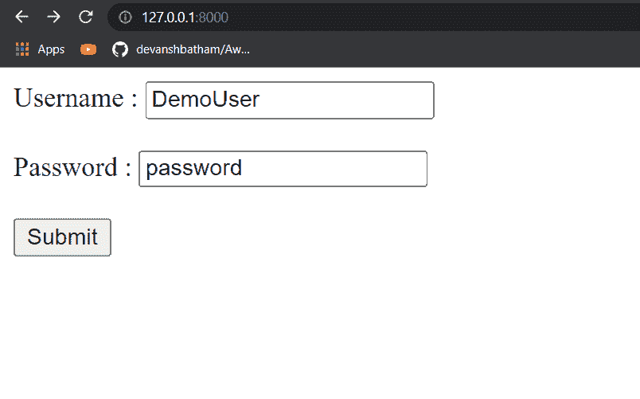
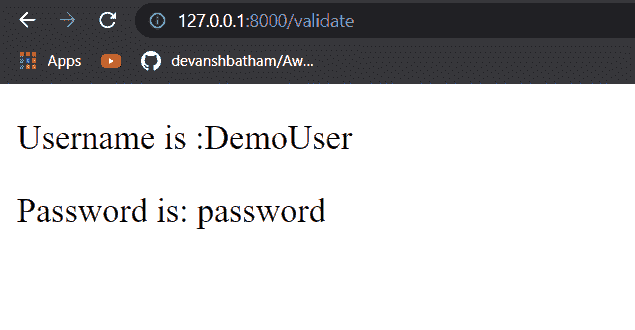
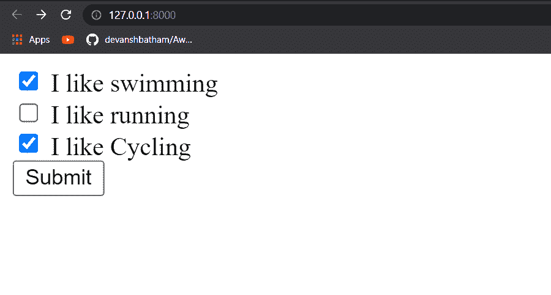
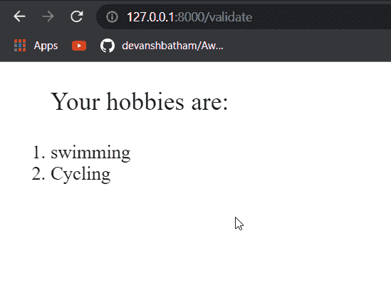
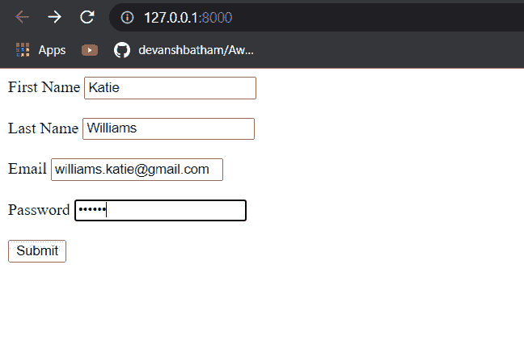
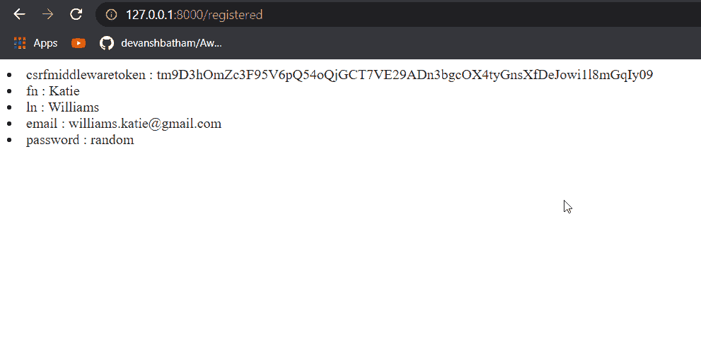
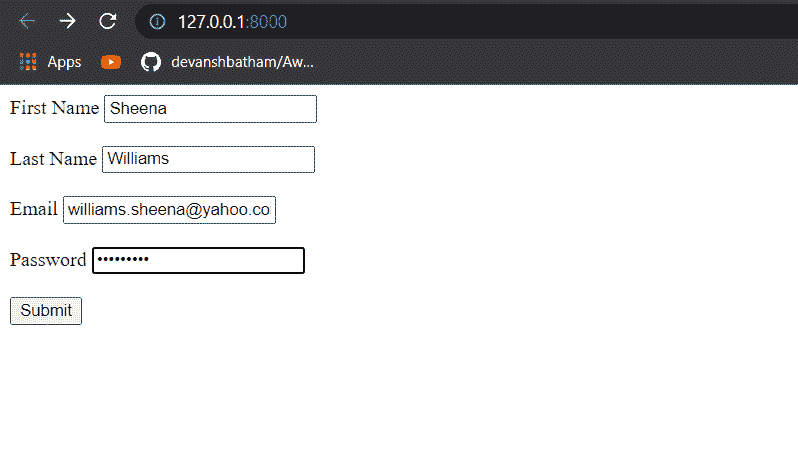
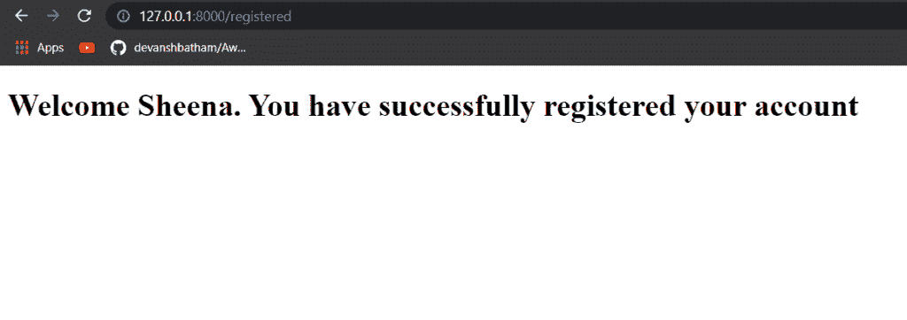
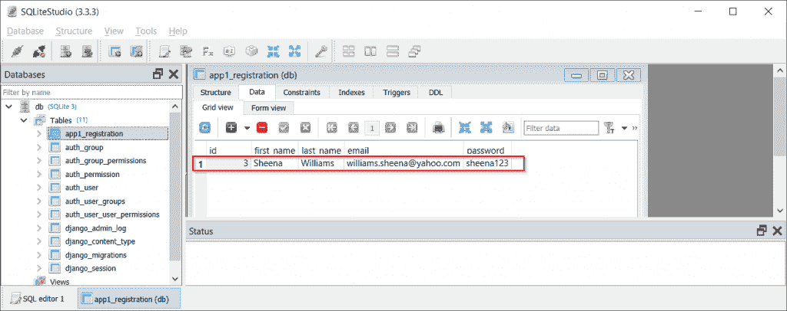

# Django 从 POST 请求中获取所有数据

> 原文：<https://pythonguides.com/django-get-all-data-from-post-request/>

[](https://sharepointsky.teachable.com/p/python-and-machine-learning-training-course)

在这个 [Python Django 教程](https://pythonguides.com/how-to-install-django/)中，我将解释如何通过各种方式**从 Python Django** 中的 POST 请求中获取数据。我将借助一些例子来说明这一点。

*   如何在 Django 中获取 POST 请求数据
*   Django 将发布数据传递给视图
*   Django post 请求示例
*   Django 获取发布数据列表
*   Django 将 POST 数据作为字典获取
*   Django 将数据发布到数据库

目录

[](#)

*   [如何在 Django 中获取 POST 请求数据](#How_to_get_POST_request_data_in_Django "How to get POST request data in Django")
*   [Django 将发布数据传递给视图](#Django_pass_POST_data_to_view "Django pass POST data to view")
*   [Django post 请求示例](#Django_post_request_example "Django post request example")
*   [Django 获取帖子数据列表](#Django_get_post_data_list "Django get post data list")
*   [Django 以字典的形式获取 POST 数据](#Django_get_POST_data_as_dict "Django get POST data as dict")
*   [Django 将数据发布到数据库](#Django_POST_data_to_database "Django POST data to database")

## 如何在 Django 中获取 POST 请求数据

当 Django 服务器收到 POST 请求时，可以使用 **HTTPRequest 检索请求中的数据。贴**字典。POST 请求主体的所有数据都存储在这个字典中。

例如，您可以在 view.py 文件中使用以下代码片段。

```py
def index(request):
   if request.method == 'POST'
      var = request.POST[<parameter name>]
```

假设上面的**索引**函数处理 POST 请求，一个参数值被存储在名为 `var` 的变量中。

之后，您可以在任何代码或模板中使用该值，或者将它存储在数据库中。

读取[获取 Django 中的 URL 参数](https://pythonguides.com/get-url-parameters-in-django/)

## Django 将发布数据传递给视图

创建 HTML 表单时，需要发送 POST 请求时，可以指定要发布的方法类型。

表单中定义的输入字段将数据传递给重定向的 URL。您可以在 urls.py 文件中定义此 URL。在这个 URLs 文件中，您可以定义在视图中创建的函数，并按照上面的方法访问 POST 数据。

你只需要使用 HTTPRequest。获取发布数据的发布对象。让我们借助一个例子来理解这一点。

阅读[使用 Python 中的 Django 将 HTML 页面转换为 PDF](https://pythonguides.com/convert-html-page-to-pdf-using-django/)

## Django post 请求示例

我创建了一个名为`index.html`的 Django 模板，包含两个输入字段。我将在这些输入字段中输入数据，并在另一个 Django 模板中呈现它。名为 index.html**的 Django 模板的源代码是:**

```py
<!DOCTYPE html>
<html lang="en">
<head>
    <meta charset="UTF-8">
    <meta http-equiv="X-UA-Compatible" content="IE=edge">
    <meta name="viewport" content="width=device-width, initial-scale=1.0">
    <title>Demo</title>
</head>
<body>
    <form action="validate" method="post">
        
        Username : <input type="text" name="user" ><br><br>
        Password : <input type="text" name = "pass"><br><br>
        <input type="submit" value="Submit">
    </form>
</body>
</html>
```

正如您在上面的代码中看到的，表单被重定向到一个名为 `validate` 的 URL 端点。我们必须在 urls.py 文件中定义这个 URL 端点。在我的例子中，urls.py 文件是:

```py
from django.contrib import admin
from django.urls import path
from . import views

urlpatterns = [
    path('admin/', admin.site.urls),
    path('', views.index, name = 'index'),
    path('validate', views.validate, name = 'validate')
]
```

使用上面定义的路径，当向指定的 URL 端点发出请求时， `views.py` 文件中名为 `validate` 的函数将被执行。让我们来看看**的观点. py** 文件:

```py
# importing the necessary libraries
from django.http import HttpResponse
from django.shortcuts import render

def index(request):
      return render(request, 'index.html')
def validate(request):
   if request.method == 'POST':
      username= request.POST["user"]
      password = request.POST["pass"]
      dict = {
         'username': username,
         'password': password
      }
      return render(request, 'validate.html', dict) 
```

在 `validate` 函数中，首先我们验证请求方法是否是 POST。然后我们获取 POST 请求值。之后，我们在另一个名为 validate.html**的 Django 模板中呈现这些值。**

在`validate.html`文件中，我们将访问这些值并将其呈现为:

```py
<!DOCTYPE html>
<html lang="en">
<head>
  <meta charset="UTF-8">
  <meta http-equiv="X-UA-Compatible" content="IE=edge">
  <meta name="viewport" content="width=device-width, initial-scale=1.0">
  <title>Login</title>
</head>
<body>
  <p>Username is :{{username}}</p>
  <p>Password is: {{password}}</p>
</body>
</html>
```

现在让我们打开第一个网页，即 index.html，并在文本框中输入一些值。



Submitting the values and sending a POST request

点击**提交**会将我们重定向到 validate.html**页面**，在那里我们可以看到我们的渲染值。



Rendering the POST request parameters in another template

因此，您可能已经理解了如何在 Django 中传递和检索 POST 请求参数。

阅读[如何从 Django](https://pythonguides.com/get-data-from-get-request-in-django/) 中的 get 请求获取数据

## Django 获取帖子数据列表

有时，您可能希望将参数作为列表从 HTML 表单传递到服务器。例如，您可能希望通过 HTML 页面中的复选框传递一组值。

在这种情况下，您必须为所有复选框指定相同的名称，并使用 **HTTPRequest 检索这些控件的列表。POST.getlist()** 函数。例如，看看下面的 HTML 页面:

```py
<!DOCTYPE html>
<html lang="en">
<head>
    <meta charset="UTF-8">
    <meta http-equiv="X-UA-Compatible" content="IE=edge">
    <meta name="viewport" content="width=device-width, initial-scale=1.0">
    <title>Demo</title>
</head>
<body>
    <form action="validate" method="post">
        
        <input type="checkbox" id="hobby1" name="hobby" value="swimming">
        <label for="hobby1"> I like swimming</label><br>
        <input type="checkbox" id="hobby2" name="hobby" value="running">
        <label for="vehicle2"> I like running</label><br>
        <input type="checkbox" id="hobby3" name="hobby" value="Cycling">
        <label for="vehicle3"> I like Cycling</label><br>

        <input type="submit" value="Submit">
    </form>
</body>
</html>
```

上面的 HTML 页面使用 POST 请求通过一个表单向 Django 服务器提交一个爱好列表。

当用户点击提交按钮时，会向端点' `/validate` '发出一个请求。现在，我们必须将这个端点与我们的 `urls.py` 文件中的函数进行映射，如下所示:

```py
from django.contrib import admin
from django.urls import path
from . import views

urlpatterns = [
    path('admin/', admin.site.urls),
    path('', views.index, name = 'index'),
    path('validate', views.validate, name = 'validate') 
```

在 `views.py` 文件中，我们将使用 **HTTPRequest。POST.getlist()** 函数从 POST 请求中检索值列表。

记住在这个函数中指定 HTML 控件的名称作为列表。例如，我在我的 HTML 页面中为所有复选框使用了名称 `hobby` 。在检索值列表时，我将在 getlist()函数中指定名称为 **hobby[]** ，如下所示:

```py
# importing the necessary libraries
from django.http import HttpResponse
from django.shortcuts import render

def index(request):
      return render(request, 'index.html')
def validate(request):
   if request.method == 'POST':
         hobbies = request.POST.getlist('hobby[]')
   return render(request, 'validate.html', {'hobbies':hobbies}) 
```

我在名为`validate.html`的 Django 模板中使用了一个循环来呈现值列表，如下所示:

```py
<!DOCTYPE html>
<html lang="en">
<head>
  <meta charset="UTF-8">
  <meta http-equiv="X-UA-Compatible" content="IE=edge">
  <meta name="viewport" content="width=device-width, initial-scale=1.0">
  <title>Login</title>
</head>
<body>
  <ol><p style="font-size: x-large;">Your hobbies are:<p>
    
      <li style="font-size: large;">{{hobby}}</li>
    
  </ol>
</body>
</html>
```

现在让我们看看输出。让我们启动我们的服务器:



Submitting values as a list

点击提交将把我们重定向到下一页。



Retrieved the parameters as a list

您可以看到输出中呈现了值列表。

这样，您可以从 HTML 页面传递一个值列表，并在 Django 应用程序中检索它。

阅读 [Python Django 长度过滤器](https://pythonguides.com/python-django-length-filter/)

## Django 以字典的形式获取 POST 数据

当您通过 POST 请求向 Django 应用程序提交数据或参数时，这些参数以类 `QueryDict` 的类似字典的对象的形式存储。

这个对象是一个类似字典的对象，也就是说，你可以使用字典对象的几乎所有功能。有关 QueryDict 类的更多信息，可以阅读 Django 官方文档。

让我给你看一个例子，在这里我将演示这个对象如何是一个类似字典的对象。我已经创建了一个示例注册页面，其源代码是:

```py
<!DOCTYPE html>
<html lang="en">
<head>
    <meta charset="UTF-8">
    <meta http-equiv="X-UA-Compatible" content="IE=edge">
    <meta name="viewport" content="width=device-width, initial-scale=1.0">
    <title>Login Page</title>
</head>
<body>
    <form action="registered" method="post">
        
        First Name  <input type="text" name ="fn" placeholder="Enter Your First Name" ><br><br>
        Last Name   <input type="text" name ="ln" placeholder="Enter Your Last Name" ><br><br>
        Email       <input type="email" name ="email"placeholder="Enter Your Email address" ><br><br>
        Password    <input type="password" name ="password" placeholder="Enter Your Password" ><br><br>
                    <input type="submit" value="Submit">
    </form>
</body>
</html>
```

单击 submit 按钮会将用户重定向到名为**“registered”**的端点。我已经用我的 `urls.py` 文件中的函数映射了这个端点，如下所示:

```py
from django.contrib import admin
from django.urls import path
from . import views

urlpatterns = [
    path('admin/', admin.site.urls),
    path('', views.index, name = 'index'),
    path('registered', views.registered, name= 'registered')
]
```

现在让我们来看看将在 `views.py` 文件中执行的函数:

```py
# importing the necessary libraries
from django.shortcuts import render

def index(request):
      return render(request, 'index.html')
def registered(request):
      data = request.POST.items()
      return render(request, 'registered.html', {'data':data})
```

在这里，您可以看到我正在检索参数，并将它们呈现在另一个 Django 模板中。我们将使用 for 循环在模板中检索 QueryDict 对象:

```py
<!DOCTYPE html>
<html lang="en">
<head>
  <meta charset="UTF-8">
  <meta http-equiv="X-UA-Compatible" content="IE=edge">
  <meta name="viewport" content="width=device-width, initial-scale=1.0">
  <title>Login</title>
</head>
<body>
    
    <li>{{keys}} : {{values}}</li>
    
</body>
</html>
```

现在让我们看看输出。让我们启动服务器并访问根目录。



Passing the POST parameters

现在让我们点击**提交**按钮，看看结果。



Rendering the parameter values

在这里，您可以看到所有参数值都已呈现，包括我们从注册表单发送的 CSRF 令牌。

由读取 [Python Django 组](https://pythonguides.com/python-django-group-by/)

## Django 将数据发布到数据库

在本节中，您将学习如何将来自 POST 请求的数据存储到数据库中。对于本教程，我将使用 SQLite 数据库，即 Django 提供的默认数据库。

要在 Django 中与数据库交互，您必须创建模型。要了解更多关于模型和如何创建模型的信息，你可以阅读我们关于如何在 Django 中创建模型的文章。

*   首先，我们将创建一个 HTML 表单，从这里我们将发送我们的 POST 数据到 Django 应用程序，比如文件名`index.html`。我们将把这个文件存储在 Django 项目的**模板**文件夹中。

```py
<!DOCTYPE html>
<html lang="en">
<head>
    <meta charset="UTF-8">
    <meta http-equiv="X-UA-Compatible" content="IE=edge">
    <meta name="viewport" content="width=device-width, initial-scale=1.0">
    <title>Login Page</title>
</head>
<body>
    <form action="registered" method="post">
        
        First Name  <input type="text" name ="fn" placeholder="Enter Your First Name" ><br><br>
        Last Name   <input type="text" name ="ln" placeholder="Enter Your Last Name" ><br><br>
        Email       <input type="email" name ="email"placeholder="Enter Your Email address" ><br><br>
        Password    <input type="password" name ="password" placeholder="Enter Your Password" ><br><br>
                    <input type="submit" value="Submit">
    </form>
</body>
</html>
```

*   表单的**动作**属性会将我们重定向到一个名为**的 URL 端点，该端点在 Django 应用程序中注册了**。我们需要在我们的 `urls.py` 文件中为这个端点创建一个映射，如下所示:

```py
from django.contrib import admin
from django.urls import path
from . import views

urlpatterns = [
    path('admin/', admin.site.urls),
    path('', views.index, name = 'index'),
    path('registered', views.registered, name= 'registered')
]
```

*   在我们的 `views.py` 文件中，我们已经用一个名为 `registered()` 的函数映射了这个 URL 端点。在这个函数中，我们将编写逻辑来将 POST 请求数据存储在数据库中。
*   但是在此之前，我们需要在应用程序中创建一个模型。要创建一个模型，打开 Django 应用程序的 `model.py` 文件。在我的例子中， **models.py 文件**看起来像这样:

```py
from django.db import models

class Registration(models.Model):
    first_name = models.CharField(max_length= 20)
    last_name = models.CharField(max_length= 20)
    email = models.EmailField(max_length= 40)
    password = models.CharField(max_length= 50) 
```

您可以看到，我们已经创建了一个带有一些字段的模型类。这个模型类将在数据库中创建一个名为 `app1_registration` 的表，其中 `app1` 是我的 Django 应用程序名， `registration` 是模型类的名称。

表格的结构将等同于:

```py
CREATE TABLE app1_registration (
    id         INTEGER      NOT NULL
                            PRIMARY KEY AUTOINCREMENT,
    first_name VARCHAR (20) NOT NULL,
    last_name  VARCHAR (20) NOT NULL,
    email      VARCHAR (40) NOT NULL,
    password   VARCHAR (50) NOT NULL
);
```

为了最终创建表，您需要运行两个命令。

```py
python manage.py makemigrations
```

定义数据库中的更改。

```py
python manage.py migrate
```

提交数据库中的更改。

一旦您迁移了数据库中的更改，您需要创建一个逻辑来将数据输入到这个数据库中。这将在 `views.py` 文件中完成。

```py
# importing the necessary libraries
from django.shortcuts import render
from app1.models import Registration
def index(request):
      return render(request, 'index.html')
def registered(request):
      first_name = request.POST['fn']
      last_name = request.POST['ln']
      email = request.POST['email']
      password = request.POST['password']

      person = Registration(first_name=first_name, last_name= last_name, email= email, password = password)
      person.save()   
      return render(request, 'registered.html', {'fn':first_name})
```

*   在视图文件中，首先我将从 POST 请求中检索数据。
*   然后，我将创建一个模型类的对象，并指定将存储在数据库中的值。
*   `save()` 函数将数据永久保存在数据库中。
*   之后，用户将被重定向到另一个 Django 模板 namd`registered.html`，在那里将显示一条欢迎消息。

```py
<!DOCTYPE html>
<html lang="en">
<head>
  <meta charset="UTF-8">
  <meta http-equiv="X-UA-Compatible" content="IE=edge">
  <meta name="viewport" content="width=device-width, initial-scale=1.0">
  <title>Login</title>
</head>
<body>
  <h1>Welcome {{fn}}. You have successfully registered your account</h1>
</body>
</html>
```

现在让我们测试我们的 Django 应用程序。运行 Django 服务器并打开根 URL。



Submitting the form values

我们将在表单输入字段中输入一些数据，然后单击**提交**。



The Welcome Page

您可以看到我们被成功重定向到欢迎页面。现在让我们看看这些值是否存储在数据库中。

我将使用 SQLite Studio 打开我的 SQLite 数据库文件。



Form data successfully stored in the database

您可以看到表单数据已成功存储在数据库中。

相关 Python Django 教程:

*   [Django for loop](https://pythonguides.com/django-for-loop/)
*   [Python Django get](https://pythonguides.com/python-django-get/)
*   [Python Django 过滤器](https://pythonguides.com/python-django-filter/)
*   [Django 模板中的 If 语句](https://pythonguides.com/if-statement-in-django-template/)
*   [Django 的应用程序和项目之间的差异](https://pythonguides.com/django-app-vs-project/)
*   [Python Django 获取管理员密码](https://pythonguides.com/python-django-get-admin-password/)

这样，您可以将 POST 请求的数据存储在 Django 应用程序的数据库中。

*   如何在 Django 中获取 POST 请求数据
*   Django 将发布数据传递给视图
*   Django post 请求示例
*   Django 获取发布数据列表
*   Django 将 POST 数据作为字典获取
*   Django 将数据发布到数据库

[Bijay Kumar](https://pythonguides.com/author/fewlines4biju/)

Python 是美国最流行的语言之一。我从事 Python 工作已经有很长时间了，我在与 Tkinter、Pandas、NumPy、Turtle、Django、Matplotlib、Tensorflow、Scipy、Scikit-Learn 等各种库合作方面拥有专业知识。我有与美国、加拿大、英国、澳大利亚、新西兰等国家的各种客户合作的经验。查看我的个人资料。

[enjoysharepoint.com/](https://enjoysharepoint.com/)[](https://www.facebook.com/fewlines4biju "Facebook")[](https://www.linkedin.com/in/fewlines4biju/ "Linkedin")[](https://twitter.com/fewlines4biju "Twitter")