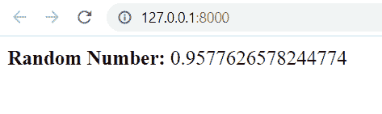

# Python Django 随机数

> 原文：<https://pythonguides.com/django-random-number/>

[](https://sharepointsky.teachable.com/p/python-and-machine-learning-training-course)

在这个 [Django 教程](https://pythonguides.com/what-is-python-django/)中，我们将学习 **Python Django 随机数**。我们还会在 Django 中看到与随机数相关的不同例子。我们将在本教程中讨论以下主题:

*   随机数是什么
*   生成随机数的函数
*   Django 随机数在视图中
*   模板中的 Django 随机数

目录

[](#)

*   [随机数是什么](#What_is_the_random_number "What is the random number")
*   [生成随机数的函数](#Functions_to_generate_random_number "Functions to generate random number")
*   [Django 视图中的随机数](#Django_random_number_in_view "Django random number in view")
*   [模板中的 Django 随机数](#Django_random_number_in_template "Django random number in template")
    *   [使用内置模板过滤器](#Using_built-in_template_filter "Using built-in template filter")
    *   [使用自定义标签](#Using_Custom_tag "Using Custom tag")

## 随机数是什么

在这一节中，我们将学习什么是随机数，以及如何在 Django 中使用随机概念。

**随机数**是从一组没有明确模式可预测的有限或无限数字中随机选择的数字。池中几乎所有的数字都互不相关。另一方面，数字的集合可以遵循特定的分布。

例如，学校里孩子的体重分布倾向于遵循体重中位数的正态分布。如果一个学生的体重是随机选择的，它更有可能接近体重中位数，而不是被归类为超重或体重不足。

随机数生成器假定生成的数字彼此独立，并且它们将在整个可能值的大范围内均匀分布。

**随机数**用于各种 Django 应用，包括密码学、密码生成、彩票号码生成、故事的随机生成、统计采样、完全随机化设计、计算机模拟以及任何其他需要不可预测随机数的应用。

阅读:[使用 Django 将 HTML 页面转换为 PDF](https://pythonguides.com/convert-html-page-to-pdf-using-django/)

## 生成随机数的函数

在这一节中，我们将介绍一些最常用的生成随机数的 Python 函数。Python 中的**随机模块**定义了一组用于生成和操作随机整数的函数。

*   **choice()函数:**Python 编程语言有一个名为 choose()的内置方法，它从列表、元组或字符串中返回一个随机项。
*   **randrange(start，end，step):**random 模块有一个名为 randrange 的函数，可以从特定的范围产生随机整数，同时也允许特定的空间范围。
*   **random():** 该函数生成一个小于 1 且大于等于 0 的浮点随机整数。
*   **uniform(下限，上限):**该函数在输入中指定的值之间生成一个浮点随机数。它有两个参数:包含在层代中的下限和不包含在层代中的上限。
*   **randint(start，stop):** 该方法返回从指定范围中选择的整数元素。它包括起止号码。

阅读:[获取 Django 中的 URL 参数](https://pythonguides.com/get-url-parameters-in-django/)

## Django 视图中的随机数

在这一节中，我们将学习使用 Django 中的视图生成随机数。因此，我们通过使用各种例子来阐明我们的概念。

在开始演示之前，我将向您展示**项目的 urls.py** 文件。因为它在所有的例子中保持不变。

```py
from django.contrib import admin
from django.urls import path, include

urlpatterns = [
    path('admin/', admin.site.urls),
    path('', include('home.urls'))
]
```

这意味着当您在浏览器中打开项目时，它会将您带到 home.urls。

现在，请看**主页的 urls.py** 文件:

```py
from django.urls import path, include
from home import views

urlpatterns = [
    path('', views.home, name='home')
]
```

它会移动到 home 应用程序的 `views.py` 文件。

**例#1**

`views.py` 文件:

```py
from django.http import HttpResponse
import random

# Create your views here.
def home(request):
    my_list = [1, 2, 3, 4, 5, 6]
    rand_num = random.choice(my_list)
    html = "<html><body><b>Random Number:</b> %s</body></html>" % rand_num
    return HttpResponse(html) 
```

*   在上面的例子中，我们已经导入了**随机**方法。接下来，我们创建了一个名为 `home` 的视图。
*   在这个视图中，我们使用 `random.choice()` 方法从列表中获取随机数，并将该值存储在一个 `rand_num` 变量中。然后，我们使用变量将随机数值作为 HTTP 响应返回。

现在，如果我们运行开发服务器，我们将得到以下输出。每次我们刷新浏览器页面，都会得到一个不同的数字。


Random Number


Random Number

**例 2**

`views.py` 文件:

```py
from django.http import HttpResponse
import random

# Create your views here.
def home(request):
    rand_num = random.randrange(1, 100)
    html = "<html><body><b>Random Number:</b> %s</body></html>" % rand_num
    return HttpResponse(html)
```

*   在这个例子中，我们已经导入了**随机**方法。接下来，我们创建了一个名为 home 的视图。
*   在这个视图中，我们使用 `randrange()` 方法从指定的范围中获取随机数，并将该值存储在一个变量中。然后，我们使用变量将随机数值作为 HTTP 响应返回。

输出如下所示:


Random Number

**例 3**

`views.py` 文件:

```py
from django.http import HttpResponse
import random

# Create your views here.
def home(request):
    rand_num = random.random()
    html = "<html><body><b>Random Number:</b> %s</body></html>" % rand_num
    return HttpResponse(html) 
```

在这个视图中，我们使用了 `random()` 方法来获取随机数并将值存储在一个变量中。然后，我们使用变量将随机数值作为 HTTP 响应返回。

输出如下所示:



Random Number

阅读:[如何从 Django 的 get 请求中获取数据](https://pythonguides.com/get-data-from-get-request-in-django/)

## 模板中的 Django 随机数

在这一节中，我们将学习使用 Django 中的模板生成随机数。我们可以通过两种方式使用模板标签生成随机数:

*   使用内置模板过滤器
*   使用自定义标签

### 使用内置模板过滤器

在 Django 中，我们有一个内置的过滤器引用 `random` ，它从给定的系列中返回一个随机项。它的工作原理与 python 的 `choice()` 方法相同。

**模板过滤随机:**

```py
{{ value | random }}
```

所以，我们用不同的例子来阐明我们的概念。

在我开始演示之前，我会给你看一下**项目的 urls.py** 和**应用的 urls.py** 文件。因为它在所有的例子中保持不变。

**项目的 urls.py** 文件:

```py
from django.contrib import admin
from django.urls import path, include

urlpatterns = [
    path('admin/', admin.site.urls),
    path('', include('myapp.urls'))
]
```

这意味着当你在浏览器中打开你的项目时，它会带你到你的 `myapp.urls.`

现在，请看 `myapp urls.py` 文件:

```py
from django.urls import path, include
from myapp import views

urlpatterns = [
    path('', views.myapp, name='myapp')
```

它移动到 myapp 应用程序的 `views.py` 文件。

**例#1**

`views.py` 文件:

```py
from django.shortcuts import render

# Create your views here.

my_list = ['abc','def','ghi','abcd','as$25l6']

def myapp(request):    
    return render(request, 'home.html', {'my_list':my_list})
```

首先，我们将创建一个重定向到 HTML 页面的视图。在 views.py 文件中，我们定义列表并将列表值重定向到`home.html`页面。

`home.html`文件:

```py
<!DOCTYPE html>
<html lang="en">
<head>
    <meta charset="UTF-8">
    <meta http-equiv="X-UA-Compatible" content="IE=edge">
    <meta name="viewport" content="width=device-width, initial-scale=1.0">
    <title>PythonGuides</title>
</head>
<body>
    <p>
        <b> Random Generator : </b> {{my_list|random}}    
    </p> 
</body>
</html>
```

接下来，我们将把**【随机】**过滤器添加到【home.html】文件**中，以获得结果。**


Random Generator


Random Generator

**例 2**

`views.py` 文件:

```py
from django.shortcuts import render

# Create your views here.

my_series = ['124dsvb@#','def%^569$#','ghi496o)%@5','897563214','as$25l6']

def myapp(request):    
    return render(request, 'home.html', {'my_series':my_series})
```

首先，我们将创建一个重定向到 HTML 页面的视图。在 views.py 文件中，我们定义列表并将列表值重定向到`home.html`页面。

`home.html`文件:

```py
<!DOCTYPE html>
<html lang="en">
<head>
    <meta charset="UTF-8">
    <meta http-equiv="X-UA-Compatible" content="IE=edge">
    <meta name="viewport" content="width=device-width, initial-scale=1.0">
    <title>PythonGuides</title>
</head>
<body>
    <p>
        <b> Random Generator : </b> {{my_series|random}}    
    </p> 
</body>
</html>
```

接下来，我们将把**【随机】**过滤器添加到【home.html】文件**中，以获得结果。**


Random Number

阅读[比较 Python Django 中的两个整数](https://pythonguides.com/compare-two-integers-in-python-django/)

### 使用自定义标签

现在，我们将学习使用自定义标签生成一个随机数。因此，首先我们必须创建一个自定义标签。所以，让我们从不同的例子来学习这个概念。

**例#1**

这里我在 **app 的目录**下的 **templatetags 目录**下创建一个 `custom_tag.py` **文件**。

`custom_tag.py` 文件:

```py
import random
from django import template

register = template.Library()

@register.simple_tag
def random_int(start, stop):
    return random.randint(start, stop)
```

这里我创建了一个名为 `random_number` 的标签。而在这之后， `random.randint()` 方法被用来生成一个开始和停止之间的随机数。

`views.py` 文件:

```py
from django.shortcuts import render

# Create your views here.

def myapp(request):    
    return render(request, 'home.html') 
```

首先，我们将创建一个重定向到 HTML 页面的视图。在 views.py 文件中，我们将定义一个代码来重定向到`home.html`页面。

`home.html`文件:

```py
<!Load Custom Tag>



<!DOCTYPE html>
<html lang="en">
<head>
    <meta charset="UTF-8">
    <meta http-equiv="X-UA-Compatible" content="IE=edge">
    <meta name="viewport" content="width=device-width, initial-scale=1.0">
    <title>PythonGuides</title>
</head>
<body>
    <p>
        <b> Random Generator : </b>     
    </p> 
</body>
</html>
```

现在，在 home.html 文件中，我将首先加载标记名 custom_tag。

**加载标签命令:**

```py

```

接下来，我使用之前创建的 random_number 标记。这里我传递 100 和 1000 作为开始和停止值。

现在，如果我们运行开发服务器，我们将得到以下输出。


Random Number


Random Number

**例 2**

这里我在 **app 的目录**下的 **templatetags 目录**下创建一个 `random_tag.py` **文件**。

`random_tag.py` 文件:

```py
import random
from django import template

register = template.Library()

@register.simple_tag
def rand_num(lower_limit, upper_limit):
    return random.uniform(lower_limit, upper_limit)
```

这里我创建了一个名为 `rand_num` 的标签。而在这之后，**【random . uniform()】**的方法被用来生成一个介于下限和上限之间的随机数。

`views.py` 文件:

```py
from django.shortcuts import render

# Create your views here.

def myapp(request):    
    return render(request, 'random.html') 
```

首先，我们将创建一个重定向到 HTML 页面的视图。在 views.py 文件中，我们将定义一个代码来重定向到`random.html`页面。

`random.html`文件:

```py
<!Load Custom Tag>



<!DOCTYPE html>
<html lang="en">
<head>
    <meta charset="UTF-8">
    <meta http-equiv="X-UA-Compatible" content="IE=edge">
    <meta name="viewport" content="width=device-width, initial-scale=1.0">
    <title>PythonGuides</title>
</head>
<body>
    <p>
        <b> Random Generator : </b>     
    </p> 
</body>
</html>
```

现在，在 random.html 文件中，我将首先加载标记名 random_tag。接下来，我使用前面创建的 rand_num 标记。这里我传递 10 和 20 作为下限和上限。

现在，如果我们运行开发服务器，我们将得到以下输出。


Random Number

你可能也喜欢阅读下面的 Django 教程。

*   [Python Django 长度过滤器](https://pythonguides.com/python-django-length-filter/)
*   [Python Django vs ReactJS](https://pythonguides.com/django-vs-reactjs/)
*   [Python Django group by](https://pythonguides.com/python-django-group-by/)
*   [使用 PostgreSQL 的 Django CRUD 示例](https://pythonguides.com/django-crud-example-with-postgresql/)
*   [将 Python 输出到 html Django](https://pythonguides.com/outputting-python-to-html-django/)

在本 Django 教程中，我们讨论了 Python Django 随机数。此外，我们还讨论了以下主题列表:

*   随机数是什么
*   生成随机数的函数
*   Django 随机数在视图中
*   模板中的 Django 随机数

[Bijay Kumar](https://pythonguides.com/author/fewlines4biju/)

Python 是美国最流行的语言之一。我从事 Python 工作已经有很长时间了，我在与 Tkinter、Pandas、NumPy、Turtle、Django、Matplotlib、Tensorflow、Scipy、Scikit-Learn 等各种库合作方面拥有专业知识。我有与美国、加拿大、英国、澳大利亚、新西兰等国家的各种客户合作的经验。查看我的个人资料。

[enjoysharepoint.com/](https://enjoysharepoint.com/)[](https://www.facebook.com/fewlines4biju "Facebook")[](https://www.linkedin.com/in/fewlines4biju/ "Linkedin")[](https://twitter.com/fewlines4biju "Twitter")