# Python Django 四舍五入到两位小数

> 原文：<https://pythonguides.com/django-round-to-two-decimal-places/>

[](https://sharepointsky.teachable.com/p/python-and-machine-learning-training-course)

在这个 [Python Django 教程](https://pythonguides.com/how-to-install-django/)中，我们将学习**如何在 Django** 中四舍五入到两位小数。我们还会看到与此相关的例子。这些是我们将在本教程中讨论的以下主题。

*   Python Django 四舍五入到两位小数
*   Python Django 四舍五入到两位小数基本命令
*   Python Django 四舍五入到两位小数 view- round()函数
*   Python Django 四舍五入到两位小数 view- format()函数
*   Python Django 四舍五入到两位小数视图- %格式
*   Python Django 四舍五入到两位小数 view- ceil()函数
*   Python Django 四舍五入到两位小数 view- floor()函数
*   Python Django 四舍五入到两位小数视图-十进制模块

目录

[](#)

*   [Python Django 四舍五入到两位小数](#Python_Django_round_to_two_decimal_places "Python Django round to two decimal places")
*   [Python Django 四舍五入到小数点后两位基本命令](#Python_Django_round_to_two_decimal_places_basic_commands "Python Django round to two decimal places basic commands")
*   [Python Django 四舍五入到两位小数 view- round()函数](#Python_Django_round_to_two_decimal_places_view-_round_function "Python Django round to two decimal places view- round() function")
*   [Python Django 四舍五入到两位小数 view- format()函数](#Python_Django_round_to_two_decimal_places_view-_format_function "Python Django round to two decimal places view- format() function")
*   [Python Django 四舍五入到两位小数视图- %格式化](#Python_Django_round_to_two_decimal_places_view-_formatting "Python Django round to two decimal places view- % formatting")
*   [Python Django 四舍五入到小数点后两位 view- ceil()函数](#Python_Django_round_to_two_decimal_places_view-_ceil_function "Python Django round to two decimal places view- ceil() function")
*   [Python Django 四舍五入到小数点后两位 view- floor()函数](#Python_Django_round_to_two_decimal_places_view-_floor_function "Python Django round to two decimal places view- floor() function")
*   [Python Django 四舍五入到两位小数视图-十进制模块](#Python_Django_round_to_two_decimal_places_view-_decimal_module "Python Django round to two decimal places view- decimal module")

## Python Django 四舍五入到两位小数

在本节中，我们将学习四舍五入到两位小数的基本知识。

浮点数分为两部分:整数部分和小数部分。它们用小数点分开。

**举例:** 12.36，459.65，885.3 等为浮动值。

**四舍五入小数位的规则:**

如果给出了小数点后的数字

*   **大于等于 5:** 然后最终值加 1。
*   **小于 5:** 那么将返回最终数字，因为它达到了指定的小数位。

**四舍五入小数位的方法:**

以下是四舍五入小数位数的不同方法。

*   round()函数
*   format()函数
*   ceil()函数
*   floor()函数
*   十进制模块

阅读 [Python Django 在哪里保存所有应用的基础模板](https://pythonguides.com/django-where-to-save-base-template-for-all-apps/)

## Python Django 四舍五入到小数点后两位基本命令

在本节中，我们将学习四舍五入两位小数的基本命令。

**创建项目:** 首先，我们需要创建一个 Django 项目。为此，请在终端中键入以下命令。

```py
django-admin startproject Employee
```

*   这里，**雇员**是 Django 项目的名称。

**创建 APP:** 然后，我们来创建一个 Django App。为此，请在终端中键入以下命令。

```py
python manage.py startapp Salary
```

*   这里，**工资**是 Django App 的名字。

**安装 APP:** 现在，将上面创建的 APP 包含在 settings.py 文件中。

```py
INSTALLED_APPS = [
    'django.contrib.admin',
    'django.contrib.auth',
    'django.contrib.contenttypes',
    'django.contrib.sessions',
    'django.contrib.messages',
    'django.contrib.staticfiles',
    'Salary',
]
```

**创建模板:** 然后创建名为 TEMPLATES 的文件夹。并且，在文件夹中添加 HTML 文件。

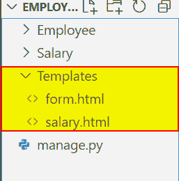

Python Django round to two decimal places

**添加模板:** 现在，将这个文件夹添加到 settings.py 文件中的 TEMPLATES 文件夹中。

```py
DIRS : ['Templates']
```

**项目 URL:**在 Employee 的 urls.py 文件中添加以下代码。

```py
from django.contrib import admin
from django.urls import path, include

urlpatterns = [
    path('admin/', admin.site.urls),
    path('', include('Salary.urls'))
]
```

**APP 网址:** 在工资的 urls.py 文件中添加以下代码。

```py
from django.urls import path
from . import views
urlpatterns = [
path('', views.EmpSalary, name='EmpSalary'),
]
```

**创建表单:** 现在，将下面的代码添加到薪资 app 的 forms.py 文件中，创建表单。

```py
from django import forms

class EmpSalaryForm(forms.Form):
    Name = forms.CharField()
    Designation = forms.CharField()
    Salary = forms.IntegerField()
    Tax = forms.FloatField()
```

*   这里，我们创建一个 `EmpSalaryForm` 表单类，它有两个字符字段、一个整数字段和一个浮点值字段。

**【form.html】**:将以下代码添加到 form.html 文件中以创建一个表单。

```py
<!DOCTYPE html>  
<html lang="en">  
<head>  
    <meta charset="UTF-8">  
    <title>Index</title>  
</head>  
<body>  
<form method="POST" class="post-form" enctype="multipart/form-data">  
          
        {{ form.as_p }}  
        <button type="submit" class="save btn btn-default">Submit</button>  
</form>  
</body>  
</html> 
```

*   这里，我们使用 `form.as_p` 标签将 Django 表单呈现为一个段落。

**salary.html:** 将下面的代码添加到【salary.html】的文件中。

```py
<!DOCTYPE html>
<html lang="en">
<head>
    <meta charset="UTF-8">
    <meta http-equiv="X-UA-Compatible" content="IE=edge">
    <meta name="viewport" content="width=device-width, initial-scale=1.0">
    <title>Document</title>
</head>
<body>
    <p>
       <b>Tax amount round to two decimal : </b> {{RoundTax}}
    </p>
</body>
</html>
```

阅读:[使用 PostgreSQL 的 Django CRUD 示例](https://pythonguides.com/django-crud-example-with-postgresql/)

## Python Django 四舍五入到两位小数 view- round()函数

在这一节中，我们将学习使用 round()方法四舍五入到两位小数。

**例**:使用 `round()` 函数。

**创建视图:** 在 `views.py` 文件中添加以下代码。

```py
from django.shortcuts import render
from Salary.forms import EmpSalaryForm

def EmpSalary(request):  
    if request.method == "POST":  
        form = EmpSalaryForm(request.POST)  
        if form.is_valid():  
            Name = form.cleaned_data['Name']
            Designation = form.cleaned_data['Designation']
            Salary = form.cleaned_data['Salary']
            Tax = form.cleaned_data['Tax']
            RoundTax = round(Tax,2)
            return render(request, 'salary.html', {'RoundTax':RoundTax})
    else:  
        form = EmpSalaryForm()  
    return render(request,'form.html',{'form':form}) 
```

*   `round()` 函数是一个内置的 python 函数。
*   它用于返回一个已舍入到所提供的小数位数的浮点值。
*   **Synatx:**
    *   四舍五入(数字，数位)
*   如果省略 digit 参数，则返回与给定数字最接近的整数；否则，该数字将被舍入到给定的数字值。

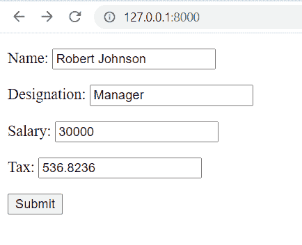

Python Django round to two decimal places views

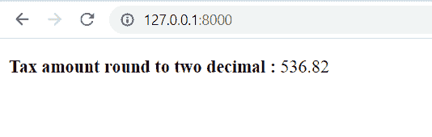

Django round to two decimal places views-round()

阅读: [Python Django app 上传文件](https://pythonguides.com/django-app-upload-files/)

## Python Django 四舍五入到两位小数 view- format()函数

在这一节中，我们将学习使用 format()方法四舍五入到两位小数。

**例**:使用**格式()**函数。

**创建视图:** 在 `views.py` 文件中添加以下代码。

```py
from django.shortcuts import render
from Salary.forms import EmpSalaryForm

def EmpSalary(request):  
    if request.method == "POST":  
        form = EmpSalaryForm(request.POST)  
        if form.is_valid():  
            Name = form.cleaned_data['Name']
            Designation = form.cleaned_data['Designation']
            Salary = form.cleaned_data['Salary']
            Tax = form.cleaned_data['Tax']
            RoundTax =("{:0.2f}".format(Tax))
            return render(request, 'salary.html', {'RoundTax':RoundTax})
    else:  
        form = EmpSalaryForm()  
    return render(request,'form.html',{'form':form}) 
```

*   我们使用 `format()` 函数将数字向上舍入，给出的字符串格式为。 `2f` 。
*   此格式中的 `f` 表示浮点值， `.2` 指定该值必须有两位小数。
*   句法

```py
"{:0.2f}".format(number)
```

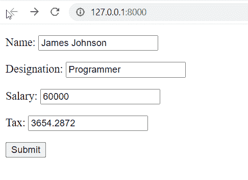

Python Django round to two decimal places view-format() function

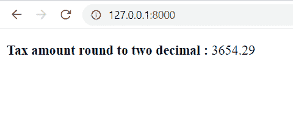

Django round to two decimal places view-format() function

阅读: [Python 过滤器不在 Django 中](https://pythonguides.com/filter-not-in-django/)

## Python Django 四舍五入到两位小数视图- %格式化

在这一节中，我们将学习使用%格式四舍五入到两位小数。

**例**:使用 **%** 格式。

**创建视图:** 在 `views.py` 文件中添加以下代码。

```py
from django.shortcuts import render
from Salary.forms import EmpSalaryForm

def EmpSalary(request):  
    if request.method == "POST":  
        form = EmpSalaryForm(request.POST)  
        if form.is_valid():  
            Name = form.cleaned_data['Name']
            Designation = form.cleaned_data['Designation']
            Salary = form.cleaned_data['Salary']
            Tax = form.cleaned_data['Tax']
            RoundTax =("%.2f" %Tax)
            return render(request, 'salary.html', {'RoundTax':RoundTax})
    else:  
        form = EmpSalaryForm()  
    return render(request,'form.html',{'form':form}) 
```

*   为了得到格式化的输出，我们可以使用 **%** 来代替 `format()` 函数。
*   它类似于 print 函数中的格式说明符。
*   只需使用带有 **%.2f** 的格式向下舍入到两位小数。
*   语法:

```py
"%.2f" % number
```

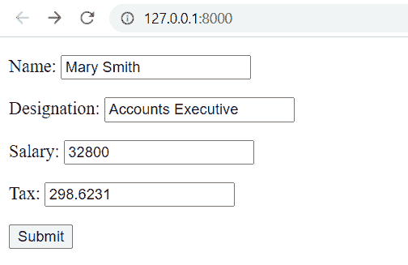

Python Django round to two decimal places view % formatting

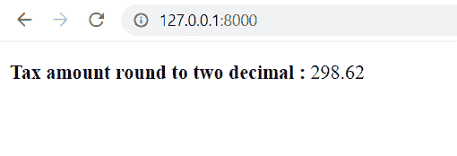

Django round to two decimal places view % formatting

阅读: [Python Django 获取枚举选择](https://pythonguides.com/python-django-get-enum-choices/)

## Python Django 四舍五入到小数点后两位 view- ceil()函数

在这一节中，我们将学习使用 ceil()函数四舍五入到两位小数。

**例**:使用 `ceil()` 方法。

**创建视图:** 在 `views.py` 文件中添加以下代码。

```py
from math import ceil
from django.shortcuts import render
from Salary.forms import EmpSalaryForm

def EmpSalary(request):  
    if request.method == "POST":  
        form = EmpSalaryForm(request.POST)  
        if form.is_valid():  
            Name = form.cleaned_data['Name']
            Designation = form.cleaned_data['Designation']
            Salary = form.cleaned_data['Salary']
            Tax = form.cleaned_data['Tax']
            RoundTax = ceil(Tax*100)/100
            return render(request, 'salary.html', {'RoundTax':RoundTax})
    else:  
        form = EmpSalaryForm()  
    return render(request,'form.html',{'form':form}) 
```

*   Python 数学模块中的 `ceil()` 函数可以对任何值进行舍入。
*   此模块中的 `ceil()` 函数返回大于或等于传递给它的值的最小整数。
*   要使用它们的两位小数，先将数字乘以 `100` 来移动小数点，然后除以 `100` 来补偿。
*   最终结果将用 `ceil()` 函数取整。
*   语法:

```py
from math import ceil
ceil(number*100)/100
```

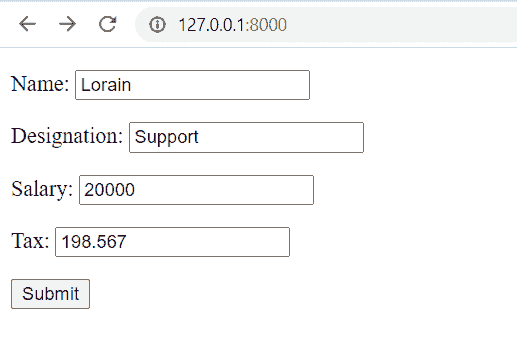

Python Django round to two decimal places view ceil function

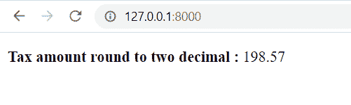

Django round to two decimal places view ceil function

阅读:[输出 Python 到 html Django](https://pythonguides.com/outputting-python-to-html-django/)

## Python Django 四舍五入到小数点后两位 view- floor()函数

在本节中，我们将学习使用 `floor` 函数四舍五入到两位小数。

**例**:使用 `floor()` 法。

**创建视图:** 在 `views.py` 文件中添加以下代码。

```py
from math import floor
from django.shortcuts import render
from Salary.forms import EmpSalaryForm

def EmpSalary(request):  
    if request.method == "POST":  
        form = EmpSalaryForm(request.POST)  
        if form.is_valid():  
            Name = form.cleaned_data['Name']
            Designation = form.cleaned_data['Designation']
            Salary = form.cleaned_data['Salary']
            Tax = form.cleaned_data['Tax']
            RoundTax = floor(Tax*100)/100
            return render(request, 'salary.html', {'RoundTax':RoundTax})
    else:  
        form = EmpSalaryForm()  
    return render(request,'form.html',{'form':form}) 
```

*   `floor()` 函数返回小于或等于指定值的最大数字。
*   如果我们使用 `floor()` 函数，最终结果将被四舍五入。
*   语法:

```py
from math import floor
floor(number*100)/100
```

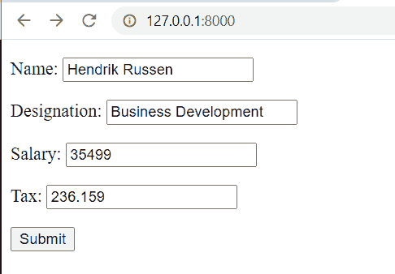

Python Django round to two decimal places view floor function

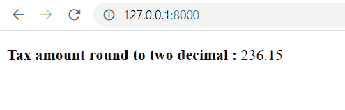

Django round to two decimal places view floor function

阅读: [Python Django 随机数](https://pythonguides.com/django-random-number/)

## Python Django 四舍五入到两位小数视图-十进制模块

在本节中，我们将学习使用 `decimal` 模块四舍五入到两位小数。

**例**:用**小数()**法。

**创建视图:** 在 `views.py` 文件中添加以下代码。

```py
from decimal import ROUND_HALF_DOWN, Decimal
from django.shortcuts import render
from Salary.forms import EmpSalaryForm

def EmpSalary(request):  
    if request.method == "POST":  
        form = EmpSalaryForm(request.POST)  
        if form.is_valid():  
            Name = form.cleaned_data['Name']
            Designation = form.cleaned_data['Designation']
            Salary = form.cleaned_data['Salary']
            Tax = form.cleaned_data['Tax']
            RoundTax = Decimal(Tax.quantize(Decimal('.01'), rounding = ROUND_HALF_DOWN))
            return render(request, 'salary.html', {'RoundTax':RoundTax})
    else:  
        form = EmpSalaryForm()  
    return render(request,'form.html',{'form':form}) 
```

*   Python 有一个 decimal 模块，它有几个处理十进制值的函数。
*   它可用于将浮点值四舍五入到两位小数。
*   **“四舍五入”**方法通过四舍五入到最接近的数字来达到所需的精度。

**注:**

如果要执行精度计算，请将该字段设置为 decimal 否则，将会产生错误。

**举例:**

```py
Tax=form.DecimalField()
```

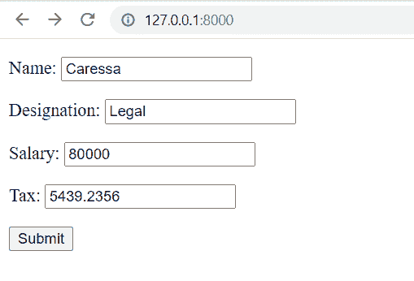

Python Django round to two decimal places view decimal module

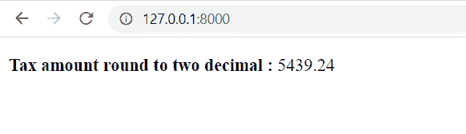

Django round to two decimal places view decimal module

另外，看看更多的 Python Django 教程。

*   [Python 改 Django 版本](https://pythonguides.com/python-change-django-version/)
*   [Python Django vs 金字塔](https://pythonguides.com/python-django-vs-pyramid/)
*   [Python Django 长度过滤器](https://pythonguides.com/python-django-length-filter/)
*   [获取姜戈的当前时间](https://pythonguides.com/how-to-get-current-time-in-django/)

在本教程中，我们已经讨论了“ `Python Django** `四舍五入到两位小数**”，我们还讨论了本教程中的以下主题。

*   Python Django 四舍五入到两位小数
*   Python Django 四舍五入到两位小数基本命令
*   Python Django 四舍五入到两位小数 view- round()函数
*   Python Django 四舍五入到两位小数 view- format()函数
*   Python Django 四舍五入到两位小数视图- %格式
*   Python Django 四舍五入到两位小数 view- ceil()函数
*   Python Django 四舍五入到两位小数 view- floor()函数
*   Python Django 四舍五入到两位小数视图-十进制模块

[Bijay Kumar](https://pythonguides.com/author/fewlines4biju/)

Python 是美国最流行的语言之一。我从事 Python 工作已经有很长时间了，我在与 Tkinter、Pandas、NumPy、Turtle、Django、Matplotlib、Tensorflow、Scipy、Scikit-Learn 等各种库合作方面拥有专业知识。我有与美国、加拿大、英国、澳大利亚、新西兰等国家的各种客户合作的经验。查看我的个人资料。

[enjoysharepoint.com/](https://enjoysharepoint.com/)[](https://www.facebook.com/fewlines4biju "Facebook")[](https://www.linkedin.com/in/fewlines4biju/ "Linkedin")[](https://twitter.com/fewlines4biju "Twitter")