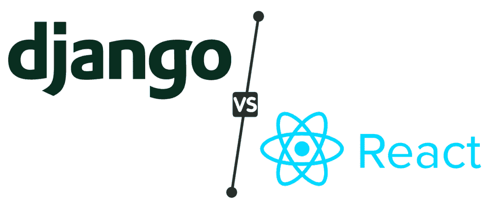

# Python Django vs ReactJS

> 原文：<https://pythonguides.com/django-vs-reactjs/>

Django 是一个用于创建 Web 应用程序的 Python 框架，专注于快速开发和架构清晰。 `React` 则称其为“用 JavaScript 编写的用户界面库”。在姜戈语中，大多数人用**反应**来代表 `MVT` 中的**“V**。

所以在本文中，我们将讨论 Django 和 React 之间的一些关键区别。我们也会试着找出何时选择哪一个。以下是本文所涵盖主题的完整概述。

*   Django 简介
*   ReactJS 简介
*   ReactJS 的优势
*   反应堆的缺点
*   与 Django 联系的优势
*   与 Django 联系的缺点
*   Django vs ReactJS
*   结论

Django vs ReactJS

目录

*   [Django 简介](#Introduction_to_Django "Introduction to Django")
*   [react js 简介](#Introduction_to_ReactJS "Introduction to ReactJS")
*   [反应堆的优点](#Advantages_of_ReactJS "Advantages of ReactJS")
*   [反应堆的缺点](#Disadvantages_of_ReactJS "Disadvantages of ReactJS")
*   与 Django 合作的优势
*   [与 Django 进行交易的劣势](#Disadvantage_of_ReactJS_with_Django "Disadvantage of ReactJS with Django")
*   Django vs ReactJS
*   [结论](#Conclusion "Conclusion")

## Django 简介

Django 是一个高级 Python web 框架，它允许程序员使用模块来加速开发。开发者可以使用 Django 的模块直接从现有资源创建应用和网站。

为了大大加快开发过程，Django 消除了从头开始的需要。当您使用 Django 创建后端 web 应用程序时，您可以使用它的表述性状态转移(REST)架构来创建定制的 API。

现在如果想深入了解 Django，还可以参考下面这篇文章“ [什么是 Python Django，用于](https://pythonguides.com/what-is-python-django/) ”。

## react js 简介

React 是顶级的基于 JavaScript 的 UI 开发库之一。它用最少的编码和工作创建现代 web 应用程序。因为 React 是一个库而不是一门语言，所以它被绝大多数 web 开发者所使用。

它通过将每个页面分成许多部分来简化用户界面的创建。这些部分是组件。它主要由我们在前端看到的元素组成。它现在是使用最广泛的前端库之一。

阅读: [Python Django vs Flask](https://pythonguides.com/python-django-vs-flask/)

## 反应堆的优点

在这一节中，我们将讨论使用 ReactJs 库的一些主要优点。

1.  与其他库相比，ReactJs 是一个很容易理解的库。这使我们能够在规定的时间内完成各种项目。
2.  在 ReactJS 中，一个网页通常被分成不同的组件。这里，每个组件定义一个视图。
3.  它还具有单向数据绑定特性。这个设施的整个应用程序向一个方向流动。它将为您提供所需的一切，例如，对应用程序的更多控制。
4.  ReactJs 还允许您重用组件。开发者可以使用这种能力来重新分发相同的数字对象。因此，我们可以得出结论，它提高了开发人员的生产力。

## 反应堆的缺点

在这一节中，我们将讨论使用 ReactJs 库的一些主要缺点。

1.  文件不足。
2.  ReactJs 不能用于创建功能完整的应用程序。
3.  ReactJS 只涉及应用程序的 UI 层，没有其他内容。为了完成项目的开发，我们需要更多的技术。
4.  ReactJs 允许快速应用程序开发。因此，开发人员可能会承受很大的压力。
5.  ReactJS 利用了 JSX。它是一种语法扩展，允许你混合 HTML 和 JavaScript。然而，开发社区的一些成员认为 JSX 是一个主要的障碍，特别是对于新手开发者。

阅读:[Django 中的应用程序和项目之间的差异](https://pythonguides.com/django-app-vs-project/)

## 与 Django 合作的优势

在这一节中，我们将了解在 Django 中使用 ReactJs 的优势。

1.  它使得管理后端和前端的代码变得轻而易举。
2.  使用静态文件，Django 可以很容易地与 ReactJs 连接。
3.  Django 的前端和后端是分开开发的，更容易测试、发现和修复错误。
4.  由于使用了变量的状态，ReactJs 的开发方法不够简洁。
5.  由于前端和后端的分离，加载时间将大大降低。
6.  通过结合 ReactJs 和 Django 可以实现高级定制。

## 与 Django 进行交易的劣势

在这一节中，我们将了解在 Django 中使用 ReactJs 的缺点。

1.  由于 Django 版本繁多，对于某些程序员来说，在本地工作站上安装它可能需要很长时间。

## Django vs ReactJS

在这一节中，我们将讨论 ReactJs 库和 Django 框架之间的一些关键区别。

1.  Django 于 2005 年首次发布，而 ReactJs 于 2013 年发布。
2.  Django 是用 Python 创建的，而 ReactJs 是用 JavaScript 编写的。
3.  Django 是一个 web 开发框架，而 ReactJs 是一个 JavaScript 库。
4.  Django 提供较高的安全性，而 ReactJs 提供较低的安全性。
5.  大多数人觉得 Django 很难学习和理解，然而，ReactJs 比 Django 更容易学习，因为它的学习难度很低。
6.  Django 不太适合小型应用程序，而 ReactJs 适合小型和大型应用程序。
7.  Django 并不是非常有名和受欢迎，然而，React 更有名。
8.  为了快速开发应用程序，Django 提供了现成的工具、标准、模板和策略，而 ReactJs 为我们的代码提供了可重用的功能。
9.  Django 框架控制代码何时何地调用 ReactJs 库，而代码控制何时何地调用 ReactJs。
10.  Django 框架用于构建和发布应用程序，而 ReactJs 使程序绑定更容易。

阅读: [Python Django 获取管理员密码](https://pythonguides.com/python-django-get-admin-password/)

## 结论

前端要用 Django 和 Reactjs 搭建。使用 Django Rest 框架，我们将前端(Reactjs)连接到后端(Django)。在你做出选择之前，确保你知道 Python 和 JavaScript 哪个更适合你。

另外，看看更多关于 Django 的教程。

*   [Python 过滤器不在 Django](https://pythonguides.com/filter-not-in-django/)
*   [如何在 Django 中创建模型](https://pythonguides.com/create-model-in-django/)
*   [如何设置 Django 项目](https://pythonguides.com/setup-django-project/)
*   [获取 Django 中的 URL 参数](https://pythonguides.com/get-url-parameters-in-django/)
*   模型 Django 上的联合操作
*   [如何获取 Django 的当前时间](https://pythonguides.com/how-to-get-current-time-in-django/)

到目前为止，在本教程中，我们已经讨论了 Django 和 ReactJs 之间的主要区别。我们还讨论了以下主题。

*   Django 简介
*   ReactJS 简介
*   ReactJS 的优势
*   反应堆的缺点
*   与 Django 联系的优势
*   与 Django 联系的缺点
*   Django vs ReactJS
*   结论

[Bijay Kumar](https://pythonguides.com/author/fewlines4biju/)

Python 是美国最流行的语言之一。我从事 Python 工作已经有很长时间了，我在与 Tkinter、Pandas、NumPy、Turtle、Django、Matplotlib、Tensorflow、Scipy、Scikit-Learn 等各种库合作方面拥有专业知识。我有与美国、加拿大、英国、澳大利亚、新西兰等国家的各种客户合作的经验。查看我的个人资料。

[enjoysharepoint.com/](https://enjoysharepoint.com/)