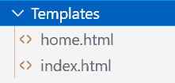
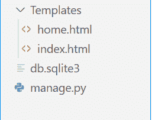
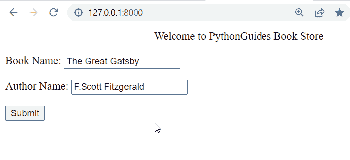
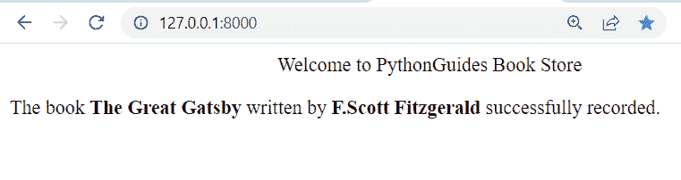

# Python Django 在哪里保存所有应用程序的基础模板

> 原文：<https://pythonguides.com/django-where-to-save-base-template-for-all-apps/>

[](https://sharepointsky.teachable.com/p/python-and-machine-learning-training-course)

在这个 [Python Django 教程](https://pythonguides.com/how-to-install-django/)中，我们将学习**在哪里保存 Django 中` `所有应用**的基础模板。这些是我们将在本教程中讨论的主题。

*   Python Django 项目设置
*   Python Django 在哪里保存所有应用程序的基础模板

目录

[](#)

*   [Python Django 项目设置](#Python_Django_project_setup "Python Django project setup")
*   [Python Django 保存所有应用程序基础模板的位置](#Python_Django_where_to_save_base_template_for_all_apps "Python Django where to save base template for all apps")

## Python Django 项目设置

在本节中，我们将学习建立一个 Django 项目。

**创建项目:** 首先，我们创建一个 Django 项目。为此，在终端中键入下面提到的命令。

```py
django-admin startproject BookStore
```

*   在这里，我们创建了一个名为**书店**的 Django 项目。

**创建应用:** 接下来，作为项目的一部分，我们将构建一个应用。在终端中运行以下命令来创建它。

```py
python manage.py startapp Books
```

**安装 APP:** 以上创建的图书 APP 必须包含在 `settings.py` 文件中。

```py
INSTALLED_APPS = [
    'django.contrib.admin',
    'django.contrib.auth',
    'django.contrib.contenttypes',
    'django.contrib.sessions',
    'django.contrib.messages',
    'django.contrib.staticfiles',
    'Books'
]
```

**创建模板:** Django 模板保持 Django 应用的设计。template 文件夹包含您在各种 Django 应用程序中需要的所有模板。

在大多数情况下，templates 文件夹被创建并保留在 sample 目录中，该目录还包含 manage.py。



Python Django project setup

或者，您可以为每个应用程序创建不同的模板文件夹。



Django project setup

**添加模板:** 要配置 Django 模板系统，进入 `settings.py` 文件，将 `DIRS` 更改为 TEMPLATES 文件夹的路径。

*   **创建单个模板文件夹时:**

```py
TEMPLATES = [
    {
        'BACKEND': 'django.template.backends.django.DjangoTemplates',
        'DIRS': ['Templates'],
        'APP_DIRS': True,
        'OPTIONS': {
            'context_processors': [
                'django.template.context_processors.debug',
                'django.template.context_processors.request',
                'django.contrib.auth.context_processors.auth',
                'django.contrib.messages.context_processors.messages',
            ],
        },
    },
]
```

*   **当你创建一个独特的` `模板文件夹:**

如果你单独维护每个应用的模板，你不需要更新**设置中的 `DIRS` 。确保你的应用包含在**设置. py 的` `已安装应用**中。**

**项目 URL:**在**书店** `urls.py` 文件中添加以下代码。

```py
from django.contrib import admin
from django.urls import path, include

urlpatterns = [
    path('admin/', admin.site.urls),
    path('', include('Books.urls')),
]
```

**APP 网址:** 在 `Books urls.py` 文件中添加以下代码。

```py
from django.urls import path
from . import views
urlpatterns = [
path('', views.BookForm, name='BookForm'),
]
```

**创建表单:** 现在，我们创建一个表单。以及下面的代码片段到图书 app 的 `forms.py` 文件中。

```py
from django import forms

class BookRecord(forms.Form):
    Book_Name = forms.CharField(label='Book Name')
    Author_Name = forms.CharField(label='Author Name')
```

*   这里，我们用两个 `CharField` 创建一个 `BookRecord` form 类。

**创建视图:** 将下面的代码添加到 views.py 文件中。

```py
from django.shortcuts import render
from Books.forms import BookRecord

def BookForm(request):  
    if request.method == "POST":  
        form = BookRecord(request.POST)  
        if form.is_valid():  
            BookName = form.cleaned_data['Book_Name']
            AuthorName = form.cleaned_data['Author_Name']
            context ={
                'BookName':BookName,
                'AuthorName':AuthorName
            }
            return render(request, 'index.html',context)
    else:  
        form = BookRecord()  
    return render(request,'home.html',{'form':form}) 
```

阅读:[如何在 Django 中加密和解密密码](https://pythonguides.com/encrypt-and-decrypt-password-in-django/)

## Python Django 保存所有应用程序基础模板的位置

在本节中，我们将了解所有应用程序的基础模板的保存位置。

**创建基础模板:** 现在，创建一个 HTML 文件【base.html】的**并添加下面的代码。**

```py
<!DOCTYPE html>
<html lang="en">
<head>
    <meta charset="UTF-8">
    <meta http-equiv="X-UA-Compatible" content="IE=edge">
    <meta name="viewport" content="width=device-width, initial-scale=1.0">
    <title>PythonGuides</title>
</head>
<body>
    <center>Welcome to PythonGuides Book Store</center>


</body>
</html>
```

*   **块标签**用于描述可以被子模板覆盖的块。
*   换句话说，在基础模板中指定块意味着该区域的内容将源自子模板文件。
*   看一下这个`base.html`模板，它有一个用于主体的模块。

**创建主页模板:** 现在，创建一个 HTML 文件【home.html**并添加以下代码。**

```py


<!DOCTYPE html>  
<html lang="en">  
<head>  
    <meta charset="UTF-8">  
    <title>Index</title>  
</head>  
<body>  
<form method="POST" class="post-form" enctype="multipart/form-data">  
          
        {{ form.as_p }}  
        <button type="submit" class="save btn btn-default">Submit</button>  
</form> 
 
</body>  
</html> 
```

*   在您创建了您的**基础模板**之后，您可以向它添加子模板。
*   **扩展了**关键字，可以用来执行这个操作。
*   所以我们可以把那个标签放在 index.html 文件的最顶端。

**创建索引模板:** 现在，创建一个 HTML 文件【index.html】的**并添加下面的代码。**

```py


<!DOCTYPE html>
<html lang="en">
<head>
    <meta charset="UTF-8">
    <meta http-equiv="X-UA-Compatible" content="IE=edge">
    <meta name="viewport" content="width=device-width, initial-scale=1.0">
    <title>Document</title>
</head>
<body>
    <p>
       The book <b>{{BookName}}</b> written by <b>{{AuthorName}}</b> successfully recorded.
    </p>
</body>
 
</html>
```

*   在`index.html`文件中，我们只是使用变量来获取**书名**值和**作者名**值。

**运行服务器** :启动服务器，通过定义 URL 为 http://127.0.0.1:8000 访问表单。



Python Django where to save base template for all apps



Django where to save base template for all apps

你可能也喜欢阅读下面的 Django 教程。

*   [Python Django 连接字符串](https://pythonguides.com/django-concatenate-string/)
*   [Python Django MySQL CRUD](https://pythonguides.com/python-django-mysql-crud/)
*   [Python Django app 上传文件](https://pythonguides.com/django-app-upload-files/)
*   [Python Django 随机数](https://pythonguides.com/django-random-number/)
*   [Python 改 Django 版本](https://pythonguides.com/python-change-django-version/)
*   [Python Django 四舍五入到两位小数](https://pythonguides.com/django-round-to-two-decimal-places/)
*   [Python 列表追加 Django](https://pythonguides.com/python-list-append-django/)

在这个 Python Django 教程中，我们已经讨论了所有应用程序的基础 **模板的保存位置 **Django，我们还讨论了本教程中的以下主题。****

*   Python Django 项目设置
*   Python Django 在哪里保存所有应用程序的基础模板

[Bijay Kumar](https://pythonguides.com/author/fewlines4biju/)

Python 是美国最流行的语言之一。我从事 Python 工作已经有很长时间了，我在与 Tkinter、Pandas、NumPy、Turtle、Django、Matplotlib、Tensorflow、Scipy、Scikit-Learn 等各种库合作方面拥有专业知识。我有与美国、加拿大、英国、澳大利亚、新西兰等国家的各种客户合作的经验。查看我的个人资料。

[enjoysharepoint.com/](https://enjoysharepoint.com/)[](https://www.facebook.com/fewlines4biju "Facebook")[](https://www.linkedin.com/in/fewlines4biju/ "Linkedin")[](https://twitter.com/fewlines4biju "Twitter")**