# 用 Python 从 URL 下载 zip 文件

> 原文：<https://pythonguides.com/download-zip-file-from-url-using-python/>

[](https://sharepointsky.teachable.com/p/python-and-machine-learning-training-course)

使用 Python，由于其丰富的库，你可以编程许多任务。使用 **Python 程序可以完成的任务之一是从 URL** 下载 zip 文件。

在这篇 Python 文章中，您将看到多个关于如何使用 python 从 URL 下载 zip 文件的例子。

*   Python wget 下载 zip 文件
*   Python 请求模块下载 zip 文件
*   Python 从 URL 下载 zip 文件并解压缩
*   Python 从 URL 下载多个 zip 文件
*   Python 从 Github 下载 zip 文件
*   从 Azure blob storage python 下载 zip 文件

目录

[](#)

*   [Python wget 下载 zip 文件](#Python_wget_download_zip_file "Python wget download zip file")
*   [Python 请求模块下载 zip 文件](#Python_requests_module_to_download_zip_file "Python requests module to download zip file")
*   [Python 从 URL 下载 zip 文件并解压](#Python_download_zip_file_from_URL_and_extract "Python download zip file from URL and extract")
*   [Python 从 URL 下载多个 zip 文件](#Python_download_multiple_zip_files_from_URL "Python download multiple zip files from URL")
    *   [替代方法:](#Alternative_Method "Alternative Method:")
*   [Python 从 Github 下载 zip 文件](#Python_download_zip_file_from_Github "Python download zip file from Github")
*   [从 Azure blob storage python 下载 zip 文件](#Download_zip_file_from_Azure_blob_storage_python "Download zip file from Azure blob storage python")

## Python wget 下载 zip 文件

用 Python 从 URL 下载 zip 文件的一种方法是使用 wget()函数。但是您需要首先使用 `pip` 命令行实用程序安装 `wget` 库。

在命令提示符下，执行以下代码来安装 wget 库:

```py
 pip install wget
```

安装后，您将看到如下屏幕所示的输出:

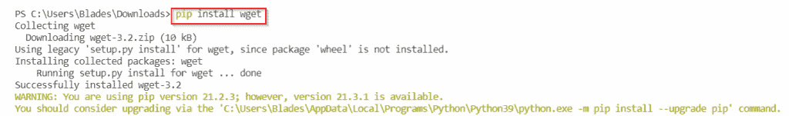

Installing the wget library

现在您可以使用 wget 库下载一个 zip 文件。下面是使用 wget 函数的语法。

```py
wget('URL of the zip file')
```

比如下载 `golang` 的 zip 源文件的链接是“https://golang . org/dl/go 1 . 17 . 3 . windows-amd64 . zip”。我可以执行下面的 Python 代码片段来下载这个 zip 文件:

```py
import wget
url='https://golang.org/dl/go1.17.3.windows-amd64.zip'
wget.download(url)
```

您将在输出控制台中看到进度。

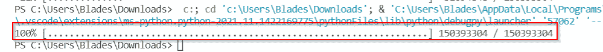

Downloading a zip file using wget

您可以在保存 Python 源代码文件的同一文件夹中看到您的 zip 文件。

您还可以以另一种方式使用 wget 选项。通过在命令行中执行以下代码，可以下载相同的 zip 文件:

```py
python -m wget 'https://golang.org/dl/go1.17.3.windows-amd64.zip' -o 'C:\Users\Blades\Downloads'
```

使用 `-o` 标志，您可以指定 zip 文件的下载路径。

因此，通过这种方式，您可以使用 Python 中的 `wget` 库从 URL 下载一个 zip 文件。

阅读: [Python 返回函数](https://pythonguides.com/python-return-function/)

## Python 请求模块下载 zip 文件

您还可以使用**请求**模块从 URL 下载一个 zip 文件。我们必须向 zip 文件 URL 发送一个请求，并将结果存储在一个变量中。然后，我们可以将这个 zip 内容写入本地文件系统。

酪首先，您必须使用 pip 命令将这个模块安装到您的 Python 编译器中:

```py
pip install requests
```

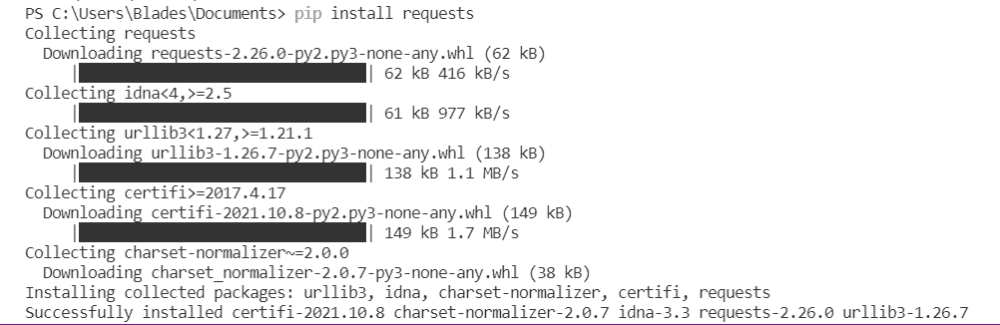

Installing the requests module

现在，您可以在代码中导入该模块并开始使用它。

例如，如果我必须从 URL“https://golang . org/dl/go 1 . 17 . 3 . windows-amd64 . zip”下载一个 zip 文件，我可以编写下面的 Python 代码片段:

```py
# importing the requests module
import requests
print('Downloading started')
url = 'https://golang.org/dl/go1.17.3.windows-amd64.zip'

# Downloading the file by sending the request to the URL
req = requests.get(url)

# Split URL to get the file name
filename = url.split('/')[-1]

# Writing the file to the local file system
with open(filename,'wb') as output_file:
    output_file.write(req.content)
print('Downloading Completed')
```

在上面的代码中，我们向指定的 URL 发送一个 `GET` 请求，并返回 zip 文件内容作为响应。之后，我们将 zip 文件内容写入本地文件系统中的一个文件。

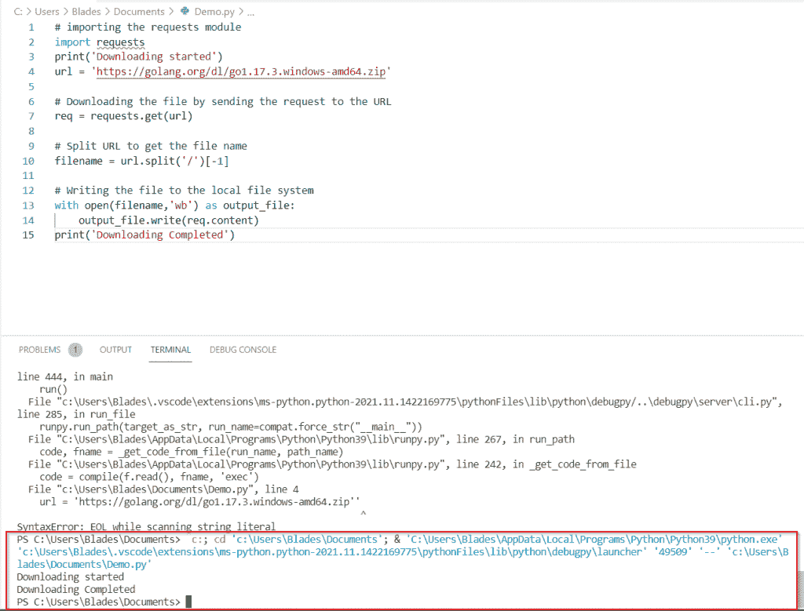

Downloading a zip file using the requests module

您可以在 Python 源代码文件的位置验证下载。因此，您可能已经学会了如何使用**请求**模块从 Python 中的 URL 下载 zip 文件。

阅读: [Python 查找列表中元素的索引](https://pythonguides.com/python-find-index-of-element-in-list/)

## Python 从 URL 下载 zip 文件并解压

在本节中，您将学习如何下载一个 zip 文件并将其解压缩到本地文件系统中。

我们需要三个模块:

*   请求:下载 zip 文件
*   BytesIO:从缓冲区读取文件
*   zipfile:读取并解压缩 zip 文件

例如，下面的 python 代码片段将从指定的 URL 下载一个 zip 文件，并将该 zip 文件提取到本地文件系统中。

```py
# importing necessary modules
import requests, zipfile
from io import BytesIO
print('Downloading started')

#Defining the zip file URL
url = 'https://www.learningcontainer.com/wp-content/uploads/2020/05/sample-zip-file.zip'

# Split URL to get the file name
filename = url.split('/')[-1]

# Downloading the file by sending the request to the URL
req = requests.get(url)
print('Downloading Completed')

# extracting the zip file contents
zipfile= zipfile.ZipFile(BytesIO(req.content))
zipfile.extractall('C:/Users/Blades/Downloads/NewFolder')
```

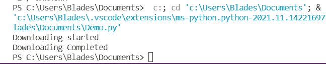

Downloading and extracting a zip file using python

在上面的代码中，首先我们下载 zip 文件并将它的内容存储到一个变量中。

然后，我们使用 BytesIO 函数读取 zip 文件内容，并将它们存储在 zip 格式的变量中。

最后，我们使用 `extractall()` 函数将 zip 文件数据提取到本地文件系统中。

**注意**:在 extractall()函数中定义文件路径时，用正斜杠(/)代替反斜杠(\)。否则，您将面临一个错误。

或者，您也可以在路径前附加 r，使其成为原始字符串。例如:

```py
zipfile.extractall(r'C:\Users\Blades\Downloads\NewFolder')
```

因此，您可能已经学会了如何用 python 从 URL 下载和提取 zip 文件。

阅读: [Python 在字符串中查找数字](https://pythonguides.com/python-find-number-in-string/)

## Python 从 URL 下载多个 zip 文件

在这一节中，我将解释如何从一个 URL 下载多个 zip 文件。

当您希望借助 Python 从一个 web 页面下载所有 zip 文件时，您可能会遇到这种情况。在这种情况下，您可以使用以下技术下载所有 zip 文件:

*   我们已经使用了**请求**模块来执行这个任务。你可以用 python 中的 `pip` 命令安装这个模块。
*   其次，我们使用了 BeautifulSoup 库来清理网页的响应内容。
*   第一步是获取显示所有 zip 文件链接的网页。
*   然后，我使用 `BeautifulSoup` 库清理了请求的响应。
*   之后，我获取了所有 zip 文件的 URL，并将它们存储在一个文本文件中。
*   一旦所有链接都存储在文本文件中，我就通过从文本文件中读取 URL 并向该 URL 发送一个 `GET` 请求来下载每个 zip 文件。
*   因此，在响应中会下载一个文件。
*   我在本地文件系统中创建了一个新的 zip 文件，并写入了上一步下载的 zip 文件内容。

```py
# importing the necessary modules
import requests
from bs4 import BeautifulSoup

# Creating a new file to store the zip file links
newfile = open('zipfiles.txt','w')

#Set variable for page to be opened and url to be concatenated 
page =requests.get('https://sample-videos.com/download-sample-zip.php')
baseurl= 'https://sample-videos.com/'

#Use BeautifulSoup to clean up the page
soup = BeautifulSoup(page.content)
soup.prettify()

#Find all the links on the page that end in .zip and write them into the text file
for anchor in soup.findAll('a', href=True):
    links = anchor['href']
    if links.endswith('.zip'):
        newfile.write(links + '\n')
newfile.close()

#Fetching the links for the zip file and downloading the files
with open('zipfiles.txt', 'r') as links:
    for link in links:
        if link:
            filename1= link.split('/')[-1]
            filename= filename1[:-1]
            link = baseurl + link
            print(filename + ' file started to download')
            response = requests.get(link[:-1])

            # Writing the zip file into local file system
            with open(filename,'wb') as output_file:
                output_file.write(response.content)
            print(filename + 'file is downloaded') 
```

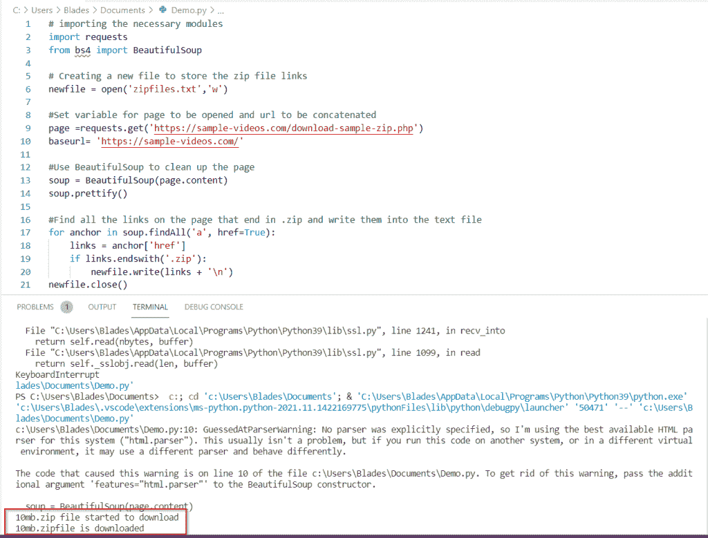

Multiple Zip Files Download

一旦程序成功执行，您将看到所有的 zip 文件都下载到了您的 Python 源代码位置。

### 替代方法:

还有另一种方法，即使用 `wget()` 函数。

你必须使用 `pip` 命令安装 `wget` 库。

之后，您可以执行下面的代码从一个 URL 下载所有的 zip 文件:

```py
# importing the necessary modules
import requests
from bs4 import BeautifulSoup
import wget

# Creating a new file to store the zip file links
newfile = open('zipfiles.txt','w')

#Set variable for page to be opened and url to be concatenated 
page =requests.get('https://sample-videos.com/download-sample-zip.php')
baseurl= 'https://sample-videos.com/'

#Use BeautifulSoup to clean up the page
soup = BeautifulSoup(page.content)
soup.prettify()

#Find all the links on the page that end in .zip and write them into the text file
for anchor in soup.findAll('a', href=True):
    links = anchor['href']
    if links.endswith('.zip'):
        newfile.write(links + '\n')
newfile.close()

#Fetching the links for the zip file and downloading the files
with open('zipfiles.txt', 'r') as links:
    for link in links:
        if link:
            link = baseurl + link
            wget.download(link[:-1])
```

方法与上述方法几乎相同。唯一的区别是我们使用了 `wget` 库来下载文件，而不是 `requests` 库。

使用 wget 库的好处是，您还可以看到下载的进度条，如下图所示:

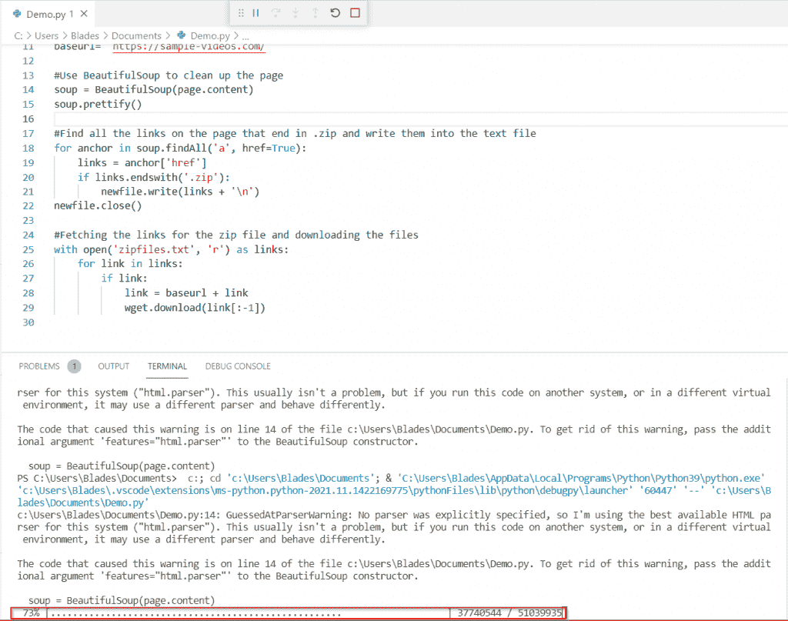

Download all the zip files from a URL

因此，您可能已经学会了如何使用 python 从单个 web 页面下载所有 zip 文件。

阅读:[删除非 ASCII 字符 Python](https://pythonguides.com/remove-non-ascii-characters-python/)

## Python 从 Github 下载 zip 文件

在这一节中，我将解释如何使用 python 从 Github 下载 zip 文件。

在任何 Github 存储库中，您都可以选择以 zip 文件的形式下载源代码。请看下图以供参考:

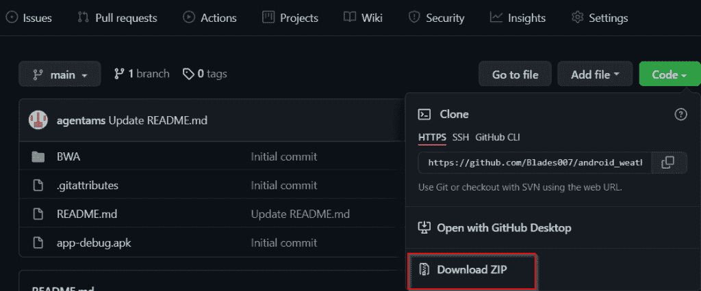

Download zip file link in Github

您可以在 Python 程序中使用这个链接来下载这个 zip 文件。您可以使用上述章节中介绍的任何方法。例如，您可以使用下面的 Python 代码使用 `wget()` 下载 zip 文件:

```py
import wget
url='https://github.com/Blades007/android_weather/archive/refs/heads/main.zip'
wget.download(url)
```

代码成功执行后，您可以看到文件创建在存储 python 源代码文件的文件夹中。

这样，你就可以用 Python 从 Github 下载一个 zip 文件了。

阅读: [Python 将二进制转换成十进制](https://pythonguides.com/python-convert-binary-to-decimal/)

## 从 Azure blob storage python 下载 zip 文件

要在 Python 中使用 [Azure blob 存储](https://azurelessons.com/create-azure-blob-storage/)，需要安装一个名为 `azure-storage-blob` 的库。要在 Python 编译器中安装此库，请在命令提示符下执行以下命令:

```py
pip install azure-storage-blob
```

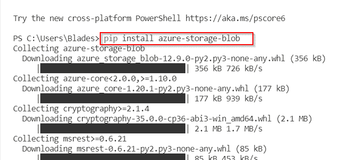

Downloading the Azure storage library

一旦你安装了这个库，你就可以编写代码从 Azure blob 容器下载一个 zip 文件。该过程解释如下:

*   首先，我们将使用连接字符串与 Azure 存储容器中存储的文件建立连接。
*   然后，我们将从存储器中下载文件。
*   最后，我们将文件保存在本地文件系统中。

要获取 Azure 存储容器的连接字符串:

*   导航到你的 Azure 存储容器，点击**安全+网络**标签中的**访问密钥**。
*   您将看到一个密钥列表。但它们都将被隐藏。
*   点击**显示密钥**查看密钥。
*   键的连接字符串与它们一起列出。您可以使用任何连接字符串。

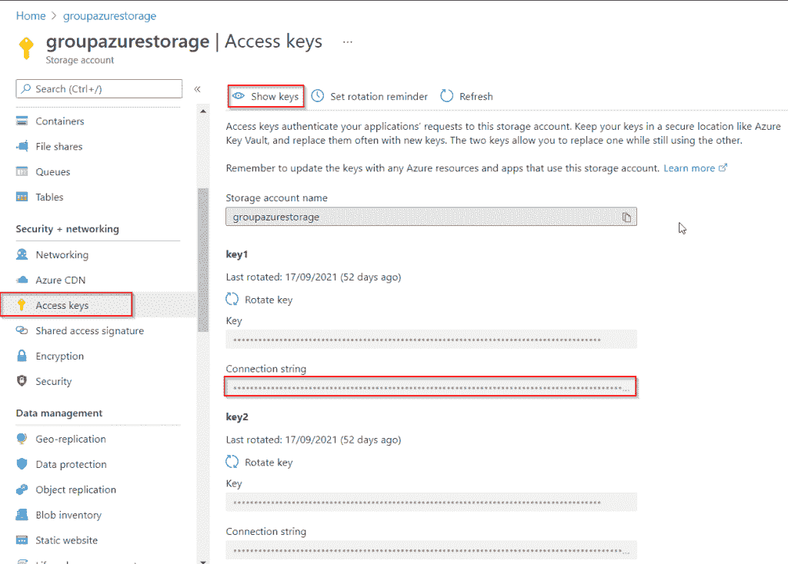

Azure storage access keys

现在，您可以执行下面的 Python 代码来下载存储在 Azure 容器中的 zip 文件。

```py
# importing the necessary module
from azure.storage.blob import BlobClient

# making a connection with the file in Azure blob storage container
blob = BlobClient.from_connection_string(conn_str="<your connection string", container_name="<your azure storage container name>", blob_name="your zip file name")

# writing the zip file to the local file system
print("Download Started")
with open("./sample-zip-file.zip", "wb") as my_blob:
    blob_data = blob.download_blob()
    my_blob.write(blob_data.content_as_bytes())
print("Download is complete")
```

在上面的代码中替换您的凭据。

**注**:数据正在以字节的形式下载，并写入一个新文件。您可以给新的 zip 文件取任何名称。

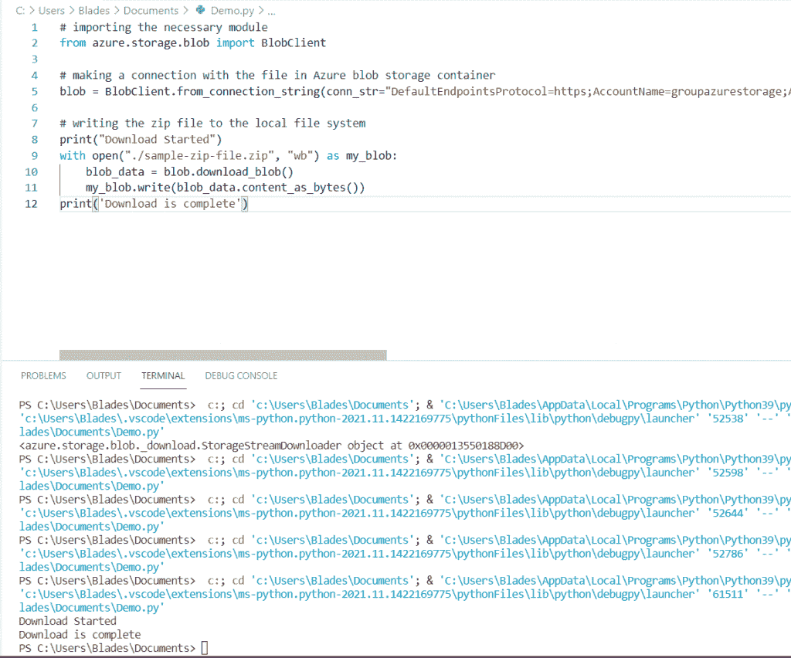

Download zip file from Azure blob storage python

您可以看到 zip 文件下载到了指定的路径中。

这样，您可以**从 Azure 存储容器**下载一个 zip 文件到您的本地文件系统。

另外，看看更多关于 Python 的教程。

*   [Python 统计文件中的字数](https://pythonguides.com/python-count-words-in-file/)
*   [Python 中的 Case 语句](https://pythonguides.com/case-statement-in-python/)
*   [Python 截屏](https://pythonguides.com/python-screen-capture/)
*   [Python 漂亮打印 JSON](https://pythonguides.com/python-pretty-print-json/)
*   [Python 字典增量值](https://pythonguides.com/python-dictionary-increment-value/)
*   [如何在 Python 中反转列表](https://pythonguides.com/reverse-a-list-in-python/)

因此，您可能已经学会了使用 Python 从 URL 下载 zip 文件的各种方法。

*   Python wget 下载 zip 文件
*   Python 请求模块下载 zip 文件
*   Python 从 URL 下载 zip 文件并解压缩
*   Python 从 URL 下载多个 zip 文件
*   Python 从 Github 下载 zip 文件
*   从 Azure blob storage python 下载 zip 文件

[Bijay Kumar](https://pythonguides.com/author/fewlines4biju/)

Python 是美国最流行的语言之一。我从事 Python 工作已经有很长时间了，我在与 Tkinter、Pandas、NumPy、Turtle、Django、Matplotlib、Tensorflow、Scipy、Scikit-Learn 等各种库合作方面拥有专业知识。我有与美国、加拿大、英国、澳大利亚、新西兰等国家的各种客户合作的经验。查看我的个人资料。

[enjoysharepoint.com/](https://enjoysharepoint.com/)[](https://www.facebook.com/fewlines4biju "Facebook")[](https://www.linkedin.com/in/fewlines4biju/ "Linkedin")[](https://twitter.com/fewlines4biju "Twitter")