# 使用 Python Turtle 绘制彩色填充形状

> 原文：<https://pythonguides.com/draw-colored-filled-shapes-using-python-turtle/>

[](https://sharepointsky.teachable.com/p/python-and-machine-learning-training-course)

在这个 [Python 教程](https://pythonguides.com/learn-python/)中，我们将通过几个例子学习**如何使用 Python turtle** 绘制彩色填充的形状，我们还将涉及以下主题:

*   如何使用 Python turtle 绘制彩色填充形状？
*   如何使用 Python turtle 改变屏幕颜色？
*   如何在蟒蛇龟中绘制彩色填充半圆
*   使用蟒蛇龟绘制彩色填充圆
*   如何在 python 海龟中绘制彩色填充椭圆
*   使用蟒蛇龟绘制彩色填充正方形
*   使用 Python turtle 绘制彩色填充矩形
*   使用蟒蛇龟绘制彩色填充三角形
*   使用蟒蛇龟绘制彩色填充的星星
*   使用蟒蛇龟绘制彩色填充六边形
*   使用 Python turtle 绘制不同颜色的实心圆
*   使用 Python turtle 绘制棋盘的程序
*   使用蟒蛇龟绘制井字游戏棋盘
*   使用 Python 和 turtle 绘制汽车的程序
*   蟒蛇龟画字母
*   用巨蟒龟画彩虹苯
*   如何在 python turtle 中创建砖墙

如果你是 Python turtle 的新手，那么看看 Python 中的 [Turtle 编程吧。](https://pythonguides.com/turtle-programming-in-python/)

目录

[](#)

*   [如何在蟒蛇龟中绘制彩色填充形状？](#How_to_draw_colored_filled_shapes_in_python_turtle "How to draw colored filled shapes in python turtle?")
*   [如何使用 Python turtle 改变屏幕颜色？](#How_to_change_screen_color_using_Python_turtle "How to change screen color using Python turtle?")
*   [如何在蟒蛇龟中绘制彩色填充半圆](#How_to_draw_colored_filled_half-circle_in_python_turtle "How to draw colored filled half-circle in python turtle")
*   [在蟒蛇龟身上画彩色填充圆](#Draw_colored_filled_circle_in_Python_turtle "Draw colored filled circle in Python turtle")
*   [如何在蟒蛇龟中绘制彩色填充椭圆](#How_to_draw_a_colored_filled_oval_in_python_turtle "How to draw a colored filled oval in python turtle")
*   [在蟒蛇龟身上画彩色填充方块](#Draw_colored_filled_square_in_Python_turtle "Draw colored filled square in Python turtle")
*   [在蟒蛇龟中绘制彩色填充矩形](#Draw_colored_filled_rectangle_in_Python_turtle "Draw colored filled rectangle in Python turtle")
*   [在蟒蛇龟中绘制彩色填充三角形](#Draw_colored_filled_triangle_in_Python_turtle "Draw colored filled triangle in Python turtle")
*   [使用蟒蛇龟绘制彩色填充的星星](#Draw_colored_filled_star_using_Python_turtle "Draw colored filled star using Python turtle")
*   [在蟒蛇龟中绘制彩色填充的六边形](#Draw_colored_filled_hexagon_in_Python_turtle "Draw colored filled hexagon in Python turtle")
*   [用蟒蛇龟](#Draw_filled_circle_with_a_different_color_using_python_turtle "Draw filled circle with a different color using python turtle")画一个不同颜色的实心圆
*   [用 python 画棋盘的程序龟](#Program_to_draw_a_chessboard_in_python_turtle "Program to draw a chessboard in python turtle")
*   [用蟒蛇龟画一个井字游戏棋盘](#Draw_a_tic_tac_toe_board_using_Python_turtle "Draw a tic tac toe board using Python turtle")
*   [用 python 画汽车龟的程序](#Program_to_draw_a_car_in_python_turtle "Program to draw a car in python turtle")
*   [蟒龟画字母](#Python_turtle_draw_letters "Python turtle draw letters")
*   [如何在 python turtle 中写文本](#How_to_write_text_in_python_turtle "How to write text in python turtle")
*   [用蟒龟画彩虹苯](#Draw_rainbow_benzene_using_python_turtle "Draw rainbow benzene using python turtle")
*   [如何在 python 龟中创建砖墙](#How_to_create_a_brick_wall_in_python_turtle "How to create a brick wall in python turtle")

## 如何在蟒蛇龟中绘制彩色填充形状？

让我们来理解下面的步骤**如何使用 Python turtle** 用想要的颜色绘制彩色填充的形状

*   正如我们所知，turtle 是 python 中的**内置模块，它使用屏幕和 turtle(笔)提供绘图。**
*   为了在乌龟画的形状中填充想要的颜色，我们有一些函数。
*   我们将使用名为 `fillcolor()` 的函数，并且要传递**颜色名称**或者是 **#RRGGBB** 格式的颜色。r、G 和 B 是十六进制数(0、1、2、3、4、5、6、7、8、9、A、B、C、D、E、F)
*   现在，我们要调用函数 `begin_fill()` 这个函数告诉乌龟，所有即将闭合的对象都需要用给定的颜色填充。
*   一旦我们完成了绘图，调用 `end_fill()` 函数。这个函数告诉海龟停止填充即将到来的对象。

读取 [Python 龟写函数](https://pythonguides.com/python-turtle-write-function/)

## 如何使用 Python turtle 改变屏幕颜色？

*   我们已经看到，默认情况下 turtle 总是以白色背景打开屏幕。但是让我们看看**如何在 Python** 中使用 turtle 改变屏幕颜色。
*   要想随时改变屏幕的颜色，首先我们需要**导入 turtle** ，然后我们可以使用命令 `"turtle.bgcolor(*args)"` 。
*   以上方法用于设置**龟屏**的**背景色**。

**举例:**

```py
import turtle 
turtle.bgcolor("green")
turtle.done()
```

在下面的输出中，我们可以看到在新的绘图板中，屏幕颜色被更改为所需的绿色。

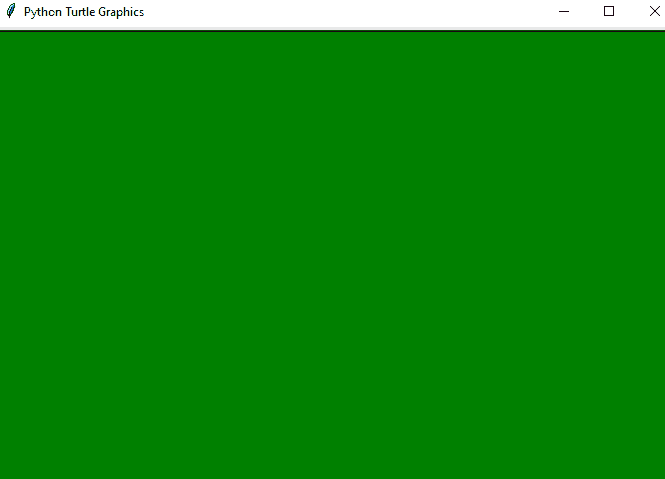

How to change the screen color in python turtle?

## 如何在蟒蛇龟中绘制彩色填充半圆

*   首先，我们需要**导入海龟**，然后我们可以通过声明**创建海龟围栏。龟()**。
*   我们将使用名为 `tr.color()` 的函数，然后我们可以使用**“tr . color(' black ')**来设置颜色。
*   现在，我们要调用函数 `tr.begin_fill()` 这个函数将开始填充半圆内部的颜色。另外，圆的**半径为 130** 像素，**半**–**圆 180 度**。
*   一旦我们完成了绘图，调用 `tr.end_fill()` 函数。这个函数告诉乌龟结束颜色的填充。

**举例:**

```py
import turtle 
tr = turtle.Turtle()
tr.color("black")
tr.begin_fill()
tr.circle(130,180)
tr.end_fill()
tr.hideturtle()
turtle.done()
```

在这个输出中，我们可以看到在新的绘图板上绘制了彩色填充的半圆。它绘制了**半径 130** 像素的圆和**一半**–**圆 180 度**，内部填充黑色。你可以参考下面的截图。

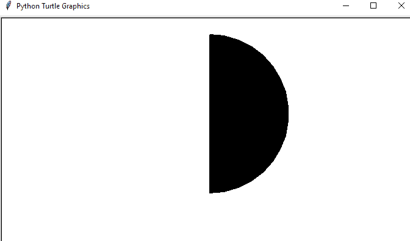

How to draw colored filled half-circle in python turtle

## 在蟒蛇龟身上画彩色填充圆

让我们**用 python 中的 turtle**在 Python 中画一个彩色填充圆。

*   首先，我们需要**导入海龟**，然后我们可以通过声明**创建海龟围栏。龟()**。
*   我们将使用名为 `fillcolor()` 的函数，然后我们可以使用 **"tr.fillcolor('black')** 来设置颜色。
*   现在，我们要调用函数 `tr.begin_fill()` 这个函数将开始填充圆圈内部的颜色。
*   一旦我们完成了绘图，调用 `tr.end_fill()` 函数。这个函数告诉乌龟结束颜色的填充。

**举例:**

```py
import turtle
tr = turtle.Turtle()
tr.fillcolor('black')
tr.begin_fill()
tr.circle(100)
tr.end_fill()
turtle.done()
```

在这个输出中，我们可以看到彩色填充圆被绘制在新的绘图板上。画出半径为 100 个单位的**圆，内部填充黑色。你可以参考下面的截图。**

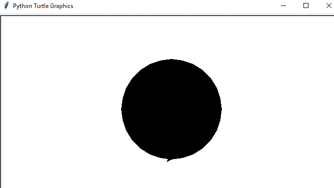

Draw colored filled circle in python turtle

## 如何在蟒蛇龟中绘制彩色填充椭圆

*   首先，我们需要**导入海龟**，然后我们可以通过声明**“tr =海龟”来创建海龟笔。乌龟()**。
*   `tr.color()` 用于返回或填充颜色， `tr.shape()` 用于设置给定形状的乌龟形状。
*   现在，我们要调用函数 `tr.begin_fill()` 这个函数将开始填充圆圈内部的颜色。
*   一旦我们完成了绘图，调用 `tr.end_fill()` 函数。这个函数告诉乌龟结束颜色的填充。

**举例:**

```py
import turtle 
tr = turtle.Turtle()
tr.color("black")
tr.shape("circle")
tr.begin_fill()
tr.shapesize(10,5,2)
tr.end_fill()
turtle.done()
```

在这个输出中，我们可以看到在新的绘图板上绘制了彩色填充的椭圆形。 **tr.shapesize(10，5，2)** 用于绘制椭圆，10 是宽度，5 是长度，2 是椭圆的轮廓。

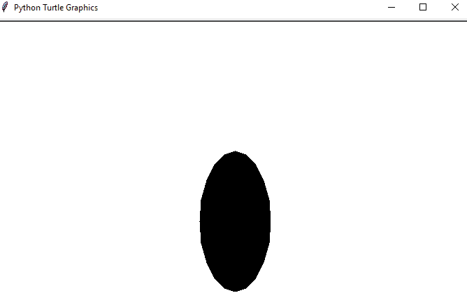

How to draw a colored filled oval in python turtle

## 在蟒蛇龟身上画彩色填充方块

让我们来讨论一下，**如何用蟒龟**画出彩色填充的 **正方形。**

*   首先，我们需要**导入海龟**，然后我们可以通过声明**创建海龟围栏。龟()**。
*   在这里，我们将使用 `fillcolor()` 函数，然后我们可以使用 **"tr.fillcolor('red')** 来设置颜色。
*   现在，我们将调用函数 `tr.begin_fill()` 这个函数将开始填充正方形内部的颜色。
*   为了绘制正方形，我们使用了**向前()**和**向右()**的方法。
*   一旦我们完成了颜色的填充，调用 `tr.end_fill()` 函数。这个函数告诉乌龟结束颜色的填充。

**举例:**

```py
import turtle
tr = turtle.Turtle()
tr.fillcolor('Red')
tr.begin_fill()
for i in range(4):
    tr.forward(150)
    tr.right(90)
tr.end_fill()
turtle.done()
```

在这个输出中，我们可以看到颜色被填充在新画板的正方形内。你可以参考下面的截图。

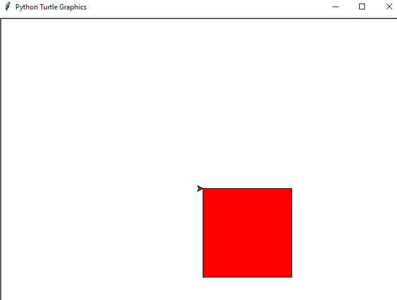

Draw colored filled square in python turtle

## 在蟒蛇龟中绘制彩色填充矩形

现在，我们将看到**如何使用蟒蛇龟****绘制一个彩色填充矩形。**

*   首先，**导入 turtle** 模块，然后我们可以通过声明**创建 turtle pen。龟()**。
*   这里，我们将使用 `fillcolor()` 函数，然后我们可以使用 **"tr.fillcolor('orange')** 来设置颜色。
*   现在，我们将调用函数 `tr.begin_fill()` 这个函数将开始填充**矩形**内的颜色。
*   为了绘制矩形，我们使用了**循环**，以及**向前()**和**向右()**的方法。
*   一旦我们完成了颜色的填充，调用 `tr.end_fill()` 函数。这个函数告诉乌龟结束颜色的填充。

**举例:**

```py
import turtle
tr = turtle.Turtle()
tr.fillcolor('orange')
tr.begin_fill()
for i in range(2):
    tr.forward(250)
    tr.right(90)
    tr.forward(150)
    tr.right(90)
tr.end_fill()
turtle.done()
```

在这个输出中，我们可以看到橙色填充了新窗口中的矩形。你可以参考下面的截图。

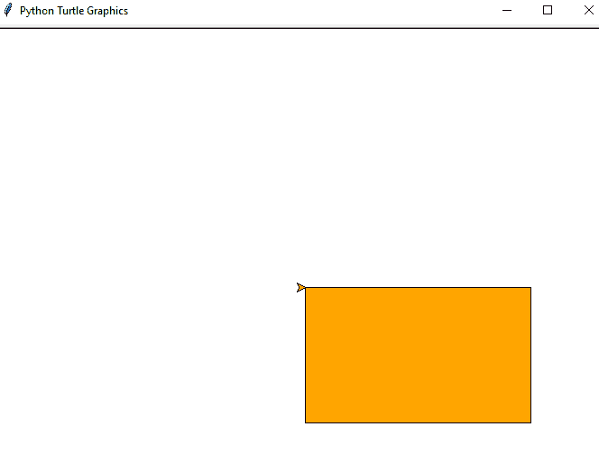

Draw colored filled rectangle in python turtle

## 在蟒蛇龟中绘制彩色填充三角形

让我们看看**如何使用 Python turtle** 绘制彩色填充三角形。

*   首先，**导入 turtle** 模块，然后我们可以通过声明**创建 turtle pen。龟()**。
*   这里，我们将使用 `fillcolor()` 函数，然后我们可以使用 **"tr.fillcolor('green')** 来设置颜色。
*   现在，我们将调用函数 `tr.begin_fill()` 这个函数将开始填充**三角形**内部的颜色。
*   我们使用了**来循环**，并且使用了 `forward()` 和 `left()` 的方法来绘制一个**三角形**。
*   一旦我们完成了颜色的填充，调用 `tr.end_fill()` 函数。这个函数告诉乌龟结束颜色的填充。

**举例:**

```py
import turtle
tr = turtle.Turtle()
tr.fillcolor('green')
tr.begin_fill()
for i in range(3):
    tr.forward(200)
    tr.left(120)
tr.end_fill()
turtle.done()
```

在这个输出中，我们可以看到绿色填充在三角形内部，它将出现在新窗口中。你可以参考下面的截图。

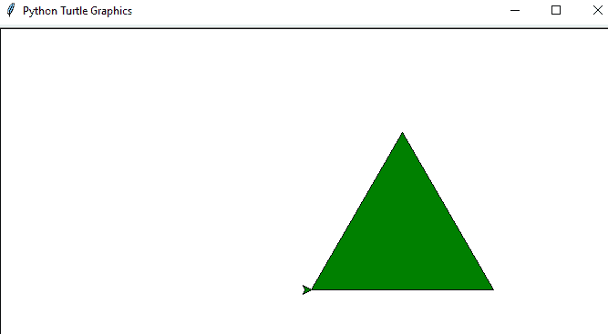

Draw colored filled triangle in python turtle

## 使用蟒蛇龟绘制彩色填充的星星

让我们看看**如何用 Turtle** 在 Python 中绘制彩色填充的星星。

*   首先，**导入 turtle** 模块，然后我们可以通过声明**创建 turtle pen。龟()**。
*   这里，我们将使用 `fillcolor()` 函数，然后我们可以使用 **"tr.fillcolor('紫色')**来设置颜色。
*   现在，我们将调用函数 `tr.begin_fill()` 这个函数将开始填充**星**内部的颜色。
*   我们使用了**来循环**，并且还使用了**向前()**和**向左()**的方法来绘制**星**。
*   一旦我们完成了颜色的填充，调用 `tr.end_fill()` 函数。这个函数告诉乌龟结束颜色的填充。

**举例:**

```py
import turtle
tr = turtle.Turtle()
tr.fillcolor('purple')
tr.begin_fill()
for i in range(5):
    tr.forward(250)
    tr.left(144)
tr.end_fill()
turtle.done()
```

在这个输出中，我们可以看到紫色填充在星星内部，它将出现在新窗口中。

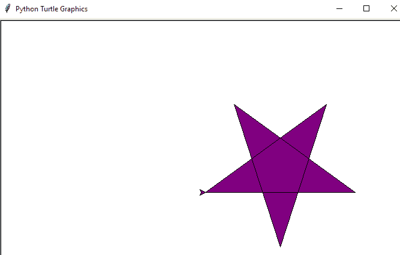

Draw colored filled star in python turtle

## 在蟒蛇龟中绘制彩色填充的六边形

让我们看看**如何使用 Python 龟**绘制彩色填充的六边形。

*   首先，**导入 turtle** 模块，然后我们可以通过声明**创建 turtle pen。龟()**。
*   这里，我们将使用 `fillcolor()` 函数，然后我们可以使用 **"tr.fillcolor('violet')** 来设置颜色。
*   现在，我们将调用函数 `tr.begin_fill()` 这个函数将开始填充**六边形**内部的颜色。
*   我们用**来画循环**，也用**向前()**和**向左()**的方法来画**六边形**。
*   一旦我们完成了颜色的填充，调用 `tr.end_fill()` 函数。这个函数告诉乌龟结束颜色的填充。

**举例:**

```py
import turtle
tr = turtle.Turtle()
tr.fillcolor('violet')
tr.begin_fill()
for i in range(6):
    tr.forward(120)
    tr.left(60)
tr.end_fill()
turtle.done()
```

在这个输出中，我们可以看到紫色填充了新窗口中的六边形。你可以参考下面的截图。

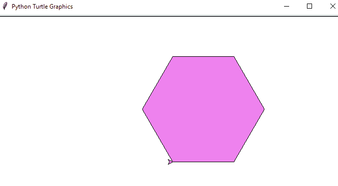

Draw colored filled hexagon in python turtle

## 用蟒蛇龟画一个不同颜色的实心圆

在这里，我们将看到**如何使用 Python turtle** 在圆形中填充不同的颜色。

*   首先，**导入 turtle** 模块，然后我们可以通过声明**创建 turtle pen。龟()**。
*   在这里，我们创建了一个不同颜色的列表，即 **"list = ["violet "，" blue "，" red "，" green"]"。**
*   同样，我们使用了 `goto()` 方法来移动一段距离。
*   for 循环将迭代 4 次以绘制一个 4 的圆。
*   现在，我们要调用函数 `tr.begin_fill()` 这个函数将开始填充圆圈内部的颜色。
*   为了绘制半径为 50 的**圆，我们使用了 `tr.circle()` 函数。**

**举例:**

```py
import turtle
tr = turtle.Turtle()
list = ["violet","blue","red","green"]
tr.up()
tr.goto(200,0)
for i in range(4):
    tr.down()
    tr.begin_fill()
    tr.fillcolor(list[i])
    tr.circle(50)
    tr.end_fill()
    tr.up()
    tr.backward(100)
tr.hideturtle()
turtle.done()
```

在这个输出中，我们可以看到不同的颜色被填充在新窗口的圆圈内。你可以参考下面的截图。

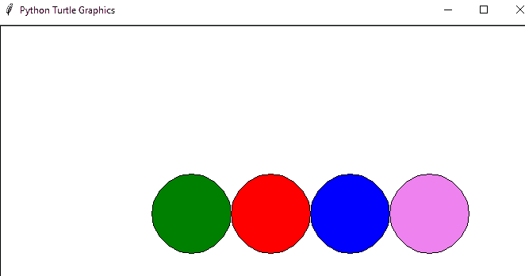

Draw filled circle with a different color using python turtle

## 用 python 画棋盘的程序龟

对于使用乌龟在 Python 中绘制棋盘的**，我们将使用以下步骤:**

*   首先我们要导入 `turtle` 模块，然后我们会用**SCR = turtle 创建一个**屏幕对象**。**屏幕()"。
*   为了创建一个 turtle 对象，我们使用了 **"tr = turtle。龟()"**。
*   现在，我们将定义一个方法，使用 for 循环在给定范围内迭代来绘制一个正方形。 `tr.forward(20)` 用于将乌龟向前移动 **20 个单位**， `tr.left(90)` 用于将乌龟转动 **90 度**秒。该语句将重复 3 次以获得棋盘的剩余边界。
*   为了设置屏幕，我们使用了`**SCR . setup()`方法，其中 `widht=600` 和 `height=600` 。 `tr.speed(100)` 是乌龟物体的速度，你也可以相应地改变速度。**
*   **然后另一个 for 循环将控制一行中一个正方形的绘制。因此，我们使用**“tr . setpos(0，20 * I)”**为每一行设置了位置。**
*   **同样，我们已经使用了 8 次 for 循环和可选颜色的 **if 条件，可选颜色是**【黑色】**和**【白色】**。另外， `tr.fillcolor(col)` 将开始填充给定的颜色， `tr.end_fill()` 将停止填充。****
*   **最后，我们已经使用了 `tr.hideturtle()` 来隐藏乌龟。**

 ****举例:**

```py
import turtle
scr = turtle.Screen()
tr = turtle.Turtle()
def draw():
  for i in range(4):
    tr.forward(20)
    tr.left(90)
  tr.forward(20)
if __name__ == "__main__":
    scr.setup(600, 600)
    tr.speed(100)
    for i in range(8):
      tr.up()
      tr.setpos(0, 20*i)
      tr.down()
      for j in range(8):
        if(i + j)%2 == 0:
         col = 'black'
        else:
         col = 'white'
        tr.fillcolor(col)
        tr.begin_fill()
        draw()
        tr.end_fill()
      tr.hideturtle()
turtle.done()
```

在这个输出中，我们可以看到棋盘是在新窗口中绘制的。你可以参考下面的截图。

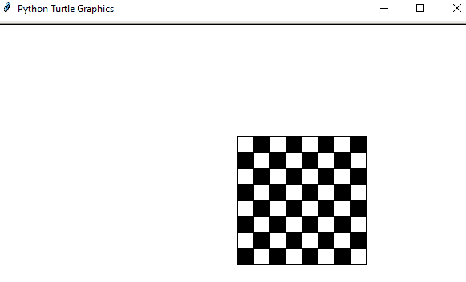

Program to draw a chessboard in python turtle

## 用蟒蛇龟画一个井字游戏棋盘

让我们看看**如何在蟒蛇龟**中画井字棋盘。

*   首先我们要导入 `turtle` 模块，然后我们会用**SCR = turtle 创建一个**屏幕对象**。**屏幕()"。
*   为了创建一个 turtle 对象，我们使用了 **"tr = turtle。龟()"**。
*   然后设置乌龟颜色为**【蓝色】**，宽度为**【3】**。
*   在这里，我已经手动将乌龟的速度设置为**“2”**。
*   所以，为了画井字游戏棋盘，我们首先要画一个外部正方形，for 循环用于迭代。**“tr . forward(300)”**用于将乌龟向前移动 **300 个单位**，**“tr . left(90)”**用于将乌龟在**中转动 90 度**。
*   对于正方形的内部线条，我使用了 `penup()` 、 `goto()` 和 `pendown()` 的方法。

**举例:**

```py
import turtle
scr = turtle.Screen()
tr = turtle.Turtle()
tr.color("blue")
tr.width("3")
tr.speed(2)
for i in range(4):
    tr.forward(300)
    tr.left(90)
tr.penup()
tr.goto(0,100)
tr.pendown()
tr.forward(300)
tr.penup()
tr.goto(0,200)
tr.pendown()
tr.forward(300)
tr.penup()
tr.goto(100,0)
tr.pendown()
tr.left(90)
tr.forward(300)
tr.penup()
tr.goto(200,0)
tr.pendown()
tr.forward(300)
tr.hideturtle()
turtle.done()
```

在这个输出中，我们可以在新窗口中看到井字游戏棋盘。你可以参考下面的截图。

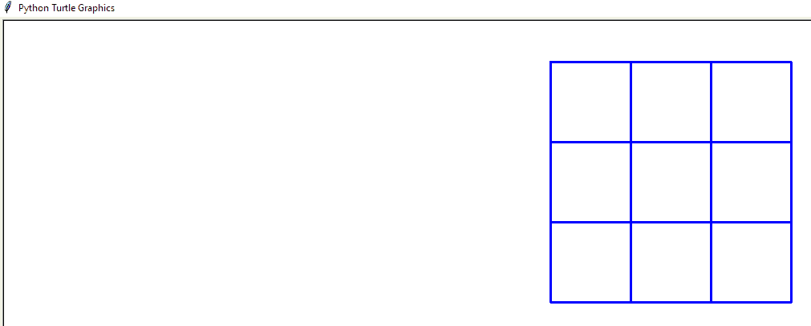

Draw a tic tac toe board in python turtle

## 用 python 画汽车龟的程序

让我们看看**如何用 turtle** 在 Python 中画一辆汽车

*   为了在巨蟒龟中画汽车，我们必须考虑汽车的形状和结构。汽车的上部将是一个长方形，轮胎可以画成圆形，车窗和车顶类似于梯形。
*   首先，我们必须导入 `turtle` 模块，然后我们将创建一个 turtle 对象 **"tr = turtle。**龟()"。
*   现在，我们将使用**“tr . color(# f62b 35 ')”**、**“tr . fill color(# f62b 35 ')”**绘制一辆汽车的矩形上部车身，用于填充汽车中的颜色。
*   此外，我们还使用了 `penup()` 、 `goto()` 、 `pendown()` 、 `setheading()` 方法来绘制汽车。
*   为了绘制轮胎，我们使用了 `"tr.circle(20)"` 函数，为了在轮胎中填充颜色，我们使用了**" tr . color(# 000000))"**和**" tr . fill color(# 000000 ')"**。

**举例:**

```py
import turtle
tr = turtle.Turtle()
tr.color('#f62b35')
tr.fillcolor('#f62b35')
tr.penup()
tr.goto(0,0)
tr.pendown()
tr.begin_fill()
tr.forward(370)
tr.left(90)
tr.forward(50)
tr.left(90)
tr.forward(370)
tr.left(90)
tr.forward(50)
tr.left(90)
tr.end_fill()
tr.penup()
tr.goto(100,50)
tr.pendown()
tr.setheading(45)
tr.forward(70)
tr.setheading(0)
tr.forward(100)
tr.setheading(-45)
tr.forward(70)
tr.setheading(90)
tr.penup()
tr.goto(200, 50)
tr.pendown()
tr.forward(49.50)
tr.penup()
tr.goto(100, -10)
tr.pendown()
tr.color('#000000')
tr.fillcolor('#000000')
tr.begin_fill()
tr.circle(20)
tr.end_fill()
tr.penup()
tr.goto(300, -10)
tr.pendown()
tr.color('#000000')
tr.fillcolor(#000000')
tr.begin_fill()
tr.circle(20)
tr.end_fill()
tr.hideturtle()
turtle.done()
```

在这个输出中，我们可以在新窗口中看到彩色填充的汽车。你可以参考下面的截图。

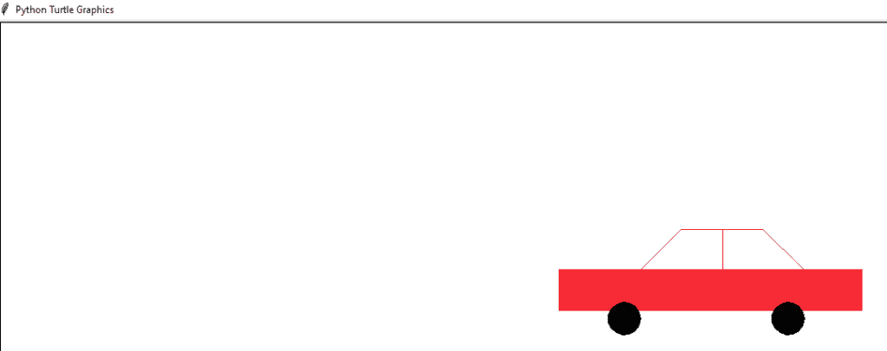

Program to draw a car in python turtle

## 蟒龟画字母

在这个例子中，我们将看到**如何在 python turtle** 中绘制字母

*   首先，**导入 turtle** 模块，然后我们可以通过声明**创建 turtle pen。龟()**。
*   在这里，我们使用了`. tr . color(" Blue ")`和`. tr . width(3)`用于线条粗细。
*   为了打印字母**“G”**我们必须使用 for loop 来画一个半圆。**向后()**用于将笔向后移动 x 单位。
*   左侧()用于将笔向防抱死方向旋转 x 角度。

**举例:**

```py
import turtle
ws = turtle.Screen()
tr = turtle.Turtle()
tr.color("Blue")
tr.width(3)
for x in range(180):
    tr.backward(1)
    tr.left(1)
tr.right(90)
tr.forward(50)
tr.right(90)
tr.forward(30)
tr.right(90)
tr.forward(50)
turtle.done()
```

在这个输出中，我们可以看到字母**“G”**被绘制在新窗口中。你可以参考下面的截图。

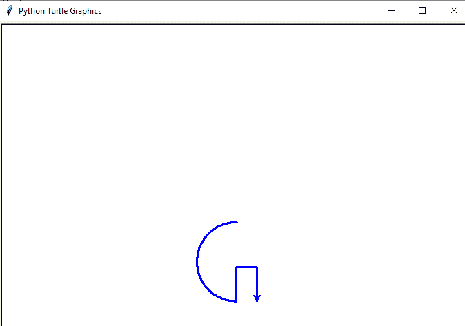

Python turtle draw letters

## 如何在 python turtle 中写文本

*   首先，**导入 turtle** 模块，然后我们可以通过声明**创建 turtle pen。龟()**。
*   这里，我们使用了**tr . color(‘红色’)**。 **style=(fontname，fontsize，fonttype)** 用于以给定的方式设置文本。
*   `turtle.write()` 函数用于在当前 turtle 位置写入文本。
*   为了隐藏海龟，我们使用了`" tr . hideturt()"`

**举例:**

```py
import turtle
tr = turtle.Turtle()
tr.color('red')
style = ('courier',30,'italic')
tr.write('Welcome to Python Turtle',font=style,align='center')
tr.hideturtle()
turtle.done()
```

在这个输出中，我们可以看到文本是如何在新窗口中书写的。你可以参考下面的截图。

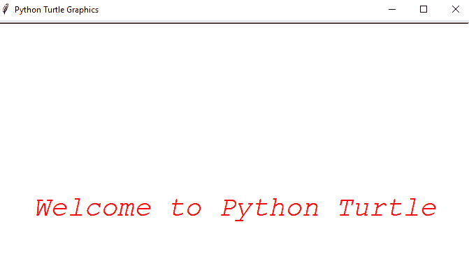

How to write text in python turtle

## 用蟒龟画彩虹苯

*   首先，**导入 turtle** 模块，然后我们可以通过声明`tr = turtle . pen()`来创建 turtle 对象。
*   我们设置屏幕背景色为**‘黑色’**，**乌龟的速度为‘0’**最快。
*   之后**用于循环**，范围为 `180` 。
*   **tr.pencolor(colors[x%6])** 用于每一步的颜色。
*   这里， `tr.width(x/100 + 1)` 用于增加宽度，向左旋转 **59 度**。

**举例:**

```py
import turtle
colors = ['purple', 'indigo', 'blue', 'green', 'yellow', 'orange']
tr = turtle.pen()
turtle.bgcolor('black')
tr.speed(0)
for x in range(180):
    tr.pencolor(colors[x%6])
    tr.width(x/100 + 1)
    tr.forward(x)
    tr.left(59)
turtle.done()
```

在这个输出中，我们可以在新窗口中看到彩虹苯。你可以参考下面的截图。

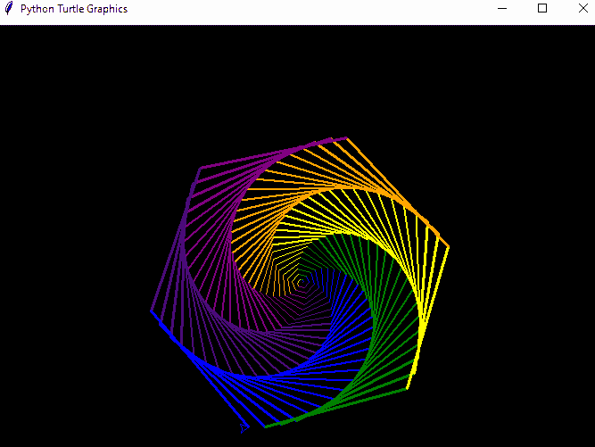

Draw rainbow benzene using python turtle

## 如何在 python 龟中创建砖墙

让我们看看**如何在 python turtle** 中创建砖墙

*   要在 python turtle 中创建一堵砖墙，我们必须先导入**乌龟**和**屏幕**。
*   这里， `Cursor_Size = 20` 用于画砖。 **scr.setup(600，600)** 用于设置屏幕尺寸。
*   **scr.setworldcoordinates(0，0，12，24)** 用于设置基于砖块的用户自定义坐标。
*   **turtle . shapesize(25/Cursor _ Size，50 / Cursor_Size，5)** 用来把光标变成砖块。

**举例:**

```py
from turtle import Screen, Turtle
Cursor_Size = 20
scr = Screen()
scr.setup(600, 600) 
scr.setworldcoordinates(0, 0, 12, 24)
scr.bgcolor('black')
turtle = Turtle('square', visible=False)
turtle.penup()
turtle.speed(10)
turtle.color('black', 'red')
turtle.shapesize(25 / Cursor_Size, 50 / Cursor_Size, 5)
for y in range(24):
    turtle.setposition(-0.5 * (y % 2), y + 0.3)
    for x in range(13):
        turtle.stamp()
        turtle.forward(1)
scr.mainloop()
```

在这个输出中，我们可以看到砖墙是在新窗口中创建的。你可以参考下面的截图。

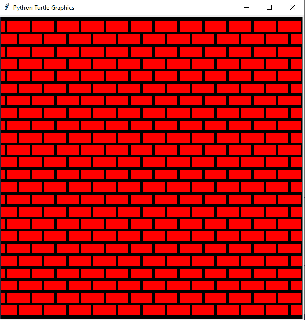

How to create a brick wall in python turtle

您可能会喜欢以下 Python 教程:

*   [使用 if-else 理解 Python 列表](https://pythonguides.com/python-list-comprehension-using-if-else/)
*   [蟒龟速度举例](https://pythonguides.com/python-turtle-speed/)
*   [Python Tkinter Stopwatch](https://pythonguides.com/python-tkinter-stopwatch/)
*   [Python 读取二进制文件](https://pythonguides.com/python-read-a-binary-file/)
*   [蟒蛇龟的颜色](https://pythonguides.com/python-turtle-colors/)
*   [Python 要求用户输入](https://pythonguides.com/python-ask-for-user-input/)
*   [如何在蟒龟里做出笑脸](https://pythonguides.com/how-to-make-a-smiling-face-in-python-turtle/)
*   [如何将 Python 字符串转换成字节数组并举例](https://pythonguides.com/python-string-to-byte-array/)
*   [Python 通过引用或值传递示例](https://pythonguides.com/python-pass-by-reference-or-value/)
*   [Python 从列表中选择](https://pythonguides.com/python-select-from-a-list/)
*   [Python 复制文件](https://pythonguides.com/python-copy-file/)
*   [Python 文件方法](https://pythonguides.com/python-file-methods/)

在本教程中，我们已经学习了如何使用 turtle 在 python 中绘制彩色填充的形状，我们还看到了用 Python 编程的`Turtle`，我们还讨论了以下主题:

*   如何在 python turtle 中绘制彩色填充的形状？
*   如何在 python turtle 中改变屏幕颜色？
*   如何在蟒蛇龟中绘制彩色填充半圆
*   在蟒蛇龟中绘制彩色填充圆
*   如何在 python 海龟中绘制彩色填充椭圆
*   在蟒蛇龟中绘制彩色填充正方形
*   在蟒蛇龟中绘制彩色填充矩形
*   在蟒蛇龟中绘制彩色填充三角形
*   在蟒蛇龟中绘制彩色填充星
*   在蟒蛇皮海龟上绘制彩色填充六边形
*   使用 python turtle 绘制不同颜色的实心圆
*   用 python 画棋盘的程序龟
*   在蟒蛇龟中绘制井字游戏棋盘
*   用 python 画汽车的程序
*   蟒蛇龟画字母
*   如何在 python turtle 中编写文本
*   用巨蟒龟画彩虹苯
*   如何在 python turtle 中创建砖墙

[Bijay Kumar](https://pythonguides.com/author/fewlines4biju/)

Python 是美国最流行的语言之一。我从事 Python 工作已经有很长时间了，我在与 Tkinter、Pandas、NumPy、Turtle、Django、Matplotlib、Tensorflow、Scipy、Scikit-Learn 等各种库合作方面拥有专业知识。我有与美国、加拿大、英国、澳大利亚、新西兰等国家的各种客户合作的经验。查看我的个人资料。

[enjoysharepoint.com/](https://enjoysharepoint.com/)[](https://www.facebook.com/fewlines4biju "Facebook")[](https://www.linkedin.com/in/fewlines4biju/ "Linkedin")[](https://twitter.com/fewlines4biju "Twitter")**