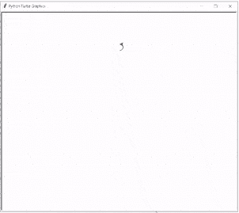

# 如何在蟒蛇龟中画花

> 原文：<https://pythonguides.com/draw-flower-in-python-turtle/>

[](https://sharepointsky.teachable.com/p/python-and-machine-learning-training-course)

我们正在建立一个项目，在这个项目中，我们将在一只**巨蟒龟**的帮助下学习**如何画一朵花**。在这里，我们将拆分代码，解释如何使用函数和方法来绘制美丽的花朵。

在前进之前，我们应该有一些关于花的知识。

花是植物的一部分，也称为开花。这种花有令人愉快的气味和鲜艳的颜色。花由花瓣组成，它们生长在茎的顶端。

## 画花在蟒蛇龟上

现在我们正在向前推进，开始这个项目。这里我们只是导入下面两个 Python turtle 库。

```py
from turtle import *
import turtle as tur
```

现在我们正在为这只乌龟创建一个对象。

```py
tur = tur.Turtle()
```

在 python turtle 中，我们通过使用 `turtle()` 函数来设置花的初始**位置。要设置位置，我们必须使用以下函数。**

*   `tur.penup()` 用于拿起笔，停止绘图。
*   `tur.left (90)` 用于向左移动乌龟。
*   `tur.fd (200)` 用于向前移动乌龟。
*   `tur.pendown()` 用于开始绘图。
*   `tur.right (90)` 用于向右移动乌龟。

```py
tur.penup ()
tur.left (90)
tur.fd (200)
tur.pendown ()
tur.right (90)
```

现在我们正在用**龟()**函数制作一个**花基**。为了制作一朵花的美丽基底，我们使用了下面的函数。

*   `tur.fillcolor ("red")` 用于填充花基部内部的颜色。
*   `tur.begin_fill ()` 用于开始填充颜色。
*   **tur.circle (10，180)** 用于绘制圆的形状。
*   `tur.left (50)` 用于向左移动乌龟。
*   `tur.right (24)` 用于向右移动乌龟。
*   `tur.fd (30)` 用于向前移动乌龟。
*   `tur.end_fill ()` 用于停止填充颜色。

```py
tur.fillcolor ("red")
tur.begin_fill ()
tur.circle (10,180)
tur.circle (25,110)
tur.left (50)
tur.circle (60,45)
tur.circle (20,170)
tur.right (24)
tur.fd (30)
tur.left (10)
tur.circle (30,110)
tur.fd (20)
tur.left (40)
tur.circle (90,70)
tur.circle (30,150)
tur.right (30)
tur.fd (15)
tur.circle (80,90)
tur.left (15)
tur.fd (45)
tur.right (165)
tur.fd (20)
tur.left (155)
tur.circle (150,80)
tur.left (50)
tur.circle (150,90)
tur.end_fill ()
```

在蟒蛇龟中，我们使用**龟()**功能来制作花朵的**花瓣 1** 。为了制作花瓣，我们使用了下面的函数。

*   `tur.left (150)` 用于向左移动乌龟，使花瓣呈现完美的形状。
*   **tur.circle (-90，70)** 用于画圆。
*   `tur.setheading (60)` 用于将乌龟的方位设置为角度。

```py
tur.left (150)
tur.circle (-90,70)
tur.left (20)
tur.circle (75,105)
tur.setheading (60)
tur.circle (80,98)
tur.circle (-90,40)
```

现在我们使用 `turtle()` 函数来制作一朵花的**花瓣 2** 。为了制作一个花瓣，我们使用下面的函数。

*   `tur.left (180)` 用于向左移动乌龟。
*   **tur.circle (90，40)** 用于绘制圆的形状。
*   `tur.setheading (-83)` 用于将乌龟的方位设置为角度。

```py
tur.left (180)
tur.circle (90,40)
tur.circle (-80,98)
tur.setheading (-83)
```

在 python turtle 中，我们使用了 `turtle()` 函数来制作一朵花的**叶子 1** 。为了制作一片叶子，我们使用下面的函数。

*   `tur.fd (30)` 用于向前移动乌龟。
*   `tur.left (90)` 用于向左移动乌龟。
*   **tur.fillcolor("深绿色")**用于填充形状中的颜色。
*   `tur.begin_fill ()` 用于开始填充颜色。
*   **tur.circle (-80，90)** 用于绘制圆形。
*   `tur.right (90)` 用于向右移动乌龟。

```py
tur.fd (30)
tur.left (90)
tur.fd (25)
tur.left (45)
tur.fillcolor ("dark green")
tur.begin_fill ()
tur.circle (-80,90)
tur.right (90)
tur.circle (-80,90)
tur.end_fill ()
tur.right (135)
tur.fd (60)
tur.left (180)
tur.fd (85)
tur.left (90)
tur.fd (80)
```

现在我们使用 `turtle()` 函数来制作一朵花的**叶子 2** 。为了制作一片叶子，我们使用下面的函数。

*   t `ur.right (90)` 用于向右移动乌龟。
*   **tur.fillcolor("深绿色")**用于填充形状中的颜色。
*   `tur.begin_fill ()` 用于开始填充颜色。
*   **tur.circle (80，90)** 用于绘制圆形。
*   `tur.left (90)` 用于向左移动乌龟。
*   `tur.end_fill ()` 用于结束填充颜色。

`tur.fd (60)` 用于向前移动乌龟。

```py
tur.right (90)
tur.right (45)
tur.fillcolor ("dark green")
tur.begin_fill ()
tur.circle (80,90)
tur.left (90)
tur.circle (80,90)
tur.end_fill ()
tur.left (135)
tur.fd (60)
tur.left (180)
tur.fd (60)
tur.right (90)
tur.circle (200,60)
tur.done()
```

在这里，在拆分代码并解释我们如何使用 `python turtle` 制作一朵花之后，我们将看到运行整个代码后的输出是什么样子。

```py
from turtle import *
import turtle as tur

tur = tur.Turtle()

tur.penup ()
tur.left (90)
tur.fd (200)
tur.pendown ()
tur.right (90)

tur.fillcolor ("red")
tur.begin_fill ()
tur.circle (10,180)
tur.circle (25,110)
tur.left (50)
tur.circle (60,45)
tur.circle (20,170)
tur.right (24)
tur.fd (30)
tur.left (10)
tur.circle (30,110)
tur.fd (20)
tur.left (40)
tur.circle (90,70)
tur.circle (30,150)
tur.right (30)
tur.fd (15)
tur.circle (80,90)
tur.left (15)
tur.fd (45)
tur.right (165)
tur.fd (20)
tur.left (155)
tur.circle (150,80)
tur.left (50)
tur.circle (150,90)
tur.end_fill ()

tur.left (150)
tur.circle (-90,70)
tur.left (20)
tur.circle (75,105)
tur.setheading (60)
tur.circle (80,98)
tur.circle (-90,40)

tur.left (180)
tur.circle (90,40)
tur.circle (-80,98)
tur.setheading (-83)

tur.fd (30)
tur.left (90)
tur.fd (25)
tur.left (45)
tur.fillcolor ("dark green")
tur.begin_fill ()
tur.circle (-80,90)
tur.right (90)
tur.circle (-80,90)
tur.end_fill ()
tur.right (135)
tur.fd (60)
tur.left (180)
tur.fd (85)
tur.left (90)
tur.fd (80)

tur.right (90)
tur.right (45)
tur.fillcolor ("dark green")
tur.begin_fill ()
tur.circle (80,90)
tur.left (90)
tur.circle (80,90)
tur.end_fill ()
tur.left (135)
tur.fd (60)
tur.left (180)
tur.fd (60)
tur.right (90)
tur.circle (200,60)
tur.done()
```

运行上面的代码后，我们得到下面的输出，我们可以看到屏幕上画了一朵美丽的花。



Draw a flower in python turtle

所以在这个项目中，我们展示了如何在巨蟒龟身上画一朵花。此外，我们还讨论了这个项目中使用的整个代码，这是非常有用的。

相关 Python 海龟教程:

*   [如何用 Turtle 创建 Python 中的贪吃蛇游戏](https://pythonguides.com/snake-game-in-python/)
*   [使用蟒蛇龟绘制彩色填充形状](https://pythonguides.com/draw-colored-filled-shapes-using-python-turtle/)
*   [蟒龟鼠](https://pythonguides.com/python-turtle-mouse/)
*   [蟒龟兽皮](https://pythonguides.com/python-turtle-hide/)
*   [蟒龟背景](https://pythonguides.com/python-turtle-background/)
*   [蟒龟网格](https://pythonguides.com/python-turtle-grid/)
*   [蟒龟星](https://pythonguides.com/python-turtle-star/)
*   [蟒蛇龟笔](https://pythonguides.com/python-turtle-pen/)
*   [Python 龟输入示例](https://pythonguides.com/python-turtle-input/)
*   [蟒龟多边形](https://pythonguides.com/python-turtle-polygon/)

[Bijay Kumar](https://pythonguides.com/author/fewlines4biju/)

Python 是美国最流行的语言之一。我从事 Python 工作已经有很长时间了，我在与 Tkinter、Pandas、NumPy、Turtle、Django、Matplotlib、Tensorflow、Scipy、Scikit-Learn 等各种库合作方面拥有专业知识。我有与美国、加拿大、英国、澳大利亚、新西兰等国家的各种客户合作的经验。查看我的个人资料。

[enjoysharepoint.com/](https://enjoysharepoint.com/)[](https://www.facebook.com/fewlines4biju "Facebook")[](https://www.linkedin.com/in/fewlines4biju/ "Linkedin")[](https://twitter.com/fewlines4biju "Twitter")