# 绘制垂直线 matplotlib

> 原文：<https://pythonguides.com/draw-vertical-line-matplotlib/>

[](https://sharepointsky.teachable.com/p/python-and-machine-learning-training-course)

在本 [Python 教程](https://pythonguides.com/learn-python/)中，我们将讨论**在 Python 中画竖线[matplotlib](https://pythonguides.com/what-is-matplotlib/)T5。在这里，我们将介绍使用 matplotlib 与垂直线相关的不同示例。我们还将讨论以下主题:**

*   绘制垂直线 matplotlib
*   绘制垂直虚线 matplotlib
*   Matplotlib 绘制带标签的垂直线
*   Matplotlib 绘制多条垂直线
*   绘制垂直线 matplotlib 日期时间
*   Matplotlib 在两点之间画垂直线
*   绘制垂直线段 matplotlib
*   在直方图 matplotlib 上绘制垂直线

目录

[](#)

*   [画垂直线 matplotlib](#Draw_vertical_line_matplotlib "Draw vertical line matplotlib")
    *   [通过使用 plot()方法](#By_using_plot_method "By using plot() method")
    *   [通过使用 vlines()](#By_using_vlines "By using vlines()")
    *   [通过使用 axvline()](#By_using_axvline "By using axvline()")
*   [画垂直虚线 matplotlib](#Draw_vertical_dotted_line_matplotlib "Draw vertical dotted line matplotlib")
*   [Matplotlib 用标签](#Matplotlib_draw_vertical_line_with_label "Matplotlib draw vertical line with label")画垂直线
*   [Matplotlib 绘制多条垂直线](#Matplotlib_draw_multiple_vertical_line "Matplotlib draw multiple vertical line")
    *   [通过使用 axvline()](#By_using_axvline-2 "By using axvline()")
    *   [通过使用 vlines()](#By_using_vlines-2 "By using vlines()")
*   [绘制垂直线 matplotlib 日期时间](#Plot_vertical_line_matplotlib_datetime "Plot vertical line matplotlib datetime")
*   [Matplotlib 在两点之间画垂直线](#Matplotlib_draw_vertical_line_between_two_points "Matplotlib draw vertical line between two points")
*   [绘制垂直线段 matplotlib](#Plot_vertical_line_segment_matplotlib "Plot vertical line segment matplotlib")
*   [在直方图 matplotlib 上绘制垂直线](#Plot_vertical_line_on_histogram_matplotlib "Plot vertical line on histogram matplotlib")

## 画垂直线 matplotlib

在本节中，我们将学习如何在 Python 的 matplotlib 中绘制垂直线。在开始这个话题之前，我们首先要了解什么是**垂直线**或者它看起来怎么样。

**一般来说**，垂直线是从上到下的直线，反之亦然。或者如果我们在**坐标平面**中说，一条平行于 Y 轴的线称为垂直线。

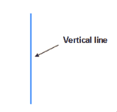

*” Standing Line “*

在 Python 中，matplotlib 是一个用于绘图的流行库。它提供了绘制垂直线的不同方法，我们将在下面讨论。

*   使用绘图()
*   使用 vlines()
*   使用 axvline()

### 通过使用 plot()方法

在 matplotlib 中， `plot()` 方法用于绘制 2D 图。

**plot()方法的语法如下:**

```py
matplotlib.pyplot.plot(x_points, y_points)
```

**上面使用的参数概述如下:**

*   **x_points:** 指定要绘图的 x 坐标点。
*   **y_points:** 指定要绘图的 y 坐标点。

**让我们看一个例子来清楚地理解这个概念:**

```py
**# Import Library**

import matplotlib.pyplot as plt

**# Define Data**

X = [0, 0]
Y = [5, 10]

**# Plot vertical line**

plt.plot(X,Y)

**# Show**

plt.show()
```

*   在上面的例子中，我们导入了 `matplotlib.pyplot` 库。
*   之后，我们定义数据点进行绘图。这里我们指定 **x 轴**到 `0` ，因为我们要画一条垂直线。
*   接下来，我们使用 `plt.plot()` 方法绘制一条线，并使用 `plt.show()` 方法在用户屏幕上可视化绘图。

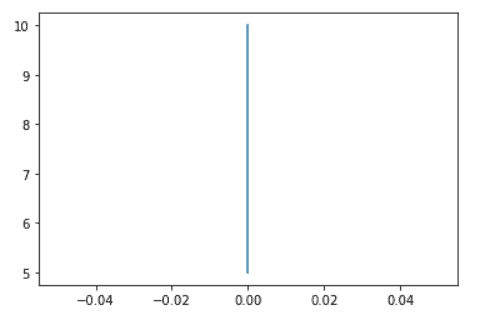

plt.plot()

### 通过使用 vlines()

在 matplotlib 中， `vlines()` 方法用于绘制穿过轴的垂直线。这里 `vlines` 代表垂直线。

**vlines()方法的语法如下:**

```py
matplotlib.pyplot.vlines(x, ymin, ymax, colors, linestyles)
```

**以上使用的参数为` `，描述如下:**

*   **x:** 指定 x 轴上绘制直线的位置。
*   **ymin 和 ymax:** 指定每行的开始和结束。这些属性是强制性的。
*   **颜色:**指定线条的颜色。
*   **线条样式:**指定线条的样式或类型。

**让我们看一个使用 vlines()方法创建的垂直线的例子:**

```py
**# Import Library**

import matplotlib.pyplot as plt

**# Plot vertical line**

plt.vlines(9, 2, 3, color='red')

**# Show**

plt.show()
```

*   在上面的例子中，我们导入了 `matplotlib.pyplot` 库。
*   通过使用 `plt.vlines()` 方法我们绘制垂直线。这里我们传递 `x` 、 `ymin` 、 `ymax` 、 `color` 作为参数，并分别将其值设置为 `9` 、 `2` 、 `3` 、 `red` 。

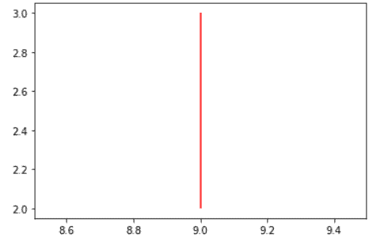

plt.vlines()

### 通过使用 axvline()

在 matplotlib 中， `axvline()` 方法用于向绘图添加垂直线。

**ax vline()方法的语法如下:**

```py
matplotlib.pyplot.axvline(x, ymin, ymax, color, linestyle)
```

**上述使用的参数描述如下:**

*   **x:** 指定 x 轴上绘制直线的位置。
*   **ymin 和 ymax:** 指定行的开始和结束范围。
*   **颜色:**指定线条的颜色。
*   **线条样式:**指定线条的样式或类型。

**axv line()方法示例:**

```py
**# Import Library**

import matplotlib.pyplot as plt

**# Plot vertical line** 
plt.axvline(x=3, ymin=0.25, ymax=0.75)

**# Show**

plt.show()
```

这里我们用 `axvline()` 的方法画一条垂直线，并将 `x` 、 `ymin` 、 `ymax` 作为参数，分别设置其值为 `3` 、 `0.25` 、 `0.75` 。

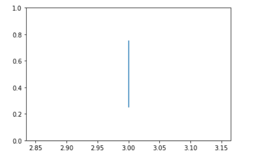

plt.axvline()

## 画垂直虚线 matplotlib

在这里我们将学习如何在 python 的 matplotlib 中绘制垂直虚线。我们必须改变线条的**线条样式**，使它们在样式上有点点。

Matplotlib.pyplot 库提供了参数 linestyle 来设置线的类型。

**让我们来看一个垂直虚线的例子:**

```py
**# Import Library**

import matplotlib.pyplot as plt

**# Plot vertical dotted line** 
plt.axvline(x=5, ymin=0.25, color='red', linestyle='dotted', linewidth=5)

**# Show**

plt.show()
```

*   这里我们用 `axvline()` 的方法画一条虚竖线。我们通过参数 `x` 、 `ymin` 、**颜色**、**线型**和**线宽**。
*   我们的主要目的是绘制一条本质上是虚线的垂直线，所以我们将**线型**设置为**虚线**，并通过使用**线宽**参数来增加线条的宽度。

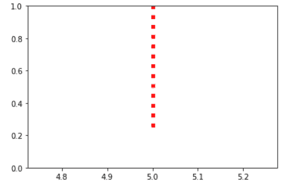

*” Dotted vertical line “*

同样，阅读: [Matplotlib 绘制一条线](https://pythonguides.com/matplotlib-plot-a-line/)

## Matplotlib 用标签画垂直线

在这一节，我们将学习如何用标签画垂直线。这里我们使用 `axvline()` 方法画一条垂直线，并将**标签**作为参数传递。

**绘制` `竖线的语法带标签:**

```py
matplotlib.pyplot.axvline(x, ymin, ymax, color, label)
```

**举例:**

```py
**# Import Library**

import matplotlib.pyplot as plt

**# Plot vertical line** 
plt.axvline(x=10, linewidth=5, label= 'vertical-line')

**# Add label**

plt.legend(loc = 'upper left')

**# Show**

plt.show()
```

*   通过使用 `plt.axvline()` 方法我们画一条垂直线并传递参数**标签**。
*   然后通过使用 `plt.legend()` 方法，我们将标签的位置设置为**左上角的**。

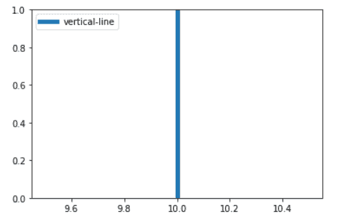

*” Vertical line with label “*

阅读: [Python 使用 Matplotlib 绘制多条线](https://pythonguides.com/python-plot-multiple-lines/)

## Matplotlib 绘制多条垂直线

这里我们要用 python 在 matplotlib 中创建多条竖线。用于创建多条垂直线的方法有:

*   使用 axvline()
*   使用 vlines()

### 通过使用 axvline()

在 matplotlib 中，通过使用 `axvline()` 方法，我们可以在绘图中创建多条垂直线。

**我们来看一个与此相关的例子:**

```py
**# Import library**

import matplotlib.pyplot as plt

**# Vertical line 1**

plt.axvline(x = 5, color = 'b')

**# Vertical line 2** 
**# We also set range of the line**

plt.axvline(x = 3, ymin = 0.2, ymax = 2, color='red')

**# Display**

plt.show()
```

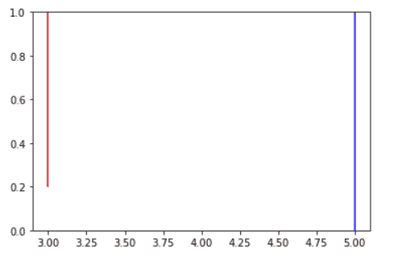

*” Multiple vertical lines “*

### 通过使用 vlines()

在 matplotlib 中，通过使用 `vlines()` 方法，我们可以在绘图中创建多条垂直线。

**举例:**

```py
**# Import library**

import matplotlib.pyplot as plt

**# Vertical line 1**

plt.vlines(x = 5, ymin = 1, ymax = 2, color = 'black')

**# Vertical line 2** 
plt.vlines (x = 3, ymin = 1.98, ymax = 1.5, color='red')

**# Vertical line 3**

plt.vlines (x = [1, 2, 3] , ymin = 0.2, ymax = 0.6, color = 'orange')

**# Vertical line 4**

plt.vlines (x = 10, ymin = 0.2, ymax = 2, color='yellow')

**# Display**

plt.show()
```

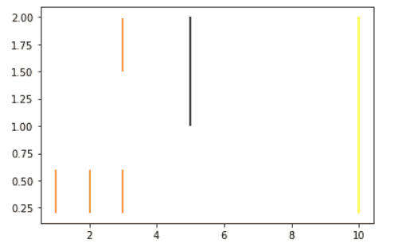

plt.vlines()

阅读: [Matplotlib 绘图条形图](https://pythonguides.com/matplotlib-plot-bar-chart/)

## 绘制垂直线 matplotlib 日期时间

这里我们用 python 在 matplotlib 的 datetime plot 上画一条垂直线。

为此，首先你必须导入 `datetime` 库，然后通过使用 `axvline()` 或 `vlines()` 方法你可以画一条垂直线。

**我们来看一个例子:**

```py
**# Import Library**

import matplotlib.pyplot as plt
import datetime

**# Vertical line**

plt.axvline(datetime.datetime.now())

**# Print date and time**

print(datetime.datetime.now())

**# Format date** 
plt.gcf().autofmt_xdate()

**# Show**

plt.show()
```

在上面的例子中，我们使用:

*   **datetime.datetime.now() :** 指定今天的日期和时间
*   **autofmt_xdate() :** 自动合成 x 轴的日期。

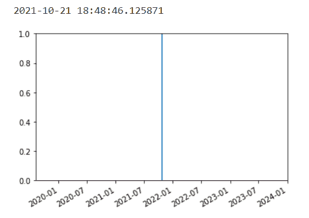

*” Vertical line on datetime plot “*

阅读: [Matplotlib 最佳拟合线](https://pythonguides.com/matplotlib-best-fit-line/)

## Matplotlib 在两点之间画垂直线

这里我们将学习如何在两个点或数据标记之间画一条垂直线。

**让我们看一个用垂直线连接两点的例子:**

```py
**# Import Library**

import matplotlib.pyplot as plt

**# Define data**

x = [2, 3, 4, 5]
y = [(2, 5), (1, 3), (6, 4), (2, 7)]

**# Plot** 

plt.plot(x, [i for (i,j) in y], 'co', markersize = 7)
plt.plot(x, [j for (i,j) in y], 'mo', markersize = 7)

**# Vertical line**

plt.plot((x,x),([i for (i,j) in y], [j for (i,j) in y]),c='red')

**# Display**

plt.show()
```

*   首先，我们导入 `matplotlib.pyplot` 库。之后，我们在 x 轴和 y 轴上定义数据。
*   然后我们使用 `plt.plot()` 方法来绘制标记或点，这里我们传递 `x` **数据点**，并使用**进行循环**来定义 `y` **数据点**。
*   现在为了连接两个点，我们传递 `x` 、 `y` 、**颜色**作为参数。这里我们设置 **(x，x)** 为 x 轴点，使用**为循环**连接 y 轴点。

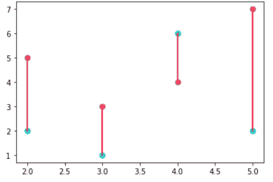

plt.plot()

阅读: [Matplotlib 支线剧情教程](https://pythonguides.com/matplotlib-subplot-tutorial/)

## 绘制垂直线段 matplotlib

在这里，我们将看到一个例子，我们在 matplotlib 的绘图中绘制了一个垂直线段。

**举例:**

```py
**# Import Library**

import matplotlib.pyplot as plt
import numpy as np

**# Define Data**

x = np.arange(0, 15, 0.2)
y = np.sin(x)

**# Plot figure**

plt.plot(x, y)

**# Vertical line**

plt.axvline(x=7.9,color='red')

**# Title**

plt.title("Sine Function", fontsize= 15, fontweight='bold')

**# Generate Plot**

plt.show()
```

*   在上面的例子中，我们首先导入 `matplotlib.pyplot` 和 `numpy` 库。
*   之后，我们使用 `arange()` 和 `sin()` 方法定义数据。
*   通过使用 `plt.plot()` 方法，我们绘制了一个图形。
*   然后用 `axvline()` 方法画一条垂直线。这里我们将 `x` 和**颜色**作为参数传递。
*   `plt.title()` 用于给情节添加标题， `plt.show()` 方法用于在用户屏幕上显示情节。

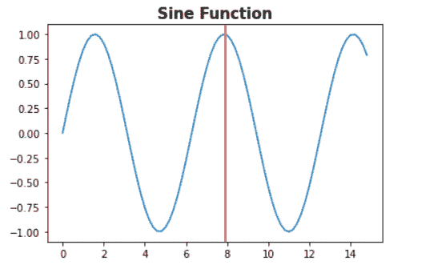

*” Vertical line segment in Sine Plot “*

读取: [Matplotlib 日志日志图](https://pythonguides.com/matplotlib-log-log-plot/)

## 在直方图 matplotlib 上绘制垂直线

有时程序员想找到直方图条或函数的平均值。在这种情况下，我们需要直方图中的一条竖线来表示每个柱或函数的平均值。

首先，你必须知道如何创建一个直方图。让我们看看创建直方图的语法。

```py
matplotlib.pyplot.hist(x, bins, color, edgecolor, ....)
```

**让我们看一个在` `直方图上画一条垂直线的例子:**

```py
**# Import Library**

import numpy as np
import matplotlib.pyplot as plt

**# Define data**

np.random.random()
x = np.random.gamma(15, 1.5, 50)

**# Plot histogram**

plt.hist(x, bins=10, color='m', edgecolor='k')

**# Vertical line** 
plt.axvline(x.mean(), color='k', linestyle='dotted', linewidth=5)

**# Display**

plt.show()
```

*   在上面的例子中，我们导入了 `matplotlib.pyplot` 和 `numpy` 包。
*   接下来，我们使用`random gamma()`方法定义数据，这里我们将**形状**、**比例**和**大小**作为参数传递。
*   然后我们使用 `plt.hist()` 方法为创建的样本数据绘制直方图。
*   通过使用 `plt.axvline()` 方法，我们在定义的样本数据的平均值处画一条垂直线。

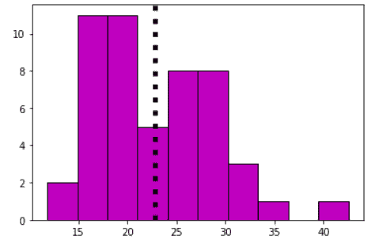

plt.hist()

另外，看看更多的 Matplotlib 教程。

*   [Matplotlib 虚线](https://pythonguides.com/matplotlib-dashed-line/)
*   [Matplotlib plot_date](https://pythonguides.com/matplotlib-plot-date/)
*   [Matplotlib set _ yticklabels](https://pythonguides.com/matplotlib-set_yticklabels/)
*   [Matplotlib 3D scatter](https://pythonguides.com/matplotlib-3d-scatter/)
*   [Matplotlib 散点图标记](https://pythonguides.com/matplotlib-scatter-marker/)
*   [Matplotlib 移除刻度标签](https://pythonguides.com/matplotlib-remove-tick-labels/)
*   [Matplotlib 旋转刻度标签](https://pythonguides.com/matplotlib-rotate-tick-labels/)
*   [Matplotlib 目前正在使用 agg 非 gui 后端](https://pythonguides.com/matplotlib-is-currently-using-agg-a-non-gui-backend/)

在本 Python 教程中，我们已经讨论了**“绘制垂直线 matplotlib”**，并且我们还涵盖了一些与之相关的例子。这些是我们在本教程中讨论过的以下主题。

*   绘制垂直线 matplotlib
*   绘制垂直虚线 matplotlib
*   Matplotlib 绘制带标签的垂直线
*   Matplotlib 绘制多条垂直线
*   绘制垂直线 matplotlib 日期时间
*   Matplotlib 在两点之间画垂直线
*   绘制垂直线段 matplotlib
*   在直方图 matplotlib 上绘制垂直线

[Bijay Kumar](https://pythonguides.com/author/fewlines4biju/)

Python 是美国最流行的语言之一。我从事 Python 工作已经有很长时间了，我在与 Tkinter、Pandas、NumPy、Turtle、Django、Matplotlib、Tensorflow、Scipy、Scikit-Learn 等各种库合作方面拥有专业知识。我有与美国、加拿大、英国、澳大利亚、新西兰等国家的各种客户合作的经验。查看我的个人资料。

[enjoysharepoint.com/](https://enjoysharepoint.com/)[](https://www.facebook.com/fewlines4biju "Facebook")[](https://www.linkedin.com/in/fewlines4biju/ "Linkedin")[](https://twitter.com/fewlines4biju "Twitter")