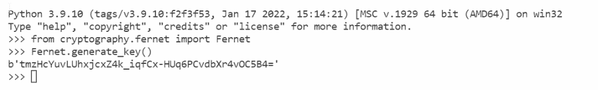

# 如何在 Django 中加密和解密密码

> 原文：<https://pythonguides.com/encrypt-and-decrypt-password-in-django/>

[](https://sharepointsky.teachable.com/p/python-and-machine-learning-training-course)

在本 [Python Django 教程](https://pythonguides.com/how-to-install-django/)中，我们将学习 Django 中的**加密和解密密码` `。我们还会看到与此相关的例子。这些是我们将在本教程中讨论的以下主题**

*   如何在 Django 中加密和解密密码
*   使用内置库在 Django 中加密和解密密码
*   不使用内置库在 Django 中加密和解密密码

目录

[](#)

*   [如何在 Django 中加密和解密密码](#How_to_encrypt_and_decrypt_password_in_Django "How to encrypt and decrypt password in Django")
    *   [使用库](#Using_the_Library "Using the Library")
    *   [不使用库](#Without_Using_the_Library "Without Using the Library")
*   [使用内置库在 Django 中加密和解密密码](#Encrypt_and_Decrypt_password_in_Django_using_built-in_library "Encrypt and Decrypt password in Django using built-in library")
*   [不使用内置库在 Django 中加密和解密密码](#Encrypt_and_Decrypt_passwords_in_Django_without_using_built-in_library "Encrypt and Decrypt passwords in Django without using built-in library")

## 如何在 Django 中加密和解密密码

在学习如何在 Django 中加密和解密密码之前，我们先来了解一下什么是加密和解密。

**加密:**

*   将原始版本的数据转换成被称为密文的编码形式的方法被称为**加密**。
*   一旦完成，只有接收者可以将密文解密回原始形式。
*   这是将数据转换成不容易被未经授权的个人破译的格式的过程，对于保持系统安全至关重要。
*   这是一种安全和防欺诈技术，在信息通过互联网传输之前，它会自动分解并重新排序信息。

**解密:**

*   解密是将加密数据恢复到原始状态的过程。
*   这是加密过程的逆转。
*   它允许您解密加密数据，以便拥有正确密钥的授权用户可以访问它。

**密码术:**

*   加密和解密都包含在术语密码术中。
*   它是对数据进行加密和解密的过程，只有指定的接收者才能读取数据。
*   **示例:**考虑一个用户，他希望从 web 应用程序的前端将他们的密码保存在数据库中。虽然数据存储在数据库中，但有被非预期用户访问的危险。因此，它被加密，然后根据需要被解码。


Cryptography

在 Django 中，有两种加密和解密密码的方法。

*   使用图书馆
*   不使用图书馆

### 使用库

你所要做的就是导入 Django 内置的 `django_cryptography` 库来加密和解密你的密码。

### 不使用库

你所要做的就是创建加密和解密函数来加密和解密你的密码。

阅读:[如何设置 Django 项目](https://pythonguides.com/setup-django-project/)

## 使用内置库在 Django 中加密和解密密码

在这一节中，我们将学习使用内置的加密库来加密和解密密码。

**我们来看一个例子:**

**创建项目:** 首先，我们需要构建一个 **Django 项目**。为此，请打开终端并键入以下命令。

```py
django-admin startproject PythonGuides
```

*   这里的 `PythonGuides` 是项目的名称。


Create Project

**创建 App:** 然后，我们需要构建一个 `Django App` 。为此，请打开终端并键入以下命令。

```py
python manage.py startapp CryptoApp
```


Create App

**创建模板:** 在此之后，在项目根目录下，创建一个**模板文件夹**。并且我们在文件夹中制作 `HTML` 文件。


Templates

**添加模板:** 我们还需要在 `settings.py` 文件中添加模板目录。

```py
'DIRS' = ['Templates']
```


Add Templates

**安装 App:** 以上创建的 App 必须包含在 `settings.py` 文件中。

```py
INSTALLED_APPS = [
    'django.contrib.admin',
    'django.contrib.auth',
    'django.contrib.contenttypes',
    'django.contrib.sessions',
    'django.contrib.messages',
    'django.contrib.staticfiles',
    'CryptoApp',
]
```

*   这里，我们将 `CryptoApp` 添加到 `Installed_Apps` 列表中。

**创建模型:** 在 `models.py` 文件中添加以下代码。

```py
from django.db import models

class Login(models.Model):
    email = models.EmailField()
    password = models.CharField(max_length=10)
    class Meta:
        db_table="Login" 
```

*   我们创建了具有两个字段的**登录**模型。
*   各自的字段是**电子邮件**和**密码**。

**注册** 型号:在 admin.py 文件中添加以下代码。

```py
from django.contrib import admin
from .models import Login

admin.site.register(Login)
```

*   我们在管理站点上注册了**登录**模型。

**加密密码:** 在 Django 中加密一个密码，我们使用内置函数 `make_password` 。该方法将纯文本密码转换为可以存储在数据库中的哈希。

**语法:**

```py
**# Import**

from django.contrib.auth.hashers import make_password

**# make_password function**

make_password(password)
        # OR
make_password(password, None, hasher)
        # OR
make_password(password, 'qwertyuiop', hasher)
```

**哈希器:**加密哈希函数是一种哈希算法。这是一个将任意大小的数据转换成固定大小的散列的数学过程。算法名称如下。

*   sha1
*   讯息摘要 5
*   无盐 _sha1
*   无盐 _md5
*   地窖
*   pbkdf2_sha256
*   pbkdf2_sha1
*   氩气 2

默认情况下，PBKDF2 hasher 用于加密密码。

**添加设置:**在 settings.py 文件中添加以下密码哈希。

```py
PASSWORD_HASHERS = [
  'django.contrib.auth.hashers.PBKDF2PasswordHasher',
  'django.contrib.auth.hashers.PBKDF2SHA1PasswordHasher',
  'django.contrib.auth.hashers.Argon2PasswordHasher',
  'django.contrib.auth.hashers.BCryptSHA256PasswordHasher',
  'django.contrib.auth.hashers.BCryptPasswordHasher',
  'django.contrib.auth.hashers.SHA1PasswordHasher',
  'django.contrib.auth.hashers.MD5PasswordHasher',
  'django.contrib.auth.hashers.UnsaltedSHA1PasswordHasher',
  'django.contrib.auth.hashers.UnsaltedMD5PasswordHasher',
  'django.contrib.auth.hashers.CryptPasswordHasher',
]
```

解密密码: Django 不提供任何内置的库或函数来解密加密的密码。因为解密密码从来都不是一个好主意。

我们不是解密哈希密码，而是将哈希密码与明文密码进行比较，并检查它们是否与哈希密码等效。用来检查的函数是 **check_password。**

**语法:**

```py
from django.contrib.auth.hashers import check_password

check_password(password, hash password)
```

**加密和解密密码的示例如下:**

**创建视图:** 在 views.py 文件中添加以下代码。

```py
from django.shortcuts import render, HttpResponse
from .models import Login
from django.contrib.auth.hashers import make_password, check_password

def login(request):
    if request.method == 'POST':
        email = request.POST['email']
        encryptedpassword=make_password(request.POST['password'])
        print(encryptedpassword)
        checkpassword=check_password(request.POST['password'], encryptedpassword)
        print(decryptedpassword)
        data=Login(email=email, password=encryptedpassword)

        data.save()
        return HttpResponse('Done')
    else:
        return render(request, 'index.html')
```

*   这里导入`Django . contrib . auth . hashers`的 Django 内置 `make_password` 和 `check_password` 函数。
*   然后，我们使用 `make_password` 函数对密码进行加密，并在终端上打印出来。
*   之后，我们通过使用 `check_password` 来检查加密密码和原始密码是否相同。

**创建 HTML 模板:**

```py
<!DOCTYPE html>
<html lang="en">

<head>
    <meta charset="UTF-8">
    <meta http-equiv="X-UA-Compatible" content="IE=edge">
    <meta name="viewport" content="width=device-width, initial-scale=1.0">
    <title>Enter Employee</title>
</head>
<style>
    table {
        border: 8px outset;
        border-radius: 10px;
        border-spacing: 10px;
        padding: 20px;
        margin-left: auto;
        margin-right: auto;
    }

    th,
    td {
        padding: 5px;
    }
</style>

<body>
    <h2 style="text-align:center"> Login Employee </h2>
    <form method="POST">
        
        <table style="width:50%" align="center">
            <tr>
                <td>Email</td>
                <td><input type="email" placeholder="Enter Employee Email" name="email" </td>
            </tr>
            <tr>
                <td>Password</td>
                <td><input type="password" placeholder="Enter Employee Password" name="password" </td>
            </tr>
            <tr>
                <td colspan="2" align="center"><input type="submit" class="btn btn-success"> </td>
            </tr>
        </table>
    </form>
</body>

</html>
```

*   这里，我们创建一个 HTML 登录表单。

**命令:** 在终端上运行以下命令进行迁移。

```py
# Make Migrations

python manage.py makemigrations

# Migrate

python manage.py migrate
```

**运行服务器:** 在终端中键入以下命令。

```py
python manage.py runserver
```

绕过浏览器地址栏中的 http://127.0.0.1:8000/login 运行开发服务器。

*   输入您的电子邮件和密码。


Login Form

当我们点击提交按钮时，HttpResponse 打印出来。


HTTP Response

查看密码如何保存在管理员的网站。


Admin Site

散列密钥和 check_function 的结果打印在终端上。


Terminal

阅读: [Python Django 与 Flask–主要区别](https://pythonguides.com/python-django-vs-flask/)

## 不使用内置库在 Django 中加密和解密密码

在这一节中，我们将学习在不使用内置加密库的情况下加密和解密密码。

**我们来看一个例子:**

**创建项目:** 首先，我们需要构建一个 **Django 项目**。打开终端并键入以下命令。

```py
djnago-admin startproject PythonGuides
```

这里，PythonGuides 是项目名称。

**创建 App:** 在此之后，我们需要建立一个 `Django App` 。打开终端并键入以下命令。

```py
python manage.py startapp home
```

这里，home 是 app 名称。

**创建模板:** 之后，**模板文件夹**被创建。并且我们在文件夹中添加 `HTML` 文件。

**添加模板:** 然后，在 `settings.py` 文件中添加上面创建的模板目录。

```py
'DIRS' = ['Templates']
```

**安装 APP:** 上面创建的 app **【首页】**必须包含在 `settings.py` 文件中。

```py
INSTALLED_APPS = [
    'django.contrib.admin',
    'django.contrib.auth',
    'django.contrib.contenttypes',
    'django.contrib.sessions',
    'django.contrib.messages',
    'django.contrib.staticfiles',
    'home',
]
```

**项目 URL:** 在**项目的 urls.py** 文件中，添加下面的代码来包含 `home.urls` 的路径

```py
from django.contrib import admin
from django.urls import path, include

urlpatterns = [
    path('admin/', admin.site.urls),
    path('',include('home.urls')),
]
```

**App URL:** 首先，我们必须在 App 目录下创建一个名为 `urls.py` 的文件来定义各个视图的路径。

```py
from django.urls import path
from . import views

urlpatterns = [
    path('', views.register, name='register'),
]
```

**安装依赖:** 使用以下命令安装 Python 加密模块。

```py
pip install cryptography
```

**加密密钥:** 必须生成加密密钥，为此打开终端并键入以下命令。

```py
from cryptography.fernet import Fernet
Fernet.generate_key()
```

*   首先，我们导入 `Fernet` 。
*   然后，使用 `generate_key()` 函数生成密钥。



Encryption Key

**添加密钥:** 将上面生成的密钥添加到 settings.py 文件中。

```py
ENCRYPT_KEY = b'tmzHcYuvLUhxjcxZ4k_iqfCx-HUq6PCvdbXr4vOC5B4='
```

**创建模型:** 在 `models.py` 文件中添加以下代码。

```py
from django.db import models

class EmpLogin(models.Model):
    name = models.CharField(max_length=200)
    email = models.EmailField()
    password = models.CharField(max_length=8)
    class Meta:
        db_table="EmpLogin"
```

*   我们用五个字段创建了 `EmpLogin` 模型。
*   各自的字段是**姓名**、**电子邮件**和**密码**。

**注册型号:** 在 `admin.py` 文件中添加以下代码。

```py
from django.contrib import admin
from .models import EmpLogin

admin.site.register(EmpLogin)
```

*   为了在管理站点上注册 `EmpLogin` 模型，我们使用带有模型名称的 `admin.site.register()` 函数。

**创建加解密函数:** 在 home app 中创建一个 `encrypt_util.py` 文件。

```py
from cryptography.fernet import Fernet
import base64
import logging
import traceback
from django.conf import settings

def encrypt(pas):
    try:        
        pas = str(pas)
        cipher_pass = Fernet(settings.ENCRYPT_KEY)
        encrypt_pass = cipher_pass.encrypt(pas.encode('ascii'))
        encrypt_pass = base64.urlsafe_b64encode(encrypt_pass).decode("ascii") 
        return encrypt_pass
    except Exception as e:
        logging.getLogger("error_logger").error(traceback.format_exc())
        return None

def decrypt(pas):
    try:
        pas = base64.urlsafe_b64decode(pas)
        cipher_pass = Fernet(settings.ENCRYPT_KEY)
        decod_pass = cipher_pass.decrypt(pas).decode("ascii")     
        return decod_pass
    except Exception as e:
        logging.getLogger("error_logger").error(traceback.format_exc())
        return None
```

*   我们创建一个**加密**和**解密**函数来加密和解密密码。
*   我们使用 `urlsafe` ， `base64` 来转换加密的数据。
*   如果在加密和解密时出现错误，记录它并返回 null。

**创建视图:** 在 `views.py` 文件中添加以下代码。

```py
from django.shortcuts import render
from django.http import HttpResponse
from. models import EmpLogin
from home.encrypt_util import *

def register(request):
    if request.method == 'POST':
        name = request.POST['name']
        email = request.POST['email']
        password = request.POST['password']
        print('Original Password:', request.POST['password'])
        encryptpass= encrypt(request.POST['password'])
        print('Encrypt Password:',encryptpass)
        decryptpass= decrypt(encryptpass)
        print('Decrypt Password:',decryptpass)
        data=EmpLogin(name=name, email=email, password=password)
        data.save()
        return HttpResponse('Done')
    else:
        return render(request, 'index.html')
```

*   在这里，我们创建一个**注册**视图。
*   视图接收用户输入的名称、电子邮件和密码。
*   然后，我们打印出**原始密码**、**加密密码**和**解密密码。**
*   它还显示成功输入数据后的 HttpResponse Done。

**创建 HTML 文件:** 将下面的代码添加到 index.html 文件中。

```py
<!DOCTYPE html>
<html lang="en">

<head>
    <meta charset="UTF-8">
    <meta http-equiv="X-UA-Compatible" content="IE=edge">
    <meta name="viewport" content="width=device-width, initial-scale=1.0">
    <title>Enter Employee</title>
</head>
<style>
    table {
        border: 8px outset;
        border-radius: 10px;
        border-spacing: 10px;
        padding: 20px;
        margin-left: auto;
        margin-right: auto;
    }

    th,
    td {
        padding: 5px;
    }
</style>

<body>
    <h2 style="text-align:center"> Enter Details of Employee </h2>
    <form method="POST">
        
        <table style="width:50%" align="center">
            <tr>
                <td>Employee Name</td>
                <td><input type="text" placeholder="Enter Employee Name" name="name" </td>
            </tr>
            <tr>
                <td>Email</td>
                <td><input type="email" placeholder="Enter Employee Email" name="email" </td>
            </tr>
            <tr>
                <td>Password</td>
                <td><input type="password" placeholder="Enter Employee Password" name="password" </td>
            </tr>
            <tr>
                <td colspan="2" align="center"><input type="submit" class="btn btn-success"> </td>
            </tr>
        </table>
    </form>
</body>

</html>
```

*   这里，我们创建一个表单来接收用户的输入。

**基本命令:** 在终端上运行以下基本命令。

```py
# Make Migrations

python manage.py makemigrations

# Migrate

python manage.py migrate

# Run Server

python manage.py runserver
```

**输出:** 绕过浏览器地址栏的 http://127.0.0.1:8000/运行开发服务器。


Enter Details


Details

输入详细信息后，点击**提交**按钮。


HTTP Response

现在，打开终端，看到**原始密码**，**加密解密密码**。


Password Encryption and Decryption

您可能也喜欢阅读下面的 Python Django 教程。

*   [如何从 Django 的 get 请求中获取数据](https://pythonguides.com/get-data-from-get-request-in-django/)
*   [Python Django 中网站的简单联系方式](https://pythonguides.com/simple-contact-form-for-website-in-python-django/)
*   [Python Django 连接字符串](https://pythonguides.com/django-concatenate-string/)
*   [如何删除 Django 中的会话属性](https://pythonguides.com/delete-session-property-in-django/)
*   [Django 从 POST 请求中获取所有数据](https://pythonguides.com/django-get-all-data-from-post-request/)
*   [如何获取 Django 的当前时间](https://pythonguides.com/how-to-get-current-time-in-django/)
*   [如何在 Django 中创建模型](https://pythonguides.com/create-model-in-django/)

在本教程中，我们已经讨论了 Django 中的“**如何加密和解密密码` `”，我们还讨论了本教程中的以下主题。**

*   如何在 Django 中加密和解密密码
*   使用内置库在 Django 中加密和解密密码
*   不使用内置库在 Django 中加密和解密密码

[Bijay Kumar](https://pythonguides.com/author/fewlines4biju/)

Python 是美国最流行的语言之一。我从事 Python 工作已经有很长时间了，我在与 Tkinter、Pandas、NumPy、Turtle、Django、Matplotlib、Tensorflow、Scipy、Scikit-Learn 等各种库合作方面拥有专业知识。我有与美国、加拿大、英国、澳大利亚、新西兰等国家的各种客户合作的经验。查看我的个人资料。

[enjoysharepoint.com/](https://enjoysharepoint.com/)[](https://www.facebook.com/fewlines4biju "Facebook")[](https://www.linkedin.com/in/fewlines4biju/ "Linkedin")[](https://twitter.com/fewlines4biju "Twitter")