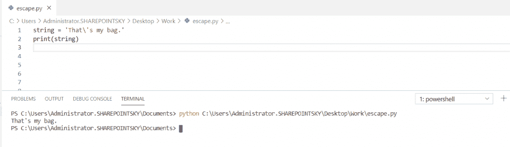
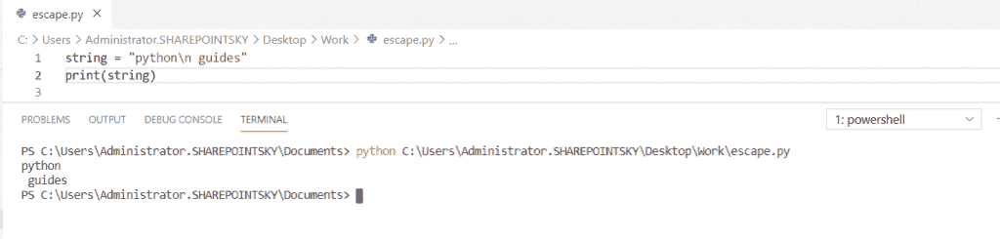
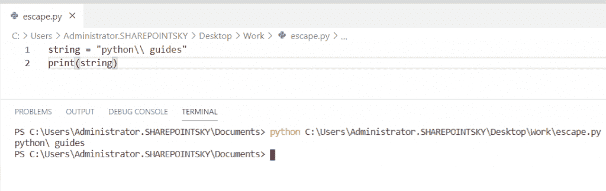
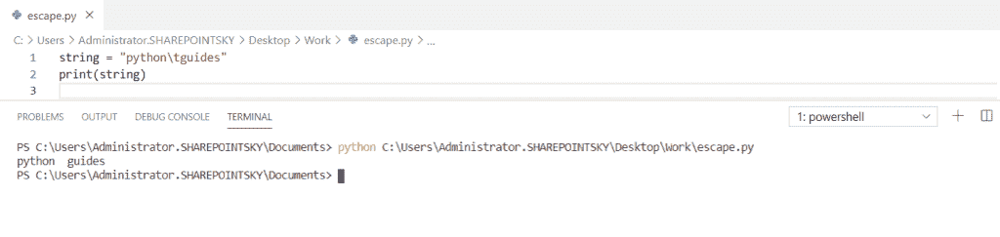
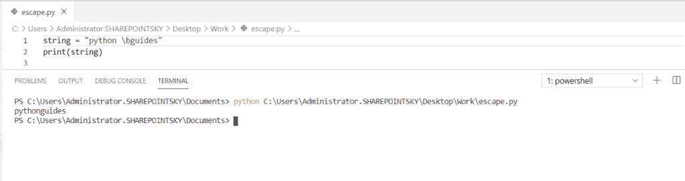
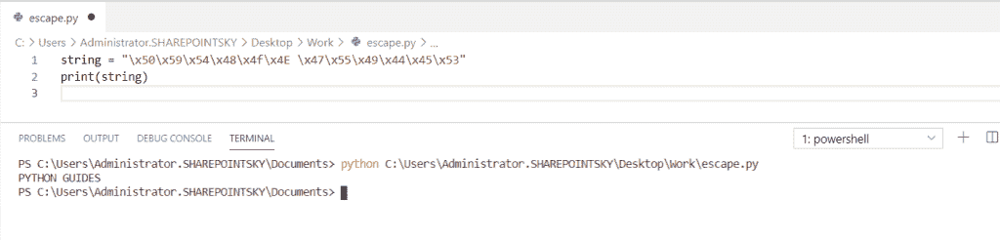
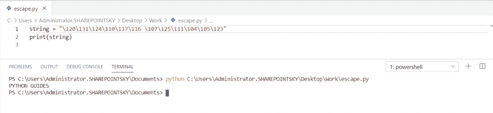
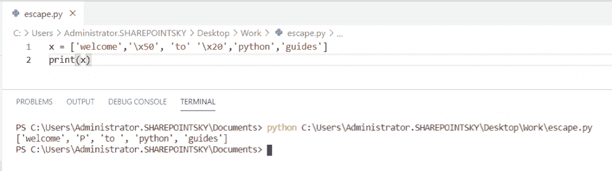
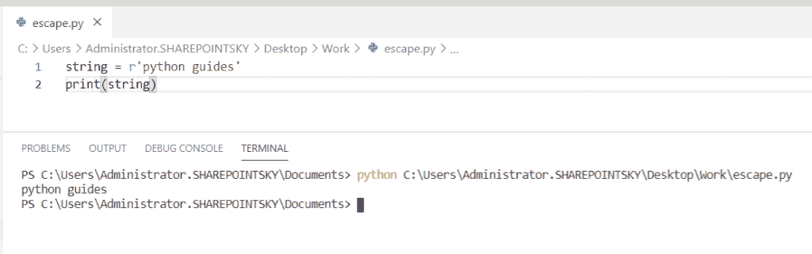
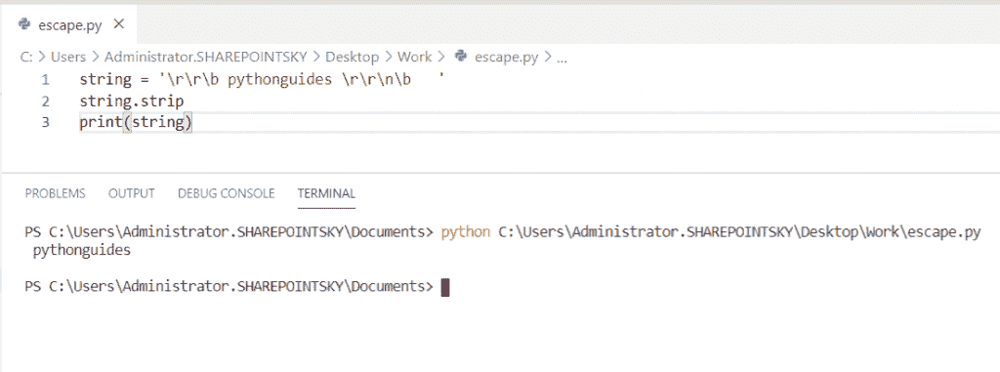

# Python 中的转义序列

> 原文：<https://pythonguides.com/escape-sequence-in-python/>

[](https://sharepointsky.teachable.com/p/python-and-machine-learning-training-course)

在本 [python 教程](https://pythonguides.com/python-hello-world-program/)中，我们将讨论 Python 中的**转义序列。我们还将检查:**

*   转义序列是什么？
*   如何在 python 中转义单引号
*   Python 转义序列 n
*   Python 转义序列反斜杠
*   Python 空间转义序列
*   用于退格的 Python 转义序列
*   六进制值的 Python 转义序列
*   八进制值的 Python 转义序列
*   从一个字符串列表中删除所有转义序列
*   空间 python 的转义字符
*   Python 转义序列忽略
*   Python 转义序列删除

目录

[](#)

*   [转义序列是什么？](#What_is_the_escape_sequence "What is the escape sequence?")
*   [如何在 Python 中转义单引号](#How_to_escape_single_quotes_in_Python "How to escape single quotes in Python")
*   [Python 转义序列 n](#Python_escape_sequence_n "Python escape sequence n")
*   [Python 转义序列反斜杠](#Python_escape_sequence_backslash "Python escape sequence backslash")
*   [Python 空间转义序列](#Python_escape_sequence_for_space "Python escape sequence for space")
*   [Python 转义序列退格](#Python_escape_sequence_backspace "Python escape sequence backspace")
*   [六进制值的 Python 转义序列](#Python_escape_sequence_for_Hexa_value "Python escape sequence for Hexa value")
*   [八进制值的 Python 转义序列](#Python_escape_sequence_for_Octal_value "Python escape sequence for Octal value")
*   从列表中删除所有转义序列
*   [空间 python 的转义符](#Escape_character_for_space_python "Escape character for space python")
*   [Python 转义序列忽略](#Python_escape_sequence_ignore "Python escape sequence ignore")
*   [Python 转义序列删除](#Python_escape_sequence_remove "Python escape sequence remove")

## 转义序列是什么？

*   转义序列是一个特殊的字符，以**反斜杠(\)** 的形式使用，后跟一个必需的**字符**。
*   这些字符用于表示空白。
*   空白给出了像空格、制表符、换页符、垂直制表符这样的字符。

| **转义序列** | **意为** |
| \' | 这代表一个单引号 |
| \n | 这代表换行符 |
| \r | 这表示回车 |
| \t | 这代表一个选项卡 |
| \b | 这表示退格 |
| \f | 这代表一个换页 |
| \ooo | 这代表一个八进制值 |
| \xhh | 这表示一个十六进制值 |
| \\ | 这代表一个反斜杠 |
| \uxxxx | 这代表 16 位十六进制值 |
| \uxxxxxxxx | 这代表 32 位十六进制值 |

Escape sequence in python

## 如何在 Python 中转义单引号

让我们来看一个在 Python 中对**单引号进行转义的例子，我们可以看到如何在 Python 中的字符串中使用 **\'** 单引号。**

示例:

```py
string = 'That\'s my bag.'
print(string) 
```

下面的截图显示单引号用于单词**，即**。



escape single quotes in Python

## Python 转义序列 n

让我们看一个 Python 转义序列 n 的例子，我使用了一个 **"\n"** 换行符。换行符用于将单词写在新的单独一行中。

示例:

```py
string = "python\n guides"
print(string) 
```

你可以参考下面的输出截图，你可以看到在新的单独一行的话。



Python escape sequence n

## Python 转义序列反斜杠

让我们来看一个 **Python 转义序列反斜杠**的例子。反斜杠是一个转义序列， **\\** 用来打印一个反斜杠。

示例:

```py
string = "python\\ guides"
print(string)
```

您可以参考下面的输出截图:



Python escape sequence backslash

## Python 空间转义序列

在这个例子中，我使用了 **"\t"** 字符来获取单词之间的空格。

示例:

```py
string = "python\tguides"
print(string) 
```

你可以参考下面的输出截图，我们可以看到单词 python 和 guides 之间的空间。



Python escape sequence for space

## Python 转义序列退格

在这个例子中，我使用了 **"\b"** 来删除 Python 中单词之间的空格。

示例:

```py
string = "python \bguides"
print(string) 
```

您可以在下面的截图中看到输出。



Python escape sequence backspace

## 六进制值的 Python 转义序列

让我们来看一个关于 hexa 值的 **Python 转义序列的例子，我已经使用了 **\x** hh 将 Hexa 值转换成一个字符串。**

示例:

```py
string = "\x50\x59\x54\x48\x4f\x4E \x47\x55\x49\x44\x45\x53"
print(string) 
```

在下面的屏幕截图中，我们可以看到转换后的字符串。



## 八进制值的 Python 转义序列

让我们检查一个八进制值的 **Python 转义序列的例子，我已经使用了 **\ooo** 将八进制值转换成一个普通的字符串。**

示例:

```py
string = "\120\131\124\110\117\116 \107\125\111\104\105\123"
print(string) 
```

您可以参考下面的输出截图:



Octal value

## 从列表中删除所有转义序列

在这个例子中，我使用了 **'\x50'** ,通过将十六进制值转换为字符串来删除所有转义序列，并且' \x20 '表示空格。

示例:

```py
x = ['welcome','\x50', 'to' '\x20','python','guides']
print(x)
```

在下面的截图中，我们可以看到 Hexa 值 **'\x50'** 转换为 **'p'** ， **'\x20'** 转换为**空间**的输出。



Remove all escape sequence from all a list in a string

## 空间 python 的转义符

在这个例子中，我在单词之间使用了 **\t** 来获得空格。

示例:

```py
string = "python\tguides"
print(string) 
```

在这个输出中，我们可以看到单词之间的空格。


Escape character for space python

## Python 转义序列忽略

为了忽略字符串中的转义序列，我们必须将 `r` 放在字符串前面，使**字符串成为原始字符串**。

示例:

```py
string = r'python guides'
print(string)
```

你可以参考下面的输出截图。在这个输出中，我们可以看到原始语句被忽略了。



Python escape sequence ignore

## Python 转义序列删除

在这个例子中，我使用了 `string.split()` 来删除参数左边和右边的字符。

```py
string = '\r\r\b pythonguides \r\r\n\b   '
string.strip
print(string)
```

您可以参考下面的输出截图:



Python escape sequence remove

您可能会喜欢以下 Python 教程:

*   [Python 列表理解λ](https://pythonguides.com/python-list-comprehension/)
*   [Python 线程和多线程](https://pythonguides.com/python-threading-and-multithreading/)
*   [如何将 Python 角度转换为弧度](https://pythonguides.com/python-degrees-to-radians/)
*   [Python 比较运算符](https://pythonguides.com/python-comparison-operators/)
*   [Python 命名空间教程](https://pythonguides.com/python-namespace-tutorial/)
*   [Python Tkinter 帧](https://pythonguides.com/python-tkinter-frame/)
*   [如何用 Python 制作矩阵](https://pythonguides.com/make-a-matrix-in-python/)
*   [Python 中的链表](https://pythonguides.com/linked-lists-in-python/)
*   [Python 要求用户输入](https://pythonguides.com/python-ask-for-user-input/)

在本 Python 教程中，我们学习了 python 中的**转义序列。此外，我们还讨论了以下主题:**

*   转义序列是什么？
*   如何在 python 中转义单引号
*   Python 转义序列 n
*   Python 转义序列反斜杠
*   Python 空间转义序列
*   用于退格的 Python 转义序列
*   六进制值的 Python 转义序列
*   八进制值的 Python 转义序列
*   从一个字符串列表中删除所有转义序列
*   空间 python 的转义字符
*   Python 转义序列忽略
*   Python 转义序列删除

[Bijay Kumar](https://pythonguides.com/author/fewlines4biju/)

Python 是美国最流行的语言之一。我从事 Python 工作已经有很长时间了，我在与 Tkinter、Pandas、NumPy、Turtle、Django、Matplotlib、Tensorflow、Scipy、Scikit-Learn 等各种库合作方面拥有专业知识。我有与美国、加拿大、英国、澳大利亚、新西兰等国家的各种客户合作的经验。查看我的个人资料。

[enjoysharepoint.com/](https://enjoysharepoint.com/)[](https://www.facebook.com/fewlines4biju "Facebook")[](https://www.linkedin.com/in/fewlines4biju/ "Linkedin")[](https://twitter.com/fewlines4biju "Twitter")