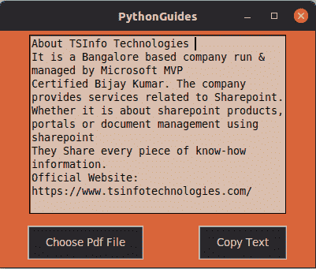
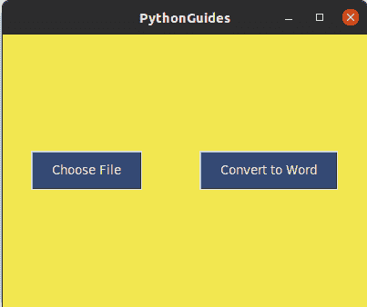
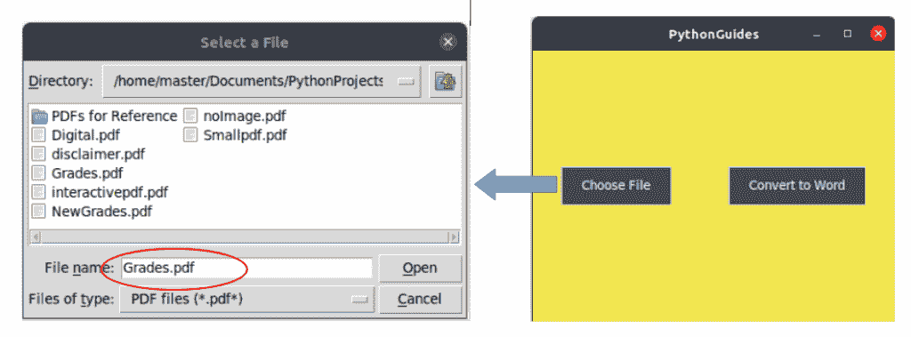
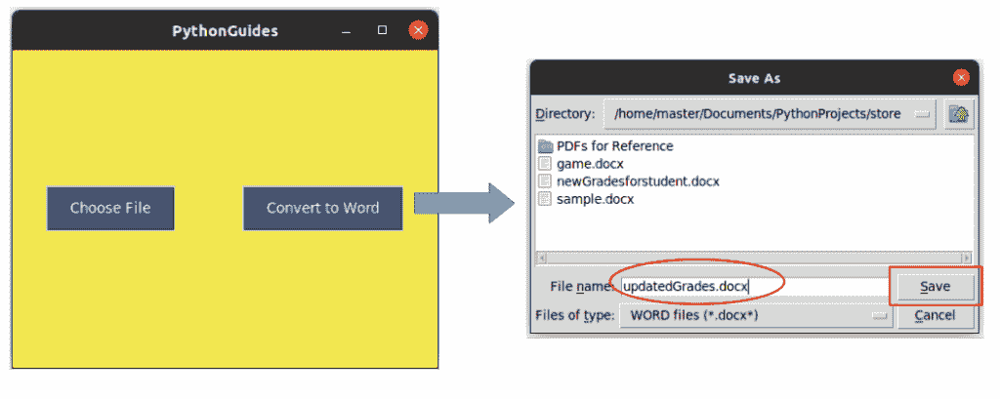
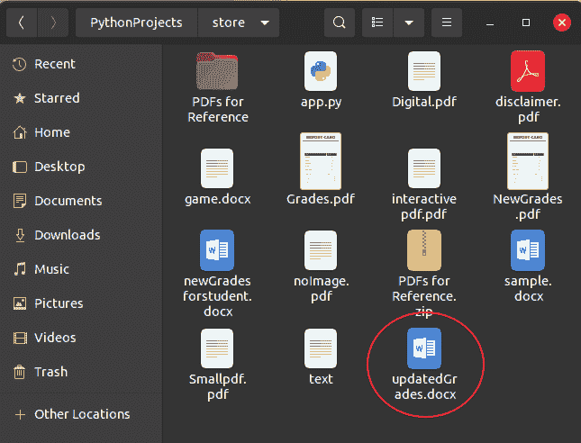
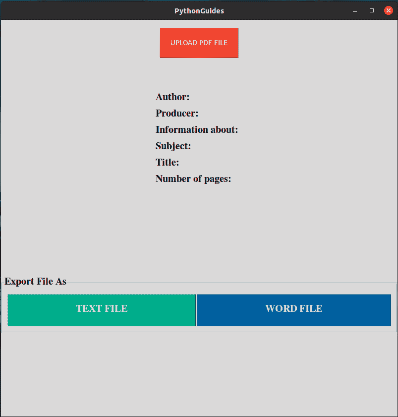

# 从 PDF Python +有用的例子中提取文本

> 原文：<https://pythonguides.com/extract-text-from-pdf-python/>

[](https://sharepointsky.teachable.com/p/python-and-machine-learning-training-course)

本 Python 教程解释，**从 PDF Python 中提取文本**。我们将看到如何使用 Python Tkinter 从 Python 的 PDF 文件中提取文本。我还将展示一个我们用 Python 开发的 **pdf 到 word 转换器**。

此外，我们将检查:

*   用 Python 从 pdf 文件中复制文本
*   如何使用 Python Tkinter 从 pdf 文件中提取文本
*   用 Python 删除 pdf 文件中的文本
*   如何用 Python 从 pdf 文件图像中复制文本
*   不能从 pdf 拷贝文本
*   如何在 Python 中将文本从 pdf 复制到 word
*   从 pdf 在线复制文本
*   从 pdf online 中删除文本
*   如何在 Python 中从 pdf 中选择文本

在做下面的例子之前，先看看下面的三篇文章:

*   [PdfFileReader Python 示例](https://pythonguides.com/pdffilereader-python-example/)
*   [PdfFileMerger Python 示例](https://pythonguides.com/pdffilemerger-python-examples/)
*   [PdfFileWriter Python 示例(20 个示例)](https://pythonguides.com/pdffilewriter-python-examples/)

目录

[](#)

*   [Python 从 pdf 文件中复制文本](#Python_copy_text_from_pdf_file "Python copy text from pdf file")
*   [从 pdf Python 中提取文本](#Extract_text_from_pdf_Python "Extract text from pdf Python")
*   [用 Python 从 pdf 文件中删除文本](#Delete_text_from_pdf_file_in_Python "Delete text from pdf file in Python")
*   [Python 从图像中提取文本](#Python_extract_text_from_image "Python extract text from image")
*   [无法在 Python 中从 pdf 复制文本](#Cant_copy_text_from_pdf_in_Python "Can’t copy text from pdf in Python")
*   [如何用 Python 将文本从 pdf 复制到 word](#How_to_copy_text_from_pdf_to_word_in_Python "How to copy text from pdf to word in Python")
*   [如何在 Python 中从 pdf 文件中选择文本](#How_to_Select_text_from_pdf_file_in_Python "How to Select text from pdf file in Python")
*   [如何将 Pdf 转换成 word Python pypdf2](#How_to_Convert_Pdf_to_word_Python_pypdf2 "How to Convert Pdf to word Python pypdf2")

## Python 从 pdf 文件中复制文本

*   在这一节中，我们将学习如何使用 Python 从 PDF 文件中复制文本。此外，我们将使用 [Python Tkinter](https://pythonguides.com/python-gui-programming/) 演示一切。我们假设您已经在各自的系统中安装了 PyPDF2 和 Tkinter 模块。
*   在 Python Tkinter 中复制文本的过程分为两个部分:
    *   在第一部分中，我们将使用 Python 中的 PyPDF2 模块从 pdf 中提取文本。
    *   第二步，我们将使用 Python Tkinter 中可用的 **`clipboard()`** 函数复制文本。

下面是使用 Python 中的 PyPDF2 模块从 PDF 中读取和提取数据的代码。

```py
reader = PdfFileReader(filename)
pageObj = reader.getNumPages()
for page_count in range(pageObj):
    page = reader.getPage(page_count)
    page_data = page.extractText() 
```

*   在第一行中， [](https://www.pythonguides.com) 我们创建了一个保存 PDF 文件路径的“reader”变量。这里的 filename 是指带有路径的文件的名称。
*   在第二行中，我们获取了 PDF 文件中的总页数。
*   在第三行中，循环开始，它将遍历 PDF 文件中的总页数。
*   每次循环运行时，它都会显示 PDF 文件中的文本信息。
*   这样，我们可以使用 Python 中的 `PyPDF2` 模块从 PDF 中提取文本。

下面是使用 Python Tkinter 复制文本的代码。

```py
 ws.withdraw()
 ws.clipboard_clear()
 ws.clipboard_append(content)
 ws.update()
 ws.destroy()
```

*   这里， `ws` 是主窗口。
*   第一行代码用于在不破坏窗口的情况下将其从屏幕上移除。
*   在第二行代码中，我们删除了任何已经复制的文本。
*   第三行代码是复制内容的操作。这里的内容可以替换为您想要复制的文本。
*   重要的是，即使在窗口关闭后，文本仍保持复制状态。为此，我们使用了更新功能。
*   在最后一行代码中，我们简单地销毁了窗口。这是一个选项，如果您不想关闭窗口，可以删除此代码。

**代码片段:**

这是一个小项目的代码，包含了我们到目前为止学到的所有东西。这个项目是使用 Python Tkinter 创建的基于 GUI 的程序，用于实现从 PDF 复制文本。

```py
from PyPDF2 import PdfFileReader
from tkinter import *
from tkinter import filedialog

ws = Tk()
ws.title('PythonGuides')
ws.geometry('400x300')
ws.config(bg='#D9653B')

def choose_pdf():
      filename = filedialog.askopenfilename(
            initialdir = "/",   # for Linux and Mac users
          # initialdir = "C:/",   for windows users
            title = "Select a File",
            filetypes = (("PDF files","*.pdf*"),("all files","*.*")))
      if filename:
          return filename

def read_pdf():
    filename = choose_pdf()
    reader = PdfFileReader(filename)
    pageObj = reader.getNumPages()
    for page_count in range(pageObj):
        page = reader.getPage(page_count)
        page_data = page.extractText()
        textbox.insert(END, page_data)

def copy_pdf_text():
    content = textbox.get(1.0, "end-1c")
    ws.withdraw()
    ws.clipboard_clear()
    ws.clipboard_append(content)
    ws.update()
    ws.destroy()

textbox = Text(
    ws,
    height=13,
    width=40,
    wrap='word',
    bg='#D9BDAD'
)
textbox.pack(expand=True)

Button(
    ws,
    text='Choose Pdf File',
    padx=20,
    pady=10,
    bg='#262626',
    fg='white',
    command=read_pdf
).pack(expand=True, side=LEFT, pady=10)

Button(
    ws,
    text="Copy Text",
    padx=20,
    pady=10,
    bg='#262626',
    fg='white',
    command=copy_pdf_text
).pack(expand=True, side=LEFT, pady=10)

ws.mainloop() 
```

**输出:**

在这个输出中，我们使用了 [Python Tkinter 文本框](https://pythonguides.com/python-tkinter-to-display-data-in-textboxes/)来显示 PDF 文件的文本。用户将点击**选择 PDF 文件**按钮。使用 Python Tkinter 中的**文件对话框**，他/她可以从计算机中导航并选择 PDF 文件。

文本将立即显示在文本框中，从这里用户只需点击**复制文本**按钮即可复制文本。文本将被复制，并可以像我们通常所做的那样粘贴到任何地方。



Python copy text from pdf file

这就是如何用 Python 从 PDF 文件中**复制文本。**

## 从 pdf Python 中提取文本

*   在本节中，我们将学习如何使用 Python Tkinter 从 PDF 中提取文本。Python 中的 PyPDF2 模块提供了一个方法 `extractText()` ，使用该方法我们可以从 Python 中的 PDF 中提取文本。
*   在上一节中，我们已经演示了**如何在 Python Tkinter** 中复制文本。这里我们使用了`**extract text()`方法在屏幕上显示文本。**
*   **下面是上一节中使用 Python Tkinter 中的 PyPDF 模块从 PDF 中提取文本的代码。**

```py
 reader = PdfFileReader(filename)
 pageObj = reader.getNumPages()
 for page_count in range(pageObj):
     page = reader.getPage(page_count)
     page_data = page.extractText() 
```

*   在第一行代码中，我们创建了一个 PdfFileReader 对象。这里 filename 是 PDF 文件的名称和完整路径。
*   在第二行代码中，我们收集了 PDF 文件中可用的总页数。该信息将在循环中进一步使用。
*   在第三行代码中，我们为 **循环**启动了一个**，它将对 PDF 文件中的页面进行汇总。例如，如果 PDF 有 10 页，那么循环将运行 10 次。**
*   每次循环运行时，它都将每页的信息添加到一个“page”变量中。这意味着可变页面在 PDF 中的每个页面上都有信息。
*   现在，通过在变量“page”上应用 `extractText()` 方法，我们能够以人类可读的格式提取和显示 PDF 的所有文本。
*   这里显示的所有文本都是使用 Python 中 `PyPDF2` 模块的 `extractText()` 方法。有关源代码，请参考上一节。


extract text from pdf python

这就是如何**从 pdf python** 中提取文本。

阅读:[用 Python Tkinter 上传文件](https://pythonguides.com/upload-a-file-in-python-tkinter/)

## 用 Python 从 pdf 文件中删除文本

下面是用 Python 从 PDF 文件中删除文本的完整代码。

```py
from PyPDF2 import PdfFileReader
from tkinter import *
from tkinter import filedialog

ws = Tk()
ws.title('PythonGuides')
ws.geometry('400x300')
ws.config(bg='#D9653B')

path = []

def save_pdf():
    content = textbox.get(1.0, "end-1c")
    content.output(path[0])

def saveas_pdf():
    pass    

def choose_pdf():
      global path
      filename = filedialog.askopenfilename(
            initialdir = "/",   # for Linux and Mac users
          # initialdir = "C:/",   for windows users
            title = "Select a File",
            filetypes = (("PDF files","*.pdf*"),("all files","*.*")))
      if filename:
          path.append(filename)
          return filename

def read_pdf():
    filename = choose_pdf()
    reader = PdfFileReader(filename)
    pageObj = reader.getNumPages()
    for page_count in range(pageObj):
        page = reader.getPage(page_count)
        page_data = page.extractText()
        textbox.insert(END, page_data)

def copy_pdf_text():
    content = textbox.get(1.0, "end-1c")
    ws.withdraw()
    ws.clipboard_clear()
    ws.clipboard_append(content)
    ws.update()
    ws.destroy()

fmenu = Menu(
    master=ws,
    bg='#D9653B',

    relief=GROOVE

    )
ws.config(menu=fmenu)

file_menu = Menu(
    fmenu,
    tearoff=False
)
fmenu.add_cascade(
    label="File", menu=file_menu
)
file_menu.add_command(
    label="Open", 
    command=read_pdf
)
file_menu.add_command(
    label="Save",
    command=save_pdf    
)

file_menu.add_command(
    label="Save as",
    command=None    # ToDo
)

file_menu.add_separator()

file_menu.add_command(
    label="Exit",
    command=ws.destroy
)

textbox = Text(
    ws,
    height=13,
    width=40,
    wrap='word',
    bg='#D9BDAD'
)
textbox.pack(expand=True)

Button(
    ws,
    text='Choose Pdf File',
    padx=20,
    pady=10,
    bg='#262626',
    fg='white',
    command=read_pdf
).pack(expand=True, side=LEFT, pady=10)

Button(
    ws,
    text="Copy Text",
    padx=20,
    pady=10,
    bg='#262626',
    fg='white',
    command=copy_pdf_text
).pack(expand=True, side=LEFT, pady=10)

ws.mainloop() 
```

阅读:[使用 Tkinter 中 pyqrcode 的 Python QR 码生成器](https://pythonguides.com/python-qr-code-generator/)

## Python 从图像中提取文本

*   从图像中读取或复制文本是一个高级过程，需要机器学习算法。
*   每种语言都有不同的书写字母的模式。因此，它需要一个由字母和单词组成的数据集，这些字母和单词以特定的语言书写在图像上。
*   当这个数据集被传入机器学习算法时，它开始通过匹配字母模式来识别图像上的文本。
*   `OCR` (光学字符识别)是运行机器学习算法从图像中识别字符的 Python 库。
*   **Python 从图像中提取文本**主题将在我们的机器学习部分讨论。

## 无法在 Python 中从 pdf 复制文本

在本节中，我们将分享使用 Python Tkinter 阅读 PDF 时出现的常见问题。所以，如果你不能用 Python 从 pdf 复制文本，那么检查以下几点。

*   如果另一个进程正在使用 PDF，则您不能从 PDF 中拷贝文本。
*   如果您看到不能从 PDF 拷贝文本的消息，请仔细检查 PDF 文件

这些是用户不能从 PDF 复制文本的常见现象。如果你面临任何其他问题，请在下面的评论中留下。

阅读 [Python Tkinter 拖放](https://pythonguides.com/python-tkinter-drag-and-drop/)

## 如何用 Python 将文本从 pdf 复制到 word

*   为了使用 Python 将文本从 PDF 复制到 Word 文件，我们使用了 Python 中的模块 pdf2docs。
*   pdf2docx 允许使用 Python 将任何 pdf 文档转换为 Word 文件。这个 word 文件可以用第三方应用程序进一步打开，如 Microsoft Word、Libre Office 和 WPS。
*   这个过程的第一步是安装 `pdf2docs` 模块。使用 `pip` 你可以在任何操作系统的设备上安装该模块。

```py
pip install pdf2docx
```

**代码片段:**

这段代码展示了如何使用 Python Tkinter 将 PDF 转换成 Word 文件。

```py
from tkinter import *
from tkinter import filedialog
import pdf2docx

path = []

def convert_toword():
    global path
    data = []
    file = filedialog.asksaveasfile( 
        defaultextension = data,
        filetypes = (("WORD files","*.docx*"),("all files","*.*")),
        )
    pdf2docx.parse(
        pdf_file=path[0],
        docx_file= file.name,
        start=0,
        end=None,
    )

def choose_file():
    global path
    path.clear()
    filename = filedialog.askopenfilename(
            initialdir = "/",   # for Linux and Mac users
          # initialdir = "C:/",    for windows users
            title = "Select a File",
            filetypes = (("PDF files","*.pdf*"),("all files","*.*")))
    path.append(filename)

ws = Tk()
ws.title('PythonGuides')
ws.geometry('400x300')
ws.config(bg='#F2E750')         

choose_btn = Button(
    ws,
    text='Choose File',
    padx=20,
    pady=10,
    bg='#344973',  
    fg='white',
    command=choose_file
)
choose_btn.pack(expand=True, side=LEFT)

convert_btn = Button(
    ws,
    text='Convert to Word',
    padx=20,
    pady=10,
    bg='#344973',
    fg='white',
    command=convert_toword
)
convert_btn.pack(expand=True, side=LEFT)

ws.mainloop()
```

**输出:**

这是应用程序主屏幕的输出。用户可以通过点击**选择文件**按钮选择 PDF 文件。一旦选中，他就可以点击**转换成 word** PDF。word 文件将在选择 PDF 文件的同一目录下创建。



fig 1: main screen of the application

**图 2** 显示了当用户点击选择文件按钮时，文件对话窗口的外观。所以用户选择了 Grades.pdf 的

**

fig 2: selecting PDF

**图 3** 显示保存文件对话框外观。用户正在用**保存文件。docx** 扩展名。



Fig 3: converting to word

**图 4** 显示了 PDF 到 Word 文件的转换。在这种情况下，您可以看到 word 文档是以名称 `updatedGrades.docx` 创建的。该名称由用户在图 3 中提供。



fig 4: file converted to word document

这是**如何用 Python** 将文本从 pdf 复制到 word。

阅读:[使用 Python Pygame 创建游戏](https://pythonguides.com/create-a-game-using-python-pygame/)

## 如何在 Python 中从 pdf 文件中选择文本

*   在本节中，我们将学习如何使用 Python 从 PDF 中选择文本。此外，我们将使用 Python Tkinter 演示所有内容。我们假设您已经在各自的系统中安装了 PyPDF2 和 Tkinter 模块。
*   Python Tkinter 中**选择文本的过程分为两部分:**
    *   在第一部分中，我们将使用 Python 中的 PyPDF2 模块从 pdf 中提取文本。
    *   在第二步中，我们将从提取的文本中选择文本。

下面是使用 Python 中的 PyPDF2 模块从 PDF 中读取和提取数据的代码

```py
reader = PdfFileReader(filename)
pageObj = reader.getNumPages()
for page_count in range(pageObj):
    page = reader.getPage(page_count)
    page_data = page.extractText() 
```

*   在第一行中， [](https://www.pythonguides.com) 我们创建了一个保存 PDF 文件路径的“reader”变量。这里的 filename 是指带有路径的文件的名称。
*   在第二行中，我们获取了 PDF 文件中的总页数。
*   在第三行中，循环开始，它将遍历 PDF 文件中的总页数。
*   每次循环运行时，它都会显示 PDF 文件中的文本信息。
*   这样，我们可以使用 Python 中的 `PyPDF2` 模块从 PDF 中提取文本。
*   一旦你提取了文本，现在你可以简单地通过点击右键并拖动鼠标来选择文本

**代码片段:**

下面是一个小项目的代码，展示了从 PDF 中提取文本..这个项目是一个基于 GUI 的程序，使用 Python Tkinter 创建，实现从 PDF 中选择文本。

```py
from PyPDF2 import PdfFileReader
from tkinter import *
from tkinter import filedialog

ws = Tk()
ws.title('PythonGuides')
ws.geometry('400x300')
ws.config(bg='#D9653B')

def choose_pdf():
      filename = filedialog.askopenfilename(
            initialdir = "/",   # for Linux and Mac users
          # initialdir = "C:/",   for windows users
            title = "Select a File",
            filetypes = (("PDF files","*.pdf*"),("all files","*.*")))
      if filename:
          return filename

def read_pdf():
    filename = choose_pdf()
    reader = PdfFileReader(filename)
    pageObj = reader.getNumPages()
    for page_count in range(pageObj):
        page = reader.getPage(page_count)
        page_data = page.extractText()
        textbox.insert(END, page_data)

def copy_pdf_text():
    content = textbox.get(1.0, "end-1c")
    ws.withdraw()
    ws.clipboard_clear()
    ws.clipboard_append(content)
    ws.update()
    ws.destroy()

textbox = Text(
    ws,
    height=13,
    width=40,
    wrap='word',
    bg='#D9BDAD'
)
textbox.pack(expand=True)

Button(
    ws,
    text='Choose Pdf File',
    padx=20,
    pady=10,
    bg='#262626',
    fg='white',
    command=read_pdf
).pack(expand=True, side=LEFT, pady=10)

Button(
    ws,
    text="Copy Text",
    padx=20,
    pady=10,
    bg='#262626',
    fg='white',
    command=copy_pdf_text
).pack(expand=True, side=LEFT, pady=10)

ws.mainloop() 
```

**输出:**

在这个输出中，我们使用 Python Tkinter 文本框来显示 PDF 文件的文本。用户将点击**选择 PDF 文件**按钮。使用 Python Tkinter 中的**文件对话框**，他/她可以从计算机中导航并选择 PDF 文件。

文本将立即显示在文本框中，从这里用户只需点击**复制文本**按钮即可复制文本。文本将被复制，并可以像我们通常所做的那样粘贴到任何地方。现在，用户可以选择文本的任何部分，并使用它来解决他/她的目的。


Select text from pdf file in Python

## 如何将 Pdf 转换成 word Python pypdf2

现在，是时候使用 Python 开发一个工具了， **pdf 到 word 的转换器**。

在本节中，我们已经创建了软件来**将 pdf 转换为 word python pypdf2** 。这是一个完整的软件，可以作为一个小项目使用 Python Tkinter。

```py
from PyPDF2 import PdfFileReader
from tkinter import *
from tkinter import filedialog
import pdf2docx

f = ("Times", "15", "bold")

def export_toword():
    pdf2docx.convert = browseFiles.filename

def browseFiles():
    filename = filedialog.askopenfilename(
        initialdir = "/",
        title = "Select a File",
        filetypes = (("PDF files","*.pdf*"),("all files","*.*")))
    fname = filename.split('/')
    upload_confirmation_lbl.configure(text=fname[-1])
    process(filename)
    return filename

def process(filename): 
    with open(filename, 'rb') as f:
        pdf = PdfFileReader(f)
        information = pdf.getDocumentInfo()
        number_of_pages = pdf.getNumPages()
    fname = filename.split('/')
    right2.config(text=f'{information.author}')
    right3.config(text=f'{information.producer}')
    right1.config(text=f'{fname[-1]}:')
    right4.config(text=f'{information.subject}')
    right5.config(text=f'{information.title}')
    right6.config(text=f'{number_of_pages}')

ws = Tk()
ws.title('PythonGuides')
ws.geometry('800x800')

upload_frame = Frame(
    ws,
    padx=5,
    pady=5
    )
upload_frame.pack(pady=10)

upload_btn = Button(
    upload_frame,
    text='UPLOAD PDF FILE',
    padx=20,
    pady=20,
    bg='#f74231',
    fg='white',
    command=browseFiles
)
upload_btn.pack(expand=True)
upload_confirmation_lbl = Label(
    upload_frame,
    pady=10,
    fg='green'
)
upload_confirmation_lbl.pack()

description_frame = Frame(
    ws,
    padx=10,
    pady=10
)
description_frame.pack()

right1 = Label(
    description_frame,
)
right2 = Label(
    description_frame,
)
right3 = Label(
    description_frame,
)
right4 = Label(
    description_frame,
)
right5 = Label(
    description_frame,
)
right6 = Label(
    description_frame
)

left1 = Label(
    description_frame,
    text='Author: ',
    padx=5,
    pady=5,
    font=f

)
left2 = Label(
    description_frame,
    text='Producer: ',
    padx=5,
    pady=5,
    font=f
)

left3 = Label(
    description_frame,
    text='Information about: ',
    padx=5,
    pady=5,
    font=f
)

left4 = Label(
    description_frame,
    text='Subject: ',
    padx=5,
    pady=5,
    font=f
)

left5 = Label(
    description_frame,
    text='Title: ',
    padx=5,
    pady=5,
    font=f
)

left6 = Label(
    description_frame,
    text='Number of pages: ',
    padx=5,
    pady=5,
    font=f
)

left1.grid(row=1, column=0, sticky=W)
left2.grid(row=2, column=0, sticky=W)
left3.grid(row=3, column=0, sticky=W)
left4.grid(row=4, column=0, sticky=W)
left5.grid(row=5, column=0, sticky=W)
left6.grid(row=6, column=0, sticky=W)

right1.grid(row=1, column=1)
right2.grid(row=2, column=1)
right3.grid(row=3, column=1)
right4.grid(row=4, column=1)
right5.grid(row=5, column=1)
right6.grid(row=6, column=1)

export_frame = LabelFrame(
    ws,
    text="Export File As",
    padx=10,
    pady=10,
    font=f

)
export_frame.pack(expand=True, fill=X)
to_text_btn = Button(
    export_frame,
    text="TEXT FILE",
    command=None,
    pady=20,
    font=f,
    bg='#00ad8b',
    fg='white'
)
to_text_btn.pack(side=LEFT, expand=True, fill=BOTH)

to_word_btn = Button(
    export_frame,
    text="WORD FILE",
    command=export_toword,
    pady=20,
    font=f,
    bg='#00609f',
    fg='white'
)
to_word_btn.pack(side=LEFT, expand=True, fill=BOTH)

ws.mainloop() 
```

**输出:**

这是一个多用途的软件。它可以**将 PDF 文件转换成文本文件**和 Word 文件。此外，它还显示有关所选 PDF 的简要信息。



convert pdf to word python pypdf2

这是用 Python 开发的 pdf 到 word 的转换器。

上述代码将有助于解决以下问题:

*   pypdf2 将 pdf 转换为 word
*   pypdf2 将 pdf 转换为 docx
*   将 pdf 转换为 python 中的 docx
*   使用 python 将 pdf 转换为 docx
*   使用 python 将 pdf 转换为文本文件
*   如何用 python 把 pdf 转换成 word
*   如何用 python 把 pdf 转换成 word 文件

这是**如何用 pypdf2** 在 Python 中将 pdf 转换成 word。

您可能会喜欢以下 Python 文章:

*   [如何用 Python 制作计算器](https://pythonguides.com/make-a-calculator-in-python/)
*   [使用 Python Tkinter 的身体质量指数计算器](https://pythonguides.com/bmi-calculator-using-python-tkinter/)
*   [Python Tkinter Menu bar](https://pythonguides.com/python-tkinter-menu-bar/)
*   [Python Tkinter check button–如何使用](https://pythonguides.com/python-tkinter-checkbutton/)
*   [Python Tkinter 单选按钮–如何使用](https://pythonguides.com/python-tkinter-radiobutton/)
*   [如何使用 Python Tkinter 创建倒计时定时器](https://pythonguides.com/create-countdown-timer-using-python-tkinter/)

在本教程中，我们已经学习了如何用 Python 从 PDF 中提取文本。此外，我们还讨论了以下主题:

*   Python 从 pdf 文件复制文本
*   从 pdf Python 中提取文本
*   用 Python 删除 pdf 文件中的文本
*   Python 从图像中提取文本
*   无法在 Python 中从 pdf 复制文本
*   如何在 Python 中将文本从 pdf 复制到 word
*   如何在 Python 中从 pdf 文件中选择文本
*   如何将 Pdf 转换成 word Python pypdf2

[Bijay Kumar](https://pythonguides.com/author/fewlines4biju/)

Python 是美国最流行的语言之一。我从事 Python 工作已经有很长时间了，我在与 Tkinter、Pandas、NumPy、Turtle、Django、Matplotlib、Tensorflow、Scipy、Scikit-Learn 等各种库合作方面拥有专业知识。我有与美国、加拿大、英国、澳大利亚、新西兰等国家的各种客户合作的经验。查看我的个人资料。

[enjoysharepoint.com/](https://enjoysharepoint.com/)[](https://www.facebook.com/fewlines4biju "Facebook")[](https://www.linkedin.com/in/fewlines4biju/ "Linkedin")[](https://twitter.com/fewlines4biju "Twitter")****