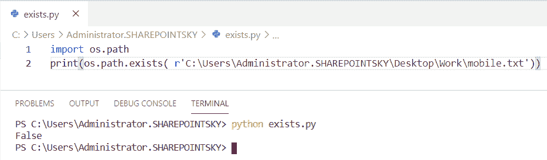
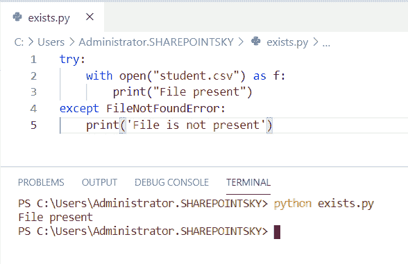
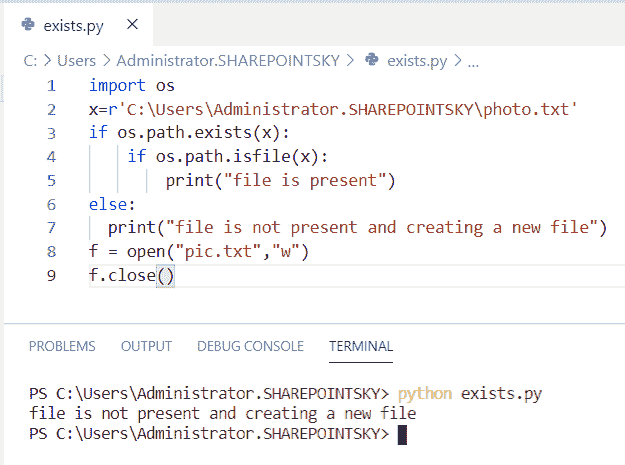
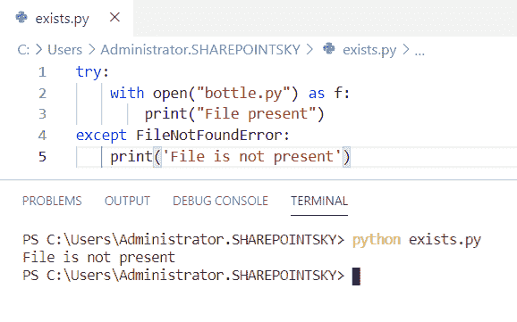
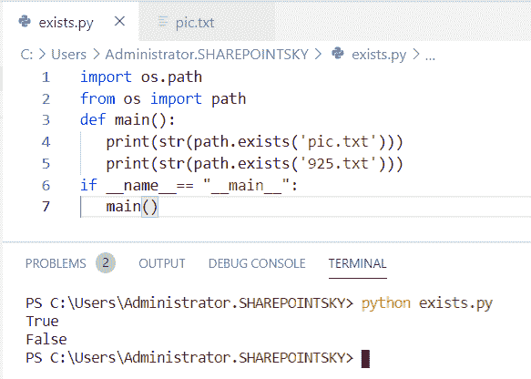
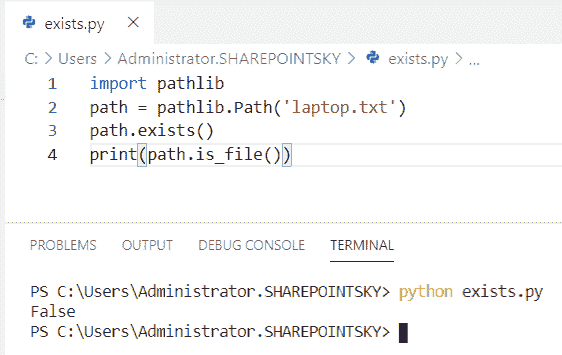
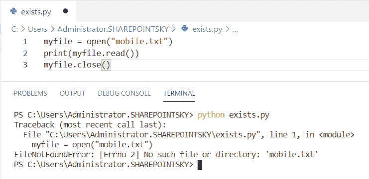
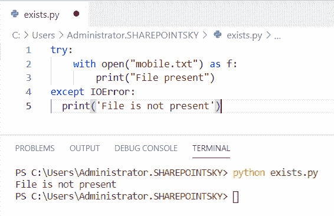
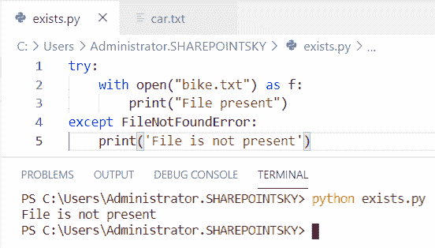
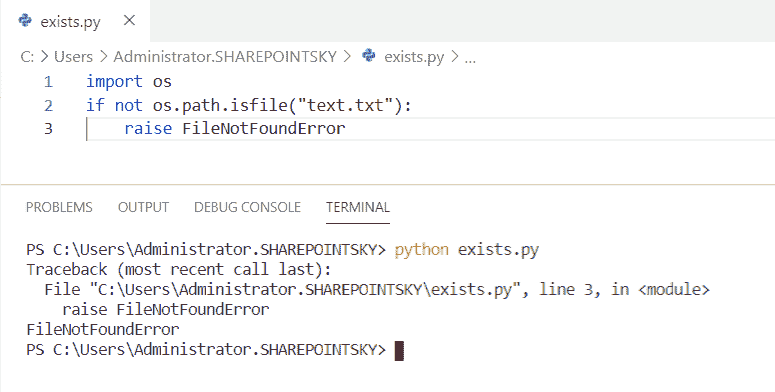

# 文件不存在 Python

> 原文：<https://pythonguides.com/file-does-not-exist-python/>

[](https://sharepointsky.teachable.com/p/python-and-machine-learning-training-course)

在本 [python 教程中，](https://pythonguides.com/python-hello-world-program/)我们将讨论**文件不存在的 python，**我们还将涉及以下主题:

*   文件不存在 python
*   文件不存在 python 读取 CSV
*   Python 检查文件是否不存在并创建
*   文件不存在 python 异常
*   Python 检查文件是否存在
*   如果文件不存在 python
*   Python 文件不存在错误
*   python 中不存在 ioerror 文件
*   Python 如果文件不存在跳过
*   Python 引发文件不存在

目录

[](#)

*   [文件不存在 python](#File_does_not_exist_python "File does not exist python")
*   [文件不存在 python 读取 CSV](#File_does_not_exist_python_read_CSV "File does not exist python read CSV")
*   [Python 检查文件是否不存在并创建](#Python_check_if_file_does_not_exists_and_create "Python check if file does not exists and create")
*   [文件不存在 python 异常](#File_does_not_exist_python_exception "File does not exist python exception")
*   [Python 检查文件是否存在](#Python_check_If_a_file_exists "Python check If a file exists")
*   [如果文件不存在 python](#If_the_file_does_not_exist_python "If the file does not exist python")
*   [Python 文件不存在错误](#Python_file_does_not_exist_error "Python file does not exist error")
*   [IOError 文件不存在 python](#IOError_file_does_not_exist_python "IOError file does not exist python")
*   [Python 如果文件不存在跳过](#Python_if_the_file_does_not_exists_skip "Python if the file does not exists skip")
*   [Python raise 文件不存在](#Python_raise_file_does_not_exist "Python raise file does not exist")

## 文件不存在 python

在这里，我们可以看到**如何在 python 中检查文件是否存在**。

*   在这个例子中，我导入了一个名为 `os.path` 的模块。 `os.path` 模块用于处理来自系统不同地方的文件。
*   `os.path.exists` 用于检查指定路径是否存在。
*   文件的路径被指定为 **r'C:\Users\Administrator。SharePoint sky \ Desktop \ Work \ mobile . txt '**。mobile.txt 是文件的名称。

示例:

```py
import os.path
print(os.path.exists( r'C:\Users\Administrator.SHAREPOINTSKY\Desktop\Work\mobile.txt'))
```

因为文件不存在，所以输出返回 False。您可以参考下面的输出截图。



File does not exist python

这就是如何修复**文件不存在错误 python** 。

读取， [Python 程序打印图案](https://pythonguides.com/print-pattern-in-python/)。

## 文件不存在 python 读取 CSV

在这里，我们可以看到**检查文件如何在 python 中读取 CSV** 不存在。

*   在这个例子中，我使用了异常，所以我使用了 **try 块**来检查文件是否存在。
*   我已经用**打开了文件。csv** 扩展名，如果条件为真，它应该**打印文件呈现**作为输出。
*   如果找不到文件，则使用 except is`FileNotFoundError`。因为文件是当前的，所以不会引发异常。

示例:

```py
try:
    with open("student.csv") as f:
        print("File present")
except FileNotFoundError:
    print('File is not present')
```

由于没有引发文件存在异常，我们可以看到文件存在时的输出。下面的屏幕截图显示了输出。



file does not exist python read CSV

这是如何修复错误，文件不存在错误，在 Python 中读取 CSV 文件。

## Python 检查文件是否不存在并创建

现在，我们可以看到**如何检查文件是否不存在并在 python 中创建**。

*   在这个例子中，我导入了一个名为 `os` 的模块。读取文件的路径。
*   if 条件用作 `os.path.exists(x)` ， `os.path.isfile(x)` 。
*   如果文件存在，则条件返回 true 作为输出。
*   如果文件不存在，则执行 else 条件，并使用 **f = open("pic.txt "，" w")** 创建文件。 `pic.txt` 是文件的名称，**“w”**是文件的模式。
*   `f.close()` 用于关闭文件。

示例:

```py
import os
x=r'C:\Users\Administrator.SHAREPOINTSKY\photo.txt'
if os.path.exists(x):
    if os.path.isfile(x):
        print("file is present")
else:
  print("file is not present and creating a new file")
f = open("pic.txt","w")
f.close()
```

由于文件不存在，执行 else 条件并创建新文件。您可以参考下面的输出截图。



Python check if file does not exists and create

这就是如何**检查文件是否不存在并在 Python** 中创建它。

## 文件不存在 python 异常

在这里，我们可以看到**文件不存在 python 中的异常**。

*   在这个例子中，我使用了异常。
*   这里，我使用了一个 try 块来检查文件是否存在。所以我用 open("bottle.py ")作为 f 打开了文件**，如果条件为真，它应该**打印(“文件存在”)。****
*   如果找不到文件，则使用 except `FileNotFoundError` 。由于文件不存在，执行异常。

示例:

```py
try:
    with open("bottle.py") as f:
        print("File present")
except FileNotFoundError:
    print('File is not present')
```

您可以参考下面的输出截图。



File does not exist python exception

## Python 检查文件是否存在

现在，我们可以看到**检查一个文件在 python 中是否存在**。

*   在这个例子中，我从操作系统中导入了一个名为 `os.path` 的模块和一个**路径。**模块**路径**检查指定路径是否存在。
*   我用过一个叫 main 的函数作为 `def main()` 。
*   `path.exists()` 用于检查指定的路径是否存在。因为两个文件都不存在。
*   因为只有一个文件存在，我们可以看到输出为真，而另一个文件 `925.txt` 没有找到，所以它返回假作为输出。
*   每个模块都有一个名为 `__name__` 的属性。，属性的值被设置为“__main__”。

示例:

```py
import os.path
from os import path
def main():
   print (str(path.exists('pic.txt')))
   print (str(path.exists('925.txt')))
if __name__== "__main__":
   main()
```

由于文件 `925.txt` 不存在，我们可以看到输出中返回了 false。下面的截图显示了输出。



Python check If file exists

这就是如何在 Python 中检查一个文件是否存在。

## 如果文件不存在 python

现在，如果文件在 python 中不存在，我们可以看到**。**

*   在这个例子中，我导入了一个名为 `pathlib` 的模块。模块 `pathlib` 用于处理文件和目录。
*   `pathlib.path` 用于连接两个目录的路径。
*   `path.exists()` 用于检查文件是否存在。
*   `path.is_file` 用于查找文件的结果。

示例:

```py
import pathlib
path = pathlib.Path('laptop.txt')
path.exists()
print(path.is_file())
```

因为文件不存在，所以输出返回 false。您可以参考下面的输出截图。



If the file does not exist python

## Python 文件不存在错误

在这里，我们可以看到**文件在 python 中不存在错误**。

在本例中，我将一个文件作为 `mobile.txt` 来读取该文件，因为该文件不存在，所以发现了错误。

示例:

```py
myfile = open("mobile.txt")
print(myfile.read())
myfile.close()
```

我们可以看到 `FileNotFoundError` 作为输出。您可以参考下面的输出截图。为了解决这个错误，我们必须给出系统中存在的文件名。



Python file does not exist error

## IOError 文件不存在 python

在这里，我们可以看到 **IOError 文件在 python 中不存在**。

*   在这个例子中，我使用了异常，所以我使用了 try 块和来检查文件是否存在。
*   我已经用 open("mobile.txt ")作为 f 打开了文件**，如果条件为真，它应该**打印(“文件存在”)。**mobile . txt 是文件的名称。**
*   如果找不到文件，则使用 except `IOError` 。由于文件不存在，执行异常。

示例:

```py
try:
    with open("mobile.txt") as f:
        print("File present")
except IOError:
  print('File is not present')
```

因为文件不存在，所以执行 except。**文件不存在**打印在输出中。您可以参考下面的输出截图。



IOError file does not exist python

## Python 如果文件不存在跳过

*   在这个例子中，我使用了异常，所以我使用了 try 块和来检查文件是否存在。
*   我已经用 f 打开了文件**，如果条件为真，它应该**打印(“文件存在”)。****
*   如果找不到文件，则使用 except `FileNotFoundError` 。由于文件不存在，异常被执行并跳到**打印(‘文件不存在’)**。

示例:

```py
try:
    with open("bike.txt") as f:
        print("File present")
except FileNotFoundError:
    print('File is not present')
```

except 被执行，因此输出将是**文件不存在**。您可以参考下面的输出截图。



Python if the file does not exists skip

## Python raise 文件不存在

在这里，我们可以看到**如何提升 python 中不存在的**文件。

*   在这个例子中，我导入了一个名为 `os` 的模块。os 模块在用户和操作系统之间建立连接。
*   如果文件不存在，它应该产生一个错误 `FileNotFoundError` 。
*   关键字 `raise` 用于引发异常。

示例:

```py
import os
if not os.path.isfile("text.txt"):
    raise FileNotFoundError
```

由于文件不存在，输出中会出现一个错误。您可以参考下面的输出截图。



Python raise file does not exists

您可能会喜欢以下 Python 教程:

*   [如何在 Python 中读取视频帧](https://pythonguides.com/read-video-frames-in-python/)
*   [Python 逐行读取文件示例](https://pythonguides.com/python-read-a-file-line-by-line/)
*   [用 Python 创建和修改 PDF 文件](https://pythonguides.com/create-and-modify-pdf-file-in-python/)
*   [Python 将图像保存到文件](https://pythonguides.com/python-save-an-image-to-file/)
*   [如何使用 Python Tkinter 读取文本文件](https://pythonguides.com/python-tkinter-read-text-file/)
*   [Python 程序打印质数](https://pythonguides.com/python-program-to-print-prime-numbers/)

在本教程中，我们已经了解了不存在 python 的**文件，并且我们也已经涵盖了这些主题:**

*   文件不存在 python
*   文件不存在 python 读取 CSV
*   Python 检查文件是否不存在并创建
*   文件不存在 python 异常
*   Python 检查文件是否存在
*   如果文件不存在 python
*   python 中不存在 IOError 文件
*   Python 如果文件不存在跳过
*   Python 引发文件不存在

[Bijay Kumar](https://pythonguides.com/author/fewlines4biju/)

Python 是美国最流行的语言之一。我从事 Python 工作已经有很长时间了，我在与 Tkinter、Pandas、NumPy、Turtle、Django、Matplotlib、Tensorflow、Scipy、Scikit-Learn 等各种库合作方面拥有专业知识。我有与美国、加拿大、英国、澳大利亚、新西兰等国家的各种客户合作的经验。查看我的个人资料。

[enjoysharepoint.com/](https://enjoysharepoint.com/)[](https://www.facebook.com/fewlines4biju "Facebook")[](https://www.linkedin.com/in/fewlines4biju/ "Linkedin")[](https://twitter.com/fewlines4biju "Twitter")