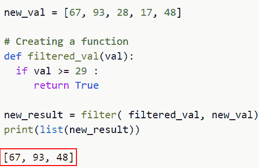
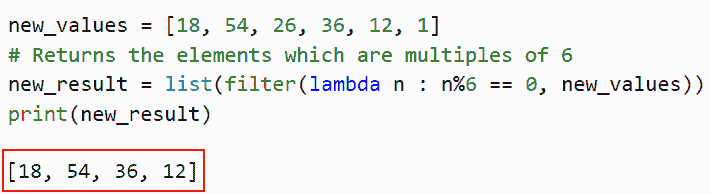
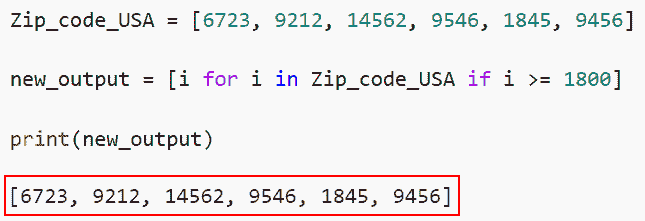
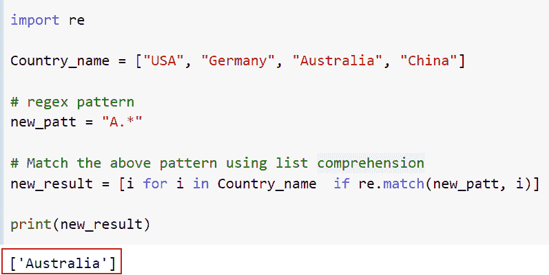
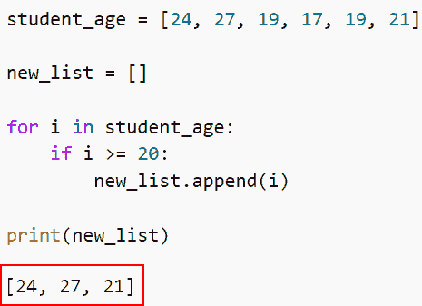
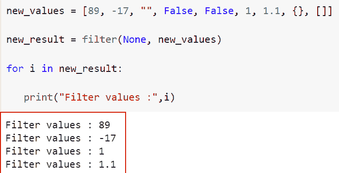
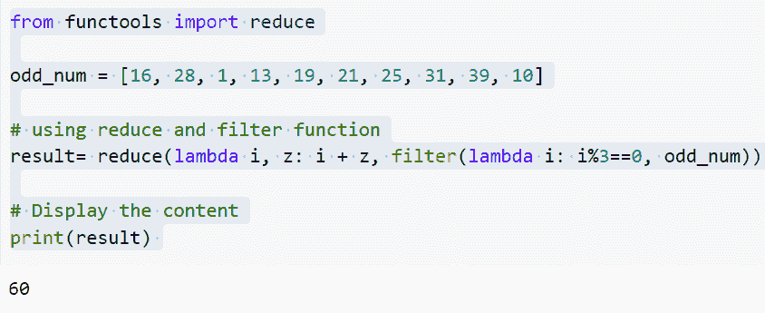

# 如何在 Python 中使用过滤函数

> 原文：<https://pythonguides.com/filter-function-in-python/>

[](https://sharepointsky.teachable.com/p/python-and-machine-learning-training-course)

在本 [Python 教程](https://pythonguides.com/python-programming-for-the-absolute-beginner/)中，我们将讨论几种在 Python 中使用过滤函数的方法。此外，我们将查看在 Python 中使用过滤函数的各种示例。

最近，我一直在做一个机器学习项目，我发现它需要一个过滤功能。

在这里我们将学习

*   如何在 Python 中使用过滤函数
*   如何使用 lambda 函数在 Python 中使用过滤函数
*   如何使用列表理解在 Python 中使用过滤函数
*   如何使用 re.match()在 Python 中使用过滤函数
*   如何使用 for 循环在 Python 中使用过滤函数
*   如何使用 reduce()在 Python 中使用过滤函数

目录

[](#)

*   [如何在 Python 中使用过滤函数](#How_to_use_a_filter_function_in_Python "How to use a filter function in Python")
*   [如何使用 lambda 函数在 Python 中使用过滤函数](#How_to_use_a_filter_function_in_Python_using_lambda_function "How to use a filter function in Python using lambda function")
*   [如何使用列表理解在 Python 中使用过滤函数](#How_to_use_a_filter_function_in_Python_using_list_comprehension "How to use a filter function in Python using list comprehension")
*   [如何使用 re.match()](#How_to_use_a_filter_function_in_Python_using_rematch "How to use a filter function in Python using re.match()") 在 Python 中使用过滤函数
*   [如何使用 for 循环过滤 Python 中的值](#How_to_filter_the_values_in_Python_using_for_loop "How to filter the values in Python using for loop")
*   [如何使用 Python 中的 filter 函数使用无作为函数参数的 Filter](#How_to_use_a_filter_function_in_Python_using_Filter_With_None_as_a_Function_Parameter "How to use a filter function in Python using Filter With None as a Function Parameter ")
*   [如何使用 reduce()在 Python 中使用过滤函数](#How_to_use_a_filter_function_in_Python_using_reduce "How to use a filter function in Python using reduce()")

### 如何在 Python 中使用过滤函数

*   在本节中，我们将讨论如何在 Python 中使用过滤函数。
*   *`filter()`* 方法让 Python 中的函数式编程变得更加容易。它接受一个 iterable 和一个函数作为参数，并应用提供给 iterable 的每个元素的函数。完成后，将返回一个 iterable。
*   例如，您可以使用 *`filter()`* 函数将一组数字的奇数和偶数部分分成两个独立的集合。它甚至可以用来根据字典列表中的关键字选择字典。

**语法:**

让我们看一下语法，了解一下 Python 中 `filter()` 函数的工作原理。

```py
filter(function, iterable)
```

*   它由几个参数组成
    *   **函数:**用于判断该函数的每个可迭代元素是否为真。
    *   **iterable:** 集合、列表、元组以及其他要进行过滤的 iterable。

**举例:**

让我们举个例子，看看如何在 Python 中使用过滤函数。

**源代码:**

```py
new_val = [67, 93, 28, 17, 48]

# Creating a function 
def filtered_val(val):
  if val >= 29 :
     return True

new_result = filter( filtered_val, new_val)
print(list(new_result))
```

在下面给出的代码中，我们首先声明了一个列表**‘new _ val’**，然后定义了一个函数**‘filtered _ val’**，并设置了条件，如果值大于 `29` ，那么它将过滤所有的值并返回**【67，93，48】**。

下面是以下代码的截图



Use of filter function in Python

这是如何使用 Python 中的过滤函数。

阅读:[如何在 Python 中访问元组的项目](https://pythonguides.com/access-items-of-a-tuple-in-python/)

### 如何使用 lambda 函数在 Python 中使用过滤函数

*   现在让我们了解如何使用 lambda 在 Python 中使用过滤函数
*   通过使用 lambda 函数，过程四**(filter()方法)**可以简化为一行。
*   我们可以使用 lambda 将条件写在 **'filter()'** 函数内部，而不是单独构造一个新的值函数。
*   在这个实例中，过滤新值将被 6 除的变量已经完成，过滤后的迭代器将被转换为一个列表。

**举例:**

```py
new_values = [18, 54, 26, 36, 12, 1]
# Returns the elements which are multiples of 6
new_result = list(filter(lambda n : n%6 == 0, new_values))
print(new_result)
```

在上面的代码中，我们首先创建了一个列表“new_values ”,然后在这个函数中使用了 list 函数，我们使用了 lambda 并设置了一个条件，如果数字被 6 除，那么它会将值存储在新列表中。

你可以参考下面的截图。



How to use a filter function in Python using lambda function

正如你在截图中看到的，我们已经讨论了如何使用 lambda 函数在 Python 中使用过滤函数。

阅读:[用 Python 计算一个数的指数值](https://pythonguides.com/calculate-exponential-value-of-a-number-in-python/)

### 如何使用列表理解在 Python 中使用过滤函数

*   现在让我们讨论如何使用列表理解在 Python 中使用过滤函数。
*   在列表上使用 for 循环和 if-else 条件是一种创造性的技术。一行代码可以用来实现方法一。
*   在这种情况下，我们在循环中遍历所有列表项，并选择大于或等于 `1800` 的分数。
*   它很容易编写，您可以轻松地包含几个 if-else 语句。

**举例:**

让我们举一个例子，并检查如何使用列表理解在 Python 中使用过滤函数。

**源代码:**

```py
Zip_code_USA = [6723, 9212, 14562, 9546, 1845, 9456]

new_output = [i for i in Zip_code_USA if i >= 1800]

print(new_output)
```

在下面的代码中，我们首先声明了一个列表**‘Zip _ code _ USA’**，然后使用列表理解在循环中迭代所有列表项，并选择大于或等于 `1800` 的分数。

下面是以下给定代码的实现



Using list comprehension along with filter function

在这个例子中，我们已经理解了如何使用列表理解在 Python 中使用过滤函数。

阅读:[Python 中的斐波那契数列](https://pythonguides.com/python-fibonacci-series/)

### 如何使用 re.match() 在 Python 中使用过滤函数

*   在本节中，我们将讨论如何使用 `re.match()` 在 Python 中使用过滤函数。
*   Python 中的 `re.match()` 方法定位并返回正则表达式模式的第一个实例。Python 中的 Regex Match 函数只在被搜索文本的开头查找匹配字符串。
*   如果在第一行中发现一个匹配，则创建相应的对象。如果在后续行中找到匹配项，Python Regex Match 方法将返回 null。
*   在这个实例中，通过将一个正则表达式模式**“N . *”**传递给**re . match()’**，列表理解被用来过滤掉以**“N”**开头的名字。

**举例:**

这里我们将举一个例子，并检查如何使用 `re.match()` 在 Python 中使用过滤函数。

**源代码:**

```py
import re

Country_name = ["USA", "Germany", "Australia", "China"]

# regex pattern
new_patt = "A.*"

# Match the above pattern using list comprehension
new_result = [i for i in Country_name  if re.match(new_patt, i)]

print(new_result)
```

在下面的代码中，我们首先导入了列表“Country_name ”,然后使用 list comprehension 匹配上面的模式。如果给定的输入字符与输入列表元素匹配，那么它将返回特定的项目。

你可以参考下面的截图。



How to use a filter function in Python using `re.match()`

这是如何使用 `re.match()` 在 Python 中使用过滤函数。

阅读:[如何在 Python 中把字典转换成字符串](https://pythonguides.com/how-to-convert-a-dictionary-into-a-string-in-python/)

### 如何使用 for 循环过滤 Python 中的值

*   在本节中，我们将讨论如何使用 for 循环在 Python 中使用过滤函数。
*   我们将遍历列表，并使用 for 循环和 `if-else` 命令选择满足特定条件的元素。在这种情况下，我们将消除任何大于或等于 `100` 的增益。
*   使用这种技术，会创建一个新列表，并将过滤后的值添加到其中。这是一种快速筛选列表的方法，但效果不佳。

**举例:**

让我们举一个例子，并检查如何使用 for 循环在 Python 中使用过滤函数。

**源代码:**

```py
student_age = [24, 27, 19, 17, 19, 21]

new_list = []

for i in student_age:
    if i >= 20:
        new_list.append(i)

print(new_list)
```

在下面的代码中，我们首先声明了一个列表**‘student _ age’**，然后定义了一个空列表。接下来，我们将迭代这些值并设置条件，如果 `i` 大于 `20` ，那么它将过滤所有的值并将它们返回到新的列表中。

下面是下面给出的代码的截图。



Filter values by using for loop condition

正如你在截图中看到的，我们已经讨论了如何使用 for 循环在 Python 中使用过滤函数。

阅读:[如何检查一个键是否存在于 Python 字典中](https://pythonguides.com/check-if-a-key-exists-in-a-python-dictionary/)

### 如何使用 Python 中的 filter 函数使用无作为函数参数的 Filter

*   这里我们将讨论如何在 Python 中使用 filter With None 作为函数参数来使用 Filter 函数。
*   如果没有元素用作函数参数，filter 方法确定为 false 的任何元素都将从 iterable 中删除。例如，这些元素包括空字符串、 **0、**和空括号，以及布尔值 False。

**举例:**

让我们举一个例子，检查如何在 Python 中使用 filter With `None` 作为函数参数来使用 Filter 函数。

**源代码:**

```py
new_values = [89, -17, "", False, False, 1, 1.1, {}, []]

new_result = filter(None, new_values)

for i in new_result:

   print("Filter values :",i)
```

你可以参考下面的截图



How to use a filter function in Python using Filter With None as a Function Parameter

这就是如何在 Python 中使用 filter With None 作为函数参数来使用 Filter 函数。

阅读:[如何用 Python 从一个列表创建字典](https://pythonguides.com/create-a-dictionary-from-one-list-in-python/)

### 如何使用 reduce()在 Python 中使用过滤函数

*   在本节中，我们将讨论如何使用 reduce()在 Python 中使用过滤函数。
*   Reduce 是一个内置函数，它将 iterable 缩减为一个连续的值，使其成为另一个函数式编程工具。缩减或折叠是这种过程的其他名称。

**语法:**

让我们看一下语法，理解如何使用 reduce()在 Python 中使用过滤函数。

```py
reduce(function, iterable, initial)
```

让我们看一个例子，在这个例子中，filter 和 reduce 用于将一个列表中的所有奇数相加。请参见下图:

**举例:**

```py
from functools import reduce

odd_num = [16, 28, 1, 13, 19, 21, 25, 31, 39, 10]

# using reduce and filter function
result= reduce(lambda i, z: i + z, filter(lambda i: i%3==0, odd_num))

# Display the content
print(result) 
```

在上面的代码中，我们首先导入 reduce 模块，然后使用 reduce 和 filter 函数。

下面是以下给定代码的实现



Using reduce to filter the values in Python

您可能也喜欢阅读以下 Python 教程。

*   [如何在 Python 中反转一个数字](https://pythonguides.com/reverse-a-number-in-python/)
*   [如何在 Python 中交换两个数](https://pythonguides.com/swap-two-numbers-in-python/)
*   [生日祝福的 Python 程序](https://pythonguides.com/python-program-for-birthday-wishes/)
*   [用 Python 计算平方根](https://pythonguides.com/square-root-in-python/)

在本文中，我们讨论了在 Python 中使用过滤函数的几种方法。我们还讨论了以下主题。

*   如何在 Python 中使用过滤函数
*   如何使用 lambda 函数在 Python 中使用过滤函数
*   如何使用列表理解在 Python 中使用过滤函数
*   如何使用 re.match()在 Python 中使用过滤函数
*   如何使用 for 循环在 Python 中使用过滤函数
*   如何使用 reduce()在 Python 中使用过滤函数

[Bijay Kumar](https://pythonguides.com/author/fewlines4biju/)

Python 是美国最流行的语言之一。我从事 Python 工作已经有很长时间了，我在与 Tkinter、Pandas、NumPy、Turtle、Django、Matplotlib、Tensorflow、Scipy、Scikit-Learn 等各种库合作方面拥有专业知识。我有与美国、加拿大、英国、澳大利亚、新西兰等国家的各种客户合作的经验。查看我的个人资料。

[enjoysharepoint.com/](https://enjoysharepoint.com/)[](https://www.facebook.com/fewlines4biju "Facebook")[](https://www.linkedin.com/in/fewlines4biju/ "Linkedin")[](https://twitter.com/fewlines4biju "Twitter")