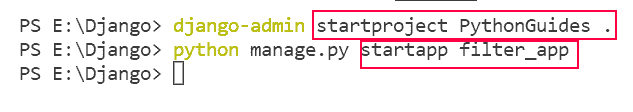
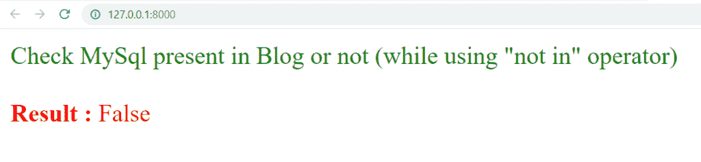
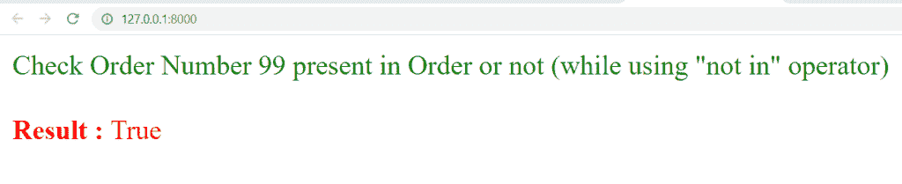
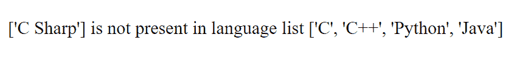
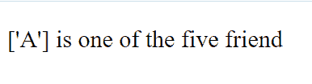
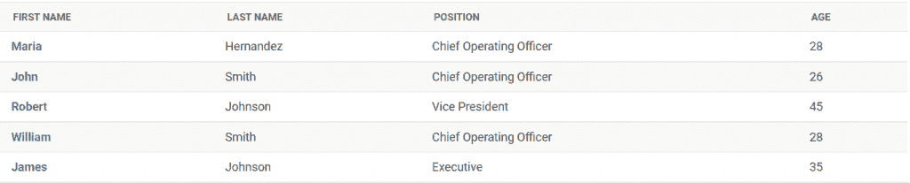
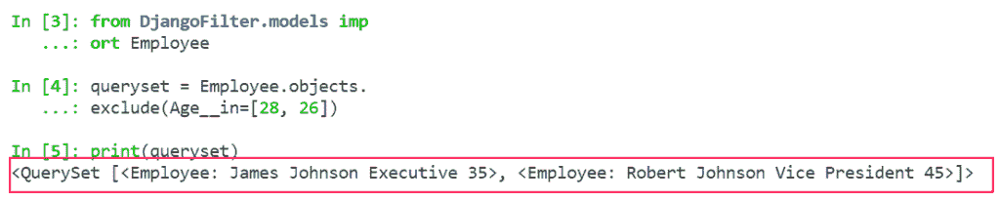
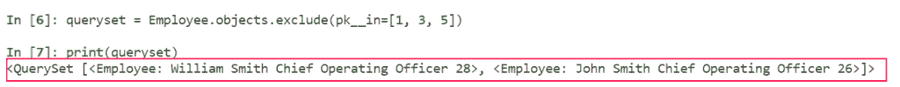
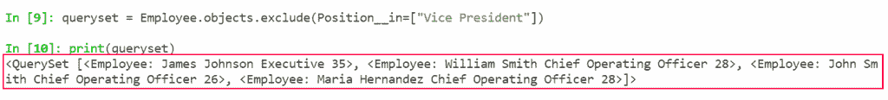

# Python 过滤器不在 Django 中

> 原文：<https://pythonguides.com/filter-not-in-django/>

[](https://sharepointsky.teachable.com/p/python-and-machine-learning-training-course)

在本 [Django 教程](https://pythonguides.com/what-is-python-django/)中，我们将了解不在 Django 中的 **Python 过滤器的实现。**我们还将讨论与 Django 中不在过滤器中的**相关的示例。这是我们将要涉及的主题列表。**

*   过滤器不在 Django 中
*   Django 过滤器不在列表中
*   Django 模型过滤器不在

目录

[](#)

*   [过滤器不在 Django](#Filter_not_in_Django "Filter not in Django")
*   [Django 过滤器不在列表中](#Django_filter_not_in_list "Django filter not in list")
    *   [Django 过滤器不在使用视图的列表中](#Django_filter_not_in_list_using_views "Django filter not in list using views")
    *   [Django 过滤器不在使用模板的列表中](#Django_filter_not_in_list_using_template "Django filter not in list using template")
*   [Django 模型过滤器不在](#Django_model_filter_not_in "Django model filter not in")中

## 过滤器不在 Django

在本节中，我们将讨论 Django 中的**“not in”**过滤器。

在 Python Django 中，**“不在”**过滤器中，或者我们可以说操作符的行为与“过滤器中的**完全相反。它测试序列中是否存在指定的值，但返回值与"**过滤器中的**相反。**

当**“不在”**过滤器用于**值出现在**序列中的条件时，该语句返回布尔结果 `False` 。而当**值不存在于**序列中时，该语句返回布尔结果 `True` 。

从我们所指的序列来看，可以是列表、元组、数组、字符串、字典等。

阅读: [Python Django vs ReactJS](https://pythonguides.com/django-vs-reactjs/)

## Django 过滤器不在列表中

在这一节中，我们将学习使用 Django 过滤器，或者我们可以说操作符**“not in”**在 python 列表中。并且，在 Django 中，**【不在】**操作符通常用在 **if 标签**中。

在 Django 中，有两种方法可以使用列表中的**“不在”**过滤器:

*   使用视图
*   Uisng 模板

所以，让我们用几个例子来理解每一种方式。

### Django 过滤器不在使用视图的列表中

在这里，我们学习如何在 Python 列表中使用 Django 的“不在”过滤器时使用视图。

在开始演示之前，我将向您展示项目的 urls.py 和应用程序的 urls.py 文件，因为它在所有示例中保持不变。

首先，我创建一个名为 `PythonGuides` 和 `filter_app` 的项目和应用。



Create Project and App

`PythonGuides urls.py` 文件:

```py
from django.contrib import admin
from django.urls import path, include

urlpatterns = [
    path('admin/', admin.site.urls),
    path('', include('filter_app.urls'))
]
```

这意味着当你在浏览器中打开你的项目时，它会带你到你的 `filter_app.urls` 。

`filter_app urls.py` 文件:

```py
from django.urls import path, include
from filter_app import views

urlpatterns = [
    path('', views.filter_app, name='filter_app')
]
```

移动到 `filter_app` app 的 `views.py` 文件。

**例#1**

`views.py` 文件:

```py
from django.shortcuts import render

# Create your views here.

def filter_app(request):
    blogs = ["Python", "MariaDB", "MySql", "Machine Learning", "PostgreSql"]  
    result = ("MySql" not in blogs )
    return render(request, 'filter_app.html', {'result':result})
```

*   我们定义博客列表，然后使用**“not in”**操作符。
*   然后，我们在 HTML 页面上呈现结果。

`home.html`页面:

```py
<!DOCTYPE html>
<html lang="en">

<head>
    <meta charset="UTF-8">
    <meta http-equiv="X-UA-Compatible" content="IE=edge">
    <meta name="viewport" content="width=device-width, initial-scale=1.0">
    <title>PythonGuides</title>
</head>

<body>
    <font color="green">
        Check MySql present in Blog or not (while using "not in" operator)
        <br>
        <br>
    </font>
    <font color="red">
        <b> Result : </b>{{result}}
    </font>
</body </html>
```

在 `filter_app.html` 文件中，我们只是使用变量来获得结果。最终，我们将获得以下输出。



Filter not in Django

**例 2**

`views.py` 文件:

```py
from django.shortcuts import render

# Create your views here.

def filter_app(request):
    order = [100, 101, 102, 103, 104, 105]  
    result = (99 not in order)
    return render(request, 'filter_app.html', {'result':result})
```

*   我们定义订单列表，然后使用**“not in”**运算符。
*   然后，我们在 HTML 页面上呈现结果。

`home.html`页面:

```py
<!DOCTYPE html>
<html lang="en">

<head>
    <meta charset="UTF-8">
    <meta http-equiv="X-UA-Compatible" content="IE=edge">
    <meta name="viewport" content="width=device-width, initial-scale=1.0">
    <title>PythonGuides</title>
</head>

<body>
    <font color="green">
        Check Order Number 99 present in Order or not (while using "not in" operator)
        <br>
        <br>
    </font>
    <font color="red">
        <b> Result : </b>{{result}}
    </font>
</body </html>
```

我们简单地使用变量来获得 `filter_app.html` 文件中的结果。最后，我们会得到下面的结果。



Filter not in Django Example

### Django 过滤器不在使用模板的列表中

在这里，我们学习如何在 Python 列表中使用 Django 的**“not in”**过滤器时使用模板标签。这里我使用了视图中使用的相同项目的 urls.py 和 app 的 urls.py 文件。

**例#1**

`views.py` 文件:

```py
from django.shortcuts import render

# Create your views here.

def filter_app(request):
    languages = ["C", "C++", "Python", "Java"]
    test = ["C Sharp"]
    return render(request, 'filter_app.html', {'languages': languages, 'test':test})
```

首先，我们将创建一个重定向到 HTML 页面的视图。在 views.py 文件中，我们定义列表并将列表重定向到 `filter_app.html` 页面。

`filter_app.html` 文件:

```py
<!DOCTYPE html>
<html lang="en">

<head>
    <meta charset="UTF-8">
    <meta http-equiv="X-UA-Compatible" content="IE=edge">
    <meta name="viewport" content="width=device-width, initial-scale=1.0">
    <title>PythonGuides</title>
</head>

<body>
    <p>
        
        {{test}} is not present in language list {{languages}}
        
        {{test}} is present in language list {{languages}}
        
    </p>
</body 
</html>
```

这里，我们使用标签在模板中添加了 `"is not"` 运算符。如果标签对变量求值，如果条件为“真”,则输出块的内容。



Filter not in Django using template

**例 2**

`views.py` 文件:

```py
from django.shortcuts import render

# Create your views here.

def filter_app(request):
    vowels = ["A", "E", "I", "O", "U"]
    test = ["A"]
    return render(request, 'filter_app.html', {'vowels': vowels, 'test':test})
```

这里，我们将创建一个重定向到 HTML 页面的视图。元音列表和测试列表在 views.py 文件中定义，并被重定向到 `filter_app.html` 页面。

`filter_app.html` 文件:

```py
<!DOCTYPE html>
<html lang="en">

<head>
    <meta charset="UTF-8">
    <meta http-equiv="X-UA-Compatible" content="IE=edge">
    <meta name="viewport" content="width=device-width, initial-scale=1.0">
    <title>PythonGuides</title>
</head>

<body>
    <p>
        
        {{test}} is one of the five friend
        
        {{test}} is not in the list of five friend
        
    </p>
</body 
</html>
```

**输出如下:**



Python Django filter not in list using a template

阅读: [Python Django 随机数](https://pythonguides.com/django-random-number/)

## Django 模型过滤器不在中

在这一节中，我们将学习如何在 Django 模型中使用**“not in”**过滤器。在 Django 中，**“不在”**意味着选择包含给定 iterable 中不存在的值的对象。

基本上，在 Django 中，我们没有任何名称为“不在”的过滤器。因此，以与“不在”过滤器相同的方式工作。我们对 Django 的"过滤器中的"**"使用 exclude 方法。**

Exclude 方法返回与给定参数不匹配的对象。

**语法如下:**

```py
queryset = model_name.objects.exclude(parameter__in=[])
```

让我们看不同的例子来清楚地理解**“不在”**中的概念。

为此，我们将在 Django 中创建一个**员工**模型。

首先，在 app 的 `model.py` 文件中创建名为 `Employee` 的模型。并添加以下代码。

```py
from django.db import models

# Create your models here.

class Employee(models.Model):
    First_Name = models.CharField(max_length=200)
    Last_Name = models.CharField(max_length=200)
    Position = models.CharField(max_length=100)
    Age = models.PositiveIntegerField()

    def __str__(self):  
        return "%s %s %s %s" % (self.First_Name, self.Last_Name, self.Position, self.Age) 
```

*   在这里，我们创建一个模型，有各自的字段，如**名**、**姓**、**职位、年龄**。

然后，我们注册模型。为此，在应用程序的 `admin.py` 文件中添加以下代码。

```py
from django.contrib import admin
from .models import Employee

# Register your models here.

class AdminEmployee(admin.ModelAdmin):
    list_display = ['First_Name', 'Last_Name', 'Position', 'Age']

admin.site.register(Employee, AdminEmployee)
```

**让我们来看看员工模型。**



Employee

**例#1**

在这个例子中，我们将使用 `exclude` 方法和字段查找中的**。这里我们从年龄字段中排除一些特定的年龄。**

```py
**# Import**

from DjangoFilter.models import Employee

**# QuerySet**

queryset = Employee.objects.exclude(Age__in=[28, 26])
print(queryset)
```

在本例中，我们简单地使用带有“In”字段查找的 exclude 方法来选择没有**年龄**值的对象，如 **28 和 26** 。它将返回所有两个没有这些年龄值的对象。

**输出如下:**



Output

**例 2**

这里我们从雇员模型中排除了一些特定的主键。

```py
**# Import**

from DjangoFilter.models import Employee

**# QuerySet**

queryset = Employee.objects.exclude(pk__in=[1, 3, 5])
print(queryset)
```

在本例中，我们只是使用带有“in”字段查找的 exclude 方法来选择没有 **1、3 和 5** 的**主键**值的项目。它将返回具有这些键值的所有两个对象。

**输出如下:**



Output

**例#** 3

这里，我们从雇员模型中排除了一些特定的职位字段值。

```py
**# Import**

from DjangoFilter.models import Employee

**# QuerySet**

queryset = Employee.objects.exclude(Position__in=['Vice President'])
print(queryset)
```

在本例中，我们只是使用带有“in”字段查找的 exclude 方法来选择没有**位置**值**副总裁**的项目。它将返回具有这些键值的所有对象。



Filter not in Django Implementation

另外，看看更多的 Django 教程。

*   [Python Django 设置时区](https://pythonguides.com/python-django-set-timezone/)
*   [Python Django 格式日期](https://pythonguides.com/python-django-format-date/)
*   [Python 改 Django 版本](https://pythonguides.com/python-change-django-version/)
*   [Python Django vs 金字塔](https://pythonguides.com/python-django-vs-pyramid/)
*   模型 Django 上的联合操作

在本 Django 教程中，我们已经讨论了“ `Python filter not in Django` ”并且我们还讨论了本教程中的以下主题。

*   过滤器不在 Django 中
*   Django 过滤器不在列表中
*   Django 模型过滤器不在

[Bijay Kumar](https://pythonguides.com/author/fewlines4biju/)

Python 是美国最流行的语言之一。我从事 Python 工作已经有很长时间了，我在与 Tkinter、Pandas、NumPy、Turtle、Django、Matplotlib、Tensorflow、Scipy、Scikit-Learn 等各种库合作方面拥有专业知识。我有与美国、加拿大、英国、澳大利亚、新西兰等国家的各种客户合作的经验。查看我的个人资料。

[enjoysharepoint.com/](https://enjoysharepoint.com/)[](https://www.facebook.com/fewlines4biju "Facebook")[](https://www.linkedin.com/in/fewlines4biju/ "Linkedin")[](https://twitter.com/fewlines4biju "Twitter")