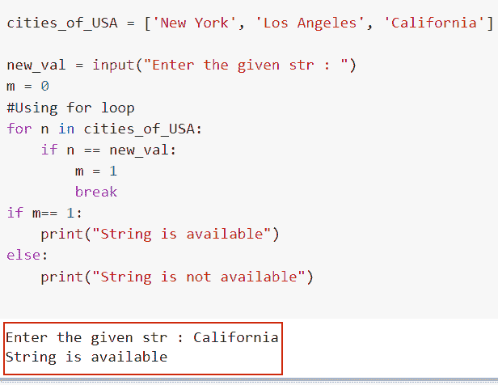
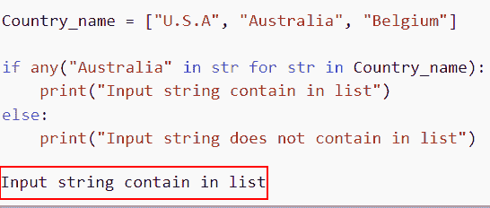
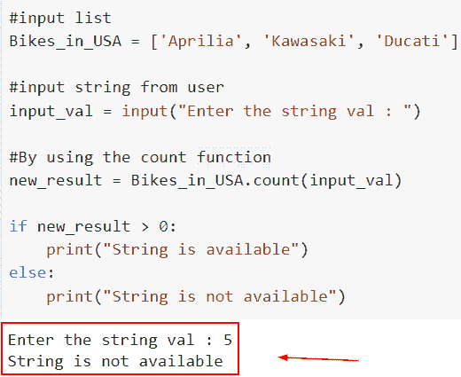
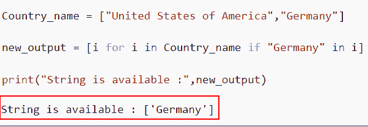
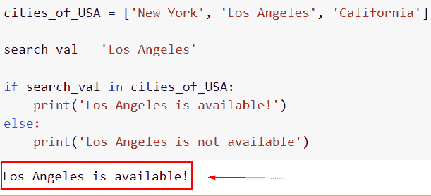
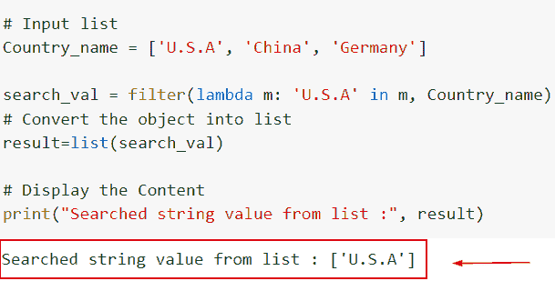
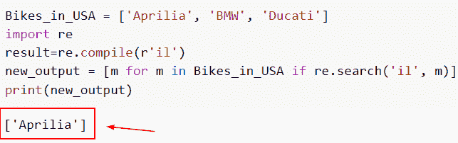

# 如何在 Python 中从列表中找到一个字符串

> 原文：<https://pythonguides.com/find-a-string-from-a-list-in-python/>

[](https://sharepointsky.teachable.com/p/python-and-machine-learning-training-course)

在这个 [Python 教程](https://pythonguides.com/python-hello-world-program/)中，我们将讨论在 Python 中**从列表中找到一个字符串的几种方法。此外，我们还会看一些与之相关的例子。**

作为一名开发人员，在制作 Python 项目时，我需要在 Python 列表中找到一个字符串。

在这里我们将看到:

*   使用 for 循环在 Python 中从列表中查找字符串
*   如何使用 any()在 Python 中从列表中查找字符串
*   在 Python 中使用 count()从列表中查找字符串
*   如何使用列表理解在 Python 中从列表中找到字符串
*   使用 in 运算符从 Python 列表中查找字符串
*   如何使用 filter 和 lambda 在 Python 中从列表中查找字符串
*   使用正则表达式从 Python 列表中查找字符串

目录

[](#)

*   [在 Python 中从列表中查找字符串](#Find_a_String_from_a_List_in_Python "Find a String from a List in Python")
    *   [使用 for 循环从 Python 中的列表中找到一个字符串](#Find_a_String_from_a_List_in_Python_using_for_loop "Find a String from a List in Python using for loop")
    *   [如何使用 any()方法在 Python 中从列表中找到一个字符串](#How_to_find_a_string_from_a_list_in_Python_using_any_method "How to find a string from a list in Python using any() method")
    *   [使用 count()](#Find_string_from_a_list_in_Python_using_count "Find string from a list in Python using count() ") 在 Python 中从列表中查找字符串
    *   [如何使用列表理解在 Python 中从列表中找到字符串](#How_to_find_a_string_from_a_list_in_Python_using_list_comprehension "How to find a string from a list in Python using list comprehension")
    *   [使用 in 操作符](#Find_a_string_from_a_list_in_Python_using_IN_operator "Find a string from a list in Python using IN operator")在 Python 中从列表中找到一个字符串
    *   [如何在 Python 中使用 filter 和 lambda 从列表中查找字符串](#How_to_find_string_from_a_list_in_Python_by_using_filter_and_lambda "How to find string from a list in Python by using filter and lambda")
    *   [使用正则表达式从 Python 中的列表中找到一个字符串](#Find_a_string_from_a_list_in_Python_using_a_regular_expression "Find a string from a list in Python using a regular expression")

## 在 Python 中从列表中查找字符串

有不同的方法，我们可以在 Python 中像 for 循环、in 运算符、使用 count、any()函数一样在列表中查找字符串。

### 使用 for 循环从 Python 中的列表中找到一个字符串

*   在这个例子中，一个字符串的项目将被组合成一个列表。接下来，用户将为我们提供一个输入字符串，我们将利用它来查看它是否包含列表中的任何项目。我们将使用 for 循环在列表中定位字符串。
*   [Python 的 for 循环](https://pythonguides.com/python-for-loop/)用于连续循环遍历列表、元组、字符串或另一个可迭代对象。

**举例:**

让我们举个例子，看看如何在一个 [Python 列表](https://pythonguides.com/python-list-methods/)中找到字符串。

**源代码:**

```py
cities_of_USA = ['New York', 'Los Angeles', 'California']

new_val = input("Enter the given str : ")
m = 0
#Using for loop
for n in cities_of_USA:
    if n == new_val:
        m = 1
        break
if m== 1:
    print("String is available")
else:
    print("String is not available")
```

*   首先，我们将创建一个列表，其中包含一个字符串形式的元素。用户的输入将以字符串的形式出现。
*   我们将使用变量 `m` ，该变量被初始化为 `0` ，之后申请循环。
*   if 条件确定列表中的一项是否等于字符串，它将在 for 循环中使用。如果相等，则循环终止，m 的值变为 `1` 。
*   最后，我们将确定 m 是否等于 1 或 0。如果 m 等于 1，我们将输出字符串存在，如果 m 等于 0，则输出字符串不存在。

下面是以下给定代码的实现。



Using for loop method to find the string from a list in Python

这就是如何使用 for-loop 方法从 Python 列表中找到字符串。

阅读: [Python 列表理解 lambda](https://pythonguides.com/python-list-comprehension/)

### 如何使用 any()方法在 Python 中从列表中找到一个字符串

*   在这一节中，我们将讨论如何使用 `any()` 方法在 Python 中从列表中找到字符串。
*   为了执行这个特定的任务，我们将使用 `any()` 方法和 Python 函数 `any()` 将 iterable 作为参数，如果 iterable 的任何元素可用，则返回 true，否则返回 false。**如果 iterable 为空，Any()** 方法返回 false。
*   在这个例子中，我们将检查给定的字符串在列表的任何元素中是否存在。

**语法:**

让我们看一下语法并理解 Python 中的 `any()` 方法的工作原理

```py
any(iterable)
```

**注意:**该函数接受参数中的可迭代项。

```py
Country_name = ["U.S.A", "Australia", "Belgium"]

if any("Australia" in str for str in Country_name):
    print("Input string contain in list")
else:
    print("Input string does not contain in list")
```

在下面的代码中，我们首先创建了一个列表，并给它分配了字符串元素。接下来，我们使用带有 if 条件的 `any()` 函数，它将检查字符串是否在列表中。

下面是下面给出的代码的截图。



How to find the string from a list in Python by using any method

正如你在截图中看到的，我们已经讨论了如何使用 `any()` 方法在 Python 中从列表中找到字符串。

阅读:[如何在 Python 中修剪字符串](https://pythonguides.com/trim-a-string-in-python/)

### 使用 count() 在 Python 中从列表中查找字符串

*   在这个例子中，我们将讨论如何使用 `count()` 方法在 Python 中从列表中找到字符串。
*   `count()` 函数用于确定一个字符串在列表中出现的次数。字符串不包含列表，显示输出为 0，但字符串仍然包含列表，显示输出为 1。
*   在这个例子中，我们将创建一个包含字符串项的列表，并接受一个输入用户，它将帮助用户找到列表中的字符串。
*   接下来，我们使用了 `count()` 函数，在这个函数中，我们将传递输入字符串，它将通过 if 条件返回计数值。

**举例:**

让我们举一个例子，看看如何使用 `count()` 方法在 Python 中从列表中找到字符串。

**源代码:**

```py
#input list
Bikes_in_USA = ['Aprilia', 'Kawasaki', 'Ducati']

#input string from user
input_val = input("Enter the string val : ")

#By using the count function
new_result = Bikes_in_USA.count(input_val)

if new_result > 0:
    print("String is available")
else:
    print("String is not available")
```

在上面的代码中，我们首先创建了列表**‘Bikes _ in _ USA’**并将项目分配给列表，然后使用来自输入用户的 `input()` 函数。接下来，我们使用了 `count()` 函数，在这个函数中，我们将列表传递给它。

下面是以下给定代码的实现。



Using the count method to find the string from a list in Python

在这个例子中，我们已经了解了如何使用 Python 中的 count 方法从列表中查找字符串。

阅读: [Python 按空格分割字符串](https://pythonguides.com/python-split-string-by-space/)

### 如何使用列表理解在 Python 中从列表中找到字符串

*   这里我们将讨论如何使用列表理解方法在 Python 中从列表中找到字符串。
*   通过使用 list comprehension 和 join 方法，我们可以很容易地将每个 string 元素拆分成相关的 list 元素，然后将它们连接起来以声明一个新的 string。
*   让我们考虑一个不同的例子，您只想确定一个字符串是否是列表中另一个单词的子串，然后返回所有这样的单词。

**举例:**

让我们举一个例子，检查如何使用 list comprehension 方法在 Python 中从列表中找到字符串。

**源代码:**

```py
Country_name = ["United States of America","Germany"]

new_output = [i for i in Country_name if "Germany" in i]

print("String is available :",new_output)
```

在上面的代码中，我们首先创建了列表**‘Country _ name’**，然后使用了列表理解方法。

下面是以下代码的截图



How to find the string from a list in Python by using the list comprehension method

这是如何使用列表理解方法在 Python 中从列表中找到字符串。

同样，使用 if-else 检查: [Python 列表理解](https://pythonguides.com/python-list-comprehension-using-if-else/)

### 使用 in 操作符在 Python 中从列表中找到一个字符串

*   在这一节中，我们将讨论如何在 Python 中从列表中找到字符串。
*   要在 Python 中查找列表中的字符串，请使用 in 运算符。它接受操作数 a 和 b，并具有以下形式。
*   在这个例子中，一个字符串的条目将被转换成一个列表。如果我们提供要搜索的字符串并确定它是否出现在列表中，我们将使用 in 操作符。

**语法:**

```py
result= a in b
```

**举例:**

让我们举一个例子，看看如何在 Python 中从列表中找到字符串。

**源代码:**

```py
cities_of_USA = ['New York', 'Los Angeles', 'California']

search_val = 'Los Angeles'

if search_val in cities_of_USA:
    print('Los Angeles is available!')
else:
    print('Los Angeles is not available')
```

在下面给出的代码中，我们首先创建了列表 **'cities_of_USA'** ，然后声明了变量 **'search_val'** ，然后检查字符串值是否可用的条件。

下面是以下给定代码的实现。



Using the in operator to find the string from a list in Python

在这个例子中，我们已经了解了如何使用 In 操作符在 Python 中从列表中搜索字符串。

阅读: [Python 字符串列表](https://pythonguides.com/python-string-to-list/)

### 如何在 Python 中使用 filter 和 lambda 从列表中查找字符串

*   在这一节中，我们将讨论如何使用 Python 中的过滤器和 lambda 从列表中找到字符串。
*   为了执行这个特定的任务，我们将使用 `filter()` 方法和一个 lambda 函数，它是一个基本函数，只在特定的行上声明，使用 `filter()` 方法。

**举例:**

让我们举一个例子，看看如何使用 Python 中的过滤器和 lambda 从列表中找到字符串。

**源代码:**

```py
# Input list
Country_name = ['U.S.A', 'China', 'Germany']

search_val = filter(lambda m: 'U.S.A' in m, Country_name)
# Convert the object into list
result=list(search_val)

# Display the Content
print("Searched string value from list :", result)
```

在上面的代码中，我们首先创建了输入列表，然后使用 filter 和 lambda 函数并迭代列表中的值。

下面是以下代码的截图



How to find the string from a list in Python by using the filter and lambda

正如你在截图中看到的，我们已经讨论了如何使用过滤器和 lambda 在 Python 中从列表中找到字符串。

阅读: [Python 循环遍历一个列表](https://pythonguides.com/python-loop-through-a-list/)

### 使用正则表达式从 Python 中的列表中找到一个字符串

*   这里我们将讨论如何使用 Python 中的正则表达式方法从 Python 中的列表中找到字符串。
*   使用 Python 正则表达式时要理解的第一件事是，一切本质上都是字符，我们正在创建匹配某个字符串的模式。
*   找到模式时使用 `re.search()` 方法，Python `re.search()` 函数提供匹配对象；否则，它返回*“null”*

**举例:**

让我们举一个例子，并检查如何通过使用 Python 中的正则表达式方法从 Python 中的列表中找到字符串。

**源代码:**

```py
Bikes_in_USA = ['Aprilia', 'BMW', 'Ducati']
import re
result=re.compile(r'il') 
new_output = [m for m in Bikes_in_USA if re.search('il', m)]
print(new_output)
```

在下面给出的代码中，我们首先创建了一个名为**‘Bikes _ in _ USA’**的列表，然后我们使用列表理解方法并分配了 `re.search()` 。它将检查给定模式是否可用的条件。

你可以参考下面的截图



Using the regular expression method to find the string from a list in Python

另外，看看更多的 Python 教程。

*   [钻石图案的 Python 程序](https://pythonguides.com/python-program-for-a-diamond-pattern/)
*   [如何在 Python 列表中找到最小的数字](https://pythonguides.com/find-smallest-number-in-a-python-list/)
*   [在 Python 中从字符串中移除特定字符](https://pythonguides.com/remove-specific-character-from-string-in-python/)
*   [如何用 Python 将列表追加到另一个列表中](https://pythonguides.com/python-append-list-to-another-list/)
*   [如何在 Python 中使用 For 循环对列表中的元素求和](https://pythonguides.com/sum-elements-in-list-in-python-using-for-loop/)

本文基于如何在 Python 中从列表中查找字符串。已经提出了七种不同的方法，所有的方法都非常简单易懂。

*   使用 for 循环在 Python 中查找列表中的字符串
*   如何使用 any()方法在 Python 中从列表中查找字符串
*   在 Python 中使用 count()从列表中查找字符串
*   如何使用 list comprehension()在 Python 中从列表中找到一个字符串
*   使用 in 运算符从 Python 列表中查找字符串
*   如何使用 filter 和 lambda 在 Python 中从列表中查找字符串
*   使用正则表达式从 Python 列表中查找字符串

[Arvind](https://pythonguides.com/author/arvind/)

Arvind 目前是 TSInfo Technologies 的高级 Python 开发人员。他精通 Python 库，如 NumPy 和 Tensorflow。