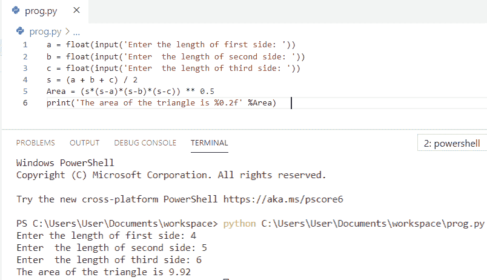
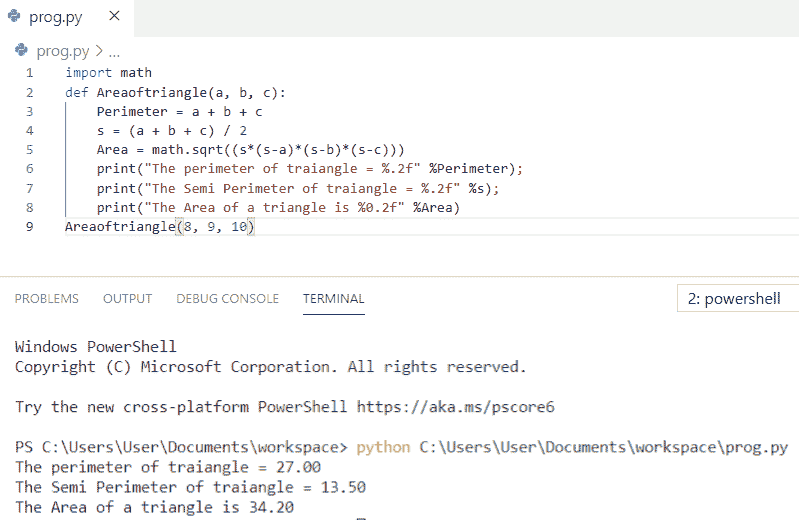
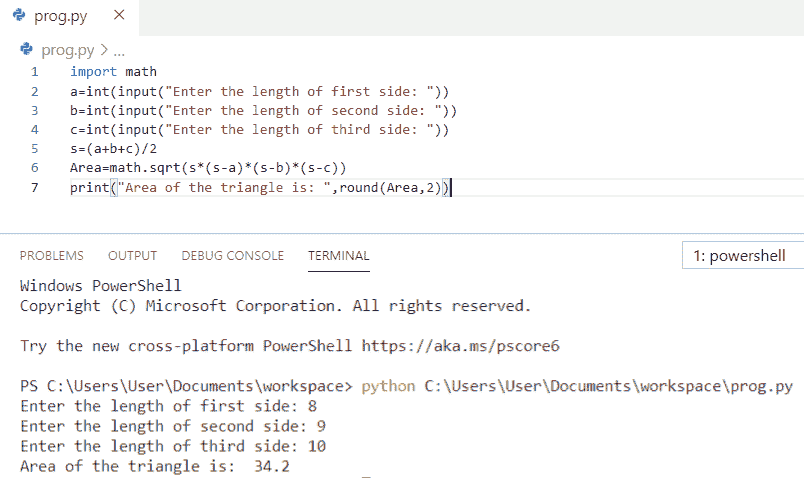
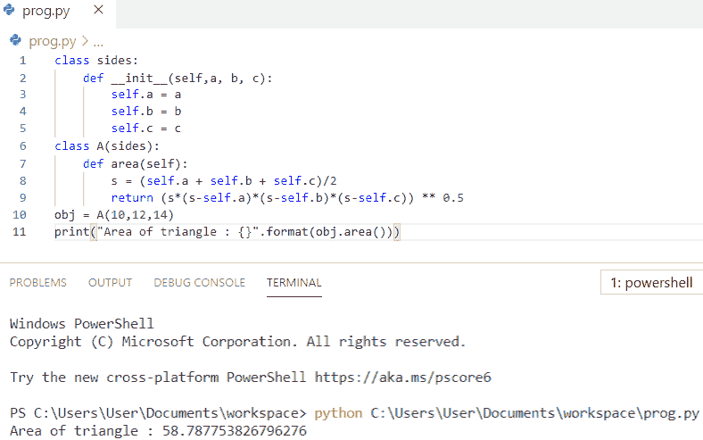
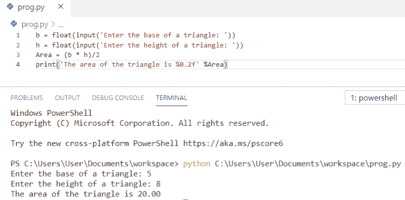
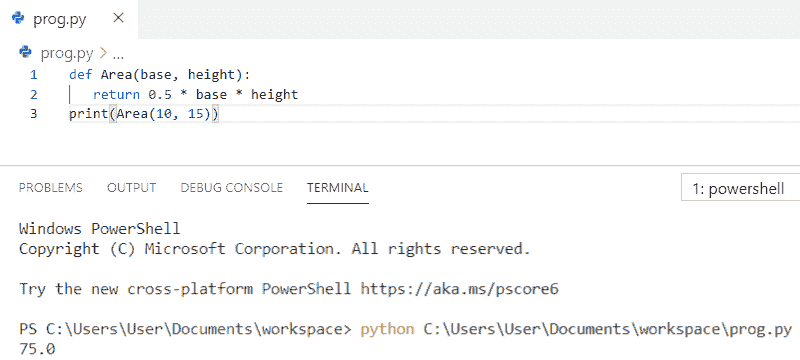

# 如何在 Python 中求三角形的面积

> 原文：<https://pythonguides.com/find-area-of-a-triangle-in-python/>

[](https://sharepointsky.teachable.com/p/python-and-machine-learning-training-course)

在这个 [python 教程中，](https://pythonguides.com/python-hello-world-program/)你将学习如何在 python 中求三角形的面积， **Python 程序求三角形的面积**并且，我们还将检查 **:**

*   Python 程序求三角形的面积
*   使用函数计算三角形面积的 Python 程序
*   Python 程序，求给定所有三条边的三角形的面积
*   Python 程序使用类求三角形的面积
*   Python 程序，在给定底和高的情况下求三角形的面积
*   Python 程序，在给定底和高的情况下，使用函数求三角形的面积

目录

[](#)

*   [Python 程序求三角形的面积](#Python_program_to_find_the_area_of_a_triangle "Python program to find the area of a triangle")
*   [使用函数](#Python_program_to_calculate_area_of_a_triangle_using_function "Python program to calculate area of a triangle using function")计算三角形面积的 Python 程序
*   [Python 程序计算给定三条边的三角形面积](#Python_program_to_find_area_of_a_triangle_given_all_three_sides "Python program to find area of a triangle given all three sides")
*   [Python 程序使用类](#Python_program_to_find_area_of_a_triangle_using_class "Python program to find area of a triangle using class")寻找三角形的面积
*   [Python 程序在给定底和高的情况下求三角形的面积](#Python_program_to_find_area_of_a_triangle_when_base_and_height_are_given "Python program to find area of a triangle when base and height are given")
*   [Python 程序在给定底和高的情况下使用函数求三角形的面积](#Python_program_to_find_area_of_a_triangle_using_function_when_base_and_height_are_given "Python program to find area of a triangle using function when base and height are given")

## Python 程序求三角形的面积

让我们看看 **python 程序求三角形**的面积。

*   在这个例子中，我们将要求**用户输入三角形三条边的长度**。
*   我们将使用 Heron 公式来计算**半周长**。
*   以及**面积= (s*(s-a)*(s-b)*(s-c)) ` 0.5` 来计算三角形的面积。
*   最后，**打印**三角形的面积得到输出。

**举例:**

```py
a = float(input('Enter the length of first side: '))  
b = float(input('Enter  the length of second side: '))  
c = float(input('Enter  the length of third side: '))  
s = (a + b + c) / 2  
Area = (s*(s-a)*(s-b)*(s-c)) ** 0.5  
print('The area of the triangle is %0.2f' %Area)
```

你可以参考下面的截图，看看 python 程序求三角形面积的输出。



Python program to find the area of a triangle

上面的代码我们可以用 Python 中的**求三角形的面积**。

还有，读， [Python 程序求平方](https://pythonguides.com/python-program-to-find-the-area-of-square/)的面积。

## 使用函数计算三角形面积的 Python 程序

现在，我们将看到使用函数计算三角形面积的 **python 程序。**

*   首先，我们将**导入数学**模块，这将允许我们使用数学函数，如 `math.sqrt` 函数。
*   现在，我们将使用关键字 `def` 作为**def areoftriangle(a，b，c)来定义带有三个参数的函数。**
*   我们将使用 Heron 公式来计算**半周长**。
*   以及`Area = math . sqrt((s *(s-a)*(s-b)*(s-c)))`计算三角形的面积。
*   用户将输入三角形的三条边 **a、b、c** ，我们将把这些值传递给函数参数来计算面积。
*   最后用 `print` 得到输出。

**举例:**

```py
import math
def Areaoftriangle(a, b, c):
    Perimeter = a + b + c
    s = (a + b + c) / 2
    Area = math.sqrt((s*(s-a)*(s-b)*(s-c)))
    print("The perimeter of traiangle = %.2f" %Perimeter);
    print("The Semi Perimeter of traiangle = %.2f" %s);
    print("The Area of a triangle is %0.2f" %Area)
Areaoftriangle(8, 9, 10)
```

你可以参考下面的截图，看看 python 程序使用函数计算三角形面积的输出。



Python program to calculate the area of a triangle using function

上面的代码，我们可以用 Python 中的函数来计算三角形的面积。

你可能喜欢用 [Python 程序来求一个矩形](https://pythonguides.com/python-program-to-find-an-area-of-a-rectangle/)的面积。

## Python 程序计算给定三条边的三角形面积

在这里，我们将看到 **python 程序在给定所有三条边的情况下求三角形的面积**

*   首先，我们将**导入数学**模块，这将允许我们使用数学函数，如 `math.sqrt` 函数。
*   我们将要求**用户输入三角形三条边的长度**，它将被存储在一个单独的变量中。
*   我们将使用 Heron 的公式来计算**半周长**，即 `s=(a+b+c)/2` 。
*   以及`Area = math . sqrt(s *(s-a)*(s-b)*(s-c))`计算三角形的面积。
*   最后，**打印**三角形的面积得到输出。

**举例:**

```py
import math
a=int(input("Enter the length of first side: "))
b=int(input("Enter the length of second side: "))
c=int(input("Enter the length of third side: "))
s=(a+b+c)/2
Area=math.sqrt(s*(s-a)*(s-b)*(s-c))
print("Area of the triangle is: ",round(Area,2))
```

你可以参考下面的截图，看看 python 程序的输出，找出给定三条边的三角形的面积。



Python program to find the area of a triangle given all three sides

这是一个 python 程序，可以求出给定三条边的三角形的面积。

来看看，[Python 中如何计算圆的面积](https://pythonguides.com/calculate-area-of-a-circle-in-python/)？

## Python 程序使用类寻找三角形的面积

让我们看一下 **python 程序，用类**求三角形的面积

*   我们将创建一个名为 `class sides` 的类。
*   另一个类叫**A 类(sides)** 它有一个方法叫**def area(self)`return`(s *(s-self . A)*(s-self . b)*(s-self . c))* * 0.5**也就是类的面积。
*   该类的一个**对象**被创建为 **obj = A(10，12，14)** 。
*   通过使用对象，方法 `area()` 被调用。
*   最后，**打印**一个矩形的面积看输出。

**举例:**

```py
class sides:
    def __init__(self,a, b, c):
        self.a = a
        self.b = b
        self.c = c
class A(sides):
    def area(self):
        s = (self.a + self.b + self.c)/2
        return (s*(s-self.a)*(s-self.b)*(s-self.c)) ** 0.5
obj = A(10,12,14)
print("Area of triangle : {}".format(obj.area()))
```

你可以参考下面的截图来看看 python 程序的输出，使用类来计算三角形的面积。



Python program to find the area of a triangle using class

还有，看，[Python 中如何计算单利](https://pythonguides.com/calculate-simple-interest-in-python/)？

## Python 程序在给定底和高的情况下求三角形的面积

现在，我们将看到 **python 程序在给定底和高的情况下求三角形的面积**

*   在这个例子中，我们将要求**用户输入三角形的**、**底**和**高**。
*   为了计算三角形的**面积，我们将使用公式**面积= (b * h)/2** 。**
*   最后，**打印**三角形的面积得到输出。

**举例:**

```py
b = float(input('Enter the base of a triangle: '))  
h = float(input('Enter the height of a triangle: '))  
Area = (b * h)/2
print('The area of the triangle is %0.2f' %Area)
```

你可以参考下面的截图，看看 python 程序在给定底和高的情况下求三角形面积的输出。



Python program to find the area of a triangle when base and height are given

阅读: [PdfFileReader Python 示例](https://pythonguides.com/pdffilereader-python-example/)

## Python 程序在给定底和高的情况下使用函数求三角形的面积

在这里，我们将看到一个 **python 程序，当给定底和高**时，使用函数来求三角形的面积

*   在这个例子中，我们将函数定义为 **def Area(base，height)** 。
*   这里， **Area(10，15)** 是传递给函数参数的值。
*   最后，它将返回三角形的面积并打印输出。

**举例:**

```py
def Area(base, height):
   return 0.5 * base * height
print(Area(10, 15))
```

你可以参考下面的截图，看看 python 程序在给定底和高的情况下使用函数求三角形面积的输出。



您可能会喜欢以下 Python 教程:

*   [Python 程序打印图案](https://pythonguides.com/print-pattern-in-python/)
*   [如何在 Python 中打印一个数的阶乘](https://pythonguides.com/factorial-of-a-number-in-python/)
*   [如何在 Python 中交换两个数](https://pythonguides.com/swap-two-numbers-in-python/)

在本 Python 教程中，我们学习了用于计算三角形面积的 **Python 程序。此外，我们还讨论了以下主题:**

*   Python 程序求三角形的面积
*   使用函数计算三角形面积的 Python 程序
*   Python 程序，求给定所有三条边的三角形的面积
*   Python 程序使用类求三角形的面积
*   Python 程序，在给定底和高的情况下求三角形的面积
*   Python 程序，在给定底和高的情况下，使用函数求三角形的面积

[Bijay Kumar](https://pythonguides.com/author/fewlines4biju/)

Python 是美国最流行的语言之一。我已经与 Python 合作了很长一段时间，我在 Tkinter、panases、NumPy、Turtle、Django、Matplotlib、Tensorflow、Scipy、Scikit-Learn 等各种库的工作方面很有经验。我有与美国、加拿大、英国、澳大利亚、新西兰等国家的客户合作的经验。[查看我的个人资料](https://pythonguides.com/about-us/)。

[enjoysharepoint.com/](https://enjoysharepoint.com/)[](https://www.facebook.com/fewlines4biju "Facebook")[](https://www.linkedin.com/in/fewlines4biju/ "Linkedin")[](https://twitter.com/fewlines4biju "Twitter")