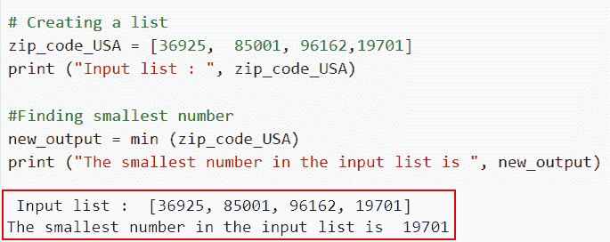
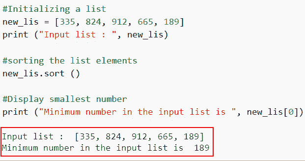
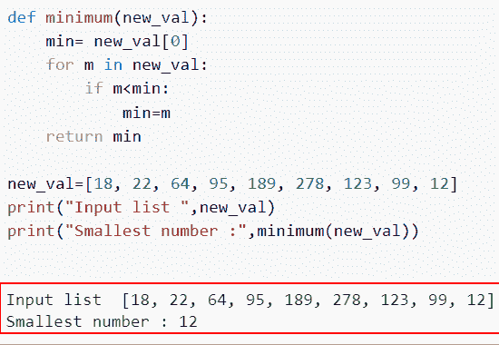
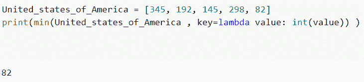

# 如何在 Python 列表中找到最小的数字

> 原文：<https://pythonguides.com/find-smallest-number-in-a-python-list/>

[](https://sharepointsky.teachable.com/p/python-and-machine-learning-training-course)

在这个 Python 教程中，我将一步一步地解释如何在 Python 列表中找到最小的数字。此外，我们将查看各种示例来查找列表中的最小值。

我们的目标是创建一个 Python 程序，它将在给定的数字列表中生成最小的数字。

我们将讨论多种技术，这些技术使得**在 Python 列表**中找到最小的数字变得容易。

这里我们将讨论

*   如何使用 min()在 python 列表中找到最小的数字
*   使用 sort()在 Python 列表中查找最小的数字
*   如何使用 for 循环找到 python 列表中的最小数字
*   使用 lambda 查找 Python 列表中的最小数字

目录

[](#)

*   [在 Python 列表中找到最小的数字](#Find_smallest_number_in_a_Python_list "Find smallest number in a Python list")
    *   [如何使用 min()在 python 列表中找到最小的数字](#How_to_find_smallest_number_in_a_python_list_using_min "How to find smallest number in a python list using min()")
    *   [使用 sort()](#Find_smallest_number_in_a_Python_list_using_sort "Find smallest number in a Python list using sort()") 在 Python 列表中找到最小的数字
    *   [如何使用 for 循环在 Python 列表中找到最小的数字](#How_to_find_smallest_number_in_a_Python_list_using_a_for_loop "How to find smallest number in a Python list using a for loop ")
    *   [使用 lambda](#Find_smallest_number_in_a_Python_list_using_lambda "Find smallest number in a Python list using lambda ") 在 Python 列表中找到最小的数字

## 在 Python 列表中找到最小的数字

在 Python 中，有许多方法可以找到列表中的最小数字。我们将详细介绍如何利用 `min()` 函数、 `sort()` 函数和 `for loop` 来查找 Python 列表中的最小数字。

### 如何使用 min()在 python 列表中找到最小的数字

*   在本节中，我们将讨论如何使用 python 中的 min()方法在 Python 列表中找到最小的数字。
*   Python 有一个名为 `min()` 的内置函数，它在一个列表中找到最小的数字作为参数。
*   它将一个列表作为参数，并返回给定列表中最小的元素。

**语法:**

让我们看一下语法并理解 Python 中的 `min()` 函数的工作原理

```py
min(list)
```

注意:这是一个列表，从中返回具有最小值的元素。

**举例:**

让我们举个例子，看看如何使用 `min()` 在 python 列表中找到最小的数。

**源代码:**

```py
# Creating a list
zip_code_USA = [36925,85001, 96162,19701] 
print (" Input list : ", zip_code_USA)

#Finding smallest number
new_output = min (zip_code_USA)
print ("The smallest number in the input list is ", new_output)
```

在上面的代码中，我们首先创建了一个名为“zip_code_USA”的列表，然后使用 min()函数并将输入列表指定为参数。执行此代码后，输出将显示列表中的最小值。



find smallest number in a python list using min

这就是如何使用 min()在 python 列表中找到最小的数字

阅读: [Python 列表方法](https://pythonguides.com/python-list-methods/)

### 使用 sort() 在 Python 列表中找到最小的数字

*   这里我们将讨论如何使用 sort()方法在 Python 列表中找到最小的数字。
*   列表元素由 Python 的 `sort()` 函数排序。这些项目也按升序和降序排列。可选参数 Reverse 按照从高到低的顺序对列表进行反向排列。默认情况下，list 总是按升序排列元素。
*   因此，通过对列表进行排序，我们可以使用索引来访问列表中的第一个元素，这将是列表的最低编号。

**语法:**

下面是 Python 中的 `sort()` 方法的语法

```py
sort() 
```

**注意:**这个方法不接受任何参数，它将返回值。

**举例:**

这里我们将举一个例子，并检查如何使用 `sort()` 在 Python 列表中找到最小的数字。

**源代码:**

```py
**#Initializing a list**
new_lis = [335, 824, 912, 665, 189]
print ("Input list : ", new_lis)
 **
#sorting the list elements**
new_lis.sort ()

**#Display smallest number**
print ("Minimum number in the input list is ", new_lis[0])
```

在上面的代码中，我们首先初始化列表，然后使用 `list.sort()` 函数使用索引来访问列表中的第一个元素，这将是列表的最低编号。

下面是以下代码的截图



Find smallest number in a Python list using a sort()

在这个例子中，我们已经了解了如何使用 sort()在 Python 列表中找到最小的数字。

阅读: [Python 连接列表](https://pythonguides.com/python-concatenate-list/)

### 如何使用 for 循环在 Python 列表中找到最小的数字

*   在这个例子中，我们将讨论如何使用 for 循环找到 Python 列表中的最小数字。
*   该方法通过从列表的开头到结尾运行一个循环来单独比较每个元素以确定最小的元素。对于这个策略，将使用 For 循环。
*   使用 for 循环，我们可以很容易地改变输入列表中元素的顺序。

**举例:**

让我们举一个例子，看看如何使用 for 循环找到 Python 列表中的最小数字。

**源代码:**

```py
def minimum(new_val):
    min= new_val[0]
    for m in new_val:
        if m<min:
            min=m
    return min

new_val=[18, 22, 64, 95, 189, 278, 123, 99, 12]
print("Input list ",new_val)
print("Smallest number :",minimum(new_val))
```

创建一个可以识别最小数字的方法。设置一个变量来保存最小值，然后将其初始值设置为列表的第一项。

运行包含所有列表元素的循环。每个元素都应该与包含最小值的变量进行比较。如果元素的大小小于变量值，然后调用函数，然后打印结果。

你可以参考下面的截图



How to find smallest number in a Python list using a for loop

正如你在截图中看到的，我们已经讨论了如何使用 for 循环找到 Python 列表中的最小数字。

阅读:[如何在 Python 中从列表中找到一个字符串](https://pythonguides.com/find-a-string-from-a-list-in-python/)

### 使用 lambda 在 Python 列表中找到最小的数字

*   在这一节中，我们将讨论如何使用 lambda 在 Python 列表中找到最小的数字。
*   lambda 函数只有一个表达式，但可以接受任意数量的参数。表达式是 lambda 函数执行的一行代码，它可能会也可能不会产生任何结果。

**举例:**

让我们举一个例子，看看如何使用 lambda 在 Python 列表中找到最小的数字

**源代码:**

```py
United_states_of_America = [345, 192, 145, 298, 82]
print(min(United_states_of_America , key=lambda value: int(value)) )
```

在上面的代码中，我们首先创建了一个列表并分配了整数，然后使用 lambda 函数从列表中获取最小数。

下面是以下给定代码的执行过程



Find smallest number in a Python list using lambda

另外，看看更多的 Python 教程。

*   [如何在 Python 列表的末尾插入项目](https://pythonguides.com/insert-item-at-end-of-python-list/)
*   [如何在 Python 中从列表中获取字符串值](https://pythonguides.com/how-to-get-string-values-from-list-in-python/)
*   [如何在 Python 中从列表中获取唯一值](https://pythonguides.com/get-unique-values-from-list-python/)

在本文中，我们讨论了在 Python 列表中寻找最小数字的几种不同方法。下面这个话题我们已经讲过了。

*   如何使用 min()在 python 列表中找到最小的数字
*   使用 sort()在 Python 列表中查找最小的数字
*   如何使用 for 循环在 python 列表中找到最小的数字
*   使用 lambda 查找 Python 列表中的最小数字

[Arvind](https://pythonguides.com/author/arvind/)

Arvind 目前是 TSInfo Technologies 的高级 Python 开发人员。他精通 Python 库，如 NumPy 和 Tensorflow。