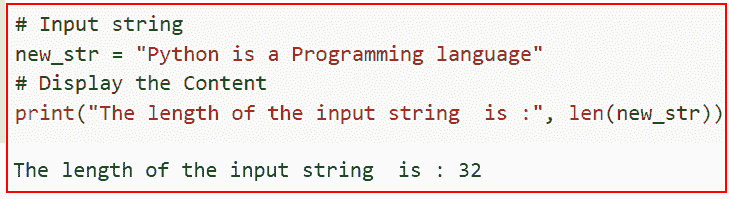
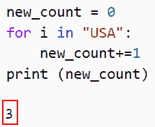
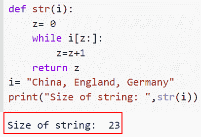
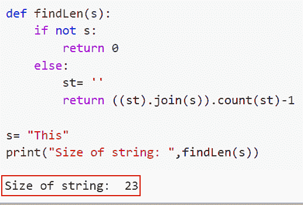
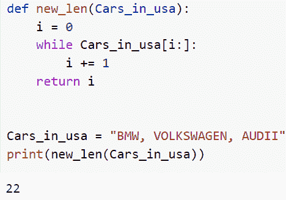

# 如何在 Python 中求字符串的长度

> 原文：<https://pythonguides.com/find-the-length-of-a-string-in-python/>

[](https://sharepointsky.teachable.com/p/python-and-machine-learning-training-course)

在本 [Python 教程](https://pythonguides.com/python-hello-world-program/)中，我们将学习在 Python 中 ***求一个字符串长度的各种方法。我们将使用一些内置函数来理解在 Python 中查找字符串大小的不同方法。***

作为一名开发人员，在制作 Python 项目时，我需要找到 Python 中一个字符串的长度。

在这里我们将看到:

*   如何用 len()在 Python 中求字符串的长度
*   如何使用 for 循环在 Python 中找到字符串的长度
*   如何使用循环和切片在 Python 中找到字符串的长度
*   如何在 Python 中使用 join()和 count()求字符串的长度
*   如何使用 while 循环和切片在 Python 中找到字符串的长度

目录

[](#)

*   [如何在 Python 中求一个字符串的长度](#How_to_find_the_length_of_a_string_in_Python "How to find the length of a string in Python")
    *   [如何用 len()](#How_to_find_the_length_of_a_string_in_Python_using_len "How to find the length of a string in Python using len()") 在 Python 中求字符串的长度
    *   [如何在 Python 中使用 for 循环找到字符串的长度](#How_to_find_the_length_of_a_string_in_Python_using_for_loop "How to find the length of a string in Python using for loop")
    *   [如何使用循环和切片在 Python 中找到字符串的长度](#How_to_find_the_length_of_a_string_in_Python_using_a_loop_and_slicing "How to find the length of a string in Python using a loop and slicing")
    *   [如何在 Python 中使用 join()和 count()](#How_to_find_the_length_of_a_string_in_Python_using_join_and_count "How to find the length of a string in Python using join() and count()") 求字符串的长度
    *   [如何使用 while 循环和切片在 Python 中找到字符串的长度](#How_to_find_the_length_of_a_string_in_Python_using_a_while_loop_and_slicing "How to find the length of a string in Python using a while loop and slicing")

## 如何在 Python 中求一个字符串的长度

在 Python 中，主要有五种常用的方法，理解这些方法对于在 Python 中查找字符串的长度非常重要。

### 如何用 len() 在 Python 中求字符串的长度

*   在本节中，我们将讨论如何在 Python 中使用 *`len()`* 求一个字符串的长度。
*   Python 有一个内置函数叫做 `len()` 。确定给定字符串、数组、列表、元组、字典等的长度。，使用 `len()` 函数。Len 函数可用于增强程序性能。Len 有助于提供元素的数量，因为存储在对象中的元素数量永远不会确定。

语法:

下面是 Python 中 `len()` 函数的语法

```py
len(value)
```

注意:这个参数只接受一个参数，这个参数表明你想要查找一个字符串的长度。

**举例:**

我们举个例子，检查一下如何在 Python 中使用 *`len()`* 求一个字符串的长度。

**源代码:**

```py
# Input string
new_str = "Python is a Programming language"
# Display the Content
print("The length of the input string  is :", len(new_str))
```

在下面给出的代码中，我们首先创建了一个字符串，然后使用 `len()` 函数检查字符串的长度。

下面是以下给定代码的实现。



How to get the length of a string in Python using len()

这就是如何在 Python 中使用 *`len()`* 求一个字符串的长度。

阅读: [Python 格式数字加逗号](https://pythonguides.com/python-format-number-with-commas/)

### 如何在 Python 中使用 for 循环找到字符串的长度

*   现在让我们了解如何使用 for 循环在 Python 中找到字符串的长度。
*   为了执行这个特定的任务，我们将使用 for 循环，而不是使用 `len()` 函数，您可以通过 for 循环迭代字符串来确定长度，同时每次增加一个计数器变量。

**举例:**

让我们举一个例子，看看如何使用 for 循环在 Python 中找到一个字符串的长度。

```py
new_count = 0
for i in "USA": 
    new_count+=1
print (new_count)
```

在上面的代码中，我们首先声明了一个变量“new_count ”,然后通过 for 循环迭代字符串来声明长度，同时每次增加一个计数器变量。

下面是下面给出的代码的截图。



How to get the length of a string in Python using for loop

正如你在截图中看到的，我们已经讨论了如何使用 for 循环在 Python 中找到一个字符串的长度。

阅读: [Python 在字符串中查找数字](https://pythonguides.com/python-find-number-in-string/)

### 如何使用循环和切片在 Python 中找到字符串的长度

*   在这一节中，我们将讨论如何使用循环和切片在 Python 中找到字符串的长度。
*   在这个方法中将使用 while 循环和切片概念。在到达一个空字符串之前，我们将把一个字符串切成两半，每次长度减 1。终止 while 循环。绳子的长度取决于循环重复的次数。

**举例:**

这里我们将举一个例子，并检查如何使用循环和切片在 Python 中找到字符串的长度。

**源代码:**

```py
def str(i):
    z= 0
    while i[z:]:
        z=z+1
    return z
i= "China, England, Germany"
print("Size of string: ",str(i))
```

你可以参考下面的截图。



How to fetch the length of a string in Python using a loop and slicing

在这个例子中，我们已经理解了如何使用循环和切片在 Python 中找到字符串的长度。

阅读:[从字符串 Python 中删除字符](https://pythonguides.com/remove-character-from-string-python/)

### 如何在 Python 中使用 join()和 count() 求字符串的长度

*   在本节中，我们将讨论如何使用 `join()` 和 `count()` 在 Python 中找到一个字符串的长度。
*   为了获得字符串的长度，我们将在一个函数中组合使用 `join()` 和 `count()` 方法。两个字符串的连接就是 `join()` 函数将返回的结果。字符串中的字符数由函数 `count()` 返回。
*   给定的字符串和一个新的空字符串将使用 `join()` 方法连接起来，然后我们将计算新字符串中的字符数。我们将从最终计数中减去 1，因为 count()方法将空字符串计为空格，并增加了额外的计数 1。

**举例:**

```py
 def findLen(s):
    if not s:
        return 0
    else:
        st= ''
        return ((st).join(s)).count(st)-1

s= "This"
print("Size of string: ",findLen(s))
```

下面是以下给定代码的实现。



How to fetch the length of a string in Python using join and count

这是如何在 Python 中使用 join 和 count 获得字符串的长度。

阅读:[如何在 Python 中修剪字符串](https://pythonguides.com/trim-a-string-in-python/)

### 如何使用 while 循环和切片在 Python 中找到字符串的长度

*   这里我们将讨论如何使用 while 循环和切片来获取 Python 中字符串的长度。
*   在某些情况下，重复地将字符串分成两半，一次删除一个字符，就会产生一个空字符串。此时，while 循环结束。

**举例:**

```py
def new_len(Cars_in_usa):
    i = 0
    while Cars_in_usa[i:]:
        i += 1
    return i

Cars_in_usa = "BMW, VOLKSWAGEN, AUDII"
print(new_len(Cars_in_usa))
```

下面是以下代码的截图



How to get the length of a string in Python using a while loop and slicing

您可能也喜欢阅读以下 Python 教程。

*   [Python 在字符串中查找子串](https://pythonguides.com/python-find-substring-in-string/)
*   [如何在 python 中连接字符串](https://pythonguides.com/concatenate-strings-in-python/)
*   [Python 从字符串中移除子串](https://pythonguides.com/python-remove-substring-from-a-string/)

在本文中，我们讨论了在 Python 中获取字符串长度的各种方法。我们还讨论了以下主题。

*   如何用 len()在 Python 中求字符串的长度
*   如何使用 for 循环在 Python 中找到字符串的长度
*   如何使用循环和切片在 Python 中找到字符串的长度
*   如何在 Python 中使用 join()和 count()求字符串的长度
*   如何使用 while 循环和切片在 Python 中找到字符串的长度

[Arvind](https://pythonguides.com/author/arvind/)

Arvind 目前是 TSInfo Technologies 的高级 Python 开发人员。他精通 Python 库，如 NumPy 和 Tensorflow。