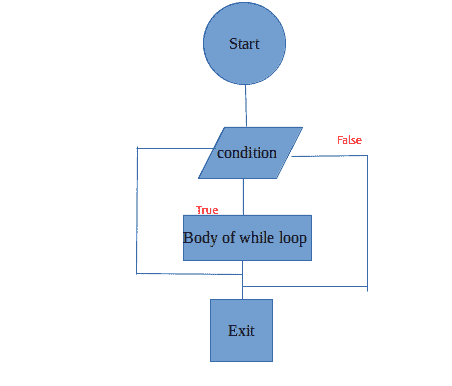
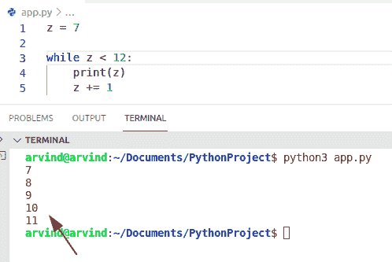
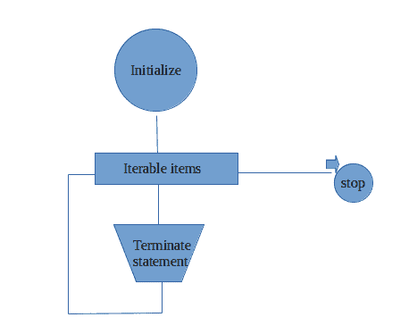
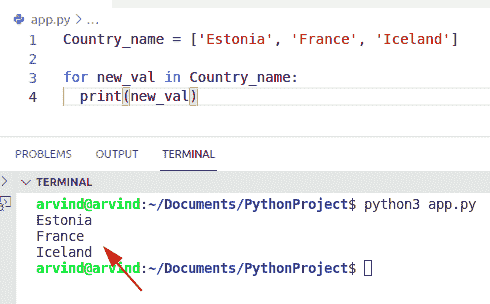

# Python 中 For 循环与 while 循环

> 原文：<https://pythonguides.com/for-loop-vs-while-loop-in-python/>

[](https://sharepointsky.teachable.com/p/python-and-machine-learning-training-course)

在本 Python 教程中，我们将讨论 Python 中的 **For 循环 vs while 循环。**这里我们还将涵盖下面的例子:

*   什么是循环
*   python 中的循环
*   python 中的 For 循环
*   python 中的 While 循环
*   Python 中 For 循环与 while 循环

目录

[](#)

*   [什么是循环？](#What_are_loops "What are loops?")
*   [Python 中的循环](#Loops_in_Python "Loops in Python")
*   [While 循环](#While_loop "While loop")
*   [Python 中的 For 循环](#For_loop_in_Python "For loop in Python")
*   [Python 中 For 循环 vs while 循环](#For_loop_vs_while_loop_in_Python "For loop vs while loop in Python")

## 什么是循环？

*   循环基本上允许我们在给定的条件下多次终止一个语句或一个组。
*   在 Python 中，在开始进入循环时定义了许多条件。
*   在 Python 中，如果条件变为 false，循环将停止，条件将退出循环。

阅读: [Python While 循环条件](https://pythonguides.com/python-while-loop-condition/)

## Python 中的循环

*   现在我们将讨论 Python 中有多少种循环。
*   有三种类型的循环，一种是 for 循环、while 循环和嵌套循环。所以在本教程中，我们将只讨论循环的**和循环**的**概念。**

## While 循环

在 Python 中，while 循环基本上是用来知道需要迭代多少次。

这是 while-loop 的流程图



Flow chart while loop

**while 循环的语法:**

```py
While condition:
    statement
```

在 Python 中，你不知道你需要执行多少次体循环中的语句。

让我们借助一个示例来检查 while 循环条件:

**源代码:**

```py
z = 7

while z < 12:
    print(z)
    z += 1
```

在上面的代码中，我们编写了 while 循环条件 z 小于 12 (x<12)。循环以四种方式完成，当 z 等于 12 时停止。

下面是以下给定代码的执行过程



While loop in Python

阅读: [Python While 循环条件](https://pythonguides.com/python-while-loop-condition/)

## Python 中的 For 循环

在 Python 中，当用户知道所需的迭代次数时，使用 for 循环。用户知道循环中可用的语句需要终止多少次。

在这里你可以查看循环的流程图



Flow chart For loop in python

下面是循环的**的语法**

```py
for value in range:
 statement
```

在 Python 中，for-loop 提供了一个包含三个信息的语法，首先是条件，然后是初始值，最后是给定值的增量。

在这里，我们可以借助一个示例来检查它们的循环条件

**来源` `代号:**

```py
Country_name = ['Estonia', 'France', 'Iceland']

for new_val in Country_name:
  print(new_val)
```

我们在上面的代码中编写了一个 for 循环条件，以在输出中显示国家名称。在这个例子中，我们首先初始化一个包含三个国家的列表“country_name”。

下面是以下给定代码的实现



For loop in Python

阅读: [Python For 循环示例](https://pythonguides.com/python-for-loop/)

## Python 中 For 循环 vs while 循环

| 不同的比较基础
 | For 循环 | While 循环 |
| --- | --- | --- |
| 申报 | 对于范围内的值:
<语句> | while 条件:
<语句> |
| 使用循环 | 当我们已经知道迭代次数时，for 循环仅用于
。 | 当我们不知道需要多少次迭代时，使用 while 循环。 |
| 情况 | 如果没有条件，则循环无限次迭代。 | 但是在 while 的情况下，如果条件缺失，那么它会显示一个错误。 |
| 循环 | 在循环语句中，它总是写在顶部。 | 但是在 while 的情况下，我们可以在循环体的任何地方存储语句。 |
| 工作过程 | 控制到达该条件，它将检查给定序列中的项目，它将终止语句并再次开始该过程，然后从给定范围中选择下一个值并执行语句，它将一直终止，直到该范围结束。 | 在 while 的情况下，只有当 while 条件为真时，控制才会在循环内进行检查。当条件为真时，控制会终止循环体，然后再次检查条件是否为真 |
| 初始化 | 在 for 循环的情况下，如果条件第一次不为真，则控制将永远不会进入循环。 | 在 while 循环的情况下，如果条件为真，则循环被迭代。 |
| 示例: | alpha = ['a '，' b '，' c']
for x in alpha:
print(x) | n = 2

而 n < 6:
打印(n)
n += 1 |

For loop vs while loop

你可能也喜欢读下面的文章。

*   [Python while 循环多个条件](https://pythonguides.com/python-while-loop-multiple-conditions/)
*   [使用 if-else 理解 Python 列表](https://pythonguides.com/python-list-comprehension-using-if-else/)
*   [Python while 循环多个条件](https://pythonguides.com/python-while-loop-multiple-conditions/)
*   [Python for 循环索引](https://pythonguides.com/python-for-loop-index/)
*   [Python 绝对值](https://pythonguides.com/python-absolute-value/)
*   [Python 循环遍历一个列表](https://pythonguides.com/python-loop-through-a-list/)

在本 Python 教程中，我们讨论了 Python 中 For 循环与 while 循环的**。**在这里，我们还讨论了以下主题:

*   什么是循环
*   python 中的循环
*   python 中的 For 循环
*   python 中的 While 循环
*   Python 中 for 循环和 while 循环的区别

[Bijay Kumar](https://pythonguides.com/author/fewlines4biju/)

Python 是美国最流行的语言之一。我从事 Python 工作已经有很长时间了，我在与 Tkinter、Pandas、NumPy、Turtle、Django、Matplotlib、Tensorflow、Scipy、Scikit-Learn 等各种库合作方面拥有专业知识。我有与美国、加拿大、英国、澳大利亚、新西兰等国家的各种客户合作的经验。查看我的个人资料。

[enjoysharepoint.com/](https://enjoysharepoint.com/)[](https://www.facebook.com/fewlines4biju "Facebook")[](https://www.linkedin.com/in/fewlines4biju/ "Linkedin")[](https://twitter.com/fewlines4biju "Twitter")