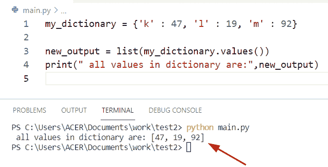

# 从字典 Python 中获取所有值

> 原文：<https://pythonguides.com/get-all-values-from-a-dictionary-python/>

[](https://sharepointsky.teachable.com/p/python-and-machine-learning-training-course)

在本 Python 教程中，我们将讨论**从 Python 字典中获取所有值。**在这里，我们还将介绍以下示例:

*   从嵌套字典 Python 中获取所有值
*   从字典 Python 列表中获取所有值
*   从字典 Python 中获取所有键值
*   Python 从嵌套字典中获取所有键值
*   从字典 Python 中获取所有最大值
*   Python 从字典中获取所有唯一值
*   从字典 Python 列表中获取所有键值
*   从字典 Python 中获取所有键值
*   通过索引从字典 Python 中获取所有值

目录

[](#)

*   [从字典中获取所有值 Python](#Get_all_values_from_a_dictionary_Python "Get all values from a dictionary Python")
    *   [用列表理解法](#By_using_list_comprehension_method "By using list comprehension method")
    *   [通过使用 for 循环方法](#By_using_for_loop_method "By using for loop method")
*   [从嵌套字典 Python 中获取所有值](#Get_all_values_from_nested_dictionary_Python "Get all values from nested dictionary Python")
*   [从 Python 字典列表中获取所有值](#Get_all_values_from_list_of_dictionary_Python "Get all values from list of dictionary Python")
*   [从字典 Python 中获取所有键值](#Get_all_key_values_from_dictionary_Python "Get all key values from dictionary Python")
*   [Python 从嵌套字典中获取所有键值](#Python_get_all_key_values_from_nested_dictionary "Python get all key values from nested dictionary")
*   [从字典 Python 中获取所有最大值](#Get_all_max_values_from_dictionary_Python "Get all max values from dictionary Python")
*   [Python 从字典中获取所有唯一值](#Python_get_all_unique_values_from_dictionary "Python get all unique values from dictionary")
*   [从索引为](#Get_all_values_from_dictionary_Python_with_index "Get all values from dictionary Python with index")的 Python 字典中获取所有值

## 从字典中获取所有值 Python

*   在 Python 中要从字典中获取所有值，我们可以使用 `values()` 方法。values()方法是 Python 中的内置函数，它返回一个视图对象，该对象表示包含所有值的字典列表。
*   有许多方法来执行这个任务
    *   通过使用值方法
    *   通过使用列表理解方法
    *   通过使用 for 循环方法

**源代码:**

```py
my_dictionary = {'k' : 47, 'l' : 19, 'm' : 92}

new_output = list(my_dictionary.values())
print(" all values in dictionary are:",new_output)
```

首先在上面的代码中，我们将初始化一个字典，并分配键值对元素。现在使用 `list()` 方法并存储一个原始字典作为参数。

下面是以下给定代码的执行过程



Get all values from a dictionary Python

### 用列表理解法

在 Python **中，列表理解**是由方括号 **[]** 定义的，它被用来从可重复条目中创建一个新列表，就像字典一样。在这个例子中，我们将从字典中提取所有的值，并将它们包含到列表中。

**举例:**

```py
new_dict = {"Australia":56,"SouthAfrica":91,"NewZealand":189}

[print(new_value) for new_value in new_dict.values()] 
```

下面是以下代码的截图


Get all values from a dictionary Python by list method

### 通过使用 for 循环方法

在这个例子中，我们可以在 for 循环语法中使用 `values()` 方法，它将返回可迭代的值。

**源代码:**

```py
stu_dict ={"j":18,"q":56,"o":119}
for new_val in stu_dict.values():
    print("Extract values from dictionary",new_val) 
```

下面是以下给定代码的输出


Get all values from a dictionary Python by the loop method

阅读: [Python 元组字典](https://pythonguides.com/python-dictionary-of-tuples/)

## 从嵌套字典 Python 中获取所有值

*   让我们看看如何从 Python 中的嵌套字典获取所有值。
*   要从嵌套字典中提取所有值，我们可以很容易地使用 values()方法。该方法用于存储字典中的所有值。在 Python 中， `values()` 方法将检查条件，如果字典不包含任何值，那么它将返回一个空字典。

**源代码:**

```py
def new_nest_dict(m):
  for val in m.values():
    if isinstance(val, dict):
      yield from new_nest_dict(val)
    else:
      yield val

my_dict={'g':19,'k':32,'z':{'i':89,'q':10,'pa':{'ou':10},'w':6,'h':{'rt':17,'lr':16}}}
b= list(new_nest_dict(my_dict))
print(b)
```

首先在上面的代码中，我们将定义一个函数，并将' m '关键字作为参数传递。现在我们将检查 **'isinstance'** 方法的条件。如果给定值包含在参数中，此方法将返回 True。在这个例子中，我们将从一个嵌套的字典中提取所有的值，并将它们包含到列表中。

下面是以下给定代码的执行过程


Get all values from nested dictionary Python

阅读: [Python 从两个列表中创建了一个字典](https://pythonguides.com/python-creates-a-dictionary-from-two-lists/)

## 从 Python 字典列表中获取所有值

在 Python 中，为了从字典列表中获取所有值，我们可以应用列表理解方法。首先在这个例子中，我们创建了一个列表并存储了一个嵌套的字典对。之后，我们使用列表理解方法，在列表中传递**‘Country _ name’**键作为参数。

**举例:**

```py
new_lis_dict = [{'Country_name': 24, 'stu_name': 190},
           {'Country_name': 89, 'stu_name': 678},
           {'Country_name': 129, 'stu_name': 292}]

new_val = [m['Country_name'] for m in new_lis_dict if 'Country_name' in m]
new_val2 = [m['stu_name'] for m in new_lis_dict if 'stu_name' in m]
print(new_val)
print(new_val2)
```

下面是以下给定代码的输出


Get all values from a list of dictionary Python

阅读: [Python 字典 pop](https://pythonguides.com/python-dictionary-pop/)

## 从字典 Python 中获取所有键值

在 Python 中要从字典中获取所有的键值对，我们可以很容易地使用方法 **dict。项目()。**这个方法帮助用户从字典中提取所有的键和值，并用 for 循环方法迭代对象。

**源代码:**

```py
stu_dict ={"Germany":178,"Egypt":145,"Ukraine":129}

for key, value in stu_dict.items():
    print("Extract keys and values from dictionary:",key,value)
```

下面是以下代码的截图


Get all key values from dictionary Python

阅读: [Python 循环遍历一个列表](https://pythonguides.com/python-loop-through-a-list/)

## Python 从嵌套字典中获取所有键值

*   让我们看看如何从嵌套字典中获取所有键值对。
*   为了完成这个任务，我们可以应用 `dict.items()` 方法。该方法从嵌套字典中提取所有元素。

**源代码:**

```py
my_dict = {
    'Country_name':{'Albania':278,'Bermuda':197,'Colombia':156},
    'student_name':{'Florida':146,'Elanie':467,'Malia': 125,'Adelina':886,'Oliva':997}
}

for key, value in my_dict.items():
    print("Extract pairs from nested dictionary:",key,value)
```

在上面的内容中，我们创建了一个列表，并在一个嵌套字典中包含了键值对元素。现在使用 for 循环方法从字典中获取**键值**对。

下面是以下给定代码的实现


Python get all key values from a nested dictionary

阅读: [Python 字典包含](https://pythonguides.com/python-dictionary-contains/)

## 从字典 Python 中获取所有最大值

*   让我们看看如何从字典中找到最大值。
*   通过使用 **max()和 dict.values** ()我们可以从 Python 字典中获得最大值。
*   在 Python 中，max()函数返回给定字典中的最大值。values()方法总是返回一个视图对象，该对象表示包含所有值的字典列表。

**举例:**

```py
my_new_dict = {"m": 18, "q": 92, "z": 199}

new_value = my_new_dict.values()
b = max(new_value)
print("Maximum value from dictionary:",b)
```

在上面的代码中，我们首先初始化一个字典，并给它们分配键值对元素。现在创建一个变量并传递 **dict。values()** 作为自变量。之后使用 `max()` 函数从字典中获取一个最大值。

下面是以下给定代码的输出


Get all max values from dictionary Python

阅读: [Python 字典理解](https://pythonguides.com/python-dictionary-comprehension/)

## Python 从字典中获取所有唯一值

*   让我们看看如何从字典中获取唯一值。
*   为了执行这个任务，我们可以使用 `set()` 方法和 pass list comprehension 方法作为参数。在 Python 中，set()方法是 Python 中的内置函数，它用于转换任何可迭代元素，其中该可迭代元素是**‘new _ list’**变量。

**源代码:**

```py
new_list = [{"q":"t02"}, {"k": "t01"}, {"z": "t02"}, {"z": "t09"}, {"m":"t03"}, {"u":"t01"},{"v":"t04"}]

new_val = set( new_v for new_dic in new_list for new_v in new_dic.values())
print("Unique Values from dictionary: ",new_val)
```

在这个例子中，我必须打印唯一值的列表，并从字典中删除重复值。

下面是以下给定代码的执行过程


Python get all unique values from a dictionary

阅读: [Python 字典按值查找键](https://pythonguides.com/python-dictionary-find-a-key-by-value/)

## 从索引为的 Python 字典中获取所有值

*   在这里，我们可以检查如何用 Python 从带有索引的字典中获取所有值。
*   通过使用字典列表理解和枚举器方法，我们可以很容易地执行这项任务。
*   要在 Python 中创建列表，我们可以很容易地使用列表理解方法，这是从字典中获取值的简单方法。在这个例子中，我们可以通过 for 循环应用 `enumerator()` 方法来跟踪元素的位置。
*   这些函数用于从 dictionary Python 中获取所有值。

**举例:**

让我们举一个例子，看看如何从一个带索引的字典中获取所有值

```py
new_list = [4,5,6,7,8,9]

new_out = {val : m + 1 for m, val in enumerate(new_list)}

print("Extract values with index: ",new_out)
```

下面是以下代码的截图


Get all values from dictionary Python with index

你可能也喜欢读下面的文章。

*   [Python 字典删除](https://pythonguides.com/python-dictionary-remove/)
*   [Python 字典长度](https://pythonguides.com/python-dictionary-length/)
*   [Python 绝对值](https://pythonguides.com/python-absolute-value/)
*   [Python 将字典转换成数组](https://pythonguides.com/python-convert-dictionary-to-an-array/)
*   [如何在 python 中创建字典键列表](https://pythonguides.com/create-a-list-of-dictionary-keys-in-python/)
*   [如何创建一个空的 Python 字典](https://pythonguides.com/how-to-create-an-empty-python-dictionary/)

在本 Python 教程中，我们讨论了**从字典 Python 中获取所有值。**在这里，我们还讨论了以下主题:

*   从嵌套字典 Python 中获取所有值
*   从字典 Python 列表中获取所有值
*   从字典 Python 中获取所有键值
*   Python 从嵌套字典中获取所有键值
*   从字典 Python 中获取所有最大值
*   Python 从字典中获取所有唯一值
*   从字典 Python 列表中获取所有键值
*   从字典 Python 中获取所有键值
*   通过索引从字典 Python 中获取所有值

[Bijay Kumar](https://pythonguides.com/author/fewlines4biju/)

Python 是美国最流行的语言之一。我从事 Python 工作已经有很长时间了，我在与 Tkinter、Pandas、NumPy、Turtle、Django、Matplotlib、Tensorflow、Scipy、Scikit-Learn 等各种库合作方面拥有专业知识。我有与美国、加拿大、英国、澳大利亚、新西兰等国家的各种客户合作的经验。查看我的个人资料。

[enjoysharepoint.com/](https://enjoysharepoint.com/)[](https://www.facebook.com/fewlines4biju "Facebook")[](https://www.linkedin.com/in/fewlines4biju/ "Linkedin")[](https://twitter.com/fewlines4biju "Twitter")