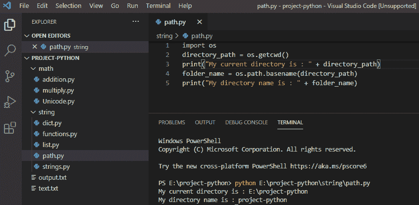
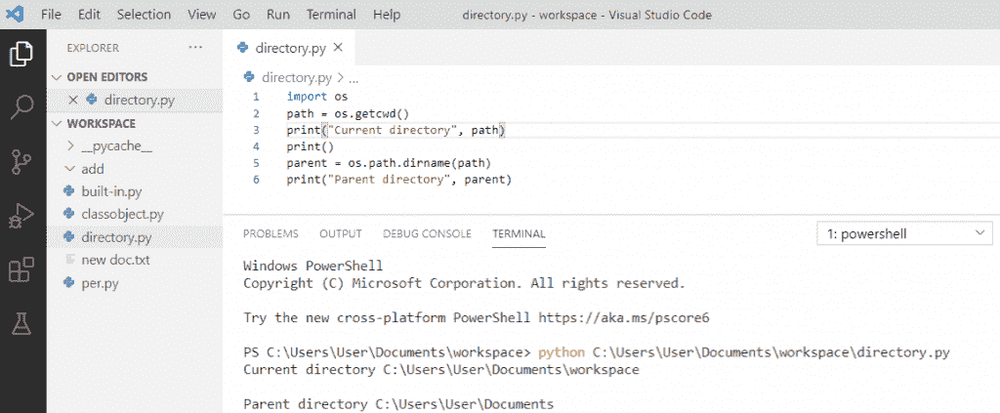
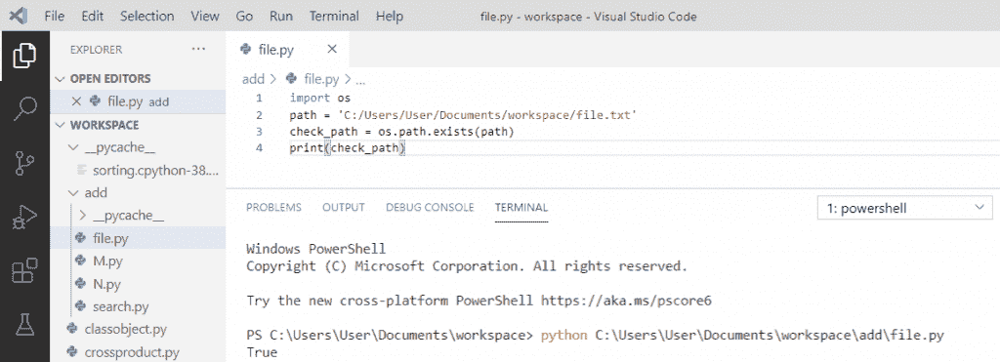

# 获取当前目录 Python

> 原文：<https://pythonguides.com/get-current-directory-python/>

[](https://sharepointsky.teachable.com/p/python-and-machine-learning-training-course)

在此 [python tutoria](https://pythonguides.com/python-hello-world-program/) l 中，您将学习如何**获取当前目录，以及 python 中的 python 获取当前目录的父目录**、 **Python:不能打开文件“manage . py”:【errno *】没有这样的文件或目录**、 **Python 检查目录是否存在**。

目录

[](#)

*   [获取当前目录 Python](#Get_current_directory_Python "Get current directory Python")
*   [Python 获取当前目录的父目录](#Python_get_parent_of_current_directory "Python get parent of current directory")
*   [Python:无法打开文件‘manage . py’:[errno *]没有这样的文件或目录](#Python_cant_open_file_managepy_errno_no_such_file_or_directory "Python: can’t open file ‘manage.py’: [errno *] no such file or directory")
*   [Python 检查目录是否存在](#Python_check_if_directory_exists "Python check if directory exists")

## 获取当前目录 Python

*   为了在 python 中获取当前目录，我们将使用 `os` 模块，该模块有一个方法 `getcwd()` ，该方法将返回当前工作目录的完整路径。
*   当前目录是运行脚本的文件夹。
*   为了获得目录的名称，我们可以使用另一个来自 `os.path.` 的函数 `basename`

**举例:**

```py
import os
directory_path = os.getcwd()
print("My current directory is : " + directory_path)
folder_name = os.path.basename(directory_path)
print("My directory name is : " + folder_name)
```

写完上面的代码(获取当前目录 Python)，你会打印出**“directory _ path”**然后输出会出现**“我的当前目录是 E:\project-python** ”。这里，我们使用 getcwd()获取当前工作目录，这是完整的路径， `basename` 用于获取目录名。

可以参考下面截图**获取当前目录 Python** 。



`get current directory Python`

## Python 获取当前目录的父目录

为了得到父目录，我们将使用**`OS`**模块**，它将与操作系统交互。python 中的 `os.path.dirname()` 方法用于从路径中获取目录名。**

 ****举例:**

```py
import os
path = os.getcwd()
print("Current directory", path)
print()
parent = os.path.dirname(path)
print("Parent directory", parent)
```

写完上面的代码(python 获取当前目录的父目录)，你将打印出 `"parent"` ，然后输出将显示为**"当前目录 C:\ Users \ User \ Documents \ workspace 父目录 C:\Users\User\Documents** 。在这里，我们得到了父目录。

可以参考下面 **python 获取当前目录**的父目录的截图。



Python get parent of current directory

## Python:无法打开文件‘manage . py’:[errno *]没有这样的文件或目录

当文件在任何**子目录**中时，我们得到这个**错误**，然后它会给你错误**“无法打开文件‘manage . py’:【errno *】没有这样的文件或目录”**在 python 中。

**举例:**

```py
f_list = iter(["rose","tulip"])
s = next(f_list)
print(s)
s = next(f_list)
print(s)
```

写完上面的代码(python:无法打开文件' manage.py': [errno *]没有这样的文件或目录)。一旦你通过编写`" python manage . py runserver "`来运行程序，那么你将得到这个错误 a **" Python.exe:不能打开文件' manage . py ':【errno *】没有这样的文件或目录"**。这里，错误是由目录引起的。

您可以参考下面的截图，以了解无法打开文件“manage . py”:[errno *]没有这样的文件或目录。

![Python: can't open file 'manage.py': [errno *] no such file or directory](img/843da22b1d7001450ccee0d21a153130.png "Python cant open file manage.py no such file or directory")

Python: can’t open file ‘manage.py’: [errno *] no such file or directory

要解决这个错误，您必须通过写入**“CD add”**来更改目录，即**“manage . py”**文件所在的目录，然后您将能够运行该程序。

**举例:**

```py
f_list = iter(["rose","tulip"])
s = next(f_list)
print(s)
s = next(f_list)
print(s)
```

写完上面的代码后，一旦你要写`" python manage . py runserver "`那么输出就会出现为**"玫瑰郁金香"**。现在， `manage.py` 文件就在这个文件夹的根目录下。并且错误被解决。

你可以参考下面的截图 python:无法打开文件' manage.py': [errno *]没有这样的文件或目录

![Python: can't open file 'manage.py': [errno *] no such file or directory](img/88a864facf4d1b06755d8c5e056cf1b5.png "Python cant open file manage.py no such file or directory 1")

Python: can’t open file ‘manage.py’: [errno *] no such file or directory

## Python 检查目录是否存在

为了检查目录是否存在，我们将使用 python `exists()` 方法来检查特定的文件或目录是否存在。我们先将**导入** `os` 模块和 os.path 子模块作为 `os.path.exists(path)` 。

**举例:**

```py
import os
path = 'C:/Users/User/Documents/workspace/file.txt'
check_path = os.path.exists(path)
print(check_path)
```

写完上面的代码(python 检查目录是否存在)，你将打印出 `"check_path"` ，然后输出将显示为 `" True "` 。这里，我们检查路径是否存在，如果路径存在，它将返回布尔值**真**，否则它将返回**假**。

你可以参考下面的截图 python 检查目录是否存在



Python check if directory exists

您可能会喜欢以下 Python 教程:

*   [语法错误返回外部函数 python](https://pythonguides.com/syntaxerror-return-outside-function-python/)
*   [从字符串 Python 中删除字符](https://pythonguides.com/remove-character-from-string-python/)
*   [在 Python 中创建一个空数组](https://pythonguides.com/create-an-empty-array-in-python/)
*   [python 中的无效语法](https://pythonguides.com/invalid-syntax-in-python/)
*   [语法错误标识符 python3 中的无效字符](https://pythonguides.com/syntaxerror-invalid-character-in-identifier-python3/)
*   [如何在 Python 中处理 indexerror:字符串索引超出范围](https://pythonguides.com/indexerror-string-index-out-of-range-python/)
*   [解析 Python 时出现意外的 EOF](https://pythonguides.com/unexpected-eof-python/)
*   [Python 对于基数为 10 的 int()无效文字](https://pythonguides.com/python-invalid-literal-for-int-with-base-10/)
*   [Python 中的字符串方法及示例](https://pythonguides.com/string-methods-in-python/)
*   [Python 创建空集](https://pythonguides.com/python-create-empty-set/)
*   Python 中的[函数](https://pythonguides.com/function-in-python/)
*   [Python 读取 CSV 文件并写入 CSV 文件](https://pythonguides.com/python-read-csv-file/)
*   [Python 退出命令(quit()、exit()、sys.exit())](https://pythonguides.com/python-exit-command/)
*   [Python 二分搜索法和线性搜索](https://pythonguides.com/python-binary-search/)

在本教程中，我们学习了如何**获取当前目录**，我们还看到了 python **在 python** 、**中获取当前目录的父目录 Python:无法打开文件‘manage . py’:【errno *】没有这样的文件或目录**以及 **Python 检查目录是否存在**。

[Bijay Kumar](https://pythonguides.com/author/fewlines4biju/)

Python 是美国最流行的语言之一。我从事 Python 工作已经有很长时间了，我在与 Tkinter、Pandas、NumPy、Turtle、Django、Matplotlib、Tensorflow、Scipy、Scikit-Learn 等各种库合作方面拥有专业知识。我有与美国、加拿大、英国、澳大利亚、新西兰等国家的各种客户合作的经验。查看我的个人资料。

[enjoysharepoint.com/](https://enjoysharepoint.com/)[](https://www.facebook.com/fewlines4biju "Facebook")[](https://www.linkedin.com/in/fewlines4biju/ "Linkedin")[](https://twitter.com/fewlines4biju "Twitter")**