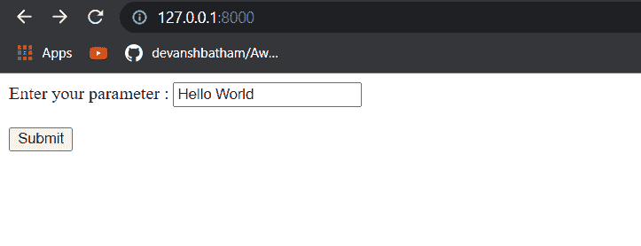
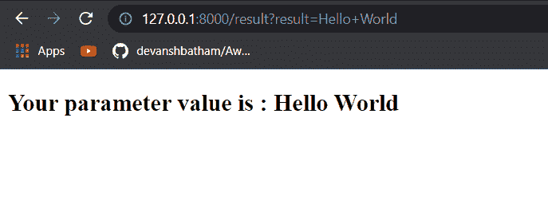
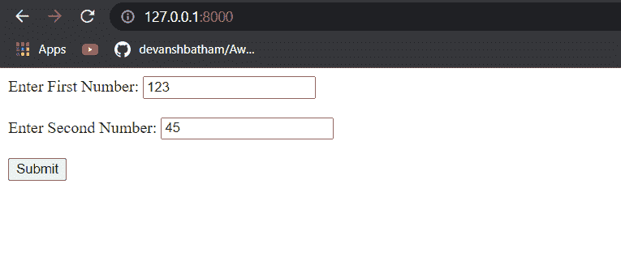
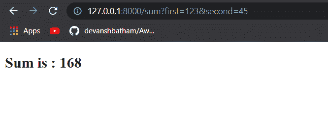

# 如何在 Django 中从 get 请求中获取数据

> 原文：<https://pythonguides.com/get-data-from-get-request-in-django/>

[](https://sharepointsky.teachable.com/p/python-and-machine-learning-training-course)

在这个 [Django 教程](https://pythonguides.com/setup-django-project/)中，你将学习**如何从 Django 的 get 请求中获取数据。**

当您向服务器发送请求时，您也可以发送一些参数。通常，我们使用 GET 请求从服务器获取一些数据。我们可以通过请求发送参数来获得一些特定的数据。

例如，您可以想到一个电子商务网站，在那里您可以看到产品列表。现在，要查看特定产品的详细信息，可以将与该产品相关联的 id 作为 GET 参数发送。

这些 GET 参数在服务器上进行解析，然后服务器返回一个显示特定产品详细信息的响应页面。

您可以解析来自**请求的 GET 参数。在 Python Django 中获取**对象。您必须在该对象中定义 HTML 控件的名称来解析该值。例如，您可以使用 HTML 文本框来发送参数。

在本文中，您将看到一些关于 Django 中 GET 参数如何工作的例子。

*   Django 从 get 请求示例中获取数据
*   在 django 中添加两个数

目录

[](#)

*   [Django 从 get 请求示例中获取数据](#Django_get_data_from_get_request_example "Django get data from get request example")
*   [将 django 中的两个数相加](#Add_two_numbers_in_django "Add two numbers in django")

## Django 从 get 请求示例中获取数据

现在我将从一个简单的例子开始。我已经创建了一个简单的 HTML 页面，我将使用文本框输入。HTML 源文件是:

```py
<!DOCTYPE html>
<html lang="en">
<head>
    <meta charset="UTF-8">
    <meta http-equiv="X-UA-Compatible" content="IE=edge">
    <meta name="viewport" content="width=device-width, initial-scale=1.0">
    <title>Demo</title>
</head>
<body>
    <div>
        <form action = "result">
        Enter your parameter : <input type="text" name="result" placeholder="Your input value"><br><br>
        <input type="submit">
    </form><br>
    </div>
</body>
</html>
```

现在，这个 HTML 表单将把请求重定向到结果端点。我已经在应用程序的 `urls.py` 文件中定义了这个端点。urls.py 文件是:

```py
from django.urls import path
from . import views
urlpatterns = [
    path('',views.index),
    path('result', views.result)
]
```

这个端点将执行**视图. py** 文件中的**结果**函数。可以看到下面的 `views.py` 文件。

```py
from django.shortcuts import render
def index(request):
    return render(request, 'index.html')

def result(request):
    result = request.GET['result']
    return render(request, 'result.html', {'result':result}) 
```

您可以在文件中看到我是如何实现结果函数来解析 GET 参数的。解析完参数后，我已经将它返回给了`result.html`模板，该模板将在函数执行时呈现。



Entering the parameter value in the HTML textbox

以上是我上面提到的第一个 HTML 页面的输出。

当点击**提交**按钮时，向**结果**端点以及 GET 参数发出请求，如下图所示:



Parsed and rendered the GET parameter

您可以看到 GET 参数中的值得到了呈现。

这样，你就可以在 Django 中获得一个 get 参数的值。

阅读[如何安装 Django](https://pythonguides.com/how-to-install-django/)

## 将 django 中的两个数相加

现在让我向您展示如何添加两个数字，我将添加两个从 Django 请求中接收的 GET 参数。

为此，首先，我需要一个 HTML 页面，在那里我将放置我的输入控件来获取数据。此外，我将在同一页面上返回结果。HTML 文件是:

```py
<!DOCTYPE html>
<html lang="en">
<head>
    <meta charset="UTF-8">
    <meta http-equiv="X-UA-Compatible" content="IE=edge">
    <meta name="viewport" content="width=device-width, initial-scale=1.0">
    <title>Demo</title>
</head>
<body>
    <div>
        <form action = "sum">
        Enter First Number: <input type="text" name="first" placeholder="First Number"><br><br>
        Enter Second Number: <input type="text" name="second" placeholder="Second Number"><br><br>
        <input type="submit">
    </form><br>
    </div>
</body>
</html>
```

您可以看到，我已经将这个页面重定向到了 `sum` 端点。现在我需要配置 `urls.py` 文件来定义路径和函数映射。

```py
from django.urls import path
from . import views
urlpatterns = [
    path('',views.index),
    path('sum', views.sum1)
]
```

在上面的文件中可以看到，当向 `sum` 端点发出请求时，将执行 `views.py` 文件中的 `sum1()` 函数。

现在 `views.py` 文件看起来像这样:

```py
from django.shortcuts import render
def index(request):
    return render(request, 'index.html')

def sum1(request):
    num1 = int(request.GET['first'])
    num2 = int(request.GET['second'])
    result = num1 + num2
    return render(request, 'sum.html', {'result':result})
```

在这里，您可以看到我是如何解析 GET 参数并使用 `sum1()` 函数将它们的总和返回给`sum.html`模板的。

您可以解析来自**请求的 GET 参数。获取**对象。您必须在该对象中定义输入控件的名称来解析该值。

现在让我们看看这个应用程序的执行。

*   首先，我将向根端点发出请求:



Requested the root endpoint

*   然后我会输入两个数字，点击**提交**。
*   点击**提交**按钮将发送一个 GET 请求到 `sum` 端点以及两个参数。您可以在 URL 中看到 GET 参数。
*   应用程序将返回如下图所示的结果:



Request to the `sum` endpoint along with parameters

因此，通过这个例子，您可能已经了解了 GET 参数如何在 Django 应用程序中工作。

你可能会喜欢下面的 Django 教程:

*   [Python Django 长度过滤器](https://pythonguides.com/python-django-length-filter/)
*   [Python Django 设置时区](https://pythonguides.com/python-django-set-timezone/)
*   [Python Django 格式日期](https://pythonguides.com/python-django-format-date/)
*   [Python 改 Django 版本](https://pythonguides.com/python-change-django-version/)
*   [Django 模板中的 If 语句](https://pythonguides.com/if-statement-in-django-template/)
*   [获取 Django 中的 URL 参数](https://pythonguides.com/get-url-parameters-in-django/)
*   [如何获取 Django 的当前时间](https://pythonguides.com/how-to-get-current-time-in-django/)
*   [Python Django vs 金字塔](https://pythonguides.com/python-django-vs-pyramid/)

因此，您可能已经了解了如何从 get 请求中获取数据作为参数。

*   Django 从 get 请求示例中获取数据
*   在 django 中添加两个数

[Bijay Kumar](https://pythonguides.com/author/fewlines4biju/)

Python 是美国最流行的语言之一。我从事 Python 工作已经有很长时间了，我在与 Tkinter、Pandas、NumPy、Turtle、Django、Matplotlib、Tensorflow、Scipy、Scikit-Learn 等各种库合作方面拥有专业知识。我有与美国、加拿大、英国、澳大利亚、新西兰等国家的各种客户合作的经验。查看我的个人资料。

[enjoysharepoint.com/](https://enjoysharepoint.com/)[](https://www.facebook.com/fewlines4biju "Facebook")[](https://www.linkedin.com/in/fewlines4biju/ "Linkedin")[](https://twitter.com/fewlines4biju "Twitter")