# 获取字典 Python 中的第一个键

> 原文：<https://pythonguides.com/get-first-key-in-dictionary-python/>

[](https://sharepointsky.teachable.com/p/python-and-machine-learning-training-course)

在这个 Python 教程中，我们将讨论如何在 Python 中获得字典中的第一个键。在这里，我们还将介绍以下示例:

*   获取字典 Python 中的第一个键
*   获取字典 Python 中第一个键的值
*   获取字典 Python 中第一个元素的键
*   Python 获取字典中第一项的键
*   获取字典 Python 中的第一个键值对

目录

[](#)

*   [获取字典式 Python 中的第一个密钥](#Get_First_Key_in_dictonary_Python "Get First Key in dictonary Python")
    *   [通过使用 for 循环方法](#By_using_for_loop_method "By using for loop method")
    *   [用 N 键法](#By_using_N_keys_method "By using N keys method")
*   [获取字典 Python 中第一个键的值](#Get_value_of_first_key_in_dict_Python "Get value of first key in dict Python")
    *   [通过使用 item()方法](#By_using_item_method "By using item() method")
    *   [采用 N 值法](#By_using_N_values_method "By using N values method")
*   [获取字典 Python 中第一个元素的键](#Get_key_of_first_element_in_dictionary_Python "Get key of first element in dictionary Python")
*   [Python 获取字典中第一项的关键字](#Python_get_key_of_first_item_in_dictionary "Python get key of first item in dictionary")
*   [获取字典 Python 中的第一个键值对](#Get_first_key_value_pair_in_dictionary_Python "Get first key value pair in dictionary Python")

## 获取字典式 Python 中的第一个密钥

*   在本期节目中，我们将讨论如何获取 Python 字典中的第一个键。
*   这里我们将讨论如何获取字典的第一个键。在 Python 中，字典包含键值对形式的元素。
*   有各种方法来执行这个特定任务
    *   通过使用 keys()方法
    *   通过使用 next()+iter()方法
    *   通过使用 forloop 方法
    *   通过使用 N 键方法

让我们了解并检查如何使用 keys()方法从字典中获取第一个键

Python 提供了函数 `keys()` ，该函数总是返回字典中可用的所有给定键的可迭代序列，并且该方法不带任何参数。

**语法:**

下面是 `dict.keys()` 方法的语法

```py
dict.keys()
```

注意:这个函数不传递任何参数，总是返回一个显示所有键的对象。

**源代码:**

```py
my_new_dict ={'George':192,'Micheal':269,'James':159,'Potter':432}

new_k = list(my_new_dict.keys())[0]
print("Get first key from dictionary:",new_k)
```

在上面的代码中，我们首先创建了一个包含键值对元素的字典**‘my _ new _ dict’**。现在，我们必须使用 `dict.keys()` 方法将键序列转换为一个列表。一旦您将打印**‘new _ k’**，那么输出将显示字典中的第一个关键元素。

下面是以下给定代码的执行过程

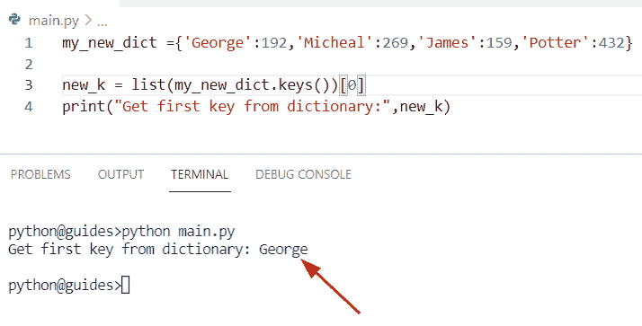

Get the first key in dictionary Python

使用 `next()+iter()` 方法从字典中获取第一个密钥的另一种方法

在 Python 中， `next()` 和 `iter()` 方法用于获得字典元素的可迭代序列。迭代器对象是通过使用 `iter()` 创建的，而 `next()` 方法用于从类似字典的对象中返回下一个值。当我们到达最后一个元素，并且没有更多的数据返回时，它将显示**‘stop iteration’**。

**举例:**

让我们举一个例子，了解如何获得 Python 字典中的第一个键

```py
employee_dictionary = {'Oliva' : 145, 'William' : 389, 'Elijah' : 921}

new_output = next(iter(employee_dictionary))
print(new_output) 
```

下面是以下给定代码的输出

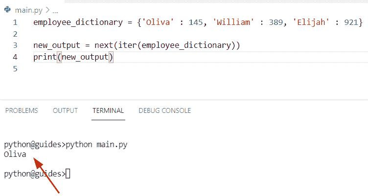

Get First Key in dictionary Python using iter

### 通过使用 for 循环方法

这是另一种通过使用 for 循环方法从字典中获取初始密钥的方法。在 Python for 循环中运行一个代码块，在这个例子中，当我们获得初始密钥时，循环将中断并显示结果。

**源代码:**

```py
fruit_name = { 'Apple': 48, 'Oranges': 289, 'Banana': 192, 'Cherry': 158}

for new_k, new_val in fruit_name.items():
  print(new_k)
  break
```

在这个程序中，在获得字典的初始键后，使用 break 语句停止循环。一旦你将打印**‘new _ k’**，那么输出将显示第一个键**‘苹果’**。

你可以参考下面的截图从字典中获取第一个密钥

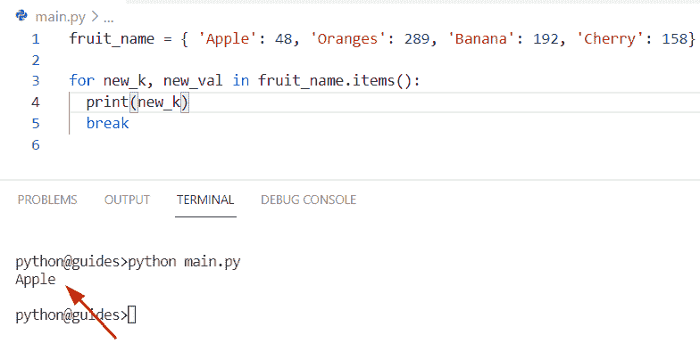

Get First Key in dictionary Python by using for loop

### 用 N 键法

在这个程序中，我们首先从字典中选择**‘I’**个键，然后使用 `list()` 方法将字典中的键转换成一个列表。在下面的例子中，我们选择了第一个 I 条目，即**‘I = 1’**。

**源代码:**

```py
Country_name = { 'Germany': 378, 'Australia': 167, 'Newyork': 556, 'China': 443}

i = 1
new_ini_ke = list(Country_name.keys())[:i]
print("Initial key from dictionary:",new_ini_ke)
```

在上面的程序中，我们首先初始化了一个包含键值对的字典。一旦您将打印 **'new_ini_ke'** ，那么输出将显示**'德国'**。

下面是以下代码的截图

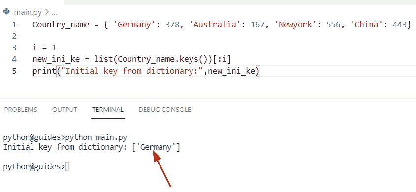

Get First Key in dictionary Python using keys method

阅读: [Python 字典增量值](https://pythonguides.com/python-dictionary-increment-value/)

## 获取字典 Python 中第一个键的值

*   让我们看看如何从 Python 字典中获取第一个键的值。
*   要从字典中获取第一个值，有各种方法和关键字来解决这个问题。
    *   通过使用 dict.values()方法
    *   通过使用 item()方法
    *   通过使用 N 值方法

让我们了解并检查如何使用 `dict.values()` 方法从字典中获取初始键的值。

在 Python 中，字典提供了一个 `dict.values()` 方法，并返回一个对象，该对象显示一个包含字典中所有值的列表。在这个方法中，如果字典没有值，那么它将返回一个空字典。

**语法:**

下面是 dict.values()方法的语法

```py
dict.values()
```

**注意:**这个函数不接受任何参数，以列表的形式返回字典值。

**举例:**

```py
Country_name = { 'Newzealand': 490, 'Switerland': 380, 'Russia': 117, 'France': 190}

new_val = list(Country_name.values())[0]
print('Get value from first key:', new_val)
```

在上面的程序中，我们首先创建了一个包含键值对元素的字典**‘Country _ name’**。现在我们必须使用 `dict.values()` 方法将值序列转换成一个列表。一旦您将打印**‘new _ val’**，那么输出将显示字典中的初始键值。

下面是以下给定代码的实现

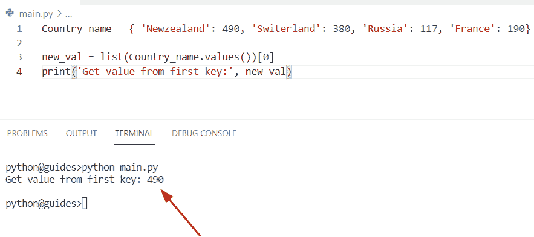

Get the value of the first key in dict Python

### 通过使用 item()方法

*   这是检查如何从字典中获取初始键值的另一种方法。
*   为了执行这个特定的任务，我们可以应用 `dict.items()` 方法的概念。在 Python 中，此方法用于返回一个对象，该对象显示一个列表，其中包含所有带值的字典键。

**语法:**

下面是 dict.items()方法的语法

```py
dict.items()
```

注意:这个函数不接受任何参数，总是返回一个对象。

**源代码:**

```py
Flower_name = { 'Rose': 623, 'Tulip': 168, 'Lilly': 251, 'Jasmine': 390}

get_val = list(Flower_name.items())[0][1]
print("Initial val from dictionary:", get_val)
```

在上面的程序中，我们已经初始化了一个字典，然后创建了一个变量' get_val '。现在我们必须使用 `list()` 方法并分配一个键值对索引 **[0][1]** 。

你可以参考下面的截图

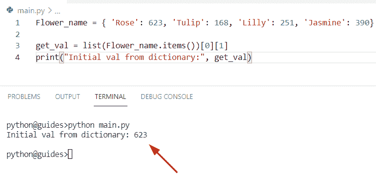

Get the value of the first key in dict Python by using the item

### 采用 N 值法

在这个例子中，我们首先从字典中选择**‘m’**个键-值对，然后使用 `list()` 方法将字典中的值转换成一个列表。

**源代码:**

```py
Student_name = { 'George': 45, 'Aris': 23, 'Elijah': 69, 'William': 109}

m = 1
new_get_val = list(Student_name.values())[:m]
print("Get selected value from dictionary:",new_get_val)
```

下面是以下代码的截图

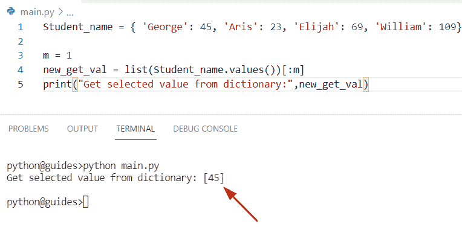

Get the value of the first key in dict Python

这就是如何从字典中获取初始键的值。

阅读: [Python 列表字典](https://pythonguides.com/python-dictionary-of-lists/)

## 获取字典 Python 中第一个元素的键

*   这里我们可以看到如何从 Python 字典中获取第一个 key 元素。
*   通过使用 `next()` 和 `iter()` 方法，我们可以执行这个特定的任务，这些方法用于获得可迭代序列。

**源代码:**

```py
Country_name = { 'Bangladesh': 647, 'Japan': 810, 'Turkey': 942, 'China': 280}

new_result = next(iter(Country_name))
print("Initial first key element:", new_result) 
```

在上面的例子中，我们首先创建了一个字典，然后使用 `next()+iter()` 方法从字典中获取第一个 key 元素。

下面是以下给定代码的输出

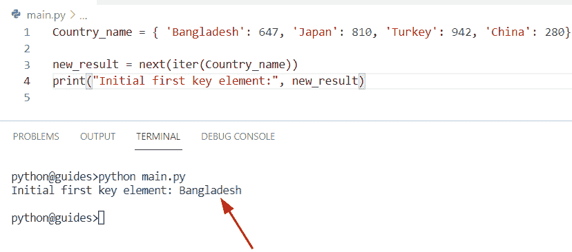

Get key of the first element in dictionary Python

阅读: [Python 字典扩展](https://pythonguides.com/python-dictionary-extend/)

## Python 获取字典中第一项的关键字

*   在本期节目中，我们将讨论如何从字典中获取第一个关键条目。
*   通过使用列表理解方法，我们可以解决这个任务，这个构造函数用于从另一个可迭代序列(如字典)创建一个新的。在这个例子中，如果给定的值在字典中不存在，那么它将返回一个空数组。

**源代码:**

```py
new_dictionary= { 'Chinese': '256', 'Italian': '180', 'Mexican': 632, 'Thai': 189}

new_output = [new_key for new_key, new_val in new_dictionary.items() if new_val == '256']
print(new_output)
```

在上面的代码中，我们应用了列表理解方法[]的概念来迭代字典的键和值。在这个方法中，它将检查条件**new _ val = = ' 256′**是否存在于字典中。如果可用，它将显示第一个关键元素。

你可以参考下面的截图

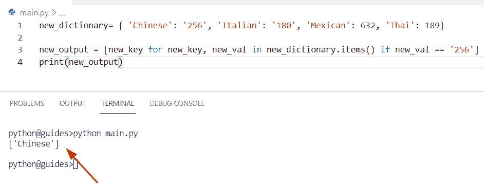

Python get the key of the first item in a dictionary

阅读: [Python 字典复制](https://pythonguides.com/python-dictionary-copy/)

## 获取字典 Python 中的第一个键值对

*   这里我们可以看到如何从 Python 字典中获取第一个键值元素。
*   通过使用 `iter()` 和 `next()` 方法，我们可以迭代字典中所有的键值对。在 Python 中, `iter()` 函数创建一个可迭代的对象，它可以一次迭代一个元素。为了获得这个序列的第一个元素，我们可以使用 `next()` 函数，在这个函数中，我们将 `iter()` 和 `items()` 函数作为参数传递。

**源代码:**

```py
new_my_dict= { 'b': 167, 'z': 119, 'p': 108, 'w': 167}

initial_ele = next(iter((new_my_dict.items())) )
print( initial_ele[0])
print(initial_ele[1])
print("Initial key-value pair element:",initial_ele)
```

下面是以下给定代码的执行过程

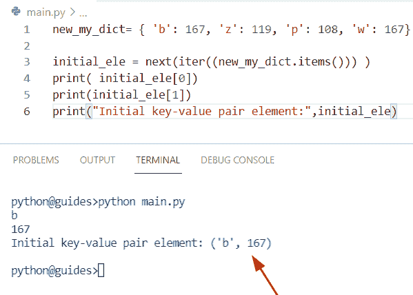

Get first key-value pair in dictionary Python

检查如何从 Python 字典获得第一个键值对的另一种方法

通过使用列表和切片方法，我们从**列表[:m]** 中选择了**‘m’**个条目。在这个例子中，我们从字典中选择了第一个键值对。

**源代码:**

```py
student_name= { 'Chris': 541, 'Hemsworth': 930, 'James': 162, 'Oliva': 108}

m = 1

result= list(student_name.items())[:m]
for new_k,new_val in result:
    print("Get key-value pair from dictionary:",new_k, ':', new_val)
```

你可以参考下面的截图

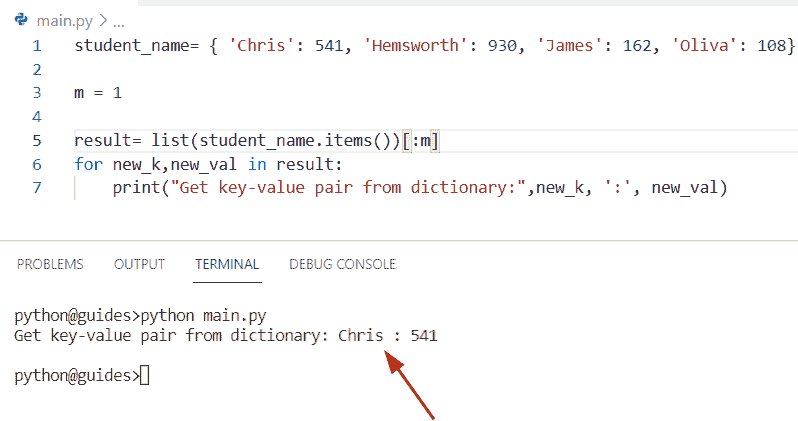

Get first key-value pair in dictionary Python

你可能会喜欢读一些我们关于 Python 的教程。

*   [Python 字典多键](https://pythonguides.com/python-dictionary-multiple-keys/)
*   [Python 字典到 CSV](https://pythonguides.com/python-dictionary-to-csv/)
*   [Python 在字符串中查找数字](https://pythonguides.com/python-find-number-in-string/)
*   [Python 中的 Case 语句](https://pythonguides.com/case-statement-in-python/)
*   [如果不是 python 中的条件](https://pythonguides.com/if-not-condition-in-python/)
*   [在 python 中反转一个列表](https://pythonguides.com/reverse-a-list-in-python/)
*   [Python 元组字典](https://pythonguides.com/python-dictionary-of-tuples/)
*   [Python 字典流行](https://pythonguides.com/python-dictionary-pop/)
*   [Python 将数据帧转换为列表](https://pythonguides.com/python-convert-dataframe-to-list/)
*   [从字典中获取所有值 Python](https://pythonguides.com/get-all-values-from-a-dictionary-python/)

在这个 Python 教程中，我们已经讨论了如何在 Python 中获得字典中的第一个键。在这里，我们还介绍了以下示例:

*   获取字典 Python 中的第一个键
*   获取字典 Python 中第一个键的值
*   获取字典 Python 中第一个元素的键
*   Python 获取字典中第一项的键
*   获取字典 Python 中的第一个键值对

[Bijay Kumar](https://pythonguides.com/author/fewlines4biju/)

Python 是美国最流行的语言之一。我从事 Python 工作已经有很长时间了，我在与 Tkinter、Pandas、NumPy、Turtle、Django、Matplotlib、Tensorflow、Scipy、Scikit-Learn 等各种库合作方面拥有专业知识。我有与美国、加拿大、英国、澳大利亚、新西兰等国家的各种客户合作的经验。查看我的个人资料。

[enjoysharepoint.com/](https://enjoysharepoint.com/)[](https://www.facebook.com/fewlines4biju "Facebook")[](https://www.linkedin.com/in/fewlines4biju/ "Linkedin")[](https://twitter.com/fewlines4biju "Twitter")