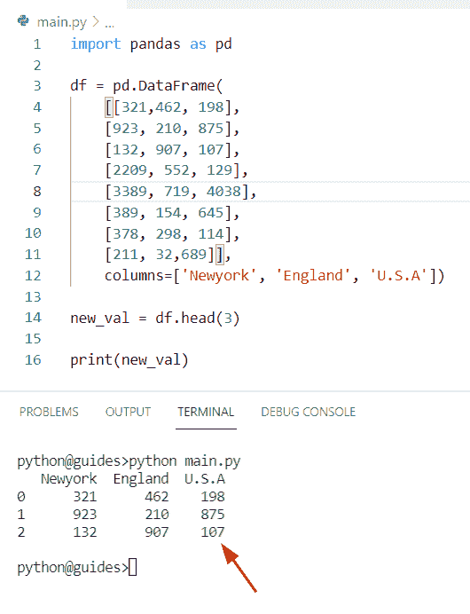

# 如何在 Python 中获得熊猫数据帧的前 N 行

> 原文：<https://pythonguides.com/get-first-n-rows-of-pandas-dataframe/>

[](https://sharepointsky.teachable.com/p/python-and-machine-learning-training-course)

在这个 [Python 熊猫教程](https://pythonguides.com/pandas-in-python/)中，将学习**如何使用 Python 中的熊猫获取数据帧**的前 N 行。此外，我们将涵盖这些主题。

*   获取熊猫数据帧的前 10 行
*   获取熊猫数据帧的前 N 行列表
*   获取熊猫数据帧的前 N 行作为字典
*   获取熊猫数据帧的前 N 行作为标题
*   获取熊猫数据帧的前 N 行作为列名
*   获取熊猫数据帧所有列的前 N 行

目录

[](#)

*   [获取前 N 行熊猫数据帧](#Get_first_N_rows_of_Pandas_DataFrame "Get first N rows of Pandas DataFrame")
*   [获取 Python 熊猫数据帧的前 N 行](#Get_first_N_rows_of_Python_Pandas_DataFrame "Get first N rows of Python Pandas DataFrame")
*   [获取前 10 行熊猫数据帧](#Get_first_10_rows_of_Pandas_DataFrame "Get first 10 rows of Pandas DataFrame")
*   [获取熊猫数据帧的前 N 行作为列表](#Get_first_N_row_of_Pandas_DataFrame_as_list "Get first N row of Pandas DataFrame as list")
*   [获取熊猫数据帧的前 N 行作为字典](#Get_first_N_row_of_Pandas_DataFrame_as_dictionary "Get first N row of Pandas DataFrame as dictionary")
*   [获取熊猫数据帧的前 N 行作为标题](#Get_first_N_row_of_Pandas_DataFrame_as_header "Get first N row of Pandas DataFrame as header")
*   [获取熊猫数据帧的前 N 行作为列名](#Get_first_N_row_of_Pandas_DataFrame_as_column_name "Get first N row of Pandas DataFrame as column name")
*   [获取熊猫数据帧所有列的前 N 行](#Get_first_N_row_of_Pandas_DataFrame_all_columns "Get first N row of Pandas DataFrame all columns")

## 获取前 N 行熊猫数据帧

*   在本期节目中，我们将讨论如何**获得熊猫数据帧**的前 N 行。
*   在 Python 中，Pandas head()方法用于从 Pandas DataFrame 中检索前 N 行数据。该函数总是返回除最后 n 行之外的所有行。
*   这个方法只包含一个参数 n，如果你没有在函数中传递任何数字，那么默认情况下，它将返回前 5 行元素。

**语法:**

下面是 `DataFrame.head()` 方法的语法

```py
DataFrame.head
              (
               n=5
              )
```

*   它只包含一个参数
    *   n:该参数指示输出中要返回的行数。默认情况下，这被设置为 `n=5` ，它将返回前 5 行数据。

**举例:**

让我们举个例子，看看如何获得熊猫数据帧的前 N 行。

**源代码:**

```py
import pandas as pd

df = pd.DataFrame(
	[[692,128, 992],
	[139, 459, 167],
	[132, 907, 107],
	[2209, 552, 129],
	[3389, 719, 4038],
	[389, 154, 645],
	[378, 298, 114],
	[1, 2,6]],
	columns=['Germany', 'Newzealand', 'China'])

new_val = df.head()

print(new_val)
```

在上面的代码中，我们首先创建了一个包含列表中的值的 DataFrame。现在我们只想提取 5 行数据。为了完成这个任务，我们将使用 `head()` 函数，它将返回前 5 行。

下面是以下给定代码的执行过程


Get the first N rows of Pandas DataFrame

阅读 [Python 熊猫 CSV 教程](https://pythonguides.com/python-pandas-csv/)

## 获取 Python 熊猫数据帧的前 N 行

*   通过使用 `iloc()` 方法，我们还可以**获得前 N 行熊猫数据帧**。
*   在 Python 中， `iloc()` 方法使我们能够选择数据帧的特定单元格，并且我们还可以检索属于列和行的特定值。
*   这个函数只接受整数类型的值，还访问所有的数据值。

**语法:**

下面是 iloc()方法的语法

```py
Pandas.DataFrame.iloc()
```

**源代码:**

```py
import pandas as pd

student_info = [('Micheal',    12, 'Japan',   223),
            ('George',   23, 'China' ,   129),
            ('John',   31, 'U.S.A' ,   458),
            ('Brenda',  18, 'France' ,  875),
            ('William', 27, 'Paris',   569),
            ('Olijah',  29, 'Uganda' ,   809)]

df = pd.DataFrame( student_info, 
                    columns=['Student_name', 'Stu_age', 'Stu_city', 'Student_id'])

N = 2
new_result = df.iloc[:N]
print("N rows of Pandas DataFrame: ")
print(new_result)
```

在上面的程序中，我们首先创建了一个元组列表，其中我们已经分配了 N 行。现在使用 `iloc()` 方法，选择 dataframe 的前 2 行作为 Pandas Dataframe 对象。

下面是以下给定代码的输出


Get the first N rows of Pandas DataFrame

在 Python 中读取[熊猫缺失数据](https://pythonguides.com/missing-data-in-pandas/)

## 获取前 10 行熊猫数据帧

*   这里我们可以看到**如何获得熊猫数据帧**的前 10 行。
*   在这个程序中，我们在 `df.head()` 函数中传递了**‘10’**作为参数。要返回前 10 行，我们可以使用 `DataFrame.head()` 。
*   此方法用于返回给定数据帧或系列的 10 行。您也可以更改括号之间的值来更改行数。

**举例:**

```py
import pandas as pd

df = pd.DataFrame(
	[[692,128, 992],
	[139, 459, 167],
	[132, 907, 107],
	[2209, 552, 129],
	[3389, 719, 4038],
	[389, 154, 645],
	[378, 298, 114],
	[1, 2,6],
    [231,178,190],
    [134,298,115],
    [219,884,721],
    [745,240,558]],
	columns=['Micheal', 'Oliva', 'Elijah'])

new_val = df.head(10)
print(new_val)
```

在上面的代码中，我们首先创建了一个包含列表中的值的 DataFrame。现在我们只想提取 `10` 行的数据。为了执行这个任务，我们将使用 `head()` 函数，它将返回前 10 行。

下面是以下代码的截图


Get the first 10 rows of Pandas DataFrame

阅读 Python 熊猫中的[交叉表](https://pythonguides.com/crosstab-in-python-pandas/)

## 获取熊猫数据帧的前 N 行作为列表

*   让我们看看如何**获得熊猫数据帧的前 N 行作为列表**。
*   在这个程序中，我们创建了一个元组列表，并给它赋值。现在创建一个 DataFrame 并传递列名和索引。

**源代码:**

```py
import pandas as pd
employee_info = [('Potter',    12, 'Australia',   223),
            ('George',   23, 'China' ,   339),
            ('John',   31, 'Germany' ,   992),
            ('Brenda',  18, 'Bangladesh' , 129),
            ('William', 27, 'France',   569),
            ('Olijah',  29, 'Uganda' ,   809)]
empDfObj = pd.DataFrame(employee_info, columns=['employee_name', 'emp_age', 'emp_city', 'emp_id'], index=['1', 'm', 'n', '2', '5', 'p'])

new_val = empDfObj.head(2)
print("First 2 rows of the Pandas Dataframe : ")
print(new_val)
```

在上面的代码中，我们使用了 **df。head()** 函数并获取输出中要返回的行数。一旦您打印了**‘new _ val’**，那么输出将只显示列表中可用的 `2` 行。

你可以参考下面的截图


Get the first N row of Pandas DataFrame as a list

读取 [Python 熊猫将数据帧写入 Excel](https://pythonguides.com/python-pandas-write-dataframe-to-excel/)

## 获取熊猫数据帧的前 N 行作为字典

*   在这个程序中，我们将**获取熊猫数据帧的前 N 行作为字典**。
*   在 Python 中，为了首先执行这个特定的任务，我们将创建一个字典并分配给**键值**对元素。在这个例子中，key 元素被认为是列名，相似的值被认为是列表。

**源代码:**

```py
import pandas as pd

my_new_dict = {'Student_name' : ['Liah', 'Oliva',
				'Elijah', 'Micheal',
				'George'],
		'Student_age':[34,12,24,34,25],
		'Student_id':[167, 823, 456, 782, 912]}
df = pd.DataFrame(my_new_dict)
new_val = df.head(2)

print(new_val)
```

在上面的程序中，我们创建了一个 DataFrame 对象，并传递了一个字典作为参数。之后，使用 `DataFrame.head()` 函数并分配一个整数值，这意味着一旦您打印了**‘new _ val’**，那么输出将只显示两行给定的数据帧。

下面是以下给定代码的实现


Get the first N row of Pandas DataFrame as a dictionary

读取[计数熊猫数据帧中的行数](https://pythonguides.com/count-rows-in-pandas-dataframe/)

## 获取熊猫数据帧的前 N 行作为标题

*   让我们看看如何**获得前 N 行熊猫数据帧作为标题**。
*   通过使用 `DataFrame.iloc()` 方法，我们可以解决这个问题，该方法帮助用户选择数据帧的特定单元格，我们还可以检索属于列和行的特定值。

**举例:**

```py
import pandas as pd

student_info = [('James',    17, 'Japan',   223),
            ('George',   18, 'China' ,   129),
            ('Adam',   23, 'U.S.A' ,   458),
            ('Hayden',  18, 'France' ,  875),
            ('Gilchrist', 27, 'Paris',   569),
            ('Olijah',  29, 'Uganda' ,   809)]

df = pd.DataFrame( student_info, 
                    columns=['Student_name', 'Stu_age', 'Stu_city', 'Student_id'])

N = 3
new_result = df.iloc[:N]
print("N rows of Pandas DataFrame with header: ")
print(new_result)
```

在上面的代码中，我们创建了一个包含列名的 DataFrame 对象。现在使用 `iloc()` 方法和切片方法 **[:]** 并选择数据帧的前 2 行作为熊猫数据帧对象。

下面是以下代码的截图


Get the first N row of Pandas DataFrame as header

阅读 [Python 熊猫数据帧条目](https://pythonguides.com/pandas-dataframe-iterrows/)

## 获取熊猫数据帧的前 N 行作为列名

*   在本期节目中，我们将讨论**如何获取 Pandas DataFrame 的前 N 行作为列名**。
*   通过使用一个 `dataframe.head()` 方法，我们可以很容易地获得列名为 Pandas 的数据帧的 N 行。

**源代码:**

```py
import pandas as pd

df = pd.DataFrame(
	[[321,462, 198],
	[923, 210, 875],
	[132, 907, 107],
	[2209, 552, 129],
	[3389, 719, 4038],
	[389, 154, 645],
	[378, 298, 114],
	[211, 32,689]],
	columns=['Newyork', 'England', 'U.S.A'])

new_val = df.head(3)

print(new_val)
```

在这个例子中，我们创建了一个列名列表，然后使用一个 `dataframe.head()` 方法来获取 dataframe 的特定行。

下面是以下给定代码的实现



Get the first N row of Pandas DataFrame as column name

读取 [Python 将数据帧转换为列表](https://pythonguides.com/python-convert-dataframe-to-list/)

## 获取熊猫数据帧所有列的前 N 行

*   在本期节目中，我们将讨论如何获得熊猫数据帧的前 N 行列。
*   为了执行这个任务，我们可以应用方法 `DataFrame.head()` 并使用列表中的所有列。

**源代码:**

```py
import pandas as pd
employee_info = [('c',    34, 'Newyork',   223),
            ('G',   26, 'C' ,   339),
            ('h',   11, 'china' ,   992),
            ('l',  18, 'Bangladesh' , 129),
            ('n', 25, 'France',   569),
            ('O',  21, 'Uganda' ,   809)]
result = pd.DataFrame(employee_info, columns=['alphabet', 'emp_age', 'emp_city', 'emp_id'])

new_val = result.head(3)
print("First 2 rows of the Pandas Dataframe : ")
print(new_val)
```

你可以参考下面的截图


Get the first N row of Pandas DataFrame all columns

你可能会喜欢下面的 Python 熊猫教程:

*   [如何将熊猫数据帧转换成字典](https://pythonguides.com/how-to-convert-pandas-dataframe-to-a-dictionary/)
*   [Python 熊猫掉行例子](https://pythonguides.com/python-pandas-drop-rows-example/)
*   [如何在 Python Pandas 中使用 drop_duplicates()函数删除重复项](https://pythonguides.com/python-pandas-drop-duplicates/)
*   [如何在 Python 中使用 Pandas drop()函数](https://pythonguides.com/pandas-drop/)
*   [Python 熊猫中的 group by](https://pythonguides.com/groupby-in-python-pandas/)
*   熊猫用 0 换下南

在这个 Python 熊猫教程中，我们将学习如何使用熊猫获取数据帧的前 N 行。此外，我们将涵盖这些主题。

*   获取熊猫数据帧的前 10 行
*   获取熊猫数据帧的前 N 行列表
*   获取熊猫数据帧的前 N 行作为字典
*   获取熊猫数据帧的前 N 行作为标题
*   获取熊猫数据帧的前 N 行作为列名
*   获取熊猫数据帧所有列的前 N 行

[Bijay Kumar](https://pythonguides.com/author/fewlines4biju/)

Python 是美国最流行的语言之一。我从事 Python 工作已经有很长时间了，我在与 Tkinter、Pandas、NumPy、Turtle、Django、Matplotlib、Tensorflow、Scipy、Scikit-Learn 等各种库合作方面拥有专业知识。我有与美国、加拿大、英国、澳大利亚、新西兰等国家的各种客户合作的经验。查看我的个人资料。

[enjoysharepoint.com/](https://enjoysharepoint.com/)[](https://www.facebook.com/fewlines4biju "Facebook")[](https://www.linkedin.com/in/fewlines4biju/ "Linkedin")[](https://twitter.com/fewlines4biju "Twitter")