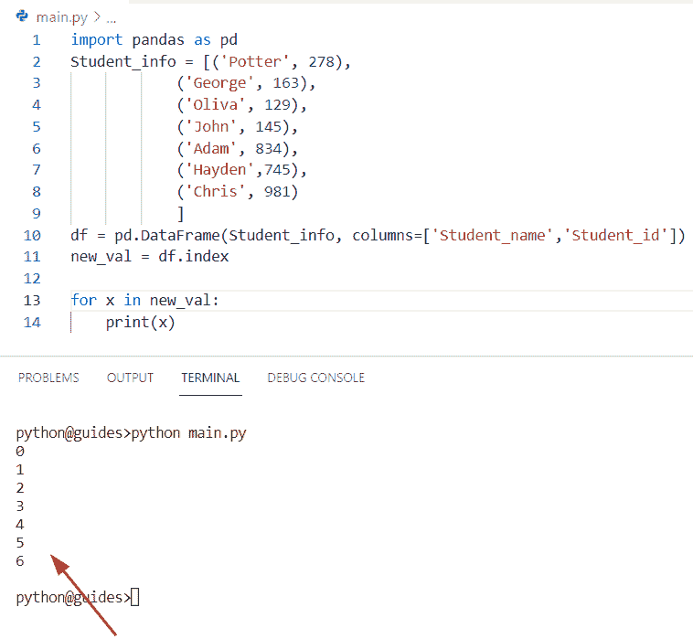
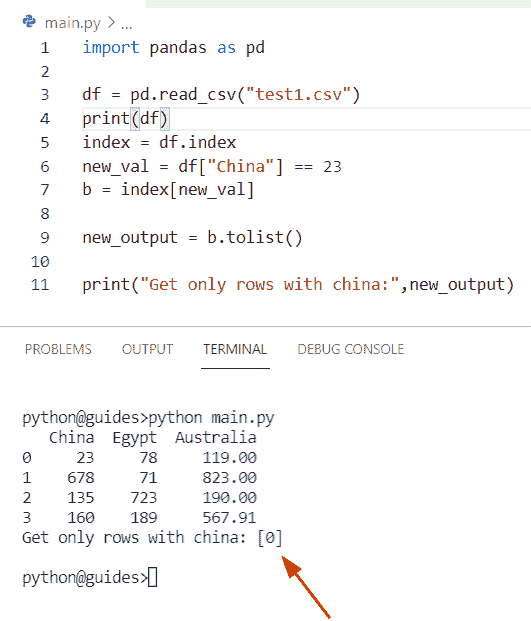
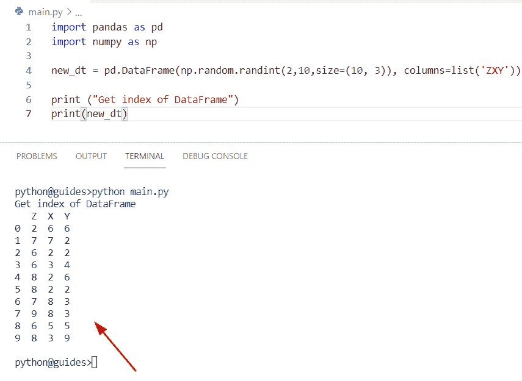
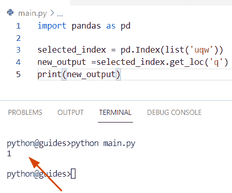
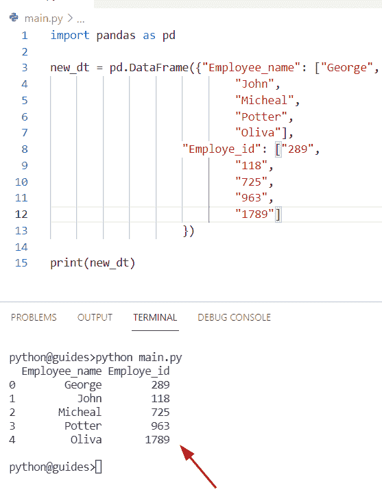
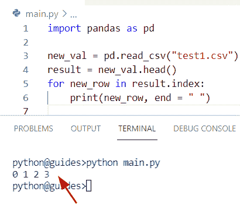
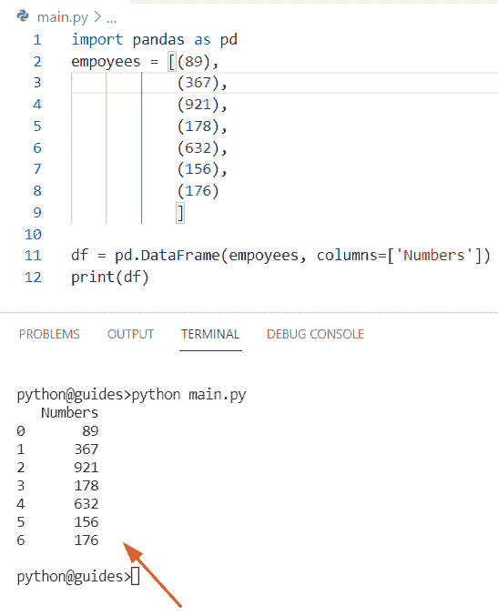
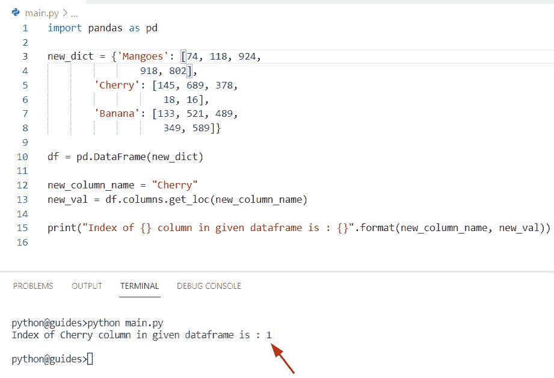
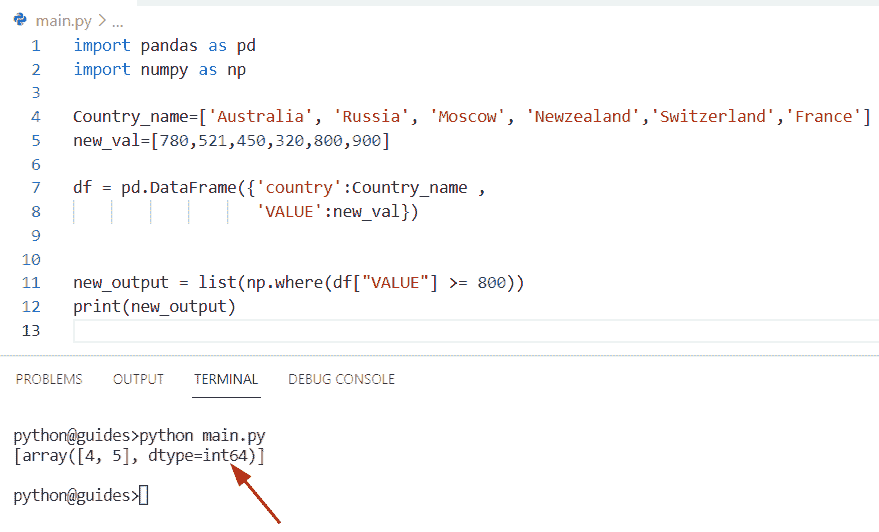
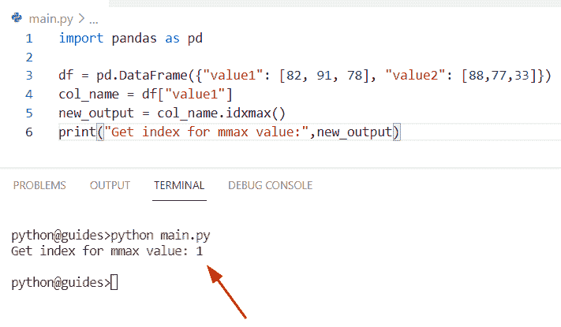

# 获取熊猫 Python 索引

> 原文：<https://pythonguides.com/get-index-pandas-python/>

[](https://sharepointsky.teachable.com/p/python-and-machine-learning-training-course)

在这个[熊猫](https://pythonguides.com/pandas-in-python/)教程中，我们将学习如何使用 Python 获得熊猫数据帧中的**索引。此外，我们将涵盖这些主题。**

*   查找索引熊猫数据框
*   获取行索引熊猫数据帧
*   获取熊猫数据框的索引值
*   获取熊猫数据框的索引列
*   Python 熊猫在哪里获得索引
*   获取最大值熊猫 Python 的索引

目录

[](#)

*   [获取索引熊猫 Python](#Get_index_Pandas_Python "Get index Pandas Python")
    *   [另一个获取数据帧中行索引的例子](#Another_example_to_get_the_index_of_rows_in_a_DataFrame "Another example to get the index of rows in a DataFrame")
*   [查找索引熊猫数据帧](#Find_index_Pandas_DataFrame "Find index Pandas DataFrame")
    *   [如何找到熊猫数据帧的索引](#How_to_find_the_index_of_a_Pandas_DataFrame "How to find the index of a Pandas DataFrame")
*   [获取行索引熊猫数据帧](#Get_row_index_Pandas_DataFrame "Get row index Pandas DataFrame")
    *   [获取熊猫数据帧的行索引](#Get_row_index_of_Pandas_DataFrame "Get row index of Pandas DataFrame")
*   [获取指数值熊猫数据帧](#Get_index_values_Pandas_DataFrame "Get index values Pandas DataFrame")
*   [获取索引栏熊猫数据框](#Get_index_column_Pandas_DataFrame "Get index column Pandas DataFrame")
*   [Python 熊猫在哪里得到索引](#Python_Pandas_get_index_where "Python Pandas get index where")
*   [获取最大值熊猫 Python 的索引](#Get_index_of_max_value_Pandas_Python "Get index of max value Pandas Python")

## 获取索引熊猫 Python

*   在本期节目中，我们将讨论如何在 Python 中**获取熊猫数据帧的索引。**
*   通过使用 `DataFrame.index` 方法，我们可以很容易地得到给定数据帧的索引值。这个方法允许你访问熊猫数据帧的索引，它总是返回一个 index 类型的对象。

**语法:**

以下是**数据帧的语法。索引()**方法

```py
DataFrame.index
```

> **注意:**该方法不采用任何参数，默认返回一个索引值，索引值从 `0` 开始。

**举例:**

让我们创建一个例子，并检查如何获得数据帧中的索引

```py
import pandas as pd
Student_info = [('Potter', 278),
            ('George', 163),
            ('Oliva', 129),
            ('John', 145),
            ('Adam', 834),
            ('Hayden',745),
            ('Chris', 981)
            ]
df = pd.DataFrame(Student_info, columns=['Student_name','Student_id'])
new_val = df.index

for x in new_val:
    print(x)
```

在上面的程序中，我们有一个带有默认索引的数据帧，因为没有指定索引值，所以默认范围从 0 开始。

在本例中，我们首先创建了一个元组列表，然后声明了一个 DataFrame 对象，其中我们指定了列名**‘学生姓名’**和**‘学生 id’**。

一旦您将打印**‘x’**,那么输出将显示数据帧的索引值。

你可以参考下面的截图来获取索引值



Get index Pandas Python

### 另一个获取数据帧中行索引的例子

在本例中，我们将讨论如何获取数据帧中特定行的索引。

为了完成这个任务，假设我们有一个列**【中国】**，它在索引 0 处有**【23】**，并且没有其他位置，则存储**【23】**的所有行的索引列表是**【0】**。

**源代码:**

```py
import pandas as pd

df = pd.read_csv("test1.csv")
print(df)
index = df.index
new_val = df["China"] == 23
b = index[new_val]

new_output = b.tolist()

print("Get only rows with china:",new_output)
```

在上面给出的代码中，我们首先导入了一个 pandas 模块，然后创建了一个 DataFrame，我们必须在其中分配一个 CSV 文件。一旦您将打印**‘df’**，那么输出将显示 CSV 文件的内容。

现在使用 `DataFrame.index` 方法获取 Pandas 数据帧中特定行的索引。

下面是以下给定代码的执行过程



Get index Pandas Python

阅读:[计算熊猫数据帧中的行数](https://pythonguides.com/count-rows-in-pandas-dataframe/)

## 查找索引熊猫数据帧

*   在这里，我们可以看到如何找到熊猫数据帧中元素的索引。
*   在这个例子中，我们创建了一个 numpy 随机函数，其中我们指定了一个起始值和结束值。创建 DataFrame 对象时，它返回一个索引位置列表。

**源代码:**

```py
import pandas as pd
import numpy as np

new_dt = pd.DataFrame(np.random.randint(2,10,size=(10, 3)), columns=list('ZXY'))

print ("Get index of DataFrame")
print(new_dt)
```

下面是以下给定代码的实现



Find index Pandas DataFrame

阅读:[如何删除熊猫](https://pythonguides.com/delete-a-column-in-pandas/)中的一个栏目

### 如何找到熊猫数据帧的索引

通过使用熊猫。Index.get_loc 方法我们可以执行这个特定的任务并返回一个索引位置列表。

**语法:**

下面是熊猫的句法。Index.get_loc 方法

```py
Index.get_loc(key, method=None, tolerance=None
```

*   它由几个参数组成
    *   **键:**该参数指定标签
    *   **方法:**这是一个可选参数，默认情况下它的值是 None。
    *   **容差:**不精确匹配与索引值的最大距离将是整数或浮点数。

**举例:**

```py
import pandas as pd

selected_index = pd.Index(list('uqw'))
new_output =selected_index.get_loc('q')
print(new_output)
```

在上面的代码中，我们首先导入了一个 pandas 库，然后创建了一个 dataframe，并在其中分配了一个字符串值**‘uqw’**。现在我们要显示**【q】**的具体指标值。

为了完成这个任务，我们使用了 `Pandas.index.get_loc()` 方法的概念。这种方法将帮助用户找到数据帧的特定索引值。

下面是以下代码的截图



Find index Pandas DataFrame

阅读: [Python 熊猫写数据帧到 Excel](https://pythonguides.com/python-pandas-write-dataframe-to-excel/)

## 获取行索引熊猫数据帧

*   这里我们可以看到如何从 Pandas DataFrame 中获取行索引值。
*   让我们创建一个简单的数据帧，其中我们已经分配了字符串值，它可以在两个方法上匹配。
*   在这个程序中，我们创建了一个简单的数据框架，在其中我们分配了一个列和值列表。一旦您将打印**‘new _ dt’**，那么输出将显示**【雇员姓名】**和**【雇员 id】**的索引值。

**源代码:**

```py
import pandas as pd

new_dt = pd.DataFrame({"Employee_name": ["George", 
                            "John", 
                            "Micheal", 
                            "Potter", 
                            "Oliva"], 
                    "Employe_id": ["289",
                            "118",
                            "725",
                            "963",
                            "1789"]
                    })

print(new_dt)
```

下面是以下给定代码的实现



Get row index Pandas DataFrame

### 获取熊猫数据帧的行索引

通过迭代列，我们可以执行这个特定的任务。在这种方法中，我们将分析真实数据集 `"test1.csv"` 。现在我们需要得到熊猫数据帧的索引。

让我们了解并讨论如何获得行索引值

**举例:**

```py
import pandas as pd

new_val = pd.read_csv("test1.csv")
result = new_val.head()
for new_row in result.index:
	print(new_row, end = " ")
```

下面是以下给定代码的输出



Get row index Pandas DataFrame

阅读: [Python 熊猫数据帧 Iterrows](https://pythonguides.com/pandas-dataframe-iterrows/)

## 获取指数值熊猫数据帧

*   让我们看看如何从 Pandas 数据帧中获取索引值。
*   现在让我们举一个例子，通过迭代列名来解决这个问题。为了完成这项任务，我们首先创建了一个 DataFrame 对象**‘df’**，在其中我们分配了一个特定的列名**‘数字’**。一旦你打印了**t‘df’**，那么输出将显示一个数据帧的**‘Numbers’**值索引。

**源代码:**

```py
import pandas as pd
empoyees = [(89),
            (367),
            (921),
            (178),
            (632),
            (156),
            (176)
            ]

df = pd.DataFrame(empoyees, columns=['Numbers'])
print(df)
```

你可以参考下面的截图来获取指数值



Get index values Pandas DataFrame

阅读: [Python 将数据帧转换为列表](https://pythonguides.com/python-convert-dataframe-to-list/)

## 获取索引栏熊猫数据框

*   在这个程序中，我们将讨论如何获得索引列熊猫数据帧。
*   通过使用熊猫。Index.get_loc 方法我们可以执行这个特定的任务并返回一个索引位置列表。
*   在 Python **中，Pandas.index.get_loc** 方法返回整数位置，该方法适用于已排序和未排序的索引。如果该值不存在，它将检查条件，然后只有在索引值已排序的情况下，它才会将下一个值返回到传递的值。

**语法:**

下面是熊猫的句法。index.get_loc()方法

```py
Index.get_loc(key, method=None, tolerance=None)
```

**源代码:**

```py
import pandas as pd

new_dict = {'Mangoes': [74, 118, 924,
				918, 802],
		'Cherry': [145, 689, 378,
					18, 16],
		'Banana': [133, 521, 489,
					349, 589]}

df = pd.DataFrame(new_dict)

new_column_name = "Cherry"
new_val = df.columns.get_loc(new_column_name)

print("Index of {} column in given dataframe is : {}".format(new_column_name, new_val))
```

在上面的例子中，我们已经导入了 Pandas 库，然后创建了一个字典，我们必须在其中分配键值对元素。

现在在这个例子中，我们将把一个关键元素看作一个列名，然后声明一个 DataFrame 对象。

现在，我想显示特定列的索引值。首先，我创建了一个变量**‘new _ column _ name’**，并指定一个列名**“Cherry”**。

下面是以下代码的截图



Get index column Pandas DataFrame

阅读:[熊猫删除栏目](https://pythonguides.com/pandas-delete-column/)

## Python 熊猫在哪里得到索引

*   让我们看看如何使用 where 函数获得熊猫的索引值。
*   在 Python Pandas 中， `where()` 方法用于检查 Pandas 数据帧，它接受一个条件作为参数。它将检查熊猫数据帧中每个值的条件，如果它不存在于数据帧中，那么它将被替换为 nan 值。

**语法:**

下面是 `DataFrame.where()` 方法的语法

```py
DataFrame.where
               (
                cond,
                other=nan,
                inplace=False,
                axis=None,
                level=None,
                errors='raise',
                try_cast=Nodefault.no_default
               )
```

**源代码:**

```py
import pandas as pd
import numpy as np

Country_name=['Australia', 'Russia', 'Moscow', 'Newzealand','Switzerland','France']
new_val=[780,521,450,320,800,900]

df = pd.DataFrame({'country':Country_name ,
                   'VALUE':new_val})

new_output = list(np.where(df["VALUE"] >= 800))
print(new_output)
```

在上面的例子中，我们创建了两个列表**‘Country _ name’**和**‘new _ val’**，同时我们声明了一个 DataFrame 对象**‘df’**，我们在其中指定了列名。

现在我们必须在函数中使用它们来获得小于 800 的索引值。

下面是以下给定代码的执行过程



Python Pandas get index where

阅读:[如何将熊猫数据帧转换成字典](https://pythonguides.com/how-to-convert-pandas-dataframe-to-a-dictionary/)

## 获取最大值熊猫 Python 的索引

*   在本期节目中，我们将讨论如何在熊猫 Python 中获取最大值的索引。
*   在 Python 中，Pandas `DataFrame.idmax()` 方法用于获取给定轴上第一次出现的最大值的索引，该方法将始终返回最大值的索引，如果 Pandas 数据帧中的列或行为空，则它将引发值错误。

**语法:**

下面是 DataF `rame.idmax()` 方法的语法

```py
DataFrame.idxmax
                (
                axis=0,
                skipna=True
               )
```

*   它由几个参数组成
    *   **轴:**如果轴的值是 1，那么它将代表列的方向。如果轴=0，那么它将代表行。
    *   **skipna:** 默认情况下，其值为“真”，该参数代表布尔值(真或假)，不包括所有缺失值和 nan 值。

**举例:**

```py
import pandas as pd

df = pd.DataFrame({"value1": [82, 91, 78], "value2": [88,77,33]})
col_name = df["value1"]
new_output = col_name.idxmax()
print("Get index for mmax value:",new_output)
```

在上面的例子中，我们考虑了一个数据帧，并通过使用 `DataFrame.idxmax()` 方法获得每一列中最大值的索引。

在这个程序中，我们指定了列名**“value 1”**，它将获得最大值的索引。

下面是以下给定代码的输出。



Get the index of max value Pandas Python

你可能也喜欢读下面的文章。

*   [蟒蛇熊猫掉行](https://pythonguides.com/python-pandas-drop-rows-example/)
*   [Python 熊猫中的 group by](https://pythonguides.com/groupby-in-python-pandas/)
*   [Python 熊猫中的交叉表](https://pythonguides.com/crosstab-in-python-pandas/)
*   [Python 数据帧到 CSV](https://pythonguides.com/python-dataframe-to-csv/)
*   [检查 Python Pandas 中的数据帧是否为空](https://pythonguides.com/check-if-dataframe-is-empty-in-python-pandas/)
*   [如何使用熊猫 drop()函数](https://pythonguides.com/pandas-drop/)

在这个 Python Pandas 教程中，我们已经学习了如何使用 Python 获得 Pandas 数据帧中的**索引。此外，我们已经讨论了这些主题。**

*   查找索引熊猫数据框
*   获取行索引熊猫数据帧
*   获取熊猫数据框的索引值
*   获取熊猫数据框的索引列
*   Python 熊猫在哪里获得索引
*   获取最大值熊猫 Python 的索引

[Bijay Kumar](https://pythonguides.com/author/fewlines4biju/)

Python 是美国最流行的语言之一。我从事 Python 工作已经有很长时间了，我在与 Tkinter、Pandas、NumPy、Turtle、Django、Matplotlib、Tensorflow、Scipy、Scikit-Learn 等各种库合作方面拥有专业知识。我有与美国、加拿大、英国、澳大利亚、新西兰等国家的各种客户合作的经验。查看我的个人资料。

[enjoysharepoint.com/](https://enjoysharepoint.com/)[](https://www.facebook.com/fewlines4biju "Facebook")[](https://www.linkedin.com/in/fewlines4biju/ "Linkedin")[](https://twitter.com/fewlines4biju "Twitter")