# 如何在 Python 中从列表中获取唯一值

> 原文：<https://pythonguides.com/get-unique-values-from-list-python/>

[](https://sharepointsky.teachable.com/p/python-and-machine-learning-training-course)

在这个 [Python 教程](https://pythonguides.com/python-download-and-installation/)中，我们将学习**如何在 Python** 中从列表中获取唯一值。此外，我们将涵盖这些主题。

*   从 Python 熊猫列表中获取唯一值
*   从列表 Python 中获取唯一值
*   从嵌套列表 Python 中获取唯一值
*   从字典 Python 列表中获取唯一值
*   Python 从对象列表中获取唯一值
*   从列表 Python 中移除唯一值
*   从两个列表 Python 中获取唯一值
*   使用索引从列表 Python 中获取唯一值
*   从列表列表中获取唯一值 Python
*   从字符串列表中获取唯一值 Python

目录

[](#)

*   [Python 从列表中获取唯一值](#Python_Get_unique_values_from_list "Python Get unique values from list")
*   [通过使用 set()方法](#By_using_set_method "By using set() method")
*   [通过使用有序字典()](#By_using_ordered_dict "By using ordered dict()")
*   [通过使用 enumerator()方法](#By_using_enumerator_method "By using enumerator() method")
*   [从 Python 熊猫列表中获取唯一值](#Get_unique_values_from_list_Python_Pandas "Get unique values from list Python Pandas")
*   [从列表 Python 中获取唯一值](#Get_unique_values_from_list_Python "Get unique values from list Python")
*   [从嵌套列表 Python 中获取唯一值](#Get_unique_values_from_nested_list_Python "Get unique values from nested list Python")
*   [从 Python 字典列表中获取唯一值](#Get_unique_values_from_list_of_dictionary_Python "Get unique values from list of dictionary Python")
*   [Python 从对象列表中获取唯一值](#Python_get_unique_values_from_list_of_objects "Python get unique values from list of objects")
*   [从列表 Python 中移除唯一值](#Remove_unique_values_from_list_Python "Remove unique values from list Python")
*   [从两个列表中获取唯一值 Python](#Get_unique_values_from_two_list_Python "Get unique values from two list Python")
*   [使用索引](#Get_unique_value_from_list_Python_using_index "Get unique value from list Python using index")从列表 Python 中获取唯一值
*   [从列表列表中获取唯一值 Python](#Get_unique_values_from_list_of_lists_Python "Get unique values from list of lists Python")
*   [从字符串列表中获取唯一值 Python](#Get_unique_values_from_list_of_strings_Python "Get unique values from list of strings Python")

## Python 从列表中获取唯一值

*   在这一节中，我们将讨论如何使用 Python 从列表中获取唯一值。
*   在 Python 中，列表是一些元素，存储在 **[]** 括号中。当我们在列表中插入元素时，列表中必须有重复的值。所以现在我们的任务是找到给定列表中的唯一值。
*   例如，假设我们有一个包含整数**【5，6，4，5】**的 Python 列表。现在我们必须找到唯一的值，正如你在给定列表中看到的那样**‘5’**出现了两次。
*   通过使用 Python，有多种方法可用于从列表中获取唯一值。
    *   通过使用 set()方法
    *   通过使用有序字典()
    *   通过使用 enumerator()方法

**例子:**

## 通过使用 set()方法

*   在 Python 中，set 方法只存储唯一值，当我们应用函数 **'set()'** 时，它会自动从列表中删除重复值。在 python 中，集合是一个无序的元素集合，我们可以很容易地从中删除或更新值。

```py
new_lis = [14,25,87,14,78,25,25]

new_val = set(new_lis)
z=list(new_val)

print("Unique values:",z)
```

在上面的例子中，我们创建了一个列表**‘new _ lis’**，并为其分配整数值。然后，我们通过应用 `set()` 函数从列表中提取唯一值。

现在声明一个变量**‘z’**并使用 `list()` 函数。一旦您将打印**‘z’**，那么输出将显示唯一的值。

下面是以下给定代码的实现

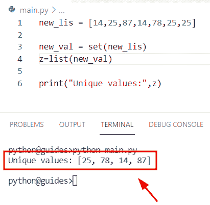

Python Get unique values from a list

## 通过使用有序字典()

*   在这里，我们可以通过使用 Python 轻松地使用集合模块中的 `ordered.dict()` 方法。在本例中，我们必须创建一个列表**‘新值’**，然后使用带有 from `keys()` 函数的 `OrderedDict.fromkeys()` 方法。

**举例:**

```py
from collections import OrderedDict

new_values = [16, 11, 11, 10, 45, 98, 52, 41]

new_result = list(OrderedDict.fromkeys(new_values))
print("Unique values:",new_result)
```

下面是以下给定代码的输出

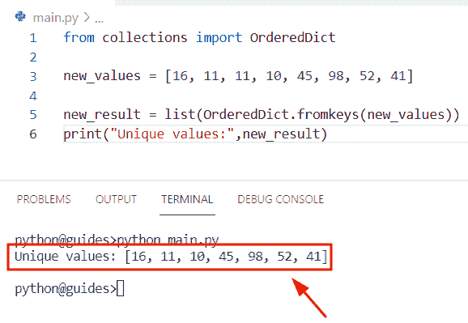

Python Get unique values from a list

读取 [Python 查找列表](https://pythonguides.com/python-find-index-of-element-in-list/)中元素的索引

## 通过使用 enumerator()方法

在 Python 中， `enumerator()` 方法用于迭代对象和插入计数器项。这是 Python 中的一个内置函数，对象可以在循环中使用并转换成列表。

**源代码:**

```py
new_val = [24,89,75,89,24,189,75,178]  

output = [i for z,i in enumerate(new_val) if i not in new_val[:z]]  
print("Unique value:",output) 
```

在上面的程序中，我们初始化了包含整数值和重复值的列表。现在使用 `enumerator()` 函数，并在该方法中将列表理解作为参数传递，该参数将返回唯一值列表。

下面是以下给定代码的实现

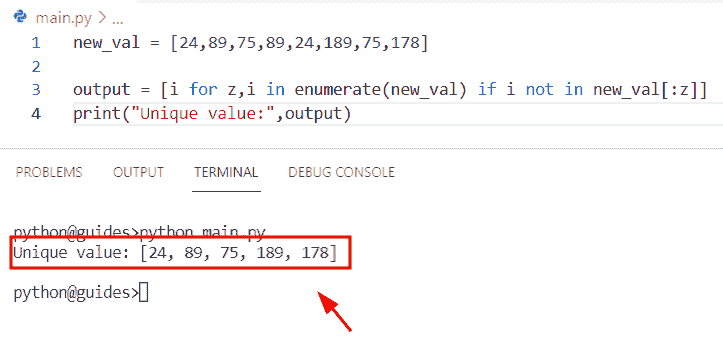

Python Get unique values from a list

阅读[如何在 Python 中反转列表](https://pythonguides.com/reverse-a-list-in-python/)

## 从 Python 熊猫列表中获取唯一值

*   在这个程序中，我们将讨论如何使用 Python 熊猫从列表中获取唯一值。
*   通过使用 `pd.drop_duplicates()` 函数我们可以解决这个问题。为了完成这项任务，我们将导入 Pandas 库，然后应用能够存储各种数据类型的 pd.series()。我们也可以通过使用**‘序列’**方法将列表转换成序列。
*   在 Python Pandas 中， `drop_duplicate()` 函数用于从序列中删除重复值并返回唯一值。

**语法:**

下面是 drop_duplicate()函数的语法

```py
Dataframe.drop_duplicates
                         (
                          subset=None,
                          keep='first',
                          inplace='False',
                          ignore_index=False
                         )
```

**举例:**

```py
import pandas as pd

new_lis = [14, 67, 23, 67, 164, 754, 943, 14]
result= pd.Series(new_lis).drop_duplicates().tolist()
print("Unique values:",result)
```

你可以参考下面的截图

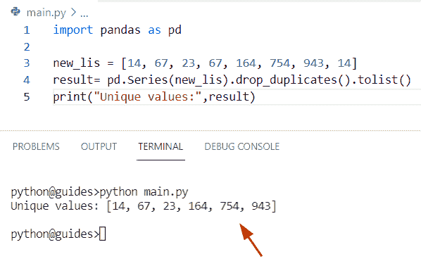

Get unique values from list Python Pandas

正如您在屏幕截图中看到的，输出显示了给定列表中的唯一值。

读取 [Python 将数据帧转换为列表](https://pythonguides.com/python-convert-dataframe-to-list/)

## 从列表 Python 中获取唯一值

*   在本节中，我们将讨论如何使用 Python 从列表中找到唯一值。
*   为了执行这个特定的任务，我们将使用 `dict.fromkeys()` 方法的概念。在 Python 中， `dict.fromkeys()` 方法用于根据给定值声明一个新字典。现在，我们必须从列表中删除重复值，并将唯一值存储到列表中。
*   通过使用 `list()` 方法，我们可以很容易地得到新的列表，并将**‘new _ result’**指定为参数。

**语法:**

下面是 `dict.fromkeys()` 方法的语法

```py
dictionary.fromkeys
                   (
                    sequence
                    [,
                    value
                    ]
                    )
```

*   它由几个参数组成
    *   **序列:**该参数表示将要使用的元素列表。
    *   **value:** 可选参数，指定字典的各个值。

**举例:**

让我们举一个例子，看看如何从 Python 列表中获取唯一值

```py
new_values = [45,67,15,67,23,15]

new_result = dict.fromkeys(new_values)
b= list(new_result)
print("Unique values:",b)
```

下面是以下代码的截图

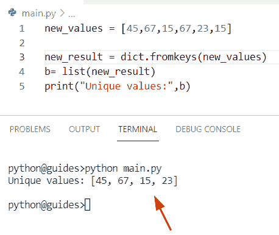

Get unique values from list Python

阅读 [Python 列表字典](https://pythonguides.com/python-dictionary-of-lists/)

## 从嵌套列表 Python 中获取唯一值

*   这里我们可以看到如何使用 Python 从嵌套列表中获取唯一值。
*   通过使用 `frozenset()` 方法，我们可以很容易地从嵌套列表中获得唯一值。在 Python 中， `frozenset()` 用于返回一个不可变的对象。集合的元素可以随时修改，如果提供了参数，它将检查条件，然后创建 frozenset。

**语法:**

下面是 `frozenset()` 方法的语法

```py
frozenset
         (
          [
           iterable
           ]
           )
```

*   它只包含一个参数
    *   **iterable:** 该参数表示类似列表的可迭代对象。

**举例:**

让我们举个例子来理解一下 `frozenset()` 方法的工作原理

```py
new_list=[[43,14],[784,821],[77,65],[65,77],[145,765],[43,14]]

new_val = set(frozenset(i) for i in new_list)
result = [list(i) for i in new_val]
print("Unique values from list:",result)
```

下面是以下代码的截图

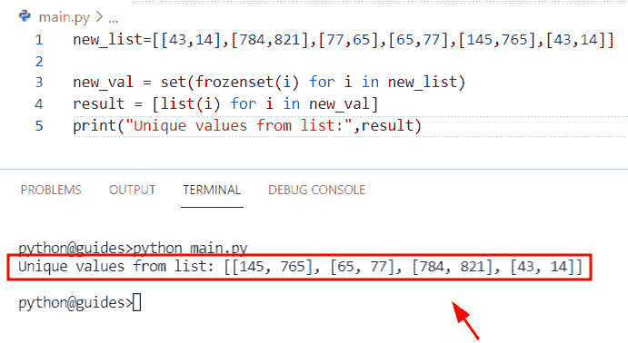

Get unique values from nested list Python

阅读 [Python 从两个列表中创建了一个字典](https://pythonguides.com/python-creates-a-dictionary-from-two-lists/)

## 从 Python 字典列表中获取唯一值

*   在本节中，我们将讨论如何使用 Python 从字典列表中获取唯一值。
*   为了执行这个特定的任务，我们将使用 list 函数，在这个方法中，我们将应用 list comprehension 方法作为参数。

**源代码:**

```py
new_dict = [{'Micheal' : 432, 'George' : 675}, {'William' : 432, 'John' : 178}, {'William' : 432, 'Smith':105}]

final_output = list(set(value for dic in new_dict for value in dic.values()))
print("Unique values:",final_output)
```

在上面的代码中，我们创建了一个字典列表，然后初始化了一个变量**‘final _ output**’,在这个变量中，我们为列表赋值，它可以迭代字典值。

现在通过使用 `dic.values()` 方法转换成一个列表。打印“最终输出”后，结果将显示唯一值。

下面是以下给定代码的实现

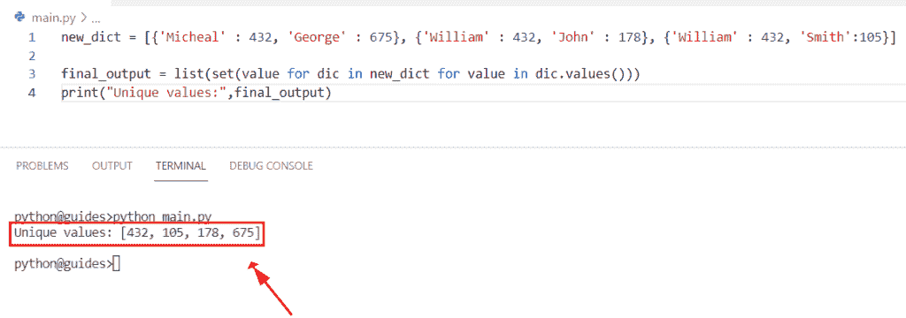

Get unique values from a list of dictionary Python

读取 [Python 字符串以列出](https://pythonguides.com/python-string-to-list/)

## Python 从对象列表中获取唯一值

*   在本节中，我们将讨论如何使用 Python 从对象列表中获取唯一值。
*   通过使用 Python `set()` 方法，我们可以轻松地执行这个特定的任务。在 Python 中，set 方法只存储唯一值，它会自动从列表中删除重复值。
*   首先，我们将创建一个列表，并为其分配整数和字符串值。然后声明一个变量**‘result’**，我们将在其中应用 `set()` 方法，在这个函数中，我们将传递 list**‘new _ values’**作为参数。

**举例:**

```py
new_values = [67,117,67,'b','z','b',25]

result = set(new_values)
z=list(result)

print("Unique values:",z)
```

你可以参考下面的截图

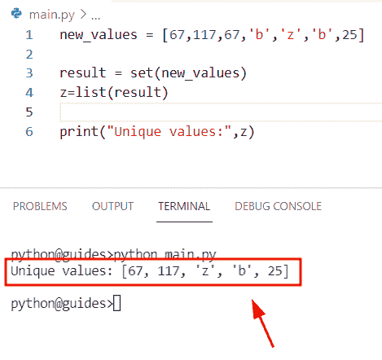

Python get unique values from a list of objects

正如您在屏幕截图中看到的，输出显示了列表对象的唯一值

通过列表读取 [Python 循环](https://pythonguides.com/python-loop-through-a-list/)

## 从列表 Python 中移除唯一值

*   在本期节目中，我们将讨论如何使用 Python 从列表中移除唯一值。
*   在这个例子中，我们将使用列表理解和计数方法的概念。在 Python 中， `count()` 方法用于返回对象在列表中出现的次数。

**语法:**

下面是 Python List count()方法的语法

```py
list.count
          (
           obj
          )
```

**源代码:**

```py
new_list=[46,21,69,69,14,76,13,13,66,19,10,10]

final_output=[i for i in new_list if new_list.count(i)>1]
print("Remove unique values from list:",final_output)
```

下面是以下给定代码的执行过程

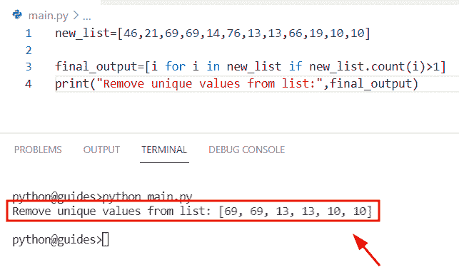

Remove unique values from list Python

正如您在屏幕截图中看到的，输出显示了更新后的列表

也可阅读， [Python 将字典转换为列表](https://pythonguides.com/python-convert-dictionary-to-list/)

## 从两个列表中获取唯一值 Python

*   这里我们可以看到如何使用 Python 从两个列表中获取唯一值。
*   为了解决这个问题，我们将应用 `set()` 函数。在 Python 中，set()函数用于从给定列表中获取唯一值。
*   在这个程序中，我们将创建两个列表**‘lis 1’**和**‘lis 2’**。之后，我们将声明一个变量**‘z’**和**‘m’**，在其中我们分配了一个列表并设置了一个函数来获取唯一值。

**举例:**

```py
lis1 = [23,41,23,78,94,41]
lis2 = [78,109,78,56,234,109]

z=list(set(lis1) - set(lis2))
m=list(set(lis2) - set(lis1))
print("Unique values from two lists:",z,m)
```

下面是以下代码的截图

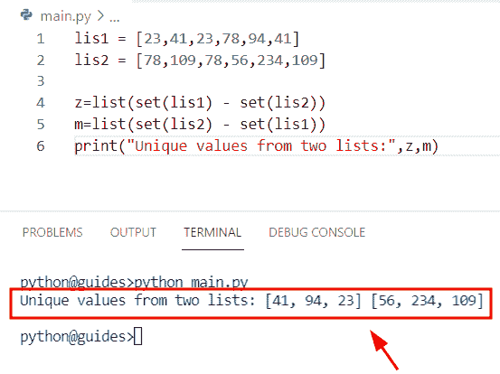

Get unique values from two lists Python

正如您在屏幕截图中看到的，输出显示了两个列表中的唯一值

读取 [Python 元组排序列表](https://pythonguides.com/python-sort-list-of-tuples/)

## 使用索引从列表 Python 中获取唯一值

*   为了从带有索引号的列表中获得唯一值，我们可以很容易地使用 Python `list.index()` 方法的概念。
*   为了首先执行这个特定的任务，我们将创建一个列表并为其分配整数值。之后，我们将使用列表理解方法，它将迭代列表值。

**举例:**

```py
new_list = [2,6,9,2,9,4]

final_output = [new_list.index(i) for i in set(new_list)]
print("Unique values get index from list:",final_output)
```

下面是以下给定代码的执行过程

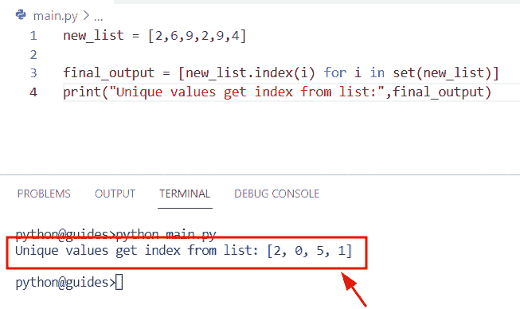

Get unique value from list Python using index

正如您在屏幕截图中看到的，输出显示了唯一值的索引号

读取 [Python 字典值以列出](https://pythonguides.com/python-dictionary-values-to-list/)

## 从列表列表中获取唯一值 Python

*   在本节中，我们将讨论如何使用 Python 从列表列表中获取唯一值。
*   通过使用列表理解方法，我们可以解决这个问题。在本例中，我们必须通过列出对象并获取唯一值来迭代值。在 Python 中，列表理解是从给定列表声明新列表的最简单方法。

**举例:**

让我们举一个例子，看看如何在 Python 中从列表列表中获取唯一值

```py
list_values = [[74,35,74], [189,74,55], [35,74,128]]

new_output = {z for i in list_values for z in i}
print("Unique values from list of lists:",new_output)
```

在上面的代码中，我们创建了一个列表**‘list _ values’**，然后在**‘list _ values’**上迭代**‘I’**变量。一旦您将打印**‘new _ output’**，那么结果将显示来自列表列表的唯一值。

你可以参考下面的截图

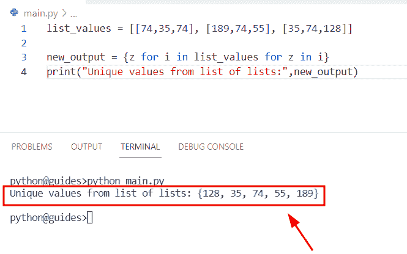

Get unique values from a list of lists Python

请查看， [Python NumPy 列举示例](https://pythonguides.com/python-numpy-to-list/)

## 从字符串列表中获取唯一值 Python

*   在这个程序中，我们将讨论如何使用 Python 从字符串列表中获取唯一值。
*   为了执行这个特定的任务，我们可以通过使用 Python 轻松地使用集合模块中的 `ordered.dict()` 方法。之后，我们将创建一个列表，并为其分配字符串值。
*   现在声明一个变量**‘Final _ output’**，在这个变量中使用 list 函数并传递 `OrderedDict.fromkeys()` 方法。它将帮助用户从 Python 列表中获取唯一值。

**举例:**

```py
from collections import OrderedDict

list_values = ['John', 'Micheal', 'Smith', 'John', 'George', 'Micheal','William' , 'Smith']

Final_output= list(OrderedDict.fromkeys(list_values))
print("Unique values from list of strings:",Final_output)
```

下面是以下给定代码的实现

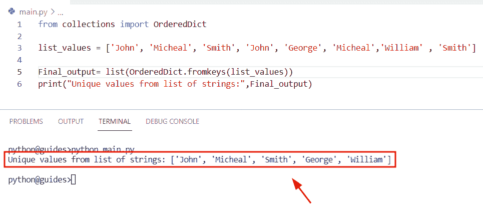

Get unique values from a list of strings Python

相关 Python 教程:

*   [添加字符串到列表 Python](https://pythonguides.com/add-string-to-list-python/)
*   [Python 连接列表与示例](https://pythonguides.com/python-concatenate-list/)
*   [检查一个列表是否存在于另一个列表中 Python](https://pythonguides.com/check-if-a-list-exists-in-another-list-python/)
*   [Python 向 CSV 写列表](https://pythonguides.com/python-write-a-list-to-csv/)
*   [使用 if-else 理解 Python 列表](https://pythonguides.com/python-list-comprehension-using-if-else/)

在这个 Python 教程中，我们学习了**如何使用 Python 从列表**中获取唯一值。此外，我们将涵盖这些主题。

1.  从 Python 熊猫列表中获取唯一值
2.  从列表 Python 中获取唯一值
3.  从嵌套列表 Python 中获取唯一值
4.  从字典 Python 列表中获取唯一值
5.  Python 从对象列表中获取唯一值
6.  从列表 Python 中移除唯一值
7.  从两个列表 Python 中获取唯一值
8.  使用索引从列表 Python 中获取唯一值
9.  从列表列表中获取唯一值 Python
10.  从字符串列表中获取唯一值 Python

[Bijay Kumar](https://pythonguides.com/author/fewlines4biju/)

Python 是美国最流行的语言之一。我从事 Python 工作已经有很长时间了，我在与 Tkinter、Pandas、NumPy、Turtle、Django、Matplotlib、Tensorflow、Scipy、Scikit-Learn 等各种库合作方面拥有专业知识。我有与美国、加拿大、英国、澳大利亚、新西兰等国家的各种客户合作的经验。查看我的个人资料。

[enjoysharepoint.com/](https://enjoysharepoint.com/)[](https://www.facebook.com/fewlines4biju "Facebook")[](https://www.linkedin.com/in/fewlines4biju/ "Linkedin")[](https://twitter.com/fewlines4biju "Twitter")