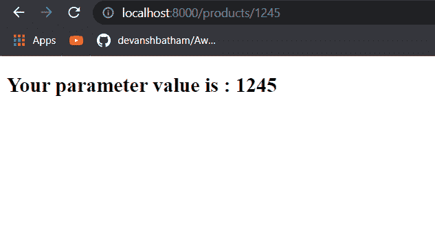
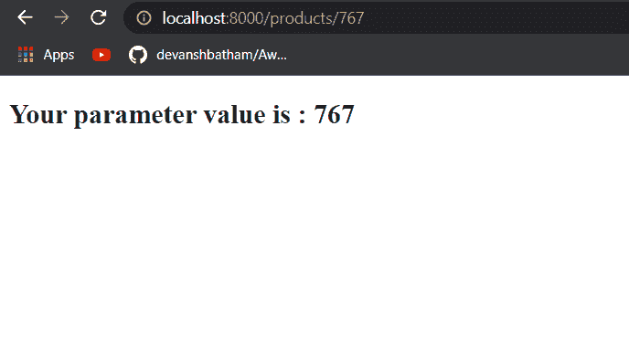
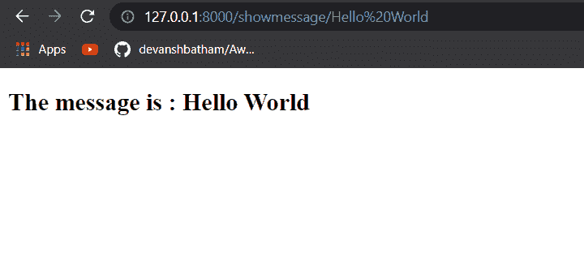
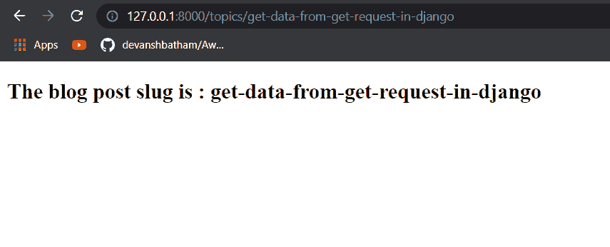

# 获取 Django 中的 URL 参数

> 原文：<https://pythonguides.com/get-url-parameters-in-django/>

[](https://sharepointsky.teachable.com/p/python-and-machine-learning-training-course)

在 Django 中，您还可以将参数作为 URL 的一部分进行传递。在这个 Django 教程中，您将学习如何在 Django 中获取 URL 参数。

在各种 web 应用程序中，您可能会看到一些以参数结尾的 URL。例如，看看下面的 URL:

```py
https://www.shop.tsinfo.com/products/12
```

上述 URL 获取对应于产品 id(即 12)的产品页面。这意味着 12 是一个 URL 参数，结果根据这个值显示。

现在让我们学习一下如何在姜戈制作柠檬。

*   如何在 Django 中从 URL 获取参数
*   要查看的 Django URL 传递参数
*   模板中的 Django URL 参数
*   从 Django 示例中的 URL 获取参数
*   Django 路径转换器
*   Django URL 参数字符串
*   Django URL slug 参数

目录

[](#)

*   [如何在 Django 中从 URL 获取参数](#How_to_get_parameter_from_URL_in_Django "How to get parameter from URL in Django")
*   [Django URL 传递参数查看](#Django_URL_pass_parameter_to_view "Django URL pass parameter to view")
*   [模板中的 Django URL 参数](#Django_URL_parameters_in_template "Django URL parameters in template")
*   [从 Django 示例中的 URL 获取参数](#Get_parameters_from_URL_in_Django_example "Get parameters from URL in Django example")
*   [路径转换器 Django](#Path_converters_Django "Path converters Django")
*   [Django URL 参数字符串](#Django_URL_parameters_string "Django URL parameters string")
*   [Django URL slug 参数](#Django_URL_slug_parameter "Django URL slug parameter")

## 如何在 Django 中从 URL 获取参数

要从 URL 获取参数，您必须执行下面解释的步骤:

1.  在应用程序的 URLs 文件中创建一个路径并映射到视图，然后将参数传递给视图
2.  在视图中定义一个函数，该函数将接受参数并将参数传递给 Django 模板。
3.  设计 Django 模板来显示与传递的参数相对应的结果。

让我们在接下来的章节中简要讨论这些步骤。

## Django URL 传递参数查看

您可以使用路径转换器将 URL 参数从 URL 传递给视图。

但是，首先您必须创建一个路径并将其映射到一个视图。为此，您必须编辑应用程序的 `urls.py` 文件。示例 urls.py 文件如下所示:

```py
from django.urls import path
from . import views
urlpatterns = [
    path("URL endpoint">/<path converter: URL parmeter name>, view_name.function_name, name = "path name")
]
```

例如，如果请求的 URL 是:

```py
https://www.shop.tsinfo.com/products/12
```

*   那么“**产品**”将成为 URL 端点。
*   一个**路径转换器**定义了一个参数将存储哪种类型的数据。您可以将路径转换器与数据类型进行比较。在上面的例子中，路径转换器将是 `int` 。
*   在接下来的章节中，您将了解更多关于各种路径转换器的信息。
*   **URL 参数名称**将是您用来引用参数的名称。
*   `view_name` 将是处理请求的视图，function_name 是向指定的 URL 端点发出请求时将执行的函数。
*   **名称**将是您将要创建的路径的名称。

下一步是在 Django 模板中传递参数。

另外，请查看:[如何设置 Django 项目](https://pythonguides.com/setup-django-project/)

## 模板中的 Django URL 参数

首先，您必须创建一个 Django 模板，您将在其中呈现您的结果。要将 URL 参数传递给 Django 模板，必须在 Django 中编辑 `views.py` 文件。示例 view.py 文件如下所示:

```py
from django.shortcuts import render

def function_name(request, url_parameter):
    return render(request, 'Django Template', {url_parameter})
```

这是命中指定 URL 端点时将执行的函数。这个函数接受 URL 参数，并将其作为字典传递给 Django 模板。

在 Django 模板中，您可以接收参数并相应地显示结果。例如，您可以在下面的 Django 模板示例中看到如何获取参数。

```py
<!DOCTYPE html>
<html lang="en">
<head>
    <meta charset="UTF-8">
    <meta http-equiv="X-UA-Compatible" content="IE=edge">
    <meta name="viewport" content="width=device-width, initial-scale=1.0">
    <title>Products</title>
</head>
<body>
    <h2>Your parameter value is : {{URL parameter}}</h2>
</body>
</html>
```

通过这种方式，您可以从 URL 获取参数，并将其传递给 Django 模板。

您已经看到了在 Django 中获取 URL 参数的步骤，现在是时候看一个例子了。通过一个例子来理解它，你会对这个过程有一个更清晰的印象。

阅读: [Python Django vs Flask](https://pythonguides.com/python-django-vs-flask/)

## 从 Django 示例中的 URL 获取参数

在本节中，出于演示目的，我将使用我的本地主机地址。你可以用你网站的基本网址来改变它。

例如，如果 URL 是:

```py
http://localhost:8000/products/125
```

那么**产品**将是 URL 端点，而 `125` 将是 URL 参数。

首先，我必须编辑我的 URL 文件，如下所示:

```py
from django.urls import path
from . import views
urlpatterns = [
    path('',views.index),
    path('products/<int:id>', views.viewpara, name = 'view_products')
]
```

我已经创建了一个到**产品**端点的路径。我已经将路径转换器定义为 `int` ，以指定 URL 参数将是一个整数。

不要与名为**索引**的路径混淆。它只是一个指向我的基本 URL 的路径。

`views.viewpara` 是在 `views.py` 文件中定义的函数，当发出请求时将被执行。views.py 文件将是:

```py
from django.shortcuts import render
def index(request):
    return render(request, 'index.html')

def viewpara(request, para):
    return render(request, 'result.html', {'para' : para})
```

上述函数将从请求中接收参数。我已经将这个参数作为字典对象传递给了一个名为`result.html`的 Django 模板。

Django 模板如下所示:

```py
<!DOCTYPE html>
<html lang="en">
<head>
    <meta charset="UTF-8">
    <meta http-equiv="X-UA-Compatible" content="IE=edge">
    <meta name="viewport" content="width=device-width, initial-scale=1.0">
    <title>Products</title>
</head>
<body>
    <h2>Your parameter value is : {{id}}</h2>
</body>
</html>
```

这个 Django 模板将在发出请求时呈现。现在让我们看看输出:



Get URL parameters in Django

您可以看到传递给 URL 的参数值显示在 Django 模板中。如果我改变参数的值，结果也会改变:



How to get parameter from URL in Django

因此，您可能已经对在 Django 的 URL 中传递参数有了基本的了解。我将在接下来的章节中解释更多的例子。但在此之前，让我们了解一下 Django 的路径转换器。

阅读: [Python Django 获取管理员密码](https://pythonguides.com/python-django-get-admin-password/)

## 路径转换器 Django

Django 中的路径转换器指定了您试图通过 URL 作为参数发送的数据类型。在上面的例子中，我使用了 `int` path 转换器来传递整数值作为 URL 参数。

但是，您也可以使用其他内置路径转换器。下面是一些内置的路径转换器，您可以在定义 URL 参数时使用:

**int:** 可用于提供包括 0 在内的正整数值作为 URL 参数。例如，传递产品 id。

**str:**str 路径转换器可用于定义字符串参数，不包括“/”符号，并验证字符串是否为非空。例如，传递用户名或令牌。

**slug:** 由包含 ASCII 值的 slug 字符串组成，包括连字符和下划线运算符。你可能在博客或文章网站上看到过 slug 参数。

例如，URL**[【https://pythonguides.com/python-django-get/】](https://pythonguides.com/python-django-get/)**将在 slug 参数的帮助下重定向到特定的文章。在这个 URL 中， `python-django-get` 是 slug 参数。

uuid: 一个格式化的 uuid。如果要将 UUID 作为参数传递，可以使用这个路径转换器。一个 UUID 的例子是:`T3 123 e4567-e89b-12 D3-a456-4266141740`23。

**path:** 这个路径转换器由一个非空字符串组成，包括“/”符号，定义为传递一个路径作为参数。

`str` 和 `path` 的区别在于，如果你传递一个 path 参数给 str 转换器，它将在“/”符号处终止，你将无法发送完整的路径。

另一方面，在**路径**的情况下，包含“/”符号，并且成功传递整个路径值。

这些是 Django 的一些内置路径转换器。您还可以定义自定义路径转换器。关于自定义路径转换器的更多信息，你可以阅读 Django 官方文档。

## Django URL 参数字符串

现在让我们看一个 URL 的例子，它将一个字符串作为 URL 参数。

我将使用下面的 URL 端点来定义 URL 参数:

```py
http://localhost:8000/showmessage/<message>
```

在上面的 URL 中，<message>将是一个字符串参数。</message>

现在，我将在我的 `urls.py` 文件中定义这个 URL。urls.py 文件将如下所示:

```py
from django.urls import path
from . import views
urlpatterns = [
    path('showmessage/<str:msg>', views.showmessage, name = 'showmessage')
]
```

你可以看到我已经定义了 `str` 路径转换器，并且 `msg` 是参数的名称。

现在让我们更改 `views.py` 文件:

```py
from django.shortcuts import render
def showmessage(request, msg):
    return render(request, 'result.html', {'msg' : msg})
```

我已经使用了`result.html`模板来呈现消息:

```py
<!DOCTYPE html>
<html lang="en">
<head>
    <meta charset="UTF-8">
    <meta http-equiv="X-UA-Compatible" content="IE=edge">
    <meta name="viewport" content="width=device-width, initial-scale=1.0">
    <title>Products</title>
</head>
<body>
    <h2>The message is : {{msg}}</h2>
</body>
</html>
```

现在，如果您想发送一个字符串参数，假设“Hello World”，您可以在 URL 中将该字符串定义为:

```py
http://127.0.0.1:8000/showmessage/Hello%20World
```

这里的空格字符需要进行 URL 编码。指定 URL 编码的空格字符。可以在下图中看到响应:



Rendered the supplied string parameter

您可以看到传递的字符串参数呈现在 Django 模板中。

另外，请阅读:[Django 中的应用程序和项目之间的差异](https://pythonguides.com/django-app-vs-project/)

## Django URL slug 参数

slug 通常用于获取特定的网页。以这样一种方式创建一个 slug，使得仅仅通过阅读 slug 就很容易理解网页的相关性。

使用 slug 作为 URL 参数的 URL 的一个例子是。

在上面的 URL 中， `how-to-install-django` 部分是一个 slug。

一般来说，这个 slug 是从网页标题创建的。所有单词都转换成小写，并用连字符分隔。

在本节中，我将使用 `slug` 路径转换器接受 slug 作为 Dajngo 中的 URL 参数。

假设我已经为我的博客网站创建了一个**主题**端点，我想使用下面的 URL 来显示一篇特定的博客文章:

```py
http://localhost:8000/topics/<blog post slug>
```

首先，我必须在 `urls.py` 文件中创建一个路径。在我的例子中，urls.py 文件将是:

```py
from django.urls import path
from . import views
urlpatterns = [
    path('topics/<slug:msg>', views.showarticle, name = 'showarticle')
]
```

这里你可以看到我已经将路径转换器类型定义为 `slug` ，URL 参数的名称为 `msg` 。

其次，我必须在 `views.py` 文件中定义一个名为 `showarticle` 的函数，如下所示:

```py
from django.shortcuts import render
def showarticle(request, msg):
    return render(request, 'result.html', {'msg' : msg})
```

现在我将在一个名为`result.html`的 Django 模板中渲染这个 slug。在 Django 模板中，我将接收如下 slug 参数:

```py
<!DOCTYPE html>
<html lang="en">
<head>
    <meta charset="UTF-8">
    <meta http-equiv="X-UA-Compatible" content="IE=edge">
    <meta name="viewport" content="width=device-width, initial-scale=1.0">
    <title>Welcome to Python Guides</title>
</head>
<body>
    <h2>The blog post slug is : {{msg}}</h2>
</body>
</html>
```

现在让我们在浏览器中向以下 URL 发送一个请求:

```py
http://127.0.0.1:8000/topics/get-data-from-get-request-in-django
```

在上面的 URL 中，`get-data-from-get-request-in-django`是我们作为 URL 参数传递的 slug。



Slug as a URL parameter in Django

因此，通过这种方式，您可以在 Django 应用程序中将 slug 作为 URL 参数传递。

你可能也喜欢阅读以下关于 Python Django 的教程。

*   [如何获取 Django 的当前时间](https://pythonguides.com/how-to-get-current-time-in-django/)
*   [如何在 Django 中创建模型](https://pythonguides.com/create-model-in-django/)
*   [Python 改 Django 版本](https://pythonguides.com/python-change-django-version/)
*   [Python Django get](https://pythonguides.com/python-django-get/)
*   [Python Django 过滤器](https://pythonguides.com/python-django-filter/)
*   [Python Django group by](https://pythonguides.com/python-django-group-by/)

因此，您可能已经学会了如何在 Django 应用程序中传递和获取各种类型的 URL 参数。

我们还在 Django 中创建了一篇关于[如何从 get 请求中获取数据的文章。您可以阅读这篇文章，了解 Django 应用程序中 GET 参数的用法。](https://pythonguides.com/get-data-from-get-request-in-django/)

*   如何在 Django 中从 URL 获取参数
*   要查看的 Django URL 传递参数
*   模板中的 Django URL 参数
*   从 Django 示例中的 URL 获取参数
*   Django 路径转换器
*   Django URL 参数字符串
*   Django URL slug 参数

[Bijay Kumar](https://pythonguides.com/author/fewlines4biju/)

Python 是美国最流行的语言之一。我从事 Python 工作已经有很长时间了，我在与 Tkinter、Pandas、NumPy、Turtle、Django、Matplotlib、Tensorflow、Scipy、Scikit-Learn 等各种库合作方面拥有专业知识。我有与美国、加拿大、英国、澳大利亚、新西兰等国家的各种客户合作的经验。查看我的个人资料。

[enjoysharepoint.com/](https://enjoysharepoint.com/)[](https://www.facebook.com/fewlines4biju "Facebook")[](https://www.linkedin.com/in/fewlines4biju/ "Linkedin")[](https://twitter.com/fewlines4biju "Twitter")