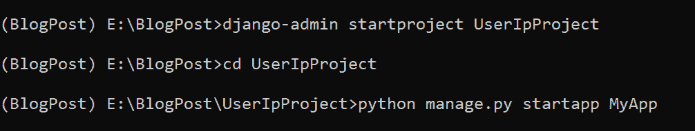
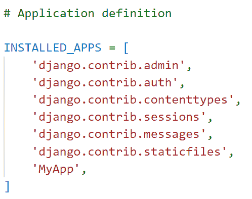
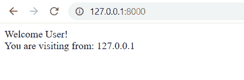

# 如何在 Django 中获取用户 IP 地址

> 原文：<https://pythonguides.com/get-user-ip-address-in-django/>

[](https://sharepointsky.teachable.com/p/python-and-machine-learning-training-course)

在这个 [Python Django 教程](https://pythonguides.com/what-is-python-django/)中，我会用简单的步骤解释**如何在 Django** 中获取用户 IP 地址。

我最近使用 Django web 框架开发了一个项目，其中我需要用户的 IP 地址。因此，这里我们将介绍在 Django 中获取用户 IP 地址的步骤。

在这里我们将看到:

*   IP 地址及其用途
*   建立 Django 项目
*   获取 Django 中的用户 IP 地址
*   在 Django 中返回 HttpResponse

在本文的最后，您还可以下载代码来获取 Django 中的用户 IP 地址。

目录

[](#)

*   [如何获取 Django 中的用户 IP 地址](#How_to_get_user_IP_address_in_Django "How to get user IP address in Django")
    *   [IP 地址](#IP_Address "IP Address")
    *   [获取 Django 中的用户 IP 地址](#Get_user_IP_address_in_Django "Get user IP address in Django")
        *   [建立 Django 项目](#Set_up_Django_Project "Set up Django Project")
        *   [查看获取 Django 中的用户 IP 地址](#View_to_get_user_IP_address_in_Django "View to get user IP address in Django")
        *   [执行 Django 应用程序](#Execute_Django_Application "Execute Django Application")
*   [下载 Python Django 的完整代码获取 IP 地址](#Download_complete_code_of_Python_Django_get_IP_address "Download complete code of Python Django get IP address")
*   [结论](#Conclusion "Conclusion")

## 如何获取 Django 中的用户 IP 地址

现在，我们先来了解一下什么是 IP 地址，一步一步的学习在 Django 中获取用户的 IP 地址。

### IP 地址

> IP 地址代表 ***【互联网协议地址】***

一般来说， **IP 地址**是分配给网络设备的号码，用于该设备的识别和定位。基本上，计算机使用 IP 地址在不同的网络和互联网上相互连接。

所有类型的网络设备都会收到一个 IP 地址。它可能是一个网站、照相机、笔记本电脑、桌面设备，甚至是可以连接到互联网的儿童玩具。

阅读: [Python Django 格式日期](https://pythonguides.com/python-django-format-date/)

### 获取 Django 中的用户 IP 地址

现在，我们将看到一个在 Django 中获取用户 IP 地址的例子。

#### 建立 Django 项目

打开终端，键入以下命令开始一个 Django 项目。本例中的 Django 项目名为 `UserIpProject` 。

```py
django-admin startproject UserIpProject
```

它将创建一个名为 `UserIpProject` 的文件夹，并在终端中键入以下命令来访问该项目。

```py
cd UserIpProject
```

通过在终端中输入以下命令，我们可以在这个项目文件夹中创建一个名为 `MyApp` 的 Django 应用程序。

```py
python manage.py startapp MyApp
```



Set up Project in Django

将应用名称添加到位于 `settings.py` 文件中的 `INSTALLED_APP` 列表中，以激活该应用。



Settings.py

Django 自动将一个 `urls.py` 文件包含在项目目录中，以便将新创建的应用程序映射到其中。为此，请将下面的代码添加到其中。

```py
from django.contrib import admin
from django.urls import path,include

urlpatterns = [
    path('admin/', admin.site.urls),
    path('',include('MyApp.urls')),
]
```

阅读: [Python Django 设置时区](https://pythonguides.com/python-django-set-timezone/)

#### 查看获取 Django 中的用户 IP 地址

要定义应用程序的主要逻辑，打开 `views.py` 文件并添加下面给出的代码。

```py
from django.shortcuts import HttpResponse

# Create Viewe

def ipaddress(request):
    user_ip = request.META.get('HTTP_X_FORWARDED_FOR')
    if user_ip:
        ip = user_ip.split(',')[0]
    else:
        ip = request.META.get('REMOTE_ADDR')

    return HttpResponse("Welcome User!<br>You are visiting from: {}".format(ip))
```

创建一个名为 `ipaddress` 的视图，它将获取用户的 IP 地址。然后，要获得客户端的 IP 地址，使用 `HTTP_X_FORWARDED_FOR` 变量。

当用户通过代理或负载平衡器时，它存储 IP 地址。为了获得本地客户端的 IP 地址，它将使用 `REMOTE_ADDR` 并返回 `127.0.0.1` 。

现在，为了调用视图，我们必须将视图映射到 URL，因此我们必须在 app 目录中创建一个名为 `urls.py` 的文件。在其中包含以下代码。

```py
from django.urls import path
from . import views

urlpatterns = [
path('', views.ipaddress, name='ipaddress'),
]
```

阅读: [Python Django 过滤器](https://pythonguides.com/python-django-filter/)

#### 执行 Django 应用程序

要启动开发服务器，请在终端中键入下面给出的命令。

```py
python manage.py runserver
```

它将打开，页面有用户的 IP 地址。



User’s IP Address

太好了！！！！我们现在可以看到我们正在使用 localhost。

这就是我们如何获得 Django 用户的 IP 地址。

## 下载 Python Django 的完整代码获取 IP 地址

代码如下:

[Django Get IP Address](https://pythonguides.com/wp-content/uploads/2023/01/UserIpProject.zip)

## 结论

这样，我们就成功地创建了一个 Django 项目来获取用户的 IP 地址。我们还学习了 IP 地址的含义及其用法。

此外，我们还讨论了以下主题。

*   IP 地址及其用途
*   建立 Django 项目
*   获取 Django 中的用户 IP 地址
*   在 Django 中返回 HttpResponse

您可能也喜欢阅读下面的 Python Django 教程。

*   [Python Django group by](https://pythonguides.com/python-django-group-by/)
*   [Python Django 长度过滤器](https://pythonguides.com/python-django-length-filter/)
*   [Python 过滤器不在 Django 中](https://pythonguides.com/filter-not-in-django/)

[Tanya Puri](https://pythonguides.com/author/tanya/)

拥有丰富 Django 和 Matplotlib 经验的 Python 开发人员，目前在 TSInfo Technologies 工作。我正在成为专业程序员、博客写手和 YouTuber 的路上。